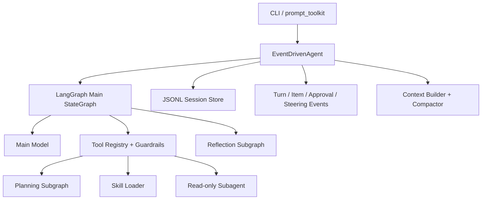
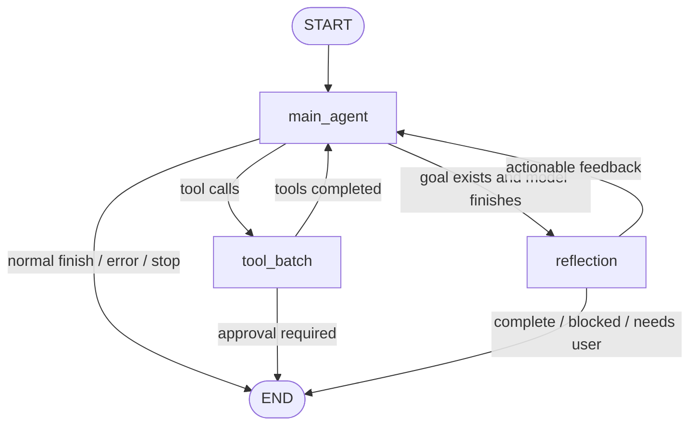
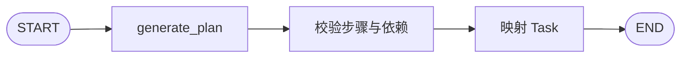
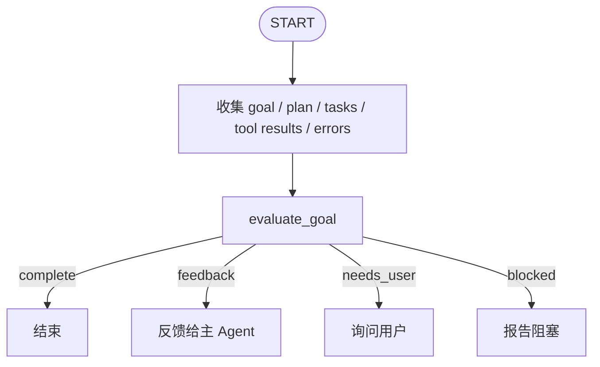
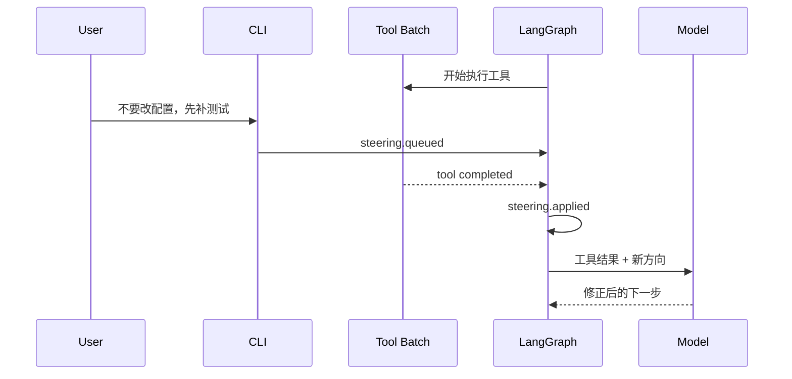

# InnoAgent

InnoAgent 是一个基于 **LangGraph** 的本地 coding agent。它以 Codex CLI、Claude Code、pi 和 OpenCode 为产品与工程参考，目标是在清晰的状态图上组合模型推理、工具执行、权限审批、计划、反思、上下文压缩、Skills、Subagent 和执行中用户纠偏。

当前版本不是对现有产品的 UI 复制，而是一个可运行、可测试、可继续演进的 Agent runtime 基线。

项目的设计原理、实现边界与生产演进路线见 [Agent 工程知识库](assert/knowledge/README.md)。该知识库由“Agent 技术路线图”结合当前代码重构而成，聚焦可执行的工程结论。

## 核心能力

- LangGraph 主状态图与 Planning、Reflection 子图。
- OpenAI-compatible Responses API 和 SSE 流式事件。
- `read`、`write`、`ls`、`grep`、`shell`、`plan`、`task`、`skill`、`subagent`。
- 独立只读工具并行执行，写工具和 shell 串行执行。
- `ask`、`auto`、`readonly` 权限模式。
- 允许一次、当前仓库一直允许、拒绝三种审批选择。
- Goal、Plan、Task 和自动 Reflection 闭环。
- 自动/手动上下文压缩、压缩比例和 token/context usage。
- JSONL session、重命名、恢复和列表。
- 渐进式 Skills 与隔离的只读 Subagent。
- 执行中 steering：工具运行时可以继续输入新的方向。
- Codex 风格的 prompt_toolkit 内联 TUI、slash 补全、语义化事件流和持续可用输入框。

## 整体架构



代码结构：

```text
core/
├── agent/
│   ├── graph.py               主 LangGraph 与 Command 路由
│   ├── react.py               Runtime 服务和图节点实现
│   ├── model_stream.py        模型事件归一化
│   ├── stages.py              Plan / Reflection 子图
│   └── subagent.py            隔离的只读子 Agent
├── config/permissions.py      仓库权限规则
├── event/events.py            稳定事件模型
├── planning/                  Plan / Task 数据与校验
├── reflection/                Reflection schema 与 fallback
├── session/                   context / compression / JSONL
├── skill/loader.py            Skill 渐进加载
├── tool/                      工具与并行调度
└── prompts.py                 集中的系统阶段提示词
view/
├── cli.py                     异步 REPL 与 slash 命令
├── render.py                  事件和状态渲染
├── terminal.py                内联 Prompt、输入调度和线程安全输出
├── tui_render.py              TUI 事件与状态展示模型
└── tui_theme.py               颜色主题与语义高亮
```

## 主 Agent

主 Agent 是唯一负责执行任务的控制平面。它不是一个手写的隐藏循环，而是一个 LangGraph `StateGraph`。



`main_agent` 节点负责：

1. 组装当前 session context。
2. 调用主模型并处理 message、reasoning、tool call 和 usage 事件。
3. 将多个 tool call 组成有序 batch。
4. 根据结果通过 LangGraph `Command` 跳转到工具、Reflection 或结束。
5. 防止相同工具调用无限循环，并执行 iteration/stop 检查。

`tool_batch` 节点负责：

1. 参数校验、路径限制和权限 preflight。
2. 并行执行独立只读工具。
3. 串行执行写工具和 shell。
4. 产生结构化 tool result。
5. 在工具批次完成后应用默认用户纠偏。

## Plan 模式

Plan 是显式工具，也是独立 LangGraph 子图：



主模型在任务需要拆解时调用 `plan`。Planning 子图接收：

- 当前 goal
- 已有计划
- Reflection feedback

模型需要输出结构化步骤。系统会校验空计划、未知依赖和循环依赖；修订时保留已经完成的步骤。模型不可用或 JSON 不合法时，使用确定性 fallback，并向主 Agent 返回 warning。

Plan 模式只负责“制定和修订计划”，不直接修改文件或执行 shell。计划产生后，控制权回到主 Agent。

## Reflection 模式

设置 goal 后，主模型准备结束时必须进入 Reflection 子图：



Reflection 返回：

```json
{
  "complete": false,
  "confidence": 0.8,
  "summary": "",
  "feedback": "",
  "needs_user": false,
  "blocked": false,
  "missing_conditions": [],
  "evidence": []
}
```

Reflection 只根据证据判断，不执行工具。未完成且仍可推进时，feedback 会作为新上下文交还主 Agent；确实需要用户输入或环境无法推进时，当前 turn 才会结束。

## 执行中用户纠偏

TTY 中 Agent 执行时输入框不会被锁死。用户可以直接输入新的方向：



支持三种输入：

- 直接输入文本：默认 `after_tool`。
- `/steer <instruction>`：默认等待下一批工具完成。
- `/steer now <instruction>`：在下一个 LangGraph 节点边界立即注入。
- `/stop`：当前模型或工具返回后，在安全边界停止。

默认不强杀正在执行的工具，因为这可能留下半写入文件或未清理的子进程。如果本轮没有后续工具，排队的纠偏会在最终回答或 Reflection 前应用，不会丢失。

## 事件模型

事件采用接近 Codex 的 turn/item/call 生命周期：

```text
turn.started
item.started
item.delta
item.completed
approval.requested
approval.resolved
steering.queued
steering.applied
steering.stop_requested
steering.stopped
context.compaction.started
context.compaction.completed
turn.completed
turn.failed
```

`item.delta` 仅用于流式显示，completed、审批、纠偏、压缩和 turn 事件写入 JSONL。

## 权限与安全

- `ask`：写文件和 shell 前询问，默认模式。
- `auto`：不逐次询问，但路径边界和持久 deny 仍生效。
- `readonly`：阻止写工具和 shell。
- `allow_once`：仅批准当前调用。
- `allow_always`：规则写入 `.innoagent/permissions.json`。
- `deny`：不执行，并把拒绝结果返回模型。

文件工具只能访问配置的 workspace。shell 仍使用系统 shell，不是容器或 OS 级沙箱；`auto` 模式只应在可信仓库使用。

## Context、压缩和 Usage

Context 包含 system prompt、最近完整 turn、压缩摘要、goal、plan/tasks、Skill 索引和激活的 Skill。

达到预算阈值后，旧历史会被结构化摘要替换，同时保留最近完整用户轮次。压缩事件包含：

```text
tokens_before
tokens_after
compression_ratio
trigger
```

Usage 汇总主模型、Planning、Reflection、Compaction 和 Subagent 的 input/output/reasoning tokens。

## Skills 与 Subagent

Skill 搜索顺序：

1. `<repo>/.innoagent/skills/`
2. `<repo>/.agents/skills/`
3. `~/.innoagent/skills/`
4. `~/.agents/skills/`

启动时只提供 Skill 的名称、描述和路径。调用 `skill` 或执行 `/skill` 后才加载正文。

Subagent 不继承父 Agent 的消息历史，默认仅能使用 `read`、`ls`、`grep`，不能递归创建 Subagent。

## 安装

要求 Python 3.10+，推荐使用 [uv](https://docs.astral.sh/uv/)：

```bash
uv sync
uv run python main.py
```

模型配置读取顺序：

1. 当前仓库 `.innoagent/config.json`
2. `OPENAI_API_KEY`、`OPENAI_BASE_URL`、`OPENAI_MODEL`、`INNOAGENT_REASONING_EFFORT`
3. `~/.innoagent/config.json`
4. 首次启动交互配置

```json
{
  "api_key": "...",
  "base_url": "https://api.openai.com/v1",
  "model": "gpt-5",
  "reasoning_effort": "medium"
}
```

## Slash 命令

真实终端默认进入蓝色内联 TUI；输入框与状态栏固定在终端底部，模型和工具事件写入上方原生 scrollback。它不切换到 alternate screen，因此历史输出可以直接用鼠标选择和复制。管道、CI 或传入自定义 input/output adapter 时自动回退为普通文本模式。

```text
• InnoAgent
  gpt-5 · medium · ~/project · ask

› You
  修复当前测试

↳ Tool · read
  path=test/example.py
✓ read · success
  读取完成

• Agent
  已定位并修复问题。

╭────────────────────────────────────────────────────────────────╮
│ › Ask InnoAgent to do anything                                 │
╰────────────────────────────────────────────────────────────────╯
 gpt-5 medium · ~/project · ask · 1,240 tokens · 42% ctx · Ready
```

模型文本、Thinking、工具调用和结果、Planning、Reflection、压缩及 steering 事件按时间写入原生终端滚动区。输出区继承用户终端背景，蓝色输入框与深蓝底栏只占底部交互区域。底栏展示模型、工作区、权限模式、累计 token、上下文比例、Goal、任务进度和活动状态。Agent 执行时输入提示自动切换为 `steer ›`；等待审批时展示操作摘要和三个选项，并切换为 `approve ›`。prompt_toolkit 不接管鼠标，因此选择、复制和终端滚动保持原生行为。

快捷键：

- `Enter`：发送任务、纠偏或审批选项。
- `Tab`：补全 slash 命令。
- `Ctrl-C`：请求在安全边界停止当前 turn；空闲时清空输入框。
- `Ctrl-L`：清空当前终端可见区域，不删除 session 数据。
- `F1`：显示命令帮助。
- `Ctrl-Q` / 空输入时 `Ctrl-D`：退出。

```text
/help                         帮助
/status                       session、goal、model、mode、usage
/context                      context window 使用量
/goal <text|off>              设置或清除 goal
/plan                         显示计划
/tasks                        显示任务
/compact [focus]              手动压缩
/permissions                  显示持久权限
/mode ask|auto|readonly       权限模式
/approve once|always|deny     处理审批
/model <name> [effort]        修改模型
/tools                        工具列表
/skills                       Skill 列表
/skill <name>                 激活 Skill
/steer [now] <instruction>    执行中纠偏
/new                          新 session
/resume [session_id]          恢复 session
/sessions                     session 列表
/rename <name>                重命名
/clear                        清除当前 UI session
/stop                         安全边界停止
/quit                         退出
```

## 测试

```bash
uv run python -m unittest discover -s test -v
python3 -m compileall -q core view main.py test
```

测试覆盖 LangGraph 主图与子图、Responses API SSE、多工具调用、并行执行、权限审批、session 恢复、Planning、Reflection、Skills、Subagent、上下文压缩、token usage、执行中 steering 和 CLI。
