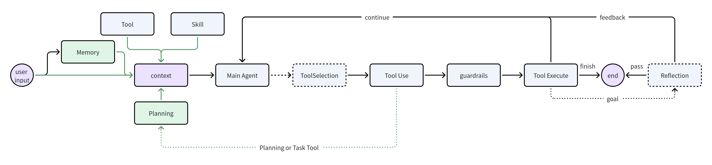

# InnoAgent

极简风格Agent, 核心状态机如图
```text
                         START
                           │
                           ▼
                    ┌─────────────┐
                    │   Execute   │◄─────────────────────┐
                    └──────┬──────┘                      │
                           │                             │
              ┌────────────┼────────────┐                │
              │            │            │                │
              ▼            ▼            ▼                │
           Tool Use      Planning    Reflection           │
              │            │            │                │
              └────────────┴────────────┘                │
                           │                             │
                           ▼                             │
                    ┌─────────────┐                      │
                    │   Continue  │──────────────────────┘
                    │   Execute    │
                    └──────┬──────┘
                           │
                           ▼
                      Goal Met?
                       /     \
                     Yes      No
                     /         \
                    ▼           └──────────────► Execute
                   END
```

主Agent始终负责执行, Planning和Reflection分别作为可选工具和设置完goal后的额外环节

## Agent Loop



Agent Loop
1. User Input 进入, 经过Memory召回, 组成最终Query
2. 与Session上下文, Tool, Skill等内容组装出最终Context
3. 将Context交给Supervisor, 根据需要调用各类Tool
4. 如果Tool总量较多, 不会一次性披露, 而是仅给出Tool Search工具用于查询相关工具
5. Tool Call后实际执行前, 会通过guardrail判断执行方式
6. Tool Call后, 如果没设置goal, 自行结束; 若设置则会通过reflection判断是否完成, 没有完成会给出feedback, 然后继续进行
7. Planning Tool 执行后, 会进入Plan模式, 通过planner完成计划设计

## Run

```bash
python3 -m pip install --user 'langgraph>=0.2,<1' 'pydantic>=2,<3'
python3 main.py
```

启动时会按以下顺序读取 OpenAI-compatible 模型配置：

1. 当前目录 `.innoagent/config.json`
2. 环境变量 `OPENAI_API_KEY`、`OPENAI_BASE_URL`、`OPENAI_MODEL`
3. 全局 `~/.innoagent/config.json`

都没有时，程序会交互式询问 API Key、Base URL 和模型名，并让用户选择保存到
当前项目或全局目录。

模型调用使用 OpenAI Responses API（`/responses`）并通过 SSE 流式输出；
同时已屏蔽 LangGraph/LangChain 的 `allowed_objects` pending-deprecation 导入警告。

常用命令：

```text
/goal 创建 app.py 并打印 Hello, InnoAgent
创建 app.py 并打印 Hello, InnoAgent
/status
/plan
/resume
/quit
```
