# Agent 架构

> 导航：[总目录](../README.md) | [控制平面](README.md) | [任务规划](02-任务规划与推理.md) | [状态管理](../02-数据平面/04-状态管理与持久化.md) | [工具调用](../03-执行平面/01-工具调用与协议.md) | [运行时](../03-执行平面/04-Agent运行时与平台工程.md) | [评测](../04-保障平面/01-Agent评测.md) | [安全治理](../04-保障平面/03-安全权限与治理.md)

> 调研基线：2026-08-05。本章讨论架构原则和生产实现，不把某个框架的 API 当作架构本身。

## 0. 本章怎么读

Agent 架构不是“选 LangGraph、OpenAI Agents SDK 还是 AutoGen”，而是回答下面的问题：

1. 用户的开放目标如何变成有边界、可验证的任务契约？
2. 哪些决定由模型做，哪些必须由确定性代码、策略引擎或人工控制？
3. 一次任务由哪些对象组成，如何记录因果关系、版本和状态？
4. 模型输出如何经过校验、授权、执行、观察和验证形成闭环？
5. 任务跨分钟、小时甚至数天时，如何暂停、恢复、取消和升级？
6. 工具成功但目标未完成、外部副作用结果未知、Agent 无进展时怎么办？
7. 模型、Prompt、工具 Schema、工作流和策略变化后，旧任务如何继续？

### 0.1 最需要掌握的八个重点

| 优先级 | 重点 | 为什么重要 | 掌握标准 |
|---|---|---|---|
| P0 | 确定性与概率性边界 | LLM 不应拥有权限、事务和最终业务真值 | 能逐节点说明“模型决定什么，代码保证什么” |
| P0 | Goal Contract | 开放目标若没有约束和验收标准，系统无法安全终止 | 能设计目标、约束、预算、风险和验收 Schema |
| P0 | 结构化控制循环 | 自然语言不能直接作为可执行指令 | 能实现 Decide -> Validate -> Authorize -> Execute -> Verify |
| P0 | Verifier/Test Oracle | 工具返回成功不等于业务目标达成 | 能按环境真值、规则、独立模型、自评设计验证层次 |
| P0 | 状态、事件与幂等 | 崩溃恢复和重复投递是生产常态 | 能解释 Checkpoint、Event、Operation ID 和未知结果对账 |
| P1 | 长任务生命周期 | 等待人工、限流、异步工具会突破单次 HTTP 生命周期 | 能设计等待、恢复、取消、超时和跨版本迁移 |
| P1 | 架构模式选择 | 不是所有问题都需要开放式 Agent 或多 Agent | 能用不确定性、风险、时长、并行度选择模式 |
| P1 | 可观测与版本治理 | 无 Trace、版本快照和回放就无法定位退化 | 能把一次 Run 还原到模型、Prompt、工具和策略版本 |

### 0.2 一句话结论

```text
生产级 Agent = 受约束的决策策略 + 结构化状态 + 可控执行环境
             + 可验证反馈闭环 + 持久化运行时 + 安全与观测
```

模型负责处理不确定性，系统负责约束不确定性。Agent 的价值不在于“自主调用更多工具”，而在于能在环境反馈下持续选择动作，同时不突破权限、预算和风险边界。

---

## 1. 概念边界：先分清 Model、Workflow、Agent、Runtime 和 Harness

### 1.1 核心对象

| 概念 | 定义 | 是否维护状态 | 是否主动作用环境 | 典型例子 |
|---|---|---:|---:|---|
| Model | 从输入上下文生成输出的概率模型 | 否，单次调用本身无持久状态 | 否 | LLM、VLM、Embedding Model |
| Chain | 固定顺序的模型或函数调用 | 可选 | 通常有限 | 提取 -> 改写 -> 总结 |
| Workflow | 由代码预先定义节点、分支和转换 | 是 | 是 | 审批流、工单流、发布流 |
| Agent | 根据目标、状态和环境观察，在运行时选择下一动作 | 是 | 是 | 研究 Agent、代码 Agent、客服处置 Agent |
| Runtime | 承载任务、队列、状态、工具、恢复、预算和观测的执行系统 | 是 | 间接 | Durable Workflow + Worker + State Store |
| Harness/ACI | 模型与计算机环境之间的接口和约束层 | 可选 | 是 | 工具描述、文件接口、终端、浏览器观察格式 |
| Application | 面向用户的完整产品和业务系统 | 是 | 是 | 智能客服、投研助手、研发 Agent 平台 |

容易混淆的边界：

- “调用了工具”不自动等于 Agent。固定的检索再总结仍可能只是 Workflow。
- “有循环”也不自动等于生产级 Agent。没有状态、预算、验证和恢复的循环只是 Demo。
- Workflow 和 Agent 不是二选一。最常见的生产形态是确定性工作流中嵌入少量 Agentic Node。
- Multi-agent 不是更高级的默认答案。它是上下文、权限、并行性或组织边界确实需要隔离时的架构选择。

### 1.2 Agent 的形式化抽象

可把 Agent 看作在时刻 `t` 根据目标、状态和观察选择动作的策略：

```text
a_t = Policy(goal, constraints, state_t, observation_t, context_t, budget_t)
state_(t+1) = Transition(state_t, validated_action_t, environment_result_t)
```

其中：

- `Policy` 可以是 LLM、规则、搜索算法或它们的组合。
- `Action` 必须是版本化的结构化对象，而不是直接执行自然语言。
- `Transition` 应由运行时控制，模型只能提出状态修改意图。
- `Environment Result` 是外部世界返回的事实，不能被模型的推测替代。
- `Goal Reached` 必须由验收条件或 Verifier 判定，不能只看模型说“完成了”。

### 1.3 五类状态不要混用

| 状态类型 | 内容 | Source of Truth | 常见错误 |
|---|---|---|---|
| Conversation State | 消息、当前轮输入、展示内容 | 会话存储 | 把对话历史当任务数据库 |
| Task State | 目标、步骤、依赖、预算、当前节点 | 工作流/任务存储 | 只在 Prompt 中维护进度 |
| Domain State | 订单、工单、代码仓库、支付状态 | 业务系统 | 用 Agent 内部推断覆盖业务真值 |
| Artifact State | 文件、报告、补丁、截图、索引 | Artifact Store | 把大文件塞进上下文或 Checkpoint |
| Memory | 跨任务可复用的事实、偏好和经验 | Memory Store | 未验证信息永久写入记忆 |

状态实现详见[状态管理与持久化](../02-数据平面/04-状态管理与持久化.md)，记忆写入和遗忘策略详见[记忆系统](../02-数据平面/02-记忆系统.md)。

---

## 2. 从 Goal Contract 开始，而不是从 Prompt 开始

### 2.1 为什么需要目标契约

“帮我解决这个客诉”对人类是自然表达，对运行时却是不完整任务。系统至少不知道：允许退款多少、能否直接发邮件、何时必须人工审批、什么算解决、最多花多少钱、用户失联后怎么办。

Goal Contract 是用户意图进入 Agent 后形成的受控任务边界。它同时服务于规划、授权、预算、验证、终止和审计。

### 2.2 推荐 Schema

```yaml
goal_contract:
  schema_version: goal-contract/v1
  goal_id: goal_01J...
  tenant_id: tenant_acme
  principal:
    user_id: user_123
    delegated_roles: [support_agent]

  objective: "解决订单 O-2026-1024 的重复扣费投诉"
  deliverables:
    - type: case_resolution
      required_fields: [root_cause, action_taken, evidence]
    - type: customer_message_draft

  constraints:
    hard:
      - "不得暴露其他客户信息"
      - "退款总额不得超过订单实付金额"
      - "未经审批不得实际发送外部消息"
    soft:
      - "优先在 15 分钟内完成"

  assumptions:
    - id: assumption_1
      statement: "投诉人是订单所有者"
      confidence: 0.62
      must_verify_before: [refund, disclose_order_detail]

  acceptance_criteria:
    - id: ac_1
      type: environment_assertion
      expression: "payment.duplicate_charge == true"
    - id: ac_2
      type: environment_assertion
      expression: "refund.status in ['succeeded', 'not_required']"
    - id: ac_3
      type: human_approval
      approver_role: support_lead

  side_effect_policy:
    read_only_tools: [order.read, payment.read]
    reversible_tools: [ticket.update_draft]
    approval_required: [payment.refund, email.send]
    forbidden_tools: [customer.export_all]

  budget:
    max_model_tokens: 120000
    max_tool_calls: 30
    max_steps: 18
    max_cost_usd: 3.00
    deadline: "2026-08-05T12:30:00+08:00"

  escalation_policy:
    on_missing_identity: ask_user
    on_policy_conflict: human_review
    on_unknown_side_effect: reconcile_then_human
    on_budget_exhausted: return_partial_with_evidence

  stop_conditions:
    success: [all_acceptance_criteria_passed]
    safe_stop: [cancelled, deadline_exceeded, policy_blocked]
```

### 2.3 目标契约的校验规则

1. 每个可交付物必须有可检查的完成定义。
2. 硬约束不能由模型自行放宽，软约束可以在记录原因后权衡。
3. 未验证假设必须带置信度和“最晚在何动作前验证”。
4. 高风险动作必须能追溯到授权主体、审批规则和业务依据。
5. 成功条件、失败条件和安全停止条件必须分开。
6. 预算耗尽不是成功，也不应自动归类为系统错误。
7. 目标冲突时必须澄清或升级，不能让模型暗中选择一个目标。

### 2.4 需求澄清不是所有输入都问一遍

运行时应区分三类缺失信息：

| 缺失类型 | 处理方式 | 例子 |
|---|---|---|
| 阻塞且不可安全推断 | 立即询问 | “转多少钱”缺少金额 |
| 可通过只读工具验证 | 先查询 | 订单状态、仓库默认分支 |
| 可使用低风险默认值 | 采用默认并披露 | 报告格式默认 Markdown |

好的 Agent 不是“永远自主”，也不是“遇到任何不确定性都问用户”，而是让澄清成本和错误风险匹配。

---

## 3. 自主性不是开关，而是风险分级

### 3.1 四级动作风险

| 等级 | 动作特征 | 示例 | 默认控制 |
|---|---|---|---|
| L0 观察 | 只读、无敏感数据扩散 | 搜索公开网页、读取允许的工单 | Schema 校验、审计 |
| L1 可逆修改 | 影响局部且可回滚 | 更新草稿、创建临时分支 | 幂等、版本检查、自动验证 |
| L2 外部影响 | 会通知他人或改变业务状态 | 发邮件、提交 PR、修改工单状态 | 预览、审批或策略授权、后置验证 |
| L3 高风险/不可逆 | 财务、生产、删除、法律后果 | 退款、生产发布、删除数据 | 强身份、双重确认、最小权限、独立审批 |

风险不是只按“工具名”判断，还要结合参数和上下文。例如 `refund(amount=1)` 与 `refund(amount=100000)` 风险不同；`email.send` 发给本人和群发外部客户风险不同。

### 3.2 风险决定架构要求

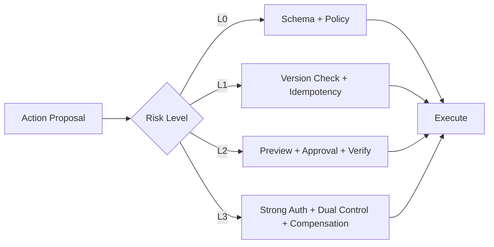

自主性应按动作动态收缩：Agent 可以自主调研和生成退款建议，但实际退款需要审批；可以自主修改临时分支，但不能自主发布生产。

### 3.3 控制权连续谱

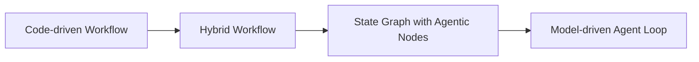

| 形态 | 控制权 | 优点 | 代价 | 推荐场景 |
|---|---|---|---|---|
| Code-driven Workflow | 代码定义路径和分支 | 可预测、易测试、强合规 | 对未知情况适应弱 | 结算、审批、固定工单 |
| Hybrid Workflow | 代码控制阶段，模型处理局部不确定性 | 风险与灵活性平衡 | 需设计节点契约 | 大多数企业 Agent |
| State Graph | 图控制状态，部分边由模型选择 | 可恢复、可审计、支持人工 | 状态设计成本高 | 长任务、复杂业务流程 |
| Model-driven Loop | 模型每轮决定下一步 | 适合开放环境 | 循环、成本和不可预测性高 | 研究、探索、开发辅助 |

默认从左向右逐步增加自主性。只有当前一级无法覆盖真实任务时，才引入更开放的控制权。

---

## 4. 架构模式谱系与适用边界

Anthropic 的工程总结把常见组合拆为 Prompt Chaining、Routing、Parallelization、Orchestrator-Workers 和 Evaluator-Optimizer，并强调先用最简单方案。生产设计还需加入 ReAct、Planner-Executor、State Graph 和 Event-driven Long-running Agent。

### 4.1 Prompt Chaining

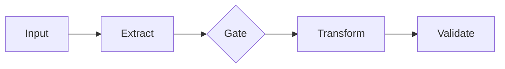

适合任务能稳定分解、前一步输出可被确定性检查的场景。优点是易调试、每一步 Prompt 聚焦；缺点是错误会级联，路径对异常输入适应弱。

设计要点：

- 每个步骤使用结构化输入输出，不传递未经约束的大段自由文本。
- 在关键步骤之间设置 Gate，不要等最终结果才发现第一步提取错误。
- 对步骤独立评测，并监控错误在链上的放大倍数。

### 4.2 Routing

Router 根据请求选择领域、技能、模型或工作流。Router 本身不应承担完整任务执行。

```text
Request -> Intent/Capability Router -> Selected Workflow/Agent -> Result
```

关键问题不是 Closed-set 分类准确率，而是 Unknown、Multi-intent、低置信度和路由错误成本。详细内容见[意图识别与请求路由](03-意图识别与请求路由.md)。

### 4.3 Parallelization

并行有两种主要形态：

| 形态 | 做法 | 适用场景 | 汇总难点 |
|---|---|---|---|
| Sectioning | 把不同子问题并行处理 | 多来源调研、独立文件分析 | 去重、冲突和覆盖率 |
| Voting | 同一问题生成多个候选 | 安全审查、开放文本判断 | 错误相关性、仲裁成本 |

只有真正无依赖、资源不冲突的步骤才能并行。把有隐式依赖的任务强行并行会得到更快但不一致的结果。

### 4.4 Orchestrator-Workers

Orchestrator 在运行时拆分子任务，Worker 各自执行，最后汇总。它与固定 Parallelization 的区别是子任务数量和内容不可预先完全枚举。

适合：代码库修改、多文档研究、动态数据分析。主要风险是主管成为瓶颈、拆分遗漏、重复工作、结果合并冲突和总成本失控。

Worker 不一定是独立 Agent。若只是执行确定性函数，使用普通 Worker 更简单。只有 Worker 需要独立上下文、工具和动态决策时才有必要 Agent 化。

### 4.5 Evaluator-Optimizer

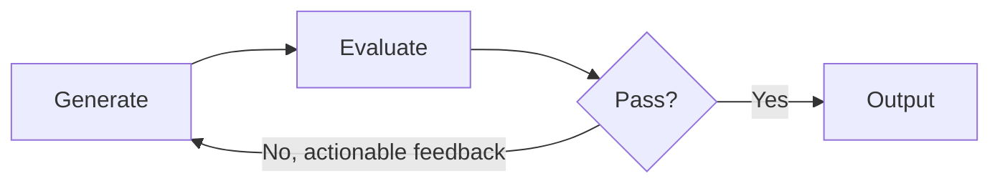

适合验收标准清楚、反馈能指导下一轮改进的任务，例如代码测试、文案风格、结构完整性。若评估器只能给“还不够好”这类模糊意见，循环只会增加成本。

必须设置最大轮数、最低进步阈值和候选保留策略。Evaluator 也需要独立评测，不能默认 Judge 永远正确。

### 4.6 ReAct

ReAct 交替进行推理和行动，使模型能根据工具观察调整下一步。工程实现不需要暴露或保存冗长思维链，应保存结构化的决策摘要、行动理由和证据引用。

适合：短到中等长度、环境反馈频繁、无法预先列出完整路径的任务。弱点是局部最优、重复调用、上下文膨胀和停止困难。

### 4.7 Planner-Executor

Planner 生成全局或阶段计划，Executor 执行步骤，并在假设失效或里程碑后重规划。

适合：依赖关系明显、任务较长、可把中间结果持久化的场景。不要一次生成几十步后机械执行到底；更稳健的是滚动规划：只细化近期步骤，远期保留里程碑。

规划算法、反思和搜索方法详见[任务规划与推理](02-任务规划与推理.md)。

### 4.8 State Graph

State Graph 把任务表示为节点、条件边、状态和中断点。它适合需要审批、暂停、恢复、回放和显式失败分支的流程。

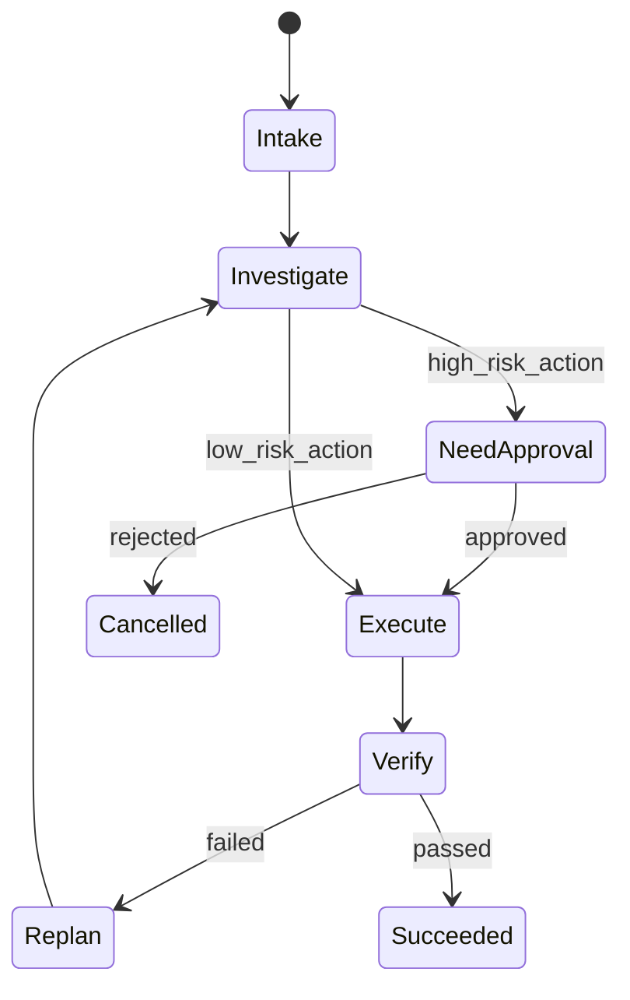

状态图不是把 Prompt 节点画成图就完成了。每条边都应有守卫条件，每个节点都应定义输入、输出、幂等语义、超时和失败去向。

### 4.9 Event-driven Long-running Agent

任务不持续占用进程，而是在事件到来时推进：工具回调、审批完成、定时器到期、外部数据更新都可以唤醒任务。

适合跨小时或数天、包含人工和异步系统的任务。核心难点不是 LLM，而是重复事件、乱序、超时、版本迁移、取消传播和副作用一致性。

### 4.10 Multi-agent

引入多个 Agent 的合理理由包括：

- 上下文需要隔离，单 Agent 无法高质量处理所有领域。
- 不同角色需要不同权限、工具或模型。
- 子任务真实可并行，且结果可以可靠合并。
- 组织或安全边界要求独立责任主体。

“模拟一个团队”不是充分理由。若单 Agent 基线都没有稳定评测，多 Agent 只会放大错误和成本。详见[多 Agent 协作](05-多Agent协作.md)。

---

## 5. 生产参考架构

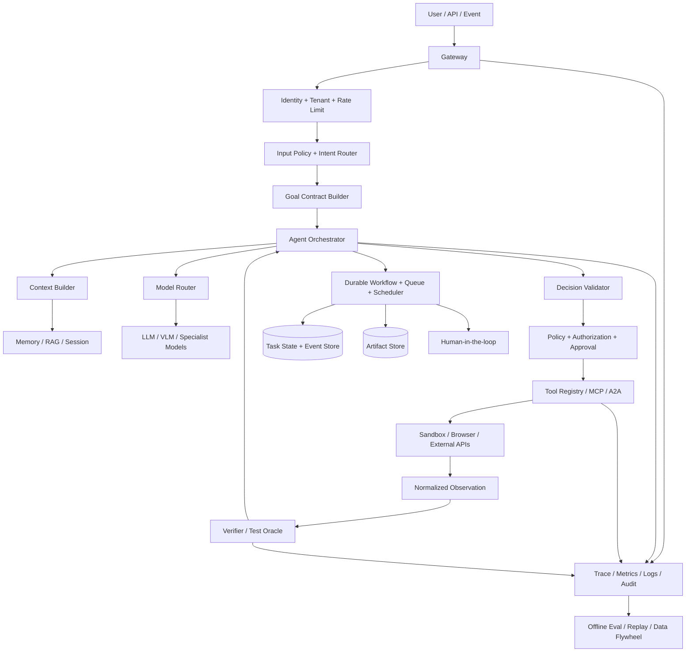

### 5.1 各层职责

| 层 | 负责 | 不负责 |
|---|---|---|
| Gateway | 身份、租户、限流、请求协议 | 任务规划 |
| Goal Contract | 固化目标、约束、预算、验收 | 直接执行工具 |
| Orchestrator | 推进控制循环、调度步骤 | 绕过权限系统 |
| Context Builder | 按当前决策构造最小充分上下文 | 永久保存所有状态 |
| Model Router | 选择模型、Fallback、成本质量平衡 | 决定业务权限 |
| Decision Validator | Schema、类型、前置条件校验 | 代替业务审批 |
| Policy/Authorization | 工具级和参数级授权、审批 | 生成开放式方案 |
| Tool/Sandbox | 执行动作并返回可观测结果 | 判断最终目标完成 |
| Verifier | 检查步骤和目标验收条件 | 修改事实以适配答案 |
| Durable Workflow | 队列、等待、恢复、重试、取消 | 承载大文件字节 |
| Observability | 还原因果链、指标和审计 | 充当业务 Source of Truth |

### 5.2 架构不变量

无论使用何种框架，建议维持以下不变量：

1. 模型不能直接持有生产凭据，工具执行层按任务注入短期授权。
2. 模型不能直接修改任务状态，只能返回 `Decision`，由运行时应用状态转换。
3. 每个外部副作用都有稳定 `operation_id` 和明确结果状态。
4. 每次 Run 固定版本快照，能够解释“当时用的是什么”。
5. 大文件以 Artifact 引用传递，不进入事件、Checkpoint 或完整 Prompt。
6. 高风险动作在执行前验证，业务目标在执行后再次验证。
7. 所有循环都有预算、无进展检测和安全停止路径。

---

## 6. Agent Harness 与 Agent-Computer Interface

### 6.1 Harness 为什么是架构核心

同一个模型在不同工具接口、观察格式、文件布局和反馈质量下，任务成功率可能有显著差异。SWE-agent 把这层称为 Agent-Computer Interface，强调模型如何读环境、执行动作和接收反馈本身就是系统设计问题。

Harness 主要包含：

- System Instructions 和行为边界。
- 可见工具及其 Schema、示例和风险元数据。
- 文件、终端、浏览器、数据库等环境接口。
- Observation 的截断、结构化、错误分类和证据引用。
- 上下文压缩、Artifact 访问、临时工作目录和凭据注入。
- 最大输出、命令超时、网络策略、资源限制和审批钩子。

### 6.2 Action 接口

模型应输出一个候选决策对象：

```json
{
  "schema_version": "decision/v2",
  "decision_id": "dec_01J...",
  "task_id": "task_01J...",
  "based_on_state_version": 17,
  "kind": "tool_call",
  "goal_link": "ac_2",
  "action": {
    "tool_name": "payment.get_charge_history",
    "tool_version": "2026-07-15",
    "arguments": {"order_id": "O-2026-1024"}
  },
  "expected_observation": {
    "type": "charge_history",
    "required_fields": ["charge_id", "amount", "status"]
  },
  "risk_claim": "L0",
  "decision_summary": "读取扣款记录以验证重复扣费假设",
  "on_failure": "classify_then_replan"
}
```

运行时必须拒绝以下决策：

- `based_on_state_version` 已过期。
- Tool Schema 不匹配或使用不存在的版本。
- 参数引用了当前任务不可见的资源。
- 模型声明的风险等级低于策略引擎计算结果。
- 动作与 Goal Contract 没有可解释关联。
- 预算不足或任务已取消。

### 6.3 Observation 接口

工具原始输出不应原样全部塞回模型。先标准化为带来源、完整性和截断信息的 Observation：

```json
{
  "schema_version": "observation/v1",
  "observation_id": "obs_01J...",
  "tool_call_id": "call_01J...",
  "status": "succeeded",
  "effect_status": "read_only",
  "data": {
    "charges": [
      {"charge_id": "ch_1", "amount": 199.0, "status": "captured"},
      {"charge_id": "ch_2", "amount": 199.0, "status": "captured"}
    ]
  },
  "evidence": [
    {"source": "payment-service", "record_version": 8821}
  ],
  "completeness": "complete",
  "truncated": false,
  "retryable": false,
  "observed_at": "2026-08-05T11:03:22+08:00"
}
```

若输出过大，应返回摘要、索引和 `artifact_id`，允许 Agent 按 Range、行号、页码或查询条件继续读取。大文件模式详见[工具调用与协议：Agent 如何读大文件](../03-执行平面/01-工具调用与协议.md#5-agent-如何读大文件)。

### 6.4 Progressive Disclosure

当系统有数百或数千工具时，不要把所有 Schema 放入上下文。推荐三阶段：

```text
Capability Catalog -> Tool Search/Select -> Load Exact Schema -> Execute
```

第一阶段只暴露能力摘要和领域；第二阶段按意图、权限和风险检索候选；第三阶段才加载完整 Schema、示例和约束。这样可以降低 Token、工具混淆和越权面。

海量工具检索、候选重排和失败熔断详见[工具调用与协议：大量工具如何检索](../03-执行平面/01-工具调用与协议.md#4-大量工具的发现检索与动态暴露)。

---

## 7. 运行时对象模型

### 7.1 对象关系

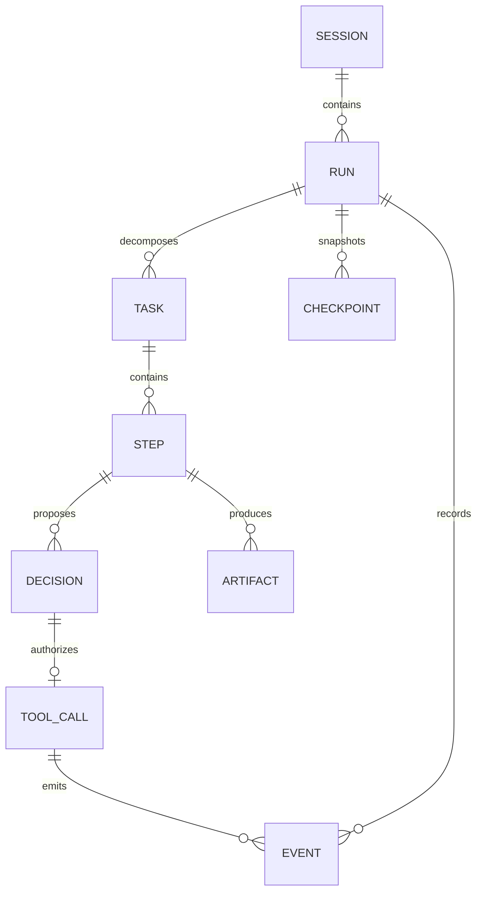

| 对象 | 作用 | 关键字段 |
|---|---|---|
| Session | 用户交互容器，可包含多次任务运行 | `session_id`、用户、租户、消息引用 |
| Run | 一次目标执行实例 | `run_id`、Goal Contract、版本快照、状态 |
| Task | 可调度的目标或子目标 | `task_id`、父任务、依赖、负责人、预算 |
| Step | 一次有限推进单元 | `step_id`、输入版本、成功标准、尝试次数 |
| Decision | 模型或规则提出的下一动作 | `decision_id`、状态版本、候选动作、理由摘要 |
| ToolCall | 经策略授权后的实际调用 | `tool_call_id`、`operation_id`、请求指纹、结果 |
| Event | 不可变的状态变化或环境事实 | `event_id`、类型、因果 ID、序号、时间 |
| Artifact | 大型或可复用产物 | `artifact_id`、版本、哈希、MIME、访问范围 |
| Checkpoint | 恢复所需状态快照 | `checkpoint_id`、状态版本、待处理等待、版本向量 |

### 7.2 ID 与因果关系

至少区分以下 ID：

```yaml
trace_id: trace_01J...          # 整条分布式链路
session_id: session_01J...      # 用户会话
run_id: run_01J...              # 一次执行
task_id: task_01J...            # 任务或子任务
step_id: step_0007              # 有限推进单元
decision_id: dec_01J...         # 候选决策
tool_call_id: call_01J...       # 一次调用尝试
operation_id: op_refund_...     # 跨重试稳定的业务操作
event_id: evt_01J...            # 不可变事件
causation_id: dec_01J...        # 直接导致当前事件的对象
correlation_id: task_01J...     # 需要聚合的一组事件
```

`tool_call_id` 每次尝试不同，`operation_id` 对同一业务意图跨重试保持稳定。混用二者会导致要么无法追踪重试，要么重复产生副作用。

### 7.3 Run 状态示例

```yaml
run:
  schema_version: run/v3
  run_id: run_01J...
  status: running
  goal_contract_ref: goal_01J...
  state_version: 17
  current_tasks: [task_investigate]
  waiting_on: []
  budgets:
    steps_used: 6
    tool_calls_used: 9
    model_tokens_used: 32210
    cost_usd_used: 0.84
  version_vector:
    agent: support-agent@4.2.1
    workflow: duplicate-charge@3.0.0
    prompt_bundle: sha256:7f...
    model_route: route-policy@12
    tool_catalog: catalog@2026-08-01
    policy: support-policy@19
    knowledge_index: support-kb@2026-08-04
  last_event_id: evt_000128
  updated_at: "2026-08-05T11:03:23+08:00"
```

### 7.4 Task 与 Step Schema

Task 表示可以被独立调度、分配预算和追踪结果的子目标；Step 表示 Task 的一次有限推进。不要让一个 Step 同时包含“搜索资料、写报告、发送邮件”这类多个不可原子验证的动作。

```yaml
task:
  schema_version: task/v2
  task_id: task_investigate
  run_id: run_01J...
  parent_task_id: null
  objective: "确认订单是否发生重复扣费"
  status: running
  dependencies: []
  assigned_executor:
    type: agent
    agent_id: support-investigator@4.2.1
  input_refs:
    - domain://order/O-2026-1024@42
  output_contract:
    schema: duplicate-charge-finding/v1
    artifact_required: true
  success_criteria:
    - "所有 captured 扣款均有 charge_id、金额和时间"
    - "结论包含支持证据和置信度"
  budget:
    max_steps: 6
    max_tool_calls: 10
    max_cost_usd: 0.80
  retry_policy_ref: read-only-default/v2

step:
  schema_version: step/v2
  step_id: step_0007
  task_id: task_investigate
  status: executing
  attempt: 1
  based_on_state_version: 17
  objective: "读取支付系统的完整扣款历史"
  decision_id: dec_01J...
  preconditions:
    - "order.owner_verified == true"
  success_criteria:
    - "observation.completeness == 'complete'"
    - "all charges contain stable charge_id"
  timeout_seconds: 20
  started_at: "2026-08-05T11:03:20+08:00"
```

设计边界：

- Task 可以跨多个模型和工具调用，Step 应尽量对应一次可检查的决策推进。
- Task 的 `output_contract` 是父任务可依赖的接口，不能只约定“返回一段文字”。
- 重试通常增加 Step 的 `attempt`；重规划通常创建新 Step 或替换后续 Task DAG。
- 子任务必须继承且只能收紧根 Goal Contract 的权限和预算，不能自行扩大。

### 7.5 Event 与 Checkpoint Schema

Event 是不可变事实，Checkpoint 是为了快速恢复生成的状态快照。只存 Checkpoint 难以审计，只存 Event 则每次恢复可能需要重放大量历史，生产系统常同时使用两者。

```yaml
event:
  schema_version: event/v2
  event_id: evt_000128
  event_type: tool.observation.recorded
  trace_id: trace_01J...
  run_id: run_01J...
  task_id: task_investigate
  step_id: step_0007
  causation_id: call_01J...
  correlation_id: op_charge_history_...
  sequence: 128
  state_version_before: 17
  state_version_after: 18
  producer: tool-runtime@8.1.0
  payload_ref: artifact://observations/obs_01J...
  payload_hash: sha256:19...
  occurred_at: "2026-08-05T11:03:22+08:00"
  recorded_at: "2026-08-05T11:03:23+08:00"

checkpoint:
  schema_version: checkpoint/v3
  checkpoint_id: cp_00018
  run_id: run_01J...
  state_version: 18
  last_event_sequence: 128
  resumable_node: verify_duplicate_charge
  active_tasks: [task_investigate]
  waiting_conditions: []
  pending_operations:
    - operation_id: op_charge_history_...
      effect_status: read_only
      result_recorded: true
  artifact_refs:
    - artifact://observations/obs_01J...
  budget_snapshot:
    steps_used: 7
    tool_calls_used: 10
    cost_usd_used: 0.91
  version_vector_ref: version-vector://run_01J...
  state_hash: sha256:ab...
  created_at: "2026-08-05T11:03:23+08:00"
```

提交不变量：

1. `state_version_after` 必须严格大于 `state_version_before`，同一 Run 的 Event Sequence 单调递增。
2. Event Payload 过大时只保存不可变 Artifact 引用和哈希。
3. 更新状态与写入 Outbox Event 应在同一事务中完成，避免状态已变但事件丢失。
4. 消费者按 `event_id` 幂等，不能假设消息系统只投递一次。
5. Checkpoint 必须包含所有未完成副作用和等待条件，否则恢复时会重复执行或永久丢失等待。
6. `occurred_at` 表示事实发生时间，`recorded_at` 表示系统记录时间，异步场景不能混用。

---

## 8. 标准控制循环：从输入到 Commit

### 8.1 完整链路

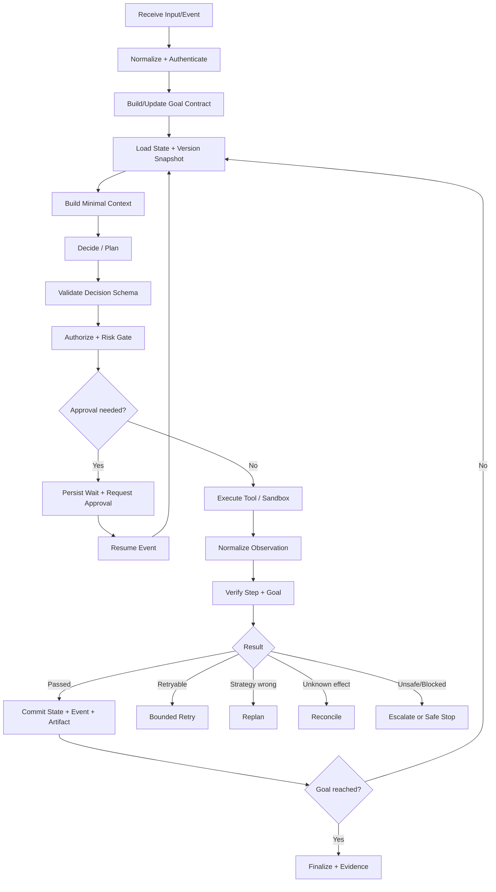

### 8.2 伪代码

```python
def advance_run(run_id: str, trigger: Event) -> AdvanceResult:
    run = state_store.load_for_update(run_id)

    if run.status in TERMINAL_STATES:
        return already_terminal(run)

    assert_trigger_is_new_or_idempotent(run, trigger)
    apply_trigger(run, trigger)
    enforce_deadline_cancellation_and_budget(run)

    checkpoint = state_store.checkpoint(run)
    context = context_builder.build(
        goal=run.goal_contract,
        state=run.state,
        recent_events=run.relevant_events(),
        artifact_refs=run.relevant_artifacts(),
        tool_summaries=tool_registry.search_for(run),
    )

    decision = policy.decide(context)
    decision_validator.validate(decision, expected_state_version=run.version)

    risk = policy_engine.classify(decision, run.principal, run.goal_contract)
    authorization = policy_engine.authorize(decision, risk)

    if authorization.requires_approval:
        wait = approval_service.create_request(decision, authorization)
        state_store.commit_wait(run, wait, checkpoint)
        return Waiting(wait.id)

    operation = operation_store.get_or_create(
        stable_operation_id(decision),
        request_fingerprint(decision),
    )

    if operation.effect_status == "unknown":
        observation = reconcile(operation)
    elif operation.has_final_result():
        observation = operation.replay_result()
    else:
        raw_result = executor.execute(decision, authorization.capability_token)
        observation = observation_normalizer.normalize(raw_result)
        operation_store.record_result(operation, observation)

    verification = verifier.check(
        step_criteria=run.current_step.success_criteria,
        goal_criteria=run.goal_contract.acceptance_criteria,
        observation=observation,
        environment=read_fresh_environment_if_needed(),
    )

    outcome = failure_policy.classify(observation, verification, run)
    next_state = transition(run, decision, observation, verification, outcome)
    state_store.commit(next_state, expected_version=run.version)
    event_bus.publish(outcome.events)
    return outcome.result
```

### 8.3 关键顺序不能颠倒

1. 先验证 Schema，再做授权；否则策略引擎处理的是不可信自由文本。
2. 先记录稳定 Operation，再执行外部副作用；否则崩溃后无法确认是否重复。
3. 先标准化 Observation，再交给模型；否则工具错误和大输出会污染上下文。
4. 先验证目标，再标记成功；不能因为最后一个 ToolCall 返回 `200` 就结束。
5. 每次状态提交使用版本检查；并发 Worker 不得静默覆盖更新。

### 8.4 终止性设计

Agent 必须同时具备成功终止、安全终止和异常终止：

| 类型 | 条件 | 返回内容 |
|---|---|---|
| Success | 所有必要验收标准通过 | 结果、证据、执行摘要、剩余风险 |
| Partial Success | 部分交付完成且允许部分返回 | 已完成项、未完成项、原因和后续动作 |
| Safe Stop | 用户取消、策略阻断、需人工、预算耗尽 | 当前状态、产物、不可继续原因 |
| Failure | 永久错误、恢复失败、内部不变量破坏 | 错误分类、Trace ID、是否有副作用 |
| Expired | Deadline 到期或等待超时 | 最后 Checkpoint、是否可恢复 |

“最大步骤数”只能防止无限循环，不能判断任务成功。真正的成功仍需要验收条件。

---

## 9. 长任务生命周期与 Durable Execution

### 9.1 生命周期状态机

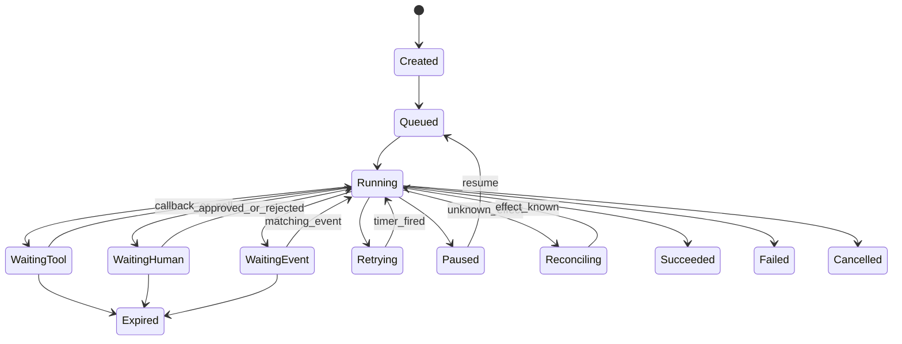

### 9.2 等待不是占住一个 Worker

当等待人工审批、异步 API、定时器或外部事件时，应持久化：

```yaml
wait_condition:
  wait_id: wait_01J...
  type: human_approval
  correlation_key: approval_8821
  expected_event_types: [approval.granted, approval.rejected]
  expires_at: "2026-08-06T11:00:00+08:00"
  resume_node: execute_refund
  resume_preconditions:
    - "order.version == 42"
    - "refund_not_already_executed == true"
```

Worker 可以释放。事件到来后，调度器重新加载 Checkpoint 并验证恢复前置条件。

### 9.3 恢复算法

恢复不能简单“从上次文本继续”，至少要做：

1. 验证 Checkpoint Schema 和工作流版本是否兼容。
2. 去重唤醒事件，检查事件是否属于当前等待条件。
3. 刷新已经可能变化的业务事实和权限。
4. 检查用户是否取消、Deadline 是否到期、预算是否仍可用。
5. 对未确认副作用先 Reconcile，而不是盲目重放。
6. 重新构建上下文，避免复用过期的模型输入。
7. 使用 CAS/Lease 获取任务推进权，防止双 Worker 恢复。

### 9.4 超时的四个层次

| 超时 | 控制对象 | 处理方式 |
|---|---|---|
| Tool Timeout | 单次外部调用 | 取消调用，按幂等性决定重试或对账 |
| Step Timeout | 一个执行步骤 | 中止本策略，重规划或升级 |
| Wait Timeout | 人工/事件等待 | 提醒、Fallback、过期 |
| Run Deadline | 整个任务 | 取消子任务，保存部分结果，安全终止 |

### 9.5 取消传播

取消是状态转换，不是杀掉进程。运行时需要：

- 标记根 Run 为 `cancelling`，拒绝新动作。
- 向所有子任务、工具调用和沙箱发送取消信号。
- 等待可取消动作确认，记录不可取消动作。
- 对已发生副作用按策略补偿或保留。
- 最终标记 `cancelled` 或 `cancelled_with_effects`。

如果退款 API 已提交且不可撤回，任务被取消也不能把业务事实伪装成“未退款”。

---

## 10. 并发、DAG 与资源一致性

### 10.1 什么时候可以并行

步骤 `A` 和 `B` 并行需要同时满足：

```text
no_dependency(A, B)
and no_shared_write_conflict(A, B)
and budgets_allow_parallelism(A, B)
and merge_function_is_defined(A.output, B.output)
```

典型可并行任务：读取不同数据源、分析独立文件、生成多个候选。典型不可并行任务：同时修改同一文件、依赖前一步生成 ID、共享不可重入浏览器会话。

### 10.2 Fan-out/Fan-in

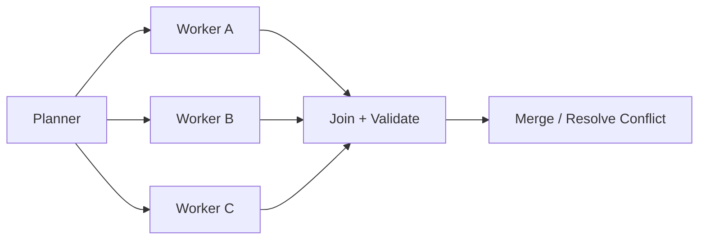

Join 节点必须明确：

- 等全部结果、达到法定数量，还是首个成功即可。
- 某个 Worker 失败时继续、替换还是取消全组。
- 结果如何去重、排序、解决冲突和标记来源。
- Deadline 到来时是否允许部分汇总。

### 10.3 并发控制策略

| 策略 | 适用场景 | 风险 |
|---|---|---|
| 单任务单 Owner | 默认方案 | Owner 故障需 Lease 接管 |
| Optimistic Concurrency/CAS | 冲突少、读取多 | 冲突后需重算，不能直接覆盖 |
| Pessimistic Lock | 临界区短、冲突高 | 死锁、长锁和吞吐下降 |
| Partitioned State | 子任务写独立分区 | 汇总时仍需冲突处理 |
| Append-only Events | 审计、异步协作 | 需要投影和顺序语义 |

对共享文件的推荐方式不是让多个 Agent 直接编辑同一个工作区，而是各自产生 Patch/Artifact，在合并节点统一应用和测试。

---

## 11. Verifier：把“做了”与“做成了”分开

### 11.1 验证层次

| 优先级 | 验证来源 | 示例 | 可靠性 |
|---|---|---|---|
| 1 | 环境真值/Test Oracle | 单元测试、数据库查询、页面最终状态、文件哈希 | 最高 |
| 2 | 确定性规则 | JSON Schema、金额约束、SQL Constraint、静态分析 | 高 |
| 3 | 独立模型 Judge | 摘要忠实度、开放文本质量、视觉一致性 | 需校准 |
| 4 | 多候选一致性 | 多模型投票、不同提示交叉检查 | 错误可能相关 |
| 5 | 执行模型自评 | “我认为已经完成” | 只能作为弱信号 |

### 11.2 两阶段验证

1. **Step Verification**：当前动作是否产生预期观察，例如文件已写入、API 返回目标对象。
2. **Goal Verification**：最终业务目标是否达到，例如测试通过、退款状态为成功、用户要求的所有章节存在。

工具成功只说明调用协议成功。`email.send` 返回 `200` 可能仍然收件人错误；文件写入成功可能仍然代码无法编译。

### 11.3 Verification Record

```yaml
verification:
  verification_id: verify_01J...
  subject: step_execute_refund
  criteria_version: refund-verifier/v2
  checks:
    - criterion_id: amount_not_exceed_paid
      method: deterministic_rule
      result: passed
      evidence_ref: artifact://payment-snapshot/42
    - criterion_id: refund_visible_in_payment_system
      method: environment_query
      result: passed
      observed_value: succeeded
  overall: passed
  verifier_independence: external_system
  checked_at: "2026-08-05T11:06:04+08:00"
```

### 11.4 Judge 也会失败

使用 LLM Judge 时要关注：位置偏差、长度偏差、同模型偏好、提示注入、事实核验能力和置信度校准。高风险任务不能只依赖一个 Judge；应尽量把开放判断转化为环境断言或规则。

评测设计详见[Agent 能力评测](../04-保障平面/01-Agent评测.md)。

---

## 12. 失败语义：Retry、Replan、Reconcile、Compensate 不能混用

### 12.1 失败分类

| 类型 | 例子 | 是否原策略重试 | 默认动作 |
|---|---|---:|---|
| Input Error | 参数缺失、目标冲突 | 否 | 澄清或拒绝 |
| Policy Error | 越权、命中安全策略 | 否 | 阻断、审批或升级 |
| Strategy Error | 选错工具、计划不可行 | 否 | Replan |
| Transient Execution | 429、短暂网络错误 | 是，有界 | Backoff + Jitter |
| Permanent Execution | 资源不存在、确定性 4xx | 否 | 换策略或停止 |
| Unknown Effect | 超时但副作用可能已发生 | 否 | Reconcile |
| Verification Failure | 工具成功但验收失败 | 视原因 | 修复、重规划或补偿 |
| State Conflict | CAS 失败、对象版本变化 | 否 | 重载事实后重新决策 |
| No Progress | 状态不变、动作重复 | 否 | 熔断、重规划或升级 |
| Budget/Deadline | Token、费用、步骤或时间耗尽 | 否 | 部分返回或安全停止 |
| Internal Invariant | 状态非法、事件缺失 | 否 | 隔离任务、告警、人工处理 |

### 12.2 五种恢复动作

```text
Retry      = 策略和参数基本不变，再执行一次暂时失败动作
Replan     = 改变步骤、工具或假设，选择新的解决路径
Reconcile  = 查询外部真值，确认未知副作用到底是否发生
Compensate = 执行语义上的反向业务动作，降低已发生副作用
Escalate   = 把决策权移交给人工或更高权限系统
```

示例：调用退款接口超时。

- 错误做法：立即再次退款。
- 正确做法：使用 `operation_id` 查询退款状态。
- 若已成功：记录结果并进入验证。
- 若明确未执行：在重试预算内重试。
- 若一直未知：停止自动动作并人工对账。

### 12.3 无进展检测

仅限制最大步数太晚。可以结合以下信号提前熔断：

```python
def no_progress(window):
    return (
        repeated_action_fingerprint(window) >= 3
        or repeated_state_hash(window) >= 3
        or semantic_goal_progress(window) < MIN_PROGRESS
        or same_error_class_without_new_evidence(window) >= 2
        or tool_switching_without_state_change(window) >= 4
    )
```

检测后不要简单告诉模型“再想想”。应提供结构化诊断：重复了什么、哪些假设未验证、哪些工具已失败、还剩多少预算，并限制下一轮不能重复同一动作。

模型重复调用失败工具、敏感工具幂等和熔断细节见[工具调用与协议](../03-执行平面/01-工具调用与协议.md)。

### 12.4 Blast Radius 控制

- 每个 Run 限制最大写操作数、最大金额、最大收件人数和最大资源范围。
- 写操作先在 Draft、Branch、Staging 或 Preview 中发生。
- 使用按任务签发的短期 Capability Token，而非长期全局密钥。
- 批量动作拆分为小批次，验证后继续。
- 异常率达到阈值时按工具、租户或 Agent 版本熔断。
- 补偿不是“撤销按钮”，要明确哪些动作不可补偿。

---

## 13. 架构版本、发布与治理

### 13.1 Agent 不是单一版本

一次运行至少依赖以下版本：

| 版本对象 | 变化风险 |
|---|---|
| Agent Definition | 行为边界和默认能力变化 |
| Workflow/Graph | 节点、边和状态转换变化 |
| Prompt Bundle | 决策分布变化 |
| Model/Route Policy | 能力、延迟和工具调用行为变化 |
| Tool Schema/Implementation | 参数和副作用语义变化 |
| Security Policy | 某动作从允许变为需审批 |
| Knowledge Index | 检索证据集合变化 |
| Evaluator | 成功判定和发布门禁变化 |

每个 Run 创建时固定 `version_vector`。排障时如果只能看到“使用 GPT-X”，远远不够。

### 13.2 发布流水线

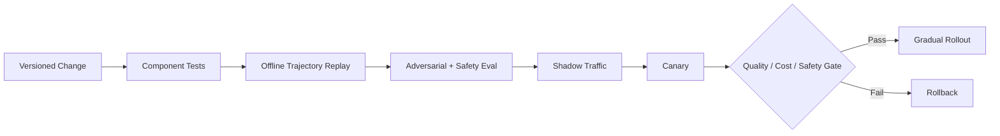

回放时要区分：

- **Exact Replay**：重放记录的模型输出和工具结果，验证状态机与代码兼容性。
- **Model Re-execution**：在固定输入上重新调用新模型，比较决策变化。
- **Environment Simulation**：使用工具模拟器测试异常和边界条件。

### 13.3 长任务迁移策略

| 策略 | 做法 | 适用条件 |
|---|---|---|
| Pin Old Version | 旧 Run 继续使用旧版本 | 旧环境仍可维护 |
| Compatible Reader | 新代码兼容旧状态 | 变化可向后兼容 |
| Explicit Migration | 迁移 Checkpoint 和状态 Schema | 可验证转换正确性 |
| Restart from Milestone | 保存产物，从安全里程碑重开 | 重放成本可接受 |
| Safe Termination | 结束旧任务并说明 | 无法安全迁移 |

禁止让运行中的任务静默切换 Prompt、工具 Schema 或授权策略。若安全策略收紧，必须立即重新授权，而不是为了版本固定继续执行已禁止动作。

---

## 14. 架构选型方法

### 14.1 七个问题

1. 路径能否在开发时基本枚举？
2. 环境是否会在执行过程中频繁变化？
3. 是否包含外部副作用，高风险动作占比多大？
4. 任务是秒级、分钟级还是跨天？
5. 子任务是否真正独立且可合并？
6. 是否存在可靠的中间和最终 Verifier？
7. 是否要求强审计、人工审批和跨版本恢复？

### 14.2 选型矩阵

| 场景特征 | 推荐主模式 | 不推荐作为首选 | 关键补强 |
|---|---|---|---|
| 路径稳定、强合规、高副作用 | Deterministic Workflow | 开放 ReAct | 规则、审批、幂等、审计 |
| 多领域入口、后续流程稳定 | Router + Workflows | 单 Agent 包办 | Unknown 路由、置信度校准 |
| 开放研究、只读工具、短任务 | ReAct | 重型状态图 | 搜索预算、证据、无进展检测 |
| 长任务、有明确子目标 | Planner-Executor | 一次性固定长计划 | 滚动重规划、里程碑 Checkpoint |
| 多状态、人工中断、需恢复 | State Graph | 纯聊天循环 | 状态 Schema、转换守卫 |
| 跨天等待外部事件 | Event-driven Workflow | 常驻 Worker | Durable Timer、幂等事件、迁移 |
| 动态拆分大量独立子任务 | Orchestrator-Workers | 固定串行 Chain | Fan-in、预算和冲突合并 |
| 不同权限/上下文/团队边界 | Multi-agent | 同权限角色扮演 | 协议、共享状态、终止性 |

### 14.3 简化决策树

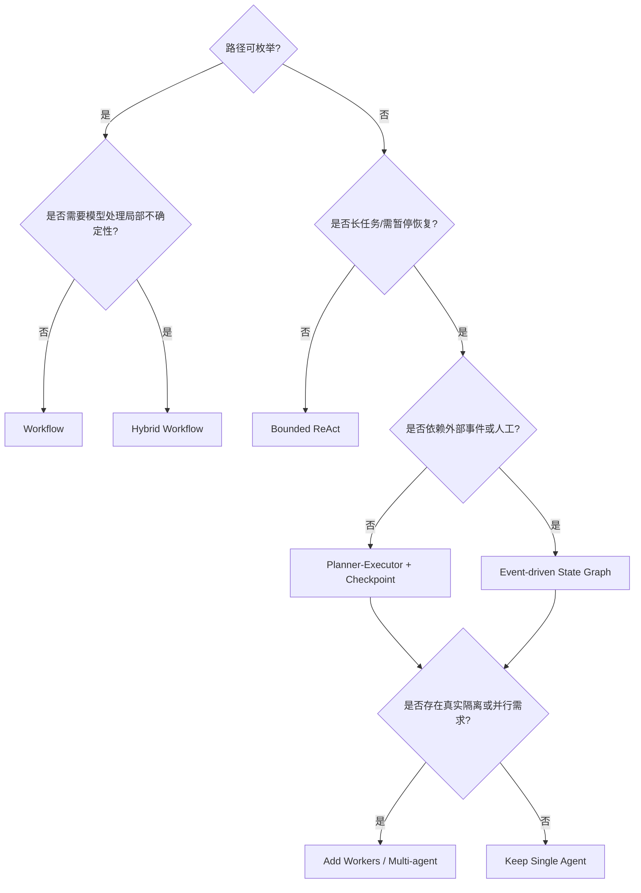

---

## 15. 三个端到端架构案例

### 15.1 客服处置 Agent：高副作用、强规则

**目标**：调查重复扣费，生成处置建议，必要时退款并回复客户。

**推荐架构**：Hybrid State Graph，而不是开放 ReAct。

```text
Intake -> Identity Check -> Read-only Investigation -> Policy Decision
       -> Refund Preview -> Human Approval -> Idempotent Refund
       -> Environment Verification -> Message Draft -> Send Approval -> Close
```

重点设计：

- 读取和推理可由 Agent 自主完成。
- 金额规则、客户身份、退款上限由代码校验。
- `refund` 使用稳定 Operation ID，超时先对账。
- 回复内容可以模型生成，实际发送是独立动作和审批点。
- 完成条件是支付系统退款状态和工单状态均满足，而不是模型生成了一段回复。

失败场景：退款成功后保存 Checkpoint 失败。恢复时读取 Operation Store 和支付系统，不重复退款；若本地与外部结果冲突，进入 Reconciling。

### 15.2 长周期研究 Agent：开放路径、只读为主

**目标**：调研一个新技术领域，交付有引用、覆盖多个观点的报告。

**推荐架构**：Planner-Executor + Orchestrator-Workers + Artifact Store。

```text
Goal Contract -> Research Plan -> Parallel Source Collection
              -> Source Quality Gate -> Evidence Matrix
              -> Gap Analysis/Replan -> Draft -> Citation Verify -> Finalize
```

重点设计：

- Goal Contract 明确时间范围、来源优先级、引用格式和覆盖要求。
- Worker 按子主题或来源类型拆分，避免多人搜索同一问题。
- 网页正文、PDF 和数据集存 Artifact，模型上下文只加载必要片段。
- 每条结论关联 Evidence ID；引用检查器验证 URL、标题、发布日期和支持关系。
- 达到边际收益阈值后停止搜索，防止无限调研。

失败场景：某来源不可访问。若不是关键唯一证据，记录缺口并寻找替代；若关键结论无法获得一手来源，报告中降低置信度而不是编造。

### 15.3 代码 Agent：高环境交互、验证器强

**目标**：修复缺陷并提交可审查补丁。

**推荐架构**：Bounded ReAct/Planner-Executor + Sandbox + Test Oracle。

```text
Issue -> Repository Map -> Reproduce -> Plan -> Edit in Branch
      -> Unit/Integration Tests -> Static Checks -> Diff Review
      -> Security Gate -> Patch/PR Artifact
```

重点设计：

- Agent 在隔离 Worktree/Container 中工作，网络和凭据最小化。
- 先复现再修改，防止“凭描述猜代码”。
- 多 Worker 修改时各自产生 Patch，合并后统一测试。
- 测试、编译、Lint 和行为复现是主要 Verifier，模型自评只是补充。
- 写文件成功不代表修复完成；只有原失败用例通过且无回归才满足验收。

失败场景：测试一直失败但错误不变。No-progress Detector 阻止继续重复修改同一位置，要求重新定位根因或保留诊断后升级。

---

## 16. 指标与 SLO

### 16.1 结果指标

| 指标 | 含义 | 注意事项 |
|---|---|---|
| Task Success Rate | 满足最终验收条件的任务占比 | 必须由外部标准判定 |
| First-pass Success | 无重试/重规划一次完成比例 | 可反映初始决策质量 |
| Partial Completion Rate | 长任务部分交付比例 | 不应混入完全成功 |
| Human Takeover Rate | 需要人工接管比例 | 高风险场景高并不一定坏 |
| Safety Violation Rate | 违反策略或越权比例 | 需要接近零并单独告警 |

### 16.2 过程指标

- 平均/P95 步骤数、模型调用数、工具调用数。
- Retry Rate、Replan Rate、Reconciliation Rate。
- Invalid Decision Rate、Unauthorized Attempt Rate。
- Repeated Action Rate、No-progress Breaker Trigger Rate。
- Verifier Pass Rate、False Positive/False Negative Rate。
- Checkpoint Recovery Success、取消传播时间、等待超时率。

### 16.3 效率指标

```text
Cost per Successful Task = 总模型 + 工具 + 沙箱 + 人工 + 存储成本 / 成功任务数
```

不要只优化单次 Token 或单模型价格。更便宜的模型若导致更多循环、人工接管和失败，总成本可能更高。

所有指标至少按任务类型、风险级别、模型、Prompt、工作流、工具版本和租户切片。平均值会掩盖特定工具或场景的严重退化。

---

## 17. 常见反模式与修正

| 反模式 | 后果 | 修正 |
|---|---|---|
| 为了“Agent 感”把稳定流程改成开放循环 | 成本和风险上升 | Workflow 中只开放必要节点 |
| 用聊天历史代替结构化状态 | 无法恢复、并发和审计 | Task State + Event + Checkpoint |
| 让模型判断自己是否有权限 | Prompt 注入可绕过 | 外部 Policy Engine |
| 自然语言直接映射成执行命令 | 参数和边界不可控 | Versioned Decision Schema |
| 工具返回成功就结束 | 业务目标可能未达成 | Step + Goal 两阶段验证 |
| 所有错误统一重试 | 重复副作用和重试风暴 | 错误分类 + Retry/Reconcile/Replan |
| 只设置最大轮数 | 直到预算耗尽才发现循环 | 状态哈希、动作指纹、进步检测 |
| 把大文件放进 Prompt/Checkpoint | Token 爆炸、恢复缓慢 | Artifact + 分块/检索读取 |
| 多 Agent 共享同一可写工作区 | 冲突和覆盖 | 独立分区/Patch + Join |
| 发布时只记录模型名 | 无法复现行为 | 固定完整 Version Vector |
| 同一模型执行又最终裁判 | 相关错误和自我确认 | 环境 Oracle 或独立 Verifier |
| 长任务绑定 HTTP 和单进程 | 断连即丢失 | 异步 Run + Durable Workflow |

---

## 18. 生产落地检查表

### 18.1 目标与边界

- [ ] 目标、约束、交付物、验收条件和预算已结构化。
- [ ] 模型决策、代码规则、人工审批的边界逐节点明确。
- [ ] 每个高风险动作有参数级风险分类和授权规则。
- [ ] 未验证假设有置信度和最晚验证节点。

### 18.2 控制循环

- [ ] Decision 使用版本化 Schema，包含状态版本和目标关联。
- [ ] 执行前完成 Schema、权限、风险、预算和状态版本检查。
- [ ] Observation 标准化并标记来源、完整性和截断状态。
- [ ] Step 和 Goal 分别验证，成功有外部证据。
- [ ] 有无进展检测、最大步骤、成本和时间预算。

### 18.3 状态与可靠性

- [ ] Run、Task、Step、Decision、ToolCall、Event、Artifact、Checkpoint 可关联。
- [ ] 副作用使用稳定 Operation ID，请求指纹可防止键误用。
- [ ] 对未知副作用有 Reconcile 路径。
- [ ] 等待、恢复、取消、超时和并发冲突有明确状态语义。
- [ ] 大文件、日志和模型长输出进入 Artifact Store，不塞入状态库。

### 18.4 安全与治理

- [ ] 模型不接触长期生产凭据，工具使用短期最小权限令牌。
- [ ] Prompt/网页/工具输出都按不可信输入处理。
- [ ] 模型、Prompt、工作流、工具、策略和索引均有版本。
- [ ] 发布经过离线回归、攻击评测、Shadow、Canary 和回滚门禁。
- [ ] Trace 可重建一次任务的输入、决策、动作、证据和版本。

---

## 19. 实践任务

### 19.1 入门：不依赖框架实现受控 Agent Loop

要求：

- 定义 `GoalContractV1`、`DecisionV1`、`ObservationV1`。
- 实现 3 个只读工具和 1 个需审批写工具。
- 加入最大步骤、Token 预算、重复动作检测和状态版本校验。
- 用确定性 Verifier 判断目标是否完成。
- 模拟 Tool Timeout、Schema 错误和权限阻断。

### 19.2 进阶：把 ReAct 改为可恢复 State Graph

要求：

- 支持 `waiting_human`、`waiting_tool`、`retrying` 和 `reconciling`。
- 每个状态转换产生 Event，每 3 个步骤生成 Checkpoint。
- Worker 崩溃后从 Checkpoint 恢复。
- 在“副作用完成、本地提交前”注入崩溃，验证不会重复执行。

### 19.3 高阶：架构对照实验

对同一客服或研究任务分别实现：

1. 固定 Workflow。
2. Bounded ReAct。
3. Planner-Executor。
4. State Graph + Human Approval。

比较任务成功率、平均步骤、P95 延迟、人工接管率、重复动作率和 Cost per Successful Task。只有数据能证明增加自主性是否值得。

---

## 20. 面试高频题与答题框架

### 20.1 基础概念

1. **Agent、Workflow、Chain 和 RPA 有什么区别？**
   答题重点：运行时决策权、环境反馈、状态、路径是否预定义；说明 Hybrid 是生产默认。
2. **Agent 的最小组成是什么？**
   答题重点：目标、策略、上下文、状态、工具、控制循环、运行时、Guardrail、Verifier。
3. **为什么调用工具不等于 Agent？**
   答题重点：固定路径的函数调用仍是 Workflow；Agent 关键是根据观察动态选择动作。
4. **什么情况下不应使用 Agent？**
   答题重点：路径稳定、规则明确、高风险且可枚举、普通检索或后端服务已足够。

### 20.2 架构与控制权

5. **如何划分确定性代码和 LLM 的边界？**
   答题重点：开放语义和策略候选交给模型；权限、事务、预算、状态转换、Schema 和最终业务真值交给代码。
6. **ReAct 为什么有效，又为什么容易循环？**
   答题重点：环境反馈修正静态知识；局部决策、错误观察、无明确价值函数和上下文增长导致循环。
7. **Planner-Executor 什么时候不如单循环 Agent？**
   答题重点：短任务、环境变化快、计划成本大于收益时；一次性计划会过早固化。
8. **State Graph 与普通 DAG Workflow 有什么区别？**
   答题重点：状态图可有循环、中断、等待和事件驱动；DAG 更偏无环批处理依赖。
9. **为什么多 Agent 不是默认答案？**
   答题重点：上下文复制、通信、共享状态、协调、终止和评测成本；先证明单 Agent 基线。

### 20.3 运行时与可靠性

10. **为什么 ToolCall ID 和 Operation ID 要分开？**
    答题重点：前者标识尝试，后者标识业务意图；重试时 ToolCall 变化而 Operation 稳定。
11. **工具超时后能否直接重试？**
    答题重点：只读或明确未执行可以；有副作用且结果未知必须先 Reconcile。
12. **如何让 Agent 支持暂停、恢复和取消？**
    答题重点：持久化状态机、等待条件、Checkpoint、事件唤醒、取消传播和恢复前置条件。
13. **长任务如何跨版本恢复？**
    答题重点：Version Vector、旧版本固定、兼容读取、显式迁移、安全里程碑重启。
14. **如何处理多个 Worker 并发更新状态？**
    答题重点：单 Owner、Lease、CAS、分区写、Append-only Event 和显式 Join。
15. **为什么取消不是 Kill Process？**
    答题重点：副作用可能已发生，子任务需传播，状态和审计必须保留。

### 20.4 验证与失败恢复

16. **工具调用成功为什么不等于任务成功？**
    答题重点：协议成功、动作效果、步骤目标和最终业务目标是不同层次。
17. **Verifier 应该使用同一个模型吗？**
    答题重点：优先环境真值和规则；同模型错误相关，只能作弱信号；开放质量可用独立 Judge 并校准。
18. **Retry 和 Replan 的边界是什么？**
    答题重点：Retry 不改变策略，处理暂时故障；Replan 改变路径，处理假设或策略错误。
19. **如何检测 Agent 没有进展？**
    答题重点：动作指纹、状态哈希、错误类型、目标进步、工具切换；熔断后给结构化诊断。
20. **补偿事务能否保证完全回滚？**
    答题重点：不能，Saga 是语义补偿；邮件发送、外部通知等不可真正撤销。

### 20.5 系统设计题

21. **设计一个可退款的客服 Agent。**
    答题重点：Goal Contract、只读调查、金额规则、审批、幂等退款、对账、后置验证和审计。
22. **设计一个跨天运行的研究 Agent。**
    答题重点：Planner-Workers、Artifact、事件唤醒、来源质量、引用验证、预算和阶段产物。
23. **设计一个代码修复 Agent。**
    答题重点：仓库映射、复现、隔离沙箱、分支/Patch、测试 Oracle、权限和网络限制。
24. **如果工具数量扩大到一万个，架构如何变化？**
    答题重点：Capability Catalog、检索/重排、权限预过滤、渐进加载 Schema、工具组路由和缓存。
25. **Agent 流量扩大十倍，哪里最先失效？**
    答题重点：模型限流、长任务队列、状态热点、浏览器/沙箱池、下游工具、Trace 成本；用 Backpressure 和隔离队列。

### 20.6 项目深挖题

26. **为什么你的项目必须使用 Agent，而不是 Workflow？**
    答题重点：说明无法预枚举的运行时不确定性，并给出 Workflow 基线对照数据。
27. **讲一次 Agent 线上失败。**
    答题重点：用户影响、Trace 证据、根因分类、即时止损、架构修复、回归用例和指标变化。
28. **你如何证明新模型或新 Prompt 更好？**
    答题重点：固定版本数据集、轨迹回放、分层指标、安全门禁、Shadow/Canary，而非主观体验。
29. **如何计算 Agent 的真实成本？**
    答题重点：模型、工具、沙箱、存储、人工和失败重试，最终看 Cost per Successful Task。
30. **系统最重要的架构取舍是什么？**
    答题重点：用真实场景讲清自主性与可控性、速度与验证、上下文与成本之间的权衡。

更多社区面经和项目深挖题见[社区面经与真题](../05-实践路线/06-社区面经与真题.md#4-agent-架构规划与多-agent)。

---

## 21. 资料与项目

### 21.1 必读资料

- [Anthropic: Building Effective Agents](https://www.anthropic.com/research/building-effective-agents)：Workflow 与 Agent 的边界、常见组合模式和“从简单方案开始”的工程原则。
- [OpenAI: A Practical Guide to Building Agents](https://openai.com/business/guides-and-resources/a-practical-guide-to-building-ai-agents/)：Agent 组件、工具、Guardrail 和从单 Agent 到多 Agent 的演进思路。
- [OpenAI Agents SDK: Agent Orchestration](https://openai.github.io/openai-agents-python/multi_agent/)：LLM 驱动和代码驱动编排、Handoff 与 Agents-as-tools。
- [ReAct](https://arxiv.org/abs/2210.03629)：推理与行动交替的经典方法。
- [SWE-agent / Agent-Computer Interface](https://arxiv.org/abs/2405.15793)：模型与计算机环境接口对代码 Agent 性能的影响。

### 21.2 状态图与 Durable Runtime

- [LangGraph Overview](https://docs.langchain.com/oss/python/langgraph/overview)：状态图、持久化、Durable Execution、Streaming 和 Human-in-the-loop。
- [LangGraph Workflows and Agents](https://docs.langchain.com/oss/python/langgraph/workflows-agents)：常见 Workflow/Agent 模式的图实现。
- [Microsoft Agent Framework: Orchestrations](https://learn.microsoft.com/en-us/agent-framework/workflows/orchestrations/overview)：并发、顺序、Handoff、Group Chat 和 Magentic 等编排模式。
- [Google ADK Runtime](https://google.github.io/adk-docs/runtime/)：Runner、Event Loop、Session 和 Event 的运行时关系。
- [Google ADK Session and State](https://google.github.io/adk-docs/sessions/state/)：Session、State 和持久化服务的职责。
- [Temporal Documentation](https://docs.temporal.io/)：Durable Execution、Retry、Timer、Signal 和长任务工作流。

### 21.3 推理、搜索与评测

- [Language Agent Tree Search](https://arxiv.org/abs/2310.04406)：把树搜索、价值估计与语言 Agent 结合。
- [AgentBench](https://arxiv.org/abs/2308.03688)：跨环境评测 LLM Agent 的基准和失败观察。
- [Tree of Thoughts](https://arxiv.org/abs/2305.10601)：多路径搜索式推理。
- [Reflexion](https://arxiv.org/abs/2303.11366)：使用语言反馈改进后续尝试。

### 21.4 可参考项目

- [OpenAI Agents SDK](https://openai.github.io/openai-agents-python/)
- [LangGraph](https://github.com/langchain-ai/langgraph)
- [Microsoft Agent Framework](https://github.com/microsoft/agent-framework)
- [Google Agent Development Kit](https://github.com/google/adk-python)
- [AutoGen](https://github.com/microsoft/autogen)
- [SWE-agent](https://github.com/SWE-agent/SWE-agent)
- [smolagents](https://github.com/huggingface/smolagents)

选项目时重点阅读状态模型、工具协议、错误语义、持久化和 Trace 实现，不要只运行 Quickstart。

---

## 22. 本章与其他模块的边界

| 问题 | 本章回答 | 深入模块 |
|---|---|---|
| Agent 如何总体分层和选型 | 架构原则、对象、控制循环 | 本章 |
| 如何生成、搜索和修正计划 | 给出 Planner 在架构中的位置 | [任务规划与推理](02-任务规划与推理.md) |
| 如何保存、恢复和保证一致性 | 定义状态语义和不变量 | [状态管理与持久化](../02-数据平面/04-状态管理与持久化.md) |
| 工具 Schema、MCP、幂等、大文件 | 定义执行边界 | [工具调用与协议](../03-执行平面/01-工具调用与协议.md) |
| 沙箱、浏览器、代码执行安全 | 定义 Harness 中的环境层 | [沙箱与 Computer-Use](../03-执行平面/02-沙箱与Computer-Use.md) |
| 队列、Worker、多租户和容量 | 给出参考架构 | [Agent 运行时与平台工程](../03-执行平面/04-Agent运行时与平台工程.md) |
| 如何衡量成功和回归 | 定义 Verifier 位置 | [Agent 能力评测](../04-保障平面/01-Agent评测.md) |
| Trace、指标和调试 | 定义必须记录的对象 | [可观测性](../04-保障平面/02-可观测性.md) |
| 权限、注入、供应链和治理 | 定义风险分级与授权点 | [安全权限与治理](../04-保障平面/03-安全权限与治理.md) |

最终判断标准：如果拿掉 LLM，这套系统仍应具有清晰的目标契约、状态机、权限、错误语义、恢复机制和验证标准；加入 LLM 后，只是在受控边界内提升对开放问题的适应能力。
