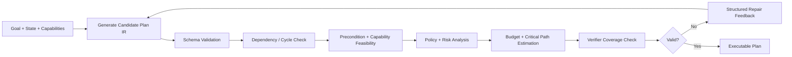
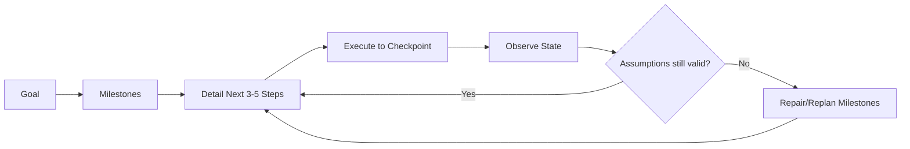
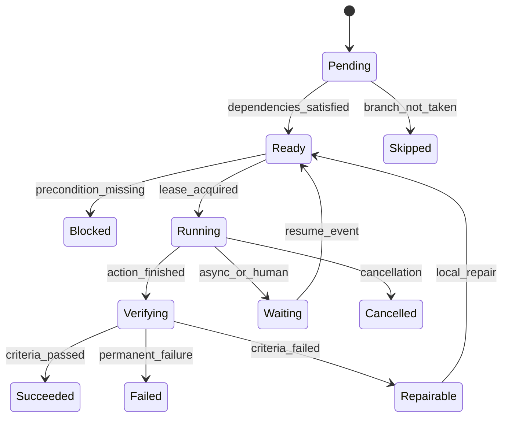
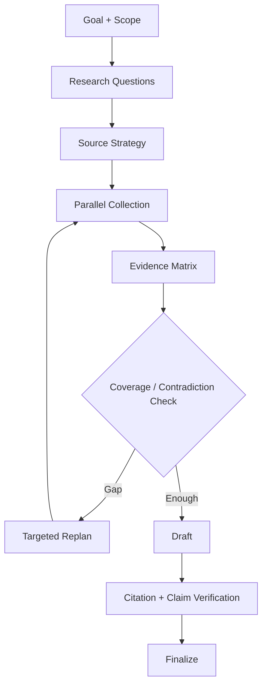

# 任务规划、推理与自我纠错

> 导航：[总目录](../README.md) | [控制平面](README.md) | [Agent 架构](01-Agent架构.md) | [工具调用](../03-执行平面/01-工具调用与协议.md) | [状态管理](../02-数据平面/04-状态管理与持久化.md) | [多 Agent](05-多Agent协作.md) | [评测](../04-保障平面/01-Agent评测.md)

> 调研基线：2026-08-05。本章关注 Planner、Reasoner、Verifier 和 Replanner 的工程实现，不要求保存或展示模型的完整私有思维链。

## 0. 本章怎么读

任务规划不是让模型先输出一个编号列表。生产级规划需要完成以下转换：

```text
开放目标 + 当前状态 + 能力边界 + 风险与预算
    -> 可验证子目标
    -> 有依赖关系的可执行计划
    -> 受约束调度与环境反馈
    -> 局部修复/重规划
    -> 最终验收或安全停止
```

### 0.1 最需要掌握的十个重点

| 优先级 | 重点 | 为什么重要 | 掌握标准 |
|---|---|---|---|
| P0 | 计划不是自然语言清单 | 清单无法可靠调度、验证、恢复和审计 | 能定义 Plan/Step/Dependency/Effect Schema |
| P0 | 目标分解与验收对齐 | 错误分解会让每步成功但总目标失败 | 能从验收标准反向生成子目标 |
| P0 | 前置条件与预期效果 | 没有状态转换语义就无法判断计划可行性 | 能检查 Preconditions、Effects、Invariants |
| P0 | 规划与执行分离 | 计划是候选策略，环境事实只能来自执行反馈 | 能实现 Planner -> Executor -> Verifier 闭环 |
| P0 | Retry、Repair、Replan 区分 | 错误处置混乱会造成循环和重复副作用 | 能按故障类型选择正确恢复动作 |
| P0 | 外部 Verifier/Test Oracle | 自我反思不能替代环境真值 | 能设计计划前、步骤后和目标级验证 |
| P1 | 滚动窗口规划 | 长计划会随环境变化快速失效 | 能实现里程碑 + 近期细化 + 远期占位 |
| P1 | 搜索与预算 | ToT/MCTS 等方法会指数增加成本 | 能定义候选数、深度、价值函数和停止条件 |
| P1 | 不确定性与主动补信息 | 很多失败源于缺失事实，而非推理能力 | 能管理 Assumption、Belief 和信息价值 |
| P1 | 规划评测与可观测 | 没有 Plan Diff、Churn 和路径指标无法优化 | 能评测可行性、覆盖率、效率和恢复质量 |

### 0.2 核心结论

1. LLM 适合生成候选分解、启发式和修复建议，不应默认充当计划正确性的唯一证明器。
2. 能枚举和验证的规划约束，应交给代码、图算法、规则引擎、SAT/SMT、PDDL Planner 或业务系统。
3. 长任务优先采用滚动规划，而不是一次生成几十步后机械执行。
4. 自我纠错必须绑定外部证据；没有新 Observation 的“再反思一次”通常只是重新采样。
5. 计划质量最终体现在端到端成功、安全和成本，不是计划文本看起来有多完整。

---

## 1. 概念边界：Planning、Reasoning、Scheduling 和 Verification

### 1.1 六个容易混淆的对象

| 对象 | 回答的问题 | 典型输出 | 是否直接执行 |
|---|---|---|---:|
| Reasoning | 当前信息支持什么判断 | 结论、假设、候选动作摘要 | 否 |
| Planning | 为实现目标需要哪些状态变化 | 子目标、步骤、依赖、分支 | 否 |
| Scheduling | 何时、由谁、以什么资源执行 | Ready Queue、优先级、并发度 | 否 |
| Decision | 当前这一步具体做什么 | 一个结构化 Action Proposal | 否，需校验授权 |
| Execution | 让环境实际发生变化 | ToolCall、Sandbox Action | 是 |
| Verification | 动作和目标是否真的达成 | 通过/失败、证据、修复建议 | 否 |

Planning 决定“应该经过哪些状态”，Scheduling 决定“现在先跑哪一步”，Execution 产生环境事实，Verification 判断事实是否满足目标。

### 1.2 Plan、Policy、Trajectory 和 Reflection

| 概念 | 定义 | 示例 |
|---|---|---|
| Plan | 执行前或执行中的预期动作/状态结构 | `读取日志 -> 定位模块 -> 修改 -> 测试` |
| Policy | 根据当前状态和观察选择下一动作的规则 | ReAct Agent 的决策策略 |
| Trajectory | 已经实际发生的状态、动作和观察序列 | ToolCall 和 Observation Trace |
| Schedule | Plan 在时间、资源和执行者上的具体安排 | A/B 并行，C 等二者完成 |
| Reflection | 对已发生失败的结构化归因和后续建议 | “测试失败源于未更新 Schema” |
| Skill/Template | 可复用的参数化局部计划 | “创建 PR”的标准流程 |

Plan 是预测，Trajectory 是事实。恢复任务时可以从 Trajectory 重建事实，但不能把原计划中尚未执行的内容当成事实。

### 1.3 规划不等于 Chain-of-Thought

任务规划需要保存的是可审计的外部结构：

- 子目标、依赖和状态转换。
- 关键假设和证据引用。
- 候选工具、预算和风险。
- 成功标准、失败策略和计划变更。

不需要保存模型逐 Token 的私有推理过程。工程上更有价值的是简短的 `decision_summary`、`assumption_ledger`、`plan_diff` 和可复现的外部证据。

### 1.4 形式化规划问题

可以把一次规划抽象为：

```text
PlanningProblem P = <S0, G, A, C, B, H>

S0: 当前已知状态或 Belief State
G: 目标和验收条件
A: 可用动作/工具及其前置条件和效果
C: 硬约束、软约束和安全策略
B: Token、费用、时间、步骤、人工等预算
H: 规划时域和 Deadline
```

Planner 的目标不是生成最长计划，而是在约束下找到高价值可执行策略：

```text
maximize   ExpectedGoalUtility(plan)
           - ExecutionCost(plan)
           - RiskPenalty(plan)
           - UncertaintyPenalty(plan)

subject to HardConstraints(plan) == satisfied
           Budget(plan) <= B
```

环境部分可观测时，`S0` 不是唯一确定状态，而是带置信度的 Belief State。此时计划通常需要先获取信息，或为不同观察准备条件分支。

---

## 2. Planner 的输入契约

### 2.1 规划前必须具备什么

Planner 至少需要以下输入：

| 输入 | 内容 | 缺失时的风险 |
|---|---|---|
| Goal Contract | 目标、交付物、验收、约束、风险 | 无法判断完成和合法性 |
| Current State | 任务状态、业务状态、已有产物 | 重复工作或基于旧事实规划 |
| Capability Catalog | 可用工具、Agent、模型、权限 | 生成系统无法执行的步骤 |
| Action Model | 工具前置条件、效果、成本、失败语义 | 无法做可行性检查 |
| Budget | 时间、Token、费用、工具和人工预算 | 搜索或执行失控 |
| Evidence | 已确认事实及来源 | 把推测当事实 |
| History Summary | 已尝试策略、错误和禁用动作 | 重复失败路径 |

### 2.2 Planning Context Schema

```yaml
planning_context:
  schema_version: planning-context/v2
  run_id: run_01J...
  task_id: task_fix_login_bug
  based_on_state_version: 23

  goal:
    objective: "修复登录接口偶发 500，并提交可审查补丁"
    acceptance_criteria:
      - "原失败测试稳定通过"
      - "完整单测无新增失败"
      - "补丁不扩大认证数据访问范围"

  state:
    confirmed_facts:
      - fact_id: fact_1
        statement: "错误只在 refresh token 为空时出现"
        evidence_ref: artifact://test-output/repro-7
    unknowns:
      - "空 token 来自客户端还是服务端迁移数据"
    completed_steps: [inspect_issue, reproduce_failure]
    failed_attempts:
      - action_fingerprint: patch_null_check_v1
        error_class: verification_failed
        evidence_ref: artifact://test-output/run-8

  capabilities:
    allowed: [repo.search, file.read, patch.apply, test.run]
    approval_required: [network.enable, dependency.add]
    forbidden: [production.deploy, secret.read]

  constraints:
    hard:
      - "不得修改外部 API 契约"
      - "不得跳过认证检查"
    soft:
      - "优先最小补丁"

  budget_remaining:
    wall_clock_seconds: 1800
    model_tokens: 90000
    tool_calls: 40
    cost_usd: 3.5

  planning_policy:
    horizon: rolling
    max_detailed_steps: 5
    max_candidate_plans: 3
    reserve_for_recovery_ratio: 0.25
```

### 2.3 Capability 不能只有工具名字

Planner 若只看到 `send_email`、`run_sql` 之类名字，很容易生成不可执行或危险计划。Capability 描述至少应包含：

```yaml
capability:
  name: repo.patch.apply
  version: "2026-07-20"
  input_schema_ref: schema://repo-patch/v3
  preconditions:
    - "workspace.mode == 'isolated_branch'"
    - "target_file.version == expected_version"
  effects:
    guaranteed:
      - "patch artifact is recorded"
    possible:
      - "workspace files change"
  side_effect_level: L1_reversible
  cost_model:
    expected_latency_ms: 120
    monetary_cost_usd: 0
  failure_classes: [version_conflict, invalid_patch, permission_denied]
  compensator: repo.patch.revert
```

工具 Schema 和大量工具检索详见[工具调用与协议](../03-执行平面/01-工具调用与协议.md)。

---

## 3. 可执行计划表示：Plan IR

### 3.1 为什么需要 Plan IR

自然语言计划：

```text
1. 看一下代码
2. 找到问题
3. 修复并测试
```

无法回答：看哪些代码、输入是什么、什么算找到、哪些步骤可并行、测试失败怎么办、谁有权限修改、执行到哪里可以恢复。

Plan IR 是模型生成计划与运行时调度之间的中间表示。模型可以生成候选 IR，代码负责校验、编译和执行。

### 3.2 PlanV3 示例

```yaml
plan:
  schema_version: plan/v3
  plan_id: plan_fix_login_v4
  plan_version: 4
  task_id: task_fix_login_bug
  based_on_state_version: 23
  generated_by: planner-agent@2.8.0
  planning_mode: rolling_horizon

  objective: "定位 refresh token 为空导致的 500，并生成最小安全补丁"
  global_success_criteria:
    - criterion_id: ac_repro_fixed
      verifier: test://auth/test_empty_refresh_token
    - criterion_id: ac_regression
      verifier: test-suite://auth
    - criterion_id: ac_security
      verifier: policy://auth-data-access/v5

  assumptions:
    - assumption_id: a1
      statement: "错误发生在 token 解析路径"
      confidence: 0.74
      evidence_refs: [artifact://stacktrace/run-7]
      invalidate_plan_if_false: false

  invariants:
    - "认证失败必须 fail closed"
    - "不得记录 token 原文"

  milestones:
    - milestone_id: m1
      objective: "确认根因"
      status: in_progress
    - milestone_id: m2
      objective: "形成并验证补丁"
      status: pending

  steps:
    - step_id: s1_trace_flow
      milestone_id: m1
      kind: information_gathering
      objective: "追踪 refresh token 从入口到解析器的数据流"
      dependencies: []
      inputs:
        - artifact://stacktrace/run-7
      preconditions:
        - "reproduction.status == confirmed"
      candidate_capabilities: [repo.search, file.read]
      selection_policy: planner_selects_at_runtime
      expected_effects:
        - "candidate_root_cause_files identified"
      output_contract:
        schema: data-flow-findings/v1
        artifact_required: true
      success_criteria:
        - "每个候选位置包含文件、符号和证据"
      budget:
        max_tool_calls: 8
        timeout_seconds: 240
      on_failure:
        strategy: local_replan

    - step_id: s2_check_migration
      milestone_id: m1
      kind: information_gathering
      objective: "确认空 token 是否来自历史迁移数据"
      dependencies: []
      candidate_capabilities: [repo.search, test.fixture.read]
      expected_effects:
        - "migration hypothesis accepted or rejected"
      output_contract:
        schema: hypothesis-test/v1
      success_criteria:
        - "结论包含正反证据"

    - step_id: s3_root_cause
      milestone_id: m1
      kind: synthesis
      objective: "根据数据流和迁移证据确定根因"
      dependencies: [s1_trace_flow, s2_check_migration]
      inputs_from_steps: [s1_trace_flow, s2_check_migration]
      output_contract:
        schema: root-cause/v2
      success_criteria:
        - "根因能解释复现条件和堆栈"
        - "至少一个反事实检查通过"
      verifier: root-cause-consistency/v1

    - step_id: s4_patch
      milestone_id: m2
      kind: reversible_action
      objective: "在隔离分支应用最小补丁"
      dependencies: [s3_root_cause]
      preconditions:
        - "root_cause.confidence >= 0.8"
        - "workspace.mode == 'isolated_branch'"
      candidate_capabilities: [patch.apply]
      expected_effects:
        - "targeted code path handles empty token safely"
      risk_level: L1
      output_contract:
        schema: patch-artifact/v2
      success_criteria:
        - "patch applies without version conflict"

    - step_id: s5_verify
      milestone_id: m2
      kind: verification
      objective: "运行复现测试、回归测试和安全规则"
      dependencies: [s4_patch]
      candidate_capabilities: [test.run, static-analysis.run]
      output_contract:
        schema: verification-bundle/v2
      success_criteria:
        - "all global success criteria passed"
      on_failure:
        strategy: diagnose_then_repair

  edges:
    - from: s1_trace_flow
      to: s3_root_cause
      type: data_dependency
    - from: s2_check_migration
      to: s3_root_cause
      type: data_dependency
    - from: s4_patch
      to: s5_verify
      type: control_dependency

  stop_conditions:
    success: [all_global_success_criteria_passed]
    safe_stop: [budget_reserve_reached, policy_blocked, cancelled]
```

### 3.3 Step 最少应包含什么

| 字段 | 作用 | 缺失后果 |
|---|---|---|
| `objective` | 当前步骤要实现的局部状态 | 执行器只知道动作，不知道目的 |
| `dependencies` | 控制和数据依赖 | 隐式顺序错误、错误并行 |
| `preconditions` | 允许开始的条件 | 基于过期或不合法状态执行 |
| `candidate_capabilities` | 允许使用的能力集合 | Planner 虚构工具或越权 |
| `expected_effects` | 预计产生的状态变化 | 无法比较观察与预期 |
| `output_contract` | 下游消费接口 | 结果只能靠自然语言猜 |
| `success_criteria` | 步骤完成判定 | ToolCall 成功被误当步骤成功 |
| `budget` | 局部资源上限 | 单步骤耗尽全局预算 |
| `on_failure` | 默认恢复策略 | 所有错误无差别重试 |

### 3.4 依赖不只有先后顺序

| 依赖类型 | 含义 | 示例 |
|---|---|---|
| Control Dependency | A 完成后才能开始 B | 先审批再退款 |
| Data Dependency | B 消费 A 的结构化输出 | 先提取数据再汇总 |
| Resource Dependency | A/B 争用同一可写资源 | 两个 Patch 不能同时改同一文件 |
| Policy Dependency | B 需要 A 产生授权或确认 | 身份验证后读取订单 |
| Evidence Dependency | B 的结论需要 A 的证据 | 根因结论依赖日志和测试 |
| Temporal Dependency | 必须在某时间窗口内或相对时间执行 | 预约、定时发布 |

只保存 `dependencies: [A]` 可以调度，但无法解释为什么依赖。生产系统最好保留边类型和数据契约。

---

## 4. Plan Compiler：把候选计划变成可运行计划

### 4.1 编译流水线



### 4.2 静态检查

Plan Compiler 应至少检查：

1. Schema 和字段类型正确。
2. Step ID 唯一，依赖引用存在。
3. DAG 部分无非法环；允许循环时必须声明循环上限和退出条件。
4. 每个 Step 的输入都由初始状态或上游输出提供。
5. 每个能力真实存在，且当前 Principal 有权申请使用。
6. 高风险动作前存在身份、预览和审批步骤。
7. 每个关键目标至少有一个 Verifier 覆盖。
8. 最坏成本、关键路径和 Deadline 基本可行。
9. 计划不会破坏硬约束和全局不变量。
10. 所有失败分支最终能到达恢复、升级或安全停止状态。

### 4.3 Plan Lint 示例

```yaml
plan_validation_result:
  valid: false
  errors:
    - code: MISSING_DATA_DEPENDENCY
      step_id: generate_report
      message: "input dataset_summary has no producer"
      suggested_fix: "add dependency on analyze_dataset"
    - code: RISK_GATE_MISSING
      step_id: send_customer_email
      message: "L2 external action lacks approval or delegated authorization"
    - code: VERIFIER_GAP
      criterion_id: ac_no_regression
      message: "no step produces evidence for this global criterion"
  warnings:
    - code: BUDGET_TIGHT
      message: "estimated P90 cost uses 92% of budget; recovery reserve is below policy"
```

反馈要指出具体 Step、错误类别和修复约束，不要只把“计划不可行，请重写”交给模型。

### 4.4 外部规划器的作用

对于可形式化问题，可以让 LLM 负责把自然语言转成领域模型或候选约束，再由外部系统求解：

```text
Natural Language Goal
    -> LLM extracts objects, predicates, constraints
    -> Deterministic validator checks model
    -> PDDL/SAT/SMT/CP-SAT/Graph Search solves
    -> LLM explains or maps solution back to tools
```

典型场景：排班、行程、资源分配、依赖调度、配置组合、机器人动作。LLM+P 和 LLM-Modulo 一类工作体现了“模型提议、外部系统验证/求解”的思路。

风险在于自然语言到形式模型的翻译也可能错，因此必须验证对象、单位、约束完整性和求解结果对原目标的映射。

---

## 5. 目标分解：从验收标准反向设计步骤

### 5.1 不要从“能做什么”开始堆动作

弱分解通常是工具驱动：有搜索工具就先搜，有代码工具就先改。强分解从最终验收反向推导：

```text
Acceptance Criteria
    -> 必须成立的最终状态
    -> 产生这些状态所需的子目标
    -> 子目标需要的证据、输入和能力
    -> 前置条件和风险门禁
    -> 可执行步骤
```

### 5.2 五种分解视角

| 视角 | 适用场景 | 示例 |
|---|---|---|
| State-transition | 业务状态变化明显 | 待审核 -> 已审批 -> 已执行 -> 已验证 |
| Evidence-first | 研究、诊断、审计 | 结论需要哪些证据，证据从哪里获得 |
| Capability-first | 工具和权限边界明显 | 浏览器、SQL、代码沙箱分别负责什么 |
| Risk-first | 高副作用任务 | 只读调查、预览、审批、执行、对账 |
| Artifact-first | 长文档、代码、数据产品 | 每阶段产出什么可持久化 Artifact |

实际计划通常组合使用。客服退款以 Risk-first 为主，代码修复以 State-transition + Evidence-first 为主，研究报告以 Evidence-first + Artifact-first 为主。

### 5.3 Backward Decomposition 伪代码

```python
def decompose(goal, acceptance_criteria, capabilities, constraints):
    agenda = [required_state(c) for c in acceptance_criteria]
    subgoals = []

    while agenda:
        target = agenda.pop()
        if already_satisfied(target):
            continue

        producers = find_actions_or_artifacts_that_can_produce(target, capabilities)
        producers = filter_hard_constraints(producers, constraints)

        if not producers:
            return UnsatisfiedGoal(target)

        chosen = rank_by_cost_risk_and_verifiability(producers)
        subgoals.append(chosen)

        for precondition in chosen.unsatisfied_preconditions:
            agenda.append(precondition)

    return build_dependency_graph(subgoals)
```

LLM 可以帮助生成 `producers` 和语义子目标，但存在性、权限、类型和依赖仍需代码验证。

### 5.4 分解粒度

步骤过粗：无法估算、验证和恢复。步骤过细：模型调用和状态管理成本高，计划抖动严重。

推荐判断标准：一个 Step 应满足以下大部分条件。

- 单个执行器能在有限时间和局部上下文内完成。
- 输出可用明确 Schema 或 Artifact 表达。
- 有独立可执行的成功标准。
- 失败原因能归入有限类别。
- 高风险副作用不与调查、生成或验证混在一起。
- Step 完成后值得形成事件或 Checkpoint。

需要继续拆分的信号：

- Objective 中同时出现多个“并且”。
- 同时需要多个不同权限域。
- 预计工具调用次数不可控。
- 输出既包含事实调查又包含外部写操作。
- 失败时无法判断究竟哪部分失败。

不应继续拆分的信号：

- 子步骤只有模型内部文本变换，没有独立业务意义。
- 拆分后每一步都需要重新加载相同大上下文。
- 子步骤没有独立 Verifier，只增加编排开销。

### 5.5 数据契约防止“形式分解、实际耦合”

两个步骤即使写成独立节点，如果下游仍要阅读上游完整聊天才能理解，就没有真正解耦。

```yaml
output_contract:
  schema: EvidenceMatrixV2
  required_fields:
    - claim_id
    - claim_text
    - source_refs
    - support_level
    - contradictions
  max_inline_items: 50
  overflow: artifact_ref
```

下游应消费结构化输出或 Artifact，不依赖上游的私有上下文。

### 5.6 不可解和不值得解

Planner 也应能输出：

- `UNSATISFIABLE`：硬约束彼此冲突。
- `MISSING_CAPABILITY`：没有可产生目标状态的动作。
- `MISSING_INFORMATION`：关键事实不可获得。
- `BUDGET_INFEASIBLE`：预算和 Deadline 无法覆盖最小计划。
- `RISK_UNACCEPTABLE`：可行路径都超过风险策略。
- `LOW_EXPECTED_VALUE`：解决成本高于任务价值。

强行生成一个看起来完整的计划，不如明确说明为什么当前无法规划。

---

## 6. 规划模式与方法谱系

### 6.1 模式总表

| 模式 | 规划时机 | 优点 | 主要风险 | 适用场景 |
|---|---|---|---|---|
| Reactive/ReAct | 每轮只决定下一步 | 适应环境变化 | 局部最优、循环 | 短任务、反馈频繁 |
| Plan-and-Execute | 先生成计划再执行 | 全局结构清晰 | 初始计划过时 | 中等长度、依赖稳定 |
| Rolling Horizon | 细化近期，远期保留里程碑 | 灵活且有方向 | 实现复杂、可能抖动 | 长任务、动态环境 |
| ReWOO-style | 先规划带变量引用的工具链 | 减少重复规划和 Token | 难处理意外观察 | 工具链较稳定 |
| HTN/Template | 用可复用任务模板逐层展开 | 可控、可审计 | 模板维护成本 | 企业标准流程 |
| External Solver | LLM 建模，求解器规划 | 约束满足和最优性强 | 建模映射可能错误 | 排班、路径、资源组合 |
| Contingent Plan | 为观察结果预建分支 | 适合部分可观测 | 分支爆炸 | 风险流程、诊断 |
| Search-based | 生成和评估多条候选路径 | 可逃离局部最优 | 成本指数增长 | 有强 Verifier 的难题 |

### 6.2 ReAct：局部闭环

ReAct 在每轮根据最新 Observation 选择动作，适合环境信息比初始知识更重要的任务。

```text
Observe -> Decide One Action -> Execute -> Verify/Update -> Observe
```

工程增强：

- 保存结构化 Action Summary，而不是完整思维链。
- 为近期动作建立 Failure Ledger 和重复指纹。
- 每隔若干步检查全局目标覆盖，避免一直解决局部问题。
- 给搜索、浏览和读取类动作设置边际收益停止条件。
- 达到复杂度阈值时切换为显式子计划，而不是无限 ReAct。

### 6.3 Plan-and-Execute：全局计划与执行器分离

适合步骤依赖相对稳定、每一步可独立验证的任务。Planner 可以使用更强模型，Executor 使用更快、更便宜或专用模型。

主要风险：

- Planner 基于未验证假设生成整个计划。
- Executor 机械执行已经失效的步骤。
- 计划只描述动作，不描述预期效果和失败分支。

因此执行器每一步都要重新检查 Preconditions，并在 Observation 偏离预期时暂停计划。

### 6.4 Rolling Horizon：生产长任务的默认选择



建议：

- 远期只保存里程碑、约束和验收，不伪造细节。
- 近期窗口细化为可执行 Step。
- 到达 Checkpoint、获取关键新事实或预算偏移时重估。
- 已完成且验证通过的步骤尽量保持不变，降低 Plan Churn。

### 6.5 ReWOO-style：变量化计划

ReWOO 将计划推理与工具执行分离，用变量引用前序工具结果：

```text
Plan: 找到目标仓库的配置入口
E1: repo.search(query="auth config")
Plan: 读取候选配置文件
E2: file.read(path=#E1.top_path)
Plan: 根据配置生成检查结果
E3: analyzer.check(config=#E2)
```

优势是减少每一步重新把完整工具输出送给 Planner。弱点是计划对 Observation 的动态适应较弱；若 `#E1` 返回多个冲突候选，必须允许局部插入新步骤或回到 Planner。

### 6.6 HTN 与 Skill Template

Hierarchical Task Network 把高层任务展开为可复用方法：

```text
resolve_customer_case
  -> verify_identity
  -> investigate_issue
  -> choose_resolution
  -> execute_resolution
  -> verify_and_close
```

每个高层任务可以有多个 Method，运行时根据条件选择。它比模型自由分解更可控，适合稳定企业流程；LLM 主要负责选择 Method、填参数和处理模板覆盖不到的局部不确定性。

### 6.7 Least-to-Most 与 Plan-and-Solve

- **Least-to-Most**：先拆成更简单问题，再按依赖逐个解决，适合组合性强的推理任务。
- **Plan-and-Solve**：先明确计划再计算或回答，减少遗漏步骤。

它们适合作为模型内或单次调用的推理提示方法，但生产系统仍需把结果转换成外部 Plan IR，并由运行时验证。

---

## 7. 执行调度：计划如何真正推进

### 7.1 Ready Step

一个 Step 进入 Ready Queue 至少需要：

```text
all_dependencies_satisfied
and preconditions_hold_on_fresh_state
and required_inputs_available
and capability_available_and_authorized
and resource_lock_or_lease_acquired
and step_budget_available
and run_not_cancelled
```

依赖完成不代表前置条件仍成立。例如审批后订单状态可能已被人工修改，执行前仍要读取新版本。

### 7.2 Step 生命周期



### 7.3 调度器伪代码

```python
def schedule(plan, state, budget):
    assert plan.based_on_state_version <= state.version

    ready = []
    for step in plan.steps:
        if step.status not in {"pending", "repairable"}:
            continue
        if not dependencies_satisfied(step, state):
            continue
        if not inputs_available(step, state.artifacts):
            continue
        if not fresh_preconditions_hold(step, read_domain_state(step)):
            mark_blocked_and_request_replan(step)
            continue
        if not budget.can_reserve(step.budget):
            mark_budget_blocked(step)
            continue
        ready.append(step)

    selected = choose_non_conflicting_steps(
        ready,
        objective="maximize_goal_progress_under_budget",
    )

    for step in selected:
        lease = acquire_step_lease(step.id)
        if lease:
            dispatch(step, lease, plan.version)
```

### 7.4 优先级与关键路径

常见优先级因素：

- 是否位于关键路径。
- 是否能尽早验证高风险假设。
- 是否能解除多个下游阻塞。
- 是否存在即将过期的时间窗口。
- 失败成本和副作用风险。
- 所需资源当前是否稀缺。

信息获取步骤常应提前，因为早期否定错误假设可以避免大量后续浪费。这比机械按原列表顺序执行更重要。

### 7.5 并行条件

只有满足以下条件才并行：

- 没有控制和数据依赖。
- 不写同一资源，或有明确合并策略。
- 并行不会突破模型、工具、沙箱或费用配额。
- Fan-in 节点定义了缺失、冲突和部分完成语义。
- 取消和 Deadline 能传播到所有分支。

并行执行本身属于运行时能力，Planner 负责声明依赖和资源需求。详细一致性机制见[Agent 架构：并发、DAG 与资源一致性](01-Agent架构.md#10-并发dag-与资源一致性)。

---

## 8. Retry、Plan Repair 与 Replan

### 8.1 四个动作必须分开

| 动作 | 改变什么 | 适用情况 | 示例 |
|---|---|---|---|
| Retry | 不改变策略，重新执行 | 暂时网络错误、429 | 同参数退避重试 |
| Step Repair | 修正当前步骤参数或局部实现 | Patch 不可应用、查询字段错误 | 更新文件版本后重做 Patch |
| Local Replan | 替换局部子图 | 假设局部失效、工具不可用 | 用日志查询替代指标 API |
| Global Replan | 重做里程碑或整体路径 | 目标/约束变化、核心假设错误 | 从修 Bug 改为兼容旧数据迁移 |

有副作用且结果未知时先 Reconcile，不属于上述四种。详见[工具调用与协议：模型重复调用失败工具时怎么办](../03-执行平面/01-工具调用与协议.md#9-模型重复调用失败工具时怎么办)。

### 8.2 重规划触发器

| 触发器 | 检测信号 | 推荐范围 |
|---|---|---|
| Observation Mismatch | 实际效果与 `expected_effects` 不符 | Step Repair/Local Replan |
| Precondition Invalidated | 资源版本、权限或业务状态变化 | Local/Global Replan |
| Repeated Failure | 同错误无新证据重复出现 | Local Replan 或升级 |
| Assumption Refuted | 关键假设被证据否定 | 按影响图决定范围 |
| New Constraint | 用户、策略或 Deadline 变化 | Global Replan |
| Budget Drift | 实际成本显著超过预测 | 缩小范围、换工具或部分交付 |
| Opportunity | 新工具、缓存或高价值证据出现 | 可选局部优化 |
| No Progress | 状态哈希和目标进度不变 | 熔断后 Replan/人工 |

### 8.3 影响分析

不要一失败就重写整个计划。根据变更对象计算受影响子图：

```text
Affected = failed_step
         + descendants_consuming_its_outputs
         + steps_whose_preconditions_reference_changed_facts
         + milestones_whose_acceptance_coverage_is_lost
```

已完成且 Verifier 通过、输入版本仍有效的步骤可以保留。这样可减少重复工具调用、上下文漂移和 Plan Churn。

### 8.4 Plan Diff

```yaml
plan_change:
  schema_version: plan-diff/v2
  change_id: change_01J...
  old_plan_id: plan_fix_login_v4
  new_plan_id: plan_fix_login_v5
  trigger:
    type: assumption_refuted
    evidence_ref: artifact://migration-check/result-3
  scope: local_subgraph
  changes:
    - operation: remove_step
      step_id: s4_patch_null_parser
      reason: "根因不在解析器"
    - operation: add_step
      step_id: s4_migrate_legacy_fixture
      reason: "旧数据 fixture 缺少 token 状态字段"
    - operation: update_dependency
      step_id: s5_verify
      dependencies: [s4_migrate_legacy_fixture]
  preserved_steps: [s1_trace_flow, s2_check_migration, s3_root_cause]
  invalidated_artifacts: []
  budget_delta:
    tool_calls: 3
    cost_usd: 0.18
  approval_required: false
```

### 8.5 防止 Plan Churn

Plan Churn 是计划频繁改变但目标进度很小。控制方法：

- 只有证据、状态或约束发生实质变化才允许重规划。
- 设置最小承诺窗口，短期内不因轻微信号替换策略。
- 使用局部修复优先级，高于全局重规划。
- 对计划修改设置预算和最大次数。
- 新计划必须解释相对旧计划新增了什么信息。
- 使用 Hysteresis：切换策略需要明显优于当前策略，而不是略高分。

```text
switch if NewPlanScore > CurrentPlanScore + SwitchingCost + StabilityMargin
```

### 8.6 重规划伪代码

```python
def replan(run, trigger):
    diagnosis = classify_trigger(trigger, run.trajectory)
    evidence = collect_new_evidence_since(run.plan.version)

    if not evidence and diagnosis.kind == "self_doubt":
        return NoChange("no new evidence")

    affected = dependency_graph.affected_subgraph(
        changed_facts=diagnosis.changed_facts,
        failed_steps=diagnosis.failed_steps,
    )

    scope = choose_scope(
        local_if_possible=True,
        affected_ratio=len(affected) / len(run.plan.steps),
        core_assumption_failed=diagnosis.core_assumption_failed,
    )

    candidate = planner.repair(
        frozen_steps=verified_unaffected_steps(run),
        replace_scope=scope,
        evidence=evidence,
        remaining_budget=run.budget.remaining,
    )

    validation = plan_compiler.validate(candidate)
    if not validation.valid:
        return planner.repair_with_feedback(candidate, validation)

    return commit_plan_diff(run.plan, candidate, trigger)
```

---

## 9. 搜索式推理与 Test-time Deliberation

### 9.1 为什么需要搜索

单路径生成一旦早期选择错误，后续往往沿错误前提继续。搜索式方法通过生成多个候选状态或计划并评估，增加找到更优路径的机会。

但它不是免费能力。分支数为 `b`、深度为 `d` 时，朴素搜索节点可达 `O(b^d)`。没有强 Verifier 时，多采样可能只是得到更多看似合理的错误。

### 9.2 方法谱系

| 方法 | 核心机制 | 优点 | 主要局限 |
|---|---|---|---|
| Self-Consistency | 多条推理路径后投票 | 实现简单 | 多数也可能同错，成本线性增长 |
| Best-of-N | 生成 N 个候选，由 Reward/Verifier 选 | 适合有可靠评分器 | 评分器偏差决定上限 |
| Beam Search | 每层保留 Top-k 状态 | 控制分支宽度 | 容易过早丢弃后期优解 |
| Tree of Thoughts | 显式生成、评估、回溯思维状态 | 能处理组合搜索 | 状态设计和调用成本高 |
| Graph of Thoughts | 允许合并、变换和复用思维节点 | 可表达非树结构 | 编排和评估复杂 |
| RAP/MCTS | 用 World Model 做 Rollout 和价值估计 | 平衡探索与利用 | 模拟误差和价值函数困难 |
| LATS | 将语言 Agent 行动、反思和树搜索结合 | 支持环境反馈 | 环境调用和搜索成本高 |
| Branch-and-Bound | 用上下界剪枝 | 有可计算 Bound 时高效 | 开放任务通常难构造 Bound |

### 9.3 搜索空间要定义清楚

一个搜索式 Planner 需要：

```text
State: 当前已知事实、已完成子目标、预算和环境摘要
Action: 可选择的规划步骤或工具动作
Transition: 执行/模拟动作后的状态变化
Value: 目标进展、可行性、风险和成本的综合评分
Terminal: 目标通过、不可解、预算耗尽或风险阻断
```

如果 State 只是完整聊天文本，无法稳定判重和回溯；如果 Value 只是模型说“这个方案 9 分”，搜索很容易被自信但错误的估值误导。

### 9.4 候选计划评分

```text
Score(plan) = w_goal * GoalCoverage
            + w_feasible * Feasibility
            + w_verify * Verifiability
            + w_info * ExpectedInformationGain
            - w_cost * ExpectedCost
            - w_time * CriticalPathLatency
            - w_risk * RiskExposure
            - w_uncertainty * UnsupportedAssumptions
            - w_switch * SwitchingCost
```

硬约束不应通过加权分数“抵消”。违反权限、安全或业务不变量的候选应先过滤，而不是因为质量分高而保留。

### 9.5 有限预算 Best-first Search

```python
def bounded_plan_search(initial_state, goal, budget):
    frontier = PriorityQueue()
    frontier.push(initial_state, priority=heuristic(initial_state, goal))
    visited = set()
    best_partial = initial_state

    while frontier and budget.can_search():
        state = frontier.pop()
        key = canonical_state_hash(state)
        if key in visited:
            continue
        visited.add(key)

        if verifier.goal_satisfied(state, goal):
            return reconstruct_plan(state)

        if value(state) > value(best_partial):
            best_partial = state

        candidates = propose_actions(state, max_candidates=budget.branch_limit)
        candidates = hard_constraint_filter(candidates)

        for action in candidates:
            predicted = world_model_or_simulator(state, action)
            if predicted.confidence < budget.min_transition_confidence:
                predicted = mark_information_gathering_needed(predicted)
            frontier.push(predicted, priority=search_priority(predicted))

        budget.record_expansion()

    return partial_plan_or_safe_stop(best_partial)
```

### 9.6 剪枝策略

- 硬约束、权限和类型不满足立即剪枝。
- 与已访问 Canonical State 等价的候选去重。
- 明显支配关系：成本更高、风险更高、目标覆盖不更好的计划淘汰。
- 关键前提缺证据且无可获取路径时剪枝。
- 重复动作或历史已证伪策略剪枝。
- 保留一定多样性，避免所有 Beam 都是同一策略的改写。

### 9.7 什么时候不该用 ToT/MCTS

- 任务很短，单路径已稳定解决。
- 没有可校准的 Value/Verifier。
- 每个 Rollout 都需要昂贵或有副作用的真实工具调用。
- 环境高度动态，模拟结果很快失效。
- 延迟和费用预算无法支持多分支。
- 候选错误高度相关，多采样没有真实多样性。

搜索式推理应通过对照实验证明相对 Rolling ReAct 或固定 Workflow 的增益。

---

## 10. World Model、模拟与反事实检查

### 10.1 World Model 是什么

World Model 预测“如果执行动作 A，环境状态可能如何变化”。它可以来自：

- 确定性业务规则或状态机。
- 测试环境、数字孪生或 Sandbox。
- 工具 Mock/Simulator。
- 历史轨迹统计模型。
- LLM 对开放环境的近似预测。

可靠性通常按上述顺序下降。高风险动作不能只靠 LLM 想象其后果。

### 10.2 预测与事实必须分开

```yaml
predicted_transition:
  action: "apply null-safe parser patch"
  predicted_effects:
    - effect: "empty token no longer throws"
      confidence: 0.78
  source: llm_world_model
  requires_real_verification: true

observed_transition:
  action_ref: toolcall_123
  effects:
    - effect: "reproduction test passed"
      evidence_ref: artifact://test/run-9
  source: sandbox_test
```

不能用 `predicted_transition` 更新业务真值。它只用于排序候选和决定是否值得执行。

### 10.3 反事实检查

根因和计划可以通过反事实提高质量：

- 如果根因 X 不存在，当前现象是否仍会发生？
- 如果执行补丁 Y，哪些非目标场景可能被破坏？
- 如果关键工具不可用，是否存在安全替代路径？
- 如果用户约束收紧，计划哪些步骤失效？
- 如果预算减少 50%，最小可交付是什么？

反事实结果仍需外部证据或实验支持，不能因为逻辑叙述完整就当成验证通过。

### 10.4 Simulator Gap

模拟器可能遗漏限流、权限、真实数据分布、网页变化和下游副作用。上线前需要：

- 在真实环境 Shadow 或只读模式验证。
- 比较模拟 Transition 与真实 Observation 的偏差。
- 给模拟结果标注版本和覆盖范围。
- 将真实失败回灌模拟器，但避免只拟合历史。

---

## 11. Verifier 与自我纠错

### 11.1 四层验证

| 层次 | 检查内容 | 示例 |
|---|---|---|
| Plan Validator | 执行前的结构、可行性和风险 | DAG 无环、能力存在、审批覆盖 |
| Step Verifier | 单步骤是否产生预期效果 | 查询结果完整、Patch 可应用 |
| Milestone Verifier | 一组步骤是否完成阶段目标 | 根因证据闭环、报告资料覆盖 |
| Goal Verifier | 最终验收是否满足 | 测试全过、业务状态正确、引用有效 |

### 11.2 Verifier 优先级

```text
环境真值 / 可执行测试
    > 确定性规则 / 约束求解器
    > 独立且校准过的模型 Judge
    > 多候选一致性
    > 执行模型自评
```

模型自评可以决定“要不要再检查”，不应单独决定高风险目标是否完成。

### 11.3 Verification Feedback Schema

```yaml
verification_feedback:
  schema_version: verification-feedback/v2
  verification_id: verify_01J...
  subject_type: step
  subject_id: s5_verify
  result: failed
  failure_class: acceptance_mismatch

  checks:
    - criterion_id: ac_repro_fixed
      result: passed
      evidence_ref: artifact://tests/repro-run-9
    - criterion_id: ac_regression
      result: failed
      evidence_ref: artifact://tests/auth-suite-run-9
      observed: "test_legacy_cookie failed"
      expected: "all auth tests pass"

  diagnosis_constraints:
    - "do not weaken or delete the failing test"
    - "do not bypass legacy cookie validation"
  suggested_scope: local_repair
  confidence: 0.99
  generated_by: test-oracle
```

纠错模型获得的是结构化失败事实和不可违反约束，而不是一句“测试没过，请继续优化”。

### 11.4 自我纠错方法

| 方法 | 反馈来源 | 适合 | 风险 |
|---|---|---|---|
| Self-Refine | 模型生成反馈并迭代输出 | 文本、结构、风格 | 自评盲点、循环 |
| Reflexion | 失败后生成语言反思供后续尝试 | 可重复环境任务 | 错误反思写入记忆 |
| CRITIC | 借助外部工具核验并批评输出 | 事实、代码、数学 | 工具覆盖有限 |
| Evaluator-Optimizer | 独立评估器给可操作反馈 | 有清晰 Rubric 的生成任务 | Judge 偏差 |
| LLM-Modulo | LLM 提议，外部模块检查约束并反馈 | 规划和约束满足 | 形式化接口成本 |
| Process Feedback | 检查中间步骤，而非只看最终答案 | 数学、代码、可分解任务 | 标注和判定成本 |

### 11.5 有效反思必须回答什么

```yaml
reflection:
  failed_goal_or_step: s5_verify
  evidence_refs:
    - artifact://tests/auth-suite-run-9
  root_cause_hypotheses:
    - statement: "补丁改变了 legacy cookie 的空值语义"
      confidence: 0.81
      discriminating_test: "run test_legacy_cookie with parser trace"
  invalidated_assumptions:
    - a3_empty_values_equivalent
  prohibited_repeats:
    - action_fingerprint: patch_null_check_v1
  next_recommended_action:
    kind: information_gathering
    objective: "比较 refresh token 与 legacy cookie 的空值契约"
  memory_write_recommendation: do_not_write_until_verified
```

无证据的“我应该更仔细”“换一种思路”不算有效反思。

### 11.6 纠错循环的终止

```python
def optimize_with_verifier(candidate, verifier, budget):
    best = candidate
    best_score = verifier.score(candidate)

    while budget.can_iterate():
        feedback = verifier.check(best)
        if feedback.passed:
            return best
        if not feedback.actionable:
            return Escalate("verifier cannot provide repair signal")

        revised = repair(best, feedback)
        revised_score = verifier.score(revised)

        if revised_score <= best_score + budget.min_improvement:
            budget.record_no_progress()
        else:
            best, best_score = revised, revised_score

        if budget.no_progress_limit_reached():
            return best_partial_or_escalate(best, feedback)

    return best_partial_or_safe_stop(best)
```

### 11.7 Verifier 自身也要评测

关注：

- False Positive：错误计划被放行，风险最高。
- False Negative：正确结果被拒绝，造成额外成本。
- 对长度、自信度、位置和模型风格的偏差。
- 是否会被待评内容中的 Prompt Injection 影响。
- 是否能引用具体证据，而不是只给主观分数。
- 版本升级后与人工或环境真值的一致性。

详细 Judge 校准和评测见[Agent 能力评测](../04-保障平面/01-Agent评测.md)。

---

## 12. 不确定性、Assumption Ledger 与主动补信息

### 12.1 计划失败常常是信息问题

Planner 应显式区分：

- **Confirmed Fact**：有环境或权威来源证据。
- **Assumption**：为推进计划暂时采用，但尚未验证。
- **Hypothesis**：待区分的可能解释。
- **Unknown**：当前缺失且可能影响计划。
- **Constraint**：必须满足的规则，不是概率判断。

### 12.2 Assumption Ledger

```yaml
assumption_ledger:
  - assumption_id: a_user_timezone
    statement: "用户行程时间按 Asia/Shanghai"
    confidence: 0.55
    source: inferred_from_profile
    impact_if_false: high
    affected_steps: [book_flight, reserve_hotel]
    verify_by: ask_user
    must_verify_before: book_flight
    status: unverified

  - assumption_id: a_api_read_only
    statement: "availability API 不产生预留"
    confidence: 0.98
    source: tool_contract@v4
    impact_if_false: critical
    status: verified
```

高影响、低置信度假设应优先验证；低影响假设可以使用默认值并在结果中披露。

### 12.3 信息价值

可以用简化 Expected Value of Information 决定是否先查信息：

```text
EVI(query) = ExpectedLossReductionAfterQuery
             - QueryCost
             - DelayCost
             - Privacy/RiskCost
```

例子：在修改 50 个文件前先运行 10 秒复现测试，EVI 很高；为一个低价值格式偏好询问用户并等待一天，EVI 可能很低。

### 12.4 Ask、Query、Assume 还是 Stop

| 条件 | 推荐动作 |
|---|---|
| 高影响、用户独有信息 | Ask User |
| 高影响、系统可只读查询 | Query Tool |
| 低影响、有安全默认值 | Assume + Disclose |
| 硬约束冲突或信息不可获得 | Stop/Escalate |

### 12.5 部分可观测环境的条件计划

```yaml
conditional_step:
  step_id: choose_refund_path
  observe: payment.duplicate_charge_status
  branches:
    - when: confirmed
      next: create_refund_preview
    - when: not_duplicate
      next: explain_charge_timeline
    - when: unknown
      next: manual_payment_reconciliation
```

不要在 Observation 尚未获得前让模型假装知道分支结果。

---

## 13. 预算感知规划与成本控制

### 13.1 预算需要分层

```yaml
budget_policy:
  total:
    max_cost_usd: 5.0
    max_wall_clock_seconds: 3600
    max_tool_calls: 60
  allocation:
    initial_planning_ratio: 0.10
    execution_ratio: 0.55
    verification_ratio: 0.20
    recovery_reserve_ratio: 0.15
  hard_reserve:
    minimum_verification_cost_usd: 0.40
```

不要让搜索和生成阶段耗尽验证预算。没有资源验证的候选计划，即使生成质量高也不能安全执行。

### 13.2 规划成本估算

计划成本至少包括：

- 模型调用和上下文 Token。
- 工具 API、搜索、数据库和第三方服务。
- 浏览器、代码沙箱、GPU 和存储。
- 人工澄清、审批和接管。
- 失败重试、回滚和补偿预期成本。
- 延迟和 Deadline 机会成本。

### 13.3 关键路径与并行收益

```text
CriticalPathLatency = max(sum(step_latency along each dependency path))
```

并行能降低墙钟时间，但可能增加峰值并发、费用和下游压力。Planner 应在 Deadline、成本和限流之间权衡，而不是把所有无依赖节点全部同时启动。

### 13.4 Progressive Deepening

先用较低成本判断是否值得继续：

1. 低成本可行性检查。
2. 获取最关键证据。
3. 生成少量候选计划。
4. 仅对高潜候选做深度搜索或模拟。
5. 保留验证和恢复预算。

### 13.5 降级和部分交付

预算不足时，Planner 可以：

- 缩小目标范围，但不能暗中放宽硬约束。
- 返回已验证的部分结果和证据。
- 延后低优先级软目标。
- 从高成本工具切换为安全低成本替代。
- 请求用户增加预算或确认优先级。

不能通过跳过安全检查、取消最终测试或降低审批要求来“节省成本”。

---

## 14. 计划记忆、Skill 与持续学习

### 14.1 哪些规划知识值得复用

| 类型 | 内容 | 例子 |
|---|---|---|
| Task Template | 稳定高层步骤和门禁 | 客诉处置、代码 PR 流程 |
| Skill | 可参数化局部执行策略 | 定位配置入口、生成迁移脚本 |
| Case Memory | 相似任务的状态、计划和结果 | 某类登录故障案例 |
| Failure Pattern | 错误指纹、根因和有效修复 | 429、Schema 漂移、旧数据兼容 |
| Cost Model | 工具延迟、成功率和费用统计 | 浏览器 P95、模型路由表现 |

### 14.2 不能直接把反思写入长期记忆

推荐写入门禁：

```text
Evidence-backed
and Repeated or High-value
and Scope is explicit
and No sensitive data leak
and Not contradicted by newer facts
and Memory write policy allows
```

错误反思一旦被检索到，会让后续计划持续偏离。反思应先作为本次 Run 的临时状态，经过外部验证后再提炼为 Skill 或 Case。

### 14.3 检索旧计划时避免照搬

旧案例只能提供候选结构。复用前比较：

- 目标和验收是否一致。
- 工具、Schema 和权限版本是否变化。
- 业务对象和环境状态是否相同。
- 历史计划是否真实成功，是否存在隐藏人工介入。
- 成本和风险是否仍可接受。

### 14.4 从轨迹提炼 Skill


详细记忆治理见[记忆系统](../02-数据平面/02-记忆系统.md)，轨迹训练和持续优化见[训练与持续优化](../04-保障平面/04-训练与持续优化.md)。

---

## 15. 与 Multi-agent 规划的边界

### 15.1 先拆 Task，再决定是否拆 Agent

任务分解不等于角色分解。一个 Plan 可以由单 Agent 在不同节点完成，也可以把部分 Task 委派给 Worker。

只有以下情况才值得独立 Agent：

- 需要独立权限或数据边界。
- 需要不同模型、工具或专业上下文。
- 子任务可以独立验收和并行。
- 责任分离是业务或合规要求。

### 15.2 Delegation Contract

```yaml
delegated_task:
  task_id: research_security_changes
  parent_plan_id: plan_upgrade_v3
  objective: "确认新版本的安全行为变化"
  input_refs: [artifact://release-notes/v5]
  allowed_capabilities: [web.read, docs.search]
  forbidden_capabilities: [repo.write, message.send]
  output_contract: SecurityChangeReportV1
  acceptance_criteria:
    - "每个结论包含一手来源"
  budget:
    max_cost_usd: 0.6
    deadline: "2026-08-05T15:00:00+08:00"
```

Supervisor 应验证 Worker Artifact 和证据，而不是只读一句“任务已完成”。

### 15.3 全局规划与局部规划

- Global Planner 负责目标覆盖、依赖、预算和角色分配。
- Worker Planner 只在委派范围内细化步骤。
- Worker 不能扩大权限、修改根目标或占用未分配预算。
- Worker 发现前提错误时返回结构化 Blocker，而不是擅自改全局计划。
- 全局计划负责 Fan-in、冲突解决和终止。

多 Agent 的消息、一致性和终止详见[多 Agent 协作](05-多Agent协作.md)。

---

## 16. 规划可观测性

### 16.1 Trace 中需要记录什么

```yaml
planning_span:
  plan_id: plan_fix_login_v5
  plan_version: 5
  based_on_state_version: 27
  planner_model: model-route://planner-high@12
  prompt_bundle: sha256:72...
  candidate_count: 3
  selected_candidate: candidate_2
  selection_scores:
    goal_coverage: 0.95
    feasibility: 0.91
    risk_penalty: 0.08
    expected_cost_usd: 1.42
  compiler_result: passed_with_warnings
  planning_latency_ms: 8420
  planning_cost_usd: 0.12
  trigger: assumption_refuted
  parent_plan_id: plan_fix_login_v4
```

### 16.2 Plan Timeline

需要能回答：

- 为什么创建这个 Step？
- 它依赖了哪些事实和计划版本？
- 为什么选择这个候选而不是另一个？
- 哪个 Observation 触发了 Plan Diff？
- 哪些已完成步骤被保留，哪些产物失效？
- 重规划后成本、关键路径和风险如何变化？

### 16.3 不应记录什么

- 无限制保存完整私有思维链。
- 将敏感工具结果原文写入通用 Trace。
- 只记录最终计划，不记录版本和变更原因。
- 只记录模型文本，不关联状态、工具和证据。

Trace 标准、采样和隐私详见[可观测性](../04-保障平面/02-可观测性.md)。

---

## 17. 规划评测

### 17.1 评测分层

| 层次 | 评测问题 | 指标示例 |
|---|---|---|
| Decomposition | 子目标是否覆盖最终目标 | Goal Coverage、Missing Subgoal Rate |
| Structure | 依赖、顺序和数据契约是否正确 | Dependency Accuracy、Cycle Rate |
| Feasibility | 工具、权限、预算和前置条件是否可行 | Executable Step Rate |
| Verification | 成功标准和 Verifier 是否覆盖 | Verifier Coverage、Oracle Quality |
| Execution | 实际路径是否高效安全 | Step Success、Invalid Action、Path Efficiency |
| Adaptation | 环境变化后是否正确修复 | Replan Precision、Recovery Success |
| Stability | 是否频繁无效改计划 | Plan Churn、Unnecessary Replan Rate |
| End-to-end | 最终目标是否达成 | Task Success、Cost per Successful Task |

### 17.2 关键指标定义

```text
Goal Coverage = 被至少一个可验证步骤覆盖的验收条件数 / 总验收条件数

Executable Step Rate = 实际具备工具、权限、输入和前置条件的步骤数 / 计划步骤数

Plan Churn = 计划变更涉及的步骤数 / 计划总步骤数

Path Efficiency = 合理参考路径成本 / 实际执行路径成本

Replan Precision = 确实需要改变策略的重规划次数 / 总重规划次数
```

Path Efficiency 需要谨慎：开放任务可能不存在唯一最短路径。可使用专家参考、Oracle Planner、历史最优或 Pareto Front 作为基线。

### 17.3 测试样本 Schema

```yaml
planning_eval_case:
  case_id: code_bug_017
  initial_state_ref: fixture://repo/auth-bug-v3
  goal_contract_ref: fixture://goal/fix-auth-500
  capabilities_ref: fixture://tools/code-agent-v2
  hidden_environment_facts:
    root_cause: legacy_fixture_schema
  perturbations:
    - tool_timeout_on: repo.search
    - change_file_version_before: patch.apply
  expected_properties:
    required_subgoals: [reproduce, root_cause, patch, regression_test]
    forbidden_actions: [delete_test, disable_auth_check]
    max_plan_churn: 0.5
    must_replan_on: file_version_conflict
  final_oracle: test-suite://auth
```

### 17.4 必测扰动

- 关键工具暂时不可用和永久不可用。
- Observation 与预期效果不一致。
- 用户中途修改目标或 Deadline。
- 权限在执行前收紧。
- 上游 Artifact 版本变化。
- 部分并行步骤失败。
- Verifier 返回错误、冲突或低置信度。
- 预算只够完成部分目标。
- 历史记忆给出过时或错误计划。

### 17.5 规划专项 Benchmark

| Benchmark/工作 | 关注点 | 使用时的限制 |
|---|---|---|
| PlanBench | PDDL/经典规划能力和计划有效性 | 与开放工具环境有差距 |
| TravelPlanner | 多约束真实行程规划 | 数据和规则仍是受控环境 |
| Agent Planning Benchmark/APB | 2026 年预印本，4,209 个多模态样本、22 个领域，覆盖整体/逐步规划、干扰工具、故障工具和不可解任务 | 新基准需要关注版本和复现 |
| DeepPlanning | 2026 年预印本，旅行与购物长任务中的主动信息获取、局部可验证约束和全局优化 | 公开结果不等于业务能力 |
| PlanBench-XL | 2026 年预印本，327 个零售任务和 1,665 个工具，评测检索受限条件下的隐式子目标、长程调用和故障适应 | 偏零售工具环境，需结合业务自建集 |
| AgentBench | 多环境 Agent 决策和交互 | 不专门隔离 Planner 组件 |

公开基准用于研究对比，生产系统仍要建立带工具、权限、故障和业务验收的内部规划集。

---

## 18. 三个完整案例

### 18.1 研究报告 Agent：信息获取与证据覆盖

**目标**：输出一份新技术调研，要求一手来源、观点对比、引用可验证和明确结论置信度。

**推荐模式**：Evidence-first Decomposition + Rolling Horizon + Parallel Collection。



规划重点：

- 从报告验收反推 Research Questions，不按搜索结果被动组织结构。
- 每个问题定义“足够证据”和停止条件。
- 先建立来源类型配额：官方文档、论文、实现、反例。
- Worker 输出 Evidence Matrix，不直接各写一篇互相重复的报告。
- 新搜索只有在能填补 Evidence Gap 时才执行。
- 矛盾证据触发定向核查，不通过多数投票消除。

计划片段：

```yaml
step:
  step_id: verify_core_claims
  objective: "验证报告中所有 P0 结论"
  dependencies: [build_evidence_matrix]
  inputs_from_steps: [build_evidence_matrix]
  success_criteria:
    - "每个 P0 claim 至少有一个一手来源"
    - "每个引用能够直接支持对应 claim"
    - "冲突证据已披露或解决"
  on_failure:
    strategy: targeted_research_replan
```

错误案例：Agent 连续搜索更多综述文章，但核心结论仍没有官方或论文证据。No-progress 检测应识别“来源数量增加但 P0 Evidence Coverage 不变”，停止泛搜并改为定向一手来源检索。

### 18.2 代码修复 Agent：根因驱动而不是先改代码

**目标**：修复一个间歇性并发 Bug，并提交最小补丁。

**推荐模式**：Rolling Planner + Sandbox + Test Oracle。

```text
Understand Contract
  -> Reproduce
  -> Narrow State Space
  -> Form Competing Hypotheses
  -> Run Discriminating Tests
  -> Confirm Root Cause
  -> Patch in Isolated Branch
  -> Reproduce + Regression + Race Tests
  -> Diff/Policy Review
```

规划重点：

- `reproduce` 是里程碑，不是随手跑一次测试。
- 同时保留多个根因 Hypothesis，并设计能区分它们的测试。
- Patch 步骤必须依赖根因证据，禁止无证据连续试补丁。
- 测试失败时先分类：补丁无效、引入回归、测试不稳定还是环境错误。
- 文件版本冲突触发 Step Repair；根因被否定触发 Local Replan。

错误案例：模型三次修改同一个锁，但 Race Test 错误完全不变。Failure Ledger 应阻止第四次同类 Patch，要求检查锁对象是否跨进程共享或测试是否命中另一条路径。

### 18.3 强约束行程规划：LLM + Solver

**目标**：为三人规划五天行程，满足预算、营业时间、地理顺序、饮食限制和不可冲突预订。

**推荐模式**：LLM Constraint Extraction + CP-SAT/PDDL Solver + Tool Verification。

```text
Natural Language Request
  -> Extract Entities and Constraints
  -> User confirms high-impact ambiguities
  -> Availability/Price Queries
  -> Solver generates feasible schedules
  -> LLM explains top Pareto candidates
  -> Fresh availability check
  -> Booking Preview and Approval
```

规划重点：

- 硬约束和偏好分开，不能用高景点评分抵消预算超限。
- 时区、交通时间、营业时间和价格单位显式化。
- 求解器只在输入快照上保证可行，预订前必须刷新库存。
- 输出多个 Pareto 候选，例如更省钱、少换酒店、体验更多。
- 实际预订是独立高风险步骤，不与计划生成混合。

约束片段：

```yaml
constraints:
  hard:
    - "total_cost_cny <= 18000"
    - "all_meals support vegetarian option"
    - "activity.start within venue.opening_hours"
    - "travel_time(previous, next) <= available_gap"
  soft:
    - expression: "hotel_changes <= 1"
      weight: 0.8
    - expression: "museum_count >= 2"
      weight: 0.6
```

错误案例：模型给出文字上很合理的安排，但第二天两个地点间只有 15 分钟，实际交通需 50 分钟。该问题应由约束求解或确定性时间校验发现，不应交给模型自评。

---

## 19. 常见反模式与修正

| 反模式 | 后果 | 修正 |
|---|---|---|
| 把自然语言编号列表当可执行计划 | 无法校验依赖、输入和完成状态 | 使用 Plan IR 和 Plan Compiler |
| 一次生成几十步后执行到底 | 后半段基于过时假设 | Rolling Horizon + Checkpoint |
| 按工具列表堆动作 | 动作多但目标覆盖不完整 | 从验收标准反向分解 |
| Step 只写“分析一下” | 无输出契约、无法验证 | 明确 Objective、Artifact 和 Criteria |
| 每次失败都全局重规划 | 重复工作、计划抖动 | 影响分析后优先局部修复 |
| 没有新证据仍反复反思 | 重新采样，不产生进展 | Evidence-gated Reflection |
| 同一模型生成、执行和最终裁判 | 错误相关、自我确认 | 外部 Oracle 或独立 Verifier |
| 用多数投票解决事实冲突 | 多数模型可能共享同一错误 | 回到 Source of Truth |
| ToT/MCTS 不设分支和深度预算 | 成本指数增长 | Bounded Search + 剪枝 + Reserve |
| 把模拟状态当环境事实 | 计划建立在幻觉效果上 | Predicted/Observed State 分离 |
| 计划不记录基于哪个状态版本 | 恢复和并发时执行旧计划 | `based_on_state_version` + CAS |
| 高风险动作与调查写在同一步 | 无法审批、补偿和审计 | 单独副作用 Step 和验证 Step |
| 预算耗尽时跳过测试 | 以成本为由牺牲安全 | 预留 Verification Budget |
| 反思未经验证写入长期记忆 | 错误经验持续污染计划 | Memory Write Gate |
| 多 Agent 各自修改全局计划 | 目标漂移、预算和权限失控 | Global Planner + Delegation Contract |

---

## 20. 生产落地检查表

### 20.1 规划输入

- [ ] Goal Contract 包含目标、交付物、硬/软约束和验收标准。
- [ ] Current State 与业务 Source of Truth 对齐，并有状态版本。
- [ ] Planner 只能看到当前允许的 Capability Catalog。
- [ ] 工具前置条件、效果、成本和失败语义可查询。
- [ ] 已尝试失败策略和禁止重复动作被带入上下文。

### 20.2 Plan IR

- [ ] 每个 Step 有 Objective、Dependency、Precondition、Effect 和 Output Contract。
- [ ] 每个关键 Step 有独立成功标准和失败策略。
- [ ] 高风险动作与信息获取、审批、验证分成独立步骤。
- [ ] 依赖边标记控制、数据、资源、策略或证据类型。
- [ ] 计划带 `plan_version` 和 `based_on_state_version`。

### 20.3 编译与调度

- [ ] Plan Compiler 检查 Schema、循环、能力、权限、预算和 Verifier 覆盖。
- [ ] Ready Step 执行前重新读取易变前置条件。
- [ ] 并行步骤没有共享写冲突，Fan-in 语义明确。
- [ ] 调度器保留验证和恢复预算。
- [ ] Deadline、取消和人工等待可以影响调度。

### 20.4 反馈与纠错

- [ ] Retry、Step Repair、Local Replan、Global Replan 和 Reconcile 分开统计。
- [ ] Plan Diff 记录触发证据、变更范围和保留步骤。
- [ ] 无新证据时不会无限触发反思。
- [ ] 有 Plan Churn、重复状态和目标进步检测。
- [ ] Verifier 输出结构化事实和不可违反约束。

### 20.5 搜索与优化

- [ ] 搜索定义 State、Action、Transition、Value 和 Terminal。
- [ ] 候选先过硬约束，再参与加权评分。
- [ ] 分支数、深度、节点数、延迟和费用有上限。
- [ ] World Model 预测与真实 Observation 分开保存。
- [ ] Search-based 方法相对简单基线有可量化收益。

### 20.6 评测与治理

- [ ] 有分解、结构、可行性、恢复和端到端分层评测。
- [ ] 测试集包含权限变化、工具故障、预算不足和状态冲突。
- [ ] Planner、Prompt、Plan Schema、Verifier 和 Capability Catalog 均版本化。
- [ ] Trace 能还原候选计划、选择理由、Plan Diff 和证据。
- [ ] 规划记忆和 Skill 上线前经过离线验证与 Canary。

---

## 21. 实践任务

### 21.1 入门：实现 Plan Compiler

要求：

- 定义 `PlanV1` 和 `StepV1` JSON Schema。
- 检查 Step ID、依赖存在性、DAG 环和缺失输入。
- 检查每个验收标准是否被 Verifier 覆盖。
- 检查高风险工具前是否存在审批节点。
- 输出结构化 Lint Error，并让 Planner 修复一次。

### 21.2 进阶：实现 Rolling Planner

要求：

- 只细化未来 3 到 5 步，远期保留 Milestone。
- 每个 Checkpoint 重新验证假设、预算和关键路径。
- 注入工具不可用、状态版本变化和新用户约束。
- 只替换受影响子图，保留已验证步骤。
- 统计 Plan Churn、Replan Precision 和 Recovery Success。

### 21.3 高阶：实现有限预算搜索

要求：

- 使用 Best-of-N、Beam Search 或简化 MCTS 生成候选计划。
- 定义硬约束过滤和可解释 Value Function。
- 支持状态判重、支配剪枝和分支多样性。
- 与单路径 Planner 对比成功率、成本和延迟。
- 验证搜索预算增加是否真的带来边际收益。

### 21.4 综合：LLM + Solver 行程规划

要求：

- 从自然语言提取硬约束、软偏好、单位和时间窗口。
- 使用 CP-SAT、SMT 或 PDDL 求解可行计划。
- 对约束提取做人工或规则校验。
- 价格/库存变化时局部重规划。
- 预订前刷新状态并进入审批，而不是直接产生副作用。

---

## 22. 面试高频题与答题框架

### 22.1 基础概念

1. **任务规划与 Chain-of-Thought 有什么区别？**
   答题重点：规划是外部可执行、可验证、可版本化的子目标和依赖；CoT 是模型内部推理过程，不应等同于运行时状态。
2. **Plan、Policy 和 Trajectory 有什么区别？**
   答题重点：Plan 是预期路径，Policy 是状态到动作的策略，Trajectory 是实际发生的事实序列。
3. **为什么自然语言 Checklist 不是生产级计划？**
   答题重点：缺前置条件、输出契约、依赖类型、预算、风险和 Verifier。
4. **Planner 和 Scheduler 的边界是什么？**
   答题重点：Planner 生成状态变化和依赖，Scheduler 决定 Ready Step 的时序、并发和资源。

### 22.2 分解与计划表示

5. **怎样决定任务分解粒度？**
   答题重点：有限执行、结构化输出、独立验证、明确失败语义；过粗不可控，过细开销大。
6. **如何保证子任务完成后总目标也完成？**
   答题重点：从 Acceptance Criteria 反向分解，建立 Goal-to-Step-to-Verifier Coverage。
7. **为什么 Step 要描述 Expected Effects？**
   答题重点：用于比较实际 Observation，检测计划假设失效和触发重规划。
8. **依赖除了先后顺序还有哪些？**
   答题重点：数据、资源、策略、证据和时间依赖。
9. **如何检测一个计划不可执行？**
   答题重点：Plan Compiler 检查工具、权限、输入、前置条件、循环、预算、关键路径和 Verifier Gap。
10. **什么情况下应该使用 HTN 或计划模板？**
    答题重点：高层流程稳定、合规要求强、局部仍有不确定性时；LLM 选择方法和填参数。

### 22.3 规划模式

11. **ReAct 与 Plan-and-Execute 如何选择？**
    答题重点：动态短任务用 ReAct；依赖明显的长任务用显式计划；生产常用 Rolling Hybrid。
12. **为什么一次性长计划容易失败？**
    答题重点：未验证假设、环境变化、工具反馈和误差累积。
13. **Rolling Horizon Planning 怎么实现？**
    答题重点：远期 Milestone、近期详细 Step、Checkpoint 重估、保留已验证步骤。
14. **ReWOO 的核心思想和局限是什么？**
    答题重点：规划与观察解耦、变量引用减少重复 Token；对意外 Observation 适应弱。
15. **LLM 与 PDDL/SAT/SMT 求解器如何结合？**
    答题重点：LLM 做语义解析和候选建模，求解器做约束与搜索；必须验证翻译正确性。

### 22.4 重规划与恢复

16. **Retry、Repair 和 Replan 的区别是什么？**
    答题重点：Retry 不改策略，Repair 改当前步骤，Local Replan 换子图，Global Replan 换整体方向。
17. **什么时候局部重规划，什么时候全局重规划？**
    答题重点：根据失败假设影响范围、依赖后代、目标覆盖损失和核心约束变化判断。
18. **如何避免 Agent 每一步都重规划？**
    答题重点：证据门禁、最小承诺窗口、局部修复优先、Hysteresis 和重规划预算。
19. **Plan Diff 应记录什么？**
    答题重点：触发证据、增删改步骤、保留内容、失效 Artifact、预算和审批变化。
20. **工具调用超时后 Planner 应怎么处理？**
    答题重点：只读暂时错误可 Retry；副作用未知先 Reconcile；工具永久不可用再 Local Replan。

### 22.5 搜索与推理

21. **Self-Consistency、Best-of-N 和 Tree of Thoughts 有什么区别？**
    答题重点：投票、候选评分、显式状态树和回溯；三者对 Verifier 和预算要求不同。
22. **MCTS 用在 Agent 规划中最难的是什么？**
    答题重点：状态抽象、合法动作、World Model、价值函数、Rollout 成本和环境副作用。
23. **为什么多采样不一定提升正确率？**
    答题重点：错误相关、候选同质、Judge 偏差和多数同错。
24. **如何给候选计划打分？**
    答题重点：先硬约束过滤，再综合目标覆盖、可行性、可验证性、成本、风险和不确定性。
25. **搜索如何控制成本？**
    答题重点：Branch/Depth/Node Budget、Beam、判重、支配剪枝、Progressive Deepening 和验证预算预留。

### 22.6 Verifier 与自我纠错

26. **Verifier 是否应该使用同一个模型？**
    答题重点：优先环境真值和规则；同模型错误相关，只能作为低风险弱信号。
27. **Reflexion 和普通 Retry 有什么不同？**
    答题重点：Reflexion 基于失败反馈更新后续策略；没有证据的反思只是重新采样。
28. **如何防止错误反思污染长期记忆？**
    答题重点：Run 内临时保存，外部验证后再写入，标明适用范围、版本和证据。
29. **Process Verification 为什么可能优于只看最终答案？**
    答题重点：能定位中间错误并给修复信号，但判定器和标注成本更高。
30. **如何评测 LLM Judge？**
    答题重点：False Positive/Negative、偏差、证据引用、对抗注入和与人工/环境真值的一致性。

### 22.7 系统设计与项目深挖

31. **设计一个可恢复的长任务 Planner。**
    答题重点：Plan IR、版本、Checkpoint、Ready Queue、Plan Diff、状态刷新、预算和取消。
32. **设计一个代码修复 Agent 的规划器。**
    答题重点：复现、假设区分测试、根因门禁、隔离 Patch、多层测试和失败分类。
33. **设计一个强约束行程规划 Agent。**
    答题重点：约束提取、单位/时区、外部求解器、库存刷新、Pareto 方案和预订审批。
34. **规划成功率提高但成本翻倍，是否值得上线？**
    答题重点：看 Cost per Successful Task、风险任务价值、延迟、人工节省和 Pareto Frontier。
35. **你遇到过什么 Plan Churn 问题，如何解决？**
    答题重点：用 Trace 说明触发信号、无效变更、Hysteresis、局部修复和指标改善。
36. **如何证明复杂 Planner 优于简单 ReAct？**
    答题重点：固定任务集和版本，比较成功率、成本、路径、恢复和安全，按任务难度切片。

更多社区面经和项目深挖题见[社区面经与真题](../05-实践路线/06-社区面经与真题.md#4-agent-架构规划与多-agent)。

---

## 23. 资料与项目

### 23.1 规划与 Agent 方法

- [ReAct](https://arxiv.org/abs/2210.03629)：推理与行动交替，理解环境反馈驱动的局部决策。
- [Plan-and-Solve Prompting](https://arxiv.org/abs/2305.04091)：先规划再求解，减少遗漏步骤。
- [Least-to-Most Prompting](https://arxiv.org/abs/2205.10625)：先分解为简单子问题，再组合解决。
- [ReWOO](https://arxiv.org/abs/2305.18323)：将计划推理与工具观察解耦，以变量引用组织工具链。
- [Plan-and-Act](https://arxiv.org/abs/2503.09572)：研究长程任务中显式规划与行动的结合。
- [LLM+P](https://arxiv.org/abs/2304.11477)：结合 LLM 与经典规划器。
- [LLM-Modulo](https://arxiv.org/abs/2402.01817)：让外部模块验证 LLM 候选并反馈修正。

### 23.2 搜索式推理

- [Self-Consistency](https://arxiv.org/abs/2203.11171)：多路径采样与一致性选择。
- [Tree of Thoughts](https://arxiv.org/abs/2305.10601)：显式生成、评估和搜索中间思维状态。
- [Graph of Thoughts](https://arxiv.org/abs/2308.09687)：使用图结构组合和复用推理单元。
- [RAP](https://arxiv.org/abs/2305.14992)：将语言模型同时用于推理和规划，通过 MCTS 搜索。
- [Language Agent Tree Search](https://arxiv.org/abs/2310.04406)：把环境交互、反思和树搜索结合。

### 23.3 自我纠错与过程验证

- [Self-Refine](https://arxiv.org/abs/2303.17651)：模型使用自生成反馈迭代改进输出。
- [Reflexion](https://arxiv.org/abs/2303.11366)：基于语言反思更新后续尝试。
- [CRITIC](https://arxiv.org/abs/2305.11738)：使用外部工具交互式核验和批评模型输出。
- [Let’s Verify Step by Step](https://arxiv.org/abs/2305.20050)：过程监督与结果监督的比较。

### 23.4 调研与综述

- [Understanding the Planning of LLM Agents: A Survey](https://arxiv.org/abs/2402.02716)：从任务分解、计划选择、外部模块、反思和记忆梳理规划能力。
- [A Survey on Large Language Model based Autonomous Agents](https://arxiv.org/abs/2308.11432)：Agent 架构、规划、记忆、工具与评测全景。

### 23.5 Benchmark

- [PlanBench](https://arxiv.org/abs/2206.10498)：经典规划与 PDDL 任务。
- [TravelPlanner](https://arxiv.org/abs/2402.01622)：现实多约束行程规划。
- [Agent Planning Benchmark](https://arxiv.org/abs/2606.04874)：2026 年规划诊断基准，包含 4,209 个多模态样本和 22 个领域，区分整体/逐步规划并覆盖干扰工具、故障工具和不可解任务。
- [DeepPlanning](https://arxiv.org/abs/2601.18137)：2026 年长程规划基准，重点评测主动信息获取、局部约束推理和全局约束优化。
- [PlanBench-XL](https://arxiv.org/abs/2606.22388)：2026 年面向大规模工具生态的基准，包含 327 个零售任务和 1,665 个工具，并支持动态阻断场景。
- [AgentBench](https://arxiv.org/abs/2308.03688)：多环境通用 Agent 评测。

### 23.6 工程实现参考

- [LangGraph Workflows and Agents](https://docs.langchain.com/oss/python/langgraph/workflows-agents)：Plan-and-Execute、并行、Routing 和 Evaluator-Optimizer 图实现。
- [LangGraph Persistence](https://docs.langchain.com/oss/python/langgraph/persistence)：计划状态、Checkpoint 和恢复。
- [Microsoft Agent Framework Workflows](https://learn.microsoft.com/en-us/agent-framework/workflows/)：工作流节点、边和编排模式。
- [Google OR-Tools](https://developers.google.com/optimization)：CP-SAT、Routing、Scheduling 等确定性求解能力。
- [Fast Downward](https://www.fast-downward.org/)：经典 PDDL 规划器。

阅读论文时不要只看最终分数，重点检查：状态和动作如何表示、是否使用真实环境、Verifier 是否可靠、搜索预算多大、失败是否被隐藏，以及能否在业务约束下复现。

---

## 24. 本章与其他模块的边界

| 问题 | 本章回答 | 深入模块 |
|---|---|---|
| 如何把目标拆成可执行、可验证计划 | Plan IR、分解、编译和选型 | 本章 |
| 整体控制循环、风险和运行时对象 | Planner 在系统中的位置 | [Agent 架构](01-Agent架构.md) |
| 工具 Schema、调用、幂等和失败重试 | Planner 使用 Capability 契约 | [工具调用与协议](../03-执行平面/01-工具调用与协议.md) |
| Plan、Step、Event 如何持久化和恢复 | 定义版本与 Plan Diff 语义 | [状态管理与持久化](../02-数据平面/04-状态管理与持久化.md) |
| 多个 Agent 如何分工和共享状态 | 定义 Delegation Contract | [多 Agent 协作](05-多Agent协作.md) |
| 如何选择 Planner/Executor 模型 | 定义任务特征和调用位置 | [模型路由与推理调度](04-模型路由与推理调度.md) |
| 如何构建 Planner、Verifier 测试集 | 定义规划指标和扰动 | [Agent 能力评测](../04-保障平面/01-Agent评测.md) |
| 如何记录和调试计划变化 | 定义 Planning Span 和 Timeline | [可观测性](../04-保障平面/02-可观测性.md) |
| 反思、Skill 如何进入长期记忆 | 定义写入门禁 | [记忆系统](../02-数据平面/02-记忆系统.md) |

最终判断标准：一个优秀 Planner 不只是能生成“合理步骤”，而是能生成经过约束检查、可以调度、每步可验证、失败可局部修复、预算可控，并且能解释计划为何变化的执行策略。
