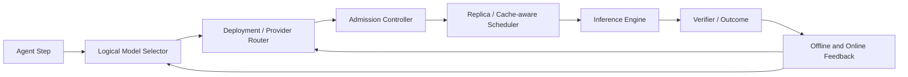
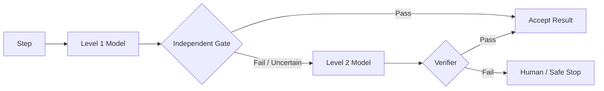
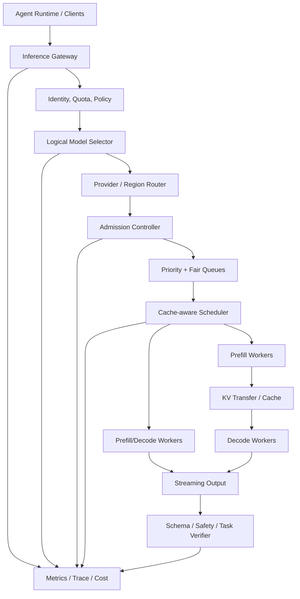
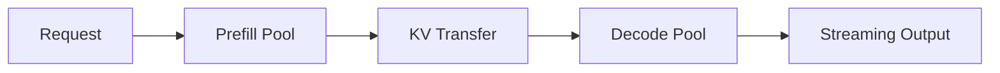

# 模型路由与推理调度

> 导航：[总目录](../README.md) | [控制平面](README.md) | [意图路由](03-意图识别与请求路由.md) | [任务规划](02-任务规划与推理.md) | [运行时平台](../03-执行平面/04-Agent运行时与平台工程.md) | [评测](../04-保障平面/01-Agent评测.md) | [可观测性](../04-保障平面/02-可观测性.md)

> 调研基线：2026-08-05。本章同时讨论逻辑模型选择和物理推理调度，但会严格区分它们的职责。

## 0. 本章怎么读

模型路由不是“便宜问题用小模型，困难问题用大模型”这么简单。生产系统至少包含三层：

```text
Model Selection: 这个 Agent Step 需要哪类模型能力？
Provider/Deployment Routing: 从哪个供应商、区域、版本和部署调用？
Replica Scheduling: 具体进入哪个副本、队列、Batch 和 KV Cache？
```

### 0.1 最需要掌握的十二个重点

| 优先级 | 重点 | 为什么重要 | 掌握标准 |
|---|---|---|---|
| P0 | 硬约束先于成本评分 | 不满足隐私、模态或工具协议的模型再便宜也不能选 | 能实现 Constraint Filter |
| P0 | 任务级模型画像 | 通用榜单不能预测具体 Agent 节点表现 | 能维护 ModelProfile 和分任务评测 |
| P0 | Cost per Successful Task | 单 Token 便宜可能因重试和失败更贵 | 能计算路由后的真实单位成本 |
| P0 | Cascade 升级条件 | 小模型错误放行会直接损害质量和安全 | 能设计独立 Verifier/Gate |
| P0 | Fallback 兼容性 | 换模型可能破坏 ToolCall、Schema 和安全边界 | 能定义 Fallback Compatibility Contract |
| P1 | 路由校准与 Oracle Gap | Router 本身也会误判 | 能评测 Regret、Oracle Gap 和选择概率 |
| P1 | 在线学习与探索安全 | Bandit 反馈延迟且有偏 | 能设计受约束探索和 Off-policy Eval |
| P1 | TTFT/TPOT 分离 | Prefill 和 Decode 的资源特征不同 | 能按 SLO 解释调度策略 |
| P1 | Continuous Batching/KV Cache | 决定自托管吞吐和延迟 | 能解释 PagedAttention、Prefix Cache 和亲和路由 |
| P1 | Admission 与公平调度 | 长请求会挤压在线请求 | 能实现 Token 预算、优先级和租户公平 |
| P1 | Prefill/Decode 解耦 | 大 Prompt 与长生成会相互干扰 | 能判断何时使用 Chunked Prefill 或 Disaggregation |
| P1 | 版本与可重放 | 动态路由若无快照无法排障 | 能固定 Router、Model、Adapter 和 Serving 版本 |

### 0.2 核心结论

1. 先过滤不满足能力、隐私、安全、上下文和协议的模型，再做质量、成本和延迟优化。
2. Router 的预测目标应是当前任务成功概率或业务效用，不是通用 Benchmark 排名。
3. Cascade 的关键是可靠升级信号，不是简单先调用小模型。
4. Fallback 是兼容性和策略问题，不是替换字符串。
5. 自托管推理要同时优化请求级路由和 Token 级调度。
6. 最终看质量-成本-延迟 Pareto 与 Cost per Successful Task，不看单模型价格。

---

## 1. 概念边界

### 1.1 四层决策

| 层 | 决定什么 | 典型输入 | 典型输出 |
|---|---|---|---|
| Task/Intent Router | 请求进入哪个业务流程 | 用户目标、上下文 | Workflow/Agent/Skill |
| Model Selector | 当前 Step 用哪个模型能力 | 任务、风险、模态、质量目标 | Model Family/Version |
| Deployment Router | 从哪个 Provider/Region/Endpoint 调用 | 地域、健康、配额、价格 | Endpoint |
| Replica Scheduler | 哪个实例何时执行 | Queue、KV、Batch、GPU | Replica + Schedule |

不要让 Replica Scheduler 决定业务质量等级，也不要让 LLM Router 绕过数据地域和租户策略。

### 1.2 Model、Deployment、Endpoint 和 Replica

```text
Model: 逻辑能力与权重版本
Deployment: 某模型在某供应商/区域/硬件上的部署配置
Endpoint: 可调用的 API 地址和协议适配器
Replica: 具体承载请求的运行实例
Adapter: LoRA、Prompt Bundle、Tool Adapter 或输出协议转换层
```

同一模型在不同量化、并行、上下文配置和推理参数下，质量、吞吐和延迟都可能不同，因此路由快照不能只记录模型名称。

### 1.3 两个路由环



逻辑环根据质量结果学习模型选择；物理环根据健康、队列、缓存和 SLO 调整部署与副本。

---

## 2. ModelRequirement：路由输入契约

### 2.1 路由前先描述需求

模型选择至少需要：

- Step 类型：分类、规划、工具参数、代码、视觉、总结、Judge。
- 输入语言、模态、上下文长度和预估输出长度。
- ToolCall、并行工具、JSON Schema、Grammar 和 Streaming 要求。
- 质量目标、风险等级、是否必须使用独立 Verifier。
- TTFT、TPOT、端到端 Deadline 和吞吐优先级。
- 数据地域、供应商、保留策略、私有部署和合规限制。
- 可接受费用、重试次数和 Fallback 范围。

### 2.2 ModelRequirementV2

```yaml
model_requirement:
  schema_version: model-requirement/v2
  run_id: run_01J...
  step_id: step_plan_fix
  task_type: agent_planning
  task_tags: [code, long_horizon, tool_use]

  input:
    modalities: [text]
    language: zh-CN
    prompt_tokens_estimate: 42000
    max_context_required: 64000
    expected_output_tokens: 3500

  capabilities:
    structured_output_schema: PlanV3
    tool_calling: required
    parallel_tool_calling: optional
    reasoning_level: high
    code_understanding: required
    vision: not_required

  quality:
    min_task_success_probability: 0.88
    max_schema_failure_probability: 0.01
    verifier_required: true

  risk:
    level: L1
    allowed_autonomy: reversible_write

  sla:
    max_ttft_ms: 3000
    max_e2e_ms: 45000
    priority_class: interactive_high

  privacy:
    data_classification: confidential_code
    allowed_regions: [us-east, us-west]
    allowed_providers: [private_cluster]
    retention: no_training_no_log

  budget:
    max_cost_usd: 0.35
    max_attempts: 2
    reserve_for_fallback_usd: 0.12
```

### 2.3 Hard Constraint 与 Soft Objective

| 类型 | 示例 | 处理方式 |
|---|---|---|
| Hard | 必须支持图像输入 | 不满足直接过滤 |
| Hard | 数据只能在指定区域 | 不满足直接过滤 |
| Hard | ToolCall Schema 兼容 | 不满足不可 Fallback |
| Soft | 更低费用 | 进入综合评分 |
| Soft | 更低 TTFT | 在 SLO 内优化 |
| Soft | 更高质量余量 | 与成本和容量权衡 |

禁止用加权分数让低成本抵消隐私、权限或协议不兼容。

---

## 3. Model Registry 与能力画像

### 3.1 ModelProfileV3

```yaml
model_profile:
  schema_version: model-profile/v3
  model_id: planner-model-70b
  model_version: "2026-07-18"
  deployment_id: private-us-east-a
  serving_config_version: 31

  capabilities:
    modalities: [text, image]
    max_context_tokens: 131072
    max_output_tokens: 16384
    tool_calling: true
    parallel_tools: true
    json_schema: strict
    supported_languages: [zh-CN, en-US, ja-JP]

  policy:
    regions: [us-east]
    data_retention: none
    tenant_allowlist: [enterprise]
    risk_ceiling: L2

  quality_profiles:
    - task_slice: {task_type: agent_planning, language: zh-CN}
      task_success: 0.91
      schema_valid: 0.995
      unsafe_action_rate: 0.001
      sample_size: 840
      eval_version: planner-eval@14
    - task_slice: {task_type: intent_classification}
      task_success: 0.97
      sample_size: 2300

  cost:
    input_per_million_tokens_usd: 0.80
    output_per_million_tokens_usd: 2.40
    fixed_request_cost_usd: 0

  performance:
    p50_ttft_ms: 850
    p95_ttft_ms: 2600
    p50_tpot_ms: 18
    p95_tpot_ms: 31
    max_sustainable_tokens_per_second: 18000

  health:
    status: healthy
    error_rate_5m: 0.004
    queue_delay_p95_ms: 420
    kv_cache_pressure: 0.62
```

### 3.2 画像来源

- 固定离线评测集。
- Shadow 与 Canary 流量。
- 线上 Verifier 和任务结果。
- Serving Telemetry：TTFT、TPOT、Queue、Cache、OOM。
- Provider 价格、配额、地域和协议元数据。
- 安全红队、拒答和越权评测。

### 3.3 画像必须分任务切片

“模型 A 总体 90 分”不能用于路由。至少按以下维度切片：

- Task Type 和难度。
- 语言、领域和模态。
- Context Length Bucket。
- ToolCall/Structured Output。
- 风险等级。
- Prompt/Agent/Workflow Version。
- Provider、量化和 Serving Config。

样本不足时需要置信区间或回退到父切片，不能把 5 条样本的 100% 成功率当可靠画像。

### 3.4 模型兼容矩阵

| 能力 | 需要验证什么 |
|---|---|
| Tool Calling | 名称、参数、并行行为、错误格式 |
| Structured Output | JSON Schema 子集、拒绝语义、截断 |
| Streaming | Event 类型、Usage、Stop Reason |
| Context | 实际可用窗口、工具和图像 Token 计算 |
| Vision/Audio | 格式、尺寸、帧数、区域支持 |
| Safety | 拒答边界、敏感数据和高风险动作 |
| Prompt Semantics | System/Developer 优先级和消息角色 |

---

## 4. ModelRouteDecision

### 4.1 ModelRouteDecisionV3

```yaml
model_route_decision:
  schema_version: model-route-decision/v3
  route_id: mr_01J...
  requirement_ref: model-requirement://step_plan_fix
  router_version: model-router@18
  policy_version: model-policy@12

  eligible_deployments:
    - deployment_id: private-us-east-a
      predicted_success: 0.91
      predicted_cost_usd: 0.16
      predicted_ttft_ms: 2200
      score: 0.84
    - deployment_id: private-us-east-b
      predicted_success: 0.89
      predicted_cost_usd: 0.11
      predicted_ttft_ms: 1300
      score: 0.86

  selected:
    model_id: planner-model-32b
    model_version: "2026-07-25"
    deployment_id: private-us-east-b
    adapter_version: plan-json-adapter@6
    serving_config_version: 44

  strategy: quality_constrained_min_cost
  selection_reason:
    - "meets 0.88 task success target"
    - "lower expected cost and TTFT"

  cascade:
    level: 1
    verifier: plan-compiler@5
    escalate_to: private-us-east-a

  fallback_chain:
    - private-us-west-b
    - provider-x-us

  reservation:
    estimated_prompt_tokens: 42000
    estimated_output_tokens: 3500
    deadline_at: "2026-08-05T12:30:45Z"
```

### 4.2 路由不变量

1. 所有候选先通过 Hard Constraint Filter。
2. 预测质量必须关联具体任务切片和评测版本。
3. Route Snapshot 固定模型、部署、Adapter、推理参数和 Router 版本。
4. Fallback Chain 中每个模型都通过协议和安全兼容测试。
5. 预算包含初次调用、Verifier 和 Fallback Reserve。
6. Serving Scheduler 可以换 Replica，不能未经允许换逻辑模型版本。

---

## 5. 路由策略谱系

### 5.1 策略总表

| 策略 | 机制 | 优点 | 风险 |
|---|---|---|---|
| Static Mapping | Task 固定到模型 | 可控、易复现 | 不能适应难度和容量 |
| Rule-based | 按长度、语言、风险和模态 | 快、可解释 | 规则膨胀、边界粗糙 |
| Quality-constrained | 选最便宜的合格模型 | 目标清晰 | 依赖可靠质量预测 |
| Learned Router | 分类/回归预测模型表现 | 可学习复杂边界 | 数据偏差和漂移 |
| Pairwise Router | 预测强弱模型偏好 | 适合两级或少量模型 | 多模型扩展和传递性问题 |
| Cascade | 小模型先答，Gate 失败再升级 | 节省简单样本成本 | 错误放行和双重延迟 |
| AutoMix/Self-verify | 小模型估计自身答案可靠性 | 无需完整 Router 标注 | 自验证偏差 |
| Contextual Bandit | 在线按上下文探索收益 | 适应变化 | 反馈延迟、探索风险 |
| Ensemble | 多模型并行生成/验证 | 高价值任务更稳 | 成本高、错误相关 |
| Fallback | 故障时切兼容部署 | 提高可用性 | 质量和协议退化 |
| Hedged Request | 慢请求并行发第二副本 | 降低尾延迟 | 成本和重复调用 |

### 5.2 生产默认路径

```text
Hard Constraint Filter
  -> Static/Rule Guardrails
  -> Learned Quality-Cost Router
  -> Optional Cascade Gate
  -> Provider/Region Health Route
  -> Cache-aware Replica Schedule
  -> Verifier and Outcome Feedback
```

---

## 6. 质量、成本与效用优化

### 6.1 约束优化

```text
minimize   ExpectedCost(model, task)
         + λ_latency * ExpectedLatency
         + λ_risk * FailureRisk

subject to PredictedTaskSuccess >= quality_target
           SafetyPass >= safety_target
           SchemaValid >= schema_target
           PrivacyPolicy == satisfied
           DeadlineFeasible == true
```

风险和隐私中的硬约束不能只作为惩罚项。

### 6.2 Cost per Successful Task

```text
ExpectedCostPerSuccess(model) =
  (InitialCallCost
   + ExpectedRetryCost
   + ExpectedVerifierCost
   + ExpectedFallbackCost
   + ExpectedHumanCost)
  / PredictedTaskSuccess
```

小模型每次调用更便宜，但如果 Schema 失败、重试和升级频繁，单位成功成本可能更高。

### 6.3 Router Score

```text
Score(m | x) = wq * P(success | x, m)
             + ws * P(safe | x, m)
             - wc * ExpectedCost(x, m)
             - wl * ExpectedLatency(x, m)
             - wu * Uncertainty(x, m)
             - wf * Switching/FallbackPenalty
```

建议直接学习“是否满足任务目标”或 Pairwise Preference，而不是预测模糊的“难度分”。

### 6.4 Pareto Frontier

一个模型若在质量、成本和延迟上都被另一个模型支配，应从该任务切片的候选集中移除。Router 只需要在 Pareto Frontier 上做选择。

### 6.5 质量预测信号

- Task Type、语言、模态、Context Length。
- 结构化输出和 ToolCall 复杂度。
- 输入不确定性、规划深度和代码规模。
- 模型在相似任务切片的历史成功率。
- 小模型候选答案的 Verifier、Reward 或 Critic 分数。
- Schema、引用、测试和环境断言是否通过。
- 当前模型健康、截断风险和上下文压力。

模型自报置信度只能作为一个弱特征。

---

## 7. Learned Router、Preference Router 与评测

### 7.1 训练样本

```yaml
router_training_example:
  request_features:
    task_type: code_patch
    language: zh-CN
    prompt_tokens: 18000
    tool_count: 12
    risk_level: L1
  outcomes:
    small_model:
      success: false
      schema_valid: true
      cost_usd: 0.03
      latency_ms: 4200
    large_model:
      success: true
      schema_valid: true
      cost_usd: 0.21
      latency_ms: 9300
  preferred_under_policy: large_model
  policy_version: quality-0.9@4
```

### 7.2 Pairwise Preference Router

RouteLLM 一类方法学习“对于请求 X，强模型相对弱模型是否值得”。常见训练来源：

- 两个模型在同一任务上的人工偏好。
- LLM Judge，但必须校准偏差。
- 可执行 Verifier 的胜负结果。
- 任务成功与失败标签。

Pairwise Router 适合强弱两级或少量模型。模型数量增加时要处理不传递偏好、稀疏比较和新模型冷启动。

### 7.3 RouterBench 类评测

多模型 Router 评测需要固定：

- 候选模型集合和版本。
- 每个请求在每个模型上的真实/近似结果。
- 统一费用和延迟模型。
- 相同质量约束下的成本，或相同成本下的质量。
- Oracle Router 和随机/静态基线。

### 7.4 Oracle Gap 与 Regret

```text
OracleGap = Utility(oracle_best_model_per_request)
            - Utility(router_selected_model)

Regret_t = Reward(best_available_model_t) - Reward(selected_model_t)
```

Oracle 需要每个请求的多模型反事实结果，线上通常不可得，可在离线全量评测集或采样流量上估计。

### 7.5 冷启动

- 新模型先跑固定离线集和 Shadow。
- 继承相似模型/部署的先验，但置信区间要宽。
- 限制在低风险、可验证流量探索。
- 逐步扩大任务切片，不直接全量替换。
- Prompt/Tool Adapter 不兼容时视为新候选，不继承旧画像。

---

## 8. Cascade 设计

### 8.1 标准流程



### 8.2 Gate 信号

强信号：

- JSON/Grammar/Tool Schema 校验。
- 单元测试、数据库断言、引用检查。
- Policy 和安全规则。
- 独立模型 Judge 或 Reward Model。
- Conformal/Calibration 得到的选择集合。

弱信号：

- 执行模型自报置信度。
- 输出长度和语言流畅度。
- 单次 Logprob 或平均 Entropy。

### 8.3 Cascade Policy

```yaml
cascade_policy:
  policy_id: planning-cascade@6
  levels:
    - level: 1
      deployment: planner-8b
      max_cost_usd: 0.04
      gate:
        schema_valid: required
        plan_compiler_errors: 0
        verifier_score_min: 0.84
    - level: 2
      deployment: planner-70b
      max_cost_usd: 0.30
      gate:
        schema_valid: required
        plan_compiler_errors: 0
        verifier_score_min: 0.92
  max_levels: 2
  total_deadline_ms: 45000
  reuse_level_1_artifacts: true
  on_exhausted: safe_stop
```

### 8.4 延迟预算

顺序 Cascade 的最坏延迟是多级调用相加。需要给每一级分配 Deadline：

```text
TotalDeadline = Queue1 + Infer1 + Gate1
              + Queue2 + Infer2 + Gate2
              + ResponseReserve
```

交互式高延迟场景可使用预路由，或对少量高价值请求并行发强弱模型后早停，但成本会上升。

### 8.5 复用前一级结果

可以复用：

- 检索证据、工具 Observation、结构化提取结果。
- 失败 Schema 和 Verifier Feedback。
- 候选计划或草稿作为强模型输入。

不能无条件复用：

- 未验证事实和错误推断。
- 被 Prompt Injection 污染的摘要。
- 已截断却未标记完整性的输出。

### 8.6 Cascade 伪代码

```python
def run_cascade(requirement, context, policy):
    deadline = Deadline(policy.total_deadline_ms)
    artifacts = {}

    for level in policy.levels:
        if not deadline.can_fit(level.estimated_p95_ms):
            break

        deployment = select_healthy_deployment(level, requirement)
        result = invoke(deployment, context, artifacts, deadline)
        validation = level.gate.verify(result)

        record_level_outcome(level, result, validation)
        if validation.passed:
            return Accepted(result, level)

        artifacts.update(extract_verified_artifacts(result, validation))
        context = build_escalation_context(context, validation, artifacts)

    return safe_stop_or_human(requirement, artifacts)
```

---

## 9. Fallback 与故障路由

### 9.1 Fallback 触发原因

| 原因 | 是否可换同模型副本 | 是否可换逻辑模型 |
|---|---:|---:|
| 单副本 OOM/崩溃 | 是 | 通常不需要 |
| 区域/Provider 故障 | 是 | 可按兼容链 |
| 429/配额耗尽 | 换配额池或区域 | 可 |
| Deadline 即将超时 | 选更快部署 | 需确认质量下限 |
| 模型输出质量失败 | 无意义 | 升级模型/Cascade |
| Schema 不兼容 | 否 | 只能选已验证兼容模型 |
| 安全策略拒绝 | 否 | 不得通过换模型绕过 |

### 9.2 Compatibility Contract

```yaml
fallback_compatibility:
  primary: provider-a/model-x@2026-07
  fallback: private/model-y@2026-06
  compatible:
    message_roles: true
    json_schema_subset: true
    tool_names: true
    parallel_tool_semantics: false
    streaming_events: adapter_required
    safety_policy: stricter
    context_limit: 65536
  restrictions:
    - "disable parallel tool calls"
    - "truncate only retrieved evidence, never system constraints"
  regression_suite: fallback-contract@8
```

### 9.3 Fallback 链原则

- 在任务开始时固定允许链和适配器版本。
- 先同模型跨副本/区域，再跨逻辑模型。
- 切换后重新运行 Schema、安全和目标 Verifier。
- 不因 Provider 故障绕过数据地域和保留策略。
- 记录实际使用模型，成本和质量归因不能算到 Primary。
- 限制最大切换次数，避免 Provider 间抖动。

### 9.4 Hedged Requests

当请求超过某尾延迟阈值，可向第二个兼容副本发送相同请求，首个合格结果获胜。

只适合：

- 推理调用本身无外部副作用。
- 两个结果都要经过同一 Verifier。
- 有去重和取消剩余请求能力。
- 额外成本换尾延迟有明确价值。

---

## 10. Contextual Bandit 与在线学习

### 10.1 Bandit 建模

```text
Context x: task, language, length, risk, tenant, queue state
Action a: eligible model/deployment
Reward r: task success value - cost - latency penalty - safety penalty
```

### 10.2 反馈难点

- 最终任务成功可能在几分钟或几天后才知道。
- 只有被选择模型有真实结果，缺少反事实标签。
- 用户接受、重试和放弃是有偏反馈。
- 高风险任务不能自由探索。
- 模型价格、Prompt 和 Serving 状态持续变化。

### 10.3 受约束探索

- 只在满足 Hard Constraint 的模型间探索。
- 高风险任务使用固定已验证模型。
- 新模型从 Shadow、低风险和强 Verifier 任务开始。
- 设置最大质量下降、成本和流量预算。
- 使用 Kill Switch 和按任务切片回滚。

### 10.4 Off-policy Evaluation

在线发布前可以使用 IPS、Doubly Robust 等方法估计新策略，但前提是旧策略记录 Propensity，且候选动作有足够覆盖。

```yaml
bandit_event:
  context_hash: sha256:ab...
  eligible_actions: [model_a, model_b]
  selected_action: model_b
  propensity: 0.18
  immediate_reward:
    latency_penalty: -0.04
    cost_penalty: -0.02
  delayed_reward:
    task_success: 1.0
  reward_finalized_at: "2026-08-05T13:02:00Z"
```

没有 Propensity 和版本快照的线上日志无法可靠做反事实策略评估。

---

## 11. 推理服务参考架构



### 11.1 各层职责

| 层 | 负责 | 不负责 |
|---|---|---|
| Gateway | 统一协议、身份、配额、请求追踪 | 决定业务 Intent |
| Model Selector | 质量约束下选择逻辑模型 | GPU Batch 细节 |
| Deployment Router | 区域、Provider、健康和价格 | 改变任务质量目标 |
| Admission | 是否接收、排队或拒绝 | 生成答案 |
| Scheduler | Batch、Replica、KV 和优先级 | 绕过租户配额 |
| Engine | Prefill、Decode、Sampling | 判断最终任务成功 |
| Verifier | Schema、安全、任务结果 | 管理 GPU 调度 |

---

## 12. 推理阶段与核心延迟指标

### 12.1 Prefill 与 Decode

```text
Prefill: 并行处理全部输入 Token，计算首个 KV Cache，计算密集
Decode: 每轮生成一个或少量 Token，反复读取 KV Cache，内存带宽和调度敏感
```

长 Context 的 Prefill 会占用大量计算，长输出的 Decode 会长期占用 KV 和 Batch Slot。二者混排不当会造成 Head-of-line Blocking。

### 12.2 关键指标

| 指标 | 定义 | 用户感知 |
|---|---|---|
| Queue Time | 进入服务到开始推理 | 拥塞和优先级 |
| TTFT | 请求到第一个输出 Token | 首次响应速度 |
| TPOT | 相邻输出 Token 的平均时间 | 流式生成速度 |
| ITL | 单 Token 间延迟分布 | 卡顿和抖动 |
| E2E Latency | 请求到完整结果 | 非流式/工具节点总耗时 |
| Throughput | 每秒请求或 Token | 系统容量 |
| Goodput | 满足 SLO 的有效吞吐 | 比纯吞吐更有意义 |

### 12.3 SLO 按任务区分

| 任务 | 主要 SLO | 原因 |
|---|---|---|
| Chat/交互 Agent | TTFT、ITL | 用户关注即时反馈 |
| Tool Argument | E2E、Schema Success | 输出短且必须正确 |
| Planner | E2E、Quality | 可容忍稍慢但质量关键 |
| Batch Eval | Throughput、Cost | 无强交互延迟 |
| Long Context RAG | Prefill、TTFT | 输入大、输出可能短 |
| Judge/Verifier | E2E、Calibration | 通常不直接展示流式结果 |

---

## 13. Continuous Batching、PagedAttention 与 KV Cache

### 13.1 Continuous Batching

传统静态 Batch 等整个批次完成后再接收新请求，容易被长输出拖慢。Continuous Batching 在解码迭代间动态加入和移除请求，提高 GPU 利用率。

代价：

- 调度器需要持续管理不同长度序列。
- Batch 过大可能提升吞吐但恶化 TPOT。
- 高优先请求需要可抢占或保留容量。

### 13.2 PagedAttention

vLLM 的 PagedAttention 把 KV Cache 分成非连续块，类似虚拟内存分页，降低碎片并支持更灵活的共享和调度。

需要监控：

- KV Block 使用率和碎片。
- Eviction、Swap/Offload 和 Recompute。
- 请求最大上下文与最大并发的组合。
- 多 LoRA、Beam 和 Prefix Sharing 对 KV 的影响。

### 13.3 Prefix/Prompt Cache

Agent 请求中常重复：

- System/Developer Instructions。
- Tool Schema 和安全规则。
- Workflow 固定模板。
- 长文档共同前缀。

Prefix Cache 可以复用这些前缀的 KV，主要降低 Prefill，而不是改善长 Decode。

### 13.4 Cache Key 与安全

```yaml
prefix_cache_key:
  model_weights: model-x@sha256:...
  tokenizer: tokenizer@7
  serving_config: config@31
  adapter: lora-support@9
  prompt_prefix_hash: sha256:ab...
  tenant_scope: tenant_acme
  data_classification: confidential
```

跨租户共享缓存需要非常谨慎。即使缓存不直接暴露文本，也要考虑侧信道、错误复用和隔离策略。敏感上下文默认按租户或安全域隔离。

### 13.5 Cache-aware Routing

当多个副本兼容时，优先路由到已持有所需 Prefix/KV 的副本，可以降低 TTFT。但需要与队列长度权衡：

```text
ReplicaScore = CacheAffinityBenefit
             - QueueDelayPenalty
             - LoadPenalty
             - FailureRisk
```

不能为了缓存命中把请求送入严重拥塞副本。

---

## 14. Admission Control 与 Token 级调度

### 14.1 为什么不能只按请求数限流

两个请求可能分别是：

- 500 输入 Token + 50 输出 Token。
- 100k 输入 Token + 8k 输出 Token。

按请求数计算会严重低估后者资源。Admission 至少估算：

```text
PrefillWork ~ PromptTokens
DecodeWork ~ ExpectedOutputTokens
KVFootprint ~ (PromptTokens + OutputTokens) * Layers * KVHeads * HeadDim
```

### 14.2 AdmissionDecision

```yaml
admission_decision:
  request_id: inf_01J...
  decision: admit
  priority_class: interactive_high
  reserved:
    prompt_tokens: 42000
    output_tokens: 3500
    kv_blocks: 712
    deadline_ms: 45000
  queue: interactive-planner
  preemptible: false
  reason: "capacity and deadline feasible"
```

其他结果包括 `queue`、`degrade`、`reroute`、`reject_overloaded` 和 `reject_quota`。

### 14.3 优先级与公平

| 机制 | 作用 | 风险 |
|---|---|---|
| Strict Priority | 高优先请求先执行 | 低优先饥饿 |
| Weighted Fair Queue | 按租户/类别分配份额 | 实现复杂 |
| Token Bucket | 限制长期和突发 Token | 需准确估算 |
| Deadline-aware | 优先即将违约请求 | 可能牺牲吞吐 |
| Shortest Remaining Processing | 降低平均延迟 | 长任务饥饿 |
| Reserved Capacity | 为高优先级保留 GPU/KV | 空闲时利用率下降 |

生产常组合使用：租户 Token Bucket + Weighted Fair Queue + Priority Class + Deadline。

### 14.4 调度器伪代码

```python
def schedule_inference(queues, replicas, now):
    candidates = []
    for queue in queues:
        for request in queue.ready_requests():
            if request.deadline_expired(now):
                fail_deadline(request)
                continue
            if not tenant_quota.can_consume(request.estimated_tokens):
                continue
            candidates.append(request)

    ranked = rank_requests(
        candidates,
        priority=True,
        deadline_slack=True,
        tenant_fairness=True,
        starvation_age=True,
    )

    for request in ranked:
        compatible = filter_compatible_replicas(request, replicas)
        replica = choose_replica(
            compatible,
            cache_affinity=request.prefix_hash,
            queue_delay=True,
            kv_capacity=True,
            health=True,
        )
        if replica and replica.reserve(request):
            dispatch(request, replica)
```

### 14.5 Preemption

可抢占 Batch/低优先请求以服务高优先请求，但需要决定：

- 被抢占请求的 KV 是保留、Swap 还是丢弃后 Recompute。
- 已生成 Token 如何继续流式输出。
- 抢占频率是否导致 Thrashing。
- 低优先任务最大等待时间。

---

## 15. Chunked Prefill 与 Prefill/Decode Disaggregation

### 15.1 Chunked Prefill

Sarathi-Serve 一类方法把长 Prefill 切成块，与 Decode 迭代交错，减少长 Prompt 阻塞正在生成的请求。

适合：

- 长 Context 与在线 Decode 混部。
- 希望控制每轮 Batch 的计算量。
- 单集群同时追求 TTFT 和 TPOT 平衡。

代价是调度更复杂，Prefill 完成时间可能增加。

### 15.2 Prefill/Decode Disaggregation

DistServe 一类架构将 Prefill 和 Decode 放到不同 Worker/硬件池，通过 KV Transfer 连接：



优势：

- 两阶段独立扩缩容和硬件选择。
- 减少 Prefill/Decode 干扰。
- 可分别优化 TTFT 和 TPOT。

代价：

- KV 传输带宽和延迟。
- Worker 亲和、容错和流控复杂。
- 小请求可能不值得拆分。

### 15.3 何时选择

| 场景 | 推荐 |
|---|---|
| 中小模型、请求较均匀 | 统一 Continuous Batching |
| 长 Prompt 与长 Decode 混合 | Chunked Prefill |
| 大规模服务、阶段负载差异明显 | Prefill/Decode Disaggregation |
| 离线批任务 | 吞吐优先的静态/连续 Batch |

---

## 16. 并行、量化与推理加速

### 16.1 并行方式

| 方式 | 拆什么 | 适用 |
|---|---|---|
| Data Parallel | 请求副本 | 高并发、模型单卡可放 |
| Tensor Parallel | 单层矩阵 | 模型跨多卡 |
| Pipeline Parallel | 不同层 | 超大模型、跨节点 |
| Expert Parallel | MoE 专家 | 稀疏 MoE 模型 |
| Sequence/Context Parallel | 长序列 | 超长上下文 |

并行度提高会增加通信和尾延迟，不是越大越好。应按模型、硬件拓扑、Batch 和 SLO 压测。

### 16.2 Speculative Decoding

使用小 Draft Model 一次提出多个 Token，大模型并行验证，接受匹配前缀以减少大模型解码轮数。

收益取决于：

- Draft 与 Target 的接受率。
- Draft 额外开销。
- Batch 大小和硬件利用率。
- Sampling 参数和任务分布。

它主要优化 Decode，不解决长 Prompt Prefill。

### 16.3 Quantization

INT8/FP8/INT4 等量化可以降低显存和提高吞吐，但需要按任务切片重新验证：

- ToolCall 和 JSON Schema 遵循。
- 长上下文和多语言。
- 代码、数学、规划和 Judge。
- 安全拒答和概率校准。

量化版本应作为独立 Deployment Profile，不能默认继承全精度质量。

### 16.4 Adapter 与多 LoRA

多租户 LoRA 可以共享 Base Model，但要考虑：

- Adapter 加载、缓存和切换延迟。
- Batch 中不同 Adapter 是否可混合。
- Adapter/Tokenizer/Prompt 兼容。
- 租户隔离和版本回滚。

---

## 17. Autoscaling 与容量规划

### 17.1 容量不是 QPS

至少按以下维度建模：

- Prompt/Output Token 分布。
- Prefill FLOPs 和 Decode Tokens/s。
- KV Cache 容量和序列长度。
- Batch Size、并行度和模型副本数。
- Priority Mix 和 SLO Goodput。
- Cache Hit、Speculative Acceptance、量化配置。

### 17.2 需要监控的饱和信号

- Queue Delay 和 Deadline Miss 上升。
- TTFT/TPOT 超 SLO。
- KV Cache Pressure、Eviction 和 Recompute。
- GPU 利用率高但 Goodput 下降。
- Batch Slot、Token Budget 或网络饱和。
- Prefix Cache Hit 下降。
- OOM、Preemption 和 Retry 增加。

### 17.3 Autoscaling 指标

只按 GPU Utilization 扩容会滞后。推荐组合：

```text
desired_replicas = f(
  queued_prompt_tokens,
  queued_decode_tokens,
  deadline_slack,
  kv_pressure,
  observed_goodput,
  cold_start_time
)
```

模型加载时间较长时需要预热池、预测扩容或最小副本，不能等队列爆满后再启动。

### 17.4 Overload 降级顺序

1. 拒绝超过租户配额的请求。
2. 将批量/低优先请求延后或转离线队列。
3. 路由到健康兼容区域或部署。
4. 在质量策略允许时选择更小模型。
5. 缩小非关键输出长度或关闭可选 Ensemble。
6. 明确返回过载，不让请求无限排队。

不能在过载时静默降低安全、隐私或高风险质量要求。

---

## 18. 故障模型与恢复

| 故障 | 检测 | 处理 |
|---|---|---|
| Provider 429 | 状态码、配额头 | Backoff、换配额池/区域 |
| Replica OOM | Engine Error、KV Pressure | 驱逐/重调度、降低 Batch |
| Queue Overload | Queue/Slack | Admission Reject、Reroute |
| Slow Replica | TTFT/TPOT Outlier | Circuit Breaker、Hedge |
| Model Schema Drift | Validation Failure | 禁用部署、切兼容版本 |
| Quality Regression | Eval/Online Verifier | Canary Stop、Rollback |
| Cache Corruption/Mismatch | Hash/Output Error | Evict Cache、重新 Prefill |
| Region Failure | Health Check | 跨区 Fallback，保持数据策略 |
| Cost Spike | Billing/Token Drift | Budget Breaker、路由降级 |

### 18.1 Circuit Breaker 粒度

可以按以下维度熔断：

- Provider。
- Region/Endpoint。
- Model Version。
- ToolCall/JSON 能力。
- Task Slice。
- Tenant。

某模型只在长上下文 ToolCall 上退化时，不必全局下线，但必须让 Router 能按切片绕开。

### 18.2 分层重试放大

SDK、Gateway、Router、Provider 和 Agent Runtime 若各重试 3 次，最坏会放大到大量调用。应指定唯一重试 Owner，并传递 Attempt Budget。

```yaml
attempt_budget:
  total_attempts: 3
  gateway_retries: 0
  provider_retries: 1
  model_fallbacks: 1
  agent_level_replan: 1
```

---

## 19. 多租户、隐私与治理

### 19.1 路由约束

- 数据地域和供应商 Allowlist。
- 私有部署或零保留要求。
- 租户模型版本、Adapter 和 Prompt 白名单。
- 每分钟请求、输入/输出 Token、并发和总费用配额。
- 高风险任务允许的模型和 Verifier。
- 是否允许跨租户 Prefix Cache、Batch 和日志。

### 19.2 公平和隔离

```yaml
tenant_inference_policy:
  tenant_id: tenant_acme
  priority_weight: 3
  token_rate_per_minute: 2000000
  max_concurrent_sequences: 64
  max_cost_usd_per_day: 500
  reserved_capacity_percent: 10
  allowed_models: [planner-32b, planner-70b]
  cache_scope: tenant
  log_prompts: false
```

### 19.3 Batch 和 Cache 隔离

共享 GPU Batch 通常不意味着共享上下文，但仍要防止：

- 请求 ID、Usage、流式事件串线。
- Prefix Cache Key 缺租户/Adapter 维度。
- 日志和错误堆栈记录敏感 Prompt。
- 侧信道和资源抢占影响关键租户。
- 多 LoRA Adapter 错配。

### 19.4 Router 不得越权优化

即使某外部 Provider 更便宜、更快，若租户策略不允许数据离开私有区域，Router 必须过滤。成本和延迟优化只能在合规候选集合内进行。

---

## 20. 可观测性、版本与发布

### 20.1 Model Route Span

```yaml
model_route_span:
  route_id: mr_01J...
  run_id: run_01J...
  step_id: step_plan_fix
  router_version: model-router@18
  requirement_hash: sha256:ab...
  eligible_deployments: [private-us-east-a, private-us-east-b]
  selected_deployment: private-us-east-b
  selection_strategy: quality_constrained_min_cost
  predicted:
    success: 0.89
    cost_usd: 0.11
    ttft_ms: 1300
  actual:
    prompt_tokens: 41720
    output_tokens: 3180
    queue_ms: 210
    ttft_ms: 1420
    tpot_ms: 19
    cost_usd: 0.12
    verifier_passed: true
  cache:
    prefix_hit: true
    reused_tokens: 8200
  fallback_count: 0
```

### 20.2 必须关联的版本

- Router Model/Rule/Threshold。
- Model Weights、Tokenizer、Quantization。
- Provider API、Endpoint、Region。
- Adapter/LoRA、Prompt Bundle、Tool Adapter。
- Sampling、Max Tokens、Context Truncation Policy。
- Serving Engine、Scheduler、Cache Config。
- Verifier 和 Eval Set。

### 20.3 发布流程

```text
New Model/Router/Serving Config
  -> Capability Contract Tests
  -> Task-sliced Offline Eval
  -> Load/Capacity Test
  -> Shadow Route and Shadow Inference
  -> Canary by Task/Tenant/Risk
  -> Quality/Cost/Latency/Safety Gate
  -> Gradual Rollout or Rollback
```

### 20.4 Shadow 区分两种

- **Shadow Route**：新 Router 只产生选择，不实际调用候选模型，比较决策。
- **Shadow Inference**：复制部分请求给新模型，但不影响用户，获得真实结果和成本。

后者更准确但昂贵，并涉及额外数据处理权限。

---

## 21. 评测体系

### 21.1 分层评测

| 层 | 评测对象 | 指标 |
|---|---|---|
| Model | 单模型任务能力 | Task Success、Schema、Safety |
| Router | 是否选择合适模型 | Oracle Gap、Regret、Route Accuracy |
| Cascade | 升级是否正确 | Escalation Precision/Recall |
| Fallback | 故障时是否保持契约 | Recovery Success、Quality Drop |
| Serving | 是否满足容量和 SLO | Goodput、TTFT、TPOT、Queue |
| End-to-end | 对 Agent 的真实价值 | Cost per Successful Task |

### 21.2 Router Eval Case

```yaml
model_route_eval_case:
  case_id: planner_code_042
  requirement:
    task_type: agent_planning
    language: zh-CN
    context_bucket: 32k_64k
    risk_level: L1
  candidate_outcomes:
    planner_8b:
      success: false
      cost_usd: 0.04
      latency_ms: 3500
    planner_32b:
      success: true
      cost_usd: 0.12
      latency_ms: 7200
    planner_70b:
      success: true
      cost_usd: 0.27
      latency_ms: 12000
  expected_policy_choice: planner_32b
  constraints:
    min_success: 0.88
    max_latency_ms: 10000
```

### 21.3 逻辑路由指标

- Quality at Fixed Cost、Cost at Fixed Quality。
- Oracle Gap、Average Regret。
- Cheapest Qualified Model Accuracy。
- High-risk Under-routing Rate。
- Over-routing Rate：本可用小模型却选大模型。
- Cascade Escalation Precision/Recall。
- Fallback Quality Retention。
- Router Calibration 和选择概率稳定性。

### 21.4 Serving 指标

- P50/P95/P99 Queue、TTFT、TPOT、E2E。
- Goodput、Tokens/s、Requests/s。
- Batch Size、GPU Utilization、MFU。
- KV Cache Usage、Hit、Eviction、Recompute。
- Prefix Cache Hit 和 Saved Prefill Tokens。
- Admission Reject、Preemption、OOM、Retry。
- 每租户 SLO 和公平性。

### 21.5 测试切片

- 短/长 Prompt，短/长输出。
- ToolCall、JSON、代码、规划、Judge、视觉。
- 多语言和低资源语言。
- 高风险和安全拒答。
- Provider 429、区域故障、Schema Drift。
- 冷 Cache/热 Cache、不同并发和 Batch。
- 量化、LoRA、不同 Serving Config。

### 21.6 基线

至少比较：

1. 全部使用最强模型。
2. 全部使用最便宜模型。
3. 静态任务映射。
4. 简单长度/规则路由。
5. Learned Router/Cascade。
6. Oracle Router。

没有这些基线，很难判断复杂路由器是否真实有价值。

---

## 22. 三个完整案例

### 22.1 单 Agent 内不同节点使用不同模型

任务：代码缺陷修复。

```text
Intent Classification -> 轻量分类模型
Repository Map/Extraction -> 长上下文低成本模型
Root-cause Planning -> 强推理模型
Patch Generation -> 代码模型
Unit Test Summary -> 小模型/规则
Security Review -> 独立高质量 Judge + 静态规则
Final Explanation -> 通用生成模型
```

重点：模型路由按 Step 的能力和风险，不按整个 Run 固定一个模型。Planner 与 Security Judge 应尽量错误解耦。

### 22.2 在线交互与批量评测混部

在线请求要求 TTFT < 2 秒，批量评测有大量 64k Prompt 且无即时 SLO。

推荐：

- 独立 Priority Queue 和 Token Quota。
- 在线保留容量，批量任务可抢占。
- 长 Prefill 使用 Chunked Prefill 或独立 Prefill Pool。
- Batch Eval 在离峰扩容，追求吞吐而非 TTFT。
- 公平策略防止单租户批任务占满 KV。

错误方案：所有请求按到达顺序进入同一个 Batch。长 Prompt 会显著恶化在线 TPOT 和 TTFT。

### 22.3 Provider 故障与兼容 Fallback

Primary Provider 返回 429，任务要求严格 JSON ToolCall 且数据只能在美国区域。

正确链路：

1. Attempt Budget 判断还能切换一次。
2. 先尝试 Primary 的另一区域/配额池。
3. 再选已通过 Tool Schema 回归的私有模型。
4. Adapter 禁用不兼容的并行 ToolCall。
5. 输出重新经过 Schema 和安全 Verifier。
6. Route Trace 记录实际模型和质量变化。

错误方案：随机选一个可用模型，仅修改 API 中的模型名。

---

## 23. 常见反模式与修正

| 反模式 | 后果 | 修正 |
|---|---|---|
| 所有节点默认最强模型 | 成本高、容量浪费 | Step-level Routing |
| 只看 Token 单价 | 忽略失败和升级成本 | Cost per Successful Task |
| 直接用通用榜单 | 与业务任务不相关 | Task-sliced Eval |
| 路由前不做硬约束过滤 | 数据/协议违规 | Constraint Filter |
| Cascade 只看模型自信 | 错误放行 | 独立 Gate/Verifier |
| Fallback 只换模型名 | Tool/Schema/安全不兼容 | Compatibility Contract |
| 动态路由不记录版本 | 无法重放和归因 | Route Snapshot |
| Bandit 在高风险流量探索 | 安全回归 | Constrained Exploration |
| 只按请求数限流 | 长请求拖垮 KV/GPU | Token-based Admission |
| 只看 GPU 利用率扩容 | Queue 已爆才扩 | Queue Token/Slack/KV 指标 |
| Cache-aware 路由忽略队列 | 命中缓存但更慢 | Cache + Queue 综合评分 |
| 各层独立重试 | 重试风暴和费用放大 | 单一 Retry Owner |
| 批量与交互共用 FIFO | Head-of-line Blocking | 队列隔离和公平调度 |
| 量化版本继承原质量画像 | 隐性回归 | 独立 Deployment Eval |

---

## 24. 生产落地检查表

### 24.1 Model Requirement 与 Registry

- [ ] 每个 Step 明确任务、模态、上下文、Tool/Schema、质量和 SLO。
- [ ] 隐私、区域、安全和协议要求标记为 Hard Constraint。
- [ ] Model Profile 按任务、语言、长度、风险和部署切片。
- [ ] 质量画像包含样本量、置信度和评测版本。
- [ ] 量化、LoRA 和 Serving Config 视为独立部署画像。

### 24.2 逻辑路由

- [ ] 先过滤不合格候选，再做成本/延迟评分。
- [ ] 路由目标使用任务成功或业务效用，而非通用排名。
- [ ] RouteDecision 固定模型、部署、Adapter、参数和版本。
- [ ] 预算包含 Verifier、Retry 和 Fallback Reserve。
- [ ] 高风险任务不会被 Router 降级到未验证模型。

### 24.3 Cascade 与 Fallback

- [ ] Cascade Gate 使用环境规则或独立 Verifier。
- [ ] 每一级有质量、费用和 Deadline 预算。
- [ ] 升级时只复用已验证 Artifact。
- [ ] Fallback Chain 通过 Tool/Schema/Safety 回归。
- [ ] 故障切换后重新验证输出，不绕过地域和保留策略。

### 24.4 Serving 与调度

- [ ] Admission 按 Prompt、Output、KV 和 Deadline 估算资源。
- [ ] 交互、批量和高风险任务有独立优先级/队列。
- [ ] 调度同时考虑缓存亲和、队列、KV 和健康。
- [ ] 长 Prefill 不会长期阻塞 Decode。
- [ ] 租户有 Token、并发、费用和公平策略。
- [ ] 重试 Owner 和总 Attempt Budget 唯一明确。

### 24.5 评测与发布

- [ ] 有最强、最便宜、静态、规则和 Oracle 基线。
- [ ] 评测 Quality at Fixed Cost、Cost at Fixed Quality 和 Oracle Gap。
- [ ] Serving 压测覆盖冷/热 Cache、长短序列和故障。
- [ ] Shadow/Canary 按任务、租户和风险切片。
- [ ] Trace 能还原实际模型、Replica、Cache、成本和 Verifier 结果。

---

## 25. 实践任务

### 25.1 入门：静态模型选型矩阵

要求：

- 为分类、规划、ToolCall、代码、Judge 建立独立评测集。
- 对 3 个模型记录成功率、Schema、成本、TTFT 和 TPOT。
- 找到每个切片最便宜的合格模型。
- 与“全部最强模型”和“全部最便宜模型”比较。

### 25.2 进阶：两级 Cascade

要求：

- 小模型生成，Plan Compiler/Test/Schema 作为 Gate。
- Gate 失败升级强模型，并传递结构化反馈。
- 统计升级 Precision/Recall、双重延迟和 Cost per Success。
- 调整阈值绘制质量-成本 Pareto。

### 25.3 高阶：Learned Router

要求：

- 收集同一请求在多个模型上的反事实结果。
- 训练 Pairwise 或 Cost-aware Router。
- 计算 Oracle Gap、Regret 和 Over/Under-routing。
- 新模型通过 Shadow 和受约束探索加入。
- 使用离线 Off-policy Eval 验证策略更新。

### 25.4 推理系统：Token 调度器

要求：

- 实现 Prompt/Output Token 估算和 Admission。
- 支持在线、批量、租户权重和 Deadline Queue。
- 实现 Prefix Cache Affinity 与 Queue Delay 综合选副本。
- 注入长 Prompt、OOM、慢副本和区域故障。
- 比较 FIFO、Strict Priority 和 Weighted Fair Queue。

---

## 26. 面试高频题与答题框架

### 26.1 路由基础

1. **模型路由与意图路由有什么区别？**
   答题重点：前者选择推理能力/部署，后者选择业务目标和流程。
2. **为什么 Agent 不应所有步骤使用同一个模型？**
   答题重点：分类、规划、代码、视觉和 Judge 的能力、成本、风险不同。
3. **模型路由有哪些硬约束？**
   答题重点：模态、上下文、Tool/Schema、隐私、区域、安全和租户政策。
4. **为什么不能只看通用 Benchmark？**
   答题重点：业务任务、Prompt、工具、语言和风险切片不同。
5. **Model、Deployment 和 Replica 有什么区别？**
   答题重点：逻辑权重、部署配置和具体运行实例。

### 26.2 质量与成本

6. **如何设计质量约束下的成本最小化？**
   答题重点：先硬过滤，再预测任务成功、成本、延迟和风险，选最便宜合格候选。
7. **为什么 Token 单价最低不等于最便宜？**
   答题重点：失败、重试、Verifier、Fallback 和人工成本。
8. **什么是 Cost per Successful Task？**
   答题重点：所有期望成本除以成功概率，比单调用成本更真实。
9. **如何评测一个 Model Router？**
   答题重点：固定多模型结果，比较质量-成本、Oracle Gap、Regret 和风险切片。
10. **什么是 Over-routing 和 Under-routing？**
    答题重点：不必要地用大模型，或错误地把难/高风险任务给小模型。
11. **如何处理模型画像样本不足？**
    答题重点：置信区间、父切片先验、Shadow 和保守路由。

### 26.3 Cascade、Fallback 与在线学习

12. **Cascade 的升级阈值怎么设？**
    答题重点：按 Gate 校准、质量目标、错误成本和总 Deadline 优化。
13. **为什么不能只用模型自信度决定升级？**
    答题重点：自信度未校准且与错误相关，应使用 Schema、测试或独立 Verifier。
14. **Cascade 为什么可能比直接用大模型更慢？**
    答题重点：失败样本串行支付两级 Queue/Infer/Gate 延迟。
15. **Fallback 为什么不能只换模型名？**
    答题重点：消息、ToolCall、Schema、Context、Streaming 和 Safety 兼容性。
16. **Provider 429 时如何降级？**
    答题重点：Attempt Budget、同模型跨区/配额池、兼容模型、重新验证和策略约束。
17. **Contextual Bandit 如何用于模型路由？**
    答题重点：Context、Action、Reward；反馈延迟、反事实缺失和安全探索。
18. **如何做 Router 的 Off-policy Evaluation？**
    答题重点：记录 Propensity，使用 IPS/DR，保证动作支持覆盖。

### 26.4 推理服务

19. **TTFT、TPOT 和 E2E 有什么区别？**
    答题重点：首 Token、每 Token 和完整请求延迟，适用 SLO 不同。
20. **Prefill 与 Decode 的资源特征是什么？**
    答题重点：Prefill 计算密集，Decode KV/内存带宽和迭代调度敏感。
21. **Continuous Batching 为什么提升吞吐？**
    答题重点：在解码迭代间动态加入/移除请求，减少静态 Batch 空洞。
22. **PagedAttention 解决什么问题？**
    答题重点：KV 分块管理、减少碎片、支持灵活共享和调度。
23. **Prefix Cache 对 Agent 有什么价值？**
    答题重点：复用 System、Tool Schema 和 Workflow 前缀，降低 Prefill/TTFT。
24. **Cache-aware Routing 为什么不能只看命中率？**
    答题重点：还要考虑 Queue Delay、KV 容量、健康和 SLO。
25. **为什么按 QPS 限流不够？**
    答题重点：请求 Token、KV 和输出长度相差几个数量级。

### 26.5 调度、并行和容量

26. **如何防止长 Prompt 阻塞在线生成？**
    答题重点：队列隔离、Chunked Prefill、优先级或 Prefill/Decode 解耦。
27. **Prefill/Decode Disaggregation 的收益和代价？**
    答题重点：独立扩缩和减少干扰；KV 传输、容错和调度复杂。
28. **Tensor Parallel 越大越好吗？**
    答题重点：通信和尾延迟增加，需要按拓扑、Batch 和模型压测。
29. **Speculative Decoding 何时有效？**
    答题重点：Draft 接受率高且额外开销低，主要优化 Decode。
30. **如何做多租户公平调度？**
    答题重点：Token Bucket、Weighted Fair Queue、Priority、Deadline 和保留容量。
31. **为什么只按 GPU 利用率 Autoscale 不够？**
    答题重点：Queue Token、KV、Deadline、Goodput 和冷启动更早反映压力。
32. **推理服务如何处理 Preemption？**
    答题重点：KV 保留/Swap/Recompute、流式连续性、饥饿和 Thrashing。

### 26.6 项目深挖题

33. **项目为什么选择当前模型组合？**
    答题重点：任务切片、质量下限、成本、延迟、隐私和对照实验。
34. **成功率提升但成本翻倍，是否算优化？**
    答题重点：任务价值、Cost per Success、延迟、安全和 Pareto，不做单指标判断。
35. **讲一次模型 Fallback 事故。**
    答题重点：协议差异、用户影响、快速止损、兼容测试和回归门禁。
36. **流量扩大十倍，推理层哪里先失效？**
    答题重点：Queue、KV、Provider 配额、Prefix Cache、网络和 GPU；结合实际 Trace。
37. **如何证明 Learned Router 优于规则？**
    答题重点：固定候选和任务集，比较 Oracle Gap、成本、风险和线上 Shadow。
38. **如何处理模型持续更新导致的路由漂移？**
    答题重点：版本画像、重新校准、Shadow、Canary、Pin 和回滚。

更多社区面经见[社区面经与真题](../05-实践路线/06-社区面经与真题.md#9-模型微调与训练)。

---

## 27. 资料与项目

### 27.1 模型路由与 Cascade

- [FrugalGPT](https://arxiv.org/abs/2305.05176)：通过 LLM Cascade 在质量和成本间优化。
- [RouteLLM](https://arxiv.org/abs/2406.18665)：使用偏好数据学习强弱模型路由。
- [RouteLLM GitHub](https://github.com/lm-sys/RouteLLM)：Router 训练、阈值和评测实现。
- [RouterBench](https://arxiv.org/abs/2403.12031)：多模型 Router 的统一评测框架。
- [AutoMix](https://arxiv.org/abs/2310.12963)：使用自验证和 Approximate Verification 路由到大模型。
- [LLM-Blender](https://arxiv.org/abs/2306.02561)：多模型排序和融合，可用于理解 Ensemble 设计。

### 27.2 推理服务论文

- [vLLM/PagedAttention](https://arxiv.org/abs/2309.06180)：PagedAttention 和高吞吐 Serving。
- [Orca](https://www.usenix.org/conference/osdi22/presentation/yu)：Iteration-level Scheduling 和 Selective Batching。
- [Sarathi-Serve](https://arxiv.org/abs/2403.02310)：Chunked Prefill 与 Stall-free Scheduling。
- [DistServe](https://arxiv.org/abs/2401.09670)：Prefill/Decode 解耦部署。
- [SGLang](https://arxiv.org/abs/2312.07104)：RadixAttention 和结构化语言模型程序执行。
- [Speculative Decoding](https://arxiv.org/abs/2211.17192)：Draft/Target 并行验证的解码加速。

### 27.3 工程文档

- [vLLM Documentation](https://docs.vllm.ai/)：Serving、Distributed、Quantization、Speculative Decode 和 Prefix Cache。
- [vLLM Automatic Prefix Caching](https://docs.vllm.ai/en/latest/features/automatic_prefix_caching/)：Prefix Cache 原理和限制。
- [SGLang Documentation](https://docs.sglang.ai/)：RadixAttention、调度和推理服务。
- [Ray Serve LLM](https://docs.ray.io/en/latest/serve/llm/index.html)：多节点部署、Autoscaling 和自定义路由。
- [Kubernetes Gateway API Inference Extension](https://gateway-api-inference-extension.sigs.k8s.io/)：模型感知的 Gateway、Endpoint Picker 和推理路由。
- [LiteLLM Router](https://docs.litellm.ai/docs/routing)：Provider 抽象、Fallback、负载均衡和预算。

### 27.4 性能与调度项目

- [vLLM](https://github.com/vllm-project/vllm)
- [SGLang](https://github.com/sgl-project/sglang)
- [Ray Serve](https://github.com/ray-project/ray)
- [llm-d](https://github.com/llm-d/llm-d)：面向 Kubernetes 的分布式推理服务和调度项目。
- [KServe](https://github.com/kserve/kserve)：Kubernetes 模型服务控制面。

阅读路由论文时重点检查候选模型是否固定、质量标签如何获得、是否计算调用大模型和 Judge 的成本、是否有 Oracle 基线，以及线上反馈是否存在选择偏差。

---

## 28. 本章与其他模块的边界

| 问题 | 本章回答 | 深入模块 |
|---|---|---|
| 当前 Step 使用哪个模型和部署 | Requirement、Profile、Router、Cascade | 本章 |
| 用户请求进入哪个业务流程 | 只消费 Task/Intent 特征 | [意图识别与请求路由](03-意图识别与请求路由.md) |
| 如何决定 Step 和推理深度 | 提供模型能力与预算 | [任务规划与推理](02-任务规划与推理.md) |
| 上下文如何选择和缓存 | 使用 Token、Prefix 和信任元数据 | [上下文工程](../02-数据平面/01-上下文工程.md) |
| 队列、Worker、平台多租户 | 定义推理子系统接口 | [Agent 运行时与平台工程](../03-执行平面/04-Agent运行时与平台工程.md) |
| 如何评测模型和 Router | 定义模型/路由/Serving 指标 | [Agent 能力评测](../04-保障平面/01-Agent评测.md) |
| Trace、指标和成本归因 | 定义 Model Route Span | [可观测性](../04-保障平面/02-可观测性.md) |
| 数据地域和供应商治理 | Router 只在合规集合优化 | [安全权限与治理](../04-保障平面/03-安全权限与治理.md) |

最终判断标准：成熟的模型路由系统能够为每个 Agent Step 选择满足硬约束的最经济模型，为每次调用选择健康兼容的部署，并在 Token、KV、Deadline 和租户公平约束下把请求调度到合适的推理资源。
