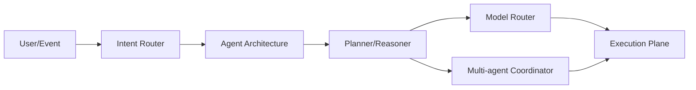

# 控制平面

> [返回总目录](../README.md)

控制平面决定 Agent 如何理解目标、选择策略、分配任务、选择模型并终止。其输出是“下一步做什么”，但不直接绕过执行平面的权限和校验。

## 模块

1. [Agent 架构](01-Agent架构.md)：目标契约、控制权边界、Harness、运行时对象、控制循环、长任务、验证与故障恢复。
2. [任务规划与推理](02-任务规划与推理.md)：Plan IR、目标分解、计划编译、滚动重规划、搜索、Verifier 与自我纠错。
3. [意图识别与路由](03-意图识别与请求路由.md)：标签治理、开放集、选择性分类、多意图、Slot、澄清与校准。
4. [模型路由与调度](04-模型路由与推理调度.md)：模型画像、质量成本路由、Cascade/Fallback、Token 调度与推理容量。
5. [多 Agent 协作](05-多Agent协作.md)：拆分准入、协作拓扑、Agent Card/A2A、委派与消息契约、任务分配、共享状态、Join/共识、终止、容错、安全和协作评测。

## 阅读顺序

`Agent 架构 -> 意图路由 -> 规划 -> 模型路由 -> 多 Agent`。

多 Agent 应最后学习，因为它会放大单 Agent 尚未解决的状态、权限、评测和观测问题。
