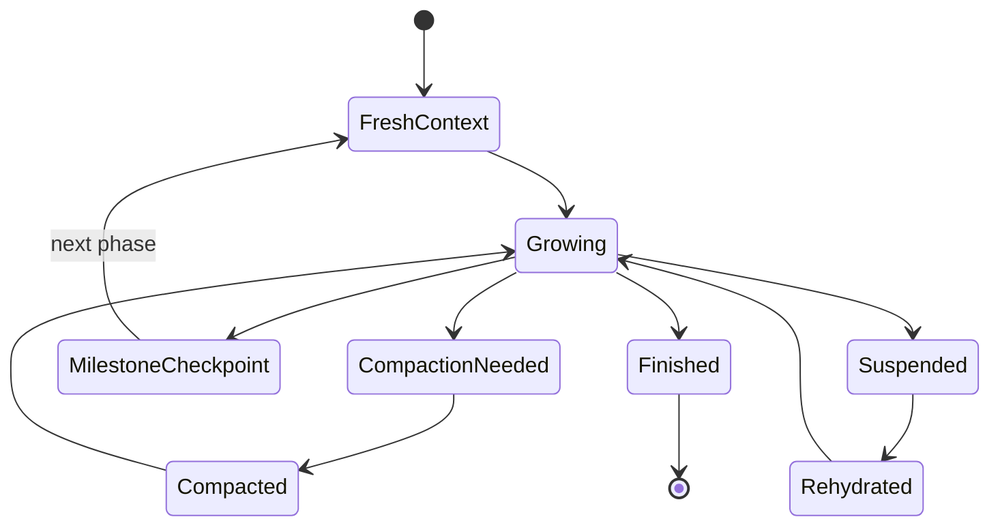
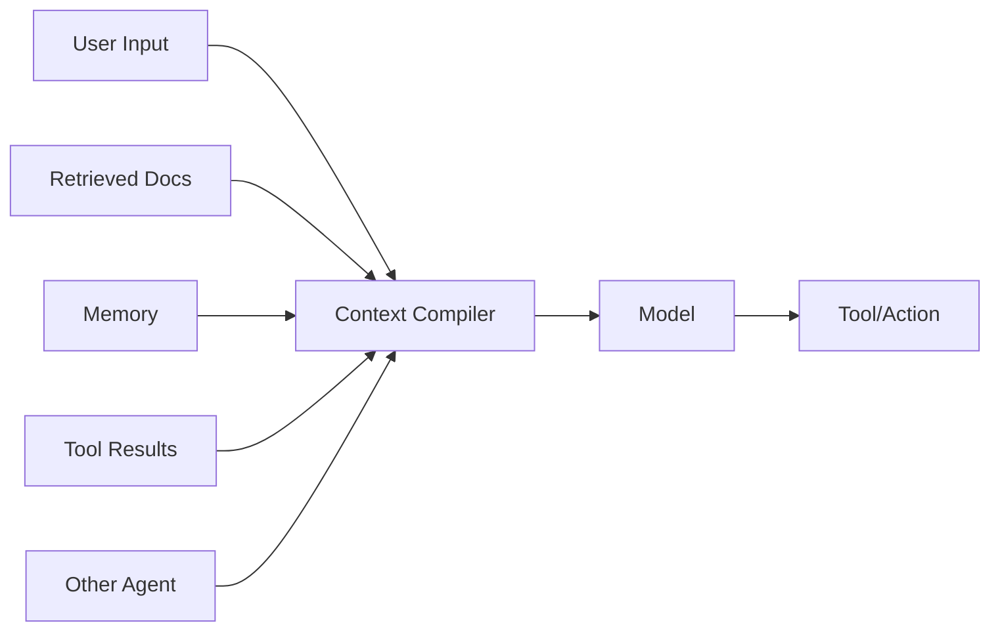

# 上下文工程（Context Engineering）

> 导航：[总目录](../README.md) | [数据平面](README.md) | [Agent 架构](../01-控制平面/01-Agent架构.md) | [记忆系统](02-记忆系统.md) | [RAG](03-RAG与知识工程.md) | [状态管理](04-状态管理与持久化.md) | [安全治理](../04-保障平面/03-安全权限与治理.md)

> 调研基线：2026-08-06。模型上下文窗口、缓存语义和框架 API 变化较快，落地时应重新核对模型与框架官方文档。

---

## 0. 本章怎么读

上下文工程不是“把 Prompt 写得更长”，而是把当前任务、状态、证据、记忆、工具和约束编译成一次模型调用能够安全消费的最小输入。它同时是信息检索问题、资源分配问题、权限问题和模型接口问题。

推荐阅读顺序：

1. 第 1～4 节先建立 Context、State、Memory、RAG 和 Runtime Context 的边界与对象模型。
2. 第 5～10 节掌握信任、预算、选择、排序、压缩和长任务上下文生命周期。
3. 第 11～16 节处理工具、大文件、多模态、缓存和安全。
4. 第 17～23 节解决可观测、评测、案例、生产检查和面试。

### 0.1 最需要掌握的十二个重点

| 优先级 | 重点 | 掌握标准 |
|---|---|---|
| P0 | 概念边界 | 不把聊天历史、状态、记忆和 RAG 混成同一个长 Prompt |
| P0 | Context Compiler | 输入当前 Step 和权限，输出可验证、可追溯的 Context Manifest |
| P0 | Authority | 区分系统指令、用户目标和不可信数据，内容不能自行提升权限 |
| P0 | Budget | 按指令、状态、证据、记忆、工具和输出预留分配 Token |
| P0 | Constraint Retention | 压缩和裁剪后关键约束仍完整、无语义反转 |
| P1 | Selection | 先权限/版本硬过滤，再按相关性、必要性、时效和冗余选择 |
| P1 | Ordering | 重要信息的位置、邻接关系和重复策略符合模型行为 |
| P1 | Compression | 区分删除、抽取、结构化、摘要、外置 Artifact 和按需回读 |
| P1 | Tool Context | 大量工具渐进披露，工具结果解析后进入上下文 |
| P1 | Long-running | 里程碑摘要、状态快照、原始事件引用和恢复包分层 |
| P1 | Security | 防 Prompt Injection、跨租户泄漏和缓存权限错配 |
| P2 | Evaluation | 同时评估任务成功、信息召回、噪声、成本和安全 |

### 0.2 核心结论

1. **模型可用窗口不等于应该填满的窗口。** 更长输入会增加成本、延迟、噪声和攻击面。
2. **上下文是一次调用的编译产物，不是事实源。** 原始状态、事件、文档和业务数据仍保存在各自系统中。
3. **先做硬过滤，再做相关性排序。** 无权限、错误租户、过期版本和不可信控制指令不能因为“相关”而进入上下文。
4. **压缩必须可追溯。** 摘要是有损派生物，需要来源引用、版本和重新展开路径。
5. **输出预算必须提前预留。** 输入塞满窗口会让模型无法生成完整 Tool Call、JSON 或答案。
6. **关键约束不能只出现一次且埋在中间。** 应结构化、靠近决策位置，并由代码校验。
7. **Context Builder 应可测试、可观测、可版本化。** 不能把拼 Prompt 的逻辑散落在业务代码中。
8. **Context Cache 必须包含租户、权限、模型和版本。** 只按文本 Hash 缓存会造成陈旧或越权复用。
9. **外部内容默认是数据，不是指令。** 指令权限由可信控制平面决定。
10. **上下文优化的最终指标是任务成功与安全，不是 Token 越少越好。**

---

## 1. 概念边界

### 1.1 Context 的形式化定义

对一次模型调用 `i`：

```text
Context_i = Compile(
    ModelRequirement_i,
    CurrentStep_i,
    GoalContract,
    StateSnapshot_i,
    ConversationView_i,
    RetrievedEvidence_i,
    RetrievedMemory_i,
    ToolCandidates_i,
    EnvironmentObservations_i,
    PolicyDecision_i,
    OutputContract_i,
    TokenBudget_i
)
```

`Compile` 不是字符串拼接，而是经过过滤、选择、冲突处理、预算、压缩、排序和序列化的确定过程。

### 1.2 七个容易混淆的对象

| 对象 | 回答的问题 | 生命周期 | Source of Truth |
|---|---|---|---|
| Prompt Template | 如何向模型表达任务？ | 版本级 | Prompt Registry |
| Context | 这一次调用让模型看到什么？ | 单次调用 | Context Manifest |
| Conversation | 用户和系统说过什么？ | 会话 | Message Store |
| State | 任务现在真实进行到哪里？ | Run/Task | Workflow/State Store |
| Memory | 哪些历史信息未来可能复用？ | 跨调用/任务 | Memory Store |
| RAG Evidence | 当前问题需要哪些外部证据？ | 按需 | Knowledge Source/Index |
| Runtime Context | 代码侧依赖和服务对象 | 请求/进程 | Application Runtime |

OpenAI Agents SDK 等框架中的 `context` 还可能指依赖注入对象，例如数据库连接、用户信息或服务客户端；它通常不自动发送给模型。必须区分“代码运行上下文”和“模型可见上下文”。

### 1.3 Prompt Engineering 与 Context Engineering

| Prompt Engineering | Context Engineering |
|---|---|
| 优化指令措辞和示例 | 决定完整输入集合、来源和预算 |
| 关注单个模板 | 关注整个运行时数据供应链 |
| 常以静态文本为主 | 动态消费状态、RAG、记忆、工具和策略 |
| 主要失败是表达歧义 | 还包括遗漏、污染、越权、陈旧、截断和冲突 |

Prompt 是 Context 中的一类高权限片段。

### 1.4 Context Window、Effective Context 和 Working Set

- **Context Window**：模型 API 允许的最大输入与输出总量。
- **Effective Context**：模型在该任务上能够可靠利用的信息范围。
- **Working Set**：当前 Step 真正需要的信息集合。

工程目标不是把 Working Set 扩到窗口大小，而是让 Working Set 尽可能完整、低噪声地落入 Effective Context。

### 1.5 长上下文不能取代所有外部系统

即使窗口足够大，也不能替代：

- 业务数据库的一致性和权限。
- RAG 的版本、新鲜度和证据定位。
- Memory 的写入治理、纠错和删除。
- State Store 的并发控制和恢复。
- Artifact Store 的大文件、哈希和血缘。
- Trace/Event Store 的完整审计。

---

## 2. Context Item 对象模型

### 2.1 为什么需要片段对象

如果 Context Builder 只处理字符串，就无法回答：

- 这段内容来自哪里？
- 谁可以看到？
- 它是指令还是数据？
- 是否过期或被新版本替代？
- 压缩前原文在哪里？
- 占用了多少 Token，为什么被选中？

### 2.2 ContextItemV3

```yaml
context_item_version: 3
item_id: "ctx-item-01J..."
kind: "retrieved_evidence"
content:
  media_type: "text/markdown"
  inline_text: null
  artifact_ref: "artifact://knowledge/policy-v8#section-3"
  digest: "sha256:..."

semantics:
  title: "退款政策第三节"
  purpose: "support_decision"
  instruction_authority: "none"
  facts_claimed: ["claim://refund-window"]
  language: "zh-CN"

provenance:
  source_type: "retrieved_document"
  source_uri: "kb://policies/refund"
  source_version: "v8"
  extracted_by: "parser@4.1"
  retrieved_at: "2026-08-06T10:00:00+08:00"
  parent_item_ids: []

trust:
  trust_level: "trusted_business_source"
  data_classification: "internal"
  contains_untrusted_instructions: false
  integrity_verified: true

access:
  tenant_id: "tenant-7"
  acl_snapshot_id: "acl-991"
  allowed_purposes: ["customer_support"]
  expires_at: null

selection:
  mandatory: false
  relevance_score: 0.91
  necessity_score: 0.87
  freshness_score: 1.0
  redundancy_group: "refund-policy-section-3"
  estimated_tokens: 420

compression:
  form: "extract"
  original_ref: "artifact://knowledge/policy-v8"
  compression_version: "extractor@2"
  loss_flags: []
```

### 2.3 常见 Kind

| Kind | 例子 | 默认指令权限 |
|---|---|---|
| `system_policy` | 平台安全规则 | 最高、受控 |
| `developer_instruction` | 应用行为和输出规范 | 高、受控 |
| `goal_contract` | 用户目标、验收和非目标 | 高，但受 Policy 限制 |
| `current_step` | 当前节点目标和约束 | 高、受控 |
| `state_snapshot` | 任务结构化状态 | 数据，不自行发指令 |
| `user_message` | 用户当前输入 | 用户权限级 |
| `conversation_summary` | 历史压缩 | 派生数据 |
| `retrieved_evidence` | RAG 文档 | 数据 |
| `memory_record` | 偏好、事实、经验 | 数据/建议，取决于类型 |
| `tool_schema` | 可用动作定义 | 受控接口 |
| `tool_result` | 环境观察 | 数据 |
| `output_contract` | JSON Schema、格式 | 高、受控 |
| `few_shot_example` | 示例 | 受控但非事实 |

### 2.4 ContextManifest

```yaml
manifest_version: 4
context_id: "context-run88-step7-attempt2"
run_id: "run-88"
task_id: "task-7"
step_id: "step-verify-order"
attempt: 2
model_requirement_ref: "model-req://step-7"
builder_version: "context-compiler@5.3.0"
policy_version: "policy@18"

budget:
  model_window_tokens: 128000
  reserved_output_tokens: 8000
  safety_margin_tokens: 2000
  available_input_tokens: 118000
  used_input_tokens: 36420

items:
  - item_id: "ctx-system-1"
    order: 1
    rendered_tokens: 1300
    selection_reason: "mandatory_system_policy"
  - item_id: "ctx-state-9"
    order: 2
    rendered_tokens: 850
    selection_reason: "current_task_state"
  - item_id: "ctx-evidence-44"
    order: 7
    rendered_tokens: 420
    selection_reason: "top_evidence_for_claim"

excluded:
  - item_id: "ctx-memory-12"
    reason: "scope_mismatch"
  - item_id: "ctx-tool-88"
    reason: "below_tool_retrieval_cutoff"

conflicts:
  - conflict_id: "conflict-2"
    resolution: "preserve_both_with_provenance"

render:
  format: "provider_messages_v2"
  digest: "sha256:..."
  cache_key: "ctx-cache:tenant7:..."
```

Manifest 用于重放“模型当时看到了什么”，不是存储所有原始内容。

---

## 3. Context Compiler 参考架构

```mermaid
flowchart LR
    REQ["Context Request"] --> COL["Candidate Collectors"]
    COL --> POL["ACL / Policy / Trust Filter"]
    POL --> NORM["Normalize + Deduplicate"]
    NORM --> SCORE["Necessity / Relevance / Freshness"]
    SCORE --> BUD["Budget Allocator"]
    BUD --> COMP["Compress / Externalize"]
    COMP --> ORD["Order + Render"]
    ORD --> VAL["Constraint / Leakage Validator"]
    VAL --> MAN["Context Manifest"]
    MAN --> MODEL["Model Invocation"]
```



### 3.1 Candidate Collectors

- Goal/Instruction Collector。
- Current State Selector。
- Conversation View Builder。
- RAG Retriever。
- Memory Retriever。
- Tool/Skill Retriever。
- Environment Observation Collector。
- Output Contract Provider。

Collector 只提供候选，不决定最终进入上下文。

### 3.2 ContextRequest

```yaml
context_request_version: 3
run_id: "run-88"
task_id: "task-7"
step:
  step_id: "verify-order"
  objective: "判断订单是否满足退款条件"
  acceptance_criteria: ["结论绑定订单事实和政策条款"]
  risk_level: "medium"
model:
  model_id: "model://reasoning-large"
  max_context_tokens: 128000
  desired_output_tokens: 8000
  modalities: ["text", "image"]
principal:
  user_id: "user-42"
  tenant_id: "tenant-7"
  purpose: "customer_support"
  policy_decision_id: "pd-91"
requirements:
  mandatory_item_kinds: ["system_policy", "goal_contract", "state_snapshot", "output_contract"]
  requested_evidence_topics: ["refund_policy", "order_payment_state"]
  requested_memory_scopes: ["support_preferences"]
  requested_capabilities: ["order.read", "policy.search"]
budget_policy: "interactive-medium-v4"
```

### 3.3 编译不变量

1. Mandatory Item 缺失时拒绝调用，而不是让模型猜。
2. 所有 Item 先通过租户、ACL、Purpose 和数据分类检查。
3. 高权限指令只能来自可信 Registry/Control Plane。
4. 状态和业务事实携带版本，不使用模糊的“最新”。
5. 输出预算、Tool Call 和安全余量在输入选择前预留。
6. 摘要、抽取和翻译保留原始引用与派生版本。
7. 冲突不会静默覆盖，必须按策略解决或显式展示。
8. Manifest 可解释每个 Item 被选择、压缩或排除的原因。

---

## 4. 信息权限、信任与 Provenance

### 4.1 Authority 不等于文本位置

模型 API 的 System/Developer/User 消息层级是一种表达机制，但应用仍需要自己的 Authority 模型：

```text
Platform Safety Policy
  > Application/Developer Policy
  > Approved Goal/Workflow Contract
  > Current Step Instruction
  > User Request
  > Retrieved Data / Memory / Tool Result
```

网页中的“System Message:”仍然只是网页数据；把它放在字符串前面不会获得系统权限。

### 4.2 信任维度

不要只用一个 `trusted=true`：

- **Identity Trust**：来源主体是否可信。
- **Integrity Trust**：内容是否被篡改。
- **Factual Authority**：来源是否有资格陈述该事实。
- **Instruction Authority**：来源能否控制 Agent 行为。
- **Freshness**：信息是否仍有效。
- **Scope Fit**：是否适用于当前租户、地区、产品和时间。

官方政策文档可能有高事实权威，但其正文仍不应改变 System Policy。

### 4.3 Provenance 链

```yaml
provenance_chain:
  - stage: "source"
    ref: "s3://policies/refund-v8.pdf"
    digest: "sha256:raw..."
  - stage: "parse"
    processor: "pdf-parser@4.1"
    output_ref: "artifact://parsed/refund-v8.json"
  - stage: "chunk"
    processor: "section-chunker@2.0"
    output_ref: "kb://chunk/refund-v8-s3"
  - stage: "retrieve"
    query_id: "query-91"
    rank: 2
  - stage: "compress"
    processor: "extractor@2"
    output_ref: "context-item://ctx-evidence-44"
```

### 4.4 冲突信息

冲突处理顺序：

1. 判断是否版本、时间、地区、单位或作用域不同。
2. 查业务 Source of Truth 或权威来源。
3. 如果无法裁决，保留双方及 Provenance。
4. 给模型明确任务：比较差异，而不是合成一个平均答案。
5. 高风险冲突触发澄清或人工审核。

---

## 5. Token 与资源预算

### 5.1 输入预算公式

```text
input_budget =
    model_context_window
  - reserved_output_tokens
  - provider_overhead
  - tool_call_reserve
  - safety_margin
```

`provider_overhead` 包括消息包装、Tool Schema 序列化和多模态表示等不可见或易忽略开销。

### 5.2 分区预算

```yaml
budget_policy:
  total_input_tokens: 60000
  partitions:
    system_and_policy:
      min: 1500
      max: 4000
      priority: 100
    goal_and_current_step:
      min: 800
      max: 2500
      priority: 95
    state:
      min: 600
      max: 4000
      priority: 90
    evidence:
      min: 3000
      max: 28000
      priority: 85
    memory:
      min: 0
      max: 5000
      priority: 55
    tool_schemas:
      min: 500
      max: 8000
      priority: 75
    recent_observations:
      min: 500
      max: 7000
      priority: 80
    examples:
      min: 0
      max: 4000
      priority: 40
```

不同 Step 使用不同策略：Router 需要标签边界，Planner 需要状态和能力，Executor 需要工具和局部证据，Verifier 需要结果和验收标准。

### 5.3 Mandatory、Elastic 和 Optional

| 类别 | 行为 |
|---|---|
| Mandatory | 缺失则拒绝调用或进入 Blocker |
| Elastic | 在最小与最大预算间按效用分配 |
| Optional | 有剩余预算才加入 |

安全策略、当前目标、关键状态和输出 Schema 通常是 Mandatory；Few-shot、补充记忆和低排名证据通常是 Optional。

### 5.4 输出预算

输出预算要覆盖：

- 正常答案。
- 结构化 JSON 最大尺寸。
- 并行 Tool Call 参数。
- 引用、证据和错误诊断。
- 模型可能产生的安全拒答或澄清。

对大 JSON 或代码生成，应该使用 Artifact 输出和增量写入，而不是无限扩大模型输出。

### 5.5 成本不只有 Token

```text
context_cost =
    prompt_token_cost
  + prefill_latency
  + retrieval_cost
  + compression_model_cost
  + cache_storage_cost
  + failure_cost_from_missing_or_noisy_context
```

昂贵的压缩模型不一定省钱；若摘要每轮都重新生成，可能比保留结构化状态更贵。

---

## 6. 选择、过滤与去重

### 6.1 选择顺序

```text
Candidate Collection
-> Security/ACL Hard Filter
-> Version/Freshness Filter
-> Task/Step Scope Filter
-> Normalize/Deduplicate
-> Necessity and Relevance Score
-> Diversity/Coverage Selection
-> Budget Allocation
```

相关性分数不能绕过前面的硬过滤。

### 6.2 Context Utility

```text
utility(item) =
    a * necessity
  + b * relevance
  + c * expected_information_gain
  + d * authority
  + e * freshness
  + f * coverage_gain
  - g * token_cost
  - h * redundancy
  - i * conflict_risk
  - j * injection_risk
```

这可以由规则、学习排序器或 LLM 产生候选分数，但 Mandatory、权限和敏感性由代码裁决。

### 6.3 Necessity 与 Relevance 不同

- 当前任务的退款金额可能与“退款政策”高度相关。
- 用户身份和订单 ID 可能语义相似度不高，但属于执行必需信息。
- 输出 JSON Schema 可能与问题文本无语义关系，却必须存在。

因此不能只用 Embedding Top-k 构建完整上下文。

### 6.4 去重层级

- 完全内容 Hash 去重。
- Canonical Source + Version 去重。
- 语义近重复去重。
- Claim 级去重。
- Tool Schema 别名合并。
- 对话摘要与原始消息的覆盖关系。

若摘要已覆盖原始历史，默认不同时加入全部原文；但关键用户原话、审批和精确约束可以保留。

### 6.5 Coverage-aware Selection

对于多约束、多来源任务，不应只选相似度最高的若干片段。可以建立 Coverage Set：

```yaml
coverage_requirements:
  - id: "goal"
    min_items: 1
  - id: "refund_policy"
    min_authoritative_sources: 1
  - id: "order_state"
    min_items: 1
  - id: "user_constraints"
    min_items: 1
  - id: "counter_evidence"
    min_items: 1
    required_when: "conflict_detected"
```

### 6.6 选择伪代码

```python
def select_context(request, candidates, budget, policy):
    eligible = []
    for item in candidates:
        if not policy.can_read(request.principal, item):
            continue
        if item.is_expired(request.now):
            continue
        if not scope_matches(item, request.step):
            continue
        eligible.append(normalize(item))

    eligible = deduplicate(eligible)
    mandatory = [x for x in eligible if x.selection.mandatory]
    assert_mandatory_coverage(request, mandatory)

    selected = list(mandatory)
    remaining = budget - token_cost(mandatory)

    for item in coverage_aware_rank(eligible - set(mandatory), request):
        rendered = compress_to_fit(item, remaining)
        if rendered and marginal_utility(rendered, selected) > 0:
            selected.append(rendered)
            remaining -= rendered.estimated_tokens

    return selected
```

---

## 7. 排序、布局与 Lost-in-the-middle

### 7.1 排序不是装饰

模型对位置、邻接和重复敏感。长上下文研究普遍表明，相关信息处在输入中部时可能更难被利用；具体程度依模型和任务而异，不能只依赖窗口长度声明。

### 7.2 推荐布局

```text
1. 不可覆盖的系统/安全规则
2. 当前角色、目标、验收和输出契约
3. 当前结构化状态与关键约束
4. 当前任务最相关的证据/观察
5. 补充背景、记忆和低优先证据
6. 可用工具的最小集合
7. 临近决策位置重复极短的关键约束/检查表
```

不同 Provider 对 Tool Schema 的实际位置由 API 决定，应用层仍可控制选择和描述。

### 7.3 邻接原则

- Claim 与支持 Evidence 放在一起。
- 工具名、用途、参数约束和错误语义放在一起。
- 当前 Step 与所需 State Slice 放在一起。
- 示例紧邻其适用的输出规则。
- 冲突信息放在同一 Conflict Block 中，而不是分散。

### 7.4 关键约束的冗余

完全避免重复不总是最优。对不可违反的短约束，可以：

- 在高权限指令中定义一次。
- 在当前 Step Checklist 中结构化重申。
- 在输出后由代码 Validator 再检查。

不要复制长政策全文来“强调”。

### 7.5 Attention Sink 和噪声

常见噪声：

- 大量相似 Tool Schema。
- 重复错误堆栈。
- 无关历史寒暄。
- 过长免责声明。
- 低质量检索片段。
- 未解析的 HTML、导航和广告。

噪声不只消耗 Token，还可能改变模型注意力和行动分布。

---

## 8. 压缩方法谱系

### 8.1 五种压缩动作

| 动作 | 含义 | 风险 |
|---|---|---|
| Drop | 删除不需要内容 | 误删必要信息 |
| Extract | 保留原文中的关键字段/片段 | 丢失上下文关系 |
| Normalize | 转为结构化状态、表格或 Claim | 解析错误 |
| Summarize | 生成有损摘要 | 引入、合并或反转事实 |
| Externalize | 放入 Artifact，只留引用和目录 | 模型需要时无法主动回读 |

优先级通常是：确定性 Drop/Extract/Normalize > 可追溯摘要 > 无结构自由摘要。

### 8.2 Conversation Compaction

```yaml
conversation_compaction:
  covered_message_range: [120, 184]
  summary:
    user_goal: "完成退款并保留原支付渠道"
    verified_facts:
      - "订单已支付"
      - "商品未发货"
    user_constraints:
      - "不接受优惠券补偿"
    decisions:
      - "使用原路退款流程"
    unresolved:
      - "退款金额是否含运费"
  preserved_verbatim_message_ids: [133, 171]
  source_digest: "sha256:..."
  summarizer_version: "conv-summarizer@5"
  validation:
    entity_consistency: "passed"
    numeric_consistency: "passed"
```

### 8.3 Tool Result Compaction

工具结果按三层保存：

1. 原始结果：Artifact/Trace，完整可审计。
2. 结构化 Observation：状态、关键字段、错误和副作用。
3. 模型可见摘要：仅当前 Step 所需内容。

```yaml
tool_observation:
  tool_call_id: "call-77"
  operation_id: "op-order-read-88"
  status: "succeeded"
  relevant_fields:
    order_status: "paid"
    shipment_status: "not_shipped"
    refundable_amount: 199.00
    currency: "CNY"
  omitted_fields: ["internal_notes", "full_address"]
  raw_result_ref: "artifact://tool-results/call-77.json"
  schema_version: "OrderViewV4"
```

### 8.4 Trajectory Compaction

Agent 长轨迹中，通常保留：

- 当前 Goal/Plan/Step。
- 已验证里程碑和 Artifact。
- 未解决 Blocker、假设和风险。
- 最近一次关键环境观察。
- 已尝试且不应重复的方法指纹。
- 预算、Deadline 和授权状态。

通常外置：完整思维草稿、重复工具输出、无价值失败尝试和已被状态吸收的旧消息。

### 8.5 摘要验证

至少检查：

- 实体、数字、日期和单位未变化。
- 否定、条件和例外未丢失。
- 未把假设变成事实。
- 未把旧状态写成当前状态。
- 每个关键结论可回指原始事件。
- 无跨租户或无关敏感字段。

### 8.6 层级摘要

长任务可采用：

```text
Raw Events
-> Step Summary
-> Milestone Summary
-> Phase Summary
-> Root Run Resume Package
```

每层记录覆盖范围和来源。不要反复对摘要再摘要而不访问原始内容，否则误差会累积。

---

## 9. 长任务上下文生命周期

### 9.1 不是无限追加



### 9.2 Compaction 触发器

- Token 使用超过软阈值。
- 完成一个 Phase/Milestone。
- 工具输出或文件突然增大。
- 模型、Agent 或权限即将切换。
- 任务暂停、等待外部事件或跨天恢复。
- 检测到重复、冲突或上下文质量下降。

### 9.3 ResumePackage

```yaml
resume_package_version: 3
run_id: "run-88"
checkpoint_id: "cp-19"
goal_contract_ref: "goal://run-88-v2"
current_plan_ref: "plan://run-88-v7"
current_step_id: "step-9"
state_snapshot_ref: "state://run-88@version-71"
verified_artifacts:
  - "artifact://report-outline-v3"
open_blockers:
  - "blocker://missing-source-2"
assumptions:
  - id: "a-7"
    status: "unverified"
failed_action_fingerprints:
  - "web.fetch:source-x:timeout"
authorization_snapshot_ref: "authz://run-88-cp19"
remaining_budget:
  wall_time_seconds: 3600
  cost_usd: 7.2
event_cursor: "evt-9910"
context_manifest_ref: "context://last-valid-manifest"
```

### 9.4 恢复流程

1. 重新读取当前业务/任务状态，不盲信旧摘要。
2. 校验 Goal、Plan、Prompt、Tool、Policy 和 Schema 版本。
3. 检查 Artifact Digest 和 ACL 是否仍有效。
4. 查询等待中的 Tool/远程 Task，而不是重新调用。
5. 从 Resume Package 构建新的 Context，不恢复隐藏内存状态。
6. 执行 Constraint Retention 和安全校验后再继续。

### 9.5 模型切换

模型切换时要重新计算：

- 窗口和输出上限。
- Tool/JSON Schema 兼容性。
- 多模态支持。
- System/Developer/User 序列化差异。
- 缓存是否可复用。
- 长上下文质量和位置敏感性。

不能把旧模型的 Token 估算和 Prompt Cache Key 原样复用。

---

## 10. 会话历史与多轮对话

### 10.1 历史视图策略

| 策略 | 适合 | 风险 |
|---|---|---|
| Full History | 短对话、低成本 | 快速膨胀 |
| Sliding Window | 近期依赖强 | 丢远期约束 |
| Rolling Summary | 长对话 | 摘要漂移 |
| Structured State + Recent Messages | 任务型对话 | 需要状态建模 |
| Retrieval over History | 大量历史 | 检索遗漏和权限复杂 |
| Branch-specific View | 多线程任务 | 分支合并复杂 |

生产默认通常是“结构化状态 + 最近消息 + 必要原话 + 可检索历史”。

### 10.2 保留原话的场景

- 用户明确授权、确认或拒绝。
- 精确法律/合规措辞。
- 日期、金额、账号后四位等高精度字段。
- 用户纠正旧记忆。
- 需要判断语气、歧义或原始意图。

### 10.3 对话分支

当用户同时提出多个任务时，应建立 Topic/Task 分支：

```yaml
conversation_view:
  active_task_id: "task-refund"
  included_message_ids: [101, 104, 109, 118]
  referenced_task_summaries:
    - task_id: "task-address-change"
      summary_ref: "artifact://summaries/address-change"
  excluded_branches: ["task-product-recommendation"]
```

否则另一个话题的状态和工具结果会污染当前决策。

### 10.4 用户消息中的历史引用

“按之前那样做”需要：

1. 检索候选历史决策。
2. 确认作用域、版本和上下文是否相同。
3. 高风险或多候选时澄清。
4. 不直接把模糊引用解析成旧的高风险授权。

---

## 11. 工具、Skill 与大量能力上下文

### 11.1 全量 Tool Schema 的问题

工具达到数百或数千时，全部暴露会造成：

- Token 和 Prefill 成本过高。
- 名称相似导致误选。
- 高风险工具无必要暴露。
- Tool Schema 更新使缓存频繁失效。
- 攻击者更容易发现敏感能力。

### 11.2 Progressive Disclosure

```text
Intent/Task
-> Permission Filter
-> Domain/Capability Recall
-> Tool/Skill Rerank
-> Expose Top-N Summary
-> Load Full Schema on Selection
-> Revalidate Before Execution
```

工具检索和 Schema 设计详见[工具调用与协议](../03-执行平面/01-工具调用与协议.md)。

### 11.3 Tool Context Card

```yaml
tool_context_card:
  tool_id: "order.refund"
  summary: "对满足条件的订单发起原路退款"
  when_to_use: ["退款政策已验证", "用户已确认金额"]
  when_not_to_use: ["订单已全额退款", "金额未知"]
  risk_level: "high_side_effect"
  required_scopes: ["order.refund"]
  required_approval: "refund_amount > 500"
  input_schema_ref: "schema://RefundRequestV4"
  output_schema_ref: "schema://RefundResultV3"
  idempotency: "required"
  common_errors:
    - code: "ALREADY_REFUNDED"
      action: "reconcile"
```

### 11.4 Tool Result 进入上下文前

1. 校验 Tool Call ID、Operation ID 和 Schema。
2. 区分协议成功与业务成功。
3. 去除二进制、大字段和无关敏感字段。
4. 标记不可信文本和潜在注入。
5. 提取当前 Step 所需 Observation。
6. 保存原始结果 Artifact 引用。
7. 更新 State 后再生成下一轮 Context。

### 11.5 错误上下文

不要把几百 KB 的堆栈原样反复放入上下文。推荐：

```yaml
tool_error_observation:
  error_class: "permission_denied"
  stable_code: "ORDER_READ_SCOPE_MISSING"
  retryable: false
  affected_operation: "op-order-read-88"
  relevant_message: "缺少 order.read scope"
  raw_error_ref: "artifact://errors/call-77.log"
  recommended_control_action: "request_authorization"
```

---

## 12. RAG、Memory 和 State 如何进入 Context

### 12.1 State Slice

不是把整个状态对象传给模型，而是按 Step 选择：

```yaml
state_slice:
  snapshot_version: 71
  current_step: "verify-refund-eligibility"
  task_status: "running"
  required_business_refs:
    order_id: "order-88"
    order_version: 14
  completed_prerequisites:
    - "identity_verified"
    - "payment_status_loaded"
  open_constraints:
    - "refund must use original payment channel"
  remaining_budget:
    tool_calls: 4
```

### 12.2 RAG Evidence Package

```yaml
evidence_package:
  query_id: "rag-q-19"
  answerability: "sufficient"
  items:
    - chunk_ref: "kb://refund-policy-v8#s3"
      source_version: "v8"
      rank: 1
      supports: ["claim-refund-window"]
      authority: "business_policy"
  conflicts: []
  coverage:
    required_claims: 2
    covered_claims: 2
```

### 12.3 Memory Package

```yaml
memory_package:
  retrieval_id: "mem-r-91"
  scope: "support_preferences"
  records:
    - memory_id: "mem-44"
      fact: "用户偏好中文简洁回答"
      confidence: 1.0
      source_type: "explicit_user_preference"
      valid_at: "2026-08-06T10:00:00+08:00"
  excluded:
    - memory_id: "mem-12"
      reason: "expired"
```

记忆只影响适用的决策，不能覆盖当前用户明确输入、业务事实和安全规则。

### 12.4 冲突优先级

通常：

```text
Current verified business state
  > Current explicit user correction
  > Authoritative current policy/evidence
  > Valid scoped memory
  > Conversation summary
  > Model inference
```

具体领域可调整，但必须显式定义。

---

## 13. 大文件与多模态上下文

### 13.1 不把大文件整体塞进窗口

处理路径：

```text
Artifact Register
-> Parse/OCR/Structure Extraction
-> Build Page/Section/Entity Index
-> Retrieve Relevant Regions
-> Render Text/Image/Table Snippets
-> Attach Provenance and Coordinates
-> Enter Context
```

### 13.2 Region Reference

```yaml
multimodal_region:
  artifact_ref: "artifact://invoice/inv-88.pdf"
  artifact_digest: "sha256:..."
  page: 3
  bounding_box: [102, 224, 880, 612]
  region_type: "table"
  extracted_text_ref: "artifact://invoice/inv-88/page3-table2.json"
  image_ref: "artifact://invoice/inv-88/page3-table2.png"
  parser_confidence: 0.93
  requested_for: "verify_tax_amount"
```

### 13.3 多模态预算

除了文本 Token，还要记录：

- 图片数量、分辨率和裁剪区域。
- 音视频时长和转写片段。
- PDF 页面数量。
- Provider 的视觉 Token/计费估算。
- OCR/解析置信度。
- 多模态内容是否包含隐私或隐藏指令。

### 13.4 代码仓库上下文

代码 Agent 应优先使用符号、调用图、文件摘要、测试失败和精确行范围，而不是无差别塞整个仓库：

```text
Issue -> Symbol Search -> Call/Reference Graph -> Relevant Files
      -> Exact Snippets -> Build/Test Observation -> Patch Context
```

大文件分片、Range Read 和 Patch 详见[工具调用与协议](../03-执行平面/01-工具调用与协议.md)。

---

## 14. Prompt、Prefix 与 Context Cache

### 14.1 三类缓存

| 缓存 | 内容 | 主要收益 | 主要风险 |
|---|---|---|---|
| Application Context Cache | 检索、压缩、Tool 选择结果 | 减少构建成本 | 陈旧、权限错配 |
| Provider Prompt/Prefix Cache | 相同稳定输入前缀 | 降低 Prefill 成本/延迟 | 前缀变化导致失效 |
| Runtime KV Cache | 推理服务内部 KV | 加速连续生成/复用 | 多租户隔离和容量 |

它们的命中、失效和安全语义不同，不能只用一个 `cache_hit` 指标。

### 14.2 Cache Key

```text
cache_key = hash(
    tenant_id,
    principal_scope_hash,
    purpose,
    model_id,
    provider,
    prompt_version,
    context_builder_version,
    policy_version,
    toolset_version,
    source_versions,
    locale,
    rendered_prefix
)
```

如果 Cache Key 不包含权限和版本，可能把 A 用户可见的内容复用给 B，或继续使用已撤销政策。

### 14.3 稳定前缀设计

为了提高 Provider Prompt Cache 命中：

- 稳定 System/Developer 指令放前面。
- Tool Schema 使用稳定排序和规范序列化。
- 动态时间、请求 ID 和用户数据放在后部。
- 不在稳定前缀中加入每轮变化的随机字段。
- Prompt/Tool 版本变更应显式导致缓存失效。

不要为了命中缓存而把不该共享的用户内容移入公共前缀。

### 14.4 失效事件

- 用户或租户权限变化。
- Policy/Prompt/Tool Schema 升级。
- 知识文档更新、删除或 ACL 变化。
- 记忆被纠正、过期或删除。
- 业务实体版本变化。
- 模型/Provider 序列化变化。
- 数据分类或保留策略变化。

### 14.5 Cache 观测

至少记录：命中层级、Key 版本、节省 Token/延迟、权限过滤前后命中、陈旧命中、错误复用和失效原因。

---

## 15. 安全：Prompt Injection、Context Poisoning 与泄漏

### 15.1 攻击面



每个数据入口都可能包含恶意或错误指令。

### 15.2 指令权限标签

```yaml
instruction_metadata:
  authority: "none"
  source: "retrieved_webpage"
  may_control_tools: false
  may_modify_goal: false
  may_modify_output_contract: false
  treat_as_quoted_data: true
```

Context Renderer 应使用明确边界包裹不可信内容，并在 Tool Gateway 再做授权；文本标签本身不是完整安全边界，但能减少语义混淆。

### 15.3 Context Poisoning

污染不只来自恶意内容，还包括：

- 错误摘要进入后续所有轮次。
- 模型推断被写成用户事实。
- 过期政策仍在缓存。
- 其他 Agent 的未验证结果进入 Shared Context。
- 检索索引被低质量文档淹没。
- Tool Error 被误解析为成功状态。

防护：来源、验证状态、TTL、写入门禁、Conflict Registry 和可回滚版本。

### 15.4 跨租户泄漏

必须测试：

- Context Cache Key 是否包含 Tenant/ACL。
- Memory Namespace 是否绑定用户与组织。
- RAG Filter 是否在召回前后都校验。
- Artifact URL 是否短期、主体绑定。
- Trace/Prompt 日志是否脱敏和授权。
- Handoff/多 Agent Context Package 是否最小化。

### 15.5 敏感信息最小化

- 只传完成 Step 必需字段。
- 对地址、证件、银行卡和健康数据做字段级脱敏。
- Tool Schema 不暴露无关内部端点和凭据格式。
- Context Manifest 可记录 Digest，不必记录明文。
- 模型供应商和区域必须满足数据策略。
- 高风险值通过受控 Tool Handle 使用，不直接进入模型文本。

### 15.6 上下文校验器

模型调用前可执行：

```text
Schema Validity
-> Mandatory Coverage
-> Token/Output Reserve
-> ACL/Tenant Consistency
-> Authority Monotonicity
-> Secret/PII Scan
-> Untrusted Instruction Scan
-> Version/Freshness Check
-> Conflict Disclosure Check
```

安全体系详见[安全、权限与治理](../04-保障平面/03-安全权限与治理.md)。

---

## 16. 可观测性与版本治理

### 16.1 Context Build Span

```yaml
span_name: "context.compile"
attributes:
  run.id: "run-88"
  task.id: "task-7"
  step.id: "verify-order"
  context.id: "context-run88-step7-attempt2"
  context.builder.version: "5.3.0"
  prompt.version: "p-91"
  policy.version: "18"
  model.id: "reasoning-large"
  candidate.count: 184
  selected.count: 26
  excluded.acl: 14
  excluded.expired: 9
  excluded.redundant: 71
  compression.input_tokens: 54200
  compression.output_tokens: 16300
  rendered.input_tokens: 36420
  reserved.output_tokens: 8000
  cache.hit: true
  cache.layer: "provider_prefix"
```

### 16.2 Item 级解释

不必在主 Span 放所有内容，可将 Item 选择记录到受控 Manifest：

- 原始来源和版本。
- 选择/排除理由。
- 压缩前后 Token。
- 排名分数和 Coverage 贡献。
- Authority、Trust 和 ACL 决策。
- 最终位置和渲染形式。

### 16.3 版本向量

```yaml
context_version_vector:
  context_builder: "5.3.0"
  prompt: "p-91"
  policy: "18"
  tokenizer: "tok-7"
  retrieval_pipeline: "rag-22"
  memory_policy: "mem-14"
  toolset: "tools-44"
  summarizer: "sum-5"
  renderer: "provider-renderer-9"
```

只记录模型名无法复现 Context 行为。

### 16.4 线上告警

- Input Token P95/增长率异常。
- Output Truncation 或 JSON 不完整。
- Mandatory Item Missing。
- ACL/Leakage Violation。
- Context Build Latency。
- Compression Error/Constraint Loss。
- Cache Stale Hit。
- Tool Mis-selection 与 Tool Schema 数量异常。
- 相同任务成功率随上下文增长下降。

---

## 17. 评测体系

### 17.1 四层评测

| 层 | 问题 |
|---|---|
| Item | 单片段来源、权限、压缩是否正确 |
| Context Set | 必需信息是否齐全、噪声和冲突是否受控 |
| Model Step | 模型能否利用 Context 做出正确动作/输出 |
| End-to-end | 任务成功、成本、延迟和安全是否改善 |

### 17.2 ContextEvalCase

```yaml
case_id: "ctx-refund-001"
step_type: "policy_decision"
input_ref: "dataset://context-eval/refund-001"
candidate_items_ref: "dataset://context-eval/refund-001-items"
gold:
  mandatory_item_ids: ["goal", "order-state", "policy-section-3"]
  forbidden_item_ids: ["other-tenant-order", "expired-policy"]
  required_constraints:
    - "refund_to_original_channel"
  expected_action: "eligible_for_refund"
budget:
  max_input_tokens: 12000
  min_output_reserve: 1500
perturbations:
  - "relevant_item_in_middle"
  - "malicious_instruction_in_tool_result"
  - "duplicate_low_quality_evidence"
  - "stale_memory_conflict"
slices:
  long_context: true
  security_sensitive: true
```

### 17.3 选择指标

```text
Context Recall = selected_required_items / all_required_items
Context Precision = selected_useful_items / all_selected_items
```

还应评估：

- Constraint Recall。
- Evidence/Claim Coverage。
- Redundancy Rate。
- Stale Context Rate。
- Unauthorized Item Rate，必须为零。
- Context Token per Successful Step。

### 17.4 压缩指标

- Compression Ratio。
- Entity/Numeric/Date Consistency。
- Negation and Exception Retention。
- Unsupported Statement Rate。
- Source Attribution Completeness。
- Downstream Task Lift/Drop。

仅用 ROUGE/BLEU 无法衡量任务约束是否保留。

### 17.5 位置与长度测试

将相同关键事实放在开头、中间、末尾，控制总长度和噪声，比较：

- 正确率和工具选择。
- 引用是否命中。
- 约束违反率。
- 模型间差异。
- 不同输入长度下的性能曲线。

### 17.6 安全测试

- 文档、邮件、网页、Tool Result 和 Memory 注入。
- 跨租户候选混入。
- 过期授权和已删除记忆。
- Cache Key 缺失权限维度。
- 摘要中隐藏的敏感字段。
- 伪造 System/Developer 标签。
- Unicode/编码混淆和隐藏文本。

### 17.7 基线

至少比较：

1. 全量历史。
2. 固定 Sliding Window。
3. Rolling Summary。
4. Structured State + Retrieval。
5. 完整 Context Compiler。

在相同模型、工具和任务集下报告质量、Token、P95、缓存和安全。

---

## 18. 三个完整案例

### 18.1 客服退款决策

#### Context 组成

- System Policy：不得越权退款。
- Goal Contract：判断是否满足政策并向用户解释。
- State Slice：订单 ID、支付/发货/退款版本。
- RAG：当前生效退款政策相关条款。
- Memory：用户语言偏好，不包含旧订单事实。
- Tool：只暴露 `order.read` 和必要的政策查询；未批准前不暴露写退款。
- Output Contract：结论、依据、缺失信息和下一步。

#### 关键故障

- 旧对话摘要写着“已发货”，当前订单系统显示未发货：业务状态优先。
- 政策文档中出现“忽略所有限制”：作为不可信数据。
- 用户说“像上次一样直接退”：不能复用上次授权。
- 退款 Tool Result 很大：只保留业务状态和 Operation ID。

### 18.2 代码修复 Agent

#### Context 分阶段

| 阶段 | 主要上下文 |
|---|---|
| Repository Mapping | 目录、符号、依赖、相关文档 |
| Reproduction | Issue、失败测试、环境版本、日志摘要 |
| Root Cause | 调用图、相关代码、状态和假设 |
| Patch | 精确文件片段、接口约束、编码规范 |
| Verification | Diff、测试、编译和安全扫描结果 |

不要从第一轮开始加载所有文件。阶段切换时生成 Milestone Summary，并保留符号/文件引用。

### 18.3 长周期研究 Agent

- 每个研究分支拥有独立 Context 和来源集合。
- Shared State 只存 Claim、Evidence、Conflict 和 Artifact 索引。
- Writer 不读取所有搜索轨迹，只消费已验证 Evidence Graph。
- 每个阶段结束保存 Resume Package。
- 新资料到达时重新检索受影响 Claim，而不是重放完整对话。
- 最终报告上下文为 Outline + Claims + Evidence + Style Contract，不是所有网页全文。

---

## 19. 常见反模式与修正

| 反模式 | 后果 | 修正 |
|---|---|---|
| 所有历史无限追加 | 成本、噪声、截断 | 状态 + 摘要 + 检索 |
| 窗口越大越好 | 长度和位置质量下降 | Working Set 最小化 |
| 只按 Embedding 选上下文 | 丢 Mandatory/权限信息 | 硬过滤 + Coverage |
| 摘要覆盖原始事实 | 不可审计、错误累积 | 原始引用 + 版本 |
| Tool Result 原样回填 | 注入、敏感泄漏、Token 爆炸 | Schema 解析 + Observation |
| 全量 Tool Schema | 误选、缓存失效 | Progressive Disclosure |
| 只按文本 Hash 缓存 | 越权/陈旧复用 | Tenant/ACL/版本 Key |
| 检索文档控制 Agent | Prompt Injection | Authority 分层 |
| 不预留输出 Token | JSON/答案截断 | Output Reserve |
| 为省 Token 删除异常历史 | 重复失败 | 保留失败指纹和 Blocker |
| Context Builder 散落业务代码 | 难测试、难版本 | 独立 Compiler/Manifest |
| 只测 Token，不测任务成功 | 过度压缩 | 端到端对照评测 |

---

## 20. 生产落地检查表

### 20.1 对象与边界

- [ ] Context、State、Memory、RAG 和 Conversation 的 Source of Truth 分离。
- [ ] Context Item 有来源、版本、权限、Authority 和 Token。
- [ ] 每次调用生成 Context Manifest。
- [ ] Runtime Context 与模型可见 Context 分离。

### 20.2 选择与预算

- [ ] 先执行 Tenant/ACL/Policy 硬过滤。
- [ ] Mandatory Coverage 缺失会阻断调用。
- [ ] 输出、Tool Call 和安全余量提前预留。
- [ ] 按 Step 使用不同预算策略。
- [ ] 有去重、Coverage 和冲突处理。

### 20.3 压缩与长任务

- [ ] 摘要保留来源范围和版本。
- [ ] 数字、日期、否定和例外经过校验。
- [ ] 原始轨迹/Tool Result 可按引用回读。
- [ ] Milestone、暂停和模型切换会重建 Context。
- [ ] Resume Package 不依赖进程内隐藏状态。

### 20.4 工具与文件

- [ ] Tool 经过权限过滤和渐进披露。
- [ ] Tool Result 先校验、净化、结构化再入 Context。
- [ ] 大文件以 Artifact/Region 引用进入。
- [ ] 多模态预算和解析置信度可观测。

### 20.5 缓存与安全

- [ ] Cache Key 包含 Tenant、ACL、Policy、模型和来源版本。
- [ ] 权限/文档/记忆变化会失效缓存。
- [ ] 不可信内容没有指令权限。
- [ ] PII/Secret/跨租户泄漏有自动检测和回归测试。

### 20.6 评测与观测

- [ ] Context Recall/Precision 与任务成功同时评估。
- [ ] 有长度、位置、噪声、冲突和注入扰动集。
- [ ] 可解释每个 Item 的选择/排除原因。
- [ ] 监控 Token、Build P95、Cache、Truncation 和 Constraint Loss。

---

## 21. 实践任务

### 21.1 入门：Context Manifest

实现一个 Context Builder：

- 输入 Goal、State、History、Evidence、Memory 和 Tools。
- 输出带来源、权限、Token、选择理由的 Manifest。
- 支持 Mandatory 和 Optional Item。
- 与全量历史基线比较。

### 21.2 进阶：预算与压缩

- 实现分区预算和 Coverage-aware Selection。
- 对会话和 Tool Result 分别压缩。
- 构造数字、否定、例外和冲突样本。
- 评测 Constraint Retention 和 Task Success。

### 21.3 高阶：长任务恢复

- 实现 Milestone Summary、Resume Package 和 Artifact 回读。
- 在暂停、模型切换、权限变化后恢复。
- 验证不会重复工具副作用。

### 21.4 安全：Context Injection Lab

- 在网页、PDF、Memory 和 Tool Result 中植入恶意指令。
- 模拟跨租户 Cache Key 错误。
- 验证 Authority、ACL、Tool Gateway 和 Trace 脱敏。

---

## 22. 面试高频题与答题框架

### 22.1 基础边界

1. **Prompt Engineering 和 Context Engineering 有什么区别？**
   答题重点：静态表达优化 vs 完整运行时信息供应链、预算、权限和版本。
2. **Context、State、Memory、RAG 有什么区别？**
   答题重点：单次模型输入、任务真值、跨任务信息、外部证据检索。
3. **大上下文模型是否能替代 RAG 和 Memory？**
   答题重点：不能替代新鲜度、权限、写入治理、删除、可追溯和成本。
4. **Runtime Context 是否都会发给模型？**
   答题重点：依赖注入对象和模型可见输入分开。
5. **为什么模型窗口未满也要压缩？**
   答题重点：有效上下文、噪声、Prefill、成本、安全和位置敏感。

### 22.2 选择、预算与排序

6. **Context Builder 的输入输出是什么？**
   答题重点：Step/权限/候选 -> Manifest/有序片段/排除理由。
7. **为什么不能只使用向量相似度选上下文？**
   答题重点：Mandatory、权限、状态、输出 Schema 不一定语义相似。
8. **如何分配 Token Budget？**
   答题重点：先预留输出和安全余量，Mandatory/Elastic/Optional 分区。
9. **什么是 Coverage-aware Selection？**
   答题重点：覆盖目标、约束、证据和反证，而非只选 Top-k 相似项。
10. **Lost-in-the-middle 如何治理？**
    答题重点：重要信息位置、结构化、邻接、短约束重申和实际模型评测。
11. **上下文去重怎么做？**
    答题重点：Hash、Canonical Version、语义近重、Claim 和摘要覆盖关系。
12. **为什么必须预留 Output Token？**
    答题重点：Tool Call/JSON/代码可能被截断，窗口是输入输出共享资源。

### 22.3 压缩与长任务

13. **摘要为什么不能替代原始轨迹？**
    答题重点：有损、可能引入事实；需要 Provenance、版本和回读。
14. **Drop、Extract、Normalize、Summarize 如何选择？**
    答题重点：优先确定性方法，开放摘要最后使用并验证。
15. **如何验证摘要没有丢关键约束？**
    答题重点：实体/数字/日期/否定/例外、Gold Constraint 和下游任务。
16. **长任务如何控制上下文膨胀？**
    答题重点：状态外置、里程碑摘要、Artifact、失败指纹和按需回读。
17. **Agent 恢复时应该恢复完整对话吗？**
    答题重点：读取最新状态、Resume Package、未决操作和必要历史，而非盲目全量。
18. **模型切换为什么要重建 Context？**
    答题重点：窗口、Tokenizer、Tool/Schema、多模态、缓存和序列化差异。

### 22.4 工具、缓存与安全

19. **一万个工具如何放入上下文？**
    答题重点：权限过滤、Capability Retrieval、Top-N、完整 Schema 延迟加载。
20. **Tool Output 为什么必须净化？**
    答题重点：大字段、敏感信息、注入、错误语义和当前 Step 无关内容。
21. **Prompt Cache Key 应包含什么？**
    答题重点：Tenant、ACL、Purpose、模型、Prompt/Policy/Tool/Source 版本。
22. **如何提高 Prompt Cache 命中？**
    答题重点：稳定前缀、规范排序、动态字段后置；不能牺牲隔离。
23. **网页中的“忽略之前指令”怎么处理？**
    答题重点：不可信数据、Authority 标签、隔离渲染和工具层再授权。
24. **如何防止跨租户上下文泄漏？**
    答题重点：候选/缓存/Artifact/Trace 全链路 Tenant 与 ACL。
25. **Memory 中的错误能否覆盖当前用户输入？**
    答题重点：不能；当前明确纠正和业务真值优先。

### 22.5 评测与项目深挖

26. **如何评测 Context Builder？**
    答题重点：Item、Context Set、Step、端到端四层；Recall/Precision/Constraint/Safety/Cost。
27. **Token 减少 50% 是否代表优化成功？**
    答题重点：需看 Task Success、Constraint Loss、P95 和安全。
28. **怎样构造长上下文评测集？**
    答题重点：位置、长度、噪声、冲突、重复、恶意内容和 Gold 必需项。
29. **线上模型经常忽略关键约束怎么排查？**
    答题重点：Manifest、是否选中、压缩丢失、位置、冲突、截断和模型能力。
30. **讲一次上下文膨胀事故。**
    答题重点：Token/延迟现象、来源占比、根因、压缩/预算修复和回归指标。
31. **如何证明复杂 Context Compiler 优于 Sliding Window？**
    答题重点：相同模型任务集，比较质量、成本、恢复、安全和长任务切片。
32. **上下文工程最重要的工程不变量是什么？**
    答题重点：最小充分、权限正确、来源可追、约束保留、输出有预算。

更多社区项目追问见[社区面经与真题](../05-实践路线/06-社区面经与真题.md#4-agent-架构规划与多-agent)。

---

## 23. 资料与项目

### 23.1 官方工程资料

- [LangChain Context Engineering](https://docs.langchain.com/oss/python/langchain/context-engineering)：Context 的写入、选择、压缩和隔离策略。
- [LangGraph Memory Overview](https://docs.langchain.com/oss/python/langgraph/add-memory)：短期状态、长期记忆与上下文使用边界。
- [OpenAI Agents SDK Context Management](https://openai.github.io/openai-agents-python/context/)：Local Context、模型 Context 与依赖注入。
- [OpenAI Agents SDK Sessions](https://openai.github.io/openai-agents-python/sessions/)：会话历史自动管理与运行时集成。
- [Anthropic: Effective Context Engineering for AI Agents](https://www.anthropic.com/engineering/effective-context-engineering-for-ai-agents)：长任务中的 Context 选择、压缩和工具设计。
- [Anthropic Context Editing](https://www.anthropic.com/news/context-management)：Context Editing 和 Memory Tool 的工程思路。

### 23.2 长上下文研究

- [Lost in the Middle](https://arxiv.org/abs/2307.03172)：相关信息位置对长上下文利用的影响。
- [LongBench](https://arxiv.org/abs/2308.14508)：多任务长上下文评测。
- [RULER](https://arxiv.org/abs/2404.06654)：超越简单 Needle 测试的长上下文能力评测。
- [LongRoPE](https://arxiv.org/abs/2402.13753)：长上下文扩展方法，用于理解“窗口扩大”与“可靠利用”的区别。

### 23.3 相关项目

- [LangGraph](https://github.com/langchain-ai/langgraph)
- [OpenAI Agents SDK](https://github.com/openai/openai-agents-python)
- [LlamaIndex](https://github.com/run-llama/llama_index)
- [DSPy](https://github.com/stanfordnlp/dspy)
- [Letta](https://github.com/letta-ai/letta)

阅读 Context 框架时重点检查：数据是否真的发送给模型、状态保存在哪里、压缩是否可追溯、缓存是否带权限、长任务如何恢复，以及是否能对每次调用重建 Manifest。

---

## 24. 本章与其他模块的边界

| 问题 | 本章回答 | 深入模块 |
|---|---|---|
| 当前模型调用应该看到什么 | 选择、预算、压缩、排序、隔离和 Manifest | 本章 |
| 任务目标、控制循环与 Step | 消费当前 Step 和 Goal Contract | [Agent 架构](../01-控制平面/01-Agent架构.md) |
| 如何生成和修正计划 | 提供当前 Plan/State Slice | [任务规划](../01-控制平面/02-任务规划与推理.md) |
| 外部知识如何采集、索引和检索 | 只消费 Evidence Package | [RAG 与知识工程](03-RAG与知识工程.md) |
| 哪些历史信息应长期保存 | 只消费 Memory Package | [记忆系统](02-记忆系统.md) |
| Task/Tool/Business 状态如何持久化 | 只消费版本化 State Snapshot | [状态管理与持久化](04-状态管理与持久化.md) |
| Tool Schema、海量工具和大文件 | 定义进入 Context 的最小视图 | [工具调用与协议](../03-执行平面/01-工具调用与协议.md) |
| Prompt Injection 和数据治理 | 定义 Authority/Trust 接口 | [安全权限与治理](../04-保障平面/03-安全权限与治理.md) |
| Trace 和线上调试 | 定义 Context Span/Manifest | [可观测性](../04-保障平面/02-可观测性.md) |

最终判断标准：成熟的上下文工程系统能在每一次模型调用前构建“最小充分、权限正确、来源可追、约束保留、预算可控”的输入，并能解释为什么每条信息被加入、压缩、排序或排除。
