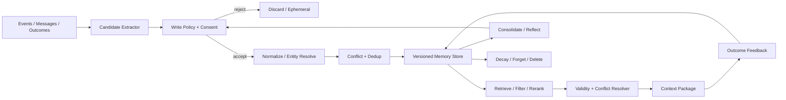
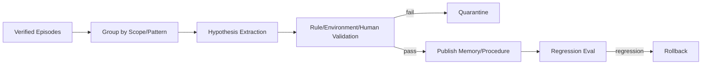
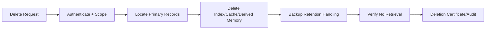

# Agent 记忆系统

> 导航：[总目录](../README.md) | [数据平面](README.md) | [上下文工程](01-上下文工程.md) | [RAG](03-RAG与知识工程.md) | [状态管理](04-状态管理与持久化.md) | [多 Agent](../01-控制平面/05-多Agent协作.md) | [安全治理](../04-保障平面/03-安全权限与治理.md)

> 调研基线：2026-08-06。记忆框架、Memory Benchmark 和产品隐私能力变化较快，生产选型前应重新核对官方文档与数据处理条款。

---

## 0. 本章怎么读

Agent Memory 不是把历史对话切块写入向量库。一个完整记忆系统必须回答：什么值得记、谁有权记、记成什么结构、何时检索、如何处理冲突和过期、怎样被用户纠正/删除，以及记忆是否真的提升任务而没有引入隐私和错误污染。

推荐阅读顺序：

1. 第 1～3 节建立 Memory、State、Conversation、RAG 的边界和对象模型。
2. 第 4～9 节掌握写入、规范化、存储、检索、冲突与时态。
3. 第 10～14 节处理 Consolidation、遗忘、隐私和多 Agent 共享记忆。
4. 第 15～22 节是工具接口、可观测、评测、案例、检查表和面试题。

### 0.1 最需要掌握的十二个重点

| 优先级 | 重点 | 掌握标准 |
|---|---|---|
| P0 | 边界 | Working State 不冒充长期记忆，聊天不默认永久保存 |
| P0 | Write Gate | 写入比读取保守，显式区分用户原话、外部事实和模型推断 |
| P0 | Provenance | 每条记忆可追溯到来源、写入策略和验证状态 |
| P0 | Scope | 记忆绑定用户、组织、任务类型、地区、时间和 Purpose |
| P0 | Conflict | 新值不直接覆盖旧值，保留时态、版本和纠正关系 |
| P1 | Memory Types | Episodic、Semantic、Procedural、Prospective 使用不同存储和检索 |
| P1 | Retrieval | 相关性之外还考虑权限、时效、可信度、重要性和适用范围 |
| P1 | Consolidation | 从事件抽取事实/经验需要外部验证，不能让反思直接变永久规则 |
| P1 | Forgetting | TTL、衰减、容量淘汰、纠错和合规删除语义分开 |
| P1 | Privacy | Consent、可见性、更正、导出、删除和跨租户隔离 |
| P1 | Shared Memory | 多 Agent 写入需要 Owner、审核、毒化防护和版本 |
| P2 | Evaluation | 衡量 Memory Lift、错误记忆伤害、长期检索和删除完整性 |

### 0.2 核心结论

1. **写入是记忆系统最危险的步骤。** 错误记忆会跨任务重复影响未来决策。
2. **记忆应存语义对象，不只是文本块。** Subject、Predicate、Value、Scope、Time、Confidence 和 Provenance 决定能否治理。
3. **向量相似度只是召回信号。** 权限、时态、作用域和可信度先于相似度。
4. **用户最新明确纠正通常优先于旧偏好和模型推断。** 但业务事实仍应回到 Source of Truth。
5. **过期、遗忘和删除不是同一件事。** 过期可保留审计，合规删除要求全链路清除或不可恢复匿名化。
6. **会话摘要不自动等于长期记忆。** 它首先是上下文压缩产物。
7. **Procedural Memory 更接近版本化 Skill/Policy，而不是自然语言随手记。**
8. **共享记忆是供应链和 Prompt Injection 放大器。** 未验证内容不能自动进入团队长期记忆。
9. **用户必须能够知道系统记住了什么，并能纠正或删除。**
10. **有记忆的效果必须相对无记忆和仅会话状态基线证明。**

---

## 1. 概念边界与记忆分类

### 1.1 Memory、State、History 和 RAG

| 对象 | 目标 | 生命周期 | 典型内容 |
|---|---|---|---|
| Working State | 推进当前任务 | 当前 Run/Task | 中间变量、Step、预算、Tool 状态 |
| Conversation History | 保留交互记录 | 会话 | 原始消息和附件 |
| Long-term Memory | 未来任务复用 | 跨调用/任务 | 偏好、稳定事实、经验、程序 |
| RAG Knowledge | 获取外部证据 | 按需、知识库生命周期 | 政策、文档、代码、数据库资料 |
| Trace/Event | 审计发生过什么 | 运营/合规周期 | 调用、状态转换、错误、成本 |

一条订单当前状态属于业务系统和任务 State，不应复制成永久用户记忆；“用户偏好中文回答”才可能是长期偏好。

### 1.2 记忆类型

| 类型 | 回答的问题 | 例子 | 推荐实现 |
|---|---|---|---|
| Working | 当前正在处理什么 | 中间变量、当前计划 | State/Checkpoint |
| Episodic | 发生过什么 | 某次任务、决策和结果 | Event + Episode Summary |
| Semantic | 什么是相对稳定的事实 | 用户偏好、实体关系 | Profile/KV/Document/Graph |
| Procedural | 应该怎样做 | Skill、Workflow、策略 | 版本库、Prompt/Code Registry |
| Prospective | 未来何时做什么 | 到期提醒、回访 | Scheduler/Timer/Event |

Working Memory 通常不属于长期记忆 Store；Prospective Memory 的核心是可靠触发，不是向量检索。

### 1.3 按主体分类

- **User Memory**：用户偏好、长期目标、明确授权保存的信息。
- **Organization Memory**：团队规范、业务经验、共享知识。
- **Agent-private Memory**：特定 Agent 的已验证经验和失败模式。
- **Task/Episode Memory**：某次任务的可复用结果和轨迹摘要。
- **Environment Memory**：环境稳定特征，但应谨慎避免复制业务真值。

### 1.4 Profile 与 Collection

#### Profile

单个结构化对象保存当前有效值：

```yaml
user_profile:
  user_id: "user-42"
  preferred_language: "zh-CN"
  preferred_answer_style: "concise"
  accessibility:
    needs_large_text: false
  version: 19
```

适合已知字段、读取快，但并发更新和 Schema 演进需要治理。

#### Collection

多条独立 Memory Record：

```text
mem-1: prefers zh-CN for support
mem-2: prefers detailed explanation for code review
mem-3: corrected timezone to Asia/Shanghai
```

适合开放信息和不同 Scope，但需要去重、冲突和检索。

生产常结合：Profile 存高频稳定字段，Collection 存开放事实和事件。

### 1.5 记忆不应包含什么

- 密码、Token、Cookie、私钥和恢复码。
- 无明确用途的完整聊天永久副本。
- 模型猜测的敏感属性。
- 当前短期任务状态和瞬时环境状态。
- 可从权威业务系统实时获取且变化频繁的事实。
- 未经许可的第三方个人数据。
- 未验证的外部文档指令。
- 无法解释来源和适用范围的“经验”。

---

## 2. 记忆系统参考架构



### 2.1 组件职责

| 组件 | 责任 | 不应承担 |
|---|---|---|
| Candidate Extractor | 从事件中提出可记忆候选 | 直接永久写入 |
| Write Policy | Utility、Consent、Sensitivity、Confidence 判断 | 只按 LLM 自信度决定 |
| Normalizer | 实体、字段、时间、单位标准化 | 抹掉原始表达 |
| Conflict Resolver | 建立纠正、替代、并存关系 | 静默覆盖 |
| Memory Store | 版本、ACL、索引、TTL | 直接决定上下文 |
| Retriever | 按 Query/Scope 召回 | 绕过权限和时态 |
| Context Adapter | 转为当前 Step 可见片段 | 把全部记忆塞进窗口 |
| Consolidator | 提炼稳定模式和经验 | 无验证地产生新事实 |
| Deletion Service | 删除、墓碑、索引传播和证明 | 只删主表 |

### 2.2 架构不变量

1. 任何永久写入都有来源事件和 Write Decision。
2. 用户、租户和 Purpose Scope 是强过滤，不是排序特征。
3. 模型推断与用户明确事实字段分开。
4. 更新产生新版本或明确 Patch，不静默丢失旧来源。
5. 检索结果经过有效性和冲突检查才进入 Context。
6. Shared/Procedural Memory 写入需要更高门槛。
7. 合规删除覆盖主存、索引、缓存、派生摘要和备份策略。
8. 记忆使用能关联到最终任务结果，支持效果归因。

---

## 3. Memory Record 数据模型

### 3.1 SemanticMemoryV4

```yaml
memory_version: 4
memory_id: "mem-01J..."
memory_type: "semantic"

subject:
  entity_type: "user"
  entity_id: "user-42"
predicate: "preferred_output_language"
value:
  type: "string"
  data: "zh-CN"
  normalized: "zh-CN"

scope:
  tenant_id: "tenant-7"
  purposes: ["assistant_response"]
  task_types: ["writing", "customer_support"]
  excluded_task_types: ["translation_target_selection"]
  locale: null

temporal:
  observed_at: "2026-08-06T09:00:00+08:00"
  valid_from: "2026-08-06T09:00:00+08:00"
  valid_to: null
  recorded_at: "2026-08-06T09:00:01+08:00"
  expires_at: null

epistemic:
  assertion_type: "explicit_user_statement"
  confidence: 1.0
  verification_status: "verified_by_user"
  stability: "high"
  importance: 0.7

provenance:
  source_event_ids: ["evt-user-msg-991"]
  source_excerpt_ref: "artifact://messages/991#span-2"
  extractor_version: "memory-extractor@7"
  write_policy_version: "memory-policy@14"
  write_decision_id: "mwd-88"

governance:
  sensitivity: "low"
  consent_basis: "user_requested_memory"
  retention_policy: "until_user_deletes"
  user_visible: true
  user_editable: true

status: "active"
supersedes: []
conflicts_with: []
version: 1
```

### 3.2 EpisodicMemory

```yaml
episode_id: "episode-support-2026-08-01-88"
episode_type: "customer_support_resolution"
participants: ["user-42", "support-agent@3"]
goal: "处理重复扣款"
time_range:
  started_at: "2026-08-01T10:00:00+08:00"
  ended_at: "2026-08-01T10:18:00+08:00"
outcome:
  status: "resolved"
  verified_by: "payment-system"
  artifact_refs: ["artifact://cases/case-88-resolution"]
key_decisions:
  - decision: "只对第二笔重复支付退款"
    evidence_refs: ["operation://payment-duplicate-check-8"]
lessons:
  - statement: "网关超时后必须先查询支付状态"
    verification_status: "candidate"
source_event_range: ["evt-1000", "evt-1088"]
summary_version: "episode-summarizer@4"
retention_policy: "180d"
```

Episode 中的 `lessons` 仍是候选 Procedural Memory，不因写在总结里就自动生效。

### 3.3 ProceduralMemory

```yaml
procedure_id: "proc-payment-timeout-reconcile"
name: "支付写操作超时后的对账流程"
status: "approved"
applicability:
  task_types: ["payment_write"]
  error_codes: ["TIMEOUT", "UNKNOWN_OUTCOME"]
preconditions:
  - "operation_id exists"
steps_ref: "workflow://payment-reconcile-v5"
forbidden_actions:
  - "blind_retry_with_new_operation_id"
validation:
  eval_suite: "eval://payment-reconcile-v3"
  pass_rate: 0.997
  approved_by: "payments-platform"
versions:
  procedure: 5
  policy: 18
  toolset: 44
```

Procedural Memory 应是可发布、可测试和可回滚的 Skill/Workflow，而不是让模型动态改 System Prompt。

### 3.4 ProspectiveMemory

```yaml
prospective_memory:
  reminder_id: "rem-88"
  owner: "user-42"
  intent: "在合同到期前 30 天提醒续约"
  trigger:
    type: "relative_to_domain_event"
    event_ref: "contract://c-19:expires_at"
    offset: "-P30D"
    timezone: "Asia/Shanghai"
  action:
    type: "create_task"
    payload_ref: "template://contract-renewal-reminder-v2"
  consent_basis: "explicit_user_request"
  status: "scheduled"
```

### 3.5 Assertion Type

至少区分：

- `explicit_user_statement`
- `user_correction`
- `observed_behavior`
- `authoritative_external_fact`
- `agent_inference`
- `derived_aggregation`
- `approved_procedure`

不同类型使用不同 Confidence、TTL 和写入门槛。

---

## 4. 写入策略：从 Event 到 Memory Candidate

### 4.1 写入流水线

```text
Event
-> Candidate Extraction
-> Sensitivity/Consent Filter
-> Utility/Stability/Novelty Score
-> Source and Confidence Check
-> Normalize + Entity Resolve
-> Conflict/Dedup
-> Approve/Reject/Ask User
-> Versioned Write
```

### 4.2 MemoryCandidate

```yaml
candidate_id: "mc-91"
source_event_id: "evt-user-msg-991"
candidate_type: "semantic"
proposed_assertion:
  subject: "user-42"
  predicate: "preferred_output_language"
  value: "zh-CN"
assertion_type: "explicit_user_statement"
scores:
  future_utility: 0.88
  confidence: 1.0
  stability: 0.92
  novelty: 0.71
  sensitivity_risk: 0.05
  misapplication_risk: 0.10
consent:
  required: false
  basis: "product_setting"
recommended_decision: "write"
```

### 4.3 写入评分

```text
write_utility =
    a * future_reuse_probability
  + b * task_value
  + c * stability
  + d * novelty
  + e * explicitness
  - f * sensitivity_risk
  - g * staleness_risk
  - h * misapplication_risk
  - i * storage_and_governance_cost
```

硬规则优先：Secret、禁止保存的数据、无 Consent 的敏感推断直接拒绝，不进入打分权衡。

### 4.4 写入决策类型

| 决策 | 用途 |
|---|---|
| `write` | 直接写入低风险明确事实 |
| `write_with_ttl` | 短期有用但会过期 |
| `ask_user` | 高价值但歧义/敏感，需要确认 |
| `keep_ephemeral` | 当前任务使用，不进入长期记忆 |
| `quarantine` | 可能有价值但来源不可信，等待验证 |
| `reject` | 不允许或无价值 |

### 4.5 用户显式与隐式记忆

用户说“以后都用中文回答”属于显式偏好。连续三次选择中文不等于同等强度的事实，可以记录为低置信行为信号，或只用于短期个性化。

隐式推断尤其不能用于：健康、政治、宗教、财务、种族、性取向等敏感属性。

### 4.6 写入门禁伪代码

```python
def decide_write(candidate, principal, policy, existing):
    if policy.is_forbidden(candidate):
        return Reject("forbidden_category")
    if candidate.contains_secret:
        return Reject("secret")
    if not policy.has_valid_consent(principal, candidate):
        return AskUser() if candidate.value_high else Reject("no_consent")
    if candidate.assertion_type == "agent_inference" and candidate.sensitive:
        return Reject("sensitive_inference")
    if candidate.future_utility < policy.min_utility:
        return KeepEphemeral()
    conflict = find_conflict(candidate, existing)
    if conflict and not can_auto_resolve(candidate, conflict):
        return AskUser(conflict=conflict)
    ttl = choose_ttl(candidate)
    return Write(ttl=ttl)
```

### 4.7 不从每轮对话都抽取

触发策略：

- 用户明确说“记住/以后/偏好”。
- 任务成功或失败形成可验证 Episode。
- 用户纠正系统已有记忆。
- 达到会话/任务里程碑。
- 重要业务事件到达。
- 定期离线 Consolidation。

逐 Token 或每轮无差别抽取会产生噪声、成本和隐私风险。

---

## 5. 规范化、实体解析与去重

### 5.1 Canonicalization

需要规范化：

- 用户/组织/项目实体 ID。
- 时间、时区、日期范围。
- 货币、单位和枚举。
- 语言和区域代码。
- 同义 Predicate。
- 来源 URI 和版本。

保留原始值与规范值，避免丢失用户表达。

### 5.2 Entity Resolution

“我司”“北京团队”“Acme”可能指不同实体。高风险时不要仅凭 Embedding 合并：

```yaml
entity_resolution:
  mention: "北京团队"
  candidates:
    - entity_id: "team-cn-beijing-sales"
      score: 0.82
    - entity_id: "team-cn-beijing-rd"
      score: 0.79
  decision: "ask_user"
```

### 5.3 去重

- 相同 Subject-Predicate-Value-Scope 合并 Provenance。
- 近义值经领域规则标准化后去重。
- 同一 Episode 的重复摘要通过 Source Event Range 去重。
- 不同时间有效的相同值保留时态版本。
- 模型推断不能覆盖用户显式来源，只能附加支持证据。

### 5.4 Profile Patch

```yaml
profile_patch:
  profile_id: "profile-user-42"
  expected_version: 18
  operations:
    - op: "replace"
      path: "/preferred_language"
      value: "zh-CN"
      provenance_ref: "evt-user-msg-991"
  write_decision_id: "mwd-88"
```

使用 Expected Version 防止并发记忆写入相互覆盖。

---

## 6. 存储、索引和 Namespace

### 6.1 多存储组合

| 存储 | 适合 |
|---|---|
| Relational/KV | Profile、强字段、版本、ACL、时态 |
| Document Store | Episode、开放结构事实 |
| Vector Index | 语义召回候选 |
| Full-text Index | 精确词、名称、编号 |
| Graph Store | 实体关系、时间关系和多跳记忆 |
| Object Store | 原始事件、长摘要、附件和 Artifact |
| Scheduler | Prospective Memory |
| Git/Registry | Procedural Memory/Skill |

“使用向量数据库”只是存储设计的一部分。

### 6.2 Namespace

```text
/tenant/{tenant_id}
  /user/{user_id}
    /semantic/{scope}
    /episodic/{task_type}
    /prospective
  /team/{team_id}
    /approved-procedures
    /shared-lessons
  /agent/{agent_type}/{version}
    /private-validated-lessons
```

Namespace 必须参与物理/逻辑访问控制和索引过滤，不能只写在 Metadata 后由模型遵守。

### 6.3 索引字段

- Subject/Predicate/Entity。
- Scope、Task Type、Purpose。
- Valid Time、Recorded Time、Expires At。
- Assertion Type、Confidence、Verification。
- Sensitivity、Consent、Tenant/ACL。
- Importance、Access Count、Last Useful At。
- Embedding、Keyword 和 Graph Edge。

### 6.4 写路径一致性

主存与向量/全文索引通常不是同一事务。建议：

1. 在主存提交 Memory Record 和 Outbox Event。
2. 异步更新索引。
3. 索引记录主存 Version。
4. 检索后回主存重新校验状态和 ACL。
5. 删除/纠正同样通过事件传播并监控 Lag。

---

## 7. 检索、过滤与排序

### 7.1 Memory Query

```yaml
memory_query_version: 3
principal:
  tenant_id: "tenant-7"
  user_id: "user-42"
purpose: "customer_support_response"
task:
  type: "refund_support"
  objective: "选择回答语言和解释风格"
requested_types: ["semantic"]
predicates: ["preferred_output_language", "preferred_answer_style"]
valid_at: "2026-08-06T10:00:00+08:00"
max_results: 10
max_tokens: 800
exclude_sensitivity_above: "low"
```

### 7.2 检索流水线

```text
Query Intent
-> Namespace/ACL/Purpose Filter
-> Valid-time/Status Filter
-> Structured Lookup
-> Semantic/Keyword/Graph Recall
-> Dedup and Conflict Grouping
-> Reliability/Freshness/Importance Rerank
-> Token Budget
-> Context Adapter
```

已知 Predicate 的 Profile 查询应优先结构化读取，不必每次做向量检索。

### 7.3 排序公式

```text
memory_score =
    a * semantic_relevance
  + b * scope_match
  + c * source_reliability
  + d * recency
  + e * importance
  + f * prior_usefulness
  + g * explicitness
  - h * conflict_penalty
  - i * staleness_risk
  - j * token_cost
```

### 7.4 Recency 不等于正确

- 用户最新明确纠正通常应优先。
- 外部业务事实应查询权威系统，而不是使用“最新记忆”。
- 两条记忆可能适用于不同 Scope，而非新旧冲突。
- Procedural Memory 应按批准版本，不按最近生成时间。

### 7.5 记忆进入 Context 前

- 重新校验 Status、Version、ACL 和 Valid Time。
- 将冲突成组展示或裁决。
- 标明用户原话、推断和外部事实。
- 按当前 Step 转为最小 Memory Package。
- 禁止记忆提升为系统策略。
- 记录 Retrieval ID，支持效果归因。

### 7.6 负面记忆和失败经验

“不要再调用 X，因为上次失败”可能很快过期。应记录：

```yaml
failure_lesson:
  action_fingerprint: "tool-x:operation-y"
  error_class: "rate_limited"
  applicability:
    provider: "provider-a"
    version: "v3"
  valid_until: "2026-08-06T10:05:00+08:00"
  recommended_action: "backoff"
```

不要把一次临时错误固化成永久禁用规则。

---

## 8. 冲突、纠正与双时态

### 8.1 冲突类型

- 同一 Predicate 值不同。
- 作用域不同但被错误合并。
- 用户偏好随时间变化。
- 用户声明与行为推断不同。
- 记忆与权威业务系统不同。
- 两个 Agent 对同一事件总结不同。
- Procedure 新版本替代旧版本。

### 8.2 纠正而不是覆盖

```yaml
memory_correction:
  correction_id: "corr-91"
  target_memory_id: "mem-old-timezone"
  old_value: "UTC"
  new_value: "Asia/Shanghai"
  correction_source: "explicit_user_statement"
  source_event_id: "evt-1200"
  effective_at: "2026-08-06T09:00:00+08:00"
  action:
    old_memory_status: "superseded"
    create_new_memory: true
```

### 8.3 Valid Time 与 Transaction Time

- **Valid Time**：该事实在现实中何时有效。
- **Transaction/Recorded Time**：系统何时知道并写入。

例如用户 8 月 6 日告诉系统“我从 8 月 1 日起在上海”，Valid From 是 8 月 1 日，Recorded At 是 8 月 6 日。

### 8.4 冲突裁决优先级

一个通用起点：

```text
Authoritative current business source
  > Explicit current user correction
  > Explicit prior user statement within matching scope
  > Verified external fact
  > Repeated observed behavior
  > Agent inference
```

敏感或高风险冲突应询问用户/业务 Owner，不由模型自主选择。

### 8.5 Tombstone

删除或替代后，索引中可能需要短期 Tombstone 防止旧副本重新出现：

```yaml
tombstone:
  memory_id: "mem-old-timezone"
  reason: "superseded"
  replacement_memory_id: "mem-new-timezone"
  created_at: "2026-08-06T09:00:01+08:00"
  index_propagation_status: "complete"
```

Tombstone 自身不能保留已要求删除的敏感值。

---

## 9. Consolidation、Reflection 与 Proceduralization

### 9.1 Consolidation 的目的

- 将多个相似 Episode 聚合为稳定模式。
- 将重复偏好更新为高置信 Profile。
- 把成功/失败轨迹提炼为候选 Procedure。
- 减少冗余和检索噪声。
- 更新重要性、TTL 和适用范围。

### 9.2 Consolidation Pipeline



### 9.3 Reflection 不等于真理

Agent 自我反思可以产生候选：

```yaml
lesson_candidate:
  statement: "先查支付状态再重试可以避免重复扣款"
  based_on_episodes: ["ep-1", "ep-8", "ep-11"]
  generated_by: "reflection-model@5"
  status: "candidate"
  required_validation:
    - "payment-sandbox-replay"
    - "platform-owner-review"
```

没有验证的反思只适合当前 Run 临时使用。

### 9.4 从经验到 Skill

```text
Episodes
-> Repeated Pattern
-> Candidate Procedure
-> Preconditions/Inputs/Outputs
-> Deterministic Checks
-> Offline Eval
-> Approval
-> Versioned Skill/Workflow
-> Canary and Monitoring
```

### 9.5 防止过度泛化

“某次 PDF 解析失败”不能泛化成“PDF 工具不可用”。Procedure/经验必须记录：

- 适用 Task、Domain、Provider、Version。
- 前置条件和反例。
- 证据数量与质量。
- 失效时间和重新验证条件。

---

## 10. 遗忘、衰减、TTL 与容量管理

### 10.1 四种不同动作

| 动作 | 含义 | 是否保留审计 |
|---|---|---:|
| Expire | 不再用于当前决策 | 通常是 |
| Decay | 排名权重随时间下降 | 是 |
| Evict | 因容量从热索引移除 | 可保留冷存 |
| Delete | 按用户/合规要求清除 | 依政策最小化 |

### 10.2 TTL 选择

- 临时偏好：“本次回答简短” -> 仅会话。
- 项目偏好：“该项目使用 Java 21” -> 项目 Scope，随项目版本。
- 用户偏好：“默认中文” -> 长期，用户可更正。
- 工具故障经验 -> 短 TTL。
- 已批准 Procedure -> 随版本/发布生命周期。
- 敏感信息 -> 最短必要保留期。

### 10.3 时间衰减

```text
decayed_importance(t) = base_importance * exp(-lambda * age)
```

明确用户偏好和批准 Procedure 不应简单按时间衰减；衰减适合行为信号和弱经验。

### 10.4 Usage-aware Retention

记录：

- Retrieval Count。
- Last Retrieved At。
- Last Useful At。
- Downstream Positive/Negative Impact。
- User Correction Count。

“经常被召回”不等于“经常有用”，可能只是检索偏差。

### 10.5 遗忘策略评测

比较：

- 无遗忘。
- 固定 TTL。
- 时间衰减。
- Utility-aware Retention。
- 用户可控 Profile + Episode 冷存。

观察 Memory Lift、Stale Error、存储、检索噪声和删除复杂度。

---

## 11. 隐私、Consent、可见性和删除

### 11.1 Consent 必须具体

Consent 至少描述：

- 保存什么类别。
- 为了什么 Purpose。
- 保存多久。
- 谁可以访问。
- 是否用于训练/改进。
- 如何查看、更正、导出和删除。

“使用本产品即同意记住一切”不是良好的记忆治理。

### 11.2 用户控制面

用户应能：

- 查看系统保存的可见记忆。
- 查看来源和最近使用时间。
- 编辑/纠正结构化偏好。
- 删除单条、某类或全部记忆。
- 关闭某类自动记忆。
- 导出可理解的数据。

### 11.3 删除工作流



### 11.4 DeletionJob

```yaml
deletion_job:
  job_id: "del-88"
  principal: "user-42"
  scope:
    memory_ids: ["mem-44", "mem-45"]
    derived_records: true
    indexes: true
    caches: true
  requested_at: "2026-08-06T10:00:00+08:00"
  legal_hold: false
  status: "verifying"
  stores:
    primary: "complete"
    vector_index: "complete"
    fulltext_index: "complete"
    cache: "complete"
    backup: "scheduled_expiry"
  verification_query_result: "not_retrievable"
```

### 11.5 派生记忆删除

若 Episode A 和 B 生成了 Consolidated Memory C，删除 A 时需要判断：

- C 是否仍能由其他合法来源支持。
- C 是否包含 A 独有敏感信息。
- 是否可以重新计算 C。
- Provenance 是否需要更新。

删除不能只处理原始记录。

### 11.6 安全存储

- 传输和静态加密。
- 租户/用户级访问控制。
- 高敏感字段单独密钥和审计。
- 管理员访问最小化。
- Trace 和日志不重复记录完整值。
- 备份恢复后重新应用删除墓碑。

---

## 12. 多 Agent 共享记忆与污染防护

### 12.1 三层共享

| 层 | 内容 | 写入权限 |
|---|---|---|
| Agent-private | 局部经验和工作偏好 | 当前 Agent，仍需策略 |
| Team Shared | 经验证的跨 Agent 事实、案例和方法 | 指定 Curator/Workflow |
| Organization Approved | Runbook、Skill、政策和标准 | Owner 审批与发布 |

Agent A 的反思不能直接成为所有 Agent 的组织记忆。

### 12.2 Shared Memory Proposal

```yaml
shared_memory_proposal:
  proposal_id: "smp-91"
  proposed_by: "agent:code-reviewer@4"
  target_namespace: "/tenant-7/team/dev/shared-lessons"
  candidate:
    type: "procedural_lesson"
    statement: "修改鉴权中间件后必须运行跨租户隔离测试"
  evidence:
    episode_refs: ["episode://bug-88", "episode://bug-101"]
    test_refs: ["test://tenant-isolation-suite"]
  risk:
    scope: "repository-family-a"
    confidence: 0.91
  required_approval: "security-platform-owner"
  status: "pending_review"
```

### 12.3 共享记忆毒化

来源：

- 外部文档中的 Prompt Injection 被摘要成“经验”。
- 恶意 Worker 伪造成功轨迹。
- 低质量模型把猜测写成事实。
- 单次偶然成功被过度泛化。
- 被撤销 Agent/Tool 版本留下旧程序记忆。

防护：

- Provenance 和 Evidence 必需。
- 独立 Verifier/测试。
- Quarantine Namespace。
- 写入者与审批者分离。
- Procedure 版本和适用范围。
- 定期回归、到期和撤销。

### 12.4 多 Agent 冲突

多个 Agent 提交不同结论时，保留 Proposal 和 Evidence，不以 Agent 数量投票。优先环境真值、业务 Owner 和可复现测试。协作协议详见[多 Agent 协作](../01-控制平面/05-多Agent协作.md)。

---

## 13. Memory Tool/API 设计

### 13.1 不给模型裸数据库权限

建议暴露有限工具：

- `memory.search`
- `memory.get_profile`
- `memory.propose_write`
- `memory.propose_correction`
- `memory.forget`
- `memory.list_user_visible`

写入工具返回 Proposal/Decision，而不是让模型任意写表。

### 13.2 Search API

```yaml
tool: "memory.search"
input:
  query: "用户的回答语言和详细程度偏好"
  memory_types: ["semantic"]
  predicates: ["preferred_output_language", "preferred_answer_style"]
  purpose: "assistant_response"
  max_results: 5
  max_tokens: 500
output:
  retrieval_id: "mr-88"
  records: []
  conflicts: []
  coverage: "complete"
```

调用者身份和 Tenant 由 Runtime 注入，不能由模型参数自由填写。

### 13.3 Propose Write API

```yaml
tool: "memory.propose_write"
input:
  assertion:
    predicate: "preferred_output_language"
    value: "zh-CN"
  source_event_id: "evt-991"
  suggested_scope: "assistant_response"
output:
  proposal_id: "mwp-88"
  decision: "written"
  memory_id: "mem-44"
  policy_reason: "explicit_low_risk_preference"
```

### 13.4 错误语义

| 错误 | 动作 |
|---|---|
| `NO_CONSENT` | 询问用户或保持 Ephemeral |
| `SENSITIVE_FORBIDDEN` | 拒绝，不重试 |
| `CONFLICT_REQUIRES_CONFIRMATION` | 展示候选并澄清 |
| `STALE_PROFILE_VERSION` | 读取新版本后 Reconcile |
| `INDEX_LAG` | 可回主存查询或等待 |
| `DELETION_IN_PROGRESS` | 不再返回目标记忆 |
| `SCOPE_MISMATCH` | 修正任务 Scope，不扩大权限 |

### 13.5 Memory Use Receipt

```yaml
memory_use_receipt:
  retrieval_id: "mr-88"
  run_id: "run-91"
  step_id: "compose-response"
  used_memory_ids: ["mem-44"]
  context_manifest_id: "ctx-991"
  outcome:
    task_success: true
    user_corrected_memory: false
    evaluator_score: 0.94
```

这是计算 Memory Lift、负面影响和 Last Useful At 的基础。

---

## 14. 可观测性与运营

### 14.1 Memory Write Span

```yaml
span_name: "memory.write_decision"
attributes:
  candidate.type: "semantic"
  assertion.type: "explicit_user_statement"
  policy.version: "14"
  consent.basis: "product_setting"
  decision: "write"
  conflict.found: false
  sensitivity: "low"
  store.latency_ms: 21
  index.status: "pending"
```

不要在普通 Trace 明文记录敏感 Value；记录类别、Digest 或受控引用。

### 14.2 核心运营指标

- Candidate Extraction Rate。
- Write Acceptance/Reject/Ask-user Rate。
- Write Precision。
- Retrieval Precision/Recall。
- Memory-assisted Task Lift。
- Harmful Memory Use Rate。
- User Correction Rate。
- Conflict/Stale Memory Rate。
- Index Lag 和 Delete Propagation Lag。
- Cross-user/Tenant Leakage，必须为零。
- User View/Edit/Delete Success。
- Procedural Memory Regression Rate。

### 14.3 Harmful Memory Incident

发生错误记忆影响任务时：

1. 冻结/撤销目标 Memory 和派生记录。
2. 查询使用过该 Memory 的 Run 和用户影响。
3. 检查来源、Extractor、Write Policy 和 Consolidation。
4. 修复索引、缓存和 Shared Memory。
5. 建立回归样本和删除/纠正验证。
6. 必要时通知用户并允许查看纠正。

---

## 15. 记忆评测体系

### 15.1 三个核心问题

1. **Should Write**：系统是否正确决定记或不记？
2. **Can Retrieve**：未来需要时能否取到正确记忆？
3. **Does It Help**：记忆是否实际改善任务，且没有造成伤害？

### 15.2 MemoryEvalCase

```yaml
case_id: "mem-long-dialog-001"
history_ref: "dataset://memory-eval/dialog-001"
query_time: "2026-08-06T10:00:00+08:00"
query: "用户希望用什么语言和风格回答代码问题？"
gold:
  should_write:
    - event_id: "evt-12"
      predicate: "preferred_output_language"
      value: "zh-CN"
      scope: "all"
    - event_id: "evt-88"
      predicate: "preferred_answer_style"
      value: "detailed"
      scope: "code_questions"
  should_not_write:
    - event_id: "evt-50"
      reason: "temporary_task_state"
  expected_retrieval: ["mem-language", "mem-code-style"]
  forbidden_retrieval: ["other-user-memory", "superseded-style"]
perturbations:
  - "user_correction_after_100_turns"
  - "conflicting_behavioral_inference"
  - "deletion_before_query"
```

### 15.3 写入指标

```text
Write Precision = valuable_correct_writes / all_writes
Write Recall = valuable_events_written / all_valuable_events
```

另测：Forbidden Write Rate、Consent Violation、Sensitive Inference Rate、Duplicate Write、Conflict Detection。

### 15.4 检索指标

- Recall@k、Precision@k、MRR/nDCG。
- Temporal Correctness。
- Scope/Predicate Accuracy。
- Conflict-aware Retrieval。
- Cross-user Leakage。
- Retrieval Token Efficiency。

### 15.5 端到端指标

```text
Memory Lift = success_with_memory - success_without_memory
```

同时报告：

- Task Success、User Satisfaction。
- Cost/Latency 增量。
- Harmful Memory Failure Rate。
- Unnecessary Personalization Rate。
- Clarification Reduction。
- Long-horizon Consistency。

### 15.6 对照组

1. 无长期记忆。
2. 全历史直接输入。
3. 会话摘要。
4. 简单向量检索。
5. 结构化 Profile + Collection。
6. 完整写入/冲突/遗忘系统。

### 15.7 长期对话 Benchmark

可参考：

- LoCoMo：长对话中的问答、时态和多跳记忆。
- LongMemEval：信息抽取、多 Session、时间和知识更新等长期记忆能力。
- MemoryAgentBench：从写入、检索、更新和长程任务角度诊断 Agent Memory。

公开 Benchmark 只做起点，仍需自建用户、权限、敏感性和业务时态数据集。

### 15.8 删除与隐私评测

- 删除后所有 Query 不再返回。
- 向量、全文、Graph、Cache 和派生摘要都验证。
- 备份恢复演练后仍遵守墓碑。
- 非目标记忆不被误删。
- 用户导出内容可理解且来源正确。
- 关闭记忆后不再产生新写入。

---

## 16. 三个完整案例

### 16.1 用户偏好记忆

用户说：“以后技术问题请详细回答，其他问题简洁一些。”

写入为两条带 Scope 的记忆：

```yaml
- predicate: "preferred_answer_style"
  value: "detailed"
  scope: "technical_questions"
- predicate: "preferred_answer_style"
  value: "concise"
  scope: "non_technical_questions"
```

错误实现是写成无 Scope 的 `answer_style=detailed`，导致所有任务过度展开。

若用户后来在当前消息说“这次只给结论”，当前显式指令优先，但长期偏好不必被永久改写。

### 16.2 代码 Agent 经验记忆

一次修复中发现某仓库必须在生成代码后运行自定义格式化器。

处理：

1. Episode 保存仓库、Commit、失败测试和修复结果。
2. Lesson Candidate 记录“该仓库生成代码后运行 X”。
3. 读取仓库文档和 CI 配置验证。
4. 绑定 Repository/Version Scope。
5. 发布为 Skill/Workflow Step，并运行回归。
6. 仓库升级或配置删除时使 Procedure 过期。

不能从单次成功直接写入所有代码 Agent 的全局规则。

### 16.3 客服长期记忆与业务状态

- 记忆：用户偏好中文、无障碍沟通方式。
- 会话状态：当前工单的澄清进度。
- 业务真值：订单、退款和支付状态。
- RAG：当前生效政策。

如果历史 Episode 写着订单“未发货”，当前订单系统显示“已发货”，必须使用业务真值；Episode 仅可帮助理解过去发生过什么。

---

## 17. 常见反模式与修正

| 反模式 | 后果 | 修正 |
|---|---|---|
| 所有聊天自动永久保存 | 隐私、噪声、成本 | Write Gate + Consent |
| 向量库就是记忆系统 | 无时态/冲突/删除 | 主存 + 索引 +治理 |
| 模型猜测当用户事实 | 个性化错误和敏感推断 | Assertion Type 分离 |
| 新值覆盖旧值 | 无法审计和理解时间 | Version + Supersede |
| 只按相似度检索 | 越权、过期、错 Scope | 硬过滤 + Rerank |
| 一次失败变永久经验 | 过度泛化 | TTL + Applicability |
| 反思直接改 Prompt | 行为不可控 | Candidate -> Eval -> Publish |
| Shared Memory 任意写 | 团队污染 | Proposal/Curator/Verifier |
| 删除只删主数据库 | 索引和缓存仍泄漏 | Delete Workflow |
| 记忆越多越好 | 召回噪声和冲突 | Utility/Decay/Consolidation |
| 用历史记忆代替业务查询 | 陈旧事实导致副作用 | Source of Truth 优先 |
| 只测问答准确率 | 忽略写入和隐私 | Write/Retrieve/Help 三层评测 |

---

## 18. 生产落地检查表

### 18.1 数据模型

- [ ] Memory Type、Subject、Predicate、Value 和 Scope 明确。
- [ ] Assertion Type 区分用户原话、外部事实和模型推断。
- [ ] Valid/Recorded Time、TTL、Version 和 Provenance 完整。
- [ ] Sensitivity、Consent 和 User Visibility 可查询。

### 18.2 写入

- [ ] 写入有 Candidate 和 Write Decision。
- [ ] Secret/禁止类别硬拒绝。
- [ ] 敏感推断不会自动写入。
- [ ] 冲突、重复和实体歧义在写前处理。
- [ ] Shared/Procedural Memory 有独立审批和评测。

### 18.3 检索与使用

- [ ] Tenant/ACL/Purpose/Valid Time 先过滤。
- [ ] Profile 字段优先结构化读取。
- [ ] Conflict 和 Superseded 记录不会静默进入 Context。
- [ ] Memory Package 有 Token Budget 和 Retrieval ID。
- [ ] 当前输入与业务 Source of Truth 优先级明确。

### 18.4 遗忘与删除

- [ ] Expire、Decay、Evict 和 Delete 语义分开。
- [ ] 索引同步和删除 Lag 可监控。
- [ ] 用户可查看、更正、导出和删除。
- [ ] 派生记忆和缓存纳入删除。
- [ ] 备份恢复后重新应用删除墓碑。

### 18.5 评测与运营

- [ ] 有无记忆和简单向量基线。
- [ ] 测 Write Precision/Recall 和 Forbidden Write。
- [ ] 测 Retrieval、Temporal、Scope 和 Leakage。
- [ ] 测 Memory Lift 与 Harmful Memory Rate。
- [ ] 错误记忆事故可定位所有受影响 Run。

---

## 19. 实践任务

### 19.1 入门：带 Scope 的用户偏好

- 实现 Profile + Collection。
- 支持显式偏好、当前会话覆盖和用户纠正。
- 记录 Provenance、Version 和 Memory Use Receipt。
- 对比无记忆基线。

### 19.2 进阶：冲突和双时态

- 构造用户时区、公司职位和项目偏好变化。
- 实现 Valid Time、Recorded Time、Supersede 和 Tombstone。
- 测试历史时间点查询和当前查询。

### 19.3 高阶：Episode 到 Procedure

- 收集成功/失败轨迹。
- 产生 Lesson Candidate。
- 使用测试/规则验证并发布版本化 Skill。
- 注入错误反思，验证不会污染生产 Procedure。

### 19.4 隐私：完整删除演练

- 删除主存、向量、全文、Graph、Cache 和派生摘要。
- 模拟索引延迟和备份恢复。
- 输出 Deletion Job 和验证报告。

---

## 20. 面试高频题与答题框架

### 20.1 基础概念

1. **Agent Memory 和 RAG 的区别是什么？**
   答题重点：个体/任务历史的写入生命周期 vs 外部知识证据检索。
2. **Memory 和 State 有什么区别？**
   答题重点：跨任务可复用信息 vs 当前任务真实进度。
3. **会话摘要算长期记忆吗？**
   答题重点：默认是上下文压缩；经 Write Gate 才可能形成长期记忆。
4. **Episodic、Semantic、Procedural、Prospective 有什么区别？**
   答题重点：事件、稳定事实、做事方法、未来触发。
5. **为什么向量数据库不等于记忆系统？**
   答题重点：缺写入策略、时态、冲突、权限、删除和评测。

### 20.2 写入与建模

6. **哪些信息不应写入长期记忆？**
   答题重点：Secret、短期状态、敏感推断、可实时查询业务事实和无用途历史。
7. **为什么写入要比读取保守？**
   答题重点：错误会跨任务传播，删除和纠错成本高。
8. **Memory Record 应有哪些字段？**
   答题重点：Subject/Predicate/Value/Scope/Time/Confidence/Provenance/Governance/Version。
9. **如何区分用户事实和模型推断？**
   答题重点：Assertion Type、来源、置信、TTL 和展示。
10. **Profile 和 Collection 如何选择？**
    答题重点：固定高频字段 vs 开放事实；生产常组合。
11. **用户行为可以直接推断偏好吗？**
    答题重点：低置信行为信号，敏感属性禁止，重要偏好需确认。
12. **如何防止重复记忆？**
    答题重点：实体解析、Canonical Predicate、Subject-Value-Scope 和 Provenance 合并。

### 20.3 检索、冲突与遗忘

13. **记忆检索为什么不能只看相似度？**
    答题重点：Tenant、Purpose、时态、Scope、可信度和冲突。
14. **用户新偏好与旧记忆冲突怎么办？**
    答题重点：创建新版本、Supersede、保留来源和有效时间。
15. **Valid Time 和 Recorded Time 有什么区别？**
    答题重点：现实何时有效 vs 系统何时知道。
16. **最新记忆一定最正确吗？**
    答题重点：不一定，业务事实查 Source of Truth，Scope 和来源更重要。
17. **过期、衰减、淘汰和删除有何区别？**
    答题重点：不再使用、降低排名、移出热存、合规清除。
18. **如何选择 TTL？**
    答题重点：稳定性、来源、敏感性、Scope、更新频率和用户预期。
19. **如何避免一次失败经验永久误导 Agent？**
    答题重点：Applicability、短 TTL、多 Episode、验证和版本。

### 20.4 Consolidation 与多 Agent

20. **什么是 Memory Consolidation？**
    答题重点：从重复事件提炼稳定事实/经验并减少冗余。
21. **Reflection 能否直接写入长期记忆？**
    答题重点：只能作为 Candidate，需要外部验证和回归。
22. **Procedural Memory 与 Skill 的关系？**
    答题重点：应发布为版本化、可测试、可回滚的程序能力。
23. **多 Agent 如何共享记忆？**
    答题重点：Private/Team/Approved 分层、Owner、Proposal 和 Curator。
24. **如何防止共享记忆被 Prompt Injection 污染？**
    答题重点：来源、Quarantine、验证、审批和适用范围。

### 20.5 隐私与删除

25. **记忆系统的 Consent 应包含什么？**
    答题重点：类别、Purpose、期限、访问者、训练用途和用户控制。
26. **如何实现用户“忘掉我”？**
    答题重点：主存、索引、缓存、派生记录、备份和验证。
27. **删除为什么不能只删向量库？**
    答题重点：主存、全文、Graph、Cache、摘要和 Trace 可能仍有副本。
28. **如何防止跨用户记忆泄漏？**
    答题重点：Namespace、物理 ACL、检索回主存校验和测试。

### 20.6 评测与项目深挖

29. **如何评测记忆系统？**
    答题重点：Should Write、Can Retrieve、Does Help，加隐私删除。
30. **什么是 Memory Lift？**
    答题重点：有记忆相对无记忆的任务成功增益，扣除成本和伤害。
31. **记忆召回率高但任务效果差，为什么？**
    答题重点：错 Scope、陈旧、冲突、噪声、模型未正确使用。
32. **如何构造长期记忆测试集？**
    答题重点：多 Session、纠正、时间、冲突、删除、跨用户和不可记信息。
33. **为什么 Write Precision 可能比 Recall 更重要？**
    答题重点：错误写入长期伤害大，读取时还能澄清/回源。
34. **如何定位一次错误个性化？**
    答题重点：Memory Use Receipt、来源、写入决策、检索、Context 和结果。
35. **记忆越多为什么不一定越好？**
    答题重点：冲突、噪声、隐私、检索成本和错误传播。
36. **如何证明复杂记忆系统值得上线？**
    答题重点：与无记忆/摘要/向量基线比较长期任务、成本、纠错和隐私。

更多社区题目见[社区面经与真题](../05-实践路线/06-社区面经与真题.md#4-agent-架构规划与多-agent)。

---

## 21. 资料与项目

### 21.1 经典与代表性论文

- [Generative Agents](https://arxiv.org/abs/2304.03442)：观察流、记忆检索、反思和规划的经典架构。
- [MemGPT](https://arxiv.org/abs/2310.08560)：以分层内存和虚拟上下文管理长程交互。
- [MemoryBank](https://arxiv.org/abs/2305.10250)：长期对话记忆、遗忘与个性化。
- [LongMem](https://arxiv.org/abs/2306.07174)：语言模型长程记忆增强。
- [Mem0](https://arxiv.org/abs/2504.19413)：面向生产 Agent 的记忆抽取、更新与检索架构。

### 21.2 Benchmark

- [LoCoMo](https://arxiv.org/abs/2402.17753)：超长多轮对话中的长期记忆评测。
- [LongMemEval](https://arxiv.org/abs/2410.10813)：多 Session、时间、知识更新和长期记忆诊断。
- [MemoryAgentBench](https://arxiv.org/abs/2507.05257)：Agent Memory 的写入、检索、更新和长程任务评测。

### 21.3 官方文档与项目

- [LangGraph Memory](https://docs.langchain.com/oss/python/langgraph/add-memory)：短期/长期记忆、Profile/Collection 和 Store。
- [Letta Memory](https://docs.letta.com/guides/agents/memory/)：Memory Block、Archival/Recall 和 Agent Memory 管理。
- [Mem0 Documentation](https://docs.mem0.ai/)：用户、Agent、Run 级 Memory 与 Graph Memory。
- [Zep/Graphiti](https://help.getzep.com/)：时态知识图谱和会话记忆实现参考。
- [Letta](https://github.com/letta-ai/letta)
- [Mem0](https://github.com/mem0ai/mem0)
- [Graphiti](https://github.com/getzep/graphiti)

阅读项目时重点检查：Memory 是否有主存还是只有向量索引、写入是谁决定、冲突和时态如何处理、用户如何删除、Shared Memory 如何治理，以及是否有真实 Memory Lift 评测。

---

## 22. 本章与其他模块的边界

| 问题 | 本章回答 | 深入模块 |
|---|---|---|
| 什么信息值得跨任务保存 | 类型、写入、冲突、检索、遗忘和隐私 | 本章 |
| 本轮调用选择哪些记忆 | 输出 Memory Package | [上下文工程](01-上下文工程.md) |
| 外部政策/文档如何检索 | 不把知识库直接当用户记忆 | [RAG 与知识工程](03-RAG与知识工程.md) |
| 当前任务状态和 Checkpoint | Working Memory 归入 State | [状态管理与持久化](04-状态管理与持久化.md) |
| Skill、Prompt 和 Workflow 如何发布 | Procedural Memory 只给候选/版本 | [Agent 架构](../01-控制平面/01-Agent架构.md) |
| 多 Agent 如何共享和委派 | 定义 Shared Memory 写入门禁 | [多 Agent 协作](../01-控制平面/05-多Agent协作.md) |
| 隐私、权限、注入和治理 | 定义 Consent/Deletion 接口 | [安全权限与治理](../04-保障平面/03-安全权限与治理.md) |
| 如何统计评测和发布 | 定义 Memory 专项指标 | [Agent 能力评测](../04-保障平面/01-Agent评测.md) |

最终判断标准：成熟的记忆系统能保守地写入、准确地按作用域和时间检索、显式处理冲突、允许用户查看纠正和删除，并通过对照实验证明记忆对长期任务有净正收益而不是持续污染。
