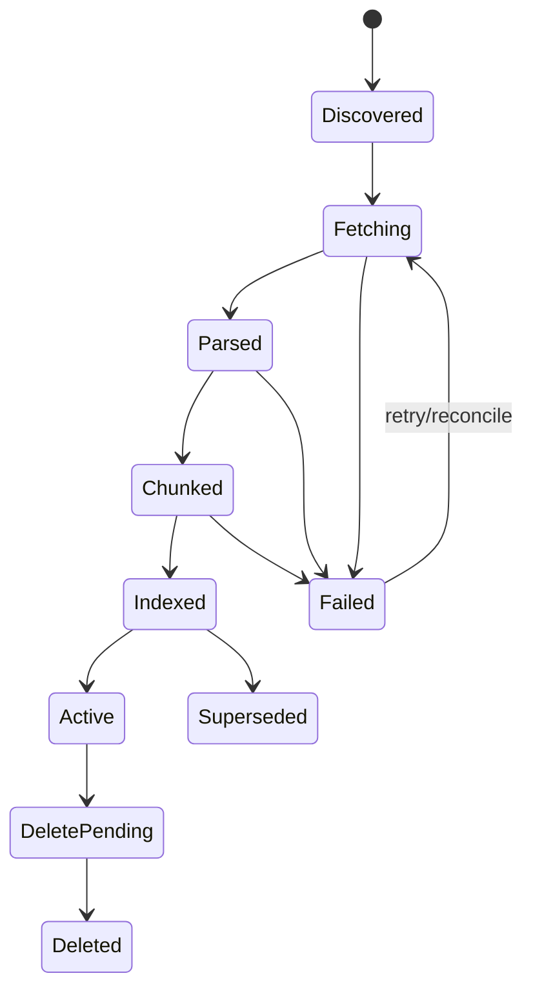
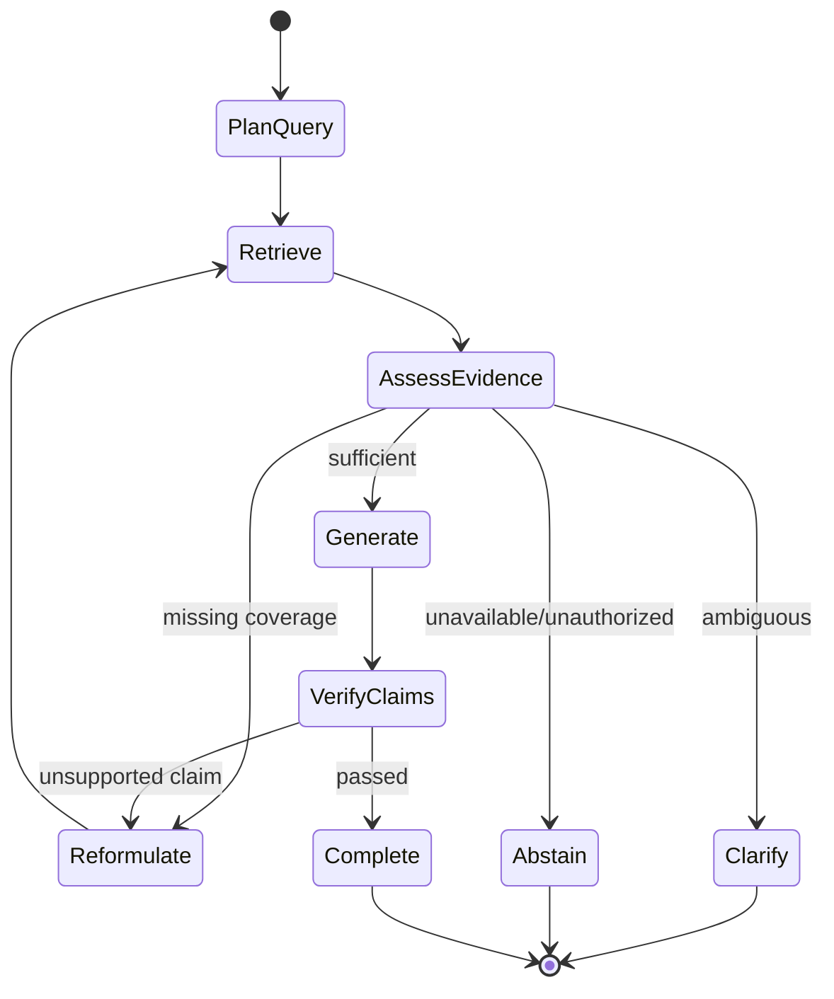

# RAG 与知识工程

> 导航：[总目录](../README.md) | [数据平面](README.md) | [上下文工程](01-上下文工程.md) | [记忆系统](02-记忆系统.md) | [状态管理](04-状态管理与持久化.md) | [意图路由](../01-控制平面/03-意图识别与请求路由.md) | [评测](../04-保障平面/01-Agent评测.md)

> 调研基线：2026-08-06。Embedding、Reranker、向量数据库、GraphRAG 和评测框架变化较快，生产选型应使用自身问题-证据数据重新验证。

---

## 0. 本章怎么读

RAG 不是“向量库 Top-k + Prompt”。生产级 RAG 是一条从知识源、解析、版本和权限，到查询理解、召回、重排、证据组织、引用验证、拒答和持续评测的证据供应链。Agentic RAG 只是在这条链路上增加动态数据源选择、迭代检索和工具调用，并不会自动修复脏数据、低召回和错误权限。

推荐阅读顺序：

1. 第 1～5 节理解边界、数据工程、解析和 Chunk。
2. 第 6～12 节掌握 Dense、Sparse、Hybrid、Rerank、Query Planning 与 GraphRAG。
3. 第 13～17 节处理证据、权限、新鲜度、性能、观测和评测。
4. 第 18～24 节通过案例、排障、检查表和面试题完成落地。

### 0.1 最需要掌握的十二个重点

| 优先级 | 重点 | 掌握标准 |
|---|---|---|
| P0 | Ground Truth | 建立问题-证据-答案数据集，不只凭主观回答评测 |
| P0 | 数据血缘 | Source、Document、Version、Chunk、Index、Embedding 可追溯 |
| P0 | ACL | 权限在召回前过滤，返回 Context 前再次校验 |
| P0 | 分层排障 | 能区分数据、解析、Chunk、Query、Recall、Rerank、Context、Generation 故障 |
| P0 | Evidence | 答案结论绑定支持片段，并验证引用真的支持结论 |
| P1 | Chunk | 按文档结构和问题证据选择，不迷信固定大小 |
| P1 | Hybrid | Dense、BM25/Sparse、Metadata 和 Rerank 组合 |
| P1 | Query Planning | Rewrite、Multi-query、Decomposition、Filter 和数据源选择 |
| P1 | Freshness | 更新、删除、ACL 变化可增量传播并有 SLA |
| P1 | Abstention | 无证据、冲突、过期或无权限时能澄清/拒答 |
| P1 | Agentic RAG | 有查询预算、停止条件、证据去重和注入防护 |
| P2 | System Metrics | 质量、P95、索引 Lag、成本和权限违规统一评测 |

### 0.2 核心结论

1. **RAG 的第一瓶颈经常不是 Embedding，而是知识源、解析、Chunk、权限和 Ground Truth。**
2. **Dense 与 Sparse 互补。** 专名、编号、错误码和精确短语通常仍需要 BM25/Sparse。
3. **Chunk 没有通用最佳大小。** 应按问题对应的最小充分证据评测。
4. **检索相关不等于证据支持。** Citation 必须验证 Entailment/Support。
5. **权限是检索约束，不是生成后再做脱敏。**
6. **文档更新、删除和 ACL 变化与新增同等重要。**
7. **Query Rewrite 可能改善召回，也可能改坏意图。** 要保留原查询和回退。
8. **Reranker 不能召回第一阶段没有找到的证据。** 先测 Recall，再优化排序。
9. **GraphRAG 适合关系、全局主题和多跳，不应替代简单事实检索。**
10. **Agentic RAG 必须用证据覆盖和边际信息增益终止，而不是无限搜索。**

---

## 1. 概念边界与形式化目标

### 1.1 RAG 的目标

给定查询 `q`、用户权限 `a`、时间 `t` 和知识集合 `D`：

```text
E* = argmax_E Utility(E | q, a, t)

subject to:
  ACL(E, a) = allowed
  Fresh(E, t) = true
  Covers(E, required_claims) >= threshold
  Tokens(E) <= context_budget
```

生成器基于 Evidence `E*` 回答，但最终正确性仍取决于检索、证据质量和生成忠实度。

### 1.2 RAG、Search、Memory 和 Tool

| 能力 | 主要对象 | 目标 |
|---|---|---|
| Search | 文档/网页/记录 | 找相关候选 |
| RAG | 可追溯外部证据 | 支撑当前生成/决策 |
| Memory | 跨任务历史和偏好 | 复用个体/Agent 经验 |
| Tool/API | 实时结构化系统 | 查询或改变环境 |
| Context Engineering | 本轮完整输入 | 组合证据、状态、记忆和工具 |

订单余额、库存等实时强结构事实应优先查询 Tool/数据库，不应依赖离线文档索引。

### 1.3 Retrieval 与 Knowledge Engineering

Knowledge Engineering 包括：

- 来源治理、Owner 和质量等级。
- 解析、结构、实体和关系。
- 版本、时态、数据分类和 ACL。
- 索引、Embedding、Graph 和增量同步。
- 证据/Claim 建模与冲突。
- 反馈、评测和生命周期。

只优化 Retriever 不足以修复知识供应链。

### 1.4 RAG 形态

| 形态 | 特征 | 适合 |
|---|---|---|
| Naive | 单查询、单向量 Top-k | 原型、小知识库 |
| Hybrid | Dense + Sparse + Filter + Rerank | 生产默认基线 |
| Hierarchical | Parent-child、多尺度摘要 | 长文档和跨章节问题 |
| Graph | 实体/关系/社区和多跳 | 关系、主题、全局问题 |
| Agentic | 动态数据源、迭代查询和工具 | 开放、多跳、异构数据 |
| Corrective/Self-reflective | 评估证据充分性并修正 | 高质量要求、成本可控 |
| Multimodal | 文本、布局、图表、图片、音视频 | 合同、财报、科研、客服附件 |

---

## 2. 端到端参考架构

```mermaid
flowchart LR
    SRC["Sources"] --> REG["Source Registry / ACL"]
    REG --> ING["CDC / Ingestion Queue"]
    ING --> PARSE["Parse / OCR / Layout"]
    PARSE --> DOC["Canonical Document Store"]
    DOC --> CHUNK["Chunk / Entity / Relation"]
    CHUNK --> IDX["Dense / Sparse / Graph Index"]

    Q["Query + State + Principal"] --> QP["Query Planner"]
    QP --> FIL["ACL / Metadata Filter"]
    FIL --> RET["Multi-channel Retrieval"]
    RET --> FUSE["Fusion / Dedup"]
    FUSE --> RR["Rerank / Evidence Filter"]
    RR --> PACK["Evidence Package"]
    PACK --> CTX["Context Compiler"]
    CTX --> GEN["Generate / Decide"]
    GEN --> CIT["Citation / Claim Verification"]
    CIT --> EVAL["Offline + Online Evaluation"]
```



### 2.1 在线与离线链路分开

#### 离线/准实时

Source 注册、抓取、解析、Chunk、Embedding、索引、删除传播、ACL 同步和质量评测。

#### 在线

Query 理解、数据源路由、过滤、召回、融合、重排、证据构建、生成和引用验证。

在线链路不能弥补源文档从未被正确解析或索引。

### 2.2 核心对象

```text
Source -> Document -> DocumentVersion -> Element -> Chunk
       -> IndexEntry -> RetrievalHit -> Evidence -> Claim -> Citation
```

每层有稳定 ID 和版本，才能定位“答案为什么引用了错误内容”。

---

## 3. Source Registry、版本和增量同步

### 3.1 SourceDefinition

```yaml
source_id: "src-refund-policy"
source_type: "document_repository"
owner_team: "customer-policy"
connector: "sharepoint-connector@4"
location: "tenant://policy-space/refund"
authority_level: "business_source_of_truth"
data_classification: "internal"
default_acl_policy: "inherit_source_acl"
regions: ["cn"]
update_mode: "webhook_plus_periodic_reconcile"
freshness_slo_seconds: 300
deletion_slo_seconds: 300
parser_profile: "policy-doc-v3"
retention_policy: "source_controlled"
status: "active"
```

### 3.2 DocumentVersion

```yaml
document_id: "doc-refund-policy"
document_version_id: "doc-refund-policy@v8"
source_id: "src-refund-policy"
source_revision: "sharepoint-etag-991"
content_digest: "sha256:..."
title: "退款政策"
effective_time:
  valid_from: "2026-08-01T00:00:00+08:00"
  valid_to: null
recorded_at: "2026-08-01T00:02:11+08:00"
acl_snapshot_id: "acl-991"
language: "zh-CN"
status: "active"
supersedes: "doc-refund-policy@v7"
```

### 3.3 Ingestion 状态机



### 3.4 CDC 和 Reconciliation

只依赖 Webhook 会漏事件，只依赖全量扫描会延迟高。常见组合：

- Webhook/CDC 低延迟接收变化。
- Periodic Reconcile 对比 Source Revision/ETag/Manifest。
- Outbox/Queue 保证处理可重试。
- 每个 Stage 幂等，使用 DocumentVersion ID。
- Dead Letter Queue 保存不可解析文档。
- Index Projection 记录源 Version，便于检测不一致。

### 3.5 删除和权限变化

删除/撤权流程必须：

1. 主文档状态先标记不可检索。
2. 向 Dense、Sparse、Graph、Cache 发布 Tombstone。
3. 查询返回前回主存/ACL Service 校验。
4. 监控各索引传播 Lag。
5. 验证删除后不可检索。

“下次全量重建再删”对敏感数据不可接受。

### 3.6 数据质量门禁

- MIME/文件完整性。
- 内容 Hash 和重复检测。
- Parser 成功率。
- 文本覆盖率和乱码率。
- 页数、表格、图片和标题结构保留。
- 语言检测。
- ACL 和 Owner 完整。
- 有效时间和版本冲突。

不合格文档进入 Quarantine，不直接污染索引。

---

## 4. 解析、OCR、布局、表格与多模态

### 4.1 Canonical Document

```yaml
canonical_document:
  document_version_id: "doc-report@v3"
  elements:
    - element_id: "e-1"
      type: "heading"
      level: 1
      text: "市场规模"
      page: 2
    - element_id: "e-2"
      type: "paragraph"
      text: "..."
      page: 2
    - element_id: "e-3"
      type: "table"
      table_ref: "artifact://tables/report-v3-p3-t1.json"
      page: 3
      bbox: [90, 180, 940, 700]
  hierarchy:
    parent_map:
      e-2: e-1
      e-3: e-1
```

### 4.2 PDF 解析

需要区分：

- Native Text PDF。
- 扫描图片 PDF。
- 多栏排版。
- 页眉页脚和脚注。
- 嵌入字体/乱码。
- 表格和图表。
- 隐藏文本层与可见图像不一致。

抽样评测应按文档类型切片，不能只看总解析成功率。

### 4.3 OCR

记录：OCR 引擎/版本、语言、页面、置信度、旋转/裁剪、原图引用和字符错误率。低置信区域可保留图像片段供视觉模型二次核验。

### 4.4 表格

表格不能简单按行文本化后丢失表头关系。推荐保存：

- Caption、Page、BBox。
- 多级表头和合并单元格。
- 行列坐标。
- 单位、脚注和来源。
- JSON/CSV 结构化 Artifact。
- 原图 Region。

查询时可同时召回表格摘要、行级数据和原始图像。

### 4.5 图片与图表

- 生成可检索 Caption，但标记为模型派生。
- OCR 提取可见文本。
- 保存对象、坐标和图例。
- 对数值图表使用专用解析/人工验证。
- 引用应定位到图片/区域，而不只到文档首页。

### 4.6 解析质量评测

- Text Coverage。
- Reading Order Accuracy。
- Heading/Hierarchy Accuracy。
- Table Cell/Structure Accuracy。
- OCR CER/WER。
- Page/BBox Attribution。
- Downstream Evidence Recall。

---

## 5. Chunk 设计

### 5.1 Chunk 的目标

Chunk 应是可召回、可理解、可引用的最小充分证据单元。过小缺上下文，过大降低精确度并浪费 Token。

### 5.2 Chunk Schema

```yaml
chunk_id: "chunk-refund-v8-s3-p2"
document_version_id: "doc-refund-policy@v8"
element_ids: ["e-21", "e-22", "e-23"]
text: "..."
structure:
  heading_path: ["退款政策", "退款条件", "未发货订单"]
  page_range: [2, 2]
  parent_chunk_id: "chunk-refund-v8-s3"
  prev_chunk_id: "chunk-refund-v8-s2"
  next_chunk_id: "chunk-refund-v8-s4"
metadata:
  language: "zh-CN"
  effective_from: "2026-08-01"
  acl_snapshot_id: "acl-991"
  entities: ["退款", "未发货订单"]
quality:
  parser_confidence: 0.99
  token_count: 420
  complete_sentence: true
```

### 5.3 策略总表

| 策略 | 优势 | 风险 |
|---|---|---|
| Fixed Token | 简单、吞吐稳定 | 切断段落/表格/代码 |
| Sentence/Paragraph | 语义完整 | 长度差异大 |
| Structure-aware | 保留标题、条款、函数 | 依赖解析器 |
| Semantic | 按主题边界 | 计算高、边界不稳定 |
| Parent-child | 小块召回、大块生成 | 去重和预算复杂 |
| Sliding Overlap | 缓解边界切断 | 索引重复和引用混乱 |
| Hierarchical | 多尺度问答 | 构建和维护成本高 |

### 5.4 按文档类型

#### FAQ

问题、同义问法、答案和适用条件作为整体；不要把问题和答案分开。

#### 政策/法律

按章、条、款和例外；保留生效时间、适用主体和交叉引用。

#### 代码

按符号、类、函数、配置块和调用关系；记录仓库、Commit、路径和行范围。

#### API 文档

按 Endpoint/Operation，保留参数、权限、错误码和示例。

#### 表格

按逻辑子表/行组，重复必要表头和单位，不把每个单元格独立 Embedding。

#### 对话/工单

按事件/阶段/主题，区分用户陈述、Agent 操作和最终结果。

### 5.5 Chunk 大小实验

对相同问题-证据集，比较不同大小和重叠：

- Evidence Recall@k。
- Chunk Precision。
- Complete Evidence Rate。
- Rerank/Context Token。
- Citation Granularity。
- Answer Faithfulness。

不存在“500 Token + 10% overlap”通用答案。

### 5.6 Parent-child Retrieval

```text
Query -> Retrieve small child chunks
      -> Group by parent/document
      -> Expand selected neighborhood/parent
      -> Dedup and budget
      -> Evidence Package
```

要防止一个文档多个 Child 占满全部 Top-k，可设置每文档/Section 配额。

### 5.7 Chunk 版本

Parser、Chunker 或 Embedding 升级会产生新 Chunk Version。Blue/Green 索引切换前，需要在固定评测集比较并保留回滚能力。

---

## 6. Dense Retrieval 与 Embedding

### 6.1 Embedding 选型维度

- 语言、领域和 Query/Document 非对称性。
- 最大输入长度和截断方式。
- 向量维度、存储和吞吐。
- 归一化与相似度函数。
- 多语言、代码和多模态能力。
- 私有部署、区域和数据条款。
- 领域 Recall/nDCG，而非只看通用榜单。

维度更高不自动更好，会增加存储、内存、网络和索引成本。

### 6.2 Query 与 Document Prefix

部分 Embedding 模型需要特定前缀或指令，例如区分 Query 与 Passage。必须固定模板版本，并在索引与在线 Query 使用兼容配置。

### 6.3 相似度

| 度量 | 注意 |
|---|---|
| Cosine | 常配合归一化 |
| Dot Product | 受向量范数影响 |
| Euclidean | 与模型训练目标一致时使用 |

不要混用模型预期的归一化和距离配置。

### 6.4 ANN 索引

#### HNSW

高 Recall、低延迟，内存开销较高；`M`、`efConstruction`、`efSearch` 影响构建、内存、Recall 和延迟。

#### IVF/IVF-PQ

适合大规模和压缩场景；`nlist`、`nprobe`、量化会影响 Recall 与成本。

#### Flat

精确检索，适合小规模或作为 ANN Recall Oracle。

### 6.5 ANN 评测

先固定 Embedding 和数据，对比 ANN 与 Flat Top-k 的 Recall，再调整索引参数。否则无法区分模型召回不足还是 ANN 近似损失。

### 6.6 Embedding 更新

- 新旧向量不能直接放入同一距离空间比较，除非明确兼容。
- 建立新索引或双写。
- 固定 Query 集做 Shadow。
- 检查维度、归一化和 Metadata Schema。
- 完成切换后再回收旧索引。

---

## 7. Sparse Retrieval：BM25 与 Learned Sparse

### 7.1 BM25 直觉

BM25 综合词频、逆文档频率和文档长度归一化。它对以下查询很重要：

- 产品名、函数名、错误码。
- 法条编号、订单号和专有名词。
- 精确短语和罕见 Token。
- Embedding 训练数据未覆盖的领域词。

### 7.2 文本分析器

中文分词、大小写、同义词、停用词、代码 Tokenizer 和 N-gram 配置会显著影响 Sparse Recall。错误码和标识符通常不应被普通语言 Analyzer 拆坏。

### 7.3 Learned Sparse

SPLADE 等方法学习稀疏扩展表示，在语义与倒排效率间折中，但索引体积、推理成本和领域泛化需要实际评测。

### 7.4 Metadata/Filter 不是 Sparse Retrieval

Metadata Filter 用于 Tenant、ACL、时间、部门、类型等硬约束；BM25/Sparse 负责文本匹配。二者都可能在检索阶段使用，但职责不同。

---

## 8. Hybrid、Fusion 与候选多样性

### 8.1 为什么 Hybrid 是强基线

Dense 找语义，Sparse 找精确词，Metadata/Graph 提供结构约束。组合可以降低单一通道的盲区。

### 8.2 分数归一化

Dense 和 BM25 原始分数不可直接相加。常用：

- Min-max/Z-score，需注意查询分布。
- Learned Fusion。
- Reciprocal Rank Fusion（RRF），只使用排名位置。

### 8.3 RRF

```text
RRF(d) = sum_r 1 / (k + rank_r(d))
```

RRF 简单稳健，适合融合不同尺度的检索器；`k` 和各通道候选深度仍需评测。

### 8.4 RetrievalHit

```yaml
retrieval_hit:
  chunk_id: "chunk-refund-v8-s3-p2"
  channels:
    dense:
      rank: 2
      score: 0.84
    bm25:
      rank: 1
      score: 12.8
  fusion:
    method: "rrf"
    score: 0.0317
  metadata_match:
    acl: true
    valid_time: true
    document_type: "policy"
  source_authority: "business_source_of_truth"
```

### 8.5 多样性与去重

Top-k 容易被同一文档的近重复块占满。可以使用：

- 每 Document/Section 配额。
- Maximal Marginal Relevance。
- Claim/Entity Coverage。
- Source Diversity。
- Canonical Chunk 去重。

相关性与证据覆盖要平衡。

---

## 9. Query Understanding、Rewrite 和 Decomposition

### 9.1 QueryPlan

```yaml
query_plan_version: 3
original_query: "这个客户为什么退不了，按最新政策怎么办？"
intent: "refund_eligibility_diagnosis"
entities:
  customer_id: "cust-88"
  order_id: "order-91"
time_requirement: "current"
subqueries:
  - id: "q1"
    query: "订单 order-91 当前支付发货退款状态"
    source: "order_api"
  - id: "q2"
    query: "当前生效退款政策 未发货 退款条件"
    source: "policy_index"
required_filters:
  tenant_id: "tenant-7"
  valid_at: "now"
  policy_status: "active"
answerability_requirements:
  - "current_order_state"
  - "effective_policy_clause"
```

### 9.2 Rewrite

改善：口语、省略、代词、多语言、拼写错误和内部术语。

风险：

- 改变用户约束。
- 过早确定歧义实体。
- 加入模型猜测的事实。
- 删除精确错误码/编号。

始终保存原 Query，并对 Rewrite 做意图一致性评测。

### 9.3 Multi-query

为不同表达生成多个查询以提高 Recall，但要：

- 限制数量和成本。
- 去重候选。
- 保留每个 Hit 的 Query Provenance。
- 防止所有 Query 只是同义改写而无覆盖增益。

### 9.4 HyDE

先生成假想答案/文档，再用其 Embedding 检索。适合短、抽象 Query，但假想内容可能带来偏差；应与原 Query 并行召回并做融合，而非完全替代。

### 9.5 Decomposition

多跳问题拆分时，区分：

- 可并行独立子查询。
- 后一个 Query 依赖前一个结果。
- Tool/数据库与文档检索。
- 需要 Join 的 Evidence/Claim。

### 9.6 Clarification

若 Entity、时间、地区或权限范围决定检索结果且无法可靠推断，应先澄清。错误地扩大检索不是“更智能”。

---

## 10. Rerank、Evidence Filter 与 Context Packing

### 10.1 两阶段检索

```text
Fast Recall Top-100/500
-> Cross-encoder/ColBERT/LLM Rerank
-> Authority/Freshness/Evidence Filter
-> Select Top-N Evidence
```

Reranker 的候选集必须有足够 Recall；候选深度过小会限制上限，过大增加延迟。

### 10.2 Reranker 选型

| 方法 | 优势 | 代价 |
|---|---|---|
| Cross-encoder | Query-Document 交互强 | 对每对候选推理 |
| ColBERT/Late Interaction | 细粒度匹配、可预计算文档 Token | 索引和实现复杂 |
| LLM Rerank | 可理解复杂约束 | 成本、延迟、稳定性 |
| Rule/Metadata | 可解释、低成本 | 语义能力弱 |

常用组合：Cross-encoder + Authority/Freshness Rule。

### 10.3 Evidence Filter

Rerank 后仍要检查：

- 是否真的包含回答所需事实。
- 是否当前生效。
- 是否来自允许/权威来源。
- 是否与其他证据冲突。
- 是否只是导航、目录或引用了别处。
- 是否包含恶意指令。

### 10.4 Context Packing

选择证据时优化：

```text
maximize: claim_coverage + authority + diversity + support_strength
subject to: token_budget, ACL, freshness, redundancy_limit
```

证据顺序和 Context Manifest 详见[上下文工程](01-上下文工程.md)。

### 10.5 Rerank 评测

- nDCG/MRR。
- Evidence Recall after cutoff。
- Authority-aware nDCG。
- Latency/Cost。
- Long-document truncation。
- Query 类型切片。

---

## 11. Agentic RAG 与迭代检索

### 11.1 什么时候值得 Agentic

- 数据源异构，需动态选择 API、Web、SQL、Graph、文档。
- 多跳查询依赖中间实体。
- 首轮证据不足，需要基于 Gap 继续搜索。
- 需要比较冲突来源。
- 查询过程本身不可预枚举。

简单 FAQ 不需要开放式 Agent Loop。

### 11.2 状态机



### 11.3 Evidence Gap

```yaml
evidence_assessment:
  required_claims:
    - claim_id: "current_policy"
      status: "covered"
    - claim_id: "order_shipment_state"
      status: "covered"
    - claim_id: "exception_eligibility"
      status: "missing"
  conflicts: []
  next_query:
    objective: "检索 VIP 客户退款例外政策"
    source: "policy_index"
```

### 11.4 终止条件

- 必需 Claim Coverage 达标。
- 新检索边际增益低于阈值。
- 查询/Token/成本/时间预算耗尽。
- 连续查询返回相同候选。
- 权限或数据源明确不可用。
- 需要用户澄清。

### 11.5 防循环

记录 Query Fingerprint、已访问 Source/Document、Evidence Set Digest、失败类型和 Coverage 变化。只改写措辞但证据不增加时应停止。

### 11.6 安全

- Web/Document 内容是数据，不得修改检索目标和 Tool 权限。
- Agent 选择数据源后仍做 ACL/Policy 校验。
- 不允许用 Query Rewrite 绕过敏感过滤。
- 外部链接、文件和脚本进入 Artifact Scanner。
- 引用和 Claim 由独立阶段验证。

---

## 12. GraphRAG、Knowledge Graph 与多跳

### 12.1 什么时候 Graph 有价值

- 查询依赖实体关系和路径。
- 需要跨文档聚合主题/社区。
- 文档之间引用和因果关系重要。
- 需要解释“谁与谁、通过什么关系”。
- 单一 Chunk 难包含完整多跳证据。

简单精确事实或小文档库通常 Hybrid RAG 更便宜。

### 12.2 图对象

```yaml
entity:
  entity_id: "company-acme"
  type: "Company"
  canonical_name: "Acme Inc."
  aliases: ["Acme"]
  provenance_refs: ["doc://filing-2025#p1"]

relation:
  subject: "company-acme"
  predicate: "owns"
  object: "company-beta"
  valid_from: "2025-03-01"
  valid_to: null
  confidence: 0.98
  provenance_refs: ["doc://filing-2025#p8"]
```

### 12.3 Graph 构建风险

- Entity Resolution 错误合并。
- LLM 抽取虚构关系。
- 丢失时间和来源。
- Graph 更新/删除滞后。
- 社区摘要引入新事实。
- 高成本构建但 Query 不需要关系。

### 12.4 Local 与 Global Query

- Local：从实体出发扩展邻居、关系和来源。
- Global：从社区摘要和主题层级回答全局问题。

Microsoft GraphRAG 等项目通常区分这类 Query；落地时仍需根据业务数据和成本对比 Hybrid 基线。

### 12.5 多跳证据

每一步关系都要有来源：

```text
Claim C
  <- Relation R2 from Source S2
  <- Entity B
  <- Relation R1 from Source S1
  <- Entity A
```

最终答案不能只引用链条中最后一个文档。

---

## 13. Claim、Evidence、Citation 与拒答

### 13.1 Evidence 不等于 Retrieval Hit

Retrieval Hit 只是相关候选；Evidence 是经过权限、时效和支持关系检查后，可用于支撑具体 Claim 的片段。

### 13.2 Evidence Record

```yaml
evidence_id: "ev-91"
claim_id: "claim-refund-eligible"
chunk_ref: "chunk://refund-v8-s3-p2"
source_ref: "doc://refund-policy@v8#page-2"
support_type: "entails" # entails | contradicts | contextual | unrelated
support_score: 0.94
authority: "business_source_of_truth"
valid_at_query_time: true
acl_verified: true
quoted_span:
  start: 120
  end: 228
  digest: "sha256:..."
```

### 13.3 Claim-Evidence Graph

```yaml
claim:
  claim_id: "claim-refund-eligible"
  statement: "该未发货订单在支付后 7 天内可原路退款"
  status: "verified"
  evidence_for: ["ev-91", "ev-order-state"]
  evidence_against: []
  assumptions: ["订单不属于定制商品"]
```

### 13.4 Citation Correctness

验证：

- 链接/文档/页码是否存在。
- 引用版本是否是生成时使用的版本。
- 引用片段是否支持对应 Claim。
- 是否只引用了同文档但无关段落。
- 数字、单位、时间和条件是否一致。
- 引用是否对当前用户可见。

### 13.5 冲突证据

多来源冲突时输出：

- 来源、版本和发布日期。
- 定义、范围、单位和时间差异。
- 各自权威级别。
- 当前无法裁决的原因。
- 建议查询的 Source of Truth 或人工 Owner。

不要通过平均值或多数票隐藏冲突。

### 13.6 Answerability

```yaml
answerability:
  status: "insufficient" # sufficient | partial | insufficient | conflicting | unauthorized
  covered_claims: ["order_state"]
  missing_claims: ["custom_product_exception"]
  conflicts: []
  recommended_action: "clarify_or_retrieve"
```

### 13.7 拒答与澄清

- `insufficient`：扩大检索或说明证据不足。
- `conflicting`：展示冲突并请求定义/权威来源。
- `unauthorized`：不泄漏是否存在敏感文档，返回权限提示。
- `ambiguous`：询问实体、时间、地区或版本。
- `out_of_scope`：明确系统不支持。

模型不应在 Evidence 缺失时用参数知识填补业务事实。

---

## 14. ACL、新鲜度、安全与知识污染

### 14.1 Pre-filter 与 Post-filter

#### Pre-filter

在召回前限制 Tenant、User/Group、Document Status、Region 和 Valid Time，避免无权限候选参与排名和侧信道泄漏。

#### Post-filter

返回 Context 前再次查询最新 ACL/Policy，防止索引权限快照陈旧。

两者都需要；只 Post-filter 可能造成召回池被无权限文档占满，只 Pre-filter 可能使用陈旧权限。

### 14.2 ACL Snapshot

```yaml
acl_snapshot:
  acl_snapshot_id: "acl-991"
  resource_id: "doc-refund-policy"
  tenant_id: "tenant-7"
  allowed_groups: ["customer-support"]
  denied_users: []
  policy_version: "policy-18"
  captured_at: "2026-08-06T10:00:00+08:00"
```

### 14.3 Freshness SLO

| Source | 更新 SLO | 删除/撤权 SLO |
|---|---:|---:|
| 业务政策 | 5 分钟 | 5 分钟 |
| 产品文档 | 30 分钟 | 10 分钟 |
| 工单知识 | 1 小时 | 15 分钟 |
| 实时订单/余额 | 不应离线索引为真值 | 实时 Tool |

### 14.4 有效时间查询

“2025 年当时的政策是什么”与“当前政策是什么”不同。Document/Relation 需要 Valid Time，Query Plan 明确 `valid_at`。

### 14.5 Prompt Injection

检索文档、网页、邮件和代码注释都是不可信数据：

- 标记 `instruction_authority=none`。
- Parser/Scanner 检测隐藏文本、脚本和宏。
- 摘要不得提升内容权限。
- Tool/Agent 在执行边界重新授权。
- Citation Verifier 不执行文档中的命令。
- Shared Memory/Graph 写入需验证，防止长期污染。

### 14.6 Data Poisoning

知识库可能被大量 SEO/重复/伪权威文档污染。治理：

- Source Allowlist/Owner。
- Authority Level。
- 内容 Hash 和近重复簇。
- 异常发布量告警。
- 引用/关系需多源或审批。
- 评测集监控来源分布漂移。
- 可快速撤销 Source/Version。

### 14.7 查询侧攻击

- Filter Injection。
- 构造超长 Query 消耗资源。
- 利用精确搜索探测私密文档存在。
- 诱导跨租户 Query Rewrite。
- 请求返回完整敏感文档。

参数化 Filter、限流、最小结果和权限不可由 LLM 自行扩大。

---

## 15. 缓存、性能与容量

### 15.1 在线延迟分解

```text
RAG latency =
    query_understanding
  + filter_resolution
  + retrieval
  + fusion
  + rerank
  + evidence_pack
  + generation
  + citation_verification
```

应分别记录 P50/P95/P99，而不是只有总延迟。

### 15.2 缓存层

- Query Plan Cache。
- Embedding Cache。
- Retrieval Result Cache。
- Rerank Cache。
- Parsed Document/Chunk Cache。
- Answer Cache，风险最高。

Cache Key 必须包含 Tenant/ACL、Query、Filter、Index Version、Embedding/Reranker Version 和 Valid Time。

### 15.3 Cache 失效

- 文档/Chunk/ACL/有效时间变化。
- Index、Embedding、Reranker 升级。
- Query Rewrite/Prompt 版本变化。
- 用户权限变化。
- Source 被撤销或质量降级。

### 15.4 容量估算

```text
vector_storage ≈ chunk_count * dimension * bytes_per_value * index_overhead
```

还需考虑：Sparse Posting、Metadata、Graph、原文、双索引迁移、Replication、Backup 和 Cache。

### 15.5 延迟优化顺序

1. 先移除无必要 Query/Rerank 调用。
2. 使用 Metadata 预过滤和分片。
3. 调整 ANN 参数和候选深度。
4. 批量 Embedding/Rerank。
5. 缓存稳定 Query/Embedding。
6. 并行独立检索通道。
7. 降级低价值数据源。

不能通过减少 ACL 检查或 Citation 验证换延迟。

### 15.6 Degradation

- Reranker 不可用：使用融合排序并降低置信。
- Dense 不可用：Sparse + Metadata，标记能力下降。
- Graph 不可用：Hybrid 文档检索。
- Source 过期：拒绝时效敏感回答。
- Index Lag 超阈值：直查 Source/API 或人工路径。

---

## 16. 可观测性与分层排障

### 16.1 Retrieval Trace

```yaml
retrieval_trace:
  trace_id: "trace-88"
  query_id: "q-91"
  original_query_digest: "sha256:..."
  query_plan_version: 3
  principal_scope_hash: "sha256:..."
  source_routes: ["policy_index", "order_api"]
  filters:
    tenant_id: "tenant-7"
    valid_at: "now"
  channels:
    dense:
      index_version: "dense-v22"
      candidates: 100
      latency_ms: 18
    bm25:
      index_version: "sparse-v18"
      candidates: 100
      latency_ms: 9
  fusion: "rrf@2"
  reranker: "reranker@7"
  evidence_selected: 6
  context_tokens: 3200
  answerability: "sufficient"
```

### 16.2 排障顺序

1. **Source**：事实是否存在、当前有效且用户有权？
2. **Ingestion**：正确版本是否抓取，删除/ACL 是否传播？
3. **Parsing**：文字、表格、图片和结构是否正确？
4. **Chunking**：Gold Evidence 是否落在可召回 Chunk？
5. **Query**：Intent、Entity、时间和 Filter 是否正确？
6. **Recall**：各通道 Top-k 是否命中？
7. **ANN/Fusion**：近似索引或融合是否压低 Gold？
8. **Rerank**：是否误删/截断？
9. **Context**：是否去重、排序、预算截断？
10. **Generation**：模型是否忠实使用证据？
11. **Citation**：引用是否绑定正确 Claim？

### 16.3 Failure Taxonomy

```yaml
rag_failure:
  stage: "rerank"
  class: "gold_evidence_demoted"
  case_id: "rag-001"
  gold_chunk_id: "chunk-refund-v8-s3"
  recall_rank: 4
  rerank_rank: 37
  suspected_cause: "query-document truncation"
  regression_sample_created: true
```

### 16.4 线上指标

- Ingestion/Deletion/ACL Lag。
- Parse/Chunk Failure。
- Dense/Sparse Recall Proxy。
- Empty/Low-confidence Retrieval。
- Rerank Drop Rate。
- Evidence Coverage、Conflict、Abstention。
- Citation Resolve/Support Rate。
- P95/P99 与 Cost/Answer。
- Source/Language/Query Slice 分布漂移。
- ACL Violation，必须为零。

---

## 17. 评测体系

### 17.1 数据集结构

```yaml
rag_eval_case:
  case_id: "rag-refund-001"
  query: "未发货订单支付 3 天后能否原路退款？"
  principal:
    tenant_id: "tenant-7"
    groups: ["customer-support"]
  valid_at: "2026-08-06T10:00:00+08:00"
  gold_evidence:
    - document_version_id: "doc-refund-policy@v8"
      element_ids: ["e-21", "e-22"]
      required_claims: ["time_window", "shipment_condition", "refund_channel"]
  answer:
    reference: "可以，需满足非定制商品等例外条件。"
    answerable: true
  negatives:
    - "doc-refund-policy@v7"
    - "other-tenant-policy"
  slices:
    query_type: "policy_fact"
    language: "zh-CN"
    temporal: "current"
```

### 17.2 Ground Truth 来源

- 领域专家标注问题-证据。
- 真实搜索/客服日志，经过去敏和审核。
- 从文档反向生成问题，再人工验证。
- 线上失败和用户纠正。
- 难负例：相邻条款、旧版本、同名实体、无权限文档。

自动生成数据必须验证，避免评测只奖励生成模型偏好。

### 17.3 检索指标

```text
Recall@k = queries_with_gold_in_top_k / all_queries
Precision@k = relevant_hits_in_top_k / k
MRR = mean(1 / first_relevant_rank)
```

还包括 nDCG、Hit Rate、Evidence Coverage、Complete Evidence Recall、Source Diversity 和 ACL Violation。

### 17.4 生成与证据指标

- Answer Correctness。
- Faithfulness/Groundedness。
- Citation Correctness。
- Citation Completeness。
- Claim Coverage。
- Abstention Precision/Recall。
- Conflict Disclosure。
- Unsupported Claim Rate。

### 17.5 系统指标

- End-to-end Task Success。
- P50/P95/P99。
- Cost per Successful Answer。
- Index Freshness/Deletion/ACL SLO。
- Cache Hit/Stale Hit。
- Human Escalation 和 User Correction。

### 17.6 切片

- Query：事实、比较、多跳、聚合、时效、不可回答。
- 文档：FAQ、政策、表格、PDF、代码、多语言。
- 权限：公开、内部、无权限、ACL 刚变化。
- 质量：OCR、长文档、冲突、旧版本。
- 流量：Head、Tail、突发和大 Tenant。

总体平均会掩盖关键长尾失败。

### 17.7 Component Ablation

依次比较：

1. Dense Only。
2. BM25 Only。
3. Hybrid。
4. Hybrid + Rerank。
5. Query Rewrite/Decomposition。
6. Parent-child/Graph/Agentic。

每次固定其他组件，报告质量、延迟和成本。

### 17.8 Judge 使用

LLM Judge 适合评开放答案和 Faithfulness 候选，但要用人工/规则校准，测试位置/长度/风格偏差和 Prompt Injection。可执行数字、引用 URL、ACL 和结构应使用确定性检查。

---

## 18. 三个完整案例

### 18.1 企业政策问答

#### 设计

- Source Registry 管理政策 Owner、有效时间和 ACL。
- 结构化按章/条/例外 Chunk。
- BM25 召回条款编号，Dense 召回口语问法。
- Rerank 加入当前有效和 Authority 特征。
- Claim 必须引用具体条款和版本。
- 旧版本作为 Hard Negative，不用于当前回答。

#### 故障

- 用户无权限：Pre/Post ACL 均阻断。
- 政策冲突：展示版本和 Owner，不自行选择。
- 文档更新：新索引 Canary，旧版本可回滚。
- 证据不足：澄清地区/员工类型。

### 18.2 代码仓库 RAG

#### 索引对象

- Repository、Commit、Branch。
- Symbol、Definition、Reference、Call Edge。
- File/Module Summary。
- README、ADR、Issue、Test 和 Build Error。

#### 查询流程

```text
Issue/Error
-> Exact token/BM25 recall
-> Symbol/AST search
-> Call/Reference expansion
-> Semantic code/document recall
-> Rerank by repository/commit/path
-> Return exact snippets + line ranges
```

代码 RAG 不应只做文件向量检索。Commit 和 Worktree 必须参与 Filter，避免引用旧代码；调用图应来自 AST/语言服务等结构化分析。

### 18.3 多模态财报分析

- 文本段落、表格、图表和脚注分别解析并通过页面关系连接。
- Query Planner 将“收入增长原因”拆为数字核验和管理层解释。
- 数字优先从结构化表格读取，说明从文本段落检索。
- 引用包含页码、表格 Cell/Region 和单位。
- OCR 低置信区域由视觉模型或人工复核。
- 不同报告口径冲突时明确币种、合并范围和会计期间。

---

## 19. 常见反模式与修正

| 反模式 | 后果 | 修正 |
|---|---|---|
| 先换 Embedding，不查数据链路 | 无法定位根因 | 分层排障 |
| 固定 Chunk 参数套所有文档 | 证据被切断 | 按类型和 Gold 实验 |
| 只用 Dense | 错过编号/专名 | Hybrid 基线 |
| 检索后才做权限 | 泄漏和 Recall 污染 | Pre + Post ACL |
| 只测最终答案 | 不知检索还是生成错 | 组件评测 |
| Citation 只到文档 | 看似有引用但不支持 | Claim-Span 绑定 |
| Rewrite 完全替换原 Query | 意图漂移 | 原查询并行/回退 |
| Rerank 候选太少 | Gold 未召回 | 先测 Recall 上限 |
| GraphRAG 用于所有问题 | 成本和复杂度过高 | 与 Hybrid 对照 |
| Agentic RAG 无限搜索 | 成本和循环 | Coverage/预算终止 |
| 文档更新但不删旧 Chunk | 版本冲突 | Tombstone/Version |
| 答案 Cache 不含 ACL/版本 | 越权和陈旧 | 完整 Cache Key |

---

## 20. 生产落地检查表

### 20.1 数据与索引

- [ ] 每个 Source 有 Owner、Authority、ACL、Freshness SLO。
- [ ] Document/Version/Chunk/Index ID 可追溯。
- [ ] 解析、OCR、表格和布局有质量抽样。
- [ ] 新增、修改、删除和 ACL 变化都可增量传播。
- [ ] Parser/Chunker/Embedding 升级可 Blue/Green 和回滚。

### 20.2 Retrieval

- [ ] 有 Dense、Sparse 和 Hybrid 基线。
- [ ] ANN 与 Flat Oracle 比较过。
- [ ] Query Rewrite 保留原 Query。
- [ ] Filter、Fusion、Rerank 和去重版本化。
- [ ] Parent/Document 配额防止单源占满。

### 20.3 Evidence 与生成

- [ ] Gold Evidence 和 Claim Coverage 可评测。
- [ ] Citation 定位到具体 Span/Page/Region。
- [ ] 引用支持关系经过验证。
- [ ] 冲突、过期、无权限和不可回答有明确策略。
- [ ] Agentic Loop 有查询和成本终止条件。

### 20.4 安全与新鲜度

- [ ] Pre/Post ACL 均存在。
- [ ] Query Filter 由参数化代码执行。
- [ ] 文档内容无指令权限。
- [ ] 删除/撤权 SLO 和验证可观测。
- [ ] Source/Document 可快速隔离和撤销。

### 20.5 评测与运维

- [ ] 问题-证据-答案数据集包含难负例。
- [ ] 组件、端到端、权限和时效分别评测。
- [ ] 有 Query/Source/Language/Document 切片。
- [ ] Trace 能重建 Query Plan、候选和证据。
- [ ] 线上失败自动进入回归样本池。

---

## 21. 实践任务

### 21.1 入门：Hybrid RAG

- 构建 FAQ + 政策知识库。
- 比较 Dense、BM25、RRF Hybrid 和 Rerank。
- 建立 100 条问题-证据 Gold。
- 报告 Recall、nDCG、Faithfulness、P95 和成本。

### 21.2 进阶：版本与 ACL

- 注入旧政策、无权限文档和 ACL 变化。
- 实现 Pre/Post Filter、Tombstone 和索引 Lag。
- 验证删除后不可召回。

### 21.3 高阶：Agentic Multi-hop

- 实现 Query Plan、Evidence Gap 和迭代检索。
- 使用 Tool + 文档两个数据源。
- 限制最大 Query、Token 和 Wall Time。
- 对比固定 Pipeline。

### 21.4 多模态/代码二选一

- 多模态：PDF 表格、图表、BBox 引用和 OCR 置信。
- 代码：Symbol/Call Graph + BM25 + Semantic Retrieval，固定 Commit。

---

## 22. 面试高频题与答题框架

### 22.1 数据与 Chunk

1. **RAG 效果差如何分层定位？**
   答题重点：Source、Parse、Chunk、Query、Recall、Rerank、Context、Generation、Citation。
2. **Chunk 越小越好吗？**
   答题重点：精确度与完整性/上下文权衡，用问题-证据实验。
3. **FAQ 和规则文档如何分别 Chunk？**
   答题重点：问答整体；规则按章条款、条件和例外。
4. **Parent-child Retrieval 解决什么？**
   答题重点：小块精确召回、大块提供完整上下文。
5. **Overlap 越大越好吗？**
   答题重点：边界完整 vs 重复索引、Top-k 占用和引用混乱。
6. **PDF/表格解析如何评测？**
   答题重点：阅读顺序、层级、Cell 结构、OCR、页面定位和下游 Recall。
7. **知识频繁更新如何保证新鲜度？**
   答题重点：CDC + Reconcile、Version、Tombstone、Lag SLO 和回查。

### 22.2 Dense、Sparse 与索引

8. **为什么向量检索还需要 BM25？**
   答题重点：编号、专名、错误码、精确短语和领域外词。
9. **Embedding 模型怎么选？**
   答题重点：业务 Gold、语言/领域/长度、成本、隐私和切片。
10. **向量维度越高越好吗？**
    答题重点：不必然；质量与存储、内存、延迟权衡。
11. **HNSW 参数如何影响效果？**
    答题重点：M/efConstruction/efSearch 对内存、构建、Recall、延迟。
12. **如何判断 ANN 导致召回损失？**
    答题重点：与 Flat Exact Top-k 对照。
13. **不同 Embedding 版本能混在一个索引吗？**
    答题重点：通常不能直接比较；双索引/迁移/Shadow。
14. **RRF 为什么适合 Hybrid？**
    答题重点：避免直接比较不同分数尺度，按排名融合。
15. **MMR 解决什么？**
    答题重点：相关性与多样性，减少近重复。

### 22.3 Query、Rerank 与 Agentic RAG

16. **Query Rewrite 什么时候改坏意图？**
    答题重点：实体/约束/编号被改变；保留原查询并评测一致性。
17. **HyDE 的原理和风险？**
    答题重点：假想文档 Embedding；可能带偏，和原 Query 融合。
18. **多跳问题如何检索？**
    答题重点：依赖分解、实体中间结果、Evidence Graph 和 Join。
19. **Reranker 为什么不能修复低 Recall？**
    答题重点：只能重排已有候选。
20. **Cross-encoder 与 ColBERT 如何选？**
    答题重点：交互质量、在线成本、预计算和索引复杂度。
21. **Agentic RAG 什么时候值得？**
    答题重点：异构源、多跳、证据 Gap；简单 FAQ 用 Pipeline。
22. **如何防止 Agentic RAG 无限搜索？**
    答题重点：Coverage、边际信息、Query Fingerprint 和预算。
23. **GraphRAG 适合什么？**
    答题重点：关系、多跳、全局主题；与 Hybrid 基线比较。

### 22.4 Evidence、安全与时效

24. **相关文档为什么不一定是证据？**
    答题重点：相关性不等于支持具体 Claim。
25. **如何减少“有引用的幻觉”？**
    答题重点：Claim-Span 绑定、Entailment、数字/条件检查和拒答。
26. **多来源冲突怎么办？**
    答题重点：时间/口径/单位/权威，保留冲突并回 Source of Truth。
27. **检索前后权限过滤为何都需要？**
    答题重点：Pre 防候选污染/侧信道，Post 防 ACL 陈旧。
28. **如何防检索文档 Prompt Injection？**
    答题重点：数据/指令分离、扫描、Tool 再授权、Memory 写入门禁。
29. **当前事实和历史事实怎么检索？**
    答题重点：Valid Time、Document Version、Query `valid_at`。
30. **无证据时如何可靠拒答？**
    答题重点：Answerability、Coverage、阈值、澄清和来源不可用。

### 22.5 评测、性能和项目深挖

31. **RAG Ground Truth 从哪里来？**
    答题重点：专家标注、真实日志、反向生成后审核、失败和难负例。
32. **Recall@k 如何计算？**
    答题重点：Gold Evidence 是否在 Top-k，明确 Chunk/Document 粒度。
33. **为什么只看 Faithfulness 不够？**
    答题重点：可能忠实于错误/过期证据，还需答案正确、引用、ACL、新鲜度。
34. **如何评测不可回答问题？**
    答题重点：Abstention Precision/Recall、错误拒答和越权泄漏。
35. **RAG 延迟如何优化？**
    答题重点：分解阶段、过滤、候选深度、ANN、并行、批量和缓存。
36. **知识库扩大十倍哪里先出问题？**
    答题重点：索引内存、过滤选择性、更新 Lag、Rerank、ACL 和评测覆盖。
37. **代码 RAG 为什么不能只做向量检索？**
    答题重点：符号/AST/调用图、精确 Token、Commit 和行范围。
38. **如何证明 GraphRAG 值得增加复杂度？**
    答题重点：关系/全局 Query 切片，在质量成本上超越 Hybrid。
39. **线上答案错误如何定位？**
    答题重点：Retrieval Trace，逐层查 Gold 是否存在和在哪里丢失。
40. **成功率提升但成本翻倍是否上线？**
    答题重点：任务价值、Cost/Success、P95、风险和 Pareto。

更多社区真题见[社区面经与真题](../05-实践路线/06-社区面经与真题.md#5-ragembedding-与知识工程)。

---

## 23. 资料与项目

### 23.1 基础检索与 RAG

- [Retrieval-Augmented Generation](https://arxiv.org/abs/2005.11401)：RAG 经典工作。
- [DPR](https://arxiv.org/abs/2004.04906)：Dense Passage Retrieval。
- [ColBERT](https://arxiv.org/abs/2004.12832)：Late Interaction 检索。
- [SPLADE](https://arxiv.org/abs/2107.05720)：Learned Sparse Retrieval。
- [HyDE](https://arxiv.org/abs/2212.10496)：Hypothetical Document Embedding。

### 23.2 高级 RAG

- [RAPTOR](https://arxiv.org/abs/2401.18059)：递归聚类和摘要树的层级检索。
- [Self-RAG](https://arxiv.org/abs/2310.11511)：检索、生成和自我反思结合。
- [Corrective Retrieval Augmented Generation](https://arxiv.org/abs/2401.15884)：评估并修正检索结果。
- [Microsoft GraphRAG](https://microsoft.github.io/graphrag/)：图索引、社区摘要、Local/Global Query。
- [GraphRAG GitHub](https://github.com/microsoft/graphrag)

### 23.3 评测与工程

- [BEIR](https://github.com/beir-cellar/beir)：异构信息检索 Benchmark。
- [MTEB](https://github.com/embeddings-benchmark/mteb)：Embedding 多任务评测。
- [Ragas](https://docs.ragas.io/)：RAG 检索和生成评测框架。
- [LlamaIndex Production RAG](https://docs.llamaindex.ai/en/stable/optimizing/production_rag/)：生产优化与评测实践。
- [Elasticsearch Hybrid Search](https://www.elastic.co/guide/en/elasticsearch/reference/current/semantic-text-hybrid-search.html)：Sparse/Dense 和 RRF 工程参考。
- [Haystack](https://docs.haystack.deepset.ai/docs/intro)

阅读论文时重点检查：Gold Evidence 如何定义、第一阶段候选深度、索引参数、是否包含 ACL/新鲜度、Rerank 和 Judge 成本、端到端增益是否来自更多 Token，以及不可回答和冲突样本是否被评测。

---

## 24. 本章与其他模块的边界

| 问题 | 本章回答 | 深入模块 |
|---|---|---|
| 外部证据如何采集、索引、检索和验证 | 数据供应链、检索、Evidence、评测 | 本章 |
| 本轮证据如何与状态/记忆/工具组合 | 输出 Evidence Package | [上下文工程](01-上下文工程.md) |
| 用户偏好和历史经验 | 不把知识文档当个体长期记忆 | [记忆系统](02-记忆系统.md) |
| 实时业务事实和副作用 | 优先 Tool/业务系统 | [工具调用与协议](../03-执行平面/01-工具调用与协议.md) |
| Query 进入哪个知识域/流程 | 提供 Route/Source 特征 | [意图识别与请求路由](../01-控制平面/03-意图识别与请求路由.md) |
| Agentic RAG 如何规划和终止 | 定义检索状态和 Evidence Gap | [任务规划](../01-控制平面/02-任务规划与推理.md) |
| 文档注入、ACL 和数据治理 | 定义检索层控制 | [安全权限与治理](../04-保障平面/03-安全权限与治理.md) |
| 完整评测平台和发布门禁 | 定义 RAG 专项数据与指标 | [Agent 能力评测](../04-保障平面/01-Agent评测.md) |

最终判断标准：成熟 RAG 系统能够在正确权限、版本和时间语义下召回覆盖问题所需的最小充分证据，验证每个结论的支持关系，在证据不足或冲突时可靠拒答，并能从错误答案追溯到知识供应链中具体丢失或污染的环节。
