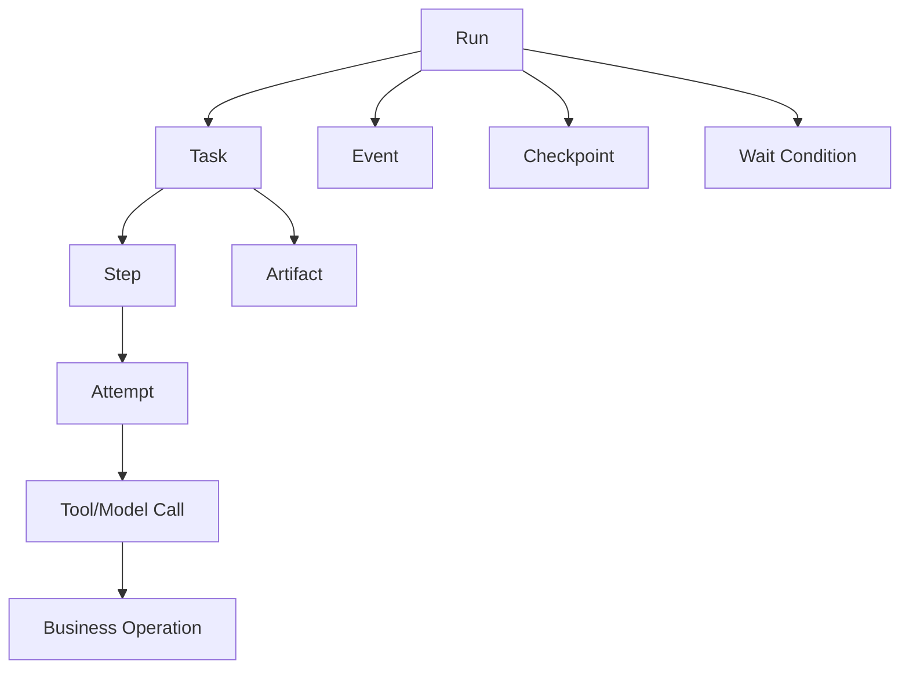
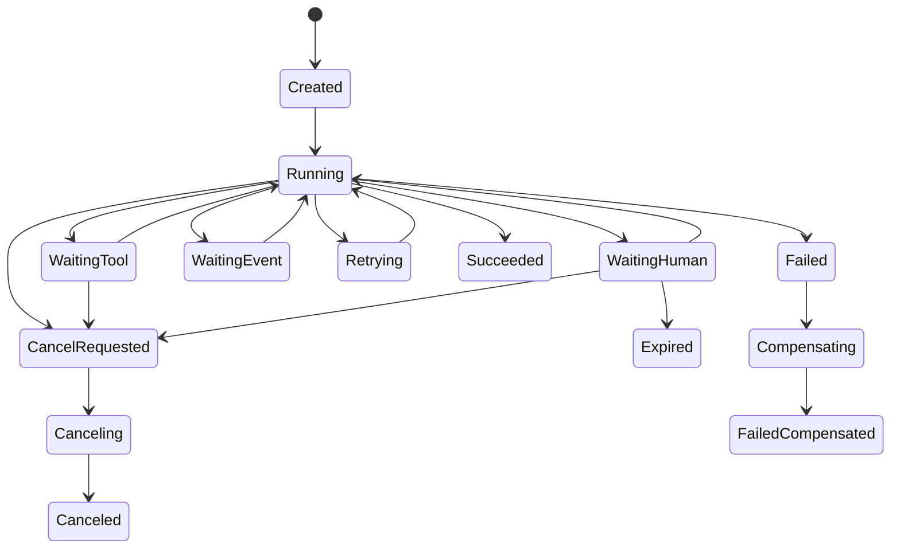
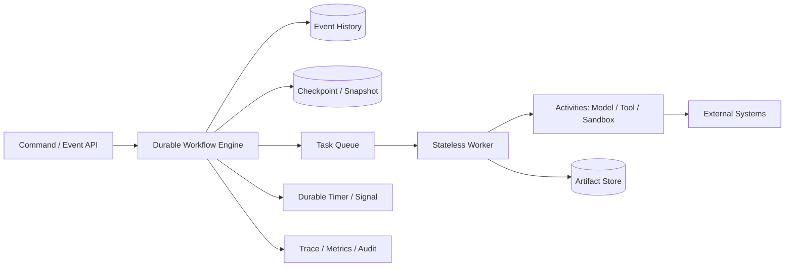
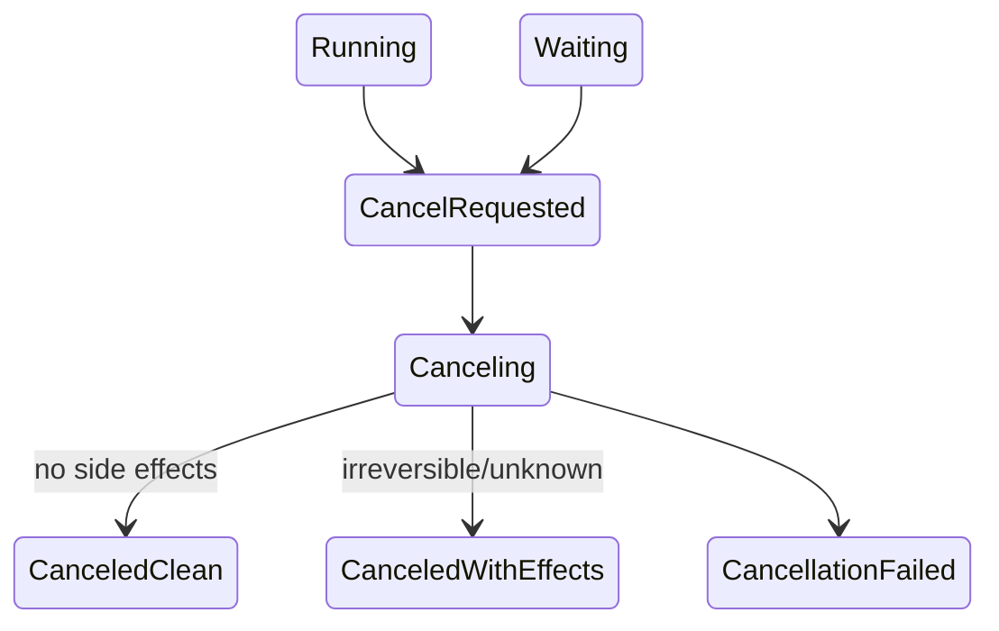

# 状态管理与持久化工作流

> 导航：[总目录](../README.md) | [数据平面](README.md) | [Agent 架构](../01-控制平面/01-Agent架构.md) | [任务规划](../01-控制平面/02-任务规划与推理.md) | [多 Agent](../01-控制平面/05-多Agent协作.md) | [上下文工程](01-上下文工程.md) | [记忆系统](02-记忆系统.md) | [运行时](../03-执行平面/04-Agent运行时与平台工程.md)

> 调研基线：2026-08-06。Durable Workflow、Agent Framework 和状态持久化 API 持续演进，落地时应以选定运行时的确定性、版本和一致性约束为准。

---

## 0. 本章怎么读

状态管理回答：任务现在真实进行到哪里、什么已经发生、下一步为什么可执行、崩溃后从哪里继续、重放会不会重复副作用，以及代码升级后旧任务如何安全恢复。聊天历史和模型上下文都不是可靠状态数据库。

推荐阅读顺序：

1. 第 1～4 节建立状态分层、运行时对象和状态机。
2. 第 5～11 节掌握 Checkpoint、Event、幂等、副作用和并发。
3. 第 12～17 节处理等待、取消、Replay、版本、恢复和存储架构。
4. 第 18～24 节完成评测、案例、检查表和面试准备。

### 0.1 最需要掌握的十二个重点

| 优先级 | 重点 | 掌握标准 |
|---|---|---|
| P0 | Source of Truth | Agent State 不覆盖订单、支付、代码等业务真值 |
| P0 | 状态机 | 每个转换有 Guard、Actor、Version、Event 和失败语义 |
| P0 | Operation ID | 重试保持业务意图 ID 稳定，Attempt/ToolCall ID 可以变化 |
| P0 | Crash Window | 能处理副作用成功但本地未落盘，以及落盘但消息未发送 |
| P0 | Durable Execution | 进程退出、等待数天和 Worker 迁移后仍能继续 |
| P1 | Checkpoint/Event | 快照加速恢复，事件用于事实、审计和派生投影 |
| P1 | Idempotency | 至少一次投递和重放不会重复业务效果 |
| P1 | Concurrency | 单 Owner、CAS、Lease 和 Fencing 防止双写 |
| P1 | Wait/Signal | Human、Timer、Webhook 等等待不占用 Worker |
| P1 | Cancellation | 取消是持久状态和传播协议，不是 Kill Process |
| P1 | Versioning | Schema、Workflow、Prompt、Tool、Policy 和模型版本可恢复 |
| P2 | Recovery | 有 Reconcile、Compensation、DR 演练和恢复指标 |

### 0.2 核心结论

1. **状态是执行真值，不应从对话重新推断。**
2. **工具调用成功不等于业务状态已提交，状态写入成功也不等于外部副作用完成。**
3. **幂等的核心是稳定业务 Operation ID，不是每次重试生成新 UUID。**
4. **Exactly-once 通常是由至少一次传输 + 幂等 + 状态约束实现的业务效果。**
5. **Checkpoint 不是数据库备份。** 它是可恢复执行所需的版本化快照。
6. **Event Sourcing 不等于保存所有日志。** Event 是已发生的领域/工作流事实。
7. **Replay 必须隔离非确定性和副作用。** 时间、随机数和外部结果由运行时记录或封装为 Activity/Task。
8. **单任务单 Owner 是默认并发模型。** 多写者需要分区或显式 Merge。
9. **等待不应占住线程、容器或模型会话。** 持久化等待条件，由事件唤醒。
10. **发布新代码前必须决定旧 Run 是继续旧版本、兼容迁移、重启还是安全终止。**

---

## 1. 状态分层与边界

### 1.1 状态类型

| 状态 | 例子 | Source of Truth | 生命周期 |
|---|---|---|---|
| Conversation | Message、Thread、附件 | 会话存储 | 会话 |
| Run | Goal、总预算、状态、版本 | Agent Runtime | 端到端执行 |
| Task/Plan | Step、依赖、验收 | Workflow/Task Store | Run 内 |
| Agent Attempt | 当前节点、循环计数、局部输出 | Checkpoint | 一次尝试 |
| Tool Operation | Operation/Call ID、请求、结果 | Tool Gateway/业务系统 | 操作 |
| Domain | 订单、支付、工单、代码 | 业务系统/Git | 业务生命周期 |
| Artifact | 文件、报告、Patch、截图 | Artifact Store | 产物生命周期 |
| Memory | 偏好、事实、经验 | Memory Store | 跨任务 |
| Trace | Span、Token、错误、时间线 | Observability Store | 运营/审计 |

### 1.2 State、Context 和 Memory

- State：当前任务真实进度。
- Context：本次模型调用对 State 的一个选择性视图。
- Memory：未来任务可能复用的信息。

Context 可被重新构建，Memory 可被纠正/遗忘，State 必须支持一致状态转换和恢复。

### 1.3 业务真值

Agent State 只保存业务对象引用、版本和已观察值：

```yaml
domain_reference:
  type: "order"
  id: "order-88"
  observed_version: 14
  observed_status: "paid"
  observed_at: "2026-08-06T10:00:00+08:00"
```

执行写操作前应再次查询/校验业务版本，不能因为 Checkpoint 写着 `paid` 就假设永远如此。

### 1.4 大文件状态

Checkpoint 只保存：

- Artifact ID/URI。
- Digest/ETag/Version。
- 上传、解析、分片和索引状态。
- ACL/Scope。
- 派生 Artifact 血缘。

不保存大文件字节。具体读写见[工具调用与协议：大文件处理](../03-执行平面/01-工具调用与协议.md#5-agent-如何读大文件)。

---

## 2. 运行时对象模型

### 2.1 对象关系



### 2.2 ID 语义

| ID | 是否随重试变化 | 含义 |
|---|---:|---|
| `run_id` | 否 | 一次端到端目标执行 |
| `task_id` | 否 | 任务图中的工作单元 |
| `step_id` | 通常否 | 计划节点 |
| `attempt_id` | 是 | 某 Step 的一次尝试 |
| `tool_call_id` | 是 | 一次协议调用 |
| `operation_id` | 否 | 稳定业务意图，如“退 order-88 的 100 元” |
| `event_id` | 是 | 一条已发生事实 |
| `checkpoint_id` | 是 | 一次状态快照 |
| `artifact_id` | 按版本 | 一个产物/版本 |
| `trace_id` | Run/链路 | 观测关联 |

### 2.3 RunStateV4

```yaml
run_state_version: 4
run_id: "run-88"
tenant_id: "tenant-7"
principal_id: "user-42"
goal_contract_ref: "goal://run-88-v2"
status: "waiting"
status_reason: "human_approval"

plan:
  plan_id: "plan-19"
  plan_version: 7
  current_step_ids: ["step-refund-approval"]

budget:
  deadline: "2026-08-06T18:00:00+08:00"
  remaining_model_tokens: 82000
  remaining_tool_calls: 12
  remaining_cost_usd: 4.20

state_version: 71
last_event_id: "evt-9910"
latest_checkpoint_id: "cp-19"

waiting:
  condition_id: "wait-approval-88"
  type: "human_approval"
  expires_at: "2026-08-07T10:00:00+08:00"

artifacts:
  - artifact_id: "refund-analysis-v2"
    digest: "sha256:..."

version_vector:
  workflow: "refund-agent@5"
  state_schema: 4
  prompt: "p-91"
  model_policy: "mr-8"
  toolset: "tools-44"
  security_policy: "policy-18"

created_at: "2026-08-06T09:00:00+08:00"
updated_at: "2026-08-06T10:00:00+08:00"
```

### 2.4 StepState

```yaml
step_id: "step-refund"
task_id: "task-refund-order-88"
status: "waiting_approval"
dependencies: ["step-verify-order"]
owner: "agent:refund-executor@3"
expected_state_version: 71
input_refs: ["artifact://refund-analysis-v2"]
operation_ids: ["op-refund-order88-100cny"]
attempt_count: 1
max_attempts: 2
acceptance_criteria:
  - "refund operation confirmed by payment system"
result_ref: null
```

---

## 3. 状态机与转换契约

### 3.1 Run 状态机



### 3.2 StateTransition

```yaml
transition_id: "tr-991"
aggregate_type: "run"
aggregate_id: "run-88"
from_status: "waiting_human"
to_status: "running"
command: "ResumeAfterApproval"
guard:
  expected_state_version: 71
  required_event_type: "approval.granted"
  required_policy_version: "18"
actor:
  type: "workflow_runtime"
  id: "coordinator-7"
causation_event_id: "evt-approval-91"
occurred_at: "2026-08-06T10:05:00+08:00"
resulting_state_version: 72
```

### 3.3 Guard

Guard 应由确定性代码检查：

- 当前状态是否允许转换。
- Expected Version 是否匹配。
- Owner/Lease/Fencing 是否有效。
- 所需事件、输入、审批和权限是否存在。
- Deadline/Budget 是否足够。
- 副作用是否已 Reconcile。
- Schema/Workflow 版本是否兼容。

模型可以建议转换，不能直接跳过 Guard。

### 3.4 Terminal State

Terminal 不只 `success/failed`：

- `succeeded`
- `partial_succeeded`
- `failed`
- `failed_compensated`
- `canceled_clean`
- `canceled_with_effects`
- `expired`
- `security_blocked`

终态应带 Acceptance Coverage、未决副作用和可用 Artifact。

---

## 4. Durable Execution 参考架构



### 4.1 Durable 的含义

- Worker 进程可随时退出。
- Workflow 状态外置。
- Timer 和等待跨重启存在。
- Activity 结果被记录，Replay 不重复调用。
- 任务可迁移到其他 Worker。
- 至少一次投递下保持业务幂等。
- 可查询、暂停、取消和恢复。

### 4.2 Workflow 与 Activity

#### Workflow/Orchestrator Code

负责确定性控制：状态转换、分支、Timer、Retry Policy、Signal 和 Child Workflow。

#### Activity/Task

封装非确定性和副作用：模型调用、HTTP、数据库、文件、浏览器和代码执行。

Temporal 等 Durable Runtime 的核心约束之一是 Workflow Replay 的确定性；LangGraph 等框架则通过 Checkpoint、Task 和节点重放实现类似恢复目标，具体语义应按运行时核对。

### 4.3 Worker 无状态不等于系统无状态

Worker 可无本地持久状态，但 Run/Task/Operation/Event/Artifact 必须外置。模型上下文在恢复时由 State + Artifact + Context Compiler 重建。

---

## 5. Checkpoint 设计

### 5.1 Checkpoint 何时保存

- Run/Task 创建后。
- 关键状态转换后。
- 副作用调用前的 Intent 记录后。
- 副作用结果确认后。
- Human/Timer/External Event 等待前。
- Fan-out 前和 Join 后。
- 里程碑、暂停和版本迁移前。
- Context Compaction 后。

不是每个 Token 都保存，也不能只在任务结束保存。

### 5.2 CheckpointV4

```yaml
checkpoint_version: 4
checkpoint_id: "cp-19"
run_id: "run-88"
aggregate_state_version: 71
created_at: "2026-08-06T10:00:00+08:00"
reason: "before_human_wait"

workflow:
  workflow_type: "refund-agent"
  workflow_version: "5.2.0"
  node_id: "request-approval"
  next_nodes: ["execute-refund"]

state_ref: "stateblob://run-88/v71"
state_digest: "sha256:..."
event_cursor: "evt-9910"

pending:
  waits: ["wait-approval-88"]
  activities: []
  child_runs: []

operations:
  - operation_id: "op-refund-order88-100cny"
    status: "intent_recorded"

artifacts:
  - id: "refund-analysis-v2"
    digest: "sha256:..."

version_vector:
  state_schema: 4
  workflow: "5.2.0"
  prompt: "p-91"
  toolset: "44"
  policy: "18"

encryption_key_version: "dek-7"
retention_policy: "180d"
```

### 5.3 Full、Delta 与 Snapshot

| 方式 | 优势 | 风险 |
|---|---|---|
| Full Snapshot | 恢复简单 | 存储和写放大 |
| Delta Checkpoint | 写入小 | 恢复链长、丢一段难重建 |
| Event + Periodic Snapshot | 审计与恢复平衡 | 实现复杂 |

常用：事件持续追加，按事件数/时间/里程碑生成 Snapshot。

### 5.4 Checkpoint 一致性

Checkpoint 应原子关联：State Version、Event Cursor、Pending Operation、Artifact Digest 和 Version Vector。只保存内存对象的一部分会产生不可恢复的混合版本。

### 5.5 Checkpoint 安全

- 不存明文 Secret/Token。
- 敏感字段加密和最小化。
- Tenant/Run ACL。
- Digest 和防篡改。
- Retention/Deletion。
- 恢复访问审计。

---

## 6. Event、Command、Decision 和 Projection

### 6.1 四者区别

| 类型 | 示例 | 是否已发生事实 |
|---|---|---:|
| Command | `RequestRefund` | 否 |
| Policy Decision | `RefundAllowed` | 否，是授权判断 |
| Event | `RefundRequested` / `RefundCompleted` | 是 |
| Projection/State | `refund.status=completed` | 由事件派生的当前视图 |

### 6.2 EventV3

```yaml
event_version: 3
event_id: "evt-9911"
event_type: "run.waiting_for_approval"
aggregate_type: "run"
aggregate_id: "run-88"
aggregate_version: 71
occurred_at: "2026-08-06T10:00:00+08:00"
recorded_at: "2026-08-06T10:00:00.021+08:00"
actor:
  type: "workflow"
  id: "refund-agent@5.2.0"
causation_id: "cmd-request-approval-88"
correlation_id: "run-88"
payload:
  approval_request_id: "approval-91"
  expires_at: "2026-08-07T10:00:00+08:00"
schema_ref: "schema://RunWaitingForApprovalV3"
policy_decision_id: "pd-88"
```

### 6.3 Event Sourcing 适用场景

- 强审计和时间旅行。
- 多投影/订阅者。
- 长任务恢复和状态变化解释。
- 业务补偿、事故追溯。

成本：Schema 演进、Projection Lag、存储、PII 删除和 Replay 复杂度。并非所有 Agent 都需要完整 Event Sourcing。

### 6.4 Projection

事件写入后异步更新搜索、Dashboard 或读模型。关键控制决策不能盲信明显陈旧 Projection；应读取强一致 Aggregate 或检查 Version。

### 6.5 Replay 安全

Replay 只重建状态，不再次发送邮件、退款、执行代码或调用模型。副作用结果作为 History/Event 输入复用。

---

## 7. 幂等、Attempt 与崩溃窗口

### 7.1 稳定业务意图

```text
operation_id = hash(
    tenant,
    business_action,
    target_resource,
    normalized_effect,
    goal_version
)
```

例如退款金额/币种改变是新 Operation；只是网络重试仍是同一 Operation。

### 7.2 OperationState

```yaml
operation_id: "op-refund-order88-100cny"
operation_type: "payment.refund"
target: "order-88"
desired_effect:
  amount: 100.00
  currency: "CNY"
status: "unknown" # intent_recorded | dispatched | succeeded | failed | unknown | compensated
attempts:
  - attempt_id: "att-1"
    tool_call_id: "call-77"
    status: "timeout"
    started_at: "..."
provider_operation_ref: null
last_reconciled_at: null
```

### 7.3 典型崩溃窗口

#### A：Intent 未落盘就执行

崩溃后系统不知道是否应重试。修正：先记录稳定 Operation Intent。

#### B：外部成功，本地未记录

重试可能重复副作用。修正：幂等键 + 查询状态/Reconcile。

#### C：本地成功，完成消息未发送

下游一直等待。修正：Transactional Outbox。

#### D：完成消息重复投递

下游重复推进。修正：Inbox Dedup + State Version。

### 7.4 Idempotency Key

```yaml
idempotency:
  key: "tenant-7:refund:order-88:100.00:CNY:goal-v2"
  scope: "payment.refund"
  expires_at: "2026-09-06T00:00:00+08:00"
  request_digest: "sha256:..."
```

服务端应对相同 Key + 不同 Request Digest 报冲突，而不是静默复用旧结果。

### 7.5 幂等消费者

```python
def handle_message(msg, store):
    if store.inbox_seen(msg.message_id):
        return store.previous_result(msg.message_id)

    aggregate = store.load_for_update(msg.aggregate_id)
    if msg.expected_version != aggregate.version:
        return StaleVersion(aggregate.version)

    result = apply_transition(aggregate, msg)
    store.save(aggregate, result.events)
    store.mark_inbox_seen(msg.message_id)
    store.write_outbox(result.outgoing_messages)
    store.commit()
    return result
```

---

## 8. 副作用一致性、Outbox/Inbox 与 Reconcile

### 8.1 Transactional Outbox

同一数据库事务：

1. 更新本地 Aggregate。
2. 写入 Event/Outbox Message。
3. 提交。
4. Relay 至少一次发送。

接收方使用 Inbox Dedup。这样避免“状态提交但消息丢失”。

### 8.2 外部系统调用

无法与本地数据库同一事务时：

```text
Persist Intent
-> Dispatch with Idempotency Key
-> Receive/Timeout
-> Persist Result or Unknown
-> Reconcile external state
-> Verify desired effect
-> Commit Step Result
```

### 8.3 Reconcile

```yaml
reconciliation_request:
  operation_id: "op-refund-order88-100cny"
  provider: "payment-gateway-a"
  lookup_keys:
    idempotency_key: "..."
    order_id: "order-88"
  expected_effect:
    refunded_amount: 100.00
  reason: "client_timeout"
```

### 8.4 不支持幂等/查询的系统

- 串行闸门和人工确认。
- 业务唯一约束。
- 预授权/草稿后提交。
- 补偿操作。
- 风险过高时不自动执行。

模型不能猜测外部动作是否成功。

### 8.5 Saga/Compensation

```yaml
saga:
  saga_id: "saga-order-cancel-88"
  steps:
    - action: "cancel_inventory_reservation"
      compensation: "restore_inventory_reservation"
    - action: "refund_payment"
      compensation: null
    - action: "send_notification"
      compensation: "send_correction_notification"
```

Compensation 是语义补偿，不保证世界回到完全相同状态。已发送通知和外部转账可能不可真正撤销。

---

## 9. 并发、CAS、Lease 与 Fencing

### 9.1 默认单 Owner

- 一个 Run/Task 同时由一个 Coordinator/Worker 推进。
- 并行 Step 写独立分区。
- Join 节点合并结果。
- 共享业务资源由业务系统事务/版本控制。

### 9.2 Optimistic Concurrency

```sql
UPDATE run_state
SET state_blob = :new_state,
    version = version + 1
WHERE run_id = :run_id
  AND version = :expected_version;
```

更新 0 行表示冲突，必须 Reload/Reconcile，不能 Last-write-wins。

### 9.3 Lease

```yaml
lease:
  lease_id: "lease-88"
  aggregate_id: "task-91"
  holder: "worker-instance-7"
  expires_at: "2026-08-06T10:02:00+08:00"
  fencing_token: 1042
  heartbeat_interval_seconds: 30
```

### 9.4 Fencing Token

Lease 过期后旧 Worker 可能继续运行。下游写入只接受更大的 Fencing Token，阻止陈旧 Worker 覆盖新 Owner。

### 9.5 Lock 粒度

- Run 级：简单但阻塞并行。
- Task/Step 级：常用。
- Artifact/Business Entity 级：处理共享资源。
- Partition/Field 级：复杂，需明确合并。

不要在模型调用/人工等待期间持有数据库长事务锁。

### 9.6 Fan-out/Fan-in

并行子任务写独立 Task State 和 Artifact，Join 使用：

- Required/Optional/Quorum。
- Version/Digest。
- Merge/Conflict Policy。
- Deadline 和 Partial Completion。

详见[多 Agent 协作](../01-控制平面/05-多Agent协作.md)。

---

## 10. 消息、顺序、重复与事件时间

### 10.1 不追求全局总顺序

通常只需 Aggregate 内顺序和显式因果关系：

- `aggregate_version`
- `causation_id`
- `correlation_id`
- `occurred_at`
- `recorded_at`

### 10.2 乱序

- 旧 Version 更新拒绝或进入 Late Event。
- `completed` 与 `cancel_requested` 竞态按状态机裁决。
- Progress 事件可丢弃过期版本。
- 业务事实事件不能仅按到达时间覆盖。

### 10.3 Event Time 与 Processing Time

Webhook 可能晚到。需要区分事件实际发生时间和系统处理时间；涉及业务时态时不能只用 `received_at`。

### 10.4 Dead Letter

进入 DLQ 的消息必须带：原消息、错误分类、尝试次数、Schema/Consumer Version、下次动作和敏感数据策略。DLQ 不是永久坟场，需要告警、修复和 Replay 工具。

---

## 11. Retry、Repair、Replan、Reconcile 和 Compensate

| 动作 | 是否改变策略 | 适合 |
|---|---:|---|
| Retry | 否 | 暂时网络/限流错误 |
| Repair | 局部 | 参数、格式、当前 Step 错误 |
| Replan | 是 | 前提/路径/能力变化 |
| Reconcile | 不一定 | 外部效果未知、状态分歧 |
| Compensate | 反向业务动作 | 已发生副作用需语义补偿 |

### 11.1 Retry Policy

```yaml
retry_policy:
  max_attempts: 4
  initial_interval_ms: 500
  backoff_coefficient: 2.0
  max_interval_ms: 10000
  jitter: "full"
  non_retryable_errors:
    - "VALIDATION_ERROR"
    - "PERMISSION_DENIED"
    - "POLICY_BLOCKED"
  total_deadline_ms: 30000
```

### 11.2 多层重试放大

Gateway、Workflow、Agent 和 Tool Client 同时重试会造成指数请求。应指定主要重试层并传播 Attempt Budget。

### 11.3 Retry 前检查

- 错误是否暂时。
- Operation 是否有副作用。
- 结果是否未知。
- 剩余 Deadline 是否够下一次尝试和验证。
- Circuit 是否打开。
- 是否重复同一无进展动作。

---

## 12. Durable Timer、Signal、Human Wait 与 Webhook

### 12.1 等待不是占住 Worker

Agent 等待审批、邮件、Webhook、远程任务或未来时间时，应：

1. 持久化 Wait Condition。
2. 保存 Checkpoint。
3. 释放 Worker/沙箱/模型资源。
4. 由 Timer/Signal/Event 唤醒。
5. 唤醒后重新校验状态、权限和版本。

### 12.2 WaitCondition

```yaml
wait_condition:
  condition_id: "wait-approval-88"
  run_id: "run-88"
  type: "human_approval"
  correlation_key: "approval-request-91"
  expected_event_types: ["approval.granted", "approval.rejected"]
  created_at: "2026-08-06T10:00:00+08:00"
  expires_at: "2026-08-07T10:00:00+08:00"
  on_timeout: "fail_or_escalate"
  state_version_at_wait: 71
  resume_node: "execute-refund"
  status: "waiting"
```

### 12.3 Signal 去重

审批/Webhook 可能重复。使用 Signal/Event ID 和状态版本去重；相同审批 ID 的第二次 `granted` 不得重复推进副作用。

### 12.4 Early Signal

Signal 可能在 Workflow 开始等待前到达。应写入持久 Event/Inbox，创建 Wait 时查询已存在匹配事件，避免丢失。

### 12.5 Timer

Durable Timer 由运行时持久化，不依赖进程内 `sleep`。时区、夏令时、绝对/相对时间和业务日历必须明确。

### 12.6 Human Approval

审批结果至少包含：审批人、身份、Scope、决策、修改后的参数、有效期和审计引用。模型不能把自然语言“看起来同意”当正式审批。

---

## 13. Pause、Resume 与 Cancellation

### 13.1 Pause 与 Wait

- Wait：工作流主动等待已知条件。
- Pause：运营/用户要求停止推进，等待显式 Resume。
- Suspend：平台因容量、故障或策略冻结。

三者状态和恢复权限不同。

### 13.2 取消状态机



### 13.3 取消传播

- 标记 Root Run `cancel_requested`。
- 停止调度新 Step。
- 向 Child Run/Remote Task/Tool Operation 传播。
- 撤销 Lease 和短期凭据。
- 查询进行中副作用状态。
- 对可补偿动作执行 Saga。
- 生成取消报告和未决清单。

### 13.4 Cancellation Token

进程内 Token 只是一种通知机制，持久状态才是真值。Worker 重启后必须读取 Run Cancel State。

### 13.5 Resume

Resume 前：

- 读取最新业务状态。
- 校验等待事件和权限。
- 检查版本兼容与 Artifact。
- Reconcile 进行中 Operation。
- 重建 Context。
- 重新计算 Deadline/Budget。

---

## 14. Replay、确定性与非确定性隔离

### 14.1 为什么 Replay 要确定

工作流重放历史时，相同事件序列应产生相同控制决策。否则恢复可能走到不同节点并重复/遗漏副作用。

### 14.2 常见非确定性

- 当前时间。
- 随机数/UUID。
- 无序 Map/Set 迭代。
- 直接网络/数据库调用。
- 模型输出。
- 动态读取配置/Feature Flag。
- 并发竞态。
- 依赖库行为变化。

### 14.3 隔离方式

- 时间、随机值由运行时 API 记录。
- 外部调用封装 Activity/Task，结果写 History。
- 模型调用视为 Activity，Replay 使用已记录结果。
- Feature Flag/Policy 结果记录版本。
- 并发结果按事件顺序/确定 Join 处理。
- Workflow Code 版本化。

### 14.4 Replay 与 Re-execution

- Replay：复用历史结果重建状态，不执行副作用。
- Re-execution：创建新 Run/Attempt，可能重新调用模型和工具。

调试“如果换 Prompt 会怎样”应创建 Fork/Time-travel 分支，而不是修改原 Run 历史。

### 14.5 Time Travel/Fork

```yaml
fork_request:
  source_run_id: "run-88"
  source_checkpoint_id: "cp-19"
  mode: "simulation"
  overrides:
    prompt_version: "p-92-candidate"
    model_policy: "mr-9-shadow"
  side_effect_policy: "disabled"
  new_run_id: "run-88-fork-1"
```

Fork 必须默认禁用真实副作用，使用 Sandbox/Mock/Read-only。

---

## 15. Schema、Workflow 与代码版本迁移

### 15.1 Version Vector

恢复需要的不只是 State Schema：

```yaml
version_vector:
  workflow_code: "refund-agent@5.2.0"
  state_schema: 4
  event_schema: 3
  prompt: "p-91"
  model_policy: "mr-8"
  tool_contracts: "tools-44"
  security_policy: "policy-18"
  context_builder: "ctx-5.3"
  artifact_schema: "artifact-7"
```

### 15.2 长任务发布策略

| 策略 | 适合 | 风险 |
|---|---|---|
| Pin Old Version | 任务较短、旧环境可保留 | 运维多版本 |
| Backward-compatible Code | 增量升级 | 兼容代码复杂 |
| Explicit Migration | 状态结构变化 | 迁移失败/不可逆 |
| Restart from Safe Milestone | 可重新执行且副作用可控 | 重算成本 |
| Graceful Termination | 不安全/无法兼容 | 部分任务失败 |

### 15.3 Upcaster

旧 Event 读取时转换为新内存结构：

```python
def upcast_event(event):
    if event.type == "RefundRequested" and event.schema_version == 1:
        return {
            **event,
            "schema_version": 2,
            "payload": {
                **event.payload,
                "currency": event.payload.get("currency", "CNY"),
            },
        }
    return event
```

默认值必须有领域依据，不能随意猜。

### 15.4 Migration Record

```yaml
migration:
  migration_id: "mig-run88-v4-v5"
  run_id: "run-88"
  from_state_schema: 4
  to_state_schema: 5
  from_workflow: "5.2.0"
  to_workflow: "5.3.0"
  precondition_check: "passed"
  backup_checkpoint_id: "cp-19"
  result_checkpoint_id: "cp-20"
  status: "completed"
```

### 15.5 Prompt/Tool 升级

即使 State Schema 不变，Prompt、Tool Error 和输出 Schema 变化也可能破坏恢复。长 Run 应 Pin 或显式记录切换点，并重新验证当前 Artifact/Plan。

### 15.6 Migration 测试

- 历史 Checkpoint 样本库。
- 历史 Event Replay。
- 中间等待/副作用未知状态。
- 多版本 Child Run。
- 回滚/重复迁移幂等。
- 删除/敏感字段处理。

---

## 16. 故障恢复、灾备与一致性检查

### 16.1 恢复分类

| 故障 | 恢复 |
|---|---|
| Worker Crash | Task 重新投递，读取 Checkpoint |
| Coordinator Crash | Leader Failover + 状态外置 |
| State DB 短暂不可用 | Backpressure/Retry，不执行未记录副作用 |
| Message Queue 重复 | Inbox Dedup |
| Artifact Store 不可用 | 等待/降级，不丢引用 |
| 外部结果未知 | Reconcile Queue |
| Region 故障 | DR/Failover，检查 RPO/RTO |
| 数据损坏 | Snapshot + Event 重建/备份恢复 |

### 16.2 恢复算法

```python
def recover(run_id):
    run = load_latest_consistent_snapshot(run_id)
    events = load_events_after(run.event_cursor)
    run = replay(run, events)

    verify_version_compatibility(run.version_vector)
    verify_artifact_digests(run.artifacts)
    acquire_leader_or_task_lease(run)

    for operation in run.pending_operations:
        reconcile(operation)

    refresh_domain_state(run.domain_refs)
    rebuild_context(run)
    schedule_ready_steps(run)
```

### 16.3 RPO/RTO

- RPO：最多可丢多少状态/事件。
- RTO：多久恢复服务和长任务。

Agent 平台还应定义：恢复后能否继续、是否只读、是否需要用户确认、外部副作用如何对账。

### 16.4 备份与恢复测试

- 状态 DB、Event、Artifact Metadata、Encryption Key Metadata。
- 恢复到隔离环境。
- 验证 Event Cursor、Digest、ACL 和 Tombstone。
- 不在恢复演练中执行真实副作用。
- 测量大规模 Active Run 恢复时间。

### 16.5 一致性扫描

定期检查：

- Run 指向不存在的 Checkpoint/Artifact。
- Pending Operation 已在外部成功但本地 Unknown。
- 过期 Lease 仍写入。
- Wait 已到期但未调度。
- Terminal Run 仍有 Active Child/Operation。
- Projection Version 落后。
- Outbox 长时间未发送/DLQ 未处理。

---

## 17. 存储架构、多租户与容量

### 17.1 存储分工

| 存储 | 内容 |
|---|---|
| Relational/KV | Run/Task/Lease/Wait/Operation 当前状态 |
| Event Log | 追加事实和 Outbox |
| Object Store | Checkpoint Blob、Artifact、大结果 |
| Search/Analytics | 运营查询和 Trace 投影 |
| Secret/KMS | 凭据引用、加密密钥 |

### 17.2 热冷分层

- Active Run：低延迟热状态。
- Completed Run：压缩 Snapshot + Event 冷存。
- 大 Tool/Model Payload：Artifact/Trace Store。
- 运营聚合：异步 Warehouse。

### 17.3 多租户隔离

- Tenant 参与主键/分区和 ACL。
- 每租户配额、并发、存储和保留期。
- Encryption Key/Region 根据策略隔离。
- Cache、Queue 和 DLQ 防跨租户。
- 管理查询和恢复操作审计。

### 17.4 热点

Supervisor Run、全局计数器、共享 Blackboard 可能形成热点。使用 Task 分区、Append-only Event、异步 Projection 和局部计数；不要让所有 Worker 更新同一大 JSON Blob。

### 17.5 容量

估算：Active Run 数、平均 State/Checkpoint 大小、Checkpoint 频率、Event Rate、Artifact 元数据、Retention、Replication 和 Replay Cost。完整 Payload 外置可显著降低状态 DB 压力。

---

## 18. 可观测性与评测

### 18.1 State Transition Span

```yaml
span_name: "workflow.state_transition"
attributes:
  run.id: "run-88"
  task.id: "task-91"
  from_state: "waiting_human"
  to_state: "running"
  state.version.before: 71
  state.version.after: 72
  event.id: "evt-approval-91"
  checkpoint.id: "cp-20"
  workflow.version: "5.2.0"
  lease.fencing_token: 1042
  transition.latency_ms: 18
```

### 18.2 关键指标

- Recovery Success Rate/Time。
- Checkpoint Write/Read Failure。
- Replay Duration/Event Count。
- Duplicate Side-effect Rate，目标接近零。
- Unknown Outcome Count/Age。
- CAS Conflict、Lease Expiry、Stale Write。
- Outbox Lag、Inbox Duplicate、DLQ Age。
- Waiting/Expired Run 数和唤醒延迟。
- Cancellation Propagation Time。
- Compensation Success/Failure。
- Cross-version Recovery Rate。
- RPO/RTO 演练结果。

### 18.3 StateEvalCase

```yaml
case_id: "state-refund-crash-001"
workflow_version: "5.2.0"
initial_state_ref: "fixture://refund-before-call"
fault:
  inject_at: "after_external_success_before_local_commit"
expected:
  external_effect_count: 1
  final_state: "succeeded"
  reconciliation_required: true
  duplicate_side_effect: false
  audit_events:
    - "operation.intent_recorded"
    - "operation.reconciled_succeeded"
```

### 18.4 故障注入矩阵

- 状态写前/后崩溃。
- 副作用前/后崩溃。
- Outbox 发送前/后崩溃。
- Message 重复、乱序、延迟和丢失。
- Lease 过期和旧 Worker 晚到。
- Signal 提前、重复和超时。
- Cancel 与 Complete 竞态。
- Schema/Workflow 升级中恢复。
- Artifact/Checkpoint 损坏。
- Region Failover。

### 18.5 验证层级

1. 单元：状态转换和 Guard。
2. 组件：Repository、Outbox、Inbox、Lease。
3. Replay：历史事件和 Checkpoint。
4. Fault Injection：崩溃窗口。
5. End-to-end：真实 Sandbox/业务测试环境。
6. DR：备份、跨区和批量 Active Run 恢复。

---

## 19. 三个完整案例

### 19.1 退款 Agent：副作用结果未知

1. 写入 `RefundIntentRecorded(operation_id)`。
2. 调用支付网关，传同一 Idempotency Key。
3. 客户端超时，状态标为 `unknown`，不重新生成 Operation ID。
4. Reconcile 查询支付网关。
5. 若已退款，写 `RefundReconciledSucceeded`。
6. 验证订单/支付状态并完成 Step。
7. 若无法查询，进入人工对账队列。

该案例的核心不是 Retry，而是稳定 Operation 和 Unknown Outcome 状态。

### 19.2 跨天研究 Agent

- Plan、Task、Evidence Artifact 和预算外置。
- 每个里程碑生成 Checkpoint/Resume Package。
- 等待数据源时使用 Durable Timer/Event。
- Worker 重启后按 Event Cursor 恢复。
- 新资料到达只唤醒受影响 Task。
- Prompt/模型升级时 Pin 当前 Run 或在里程碑迁移。
- 最终可追溯每个 Claim 的 Artifact 和版本。

### 19.3 多 Worker 代码修改

- 每个 Task 独立 Worktree/Artifact，状态分区写。
- Coordinator 用 Lease/Fencing 分配 Worker。
- Worker 输出 Patch + Base Commit + Test Result。
- Join 使用 CAS 更新全局 Plan。
- 旧 Lease Worker 晚到 Patch 只作为候选，不覆盖当前 Owner。
- 合并后在干净环境运行全量测试。
- Cancel 时保留 Patch Artifact，停止进一步执行。

---

## 20. 常见反模式与修正

| 反模式 | 后果 | 修正 |
|---|---|---|
| 聊天历史当状态库 | 不可并发/恢复 | 结构化 State Store |
| 只保存最终成功/失败 | 无法恢复和归因 | Event + Checkpoint |
| 副作用后才生成幂等键 | 重试重复效果 | 先稳定 Operation Intent |
| 工具超时直接换 Agent 重试 | 重复扣款/发送 | Reconcile |
| Replay 再调所有工具 | 重复副作用 | Activity Result History |
| Last-write-wins | 并发覆盖 | CAS/Lease/Fencing |
| 等待审批占住 Worker | 资源浪费/崩溃丢失 | Durable Wait |
| Cancel 等于 Kill | 未决副作用和审计丢失 | 状态机 + 传播 |
| Checkpoint 存大文件 | 状态库膨胀 | Artifact 引用 |
| 状态无版本 | 发布后无法恢复 | Version Vector |
| 所有层都重试 | 请求风暴 | 单一主重试层/预算 |
| 备份从未恢复演练 | 灾难时不可用 | DR Drill |

---

## 21. 生产落地检查表

### 21.1 对象与状态机

- [ ] Run/Task/Step/Attempt/Operation/Event/Checkpoint ID 语义明确。
- [ ] Domain State 与 Agent State 分离。
- [ ] 每个转换有 Guard、Actor、Version 和 Event。
- [ ] Terminal State 包含部分成功、取消效果和补偿。

### 21.2 持久化与副作用

- [ ] 关键节点和等待前后保存 Checkpoint。
- [ ] Operation Intent 在副作用前持久化。
- [ ] 外部服务支持幂等键或有 Reconcile/人工路径。
- [ ] Outbox/Inbox 防消息丢失和重复。
- [ ] Artifact 只存引用和 Digest。

### 21.3 并发与消息

- [ ] 默认单 Owner，Lease/Fencing 防双主。
- [ ] 状态更新使用 Expected Version/CAS。
- [ ] Aggregate 内顺序和因果 ID 明确。
- [ ] Late/Out-of-order Event 有确定处理。
- [ ] DLQ 有告警和 Replay 流程。

### 21.4 等待、取消和恢复

- [ ] Timer/Signal/Human Wait 持久化且不占 Worker。
- [ ] Early/Duplicate Signal 可处理。
- [ ] Cancel 传播到 Child/Tool/Remote Task。
- [ ] Resume 前刷新业务状态和权限。
- [ ] Unknown Outcome 有 Aging/对账。

### 21.5 版本和灾备

- [ ] State/Event/Workflow/Prompt/Tool/Policy 版本完整。
- [ ] 历史 Checkpoint 和 Event 有迁移测试。
- [ ] 新版本明确处理 Active Run。
- [ ] Replay 不执行真实副作用。
- [ ] RPO/RTO、备份恢复和跨区演练完成。

### 21.6 评测与观测

- [ ] 崩溃窗口、重复、乱序、Lease 和 Cancel 进入回归集。
- [ ] Duplicate Side-effect、Recovery、DLQ、Unknown 可监控。
- [ ] 可从业务结果追溯到 Operation/Event/Policy/Version。
- [ ] 有一致性扫描和异常 Run 修复工具。

---

## 22. 实践任务

### 22.1 入门：可暂停恢复的 State Machine

- 实现 Run/Step 状态机和 CAS。
- 在 Human Approval 前保存 Checkpoint。
- 重启进程后通过 Signal 恢复。
- 对重复 Signal 幂等。

### 22.2 进阶：副作用崩溃窗口

- 实现稳定 Operation ID。
- 在外部成功、本地提交前注入崩溃。
- 使用查询/Reconcile 恢复，验证效果只发生一次。
- 加 Outbox/Inbox。

### 22.3 高阶：版本迁移

- 保存三种历史 State/Event Schema。
- 实现 Upcaster/Migration。
- 在 Waiting、Unknown Operation 和 Fan-out 状态恢复。
- 验证迁移幂等和回滚。

### 22.4 综合：灾备演练

- 模拟 State DB/Queue/Artifact/Region 故障。
- 恢复一批 Active Run。
- 检查 RPO/RTO、权限、Tombstone 和未决副作用。

---

## 23. 面试高频题与答题框架

### 23.1 基础概念

1. **Agent State 和 Memory 有什么区别？**
   答题重点：当前执行真值 vs 跨任务可复用信息。
2. **为什么聊天历史不能作为状态？**
   答题重点：非结构化、不可并发控制、不可可靠恢复。
3. **Checkpoint 和 Event Sourcing 有何区别？**
   答题重点：快照恢复 vs 事实历史/审计/投影，常组合。
4. **Durable Execution 解决什么？**
   答题重点：进程退出、长等待、重放、任务迁移和可靠恢复。
5. **Workflow 与 Activity 为什么分开？**
   答题重点：确定性控制 vs 非确定性/副作用。
6. **Command、Decision、Event、State 有何区别？**
   答题重点：请求、策略判断、已发生事实、当前投影。

### 23.2 幂等与副作用

7. **Tool Call ID 和 Operation ID 为什么分开？**
   答题重点：尝试会变化，业务意图需跨重试稳定。
8. **如何避免重复扣款/退款？**
   答题重点：Intent 先落盘、幂等键、查询/Reconcile、唯一约束。
9. **写操作超时能否直接重试？**
   答题重点：结果未知先对账；明确未执行才同 Key 重试。
10. **Exactly-once 是否真实存在？**
    答题重点：端到端通常靠至少一次 + 幂等 + 事务/状态约束实现业务一次效果。
11. **Transactional Outbox 解决什么？**
    答题重点：数据库提交与消息发送原子性缺口。
12. **Inbox Dedup 如何实现？**
    答题重点：Message/Operation ID 唯一约束，与状态转换同事务。
13. **Saga 和数据库事务如何选？**
    答题重点：跨服务长事务用 Saga，补偿是语义动作非完全回滚。

### 23.3 并发、消息与等待

14. **并行 Agent 如何更新共享状态？**
    答题重点：独立分区/Artifact，单 Owner Join，CAS/Lease。
15. **Lease 和 Lock 有什么区别？**
    答题重点：Lease 有过期和续租；仍需 Fencing 防旧持有者。
16. **Fencing Token 解决什么？**
    答题重点：拒绝过期 Worker 的陈旧写。
17. **消息重复、乱序和延迟怎么处理？**
    答题重点：Inbox、Aggregate Version、因果 ID、Late Event 规则。
18. **为什么不追求全局总顺序？**
    答题重点：成本高，通常 Aggregate 内顺序 + 依赖足够。
19. **等待用户审批为什么不能 sleep？**
    答题重点：占资源且崩溃丢失；Durable Wait/Timer/Signal。
20. **Signal 比 Wait 早到怎么办？**
    答题重点：先持久化 Inbox/Event，创建 Wait 时匹配。

### 23.4 取消、恢复与版本

21. **为什么取消也需要状态机？**
    答题重点：子任务传播、副作用已发生/未知、补偿和审计。
22. **Pause、Wait、Suspend 有什么区别？**
    答题重点：业务条件等待、用户暂停、平台冻结。
23. **Worker 崩溃后如何恢复？**
    答题重点：Snapshot + Event、Lease、Pending Operation Reconcile、Context 重建。
24. **Replay 为什么不能重新调用模型和工具？**
    答题重点：非确定性和副作用；复用历史 Activity 结果。
25. **长任务如何跨代码版本恢复？**
    答题重点：Pin、兼容、Migration、Milestone Restart 或终止。
26. **State Schema 迁移如何测试？**
    答题重点：历史 Checkpoint/Event、等待/Unknown/Fan-out、幂等和回滚。
27. **Prompt/Tool 升级为什么也是状态兼容问题？**
    答题重点：输出/Error/行为契约变化会破坏下一步。
28. **RPO 和 RTO 在 Agent 平台如何定义？**
    答题重点：可丢状态量和恢复时间，并包含未决副作用/Active Run。

### 23.5 评测与项目深挖

29. **如何测试崩溃恢复？**
    答题重点：在副作用和提交前后注入故障，验证最终状态和效果次数。
30. **Duplicate Side-effect Rate 为什么关键？**
    答题重点：直接反映幂等和恢复正确性，高风险应接近零。
31. **如何排查卡死 Run？**
    答题重点：状态、Wait、Lease、Pending Operation、Outbox/DLQ、Deadline。
32. **Checkpoint 多久保存一次？**
    答题重点：按状态转换、副作用、等待、里程碑和恢复成本，不是固定答案。
33. **Event Store 越完整越好吗？**
    答题重点：审计价值 vs 存储、PII、Schema 和 Replay 成本。
34. **状态数据库成为热点怎么办？**
    答题重点：Task 分区、Event append、Artifact 外置、异步 Projection。
35. **如何证明 Durable Runtime 值得引入？**
    答题重点：长任务/等待/副作用需求，对比自研复杂度、恢复率和运维成本。
36. **讲一次状态一致性事故怎么答？**
    答题重点：崩溃窗口、业务影响、Operation/Event 证据、修复和故障回归。
37. **如何做 Active Run 批量版本迁移？**
    答题重点：分类、Canary、Checkpoint、兼容验证、限速、回滚和指标。
38. **灾备恢复后最先检查什么？**
    答题重点：Leader/Fencing、Operation、Event Cursor、Artifact、权限和 Tombstone。

更多社区问题见[社区面经与真题](../05-实践路线/06-社区面经与真题.md#7-状态后端工程与线上可靠性)。

---

## 24. 资料与项目

### 24.1 Durable Execution

- [Temporal Documentation](https://docs.temporal.io/)：Workflow、Activity、Event History、Timer、Signal、Retry 和版本。
- [Temporal Durable Execution](https://temporal.io/how-it-works)：Durable Execution 核心机制。
- [LangGraph Persistence](https://docs.langchain.com/oss/python/langgraph/persistence)：Thread、Checkpoint、State History 和 Store。
- [LangGraph Durable Execution](https://docs.langchain.com/oss/python/langgraph/durable-execution)：确定性、幂等 Task 和恢复。
- [LangGraph Interrupts](https://docs.langchain.com/oss/python/langgraph/interrupts)：持久化中断和 Human-in-the-loop。
- [Microsoft Agent Framework Workflows](https://learn.microsoft.com/en-us/agent-framework/workflows/)：Executor、Edge、Checkpoint 和 Workflow 状态。

### 24.2 分布式系统模式

- [Event Sourcing](https://martinfowler.com/eaaDev/EventSourcing.html)：事件作为状态变化事实的经典说明。
- [Transactional Outbox](https://microservices.io/patterns/data/transactional-outbox.html)：数据库与消息发送一致性。
- [Idempotent Consumer](https://microservices.io/post/microservices/patterns/2020/10/16/idempotent-consumer.html)：至少一次消息消费去重。
- [Saga Pattern](https://microservices.io/patterns/data/saga.html)：跨服务长事务和补偿。

### 24.3 可参考项目

- [Temporal](https://github.com/temporalio/temporal)
- [LangGraph](https://github.com/langchain-ai/langgraph)
- [Microsoft Agent Framework](https://github.com/microsoft/agent-framework)
- [Dapr Workflows](https://docs.dapr.io/developing-applications/building-blocks/workflow/workflow-overview/)

阅读运行时时重点检查：状态保存粒度、Activity 重试语义、Replay 是否确定、Signal 是否持久、版本迁移方式、幂等是否由谁负责，以及框架的“Checkpoint”能否覆盖真实业务副作用。

---

## 25. 本章与其他模块的边界

| 问题 | 本章回答 | 深入模块 |
|---|---|---|
| 任务如何持久推进、恢复和一致 | State、Event、Checkpoint、Operation、版本 | 本章 |
| Goal、Run、Task、Step 总体结构 | 使用运行时对象 | [Agent 架构](../01-控制平面/01-Agent架构.md) |
| Plan 如何生成、Repair/Replan | 只持久化 Plan/Step 和转换 | [任务规划](../01-控制平面/02-任务规划与推理.md) |
| 多 Agent Owner、消息和 Join | 提供 CAS/Lease/Artifact 基础 | [多 Agent 协作](../01-控制平面/05-多Agent协作.md) |
| 当前模型看到哪些 State | 提供版本化 State Slice | [上下文工程](01-上下文工程.md) |
| 跨任务经验如何保存 | Working State 不等于长期记忆 | [记忆系统](02-记忆系统.md) |
| Tool Schema、幂等 API 和大文件 | 定义 Operation/Artifact 接口 | [工具调用与协议](../03-执行平面/01-工具调用与协议.md) |
| Queue、Worker、伸缩和平台多租户 | 定义 Durable Runtime 语义 | [Agent 运行时与平台工程](../03-执行平面/04-Agent运行时与平台工程.md) |
| Trace、指标和事故调试 | 定义 State/Event/Operation 属性 | [可观测性](../04-保障平面/02-可观测性.md) |

最终判断标准：成熟的状态系统能在任意 Worker/Coordinator 崩溃、消息重复乱序、外部结果未知、长时间等待和代码升级的情况下，恢复到可解释的一致状态，避免重复副作用，并明确说明哪些事实已发生、哪些仍待确认、哪些需要补偿或人工处理。
