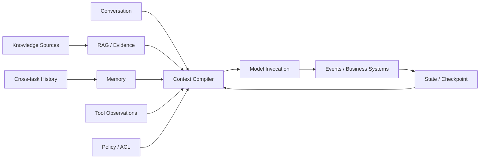

# 数据平面

> [返回总目录](../README.md)

数据平面负责把外部知识、历史信息、当前任务真值和环境观察转换为模型每一步能够安全消费的数据，同时保证这些数据可追溯、可更新、可删除、可恢复。



## 四类核心对象

| 模块 | 核心问题 | 生命周期 | Source of Truth |
|---|---|---|---|
| Context | 这一轮模型应该看到什么？ | 单次调用 | Context Manifest |
| RAG | 当前问题需要什么外部证据？ | 按需检索 | Knowledge Source/Index |
| Memory | 哪些历史信息未来可能复用？ | 跨调用/任务 | Memory Store |
| State | 任务现在真实进行到哪里？ | Run/长任务 | Workflow/State Store |

## 关键边界

```text
State != Conversation History
Memory != Vector Database
RAG != Top-k Similarity Search
Context != Full History
```

1. State 是任务执行真值，不能从聊天临时推断。
2. Memory 是经过写入、冲突、遗忘和隐私治理的跨任务信息。
3. RAG 提供当前问题需要的外部证据，并管理来源、版本、ACL 和引用。
4. Context 是一次模型调用的编译产物，只选择当前 Step 所需的 State、Evidence、Memory 和 Tool。
5. 业务订单、支付、代码和审批仍由各自业务系统作为 Source of Truth。

## 模块

1. [上下文工程](01-上下文工程.md)：Context Item/Manifest、信任与指令权限、预算、选择、排序、压缩、工具/大文件上下文、缓存安全和长任务恢复。
2. [记忆系统](02-记忆系统.md)：Episodic/Semantic/Procedural/Prospective Memory、写入门禁、时态冲突、检索、Consolidation、遗忘、Consent 和删除。
3. [RAG 与知识工程](03-RAG与知识工程.md)：知识源、解析/OCR、Chunk、Dense/Sparse/Hybrid、Rerank、Agentic/GraphRAG、证据、ACL、新鲜度和评测。
4. [状态管理与持久化](04-状态管理与持久化.md)：状态机、Checkpoint/Event、Durable Execution、幂等副作用、Outbox/Inbox、Lease、Replay、版本迁移和灾备。

## 数据契约

模块之间推荐只交换结构化包：

```text
RAG -> EvidencePackage
Memory -> MemoryPackage
State -> VersionedStateSlice
Tool -> StructuredObservation
Policy -> AccessDecision
Context Compiler -> ContextManifest
```

这使每个模块可以独立评测和替换，而不必通过一段无法审计的长 Prompt 耦合。

## 推荐阅读顺序

### 学习顺序

```text
上下文工程 -> RAG -> 记忆 -> 状态管理
```

先理解数据如何进入模型，再理解外部证据和跨任务信息，最后掌握长任务真值与恢复。

### 工程建设顺序

```text
状态模型与 Source of Truth
-> RAG/Tool 数据接入
-> Context Compiler
-> 受控长期记忆
```

工程中应尽早设计 State、Operation ID、Artifact 和权限。记忆通常最后开放，因为错误永久写入的影响最大。

## 统一不变量

1. 每条模型可见信息都有来源、版本、权限和时间语义。
2. 无权限数据不能因为语义相关而进入候选集合。
3. 摘要、Embedding、Chunk 和记忆都是派生数据，必须能回指原始来源。
4. 删除、纠正和 ACL 变化能传播到索引、缓存和派生对象。
5. 外部副作用使用稳定 Operation ID，并能 Reconcile。
6. 长任务可通过 Checkpoint/Event 恢复，不依赖进程内隐藏上下文。
7. 每个模块有组件指标，也必须通过端到端任务成功验证价值。

## 综合评测

一个数据平面测试用例应同时描述：

- 当前 Task/Step 和业务状态版本。
- 可见与不可见知识源。
- 应写、不可写、冲突和过期记忆。
- 必需 Evidence 和 Hard Negative。
- Context Token Budget 与 Mandatory Item。
- 重复消息、崩溃、删除、ACL 变化等扰动。
- 最终任务、证据、安全、成本和恢复 Oracle。

## 生产排障顺序

```text
Business Source of Truth
-> State/Operation/Event
-> Source/Memory Record
-> Index/Retrieval
-> Context Manifest
-> Model/Tool Action
-> Verification
```

先定位错误事实在哪一层首次出现，再修对应模块；不要只换 Prompt 或模型。
