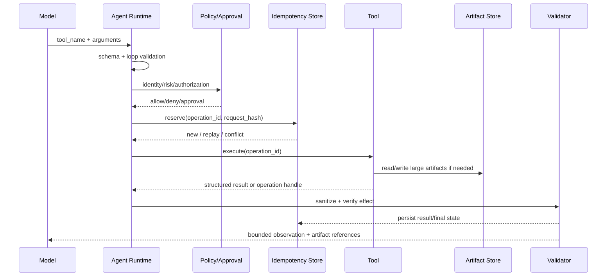
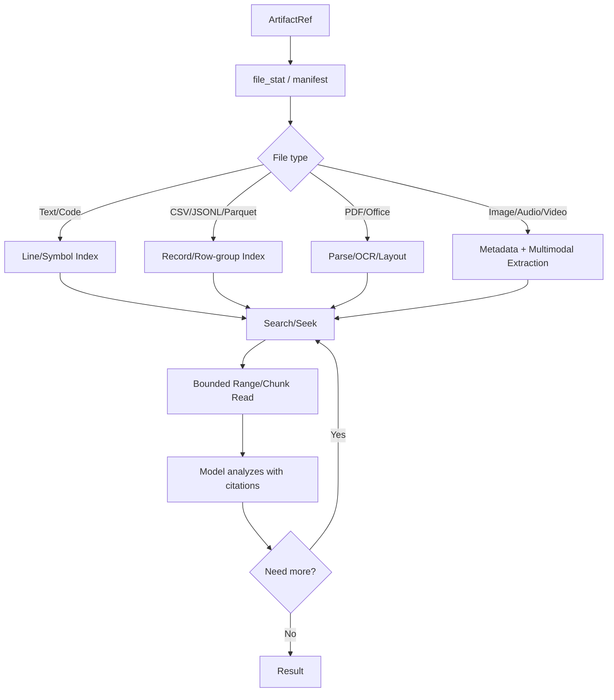
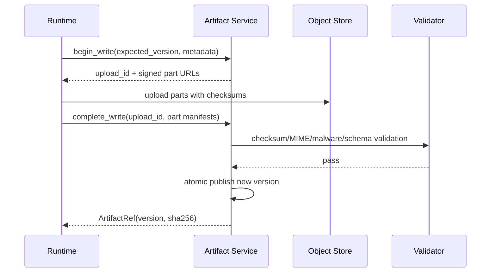
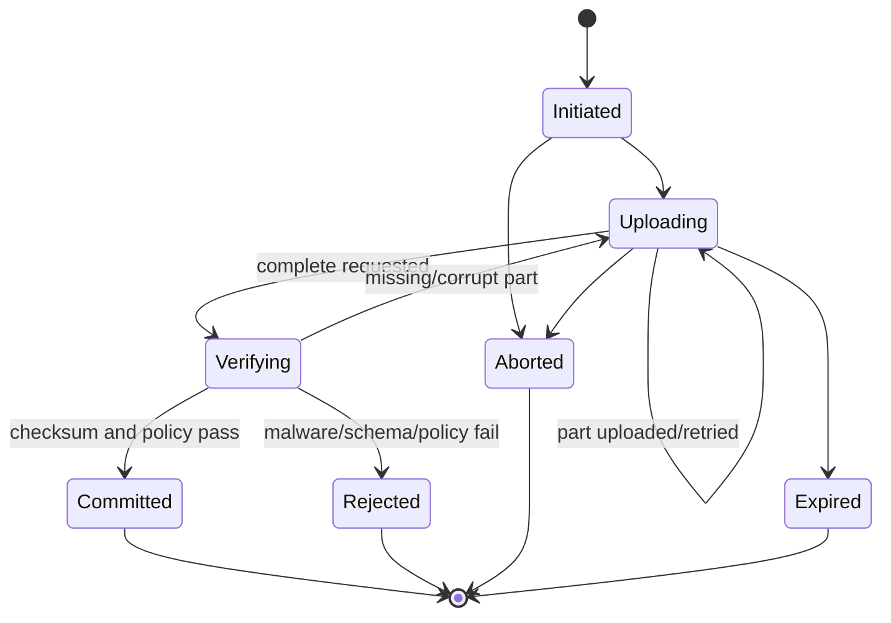
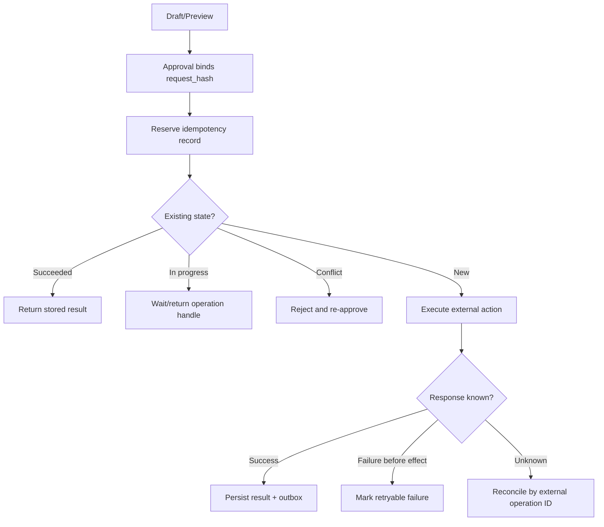
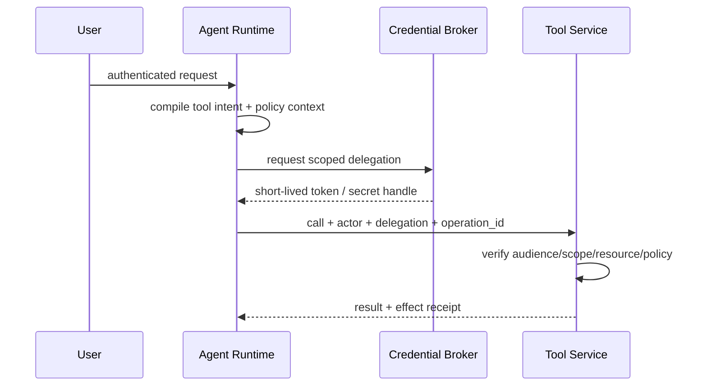
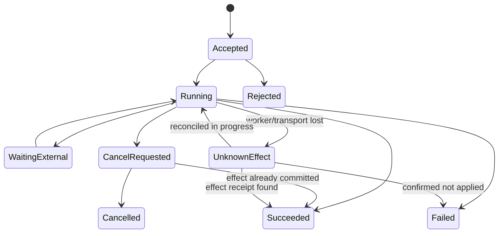

# 工具调用与协议生态

> 导航：[总目录](../README.md) | [Agent 架构](../01-控制平面/01-Agent架构.md) | [状态管理](../02-数据平面/04-状态管理与持久化.md) | [沙箱](02-沙箱与Computer-Use.md) | [安全治理](../04-保障平面/03-安全权限与治理.md)

> 调研基线：2026-08-06。MCP 当前稳定规范为 `2026-07-28`，A2A 当前稳定规范为 `1.0.0`；协议、SDK、授权草案和工具评测变化较快，接入前应重新核对官方规范。

---

## 0. 本章怎么读

工具系统不是“给模型一组函数”。它是把不可信、概率性的动作建议转换为受权限约束、可验证、可恢复副作用的可信执行层。本章重点不是某个 SDK 的调用语法，而是工具在发现、描述、授权、执行、传输、幂等、验证和治理上的统一语义。

推荐阅读顺序：

1. 第 1～4 节掌握调用链、工具契约和千级工具检索。
2. 第 5～7 节掌握大文件读写、Artifact 和长操作。
3. 第 8～9 节掌握敏感副作用幂等、结果未知和重复失败治理。
4. 第 10～14 节建立协议、错误和评测基线。
5. 第 17～21 节补齐能力注册、身份委派、Operation 生命周期、结果验证和协议适配。
6. 最后通过生产检查表、实践任务和面试题检验是否能真正落地。

### 0.1 最需要掌握的十二个重点

| 优先级 | 重点 | 掌握标准 |
|---|---|---|
| P0 | 可信执行边界 | 模型只提出 Tool Intent，Runtime 决定能否执行和如何执行 |
| P0 | Contract-first | 输入、输出、错误、副作用、权限和幂等语义都可机器校验 |
| P0 | Operation ID | 业务意图跨重试稳定，不能把每次 Tool Call 当作新操作 |
| P0 | Unknown Effect | 写操作超时先查询/Reconcile，绝不盲目重发 |
| P0 | Effect Verification | API 成功、任务完成和业务效果正确是三件不同的事 |
| P0 | Delegated Identity | Runtime 使用短期、最小 Scope、绑定调用者与目标的委派凭据 |
| P1 | Capability Registry | 能力、版本、Schema、风险、ACL、成本和健康状态统一注册 |
| P1 | Tool Retrieval | ACL 预过滤、Hybrid Recall、Rerank、工具集合固定和离线评测 |
| P1 | Artifact-first | 大输入输出传引用、Range/Cursor/Multipart，不把字节塞进 Prompt |
| P1 | Retry Governance | Transport Retry、Argument Repair、Replan、Reconcile、Compensate 分开 |
| P1 | Protocol Adapter | MCP/A2A/OpenAPI/厂商 Function Calling 映射到内部统一语义 |
| P2 | Compatibility | Schema、能力、授权、返回和错误契约都有版本与兼容测试 |

### 0.2 核心结论

1. **Tool Call 是一次尝试，Operation 是稳定业务意图。** 两者 ID、重试和审计语义必须分开。
2. **协议解决互操作，不自动提供安全、幂等和正确性。** MCP、A2A 或 OpenAPI 都不能替代 Runtime Guardrail。
3. **权限过滤必须发生在工具检索之前。** 模型不应看到无权使用的高风险能力。
4. **工具返回是不可信输入。** 它可能错误、过期、被注入、被截断或与真实副作用不一致。
5. **大文件属于 Artifact/Data Plane。** Prompt 和 Tool Result 只承载元数据、引用和有界片段。
6. **写操作必须有明确的结果状态。** 至少区分 `not_started`、`in_progress`、`succeeded`、`failed`、`unknown_effect`。
7. **重试不是统一动作。** 参数修复、网络重发、重新规划、状态对账和业务补偿具有完全不同的安全前提。
8. **生产正确性以 Effect Verification 为准。** 不能只看 HTTP 200、JSON 可解析或模型自述成功。

---

## 1. 模块定位

工具把模型决策转化为对外部世界的读取或修改。难点不在输出函数名，而在能力发现、参数约束、身份授权、大文件传输、副作用幂等、错误恢复、结果验证和跨系统互操作。

一个生产级工具系统至少分成两层：

- **模型控制层**：模型选择候选工具并生成结构化参数。
- **可信执行层**：Runtime 完成校验、鉴权、审批、幂等、重试、沙箱、结果验证和审计。

模型只能提出动作，不能自行决定是否有权执行、是否应该重试敏感操作，也不应直接搬运大文件字节。

## 重点导航

- [大量工具如何建立索引并在线检索](#4-大量工具的发现检索与动态暴露)
- [Agent 如何读取大文件](#5-agent-如何读大文件)
- [Agent 如何写入、续传和编辑大文件](#6-agent-如何写大文件)
- [MCP 如何承载 Resource、Artifact 和长操作](#7-mcp-与大文件长操作)
- [敏感工具调用如何实现幂等](#8-敏感工具调用如何实现幂等)
- [模型重复调用失败工具时如何终止和恢复](#9-模型重复调用失败工具时怎么办)
- [评测指标与生产反模式](#12-评测指标)

| 重点问题 | 核心控制面 | 核心数据面 | 最危险的失败 |
|---|---|---|---|
| 千级工具检索 | ACL、领域路由、候选精排、工具集固定 | 多索引、工具图、Schema Registry | 正确工具未召回或危险工具误暴露 |
| 大文件读取 | Read Session、双预算、Coverage | Artifact、Range、索引、派生视图 | 全量塞上下文、混读不同版本 |
| 大文件写入 | Upload Session、并发和发布状态机 | Multipart、校验和、不可变版本 | 半成品可见、重复上传、覆盖新版本 |
| 敏感调用幂等 | Operation ID、审批、状态迁移 | Idempotency Store、Outbox、对账 | 超时后重复支付/发信/发布 |
| 重复失败工具 | Retry Budget、无进展检测、熔断 | Call Ledger、失败指纹、健康指标 | ReAct 无限循环和故障流量放大 |

## 2. 标准调用链



## 3. 工具契约设计

### 3.1 输入原则

- 单一职责，名称能区分相似能力。
- 参数最少、强类型、枚举优先，避免隐式默认值。
- 描述同时说明“何时使用”和“何时不要使用”。
- 高风险参数显式化，例如 `environment`、`recipient`、`amount`、`overwrite`。
- 文件使用 `artifact_id`、URI 或上传会话，不传 Base64 大字符串。
- 写操作由 Runtime 注入 `operation_id` 和 `idempotency_key`，不让模型生成。

### 3.2 返回原则

- 返回稳定的机器可读结构和简短可读摘要。
- 区分同步完成、异步处理中、部分成功、失败和结果未知。
- 返回 `operation_id`、副作用列表、重试语义、来源和版本。
- 大结果返回 Artifact 引用、分页 Cursor 或 Range Handle，不返回完整内容。

```json
{
  "status": "succeeded",
  "operation_id": "op_123",
  "summary": "Report generated",
  "data": {
    "artifact": {
      "artifact_id": "art_456",
      "uri": "artifact://reports/art_456",
      "media_type": "application/pdf",
      "size_bytes": 83412942,
      "version": "v7",
      "sha256": "..."
    }
  },
  "retryable": false,
  "side_effects": ["artifact:art_456 created"],
  "provenance": {"system": "report-service", "version": "v3"}
}
```

### 3.3 错误契约

工具错误至少包含：

```json
{
  "error_code": "RATE_LIMITED",
  "category": "transient",
  "retryable": true,
  "retry_after_ms": 2000,
  "operation_state": "not_started",
  "state_changed": false,
  "suggested_action": "retry_same_request",
  "details_ref": "trace://tool-call-789"
}
```

关键字段是 `operation_state` 与 `state_changed`：网络超时不代表服务端没有执行写操作。

## 4. 大量工具的发现、检索与动态暴露

把数百或数千个工具 Schema 全部放进上下文，会增加 Token、降低 Prompt Cache 命中，并提高工具混淆率。大规模工具系统应把工具选择视为一个独立检索问题。

### 4.1 工具目录需要存什么

```yaml
tool_id: crm.ticket.update.v3
namespace: crm
domain: customer_support
action: update
description: 更新已有工单字段
positive_examples: ["把工单优先级改成 P1"]
negative_examples: ["查询工单详情"]
input_schema_ref: schema://crm.ticket.update.v3
side_effect: reversible_write
required_scopes: [ticket.write]
data_classification: internal
latency_class: interactive
cost_class: low
version: 3
```

只存一句工具描述通常不够。加入领域、动作、正反例、权限、副作用、成本、版本和常见组合，能显著改善过滤和重排。

### 4.2 分层检索流水线


1. **权限预过滤**：先去掉用户无权调用的工具，不能检索后再隐藏。
2. **领域路由**：按业务域、只读/写入、同步/异步缩小候选空间。
3. **Hybrid Retrieval**：关键词处理精确动作名，Embedding 处理自然语言意图。
4. **Rerank**：使用 Cross-encoder 或 LLM 判断候选工具与当前步骤的匹配度。
5. **依赖扩展**：多步骤任务不仅要召回 Top-1，还要补充认证、查询、提交、验证等组合工具。
6. **按需加载 Schema**：只将最终少量工具的完整 Schema 放入模型上下文。

### 4.3 Meta-tool 模式

当工具库很大时，可以只向模型常驻暴露：

- `search_tools(query, filters)`：搜索候选工具。
- `describe_tool(tool_id)`：读取完整 Schema、风险和示例。
- `load_toolset(tool_ids, ttl)`：为当前任务固定一个工具集合。
- `list_tool_changes(since_version)`：同步目录变更。

不要让模型每一步都重新搜索全部工具。工具集合可按任务阶段固定，并在权限、目录版本或计划改变时刷新。

### 4.4 MCP 目录变化与缓存

MCP 的 `tools/list`、`resources/list` 支持能力发现；最新规范提供列表变化通知和缓存提示。Client 应按调用者授权过滤结果，缓存工具目录时将租户、Scope 和目录版本纳入 Cache Key，并在 `listChanged` 或 TTL 到期后失效。

MCP 2026-07-28 取消了协议级会话依赖，跨调用状态应使用 Server 生成的显式 Handle 作为普通参数传递，不应依赖隐藏连接状态。

### 4.5 工具检索评测

- Tool Recall@k：正确工具是否进入候选集。
- Tool-set Completeness：多工具任务所需集合是否完整。
- nDCG/MRR：相关工具排序质量。
- Final Selection Accuracy：模型是否从候选中选对。
- Schema Context Tokens、检索 P95、目录 Cache Hit Rate。
- Candidate Churn：同一任务相邻步骤的候选集合是否无意义抖动。
- Unauthorized Tool Exposure 必须为零。

### 4.6 离线工具索引如何构建

海量工具检索的第一步不是“给工具描述做 Embedding”，而是构造适合检索、过滤和组合的多视图索引。

#### 规范化工具文档

每个工具至少生成四种检索视图：

```yaml
tool_id: finance.invoice.create.v4

retrieval_views:
  short_summary: "创建一张新的客户发票"
  intent_document: |
    当用户明确要求新建、开具或生成客户发票时使用。
    不用于查询已有发票、修改发票或执行付款。
  schema_document: |
    必填：customer_id、currency、line_items。
    可选：due_date、memo。
  risk_document: |
    可逆写操作；需要 invoice.write；不得在未确认客户时调用。

positive_queries:
  - "给客户 C102 开一张美元发票"
  - "根据这些明细生成 invoice"
hard_negative_queries:
  - "查询 C102 最近一张发票"
  - "把发票状态改成已付款"
```

- `short_summary` 用于快速候选召回。
- `intent_document` 强调使用条件、禁用条件和语义边界。
- `schema_document` 支持参数和能力匹配。
- `risk_document` 支持权限、审批和副作用过滤。
- Hard Negative 用于区分名称和描述高度相似的工具。

#### 建立多种索引

| 索引 | 存储内容 | 主要用途 |
|---|---|---|
| 倒排索引 | 工具名、动作、实体、参数名、别名 | 精确命中 API 名、业务术语和编号 |
| 向量索引 | Intent、正例、Schema 摘要 | 自然语言意图召回 |
| 分类索引 | Domain、Read/Write、Risk、Latency | 预过滤和配额 |
| 权限索引 | Scope、Tenant、Role、Resource Type | 在检索前排除不可用工具 |
| 工具图 | 前置、后继、替代、验证、补偿、共用 | 多工具任务补全和下一步推荐 |
| 版本索引 | Tool/Schema/Server Version | 任务固定、缓存失效和回放 |

#### 工具图的边类型

```text
requires       create_refund -> get_order
followed_by    create_draft -> submit_draft
validated_by   update_ticket -> get_ticket
compensated_by reserve_stock -> release_stock
alternative_to search_v1 <-> search_v2
co_used_with   upload_file <-> create_attachment
```

工具图既可以由领域专家配置，也可以从成功 Trace 中统计。自动学习的边必须设置最小样本数、置信度和版本，不能把偶然调用序列直接固化为依赖。

### 4.7 在线检索算法

检索 Query 不应只使用原始用户输入。一个长任务执行到中间步骤后，正确工具通常由“当前子目标 + 已知状态 + 缺失信息 + 风险约束”决定。

```python
def retrieve_toolset(task, step, caller, registry):
    query = build_query(
        user_goal=task.goal,
        step_objective=step.objective,
        known_entities=step.state.entities,
        missing_fields=step.state.missing_fields,
        previous_error=step.last_error,
    )

    allowed = registry.filter(
        tenant=caller.tenant,
        scopes=caller.scopes,
        risk_ceiling=task.policy.max_risk,
        environment=task.environment,
        compatible_versions=task.runtime_versions,
    )

    sparse = bm25_search(query, allowed, top_k=40)
    dense = vector_search(query, allowed, top_k=40)
    candidates = reciprocal_rank_fusion(sparse, dense)

    reranked = hierarchy_aware_rerank(
        query=query,
        candidates=candidates,
        multi_tool=step.may_require_multiple_tools,
    )

    expanded = expand_tool_graph(
        reranked[:12],
        edge_types=["requires", "validated_by", "compensated_by"],
        max_added=8,
    )

    return enforce_namespace_quota_and_load_schemas(expanded, max_tools=16)
```

参数 `40/12/8/16` 不是通用答案，需要通过内部任务集调优。关键是把“粗召回、精排、依赖补全、Schema 加载”拆开观测。

### 4.8 单工具与多工具任务的候选策略不同

ToolRerank 的研究指出，单工具查询需要候选更集中，而多工具查询需要适度多样。工程上可以采用：

- **单工具任务**：提高 Top-1/Top-3 Precision，避免相似写工具同时出现。
- **多工具任务**：按功能角色分桶，例如 `lookup`、`mutate`、`validate`、`compensate`，每桶至少保留一个高分候选。
- **未知任务**：先只加载只读工具和 Meta-tool，确认计划后再扩展写工具。
- **高风险任务**：候选集中必须包含验证和补偿工具，不能只召回执行工具。

### 4.9 Progressive Disclosure：逐步暴露 Schema

工具 Schema 可能很长，尤其是 OpenAPI 转换后的接口。可以分三层加载：

1. **目录层**：`tool_id + 20~50 Token 摘要 + 风险标签`。
2. **选择层**：完整用途、正反例、必填参数名，不加载所有嵌套 Schema。
3. **执行层**：模型选定工具后，再加载完整 JSON Schema、枚举、约束和示例。

对于包含数百字段的 API，不应让模型一次填满原始 Schema。先通过专门查询工具确定资源和操作，再按字段组渐进收集参数。

### 4.10 任务内工具集合固定

如果工具目录在任务执行期间持续变化，模型可能在相邻步骤看到不同定义，导致计划不可回放。Runtime 应保存：

```yaml
toolset_snapshot:
  registry_version: 2026-08-05T10:30:00Z
  tools:
    - tool_id: crm.ticket.get
      version: 5
      schema_hash: sha256:...
    - tool_id: crm.ticket.update
      version: 3
      schema_hash: sha256:...
  permission_snapshot: authz_789
```

- 普通任务在阶段内固定 Toolset Snapshot。
- 收到 MCP `listChanged` 时标记目录过期，不应强行修改正在执行的步骤。
- 只有权限撤销、安全下线或显式重规划时，才中断并重新检索。
- Trace 必须记录实际使用的 Schema Hash，不能只记录工具名。

### 4.11 冷启动与工具描述治理

新工具没有调用数据时：

1. 由工具 Owner 提供正例、反例、风险和依赖。
2. 使用 LLM 生成候选 Query，但需人工抽查并去除同义重复。
3. 与最相似工具做 Pairwise 区分测试。
4. 先进入 Shadow 目录，只评测不执行。
5. 达到 Recall、误选和安全阈值后再向生产 Agent 暴露。

线上混淆应反向修改工具边界和描述；如果两个工具长期无法区分，优先合并、重命名或增加确定性 Router，而不是无限增加 Prompt 示例。

### 4.12 大量工具检索的测试集

每条测试样本不只标一个工具，应标注完整候选集合和角色：

```yaml
query: "找到订单后取消，并确认退款状态"
required_tools:
  - id: order.search
    role: prerequisite
  - id: order.cancel
    role: primary_action
  - id: refund.get
    role: validation
forbidden_tools:
  - order.delete
acceptable_alternatives:
  - order.cancel_v2
```

至少包含：同名工具、同一实体的读写工具、旧版本、跨租户工具、缺失工具、需要多工具、需要补偿和高风险工具。普通 IR Benchmark 表现好不代表 Tool Retrieval 表现好；ToolRet 在 43K 工具语料上专门验证了这一差异。

## 5. Agent 如何读大文件

### 5.1 核心原则：控制面传引用，数据面传字节

大文件不应通过 Tool Result 或模型上下文直接传输。推荐架构：

```text
Model Context        只包含摘要、局部片段、游标和 ArtifactRef
Agent Runtime        维护文件 Handle、读取预算、权限和进度
Artifact Service     负责对象存储、Range、分片、校验和与版本
Parser/Indexer       负责 OCR、结构提取、全文/向量/符号索引
```

模型看到的是有边界的“视图”，而不是完整文件字节。

### 5.2 ArtifactRef

```yaml
artifact_id: art_456
uri: artifact://tenant-a/reports/art_456
media_type: application/pdf
size_bytes: 83412942
version: v7
etag: "..."
sha256: "..."
created_by: tool_call_789
acl_scope: project-12
expires_at: null
derived_views:
  text: artifact://tenant-a/reports/art_456/text
  pages: artifact://tenant-a/reports/art_456/pages
  index: index://tenant-a/art_456/v7
```

Artifact URI 是稳定逻辑引用；真正下载可使用短期 Signed URL，避免把对象存储长期凭据交给 Agent。

### 5.3 读取流程



具体步骤：

1. `file_stat`：先读大小、类型、版本、哈希、权限和结构清单。
2. **服务端解析**：不要让模型自己解压、OCR 或全量扫描二进制。
3. **建立可寻址视图**：行号、页码、章节、记录游标、Parquet Row Group、代码 Symbol。
4. **先搜索后读取**：关键词、结构化过滤、向量或符号检索定位候选区域。
5. **有界读取**：按页、行、记录、时间段或 Byte Range 读取，并设置最大字节/Token。
6. **保留证据位置**：返回 `artifact_id + version + range/page/record`，便于引用和复现。
7. **迭代读取**：模型根据局部结果请求下一段，Runtime 控制总读取预算。

### 5.4 不同格式的推荐接口

| 格式 | 推荐读取单位 | 注意事项 |
|---|---|---|
| 大文本/日志 | 行范围、时间范围、搜索结果窗口 | 处理换行和字符编码边界 |
| 源代码仓库 | Symbol、AST 节点、函数调用图 | 不只按字符切块 |
| CSV/JSONL | Record Cursor、列投影、过滤条件 | 避免返回所有列和行 |
| Parquet | Row Group、列裁剪、Predicate Pushdown | 尽量服务端聚合 |
| PDF/Office | 页、标题、表格、版面块 | OCR 置信度和页码引用 |
| 压缩包 | Manifest、选择性解压 | 防 Zip Bomb 和路径穿越 |
| 音视频 | 时间段、转写片段、关键帧 | 保留时间戳和说话人 |

HTTP Range 适合字节级随机读取，但文本 API 应避免在 UTF-8 多字节字符或记录中间截断，最好由服务端返回完整行/记录边界。

### 5.5 Map-Reduce 与层次摘要

如果任务确实要求理解全文件：

1. 按结构拆分，不盲目固定字节切片。
2. 每片提取结构化事实、引用和置信度。
3. 中间结果写入 Artifact，而不是全部留在上下文。
4. 分层合并摘要，并检测跨片冲突与遗漏。
5. 最终结论保留到原始片段的引用链。

“分片摘要再拼接”不保证全局正确；跨章节关系、表格合计、代码调用链需要专门聚合逻辑。

### 5.6 读取会话与预算

大文件读取通常持续多轮，Runtime 应创建显式 Read Session，而不是让模型用任意 Offset 自由遍历。

```yaml
read_session_id: read_123
artifact_id: art_456
artifact_version: v7
purpose: "定位过去 24 小时支付超时的根因"
allowed_views: [manifest, text, log_index]
budget:
  max_source_bytes: 200000000
  max_context_tokens: 60000
  max_requests: 40
  deadline: "2026-08-05T12:00:00Z"
progress:
  source_bytes_read: 42800000
  context_tokens_emitted: 18200
  requests: 9
visited_ranges:
  - "lines:1820000-1840000"
evidence_refs: []
```

为什么要同时限制 Source Bytes 和 Context Tokens：服务端可能读取 100 MB 日志完成聚合，但只向模型返回 2 KB 统计结果；反过来，一个高度压缩的文件可能解压后产生巨大文本。两种资源都必须分别计量。

读取 API 每次返回：

- 本次实际扫描字节数和向模型输出 Token 数。
- 是否截断、下一 Cursor 和剩余预算。
- Artifact 版本与 Range，防止后续读取混入其他版本。
- 可复用的服务端聚合结果 Artifact。

### 5.7 Pull、Streaming 与异步分析如何选择

| 模式 | 使用方式 | 适用场景 | 注意事项 |
|---|---|---|---|
| Pull + Cursor | Agent 请求下一页/下一批记录 | 搜索、浏览和逐步分析 | 最易控制上下文和预算 |
| HTTP Range | 按字节位置读取不可变对象 | 已知 Offset、媒体分片、索引文件 | 需处理 ETag、字符和记录边界 |
| Streaming | Runtime 连续消费数据，模型接收聚合事件 | 实时日志、转写、持续监控 | 模型不应接收每条原始事件 |
| Async Job | 提交扫描/解析任务，稍后读取结果 | TB 级数据、OCR、全库统计 | 需要进度、取消、Checkpoint |

语言模型本身通常不适合作为高速字节流消费者。Streaming 的正确做法是 Runtime 或专门处理器消费流，按窗口聚合后向模型发送摘要、异常和证据引用。

### 5.8 大文本和日志的实现算法

对于 20 GB 日志，不应从第 1 行开始让模型反复调用 `read_next`。推荐：

```text
1. file_stat：确认格式、时间跨度、压缩方式和版本。
2. build/query index：按时间、level、service、trace_id 建索引。
3. server-side filter：先过滤时间和错误类型。
4. aggregate：统计错误码、服务、调用链和时间分布。
5. sample：每个异常簇返回少量代表日志。
6. drill-down：模型选择异常簇后读取上下文窗口。
7. correlate：按 trace_id 读取跨服务片段。
8. persist findings：中间统计写入分析 Artifact。
```

工具接口可设计为：

```json
{
  "tool": "log_query",
  "arguments": {
    "artifact_id": "art_logs",
    "version": "v12",
    "filter": {
      "time": ["2026-08-04T00:00:00Z", "2026-08-05T00:00:00Z"],
      "level": ["ERROR", "FATAL"]
    },
    "group_by": ["service", "error_code"],
    "sample_per_group": 3,
    "limit": 100
  }
}
```

这样模型首先看到“错误簇”，而不是数百万条日志。

### 5.9 表格与数据文件的实现算法

对 CSV/JSONL/Parquet：

1. 解析 Schema、列类型、行数、分区和缺失率。
2. 将自然语言问题翻译为安全的查询计划，而不是读取全部行。
3. 服务端执行列投影、过滤、聚合、排序和采样。
4. 模型只接收结果表和查询计划摘要。
5. 对关键结论运行第二条独立校验 Query。

```yaml
query_plan:
  source: artifact://sales/v4
  projection: [region, revenue]
  filters:
    - column: order_date
      op: between
      value: [2026-01-01, 2026-06-30]
  aggregation:
    group_by: [region]
    metrics:
      - sum: revenue
  row_limit: 1000
```

避免让模型生成任意代码直接扫描文件；查询计划应经过列名、类型、资源和结果行数校验。

### 5.10 PDF、Office 与扫描件

文件解析服务应生成：

- 文档树：标题、章节、段落、列表。
- 页级文本和 Bounding Box。
- 表格的行列结构，而不是扁平字符串。
- 图片说明、OCR 文本和 OCR 置信度。
- 页眉页脚、脚注和引用关系。

Agent 先在文档树或全文索引中检索，再按页/块读取。回答中引用 `page + block_id + version`。对于合同、财报等关键文档，OCR 低置信区域应返回原始页图给视觉模型或人工，不应把低置信文本当作确定事实。

### 5.11 代码仓库不是普通文本文件

大型代码库建议建立：

- 文件树和语言/构建系统元数据。
- Symbol Index：类、函数、变量和定义位置。
- Reference Index：谁调用谁、谁导入谁。
- AST/语法块视图。
- Git Commit、Branch、Blob SHA 和工作区状态。

读取流程通常是 `search_symbol -> get_definition -> get_references -> read_file_range`。代码修改前固定 Commit/Blob SHA，Patch 时携带前置上下文和 Base SHA，避免在代码变化后把旧行号 Patch 到新文件。

### 5.12 全文件问题如何避免遗漏

“总结全文”和“找一个错误”需要不同策略。全文件问题应先定义覆盖单位：章节、页、分区、时间窗或 Symbol。Runtime 保存 Coverage Map：

```yaml
coverage:
  unit: section
  total: 42
  processed: [1, 2, 3, 5, 6]
  failed: [4]
  skipped: []
  completion_ratio: 0.119
```

只有覆盖满足阈值且失败分片已处理时，Agent 才能宣称“已分析全文”。摘要合并阶段还应检查：

- 同一实体在不同分片中的名称归一。
- 数值总计是否可由原始分片重算。
- 冲突事实是否被显式保留。
- 结论是否包含至少一个原始证据引用。

### 5.13 一致性：一次分析只能使用一个文件版本

- Read Session 创建时固定 `artifact_version/etag`。
- 后续 Range 请求携带 If-Match/If-Range 或逻辑版本。
- 文件被更新时，旧 Session 继续读取旧不可变版本，或明确返回版本冲突。
- 禁止前半部分读 v7、后半部分静默读 v8。
- 如果任务要求“最新文件”，应重新创建 Session 并重新评估已得结论。

### 5.14 读取故障与恢复

| 故障 | 处理 |
|---|---|
| Cursor 过期 | 根据已保存 Range/Record Offset 重建 |
| Parser 崩溃 | 从分片 Checkpoint 恢复，不重做已完成分片 |
| Artifact 版本被删除 | 停止并报告不可复现，不切换最新版本 |
| OCR 部分失败 | 标记失败页，允许重试或人工补充 |
| 单分片超限 | 进一步按结构拆分，不盲目提高 Token 限制 |
| 索引与源版本不一致 | 拒绝查询，重建对应版本索引 |

### 5.15 完整案例：分析 20 GB 线上日志

假设目标是“解释昨天支付超时上升的原因”：

1. Runtime 创建 `ReadSession`，固定日志对象 v12，限制扫描 4 GB、模型上下文 80K Token、总耗时 10 分钟。
2. `log_query` 在服务端按昨日时间和 timeout 过滤，读取 1.2 GB，返回各服务和错误码计数，仅占 2K Token。
3. 模型选择异常最高的 `payment-gateway/TIMEOUT_UPSTREAM`。
4. 工具按 `trace_id` 采样 20 条完整调用链，并返回上下游 P95。
5. 模型推测某依赖重试放大流量，要求按分钟聚合 retry_count 与 timeout。
6. 服务端执行聚合，发现发布后重试次数从 2 增至 5。
7. Agent 读取相关配置 Commit 和变更记录，形成证据链。
8. 最终报告引用日志 Range、Trace ID、配置版本和统计 Query Artifact，而不是附上原始日志。

整个过程模型只看到几十 KB 结构化结果，但 Runtime/处理器扫描了 GB 级数据。

## 6. Agent 如何写大文件

### 6.1 不直接覆盖最终对象

推荐 `prepare -> upload -> validate -> commit`：



- 大文件使用 Multipart 或 Resumable Upload，网络中断后只重传失败部分。
- 每个 Part 记录编号、大小和校验和；完成时校验整体哈希。
- 未完成上传设置 TTL 和清理任务。
- 使用临时对象或新版本，验证通过后原子发布。
- 对象存储访问通过短期 Signed URL/Session URI，不下发长期云凭据。

### 6.2 增量编辑而非全量重写

| 数据 | 推荐写法 |
|---|---|
| 文本/代码 | 基于 `base_version` 的 Patch/Hunk，服务端验证上下文 |
| CSV/JSONL | 追加分区、重写受影响分片、生成新 Manifest |
| Parquet | 重写受影响 Row Group/Partition，不原地改字节 |
| PDF/Office/媒体 | 生成新版本，保留父版本和变更说明 |
| 日志/事件 | Append-only + Sequence/Offset |

Patch 请求应包含目标版本、范围、前置内容哈希和期望结果哈希。若对象版本已变化，返回 `VERSION_CONFLICT`，让 Agent 重新读取并合并，而不是覆盖他人修改。

### 6.3 文件工具建议

```text
file_stat(artifact_id)
file_manifest(artifact_id, cursor)
file_search(artifact_id, query, filters)
file_read_range(artifact_id, version, range, max_bytes)
file_read_records(artifact_id, cursor, projection, limit)
file_begin_write(target, expected_version, metadata, operation_id)
file_upload_part(upload_id, part_number, checksum)
file_complete_write(upload_id, manifest, expected_sha256)
file_apply_patch(artifact_id, base_version, hunks, operation_id)
file_abort_write(upload_id)
```

`file_upload_part` 通常由 Runtime/传输客户端执行，不应让语言模型逐 Part 决策。

### 6.4 文件安全与完整性

- 文件名不能作为唯一类型依据，校验 MIME、Magic Number 和扩展名一致性。
- 限制文件大小、解压层数、压缩比、文件数和处理时间。
- 上传后做校验和、恶意软件、DLP 和内容策略扫描。
- Signed URL 视为临时 Secret，不记录完整查询参数到 Trace。
- 所有派生文本、缩略图和索引继承源文件 ACL。
- 删除源 Artifact 时处理派生视图、缓存和索引的删除传播。

### 6.5 Upload Session 状态机

大文件写入不能只保存一个 `upload_id`。需要持久化上传会话、Part 清单、目标版本和校验状态：



```yaml
upload_session:
  upload_id: upl_123
  operation_id: op_456
  tenant_id: tenant-a
  target_uri: artifact://tenant-a/exports/sales
  expected_base_version: v6
  media_type: application/x-parquet
  expected_size_bytes: 2147483648
  expected_sha256: null
  part_size_bytes: 67108864
  state: uploading
  storage_upload_id: provider_specific_id
  uploaded_parts:
    - number: 1
      size_bytes: 67108864
      checksum: "..."
      provider_etag: "..."
  expires_at: "..."
```

Upload Session 必须位于 Worker 外部。Worker 重启后通过 `upload_id` 查询已完成 Part，只上传缺失部分。

### 6.6 Part 大小如何选择

不能固定使用一个 Part 大小。Runtime 应根据：

- 文件预估大小。
- 存储服务最小 Part、最大 Part 数和单 Part 上限。
- 网络带宽、失败概率和并发数。
- 内存上限和校验和计算方式。

计算思路：

```text
part_size >= ceil(expected_size / provider_max_parts)
part_size = clamp(round_up(part_size, alignment), provider_min_part, local_memory_limit)
```

Part 太小会增加请求、清单和提交开销；太大则导致失败后重传成本高。未知最终大小的流式输出可从较小 Part 开始，但必须确保最终不会超过 Provider Part 数上限。

### 6.7 `begin_write` 接口

```json
{
  "target": "artifact://tenant-a/exports/sales",
  "expected_base_version": "v6",
  "media_type": "application/x-parquet",
  "expected_size_bytes": 2147483648,
  "operation_id": "op_456",
  "idempotency_key": "idem_456",
  "overwrite_mode": "create_new_version"
}
```

返回：

```json
{
  "upload_id": "upl_123",
  "state": "uploading",
  "part_size_bytes": 67108864,
  "max_parallel_parts": 4,
  "part_upload_authorization": {
    "mode": "signed_url_template",
    "expires_at": "..."
  }
}
```

如果相同 `operation_id` 已创建 Upload Session，返回已有 Session，而不是创建第二个 Provider Multipart Upload。

### 6.8 上传 Part 的执行者

语言模型不应循环决定“上传第 1、2、3 Part”。正确分工：

- 模型/Planner 决定生成什么 Artifact。
- Runtime 创建上传会话。
- 传输 Worker 流式读取本地产物并并发上传 Part。
- Upload Manager 记录校验和、重试和进度。
- Agent 只接收阶段性进度、异常和最终 ArtifactRef。

```python
async def upload_file(session, source_stream):
    semaphore = Semaphore(session.max_parallel_parts)

    async for part in split_stream(source_stream, session.part_size):
        if session.already_uploaded(part.number, part.checksum):
            continue

        async with semaphore:
            await retry_transient(
                lambda: storage.upload_part(
                    upload_id=session.storage_upload_id,
                    number=part.number,
                    body=part.bytes,
                    checksum=part.checksum,
                ),
                retry_budget=session.retry_budget,
            )
            session.record_part(part.number, part.size, part.checksum)
```

重试只针对单个 Part，不从头重传整个文件。

### 6.9 `complete_write` 的验证顺序

1. Upload Session 是否属于当前租户、用户和 `operation_id`。
2. Part 编号是否连续、大小是否符合 Provider 约束。
3. 每个 Part 的客户端与服务端校验和是否一致。
4. Provider 完成 Multipart，并返回对象版本/ETag。
5. 计算或验证整个对象的 Checksum。
6. MIME/Magic Number、文件格式和 Schema 检查。
7. 恶意软件、DLP、压缩包和内容策略检查。
8. 再次校验 `expected_base_version`，防止上传期间目标被更新。
9. 在 Artifact 元数据事务中发布新版本。
10. 发送 `ArtifactCommitted` Outbox Event，异步触发解析和索引。

如果第 8 步发生冲突，上传字节可以暂存为未发布版本，等待人工合并或重新指定目标；不能直接覆盖新版本。

### 6.10 原子发布的实现

对象存储完成上传和业务 Artifact 发布通常不在同一数据库事务中。可采用：

```text
1. 上传到 staging object: staging/{upload_id}
2. 校验通过后，在 DB 事务中：
   - 检查 base_version
   - 创建 artifact_version = pending_publish
   - 写 outbox event
3. Publisher 将 staging object 复制/重命名到 immutable final key
4. 更新 artifact_version = committed
5. 失败时由 Reconciler 检查 DB 与对象存储并补偿
```

另一种方式是对象一开始就使用不可变最终 Key，数据库只控制该版本是否对用户可见。关键是用户不能在校验完成前看到“半成品”。

### 6.11 Patch/Hunk 的并发控制

文本和代码 Patch 推荐使用乐观并发：

```json
{
  "artifact_id": "art_code",
  "base_version": "git-blob-sha-123",
  "operation_id": "op_patch_1",
  "hunks": [
    {
      "start_line": 120,
      "end_line": 128,
      "before_sha256": "...",
      "replacement": "..."
    }
  ]
}
```

服务端执行：

1. 目标当前版本必须等于 `base_version`。
2. Hunk 覆盖区域必须匹配 `before_sha256` 或前置上下文。
3. 所有 Hunk 在内存/临时文件上应用。
4. 运行格式、Schema 或测试校验。
5. 写入新不可变版本并原子更新当前指针。

如果版本不同，返回冲突和最新版本；Agent 必须重新读取、合并并生成新 Patch。高风险文件不应使用模糊匹配自动套用旧 Patch。

### 6.12 Append-only 大文件

日志、事件和训练轨迹更适合 Append-only：

- Writer 获得 Partition/Shard 和下一个 Sequence。
- 每批带 `producer_id + sequence_range + checksum`。
- 服务端通过唯一约束去重重复批次。
- Manifest 记录分片和时间范围。
- Reader 固定 Manifest Version，避免扫描到正在追加的半批数据。

不要让多个 Agent 直接向同一个普通文件尾部写字节；使用日志系统、对象分片或数据库事务。

### 6.13 上传恢复与对账

恢复流程：

```text
Worker restarts
-> load Upload Session
-> list provider parts
-> compare provider parts with local manifest
-> verify checksum for matching parts
-> re-upload missing/corrupt parts
-> continue complete_write
```

必须处理三种不一致：

- Provider 有 Part，数据库没有：验证后补记或删除该 Part。
- 数据库有 Part，Provider 没有：重新上传。
- Upload 已完成但 Artifact 状态仍 `uploading`：Reconciler 查询对象并推进发布。

过期会话通过 Lifecycle Job Abort；否则未完成 Part 会持续占用存储并产生费用。

### 6.14 完整案例：生成 2 GB 数据导出

目标是“导出半年订单并附带区域汇总”：

1. Agent 只负责确认字段、权限、时间范围和目标格式。
2. Runtime 创建 `operation_id`，先查询是否已有相同请求的成功 Artifact。
3. Export Worker 直接从数据库游标流式读取，边编码 Parquet 边生成 Part，不在内存构建 2 GB 文件。
4. 4 个并发上传任务上传 Part，每个 Part 带校验和。
5. Worker 在第 19 个 Part 后崩溃；新 Worker 读取 Session，从第 20 个 Part 继续。
6. 完成后校验总行数、时间范围、Schema、Checksum 和 DLP。
7. Artifact Service 发布 v1，并异步生成小型汇总 CSV 和数据字典。
8. Agent 最终返回 ArtifactRef、汇总和短期下载授权，不把文件内容放入消息。

这里模型参与“目标和解释”，数据系统负责“字节和计算”。

## 7. MCP 与大文件/长操作

MCP Resources 使用 URI 暴露文件类数据，并支持列表分页、授权过滤、变化通知和订阅。Host 决定哪些资源片段进入模型上下文；“资源可读取”不等于“整个资源应该注入 Prompt”。

推荐模式：

- `resources/list` 只返回元数据和 URI，使用 Cursor 分页。
- `resources/read` 用于合理大小的资源视图；超大文件优先暴露派生索引或范围读取 Tool。
- Tool Result 返回 Artifact/Resource URI 和摘要，不嵌入几十 MB 的文本或 Base64。
- 长操作返回 `operation_id`，通过状态 Tool、事件或 A2A Task 更新进度。
- Server 生成显式读取/上传 Handle，Handle 包含 Scope、TTL 和调用者绑定。

对于远程传输，MCP Streamable HTTP 负责协议消息，不应替代专门的大文件对象存储数据面。

### 7.1 Resource、Tool Result 与 Artifact 的边界

| 对象 | 谁决定使用 | 应包含什么 | 不应包含什么 |
|---|---|---|---|
| MCP Resource | 应用/Host 选择 | URI、元数据、合理大小的内容视图 | 无边界的超大字节流 |
| Tool Result | 模型动作的直接反馈 | 状态、摘要、小型结构化结果、Artifact URI | 数十 MB 文本、二进制 Base64 |
| Artifact | Runtime/业务系统管理 | 不可变版本、内容、校验和、ACL、派生视图 | 隐式连接态或仅存在于模型上下文的内容 |
| Handle | Server 创建，调用方传回 | Scope、TTL、调用者绑定、进度游标 | 长期凭据和可猜测资源路径 |

Resource 是协议级可发现内容，Artifact 是应用级持久产物，两者可以通过 URI 映射，但生命周期和安全责任仍属于应用。

### 7.2 分页与范围读取

`resources/list` 和 `tools/list` 的 Cursor 用于列举大量元数据，不应用作读取一个大文件的字节 Offset。文件内部范围应由专门 Tool 表达：

```json
{
  "tool": "artifact.read",
  "arguments": {
    "artifact_id": "art_456",
    "version": "v7",
    "selector": {
      "type": "page_range",
      "start": 120,
      "end": 130
    },
    "max_output_bytes": 1048576
  }
}
```

Server 必须忽略模型试图绕过 `max_output_bytes` 的请求，并实施自己的硬上限。

### 7.3 显式 Handle 的设计

```yaml
handle_id: h_123
type: artifact_read_session
subject: user_42
tenant: tenant-a
resource: artifact://tenant-a/art_456
version: v7
allowed_operations: [read_page, search]
cursor_state_ref: state://handles/h_123
expires_at: "..."
```

- Handle 是不可猜测随机 ID，服务端仍需每次重新鉴权。
- Handle 不能扩大原用户权限。
- Handle 过期后返回明确错误，Agent 根据状态决定重建或停止。
- Handle 中的 Cursor 和进度存服务端，模型只传 `handle_id`。
- Handle 不应被写入长期记忆或跨用户共享。

### 7.4 长操作的协议返回

OCR、导出、转码、索引构建可能运行数分钟。初次 Tool Result 应快速返回：

```json
{
  "status": "accepted",
  "operation_id": "op_long_1",
  "poll_after_ms": 3000,
  "progress": 0.0,
  "result_artifact": null,
  "cancel_supported": true
}
```

后续通过 `operation.get`、订阅事件或 A2A Task 获取状态。模型不应每 100 ms 自主轮询；Runtime 根据 `poll_after_ms` 调度并将进度变化压缩后通知模型。

### 7.5 MCP Server 的文件安全责任

- Resource URI 解析后必须再次做路径规范化和 ACL，防止路径穿越。
- 远程 URL Resource 通过受控 Fetcher 获取，阻止 SSRF 和内网访问。
- 文件内容、Resource Metadata 和 Tool Result 都是不可信输入。
- 超大响应应在 Server 或 Host 层截断，而不是依赖模型忽略。
- Server 不能把对象存储长期凭据或完整 Signed URL 写入模型可见日志。
- 对 `resources/subscribe` 设置数量、事件频率和租户配额。

## 8. 敏感工具调用如何实现幂等

### 8.1 先明确语义

分布式网络中，客户端超时后无法仅凭超时判断服务端是否已完成。敏感工具应追求“同一业务意图重复提交不会产生额外副作用”，而不是假设网络提供绝对 exactly-once。

可采用：

- At-least-once + 幂等 API：适合 Upsert、带幂等键的支付/创建。
- At-most-once + 禁止自动重试：适合不支持去重的一次性外部动作。
- Saga/补偿：适合跨多个系统的长事务。
- Reconciliation：结果未知时查询或对账。

### 8.2 幂等键由 Runtime 生成

幂等键不能由模型每次随机生成，也不建议只用时间戳。推荐：

```text
operation_id = server_minted_id(task_id, step_id, user_intent_version)
request_hash = hash(tool_version + normalized_arguments + target + approval_version)
idempotency_key = scoped_token(operation_id)
```

- **同一意图重试**：复用同一个 `operation_id/idempotency_key`。
- **用户明确发起第二次相同动作**：创建新的 `operation_id`，否则会被误判为重试。
- **同 Key 不同参数**：返回冲突，不能静默执行或复用旧结果。
- **审批后参数变化**：`request_hash` 改变，必须重新审批。

### 8.3 幂等记录

```yaml
operation_id: op_123
idempotency_key: idem_abc
scope: tenant-a/payment.create
request_hash: sha256:...
approval_hash: sha256:...
state: in_progress  # in_progress/succeeded/failed/unknown
external_operation_id: pay_789
result_ref: result://op_123
side_effect_refs: [payment://pay_789]
locked_until: "..."
expires_at: "..."
```

执行前用数据库唯一约束原子地插入 `in_progress`：

1. 新 Key：获得执行权。
2. 已成功：返回原结果，不再次执行。
3. 正在执行：等待、订阅或返回 `operation_id`。
4. 同 Key 参数不一致：返回 `IDEMPOTENCY_CONFLICT`。
5. 状态未知：先对账外部系统，再决定补偿或人工介入。

### 8.4 敏感动作的完整流程



数据库更新与事件发布使用 Transactional Outbox，避免“数据库已提交但消息未发送”或相反。支付、发信、发布和删除等操作还应保存外部业务 ID，不能只保存 HTTP Response。

### 8.5 不支持幂等键的工具

- 默认关闭自动重试。
- 调用前完成所有校验和审批，缩短不确定窗口。
- 使用业务唯一约束、自然去重键或供应商查询接口。
- 保存发送前后的证据和外部关联 ID。
- 超时后进入 `unknown`，由 Reconciler 或人工确认。
- 不要因为模型说“刚才失败了”就再次执行。

### 8.6 业务意图 ID 与参数指纹不是同一件事

如果直接用参数 Hash 作为幂等键，会出现两个问题：

1. 用户今天和明天明确要求发送两封内容相同的邮件，参数相同但意图是两次执行。
2. 同一次支付重试时，模型补充了无关说明字段，Hash 变化却仍是同一业务意图。

因此应分离：

- `operation_id`：标识一次用户/工作流意图，由 Runtime 在步骤创建时生成。
- `request_hash`：验证相同 Operation 的执行参数没有被改变。

请求规范化应：

- JSON Key 排序，统一数字、货币、时区和 Unicode。
- 将资源名称解析为稳定 ID 和版本。
- 移除 Trace ID、重试次数、时间戳等非业务字段。
- 保留目标环境、收件人、金额、资源版本、工具版本等语义字段。
- 对敏感字段 Hash/HMAC，而不是在幂等表中保存明文。

### 8.7 数据库表设计

```sql
CREATE TABLE tool_operations (
    tenant_id              TEXT        NOT NULL,
    operation_id           TEXT        NOT NULL,
    idempotency_scope      TEXT        NOT NULL,
    idempotency_key        TEXT        NOT NULL,
    tool_id                TEXT        NOT NULL,
    tool_version           TEXT        NOT NULL,
    request_hash           TEXT        NOT NULL,
    approval_hash          TEXT,
    state                  TEXT        NOT NULL,
    attempt_count          INTEGER     NOT NULL DEFAULT 0,
    lease_owner            TEXT,
    lease_expires_at       TIMESTAMP,
    external_operation_id  TEXT,
    result_ref             TEXT,
    error_code             TEXT,
    created_at             TIMESTAMP   NOT NULL,
    updated_at             TIMESTAMP   NOT NULL,
    expires_at             TIMESTAMP   NOT NULL,
    PRIMARY KEY (tenant_id, operation_id),
    UNIQUE (tenant_id, idempotency_scope, idempotency_key)
);
```

状态建议不要只用 `success/failed`：

```text
prepared
approved
in_progress
succeeded
failed_retryable_before_effect
failed_final
unknown_effect
compensating
compensated
cancelled
```

`failed_retryable_before_effect` 必须有证据证明副作用尚未开始；否则应进入 `unknown_effect`。

### 8.8 原子抢占执行权

伪代码：

```python
def acquire_operation(ctx, request):
    request_hash = canonical_hash(request.semantic_arguments)

    with db.transaction():
        row = db.select_for_update(
            tenant_id=ctx.tenant_id,
            operation_id=request.operation_id,
        )

        if row is None:
            assert approval_matches(request_hash, request.approval_token)
            return db.insert_operation(
                state="in_progress",
                request_hash=request_hash,
                lease_owner=ctx.worker_id,
                lease_expires_at=now() + LEASE_TTL,
            ), "EXECUTE"

        if row.request_hash != request_hash:
            raise IdempotencyConflict(row.request_hash, request_hash)

        if row.state == "succeeded":
            return row, "RETURN_STORED_RESULT"

        if row.state in FINAL_STATES:
            return row, "RETURN_FINAL_FAILURE"

        if row.state == "unknown_effect":
            return row, "RECONCILE"

        if row.lease_expires_at > now() and row.lease_owner != ctx.worker_id:
            return row, "WAIT"

        # Lease 过期不代表可以直接重做敏感副作用。
        if row.external_operation_id:
            return row, "RECONCILE"

        db.take_over_lease(row, ctx.worker_id, now() + LEASE_TTL)
        return row, "EXECUTE"
```

Lease 防止两个 Worker 同时执行，但 Lease 过期不能证明前一个 Worker 没有完成外部动作。只要外部调用可能已经发出，就先 Reconcile。

### 8.9 何时写入幂等结果

在工具真正开始执行前发生的 Schema、权限或审批失败，不应把“失败结果”永久缓存为业务执行结果；修正输入后可以重新提交。

当执行已经开始：

- 成功：保存业务结果和外部操作 ID。
- 明确在副作用前失败：标记可安全重试。
- 明确业务拒绝：保存最终失败，重复请求返回同一结果。
- 网络断开/超时且未知：保存 `unknown_effect`，禁止重做。
- 返回 500 但服务端可能已执行：仍按未知处理，除非供应商的幂等 API 能返回首个结果。

Stripe 一类 API 会保存某个幂等键首次开始执行后的结果，并在相同键参数不一致时拒绝；内部系统应明确自己的语义，不应只接受一个 Header 却没有服务端去重记录。

### 8.10 外部系统能力矩阵

| 外部能力 | 调用策略 |
|---|---|
| 原生支持幂等键和结果查询 | 透传内部 Operation ID，超时后用同 Key 查询/重放 |
| 支持业务唯一键，不支持幂等 Header | 使用业务唯一键和唯一约束，例如 `invoice_number` |
| 支持查询但不支持幂等 | 先创建内部 Operation，再用外部标识对账 |
| 既不支持查询也不支持幂等 | 禁止自动重试，缩短超时窗口，人工确认未知结果 |
| 操作天然幂等 | 仍固定目标版本，例如“删除 object v7”，而不是“删除最新” |
| 操作可补偿 | 记录 Saga Step 和补偿动作，不把补偿等同于回滚事务 |

### 8.11 审批必须绑定执行快照

审批内容至少包含：

```yaml
approval_snapshot:
  operation_id: op_123
  tool_id: payment.create.v2
  request_hash: sha256:...
  human_summary: "向商户 M1 支付 100 USD"
  actor: user_42
  approver: manager_7
  approved_at: "..."
  expires_at: "..."
  max_attempts: 1
```

执行前再次计算 `request_hash`。收款人、金额、环境、附件或目标资源变化时，旧审批失效。模型生成的自然语言摘要仅用于展示，真正绑定的是规范化参数 Hash。

### 8.12 Transactional Outbox 的边界

假设工具完成支付后需要发出 `PaymentCreated` 事件：

```text
错误做法：
  外部支付成功 -> 发消息 -> 更新本地状态
  任一步崩溃都可能重复或丢失。

推荐：
  外部支付成功
  -> DB 事务写 tool_operations=succeeded + outbox_event
  -> 独立 Publisher 至少一次发布事件
  -> 消费者按 event_id 幂等处理
```

Outbox 不能让外部支付和本地数据库成为一个原子事务，但可以保证“本地一旦记录成功，事件最终可发布”。外部支付结果未知仍需 Reconciliation。

### 8.13 Reconciler

Reconciler 是定时或事件驱动 Worker：

```python
def reconcile(operation):
    external = provider.lookup(
        idempotency_key=operation.idempotency_key,
        external_operation_id=operation.external_operation_id,
        business_key=operation.business_key,
    )

    if external.confirmed_success:
        mark_succeeded(operation, external.result_ref)
    elif external.confirmed_not_started:
        mark_retryable_before_effect(operation)
    elif external.confirmed_failure:
        mark_failed_final(operation, external.error)
    else:
        extend_unknown(operation)
        if operation.age > MANUAL_REVIEW_THRESHOLD:
            enqueue_manual_review(operation)
```

对账结果也要审计，不能让模型自行判断一段供应商错误文本意味着“未执行”。

### 8.14 敏感操作案例

#### 支付

- Operation ID 在用户确认支付草稿时生成。
- 审批绑定商户、金额、币种和订单。
- 支付供应商使用相同 Idempotency Key。
- 超时后先查询供应商支付状态。
- 本地成功记录和业务事件通过 Outbox 发布。

#### 发送邮件

- 为邮件生成稳定 `message_operation_id`。
- 审批绑定收件人、主题、正文 Hash 和附件版本。
- 如果供应商支持自定义 Message ID/查询，使用它去重和对账。
- 若供应商既不支持幂等也无法查询，发送超时后不得自动再次发送；进入人工确认。

#### 删除文件

- 删除请求必须绑定 `artifact_id + version`。
- 重复删除同一版本返回相同结果。
- “删除当前最新版本”不是稳定目标，应先解析成具体版本。
- 软删除、保留期和物理清理是不同阶段，各自有 Operation ID。

#### 发布生产配置

- 发布目标绑定环境、配置版本和当前线上 Base Version。
- 同一 Operation 重试返回已有 Release ID。
- Base Version 改变时返回冲突并重新审批。
- 发布成功后独立验证线上实际版本，不只依赖发布 API 返回。

### 8.15 TTL、归档与 Key 重用

- 幂等记录 TTL 必须长于客户端最大重试、消息延迟、人工审批和对账窗口。
- 财务或审计敏感操作可能需要长期归档，但可以将参数明文替换为 Hash 和结果引用。
- 过期后不得复用旧 Key；Runtime 生成空间中包含不可复用的 Operation ID。
- 清理前确认不存在迟到消息或未完成 Reconciliation。
- Idempotency Store 本身要按租户隔离，并限制谁能查询敏感结果。

## 9. 模型重复调用失败工具时怎么办

重试策略必须由 Runtime 控制，不能让模型在 ReAct Loop 中无限决定“再试一次”。

### 9.1 失败指纹与调用账本

```text
failure_fingerprint = hash(
  tool_id + tool_version + normalized_arguments
  + target_version + error_category
)
```

Runtime 为每个任务保存 Tool Call Ledger：尝试次数、指纹、状态变化、错误、退避时间和结果。如果同一失败指纹重复且环境未变化，继续调用通常没有信息增益。

### 9.2 按错误类型处理

| 错误类型 | 是否重试 | 策略 |
|---|---|---|
| Schema/参数错误 | 最多修正 1-2 次 | 返回字段级错误和合法示例 |
| 认证/权限错误 | 否 | 请求授权或安全停止 |
| Not Found | 通常否 | 检查标识、刷新状态或澄清 |
| Version Conflict | 刷新后有限重试 | 重新读取目标版本并合并 |
| 429/5xx/网络错误 | 有界重试 | 指数退避 + Jitter + 总超时 |
| 确定性业务拒绝 | 否 | 改变计划或交给用户 |
| 写操作结果未知 | 禁止直接重试 | 查询 `operation_id` 或对账 |
| 工具整体故障 | 否/延后 | Circuit Breaker、Fallback 或降级 |

### 9.3 Agent 级循环守卫

- 同一工具 + 同一参数 + 同一状态最多调用 N 次。
- 连续步骤没有状态变化或新证据时触发 `NO_PROGRESS`。
- 为每个工具、每个任务和全局设置独立尝试预算。
- 记录“模型已看到的错误”，禁止忽略同一错误再次调用。
- Fallback 只有在语义、权限和副作用等价时才自动切换。
- 工具失败后可以重新规划，但新计划必须改变参数、前提或工具。

### 9.4 Circuit Breaker

- **Closed**：正常调用，统计失败率和延迟。
- **Open**：达到阈值后快速失败，避免持续消耗模型和下游资源。
- **Half-open**：冷却后只允许少量探测请求。

熔断键可按 `tool + endpoint + tenant + region` 划分，避免一个租户或区域故障拖垮全部调用。Retry 处理短暂故障，Circuit Breaker 阻止持续故障，两者目的不同。

### 9.5 结构化失败反馈

模型应收到：错误类别、是否可重试、何时可重试、状态是否改变、已经尝试多少次、允许的下一动作。不要把几十 KB Stack Trace 直接塞入上下文。

```json
{
  "status": "blocked",
  "tool": "crm.ticket.update.v3",
  "attempts": 2,
  "retryable": false,
  "reason": "PERMISSION_DENIED",
  "state_changed": false,
  "allowed_next_actions": ["request_authorization", "stop"]
}
```

### 9.6 四种“再试一次”必须分开

| 类型 | 谁控制 | 是否重复相同请求 | 例子 |
|---|---|---|---|
| Transport Retry | HTTP/RPC Client 或 Runtime | 是 | TCP Reset、429、短暂 503 |
| Argument Repair | 模型 + Schema Validator | 否，参数会改变 | 日期格式错误、缺少必填字段 |
| Replan | Planner | 否，策略/工具会改变 | 资源不存在，改用搜索工具定位 |
| Reconcile | Runtime/Reconciler | 不执行写动作 | 支付超时后查询是否成功 |

如果系统只记录统一的 `retry_count`，很难知道 Agent 是在恢复网络故障，还是在重复犯同一个决策错误。

### 9.7 工具级 Retry Policy

每个工具应声明自己的策略，不能全局统一重试三次：

```yaml
retry_policy:
  tool_id: crm.ticket.get.v2
  operation_class: readonly
  timeout_ms: 3000
  max_transport_attempts: 3
  max_argument_repairs: 1
  retryable_errors: [TIMEOUT_BEFORE_RESPONSE, CONNECTION_RESET, RATE_LIMITED]
  non_retryable_errors: [PERMISSION_DENIED, VALIDATION_FAILED, NOT_FOUND]
  backoff:
    strategy: full_jitter_exponential
    base_ms: 200
    cap_ms: 5000
  retry_budget:
    max_elapsed_ms: 8000
    token_bucket_cost: 1
  circuit_breaker:
    window: 60s
    min_requests: 20
    failure_rate_to_open: 0.5
    open_duration: 30s
```

敏感写工具的默认配置应更严格：`max_transport_attempts=1`，除非工具提供明确幂等和结果查询语义。

### 9.8 Runtime 执行算法

```python
def execute_tool(step, call, policy):
    ledger = load_call_ledger(step.task_id)
    fingerprint = failure_fingerprint(call, step.state_version)

    if ledger.same_failure_count(fingerprint) >= policy.max_same_failure:
        return blocked("NO_PROGRESS", allowed=["replan", "clarify", "stop"])

    if circuit_breaker.is_open(call.endpoint_key):
        return blocked("CIRCUIT_OPEN", retry_after=circuit_breaker.retry_after())

    validate_schema(call)
    authorize(call, step.actor)
    reserve_budget(step, call)

    operation = acquire_idempotency_record(call)
    if operation.action == "RETURN_STORED_RESULT":
        return operation.result
    if operation.action == "RECONCILE":
        return reconcile(operation)
    if operation.action == "WAIT":
        return pending(operation.id)

    for attempt in range(policy.max_transport_attempts):
        try:
            result = transport.invoke(call, timeout=policy.timeout_ms)
            verified = verify_tool_effect(result, call)
            ledger.record_success(call, verified)
            circuit_breaker.record_success(call.endpoint_key)
            return verified
        except ToolError as error:
            ledger.record_failure(call, error, step.state_version)
            circuit_breaker.record_failure(call.endpoint_key, error)

            decision = classify_failure(error, call.operation_class)
            if decision == "RECONCILE":
                return reconcile(operation)
            if decision != "RETRY_TRANSPORT":
                return structured_failure(error, decision)
            if attempt + 1 >= policy.max_transport_attempts:
                return structured_failure(error, "RETRY_BUDGET_EXHAUSTED")

            sleep(full_jitter_backoff(attempt, policy.backoff))
```

真实实现中预算、Lease 和等待使用异步调度，不应阻塞 Worker Thread。

### 9.9 避免分层重试放大

假设模型层、Agent Runtime、SDK、Service Client 和下游服务各自重试 3 次，最坏可能产生 `3^5 = 243` 次请求。应明确一个主要重试层：

- SDK 只处理连接建立前的安全重试，或完全关闭自动重试。
- Runtime 统一维护任务级 Retry Budget。
- 下游服务只重试自身更下游的安全调用。
- 模型不直接循环调用同一请求，而是接收最终结构化失败。

每次重试消耗 Token Bucket/Retry Budget。当系统过载时，预算耗尽后快速失败，避免重试流量继续放大故障。

### 9.10 Backoff 与 Jitter

常见 Full Jitter：

```text
max_delay = min(cap, base * 2^attempt)
delay = random(0, max_delay)
```

- 优先遵守服务端 `Retry-After`，再应用本地上限。
- `base` 应接近下游短暂故障的典型恢复时间，不是随意选择。
- `cap` 受任务总 Deadline 限制。
- Batch 任务可以等待更久；交互任务可能应快速降级。
- 不要在所有实例上使用相同固定等待时间，否则会同步重试形成尖峰。

### 9.11 无进展检测

重复工具名和参数只是最简单规则。更完整的进度定义包括：

```yaml
progress_snapshot:
  task_state_hash: sha256:...
  known_facts_hash: sha256:...
  artifact_versions: [art_a:v3]
  completed_subgoals: [lookup_customer]
  last_successful_effect: "..."
```

一次动作只有满足至少一项才算有进展：

- 任务状态发生有效变化。
- 获得新的、非重复证据。
- 完成新的子目标。
- 错误类别发生变化且缩小了解空间。
- 产生可验证的新 Artifact 或副作用。

连续 N 步没有进展时停止 ReAct Loop，并输出已有证据、最后错误和建议人工动作。仅仅生成不同的自然语言“思考”不算进展。

### 9.12 Circuit Breaker 的粒度

Circuit Breaker 不应只有一个全局开关。推荐层次：

```text
provider/model endpoint
MCP server
tool_id + tool_version
tenant + tool_id
region + endpoint
specific dependency/resource
```

例子：某租户凭据失效，只打开 `tenant-a + crm` 熔断，不能阻断所有租户；某区域对象存储故障，则按 Region 熔断并切换到只读或备用区域。

打开条件不要只看失败率：

- 最小请求数，避免 1/1 失败就打开。
- 仅统计系统故障，不把用户参数错误算入服务健康。
- 同时观察超时率、P95 和队列长度。
- Half-open 探测使用小流量，并与用户高风险请求隔离。

### 9.13 Fallback 的安全条件

替代工具只有满足以下条件才可自动切换：

- 输入和输出语义兼容。
- 权限、数据地域和隐私策略等价。
- 副作用和幂等语义相同。
- 目标资源版本和业务约束一致。
- 已经过同一评测集和安全审核。

例如搜索工具可以从 Provider A 切到 B；支付、发信、删除和生产发布一般不能在未知结果后切换 Provider，否则可能产生双重副作用。

### 9.14 四个失败案例

#### 参数错误重复

模型连续两次把日期传成自然语言。Runtime 第一次返回字段级 Schema 错误；允许一次 Argument Repair。第二次仍失败，触发 `ARGUMENT_REPAIR_EXHAUSTED`，要求澄清或停止，而不是继续让模型猜格式。

#### 429 限流

只读搜索工具返回 `Retry-After: 2s`。Runtime 检查任务剩余 Deadline 和 Retry Budget，在 2 秒后重试一次；如果 Circuit Breaker 已打开，则直接使用缓存或降级，不启动新的模型推理循环。

#### 支付超时

请求发送后连接断开。状态进入 `unknown_effect`，Runtime 使用 Idempotency Key 查询支付 Provider。查询前禁止重发，也禁止切换另一个支付工具。

#### MCP Server 持续 503

过去一分钟 100 次调用中 70 次系统失败。Server 级 Circuit Breaker 打开 30 秒，新的任务快速收到 `CIRCUIT_OPEN`。只读任务可使用陈旧缓存，高风险写任务安全停止；Half-open 由探测流量恢复。

### 9.15 需要监控的指标

- Retry Attempts per Tool Call，按 Transport/Repair/Replan 分开。
- Same Failure Fingerprint Count。
- No-progress Termination Rate。
- Retry Budget Exhaustion、Circuit Open/Half-open/Recovery。
- Unknown Effect Backlog 和 Reconciliation Age。
- Fallback Rate、Fallback Success 和副作用一致性。
- 下游恢复后重试流量是否形成尖峰。
- 因错误重试导致的额外 Token、请求和费用。

## 10. 协议定位

### Function Calling

模型供应商提供的结构化动作接口。重点是 JSON Schema、约束解码、并行调用、停止原因和错误反馈。

### MCP

标准化 Host/Client 与 Server 之间的 Tools、Resources、Prompts 和授权。调研基线 2026-08-06 时，官网最新稳定规范为 `2026-07-28`。MCP 提供互操作，不自动提供业务幂等、可信、安全或最小权限。

### A2A

面向独立 Agent 的发现、任务、消息、产物和长任务交互。大文件产物应通过 Artifact/URI 交换，而不是嵌入每条消息。

### OpenAPI、JSON Schema 与 HTTP

OpenAPI 描述 HTTP 能力，JSON Schema 描述参数和返回结构。HTTP Range/Conditional Requests、ETag/If-Match 可用于部分读取和并发版本保护，但业务幂等仍需应用层 `operation_id`。

## 11. 错误与可靠性总表

| 错误 | Runtime 默认处理 |
|---|---|
| Schema invalid | 不执行，返回字段级错误 |
| Rate limit/timeout | 仅对安全请求有界退避 |
| Permission denied | 停止或请求授权，不重试 |
| Not found | 检查参数、刷新状态或澄清 |
| Version conflict | 重新读取并有限重试 |
| Partial success | 查询最终状态，执行补偿 |
| Unknown outcome | 用 operation ID 对账，禁止盲重试 |
| Repeated identical failure | 触发无进展保护和重新规划 |
| Tool outage | Circuit Breaker、降级或等价 Fallback |
| Artifact integrity failure | 丢弃临时对象并重传损坏 Part |

## 12. 评测指标

### 工具发现

- Tool Recall@k、Tool-set Completeness、MRR/nDCG。
- Final Tool Selection、Unauthorized Exposure、Schema Context Tokens。

### 工具执行

- Argument Accuracy、Schema Valid、Execution Success。
- Recovery Accuracy、Unnecessary Call、Repeated Failure Loop Rate。
- Side-effect Correctness、Unauthorized Call、Unknown Outcome Rate。

### 幂等

- Duplicate Side-effect Rate。
- Idempotency Replay Hit Rate、Parameter Conflict Detection Rate。
- In-progress/Unknown Reconciliation Time。
- 审批内容与实际执行参数不一致率。

### 大文件

- Range/Chunk Read Amplification：实际读取字节 / 有效使用字节。
- Upload Resume Success、Part Retry Rate、Checksum Failure。
- Artifact Publish Latency、Incomplete Upload Cleanup。
- Citation/Range Correctness、Version Conflict Rate。

最终仍应统计端到端任务成功率、P95 和 Cost per Successful Task。

## 13. 反模式

- 把几十 MB 文本或 Base64 作为 Tool Result 塞进模型上下文。
- 让模型逐个上传 Part、自己生成 Signed URL 或接触长期云凭据。
- 编辑大文件时不带 `base_version`，直接覆盖最终对象。
- 用随机新 Key 重试同一敏感动作，导致幂等失效。
- 同一个幂等键允许不同参数继续执行。
- 对写操作超时直接再次调用。
- 把认证失败、业务拒绝和 5xx 都当作可重试错误。
- 工具失败后无限 ReAct，没有调用账本和无进展检测。
- 把数百个完整 Tool Schema 全部放进 Prompt。
- 只做 Top-1 工具检索，忽略多工具任务的集合完整性。
- 将所有 MCP Server 和 Resource 默认视为可信。

## 14. 实践任务

1. 实现 `ArtifactRef + file_stat + file_search + file_read_range`，处理一个 GB 级日志文件而不全量读入内存或上下文。
2. 实现 Multipart/Resumable Upload：Part 校验和、断点恢复、完成提交和过期清理。
3. 为“支付/发送邮件/发布”工具实现幂等记录、参数冲突检测、审批绑定和结果对账。
4. 构造同一工具连续失败场景，验证错误分类、Jitter、Circuit Breaker 和 `NO_PROGRESS`。
5. 构建 1,000 个模拟工具目录，比较全量 Prompt、Embedding Top-k、Hybrid + Rerank 的准确率、Token 和延迟。
6. 将一个 MCP 文件 Server 改造为“Resource 元数据 + 范围读取 Tool + Artifact URI”，而不是返回完整文件。

## 15. 能力边界：Tool、Skill、Service、Agent 与协议

### 15.1 五个概念不要混用

| 概念 | 核心抽象 | 典型输入输出 | 是否自主规划 | 例子 |
|---|---|---|---:|---|
| Function/Tool | 一个可调用动作 | 结构化参数 -> 结果/副作用 | 否 | `get_ticket`、`send_email` |
| Service/API | 一组业务能力和资源 | HTTP/RPC 请求 -> 响应 | 否 | CRM、支付、代码托管服务 |
| Skill | 面向目标的说明、知识和工具组合 | 任务上下文 -> 操作流程/产物 | 通常由宿主 Agent 规划 | “处理退款工单”能力包 |
| Workflow | 显式状态图和确定性控制 | State/Event -> State/Effect | 有限或无 | 审批后退款流程 |
| Agent | 可围绕目标选择步骤、模型和工具 | Goal/State -> Action/Artifact | 是 | 采购 Agent、编码 Agent |

协议位于不同交互层：

- **Function Calling**：模型到宿主 Runtime 的结构化动作提议。
- **MCP**：Host/Client 与能力 Server 之间的工具、资源和 Prompt 互操作。
- **OpenAPI/JSON Schema**：服务接口和数据结构描述。
- **A2A**：相对独立 Agent 之间的发现、Task、Message、Artifact 和长任务协作。

不要因为一个能力通过 MCP 暴露就称它为 Agent，也不要因为 Skill 内含多个工具就让 Skill 绕过 Runtime 权限和审计。

### 15.2 选择抽象层级

```text
单动作、强 Schema、低自主性               -> Tool
固定多步骤、审计和状态转换要求高           -> Workflow
需要领域说明、模板、示例和多个工具         -> Skill
跨服务业务能力                             -> Service/API
目标开放、步骤动态、需要协商和长任务         -> Agent/A2A
```

错误抽象会造成两个极端：把几十步业务流程塞进一个巨型工具，导致不可观测；或把每个原子 API 都暴露给模型，导致工具选择空间和副作用风险失控。

---

## 16. Capability Registry 与工具集编译

### 16.1 Registry 不只是工具列表

Registry 应同时服务发现、权限、风险、版本、路由、健康和评测：

```yaml
capability_id: "crm.ticket.update"
kind: "tool"
owner: "crm-platform"
versions:
  - version: "3.2.1"
    protocol_bindings:
      mcp: "mcp://crm/tools/ticket_update"
      openapi_operation_id: "updateTicket"
    input_schema_ref: "schema://crm.ticket.update/3.2.1/input"
    output_schema_ref: "schema://crm.ticket.update/3.2.1/output"
    error_schema_ref: "schema://common/tool-error/2"
    side_effect: "reversible_write"
    idempotency: "required"
    async_mode: "optional"
    required_scopes: ["ticket.write"]
    allowed_principal_types: ["user", "service_agent"]
    data_classes: ["internal", "customer_pii"]
    risk_tags: ["external_effect", "customer_visible"]
    latency_slo_ms: 1500
    max_result_bytes: 65536
    cost_class: "low"
    lifecycle: "stable"
    compatibility: "backward"
    health_ref: "health://crm/ticket-update/v3"
    eval_suite_ref: "eval://tool/crm-ticket-update/v5"
```

Registry 中的描述是执行契约的一部分，必须 Code Review、版本化和回归，不应允许业务方直接修改一句自然语言就即时影响全量 Agent。

### 16.2 Toolset Manifest

运行时不应只把检索到的 Schema 临时拼进 Prompt，还应生成可审计的工具集清单：

```yaml
toolset_id: "ts_run88_phase2_v4"
run_id: "run-88"
phase: "execute_refund"
registry_version: 918
principal_id: "user-42"
policy_version: "policy-18"
tools:
  - capability_id: "orders.get"
    version: "2.1.0"
    exposure: "full_schema"
  - capability_id: "payments.refund"
    version: "5.4.0"
    exposure: "full_schema"
expires_at: "2026-08-06T18:00:00+08:00"
digest: "sha256:..."
```

同一 Plan Phase 默认固定工具集，避免每一轮目录抖动导致行为不可复现。以下变化触发重新编译：身份/Scope 改变、策略升级、工具被撤回、计划阶段切换、健康熔断或用户显式授权新能力。

### 16.3 Registry 发布与兼容

1. 注册时执行 Schema、描述、安全标签和示例静态检查。
2. 用历史任务做 Tool Retrieval 和 Argument Generation 回归。
3. Shadow 新版本，只比较建议调用，不产生副作用。
4. Canary 到少量低风险租户。
5. 监控选择率、参数错误、调用成功、风险拦截和成本。
6. 保留旧版本直到 Active Run 退出或完成迁移。

删除字段、改变枚举语义、把只读改为写入、改变幂等语义和扩大数据访问都属于破坏性变化，即使 JSON Schema 仍能解析。

---

## 17. 身份、授权与委派凭据

### 17.1 四个问题必须分别回答

| 问题 | 典型机制 |
|---|---|
| 谁在发起？ | User/Service/Agent Identity、认证会话 |
| 代表谁执行？ | Delegation/On-behalf-of 链 |
| 是否允许做？ | Policy/ACL/Scope/业务授权 |
| 对哪个对象允许？ | Resource、Tenant、Environment、Field、Amount 条件 |

工具名命中 `required_scopes` 只是第一层。最终授权必须结合 Principal、Tenant、Resource、Environment、Purpose、Risk 和当前业务状态。

### 17.2 委派链



委派 Token 至少绑定：

- `subject`：真实用户或服务主体。
- `actor`：当前 Agent/Runtime。
- `audience`：唯一目标 Tool Service。
- `scope`：最小动作集合。
- `resource`：租户、项目、对象或路径约束。
- `purpose/run_id/operation_id`：可选的用途和执行绑定。
- 短 TTL、不可跨任务复用、可撤销标识。

### 17.3 Secret Handle 优于裸 Secret

模型、Prompt、工具参数、日志和沙箱文件都不应出现长期 Secret。Runtime 向 Tool Gateway 传 `credential_handle`，由 Credential Broker 在可信边界内解析并注入目标连接。Handle 应限制 Audience、Scope、TTL、调用次数和网络出口。

### 17.4 Confused Deputy 与 Token Passthrough

Confused Deputy 指高权限中间服务被诱导替低权限调用者执行无权动作。防护重点：

1. 每次调用同时验证调用者身份和被代表主体，不能只信 Agent 服务自身权限。
2. 不接受客户端提供的任意下游 Token 直接透传。
3. Token Audience 必须精确，禁止一个 Token 调多个 MCP/API Server。
4. OAuth 回调绑定原始会话与 PKCE/State，防授权码被替换。
5. Resource Server 不能把上游未校验的 URL、Header 或 Scope 当作可信授权依据。
6. Tool Discovery 结果也按调用者过滤，不能先把高权限能力暴露给模型再在执行时拒绝。

MCP 官方安全指南特别强调 Token Passthrough、SSRF、Session Hijacking、Local Server Compromise、Scope Minimization 和 Confused Deputy；接入协议时应将这些要求落实到 Host、Client、Server 和授权服务器，而不是只配置 OAuth 登录页。

---

## 18. 同步与异步 Tool Operation 生命周期

### 18.1 为什么 Tool Call 和 Operation 分离

同步 HTTP 调用适合秒级、低风险、结果立即可得的操作。代码构建、Browser 流程、数据导出、批量更新和审批后动作可能持续数分钟到数小时，必须把网络请求和业务操作生命周期分开。

```yaml
operation:
  operation_id: "op-88"
  tool_id: "reports.generate"
  status: "running"
  request_digest: "sha256:..."
  actor: "agent:reporter@4"
  subject: "user-42"
  created_at: "2026-08-06T10:00:00+08:00"
  started_at: "2026-08-06T10:00:03+08:00"
  progress:
    phase: "rendering"
    completed_units: 72
    total_units: 100
  cancel:
    supported: true
    mode: "best_effort"
  result_ref: null
  effect_receipts: []
  callback:
    event_topic: "tool.operation.changed"
```

### 18.2 状态机



`cancel_requested` 不等于 `cancelled`。如果副作用已提交，系统应返回最终成功或进入补偿流程，不能通过修改本地状态假装没有发生。

### 18.3 获取进度的三种方式

| 方式 | 适合 | 约束 |
|---|---|---|
| Poll | 简单客户端、低频操作 | ETag/Backoff，避免高频轮询 |
| Stream | 在线交互和增量输出 | 断线续传、Event Cursor、背压 |
| Callback/Event | 长任务和系统集成 | 签名、去重、乱序和重放保护 |

Callback 至少包含 `event_id`、`operation_id`、`sequence/version`、`status`、`occurred_at` 和签名。消费者按 `event_id` 去重、按 Operation Version 做 CAS；回调不能携带任意内网 URL 让 Tool Server 主动请求，避免 SSRF。

### 18.4 长操作预算

Runtime 对每个 Operation 分配：Deadline、最大尝试数、轮询/事件预算、最大产物大小、成本上限和人工等待期限。超过预算后应安全暂停、取消或转人工，而不是让模型继续询问“完成了吗”。

---

## 19. Tool Result 验证与 Effect Verification

### 19.1 三层验证

```text
Contract Validation -> Semantic Validation -> Effect Verification
```

1. **Contract Validation**：JSON 可解析、符合 Schema、大小和媒体类型受限。
2. **Semantic Validation**：字段关系、版本、范围、业务规则和来源合理。
3. **Effect Verification**：到 Source of Truth 查询真实结果，确认副作用对象、数量和状态。

工具返回 `{"success": true}` 只说明工具自述成功。支付、发布、删除、发送和权限修改等高风险动作必须获得独立 Effect Receipt 或读后验证。

### 19.2 Effect Receipt

```yaml
effect_receipt:
  operation_id: "op-refund-88"
  provider_operation_id: "refund_9271"
  effect_type: "payment.refund"
  target: "payment/pay-19"
  amount: {currency: "CNY", minor_units: 10000}
  committed_at: "2026-08-06T10:12:09+08:00"
  source_version: 188
  receipt_digest: "sha256:..."
  verification:
    method: "independent_get"
    verified_at: "2026-08-06T10:12:11+08:00"
    verifier: "payments.get_refund"
```

### 19.3 输出安全

Tool Result、MCP Resource、网页和文件都可能携带 Prompt Injection。返回进入模型前应：

- 按类型解析，不把 HTML/JSON 错当作可信指令。
- 对超大字段截断并转 Artifact。
- 标记来源、信任等级、数据分类和时间。
- 隐去 Secret、Token、Cookie、内部地址和不必要 PII。
- 对可执行内容、压缩包、Office Macro 和下载文件做扫描。
- 将数据与系统指令分离，禁止 Tool Output 修改 Policy 或工具权限。

### 19.4 Verifier 选择

| 动作 | 推荐验证 |
|---|---|
| 创建/更新业务对象 | 按 ID 重新读取并校验版本和字段 |
| 发送邮件/消息 | Provider Message ID + 收件人/主题摘要 |
| 支付/退款 | Provider Operation 查询 + 金额/币种/对象核验 |
| 代码修改 | Diff、测试、静态检查、工作树状态 |
| Browser 点击 | URL/DOM/页面状态指纹 + 业务对象查询 |
| 文件写入 | Size、Digest、格式解析、原子版本可见性 |

Verifier 失败时不要自动再次执行原动作。先判断是结果延迟、验证器错误、部分成功还是副作用确实未发生。

---

## 20. Protocol Adapter 与兼容性治理

### 20.1 内部统一调用模型

生产平台不应让业务逻辑直接依赖每个供应商的 Tool Call 结构。可定义 Canonical Tool Intent：

```yaml
tool_intent:
  call_id: "call-19"
  operation_id: "op-88"
  capability_id: "crm.ticket.update"
  capability_version: "3.2.1"
  arguments: {ticket_id: "T-1", priority: "P1"}
  argument_digest: "sha256:..."
  principal_context_ref: "principal://user-42"
  toolset_id: "ts_run88_phase2_v4"
  deadline: "2026-08-06T10:01:00+08:00"
  trace_context: {trace_id: "...", span_id: "..."}
```

Adapter 负责把供应商 Function Calling、MCP Tool、OpenAPI Operation 或内部 RPC 映射到该对象，再统一经过校验、策略、审批、幂等、执行和验证。

### 20.2 适配器不能丢失的语义

- Required/Optional/Nullable 和默认值。
- Enum、格式、数值边界、联合类型和附加字段策略。
- 并行调用顺序、Call ID 和结果关联。
- Error Category、Retryability、Unknown Effect。
- Artifact/Resource 引用和内容类型。
- Streaming/Progress/Cancel。
- 身份、Scope、Audience 和审计上下文。
- Tool/Protocol/Schema 版本。

如果目标协议无法表达某个安全语义，应在 Runtime 外置实现或禁止该能力，而不是静默降级。例如不支持幂等键的支付接口不能伪装成安全可重试工具。

### 20.3 契约测试矩阵

| 维度 | 必测内容 |
|---|---|
| Schema | 必填、额外字段、Unicode、超长值、非法 Enum |
| Transport | 超时、断流、重复包、429、5xx、连接复用 |
| Parallel | 多 Call ID 对齐、乱序返回、部分失败 |
| Async | Poll、Callback、Cancel、恢复、事件重复 |
| Security | 越权、Token Audience、恶意 Tool Output、SSRF |
| Compatibility | 新旧 Schema、Server/Client 能力协商、Active Run |
| Effect | 成功、部分成功、Unknown、重复提交、验证延迟 |

### 20.4 MCP 与 A2A 的实现提醒

- MCP `2026-07-28` 是无会话协议；跨请求状态用显式 Handle/Resource/Operation 表达，不依赖连接内隐藏状态。
- 每个 MCP 请求携带版本与能力元数据，Host/Server 应做版本协商和能力降级测试。
- A2A 面向 Agent Task/Message/Artifact 生命周期，不应替代本地函数调用，也不自动解决跨组织信任和授权。
- MCP Server 或 A2A Agent Card 都是外部输入，注册、更新和能力描述必须经过签名/来源/策略校验。

---

## 21. 端到端案例：审批后生成并发布月度报告

### 21.1 场景

Agent 需要读取 20 GB 日志和多个数据表，生成 2 GB 报告包，等待负责人审批，然后发布到外部客户空间。该任务同时涉及工具检索、大文件、异步操作、HITL、敏感副作用和恢复。

### 21.2 执行链

1. Runtime 根据租户、用户 Scope 和计划阶段编译只读工具集。
2. 日志通过 `ArtifactRef + Range/Search` 读取，表格通过查询工具返回分页结果和快照版本。
3. 子任务产出中间 Artifact；模型只接收摘要、证据引用和 Coverage。
4. 报告生成使用 Upload Session 分片写临时对象，完成后校验 Digest 和格式。
5. Runtime 创建 Approval Snapshot，绑定报告版本、目标空间、可见范围和 Payload Digest。
6. 审批通过后创建稳定 `operation_id=publish-monthly-2026-07-customer-A`。
7. 发布工具返回异步 Operation Handle；Worker 释放，Callback/Event 驱动状态推进。
8. 回调丢失时 Reconciler 按 Operation ID 查询外部系统，禁止重新发布。
9. Source of Truth 返回发布记录和对象版本后，Verifier 写入 Effect Receipt。
10. Trace 关联 Run、Tool Call、Operation、Approval、Artifact 和最终客户可见 URL。

### 21.3 故障演练

- 上传第 813 个 Part 后 Worker 崩溃：从 Upload Session 续传，不重传已校验 Part。
- 审批等待两天：恢复时重新校验用户权限、目标空间和 Artifact Digest。
- 发布请求超时：进入 `unknown_effect`，先查外部发布记录。
- MCP Server 连续 503：Server 级 Circuit Breaker 打开，停止模型重复调用。
- 报告 Artifact 被更新：审批快照 Digest 不匹配，强制重新审批。
- 外部系统显示已发布但本地未提交：Reconciler 补写 Effect Receipt 和最终状态。

这个案例的判断标准不是模型能否写出正确 Tool JSON，而是任意崩溃和重试下只发布一次、发布的是审批过的版本、结果可独立验证且全链路可解释。

---

## 22. 生产落地检查表

### 22.1 契约与 Registry

- [ ] 每个工具有输入、输出、错误、权限、副作用和幂等契约。
- [ ] 高风险参数显式，无危险隐式默认值。
- [ ] Schema、描述、示例和风险标签版本化并有 Owner。
- [ ] Registry 支持生命周期、健康、撤回和兼容信息。
- [ ] Toolset Manifest 可重建每次模型实际看到的能力集合。

### 22.2 身份与安全

- [ ] 检索前按租户、Principal、Scope 和策略过滤。
- [ ] 使用短期 Audience-bound 委派凭据或 Secret Handle。
- [ ] 模型、Prompt、日志、Trace 和沙箱文件不出现长期 Secret。
- [ ] 防 Token Passthrough、Confused Deputy、SSRF 和 DNS Rebinding。
- [ ] Tool Output 按不可信输入处理并保留 Provenance。

### 22.3 执行与可靠性

- [ ] Call ID、Attempt ID 和 Operation ID 语义分离。
- [ ] 写操作支持幂等键、参数指纹、查询和 Reconcile。
- [ ] `unknown_effect` 不会触发盲重试或 Fallback 双写。
- [ ] Retry、Repair、Replan、Reconcile、Compensate 有独立预算。
- [ ] Circuit Breaker、No-progress Guard 和 DLQ/人工处置已实现。
- [ ] 长操作可查询、取消、恢复，Callback 可去重和验签。

### 22.4 大文件与验证

- [ ] 大对象通过 Artifact/Range/Cursor/Multipart 处理。
- [ ] 一次分析固定对象版本和 Digest。
- [ ] 临时写入、Checksum、原子发布和过期清理完整。
- [ ] API Result 与业务 Effect 分开验证。
- [ ] 高风险动作有独立 Effect Receipt 或 Source-of-Truth 查询。

### 22.5 评测与运维

- [ ] 有 Tool Recall、Selection、Argument、Execution 和 Effect 指标。
- [ ] 有重复副作用、Unknown Backlog、循环和越权专项测试。
- [ ] 版本升级覆盖历史任务、并行调用、异步和兼容矩阵。
- [ ] Trace 可串联 Run、Step、Call、Operation、Artifact、Approval 和 Effect。
- [ ] 定期演练 Provider 超时、回调丢失、Worker 崩溃和目录撤回。

---

## 23. 面试高频题与答题框架

1. 怎样设计一个 LLM 友好的工具？
2. MCP 解决了什么，没有解决什么？
3. MCP 和 A2A 的区别是什么？
4. Agent 如何读取一个无法放入上下文的超大文件？
5. 大文件写入为什么需要临时对象、分片校验和原子提交？
6. HTTP Range、记录游标和语义检索分别适合什么读取场景？
7. 如何避免两个 Agent 并发覆盖同一个大文件？
8. 敏感工具的幂等键应该由谁生成，包含哪些作用域？
9. 同一幂等键但参数发生变化时应如何处理？
10. 写操作超时后为什么不能直接重试？
11. 不支持幂等的第三方工具如何安全调用？
12. 如何区分 Retry、Replan、Reconcile 和 Compensate？
13. 模型一直重复调用同一失败工具时，Runtime 如何终止循环？
14. Retry 与 Circuit Breaker 有什么区别？
15. 工具数量达到数百或数千时如何检索？
16. 大量工具检索为什么不仅是普通语义相似度问题？
17. 多工具任务如何保证 Tool-set Completeness？
18. MCP Resource 为什么不等于应该把完整资源放进 Prompt？
19. API 200 为什么不等于任务完成？
20. Tool Output 为什么是不可信输入？

### 社区面经补充

21. Function Calling、MCP、Skill、A2A 分别处于哪一层？
22. Agent 如何确认异步返回值属于哪一次工具调用？
23. MCP Server 返回恶意指令时，Host 应如何限制影响？
24. 工具参数经常生成错误，应该先改模型、Prompt 还是 Schema？
25. 如果工具目录每分钟变化，如何缓存并保证任务中的工具集合稳定？

### 契约、权限与协议

26. **Tool、Skill、Workflow、Service 和 Agent 如何区分？**
    答题重点：原子动作、能力包、确定性状态图、业务服务和目标自治是不同抽象。
27. **为什么 MCP 不能自动保证工具安全？**
    答题重点：互操作协议不替代授权、幂等、输出验证、审计和业务策略。
28. **Capability Registry 应保存哪些字段？**
    答题重点：Schema/版本、风险、副作用、Scope、幂等、健康、成本、Owner 和评测。
29. **为什么权限过滤要在工具检索前？**
    答题重点：最小暴露，避免模型学习或选择无权能力，Unauthorized Exposure 必须为零。
30. **什么是 Confused Deputy？Agent 工具层如何防？**
    答题重点：同时绑定 Subject/Actor/Audience/Resource，不透传任意 Token。
31. **短期委派 Token 为什么仍不应进入 Prompt？**
    答题重点：模型输出、Trace、工具返回和注入链仍可能泄漏，应使用可信 Broker/Handle。
32. **MCP 无会话后如何维护长操作状态？**
    答题重点：Server 生成显式 Operation/Resource Handle，作为普通参数跨请求传递。
33. **A2A 和 MCP 在一个平台中如何组合？**
    答题重点：A2A 协作 Agent Task，MCP 接入能力 Server，内部仍统一身份与 Operation。

### 异步、验证与可靠性

34. **同步 Tool Call 何时应升级为异步 Operation？**
    答题重点：耗时、进度、取消、回调、审批、跨 Worker 恢复和大产物。
35. **`cancel_requested` 和 `cancelled` 为什么不同？**
    答题重点：副作用可能已提交，需要等待 Provider 最终状态或补偿。
36. **如何保证 Callback 不被伪造、重复或乱序破坏？**
    答题重点：签名、Event ID、Sequence/Version、Inbox 去重、CAS 和时间窗。
37. **Tool 返回 `success=true` 后还要做什么？**
    答题重点：Schema、语义和 Effect 三层验证；高风险动作查 Source of Truth。
38. **Effect Receipt 应包含什么？**
    答题重点：Operation、Provider ID、目标、关键参数、提交时间、版本、Digest 和验证证据。
39. **Fallback 工具什么时候不安全？**
    答题重点：原操作结果未知或两个 Provider 副作用语义不等价时不能切换。
40. **如何避免模型把 Tool Output 中的指令当系统指令？**
    答题重点：来源和信任标记、数据/指令隔离、最小上下文、策略不可由输出修改。
41. **Adapter 为什么不能只做字段映射？**
    答题重点：还要保留错误、幂等、异步、版本、身份、Artifact 和 Unknown Effect 语义。

### 系统设计与项目深挖

42. **设计一个千级工具平台，端到端链路是什么？**
    答题重点：Registry、ACL Filter、Hybrid Retrieval、Rerank、Toolset、Policy、Gateway、Eval。
43. **如何发布一个破坏性 Tool Schema 变更？**
    答题重点：并行版本、回归、Shadow/Canary、Active Run Pin 和迁移/撤回。
44. **如何排查工具成功率高但任务成功率低？**
    答题重点：选择、参数、结果真实性、Effect、上下文、计划和验收分层定位。
45. **大文件 Agent 的主要放大风险是什么？**
    答题重点：Read/Write Amplification、版本混读、半成品、上下文污染和成本失控。
46. **如何设计 Tool Chaos Test？**
    答题重点：超时、部分成功、重复回调、Worker 崩溃、503、Schema 漂移和错误结果。
47. **如何证明敏感工具真正实现了幂等？**
    答题重点：在请求前后 Crash Window 注入故障，验证业务效果次数和 Reconcile。
48. **讲一次模型重复调用工具事故，应该如何回答？**
    答题重点：失败指纹、调用账本、预算、熔断、根因、修复和回归集。

来源与答题要点：[社区题库：工具调用、MCP、A2A 与 Skill](../05-实践路线/06-社区面经与真题.md#6-工具调用mcpa2a-与-skill)。

## 24. 资料与项目

### 协议与大文件

- [MCP Specification](https://modelcontextprotocol.io/specification/2026-07-28)：当前稳定规范入口和版本语义。
- [MCP Architecture](https://modelcontextprotocol.io/docs/2026-07-28/learn/architecture)
- [MCP Tools](https://modelcontextprotocol.io/specification/2026-07-28/server/tools)
- [MCP Resources](https://modelcontextprotocol.io/specification/2026-07-28/server/resources)
- [MCP Caching](https://modelcontextprotocol.io/specification/2026-07-28/server/utilities/caching)
- [MCP 2026-07-28 Changelog](https://modelcontextprotocol.io/specification/2026-07-28/changelog)
- [MCP Security Best Practices](https://modelcontextprotocol.io/specification/2026-07-28/basic/security_best_practices)：OAuth、Token Passthrough、Confused Deputy、SSRF、Session 和 Local Server 风险。
- [A2A Protocol Specification](https://a2a-protocol.org/latest/specification/)：Agent Card、Task、Message、Artifact、Streaming 和 Push Notification。
- [A2A v1.0 Release](https://a2a-protocol.org/latest/announcing-1.0/)：稳定版与长期互操作方向。
- [JSON Schema](https://json-schema.org/specification)：结构化参数与结果契约。
- [OpenAPI Specification](https://spec.openapis.org/oas/latest.html)：HTTP API 描述与 Operation 映射。
- [RFC 9110: HTTP Semantics](https://www.rfc-editor.org/rfc/rfc9110.html)
- [Amazon S3 Multipart Upload](https://docs.aws.amazon.com/AmazonS3/latest/userguide/mpuoverview.html)
- [Amazon S3 Multipart Upload Limits](https://docs.aws.amazon.com/AmazonS3/latest/userguide/qfacts.html)
- [Amazon S3 Abort Incomplete Multipart Uploads](https://docs.aws.amazon.com/AmazonS3/latest/userguide/mpu-abort-incomplete-mpu-lifecycle-config.html)
- [Amazon S3 Conditional Writes](https://docs.aws.amazon.com/AmazonS3/latest/userguide/conditional-writes.html)
- [Amazon S3 Presigned URLs](https://docs.aws.amazon.com/AmazonS3/latest/userguide/using-presigned-url.html)
- [Google Cloud Resumable Uploads](https://docs.cloud.google.com/storage/docs/resumable-uploads)
- [tus Resumable Upload Protocol](https://tus.io/protocols/resumable-upload)

### 幂等、重试与熔断

- [AWS: Making retries safe with idempotent APIs](https://aws.amazon.com/builders-library/making-retries-safe-with-idempotent-APIs/)
- [Stripe Idempotent Requests](https://docs.stripe.com/api/idempotent_requests)
- [Amazon EC2 API Idempotency](https://docs.aws.amazon.com/ec2/latest/devguide/ec2-api-idempotency.html)
- [AWS Durable Execution: Idempotency and Retries](https://docs.aws.amazon.com/durable-execution/patterns/best-practices/idempotency/)
- [AWS Transactional Outbox Pattern](https://docs.aws.amazon.com/prescriptive-guidance/latest/cloud-design-patterns/transactional-outbox.html)
- [Google Cloud Retry Strategy](https://docs.cloud.google.com/storage/docs/retry-strategy)
- [Azure Circuit Breaker Pattern](https://learn.microsoft.com/en-us/azure/architecture/patterns/circuit-breaker)
- [Google SRE: Addressing Cascading Failures](https://sre.google/sre-book/addressing-cascading-failures/)

### 大规模工具检索

- [ToolLLM / ToolBench](https://arxiv.org/abs/2307.16789)
- [ToolRerank](https://arxiv.org/abs/2403.06551)
- [Dynamic ReAct: Scalable Tool Selection](https://arxiv.org/abs/2509.20386)
- [Retrieval Models Aren't Tool-Savvy](https://arxiv.org/abs/2503.01763)
- [Massive Tool Retrieval](https://arxiv.org/abs/2410.03212)
- [BFCL](https://gorilla.cs.berkeley.edu/leaderboard.html)

### 身份、授权与工具安全

- [OAuth 2.0 Security Best Current Practice](https://www.rfc-editor.org/rfc/rfc9700.html)：OAuth 威胁与当前最佳实践。
- [OAuth 2.0 Token Exchange](https://www.rfc-editor.org/rfc/rfc8693.html)：委派和 On-behalf-of Token 交换。
- [OWASP SSRF Prevention Cheat Sheet](https://cheatsheetseries.owasp.org/cheatsheets/Server_Side_Request_Forgery_Prevention_Cheat_Sheet.html)：URL、DNS、网段和网络层防护。
- [OWASP Top 10 for LLM Applications](https://genai.owasp.org/llm-top-10/)：Prompt Injection、Excessive Agency 和不安全输出处理。
- [OpenAI Agents SDK Tools](https://openai.github.io/openai-agents-python/tools/)：Function、Agent-as-tool、MCP 和工具错误处理示例。

### 工具平台与评测项目

- [MCP Reference Servers](https://github.com/modelcontextprotocol/servers)：协议 Server 示例，适合阅读能力暴露与资源设计。
- [A2A Samples](https://github.com/a2aproject/a2a-samples)：Agent Card、Task 和 Artifact 互操作示例。
- [ToolBench](https://github.com/OpenBMB/ToolBench)：工具学习与评测数据/代码。
- [Gorilla Berkeley Function Calling Leaderboard](https://gorilla.cs.berkeley.edu/leaderboard.html)：Function Calling 准确性和兼容评测。

---

## 25. 本章与其他模块的边界

| 问题 | 本章回答 | 深入模块 |
|---|---|---|
| 如何发现、选择、授权和调用能力 | Tool Contract、Registry、Protocol、Operation、Effect | 本章 |
| Goal、Plan 和控制循环如何产生 Tool Intent | 只消费结构化动作建议 | [Agent 架构](../01-控制平面/01-Agent架构.md)、[任务规划](../01-控制平面/02-任务规划与推理.md) |
| Tool Result 如何进入模型上下文 | 定义结构化、安全的 Observation | [上下文工程](../02-数据平面/01-上下文工程.md) |
| Operation、Checkpoint 和 Replay 如何持久化 | 定义调用和副作用语义 | [状态管理](../02-数据平面/04-状态管理与持久化.md) |
| 代码、Browser 和文件在何处执行 | 定义 Tool Gateway 与 Artifact 接口 | [沙箱与 Computer Use](02-沙箱与Computer-Use.md) |
| 哪些动作需要人工批准 | 提供风险、参数和 Payload Snapshot | [Human-in-the-loop](03-Human-in-the-loop.md) |
| Queue、Worker、资源池和伸缩 | 定义执行对象与错误语义 | [Agent 运行时与平台工程](04-Agent运行时与平台工程.md) |
| 跨模块权限、注入和事件响应 | 落实工具层控制 | [安全治理](../04-保障平面/03-安全权限与治理.md) |
| Trace 和质量如何统一评估 | 输出 Call/Operation/Effect 信号 | [评测](../04-保障平面/01-Agent评测.md)、[可观测性](../04-保障平面/02-可观测性.md) |

最终判断标准：一个成熟工具系统应能明确回答“模型为什么看到了这个工具、谁授权它代表谁调用、这次尝试属于哪个业务 Operation、外部世界究竟发生了什么、失败后为什么能或不能重试、结果如何独立验证”，并在大文件、长操作、回调丢失、Worker 崩溃和协议升级下仍保持可恢复与可审计。
