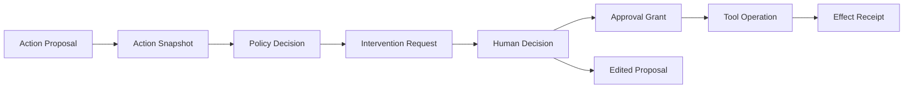
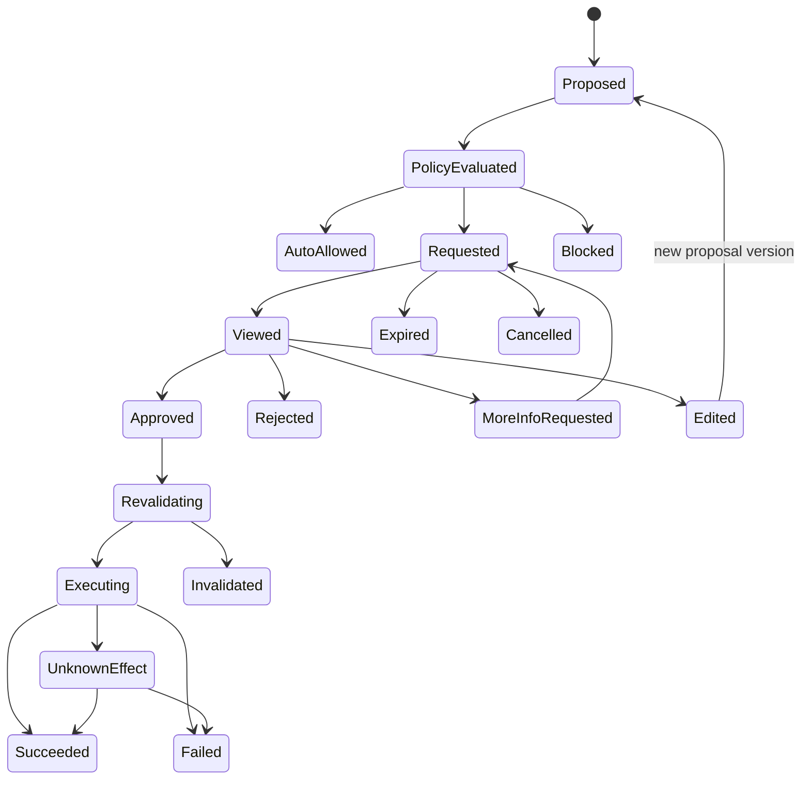
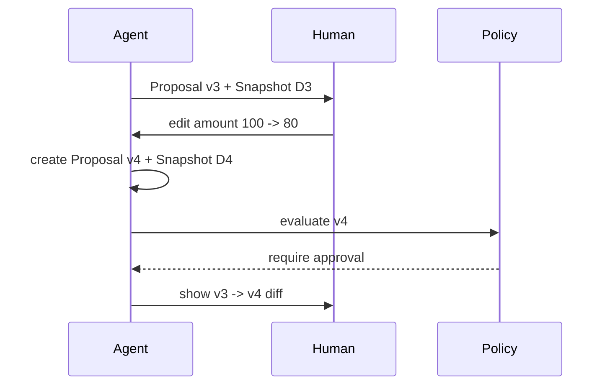
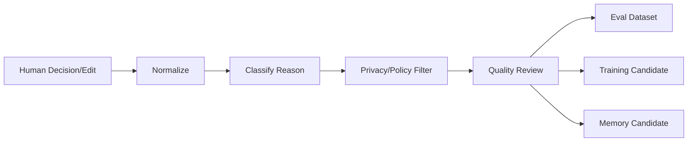

# Human-in-the-loop 与交互控制

> 导航：[总目录](../README.md) | [执行平面](README.md) | [Agent 架构](../01-控制平面/01-Agent架构.md) | [工具协议](01-工具调用与协议.md) | [状态管理](../02-数据平面/04-状态管理与持久化.md) | [运行时](04-Agent运行时与平台工程.md) | [安全治理](../04-保障平面/03-安全权限与治理.md)

> 调研基线：2026-08-06。HITL API、Agent Workflow 框架和监管要求持续变化；具体行业的审批、Consent、电子签名和责任主体应以适用法律及组织制度为准。

---

## 0. 本章怎么读

Human-in-the-loop（HITL）不是“模型没把握时问一句”，而是 Agent 自治边界中的正式控制协议。它需要明确触发条件、审批对象、决策权限、证据、有效范围、状态持久化、恢复校验和审计责任。

推荐阅读顺序：

1. 第 1～4 节区分介入类型、自治等级和风险决策。
2. 第 5～9 节掌握 Approval 对象、状态机、快照、Diff 和参数修改。
3. 第 10～15 节掌握审批人选择、多方审批、长等待、恢复和批量授权。
4. 第 16～22 节处理确认疲劳、反馈治理、指标、故障、案例和检查表。
5. 最后通过实践任务和 48 道面试题检验是否能落地。

### 0.1 最需要掌握的十二个重点

| 优先级 | 重点 | 掌握标准 |
|---|---|---|
| P0 | 介入类型 | Clarify、Confirm、Approve、Review/Edit、Exception、Takeover 不混用 |
| P0 | 风险决策 | 风险由动作、参数、对象、环境、数据、可逆性和主体共同决定 |
| P0 | Action Snapshot | 审批绑定不可变动作快照和 Payload Digest，修改后重新评估 |
| P0 | Authority | 审批人必须有业务决策权，登录身份不等于有权批准 |
| P0 | Durable Interrupt | 等待数小时/数天不占 Worker，状态、Deadline 和事件可恢复 |
| P0 | Resume Revalidation | 恢复时重查权限、策略、对象版本、审批有效期和外部效果 |
| P1 | Separation of Duties | 提议、审批、执行、验证可由不同主体承担 |
| P1 | Evidence-first UX | 展示目标、对象、参数、Diff、来源、影响、撤销和未知项 |
| P1 | Edit Semantics | 用户修改参数不是“同意”，而是新版本 Proposal |
| P1 | Fatigue Control | 按风险和计划边界合并，不用全量弹窗掩盖模型风险 |
| P1 | Feedback Governance | Approval/Reject/Edit 不直接当训练标签或长期记忆 |
| P2 | Evaluation | 同时衡量漏审批、过度审批、延迟、修改、撤销和用户理解 |

### 0.2 核心结论

1. **审批是对具体动作的有限授权，不是给 Agent 一张长期通行证。**
2. **身份认证、系统权限、业务授权、用户 Consent 和风险审批是不同控制。** 任何一个都不能自动替代另一个。
3. **审批必须绑定不可变 Action Snapshot。** 收件人、金额、文件、环境或可见范围发生实质变化后，旧审批失效。
4. **“允许/拒绝”不是唯一交互。** 高质量 HITL 还包括澄清、编辑、选择方案、提供例外信息和人工接管。
5. **等待不是 Sleep。** 必须持久化 Interrupt/Wait Condition，由 Signal/Event 唤醒。
6. **恢复不是从下一行继续。** 必须重新校验外部世界和授权条件，防止过期审批执行新状态。
7. **审批通过不等于执行成功。** 执行仍需幂等、错误处理和 Effect Verification。
8. **降低打断率不能以漏掉高风险动作为代价。** 目标是风险校准，而不是追求更高自动化率。

---

## 1. 模块定位与关键边界

### 1.1 HITL 解决什么

- 目标或参数歧义需要用户补充。
- 动作超出预授权或风险阈值。
- 高价值、不可逆、外部可见或受监管行为需要责任主体决定。
- 模型产物需要专业审阅、编辑或签署。
- 工具结果未知、策略冲突或异常需要人工裁决。
- 自动化不再可靠，需要人类接管环境。

### 1.2 五类控制不要混用

| 控制 | 回答的问题 | 示例 |
|---|---|---|
| Authentication | 你是谁？ | 登录、MFA、Service Identity |
| Authorization/IAM | 你是否拥有系统权限？ | `invoice.write`、仓库 Admin |
| Business Approval | 组织是否同意这个动作？ | 经理批准 10 万元采购 |
| User Consent | 数据主体是否同意特定处理？ | 允许把文件发送给第三方模型 |
| HITL Risk Confirmation | 是否在理解影响后继续这次动作？ | 确认向 2,000 客户发信 |

一个用户可能拥有系统权限，但按制度仍需双人审批；反之，审批通过后执行主体仍必须有目标系统权限。

### 1.3 模型置信度不是唯一触发器

低置信度适合触发 Clarification/Review，但高风险动作即使模型置信度 99% 也可能必须审批。风险策略不能简化为 `if confidence < 0.7 ask_user()`。

---

## 2. 六类人工介入

| 类型 | 触发 | 人类输入 | 典型后续 |
|---|---|---|---|
| Clarification | Goal/Slot/Constraint 歧义 | 补充事实、选择解释 | 重新编译目标/计划 |
| Confirmation | 将产生可理解的外部影响 | Continue/Cancel/Modify | 执行或生成新 Proposal |
| Approval | 权限、金额、合规或职责要求 | Approve/Reject/Delegate | 策略重新决策后执行 |
| Review/Edit | 文案、合同、代码、诊断需专业判断 | Patch、批注、选择版本 | 新 Artifact/Proposal |
| Exception Handling | 状态冲突、工具结果未知、策略例外 | 选择处置和理由 | Reconcile/Compensate/Abort |
| Takeover | 自动化风险过高或环境不确定 | 人工操作环境 | 重新观察、继续或结束 |

### 2.1 Clarification 与 Approval 的区别

Clarification 是获取缺失信息，不应暗含用户批准副作用。例如“收件人是谁？”的回答不能同时被解释为“同意发送”。系统应在参数完整后形成 Action Snapshot，再按风险决定是否需要 Confirmation/Approval。

### 2.2 Review/Edit 与直接执行

Review 的对象是草稿或 Diff，用户修改后得到新版本 Artifact。后续发布、发送或合并仍是独立副作用，可能需要再次确认。

### 2.3 Takeover 不是静默切换

接管时要冻结 Agent 动作，交付当前状态、未决副作用、环境和证据。人工结束后生成 Takeover Result，Agent 恢复前重新读取环境，不能假设人类只做了预期一步。

---

## 3. 自治等级与执行模式

### 3.1 自治等级

| 级别 | Agent 权限 | 人工角色 | 适用 |
|---|---|---|---|
| A0 Suggest | 只建议 | 人工全部执行 | 高风险/早期验证 |
| A1 Draft | 可生成草稿/计划 | 人工审阅和提交 | 邮件、合同、代码 |
| A2 Confirm-before-act | 可准备动作 | 关键副作用前确认 | 外部发送、可逆写 |
| A3 Bounded Autonomy | 在预算/范围内自动 | 例外和阈值介入 | 批量低风险运营 |
| A4 Supervised Autonomy | 大部分自动 | 抽检、监控、应急接管 | 成熟、可逆、强验证流程 |
| A5 Policy-constrained | 仅受策略/审计限制 | 事后治理 | 极低风险、机器可验证任务 |

自治等级应按能力、环境和对象分别配置。一个 Agent 可以自动读生产日志，但只能建议生产配置变更；不能给整个 Agent 一个单一“全自动”开关。

### 3.2 预授权边界

Bounded Autonomy 需要显式 Envelope：

```yaml
autonomy_envelope:
  principal_id: "user-42"
  agent_id: "support-agent@7"
  allowed_actions: ["ticket.tag", "ticket.reply_draft"]
  resources: ["queue:consumer-support"]
  constraints:
    max_items_per_hour: 100
    external_send: false
    data_classification: ["internal", "customer_support"]
  expires_at: "2026-08-31T23:59:59+08:00"
  policy_version: "policy-21"
```

超出 Envelope 时不是自动失败，也不是自动扩大权限，而是触发 Approval 或拆为可批准的更小动作。

---

## 4. 风险决策模型

### 4.1 风险不是工具名常量

同一个 `send_email`：给自己发送草稿是低风险；向 10 万外部客户发送含 PII 附件是高风险。风险至少依赖：

```text
Risk = f(Action, Parameters, Target, Environment, Data,
         Reversibility, Scale, Novelty, Principal, Evidence,
         Business State, Policy, Confidence)
```

### 4.2 风险因子

| 因子 | 低风险示例 | 高风险示例 |
|---|---|---|
| 副作用 | 只读查询 | 删除、付款、发布 |
| 可逆性 | 可一键撤销标签 | 无法撤回的外部邮件 |
| 环境 | 沙箱/测试 | 生产/真实资金 |
| 对象 | 自己的草稿 | 客户、员工、公共资源 |
| 规模 | 1 条记录 | 10 万条批量操作 |
| 数据 | 公开信息 | Secret、PII、医疗/财务数据 |
| 金额 | 0 或小额 | 超阈值/累计超阈值 |
| 新颖性 | 已知模板和工具 | 首次对象/新域名/新流程 |
| 验证性 | 可机器验证和撤销 | 结果难验证或不可逆 |
| 主体 | 有明确 Owner | 身份/职责不清 |

### 4.3 风险等级

| 等级 | 默认动作 | 例子 |
|---|---|---|
| R0 | 自动执行并记录 | 公开信息查询、局部计算 |
| R1 | 自动执行，可撤销/通知 | 内部标签、草稿、测试环境写入 |
| R2 | 执行前确认或计划级预授权 | 外部发送、生产可逆写 |
| R3 | 指定角色审批，可能双人 | 大额、批量、权限、公开发布 |
| R4 | 专业人员负责或禁止自动化 | 法律签署、医疗处置、人身安全 |

### 4.4 决策矩阵示例

```yaml
rule: "external_bulk_email"
when:
  action: "email.send"
  recipient_count: {gt: 100}
  recipient_scope: "external"
then:
  risk: "R3"
  intervention: "approval"
  approver_roles: ["campaign_owner", "compliance"]
  quorum: "all"
  require_preview: true
  require_recipient_manifest: true
  max_approval_ttl: "2h"
```

### 4.5 Policy 决策输出

```yaml
policy_decision:
  decision_id: "pd-88"
  action_snapshot_digest: "sha256:..."
  risk_level: "R3"
  outcome: "require_approval"
  reasons:
    - "external recipients > 100"
    - "contains customer PII"
  required_approvals:
    - role: "campaign_owner"
    - role: "compliance"
  policy_version: "policy-21"
  expires_at: "2026-08-06T12:00:00+08:00"
```

---

## 5. HITL 对象模型

### 5.1 对象关系



### 5.2 ActionProposal

```yaml
proposal_id: "prop-88-v3"
run_id: "run-88"
step_id: "step-refund"
version: 3
action: "payment.refund"
actor: "agent:refund-agent@5"
subject: "user-42"
target:
  payment_id: "pay-19"
parameters:
  amount_minor: 10000
  currency: "CNY"
  reason: "duplicate charge"
environment: "production"
input_refs: ["artifact://refund-analysis-v2"]
expected_effect:
  summary: "退回 100.00 CNY 至原支付方式"
  reversibility: "not_reversible"
evidence_refs: ["evidence://order-88", "evidence://payment-pay19"]
proposal_digest: "sha256:..."
```

### 5.3 InterventionRequest

```yaml
intervention_id: "hitl-91"
type: "approval"
proposal_id: "prop-88-v3"
action_snapshot_id: "snap-91"
action_snapshot_digest: "sha256:..."
policy_decision_id: "pd-88"
risk_level: "R3"
requested_from:
  roles: ["finance_manager"]
  quorum: 1
presentation:
  summary: "为订单 order-88 退款 100.00 CNY"
  diff_ref: null
  preview_ref: "artifact://refund-preview-v3"
  evidence_refs: ["evidence://..."]
allowed_decisions: ["approve", "reject", "edit", "request_more_info"]
expires_at: "2026-08-06T12:00:00+08:00"
escalation_policy: "approval-escalation-finance-v2"
```

### 5.4 HumanDecision 与 ApprovalGrant

```yaml
human_decision:
  decision_id: "hd-19"
  intervention_id: "hitl-91"
  decision: "approve"
  decided_by: "user-77"
  acting_role: "finance_manager"
  authentication_context: "mfa_recent"
  reason: "重复扣款证据充分"
  decided_at: "2026-08-06T10:20:00+08:00"
  action_snapshot_digest: "sha256:..."

approval_grant:
  grant_id: "grant-19"
  subject: "user-42"
  actor: "refund-agent@5"
  allowed_action: "payment.refund"
  resource: "payment/pay-19"
  constraints:
    amount_minor: 10000
    currency: "CNY"
  scope: "one_operation"
  operation_id: "op-refund-pay19-10000cny"
  expires_at: "2026-08-06T10:50:00+08:00"
  snapshot_digest: "sha256:..."
```

ApprovalGrant 是 Runtime 可验证的授权产物，不应把自然语言“可以”直接送给模型自由解释。

---

## 6. HITL 状态机



### 6.1 关键不变量

- 一个 Decision 只能对应一个 Action Snapshot Digest。
- `edited` 必须生成新 Proposal Version，重新过 Policy。
- `approved` 后不能跳过 Revalidation 直接调用工具。
- `expired`、`cancelled`、`rejected` 的 Grant 不可复用。
- 执行结果和审批决策分别审计，审批通过不能改写为成功。
- `unknown_effect` 进入 Reconcile，不自动重新请求审批并重复执行。

---

## 7. Action Snapshot、Payload Digest 与证据

### 7.1 为什么必须冻结快照

模型在等待期间可能重新规划，业务对象也可能变化。如果审批只绑定“退款”两个字，Agent 可以在批准后修改金额、对象或环境。因此审批对象应包含：

- 工具/动作和版本。
- 目标资源、租户和环境。
- 关键参数和默认值展开后的规范形式。
- 文件/Recipient/Record Manifest 的 Artifact Digest。
- 数据分类和外发目的。
- 预期 Effect、规模、成本和可逆性。
- 证据、Diff、Preview 和来源版本。
- Policy Version、主体和 Agent Version。

### 7.2 Canonicalization

Digest 前要做稳定规范化：字段排序、默认值展开、金额使用最小货币单位、时间转 UTC、文件使用 Digest、列表排序规则明确。否则等价参数会产生不同 Digest，或不同语义被错误视为相同。

```text
snapshot_digest = SHA256(
  canonical_json(action, target, parameters, environment,
                 manifests, expected_effect, policy_context)
)
```

### 7.3 审批展示不是只显示 Digest

Digest 用于机器绑定，人类界面必须显示可理解的事实：做什么、对谁、多少、在哪里、用哪些数据、影响范围、证据、可否撤销、失败会怎样。隐藏参数和展开后的默认值也应展示。

---

## 8. Evidence-first 交互设计

### 8.1 审批卡片结构

```text
动作：向 326 个外部客户发送“服务升级通知”
发送账号：support@example.com
收件人：manifest-v7（新增 5、删除 2）
附件：upgrade-guide-v3.pdf，SHA256 ...
数据：包含客户姓名与合同等级（PII）
影响：外部不可撤回；预计费用 3.26 元
证据：工单 CMP-88、法务模板 LEGAL-7
验证：发送后记录 Provider Message IDs
选择：批准 / 修改 / 拒绝 / 查看完整 Diff
```

### 8.2 预览与 Diff

- 文本：语义摘要 + 精确 Diff + 最终渲染预览。
- 代码：文件 Diff、测试、静态检查、依赖变化和权限影响。
- 数据：受影响行数、样本、聚合、过滤条件和回滚计划。
- 配置：环境、字段变化、默认值和预期资源影响。
- Browser：页面、账号、目标对象、表单摘要和截图。

### 8.3 不确定性披露

只展示模型“自信度 82%”通常没有帮助。应展示具体未知：收件人列表有 3 条无法验证、订单状态在 20 分钟前读取、退款 Provider 当前延迟、某附件来自外部上传。

### 8.4 可访问性与移动端

高风险审批不应在窄屏上截断关键参数；金额、环境、收件对象和附件应固定显著展示。屏幕阅读器需要结构化标签，不能只靠颜色表达风险。

---

## 9. 修改、拒绝与重新提议

### 9.1 用户修改参数



用户编辑可能降低或提高风险。系统必须重新计算 Policy，而不是把修改视为对旧动作的批准。

### 9.2 拒绝后的行为

拒绝默认终止该 Proposal，不代表 Agent 可以换一个等价工具绕过。Runtime 应记录 Rejected Intent Fingerprint；重新计划若仍产生实质相同动作，应展示为新提议并说明变化。

### 9.3 Request More Info

审批人可以要求证据、影响分析或替代方案。该请求应成为持久化子任务，完成后回到同一 Intervention Thread，并明确 Snapshot 是否变化。

---

## 10. 审批人选择、代理审批与职责分离

### 10.1 Approver Resolution

审批人不应由模型自由填写。Resolution 依据组织目录、资源 Owner、角色、金额阈值、地域、数据分类和请假/代理规则：

```yaml
approver_resolution:
  policy: "finance-refund-r3-v4"
  candidates:
    - principal_id: "user-77"
      role: "finance_manager"
      authority_scope: "region-cn"
      available: true
  excluded:
    - principal_id: "user-42"
      reason: "requester cannot self-approve"
```

### 10.2 Separation of Duties

可分离的角色：

- Requester：提出业务目标。
- Agent/Preparer：准备动作和证据。
- Approver：做业务风险决定。
- Executor：持有目标系统执行权限。
- Verifier/Auditor：验证效果和审计。

高风险流程不允许同一主体同时提出、批准和验证。Agent 不能以“代表用户”身份绕过 Self-approval 限制。

### 10.3 代理审批

代理关系必须来自可信组织系统，包含范围、时间、原因和禁止代理的动作。不能通过聊天消息“我让同事替我批”临时扩大权限。

### 10.4 Break-glass

紧急例外需要更强认证、显式理由、短 TTL、最小 Scope、实时告警和事后复核。Break-glass 不应成为普通超时的默认降级。

---

## 11. 多人审批、阈值与投票语义

### 11.1 常见策略

| 策略 | 示例 | 风险 |
|---|---|---|
| All-of | 财务 + 合规都批准 | 任一缺席导致阻塞 |
| Any-of | 3 位值班经理任一人 | Authority 需等价 |
| M-of-N | 5 位委员中 3 人 | 处理撤回和顺序 |
| Ordered | 直属经理后财务 | 前序结果可能影响后序 |
| Threshold | 金额越高层级越高 | 防拆单绕阈值 |
| Veto | 安全/合规可否决 | Veto 范围需明确 |

### 11.2 聚合状态

```yaml
approval_aggregate:
  approval_id: "agg-88"
  snapshot_digest: "sha256:..."
  policy: "all_of"
  requirements:
    - role: "business_owner"
      status: "approved"
    - role: "compliance"
      status: "pending"
  final_status: "pending"
  version: 6
```

每个 Decision 幂等写入，使用 Approval Version/CAS 防并发覆盖。任一修改 Snapshot 后，所有旧 Decision 默认失效，除非策略明确允许某些非实质字段变化。

### 11.3 防拆单

金额/规模阈值应考虑同一主体、目标、时间窗和业务意图的累计值，防把 10 万元拆成十笔 1 万元绕过审批。

---

## 12. Durable Interrupt 与长时间等待

### 12.1 等待模型

```yaml
wait_condition:
  wait_id: "wait-hitl-91"
  run_id: "run-88"
  type: "human_decision"
  correlation_key: "hitl-91"
  expected_events: ["approved", "rejected", "edited", "expired"]
  created_at: "2026-08-06T10:00:00+08:00"
  deadline: "2026-08-07T10:00:00+08:00"
  resume_node: "revalidate_approval"
  state_version: 71
```

等待时应释放 Worker、模型连接、沙箱和数据库锁，只保留持久化状态、Timer 和订阅。LangGraph Interrupt、Temporal Signal/Update、Microsoft Agent Framework Workflow 的 Human-in-the-loop 都体现了这一原则，但具体 Replay/Checkpoint 语义不同。

### 12.2 Signal 早到与重复

- Human Decision 先于 Wait 创建时，事件先写 Inbox/Event Store，Wait 创建后匹配。
- 相同 `decision_id` 重复提交应幂等返回原结果。
- 同一审批同时收到 Approve/Reject，按 Version/CAS 和策略裁决，不能最后写覆盖。
- Event 乱序时以 Approval Version、Occurred At 和最终聚合状态判断。

### 12.3 超时与升级

超时策略可选：Expire、提醒、升级到上级、转值班人、降级为草稿、取消任务。高风险动作不能因为超时自动批准。

```text
pending -> remind -> escalate -> expire
```

Timer 和通知也需幂等，避免审批人收到重复轰炸。

---

## 13. 恢复前重新校验

审批可能等待数小时或数天，期间外部世界会变化。执行前至少检查：

1. Grant 未过期、未撤销、未消费。
2. Approver 当时和现在都拥有所需 Authority，策略是否要求重新审批。
3. Subject/Agent/Executor 身份和 Scope 仍有效。
4. Action Snapshot Digest 与即将执行参数完全一致。
5. 业务对象版本、状态、金额、库存或代码基线未变化。
6. Artifact、收件人 Manifest 和附件 Digest 未变化。
7. Policy、风险和环境未发生要求升级的变化。
8. Operation 是否已被其他人或自动流程执行。

### 13.1 Revalidation 输出

```yaml
revalidation:
  grant_id: "grant-19"
  snapshot_match: true
  authority_valid: true
  policy_compatible: true
  object_version_match: false
  operation_already_applied: false
  outcome: "invalidate_and_repropose"
  reasons: ["payment status changed from settled to disputed"]
```

### 13.2 哪些变化必须重新审批

- 目标、收件人、金额、环境、文件/代码版本、权限范围变化。
- 可逆动作变为不可逆，规模跨阈值，数据分类升高。
- 审批策略版本认为风险提高。
- Approver 权限撤销或 Grant 过期。

纯展示格式、无语义的字段顺序变化可通过规范化避免无谓重批。

---

## 14. 批量审批、计划级授权与撤销

### 14.1 为什么需要批量

逐 Tool Call 弹窗会造成确认疲劳。可在一个 Plan Phase 内批准同质、可枚举的动作集合：

```yaml
batch_scope:
  action: "ticket.tag"
  targets_ref: "artifact://ticket-manifest-v5"
  allowed_tags: ["billing", "duplicate"]
  max_items: 200
  environment: "production"
  expires_at: "2026-08-06T18:00:00+08:00"
```

Manifest、约束和最大规模必须冻结。Agent 不能把审批扩展到新对象或新 Tag。

### 14.2 Plan-level Approval

适合步骤和副作用可预见的流程。审批卡片展示计划、每类动作、对象范围、最大成本、停止条件和需再次审批的边界。执行中计划发生实质变化时回到审批。

### 14.3 撤销

- 未消费 Grant 可立即撤销。
- 已开始 Operation 只能请求取消，最终结果取决于工具状态。
- 已完成副作用需要业务撤销/补偿，不是“撤销审批”。
- 撤销事件应触发所有 Pending Worker 重新校验。

---

## 15. SLA、通知与组织运营

### 15.1 SLA 分层

| 风险/场景 | 示例 SLA | 超时处理 |
|---|---|---|
| 在线确认 | 5 分钟 | 取消/保存草稿 |
| 团队审批 | 4 小时 | 提醒并升级 |
| 合规审查 | 1 工作日 | 保持等待或转人工流程 |
| 紧急生产事件 | 10 分钟 | 值班升级/Break-glass |

### 15.2 通知内容

通知只传摘要和安全链接，不在邮件/IM 中暴露完整 PII、Secret 或可伪造的一键批准 Token。进入审批页面后重新认证，敏感动作要求 Recent MFA。

### 15.3 队列运营

- 按风险、Deadline、业务价值和等待时长排序。
- 显示重复/关联审批，避免多人处理同一动作。
- 处理离职、请假、组织变更和无 Owner 资源。
- 统计积压年龄、SLA 违约、退回原因和瓶颈角色。

---

## 16. Confirmation Fatigue 与风险校准

### 16.1 疲劳来源

- 每个低级 Tool Call 都要求确认。
- 卡片只写“是否继续”，用户无法判断只能机械通过。
- 同一计划重复弹出相同内容。
- 风险提示全部使用最高警告，失去区分度。
- 用户修改一次后系统重复展示无关字段。
- 通知渠道过多、重复提醒。

### 16.2 降低打断的正确方式

1. 低风险、可逆、可验证动作在 Envelope 内自动化。
2. 同质动作使用冻结 Manifest 的批量审批。
3. 将 Tool Call 级审批提升到业务 Action/Plan 级。
4. 默认突出关键变化，完整参数可展开。
5. 记忆有限作用域偏好，但设置 TTL、对象和环境边界。
6. 根据拒绝/编辑/撤销和事故校准策略，而非只优化通过率。

### 16.3 不应使用的优化

- 把高风险动作改成事后通知。
- 将“之前批准过类似动作”视为永久 Consent。
- 为降低延迟自动选择无权代理审批人。
- 隐藏不确定性、默认勾选批准或使用诱导式文案。

---

## 17. 人工反馈、训练与记忆治理

### 17.1 Decision 不等于质量标签

批准可能因为时间压力、组织惯例或审批人没看清；拒绝可能是业务状态变化，不代表模型方案普遍错误；编辑可能只改变文风。不能把 `approved=positive`、`rejected=negative` 直接用于训练。

### 17.2 反馈流水线



### 17.3 反馈分类

- Goal/需求理解错误。
- 参数或对象错误。
- 证据不足/过期。
- 风险/权限策略错误。
- 文案和偏好修改。
- 外部状态变化。
- 模型质量或工具故障。
- 组织流程原因。

只有经过归因、去敏、授权和质量复核后，反馈才能进入 Eval/Training。个人偏好进入长期记忆还需满足 Consent、作用域、TTL 和可删除要求。

### 17.4 审批数据污染

Agent 不应学习“某审批人总是通过”并减少提示，也不能把审批理由直接拼入未来其他租户的上下文。训练集需隔离租户、去除 Secret/PII、保留 Policy Version 和任务条件。

---

## 18. 审计、不可抵赖与隐私

### 18.1 Audit Record

```yaml
audit_event:
  event_id: "evt-approval-991"
  event_type: "approval.granted"
  tenant_id: "tenant-7"
  run_id: "run-88"
  intervention_id: "hitl-91"
  snapshot_digest: "sha256:..."
  decision_id: "hd-19"
  principal_id: "user-77"
  acting_role: "finance_manager"
  auth_context: "mfa_recent"
  policy_version: "policy-21"
  occurred_at: "2026-08-06T10:20:00+08:00"
  reason_code: "evidence_sufficient"
```

### 18.2 需要审计什么

- Proposal、Snapshot、Policy Decision、展示版本。
- 谁在何时看到了什么、以什么角色做何决定。
- 是否编辑、补充证据、代理、升级或 Break-glass。
- 恢复时 Revalidation 结果。
- 实际执行参数、Operation、工具结果和 Effect Receipt。
- 拒绝后是否出现等价绕过动作。

### 18.3 隐私和保留

审批记录可能包含合同、医疗、财务和员工数据。UI、通知、Trace 和长期存储应最小化，设置访问控制、地域、保留和删除策略。审计不可篡改不等于所有原始内容永久保留，可保存 Digest 和受控证据引用。

---

## 19. 指标与评测体系

### 19.1 安全与策略

- High-risk Miss Rate：高风险动作未触发所需介入。
- Over-intervention Rate：本可自动的低风险动作被打断。
- Policy Decision Precision/Recall。
- Unauthorized Approver/Expired Grant/Scope Mismatch。
- Snapshot-to-Execution Mismatch，目标应为零。
- Approval Bypass 和 Reject Circumvention。

### 19.2 体验与运营

- Clarification、Confirmation、Approval、Takeover Rate。
- Time to View、Decision Latency、End-to-end Wait Time。
- Approve/Reject/Edit/More-info/Expire/Delegate 比例。
- Approval Queue Age、SLA Violation、Escalation Rate。
- Confirmation Fatigue Proxy：快速通过、未展开详情、连续批量通过。
- 用户理解度：能否正确复述影响、对象和撤销性。

### 19.3 执行闭环

- Approval-to-Execution Latency。
- Revalidation Invalidation Rate 和原因。
- Approved Operation Success/Unknown/Compensation Rate。
- Duplicate Side-effect Rate。
- Takeover 后恢复成功率。
- 审批后参数/Artifact/对象版本变化率。

### 19.4 离线测试 Schema

```yaml
test_case:
  goal: "向客户发送合同修订通知"
  principal: "sales-user"
  policy_version: "p21"
  action:
    recipients: 500
    attachment_class: "confidential"
    external: true
  expected:
    risk: "R3"
    intervention: "approval"
    approver_roles: ["legal", "business_owner"]
    snapshot_fields: ["recipient_manifest", "attachment_digest"]
    forbidden: ["self_approval", "auto_approve_on_timeout"]
```

评测不仅测试“是否弹框”，还测试展示信息、审批人、快照绑定、修改后重批、恢复校验和最终 Effect。

---

## 20. 失败模式与恢复

| 失败 | 风险 | 默认处理 |
|---|---|---|
| 审批服务不可用 | Run 卡住或绕过 | 持久等待/降级为草稿，绝不默认批准 |
| 通知重复 | 疲劳/重复决策 | Event ID 幂等和通知去重 |
| 决策并发冲突 | Approve/Reject 覆盖 | Version/CAS + 聚合规则 |
| 审批过期 | 旧授权执行新状态 | Revalidation 后重新提议 |
| Approver 离职/无权 | 无效授权 | 组织目录校验和重新 Resolution |
| 参数被模型修改 | 审批绕过 | Snapshot Digest 强绑定 |
| 执行超时 | 重复副作用 | Unknown Effect + Reconcile |
| 用户接管后环境变化 | Agent 继续旧计划 | 恢复前重新观察/Replan |
| 策略升级 | 旧 Grant 风险不足 | 定义兼容规则，高风险升级时失效 |
| 审批积压 | 业务延迟 | 优先级、升级、代理、减少不必要介入 |

### 20.1 审批系统自身的可靠性

Approval Store、Event、Timer 和通知需要多副本、备份和审计。审批事件比普通聊天消息更接近业务授权记录，不能只存在 IM 卡片状态中。

### 20.2 审批服务降级

低风险动作可按已有 Envelope 继续；需要审批的动作保持 Pending、输出草稿或转人工系统。绝不能因为审批服务 500 而把 `require_approval` 降级为 `allow`。

---

## 21. 三个完整案例

### 21.1 外部邮件 Campaign

1. Agent 生成正文、Recipient Manifest 和附件 Artifact。
2. Policy 根据外部收件人 5,000、PII 和不可撤回判定 R3。
3. 展示模板 Diff、收件人新增/删除、附件 Digest、发送账号和费用。
4. 业务 Owner 与合规 All-of 批准同一 Snapshot。
5. 等待期间名单更新，Digest 变化，旧 Decision 全部失效。
6. 新版本重新审批，执行时使用稳定 Operation ID。
7. Provider Message ID 和失败名单形成 Effect Receipt。

### 21.2 生产代码修复

1. Coding Agent 在沙箱生成 Patch、测试和风险分析。
2. Review/Edit 允许工程师修改 Patch，生成新 Commit Candidate。
3. CI 通过后，部署到 Staging 在 Envelope 内自动执行。
4. Production 发布需要 On-call + Service Owner，展示 Diff、指标、回滚和窗口。
5. 审批后发现主分支推进，Base Commit 不一致，Revalidation 失效。
6. Agent Rebase、重跑测试并生成新 Snapshot，重新审批。
7. Canary 指标异常触发自动停止和人工异常处置。

### 21.3 大额退款异常

1. 退款金额超过阈值，需要财务经理审批，请求者不得自批。
2. 审批人要求补充支付流水，Agent 完成 Evidence 子任务。
3. 审批通过后支付 API 超时，Operation 进入 Unknown Effect。
4. Runtime 查询 Provider，发现退款已创建，禁止重试。
5. 最终状态成功并写 Receipt；审批记录和执行记录分别保留。

---

## 22. 常见反模式与修正

| 反模式 | 风险 | 修正 |
|---|---|---|
| 只问“是否继续” | 用户不知道具体影响 | 展示 Action Snapshot、证据、Diff 和影响 |
| 审批绑定自然语言摘要 | 参数可被替换 | Canonical Snapshot + Digest |
| 批准后模型还能改参数 | 直接绕过审批 | 修改即新 Proposal，重新 Policy/Approval |
| 有系统权限就无需审批 | 混淆 IAM 与业务责任 | 分离 Authentication/Authorization/Approval |
| 所有 Tool Call 都弹窗 | Confirmation Fatigue | 业务动作/计划级、Envelope 和批量 Manifest |
| 低置信度才 HITL | 高置信高风险仍自动 | 风险和政策为主，置信度为辅 |
| 等待审批占住 Worker | 资源浪费、崩溃丢状态 | Durable Interrupt/Signal/Timer |
| 审批超时自动允许 | 高风险绕过 | Expire/Escalate，默认不批准 |
| Approve 直接当正样本 | 反馈偏差污染训练 | 归因、去敏、质检和独立 Eval |
| 人工接管后继续旧坐标 | 环境已变化 | 重新观察和状态指纹 |
| 只看 Approval Rate | 鼓励机械通过 | 漏审批、编辑、撤销、理解度和 Effect 指标 |

---

## 23. 生产落地检查表

### 风险与策略

- [ ] Clarification、Confirmation、Approval、Review、Exception、Takeover 语义分离。
- [ ] 风险包含参数、对象、环境、数据、规模、可逆性和主体。
- [ ] 自治 Envelope 有 Scope、资源、上限、TTL 和 Policy Version。
- [ ] 低置信度不是唯一触发条件，高风险动作不会因高置信自动执行。

### 对象与绑定

- [ ] Proposal、Snapshot、Policy Decision、Request、Decision、Grant 对象分离。
- [ ] Snapshot 使用规范化参数和 Artifact/Manifest Digest。
- [ ] Human Decision 绑定 Snapshot Digest、身份、角色、时间和理由。
- [ ] 修改参数生成新 Proposal Version 并重新评估。
- [ ] Reject 后不能通过换等价工具绕过。

### 审批人和交互

- [ ] Approver 来自可信组织/资源 Owner 规则，不由模型指定。
- [ ] Self-approval、SoD、代理、M-of-N、Veto 和 Break-glass 明确。
- [ ] UI 展示目标、对象、关键参数、Diff、证据、影响和撤销。
- [ ] 通知不泄露敏感信息，敏感批准要求重新认证/MFA。
- [ ] 批量/计划级审批冻结对象 Manifest 和最大边界。

### 持久化与执行

- [ ] 等待释放 Worker/锁/沙箱，使用 Durable Wait/Signal/Timer。
- [ ] Decision/Event 幂等，可处理早到、重复、乱序和并发。
- [ ] 恢复前重新校验 Grant、Authority、Policy、对象版本和 Operation。
- [ ] Approval 与 Tool Operation 分离，超时进入 Reconcile。
- [ ] Grant 撤销、过期和消费状态能即时传播到 Worker。

### 评测与治理

- [ ] 测量 High-risk Miss 和 Over-intervention，而非只看通过率。
- [ ] 评测修改后重批、过期、策略升级、并发决策和执行未知。
- [ ] 人工反馈经归因、隐私和质量审查后才进入训练/记忆。
- [ ] 审计可重建用户看到了什么、批准了什么和实际执行了什么。
- [ ] 定期分析确认疲劳、SLA、积压、拒绝绕过和事故。

---

## 24. 实践任务

1. 实现邮件草稿 -> Review/Edit -> Snapshot -> Confirm -> Send -> Verify 的完整状态机。
2. 编写风险策略：同时考虑工具、对象、金额、环境、数据分类、规模和可逆性。
3. 实现 Approval Snapshot Canonicalization，验证参数顺序变化不重批、金额变化必须重批。
4. 用 Event Store 模拟 Approve/Reject 并发、Decision 重复、Signal 早到和审批超时。
5. 等待期间修改业务对象、用户权限和 Policy，验证恢复时正确失效。
6. 实现 All-of、M-of-N、Veto、Self-approval 禁止和代理审批。
7. 建立确认疲劳实验：比较 Tool Call 级、Action 级和 Plan 级审批的风险与延迟。
8. 将审批 Edit/Reject 数据经过归因和去敏，构建独立 Eval Set，而非直接训练。

---

## 25. 面试高频题与答题框架

### 基础概念

1. **HITL 为什么不只是失败兜底？**
   答题重点：它是权限、责任、风险和自治边界的正式机制。
2. **Clarification、Confirmation 和 Approval 有什么区别？**
   答题重点：补充信息、理解影响后继续、具备 Authority 的正式授权。
3. **Approval 和 IAM Authorization 有何区别？**
   答题重点：系统权限 vs 对具体业务动作的决策；两者都要满足。
4. **User Consent 与 Approval 有何区别？**
   答题重点：数据主体同意特定处理 vs 组织/业务动作授权。
5. **Review/Edit 为什么不等于执行批准？**
   答题重点：产物版本和外部副作用是不同对象。
6. **Takeover 后 Agent 如何恢复？**
   答题重点：冻结、交接、人工结果、重新观察和 Replan。
7. **模型置信度能否决定是否审批？**
   答题重点：只能辅助；高风险和政策要求独立于置信度。
8. **自治等级应如何设计？**
   答题重点：按动作/环境/对象的 Envelope，不是 Agent 全局开关。

### 风险与策略

9. **哪些动作必须 HITL？**
   答题重点：不可逆、高价值、外部可见、权限、敏感数据、法律/人身风险。
10. **为什么风险不能只按工具名？**
    答题重点：参数、对象、环境、规模、数据和可逆性改变实际风险。
11. **如何设计风险评分或规则？**
    答题重点：可解释因子、硬规则优先、阈值校准、Policy Version 和测试集。
12. **规则和模型风险分类器如何组合？**
    答题重点：确定性硬约束不可被模型覆盖，模型处理语义补充和未知检测。
13. **如何防拆单绕金额阈值？**
    答题重点：按主体/目标/时间窗/业务意图聚合累计风险。
14. **Bounded Autonomy 包含什么？**
    答题重点：动作、资源、上限、环境、数据、TTL、停止条件和策略版本。
15. **策略升级后旧审批是否仍有效？**
    答题重点：定义兼容规则；风险提高或法律要求变化时失效重批。
16. **审批服务故障时如何降级？**
    答题重点：保持 Pending/草稿/转人工，绝不 Fail Open。

### Snapshot 与交互

17. **审批为什么必须绑定 Payload Digest？**
    答题重点：防批准后修改目标、金额、文件和环境。
18. **Snapshot 应包含哪些字段？**
    答题重点：动作、目标、参数、环境、Manifest/Artifact、Effect、Policy 和主体。
19. **Canonicalization 为什么重要？**
    答题重点：稳定等价语义，避免无谓重批或语义碰撞。
20. **用户修改参数后是否需要重新审批？**
    答题重点：新 Proposal 重新 Policy；实质变化必须重批。
21. **如何设计高质量审批卡片？**
    答题重点：做什么、对谁、Diff、证据、影响、可逆性、不确定性和选择。
22. **为什么只展示置信度没用？**
    答题重点：应展示具体未知和证据新鲜度，置信度可能未校准。
23. **如何防止模型绕过用户拒绝？**
    答题重点：Rejected Intent Fingerprint，等价动作重新受控，不能换工具绕过。
24. **批量审批如何保证不越界？**
    答题重点：冻结目标 Manifest、动作集合、最大数量/金额、TTL 和环境。

### 审批人、多方与组织

25. **审批人如何选择？**
    答题重点：组织目录、资源 Owner、角色、金额、地域和可用性，不由模型自由指定。
26. **什么是职责分离？**
    答题重点：Requester、Preparer、Approver、Executor、Verifier 分离。
27. **如何防止 Self-approval？**
    答题重点：真实 Subject/Actor、组织身份和策略检查，Agent 代理不改变主体。
28. **All-of、Any-of、M-of-N 如何选？**
    答题重点：独立专业责任、等价角色、委员会决策和阻塞成本。
29. **代理审批有哪些风险？**
    答题重点：范围/时间/禁止动作、来源可信、不能聊天临时授权。
30. **Break-glass 如何设计？**
    答题重点：强认证、理由、短 TTL、最小 Scope、告警和事后复核。
31. **Approve/Reject 并发如何处理？**
    答题重点：Decision 幂等、Approval Version/CAS、聚合策略和最终态。
32. **Approver 离职后已批 Grant 怎么办？**
    答题重点：恢复时 Authority Revalidation，按政策决定失效。

### Durable Wait 与恢复

33. **等待审批为什么不能 Sleep？**
    答题重点：占资源、崩溃丢状态；应持久化 Wait/Timer/Signal。
34. **Human Signal 早到怎么办？**
    答题重点：先写 Inbox/Event，Wait 创建时匹配。
35. **重复点击批准如何幂等？**
    答题重点：Decision ID、唯一约束、原结果返回。
36. **审批过期如何处理？**
    答题重点：Expire/Escalate/Repropose，不能自动允许。
37. **恢复前为什么要 Revalidate？**
    答题重点：权限、策略、对象、Artifact 和外部 Operation 都可能变化。
38. **审批通过后工具执行失败怎么办？**
    答题重点：Approval 仍是授权；按工具错误处理，必要时在 TTL 内同 Snapshot 重试。
39. **工具超时后是否需要再次审批？**
    答题重点：先 Reconcile；若明确未执行且 Grant 有效可同 Operation 重试，参数变更则重批。
40. **撤销审批与撤销副作用有何区别？**
    答题重点：未消费 Grant 可撤销，已执行需要 Cancel/Compensate。

### 指标、反馈与系统设计

41. **如何避免 Confirmation Fatigue？**
    答题重点：风险分层、Envelope、业务动作/计划级、批量 Manifest、清晰证据。
42. **HITL 最重要的指标是什么？**
    答题重点：High-risk Miss、Over-intervention、Snapshot Mismatch、Latency、Edit/Reject 和 Effect。
43. **Approval Rate 越高越好吗？**
    答题重点：可能是机械通过；需理解度、修改、撤销和事故共同判断。
44. **人工编辑如何进入训练闭环？**
    答题重点：原因归类、去敏、质量审查、租户隔离、Eval 优先。
45. **为什么审批结果不能直接写长期记忆？**
    答题重点：情境性强、可能错误、涉及 Consent/TTL/作用域和隐私。
46. **设计一个企业级 Approval Service。**
    答题重点：Policy、Snapshot、Approver Resolution、Workflow、Event/Timer、Audit、UI、Integration。
47. **如何测试 HITL 系统？**
    答题重点：漏/过度审批、参数变化、并发、过期、策略升级、早到 Signal、执行未知。
48. **讲一次“批准内容与实际执行不一致”事故如何回答？**
    答题重点：Snapshot 缺失、影响、暂停/Reconcile、Digest 绑定、回归和审计修复。

更多社区问题见[社区面经与真题：项目与安全追问](../05-实践路线/06-社区面经与真题.md#8-评测可观测性与业务价值)和[状态/线上可靠性](../05-实践路线/06-社区面经与真题.md#7-状态后端工程与线上可靠性)。

---

## 26. 资料与项目

### HITL 与 Durable Workflow

- [LangGraph Interrupts](https://docs.langchain.com/oss/python/langgraph/interrupts)：在节点中暂停、持久化和通过 `Command(resume=...)` 恢复。
- [LangGraph Persistence](https://docs.langchain.com/oss/python/langgraph/persistence)：Checkpoint、Thread 和 State History。
- [OpenAI Agents SDK Human-in-the-loop](https://openai.github.io/openai-agents-python/human_in_the_loop/)：工具审批、暂停/恢复和 Run State 序列化。
- [Temporal Workflow Message Passing](https://docs.temporal.io/encyclopedia/workflow-message-passing)：Signal、Query、Update 以及异步/同步消息语义。
- [Temporal Handling Messages](https://docs.temporal.io/handling-messages)：Handler 并发、原子性、完成和幂等注意事项。
- [Microsoft Agent Framework Human-in-the-loop](https://learn.microsoft.com/en-us/agent-framework/workflows/human-in-the-loop)：Workflow Request/Response 和人工等待/恢复模式。
- [Microsoft Agent Framework Checkpoints](https://learn.microsoft.com/en-us/agent-framework/workflows/checkpoints)：Checkpoint、Rehydrate、Resume 和状态安全。

### 风险、治理与人因

- [NIST AI Risk Management Framework](https://www.nist.gov/itl/ai-risk-management-framework)：Govern、Map、Measure、Manage 风险框架。
- [NIST AI RMF Playbook](https://airc.nist.gov/AI_RMF_Knowledge_Base/Playbook)：风险治理行动建议。
- [OWASP Top 10 for LLM Applications](https://genai.owasp.org/llm-top-10/)：Excessive Agency、Prompt Injection 和系统风险。
- [MCP Security Best Practices](https://modelcontextprotocol.io/specification/2026-07-28/basic/security_best_practices)：授权、委派、Token 和 Confused Deputy。
- [Google PAIR Guidebook](https://pair.withgoogle.com/guidebook/)：人机交互、解释和错误设计参考。

### 相关项目

- [LangGraph](https://github.com/langchain-ai/langgraph)：Checkpoint/Interrupt 型 Agent Workflow。
- [Temporal](https://github.com/temporalio/temporal)：Durable Execution、Signal、Timer 和可靠 Activity。
- [Microsoft Agent Framework](https://github.com/microsoft/agent-framework)：Agent 与 Workflow 编排参考。

阅读框架文档时重点核对：中断是否持久、恢复从哪里开始、节点是否重放、Signal 是否去重、批准内容如何绑定 Tool Arguments、等待时是否释放资源，以及框架是否替你实现了业务授权和幂等。通常答案是“只实现其中一部分”。

---

## 27. 本章与其他模块的边界

| 问题 | 本章回答 | 深入模块 |
|---|---|---|
| 何时让人介入、批准什么、如何恢复 | 风险、Snapshot、Decision、Grant、Wait 和 Revalidation | 本章 |
| Goal、自治等级和 Plan 如何产生 Action Proposal | 使用 Goal/Plan 但不负责生成算法 | [Agent 架构](../01-控制平面/01-Agent架构.md)、[任务规划](../01-控制平面/02-任务规划与推理.md) |
| Tool Arguments、Operation、幂等和 Effect | 将 Grant 绑定执行对象 | [工具调用与协议](01-工具调用与协议.md) |
| Wait/Event/Checkpoint 如何持久化 | 定义 HITL 状态和事件 | [状态管理](../02-数据平面/04-状态管理与持久化.md) |
| Browser/代码执行如何接管和隔离 | 定义 Takeover/Approval 契约 | [沙箱与 Computer Use](02-沙箱与Computer-Use.md) |
| Approval Service 如何部署、伸缩和运营 | 定义对象和 SLA | [Agent 运行时与平台工程](04-Agent运行时与平台工程.md) |
| IAM、Prompt Injection、审计和事件响应 | 实现 HITL 层控制 | [安全治理](../04-保障平面/03-安全权限与治理.md) |
| 介入是否提升质量和安全 | 输出决策、延迟、Mismatch 和 Effect 信号 | [Agent 评测](../04-保障平面/01-Agent评测.md) |

最终判断标准：系统能证明人类看到并批准了与实际执行完全一致的动作；等待期间不占资源，任何权限、策略、对象或文件变化都会在恢复前被发现；拒绝无法被 Agent 绕过，审批服务故障不会 Fail Open，人工数据也不会未经治理污染训练和长期记忆。
