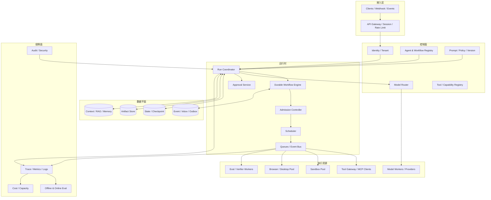
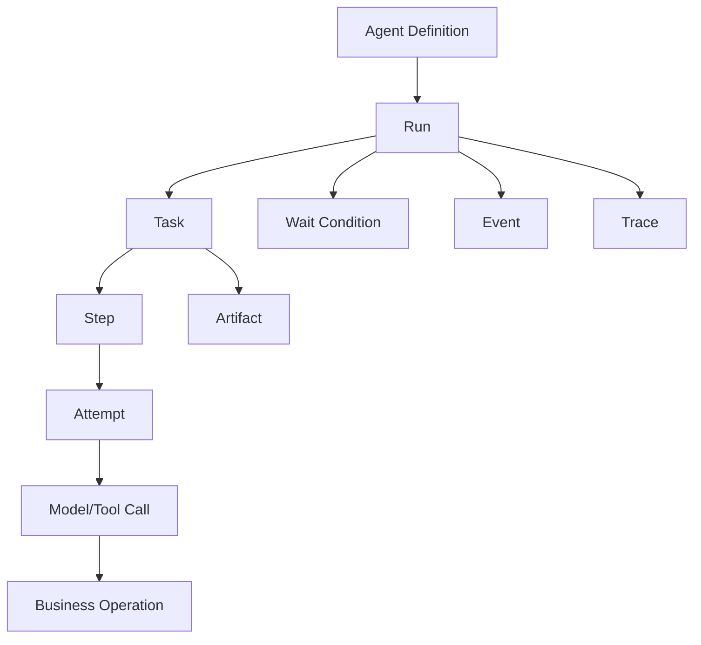
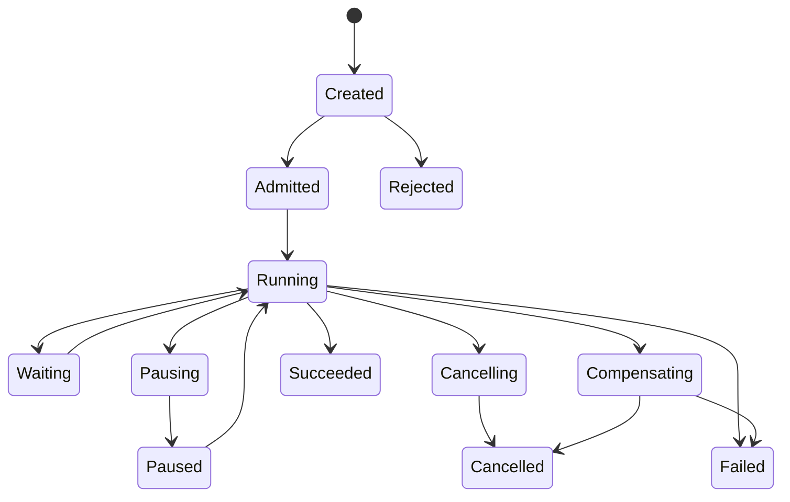
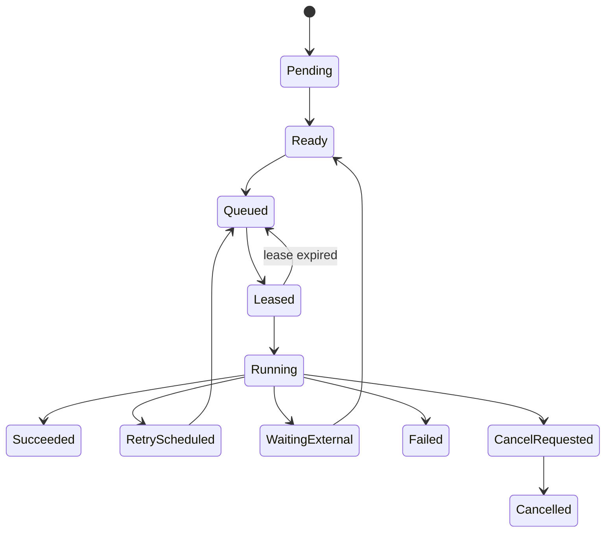
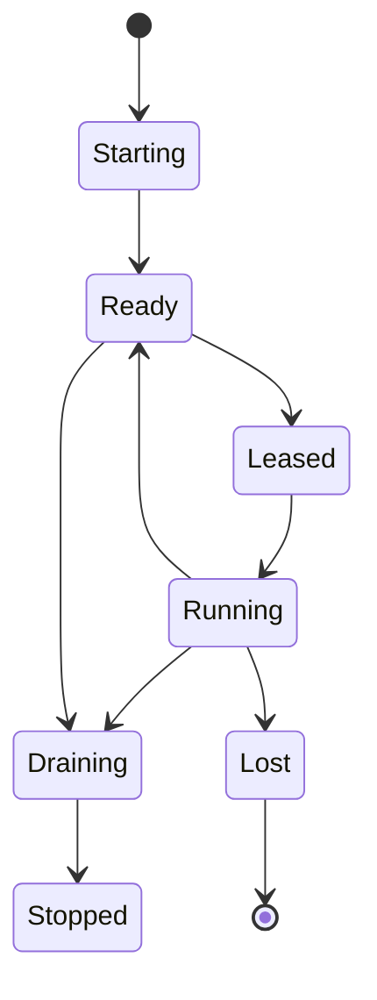
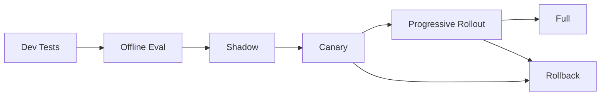

# Agent 运行时与平台工程

> 导航：[总目录](../README.md) | [执行平面](README.md) | [Agent 架构](../01-控制平面/01-Agent架构.md) | [模型路由](../01-控制平面/04-模型路由与推理调度.md) | [状态管理](../02-数据平面/04-状态管理与持久化.md) | [工具协议](01-工具调用与协议.md) | [可观测性](../04-保障平面/02-可观测性.md)

> 调研基线：2026-08-06。Kubernetes、KEDA、Ray、Temporal、LangGraph、Agent Framework 和 OpenTelemetry GenAI 语义持续演进；落地时应核对所选版本的调度、恢复和兼容语义。

---

## 0. 本章怎么读

Agent Runtime 把模型、工具、状态、队列、沙箱、审批、Artifact、评测和可观测组合为可长期运行的生产系统。它不是对某个 Agent SDK 的薄封装，而是 AI 推理平台、Durable Workflow、分布式任务系统和安全执行平台的交叉层。

推荐阅读顺序：

1. 第 1～5 节理解平台边界、参考架构、运行时对象和 API/Event。
2. 第 6～12 节掌握同步/异步、调度、队列、Worker、资源池、多租户和伸缩。
3. 第 13～19 节掌握可靠性、存储、发布、可观测、SLO、成本、安全和灾备。
4. 第 20～24 节完成框架映射、案例、反模式、检查表和实践。
5. 最后用 52 道面试题检验能否独立设计 Agent 平台。

### 0.1 最需要掌握的十四个重点

| 优先级 | 重点 | 掌握标准 |
|---|---|---|
| P0 | Durable Run | HTTP、进程和 Worker 生命周期不决定任务生命周期 |
| P0 | Runtime Objects | Run/Task/Step/Attempt/Call/Operation/Event/Artifact ID 语义分离 |
| P0 | Admission/Backpressure | 资源不足时拒绝、排队或降级，而不是让系统雪崩 |
| P0 | Retry Semantics | 重试绑定幂等、错误类别、预算和 Deadline，不分层放大 |
| P0 | Lease/Fencing | Worker 崩溃、网络分区和长 GC 下不会出现双执行/陈旧提交 |
| P0 | Version Vector | 模型、Prompt、Workflow、Tool、Policy、Schema、Index 都可追溯 |
| P1 | Queue Isolation | 在线、长任务、批处理、高风险和租户有独立服务等级 |
| P1 | Fair Scheduling | Priority、Deadline、Cost、Tenant Quota 和 Aging 联合调度 |
| P1 | Resource Pools | Model、Tool、Sandbox、Browser、Artifact 和 Human Wait 分池治理 |
| P1 | Multi-tenancy | 数据、缓存、凭据、执行、网络、配额和成本均有租户边界 |
| P1 | Autoscaling | 使用 Queue Work、Token、Sandbox/Browser Session 等工作量指标 |
| P1 | Release Safety | Offline -> Shadow -> Canary -> Rollout -> Rollback，Active Run 有策略 |
| P1 | SLO/Cost | 关注 Task Success、Deadline、恢复和 Cost per Successful Task |
| P2 | Reconciliation/DR | Pending Operation、事件、Artifact 和 Active Run 可跨故障恢复 |

### 0.2 核心结论

1. **短请求可以同步，真实 Agent 默认应按 Durable Task 设计。** 只要包含多工具、Browser、代码执行、审批或长检索，就不应依赖单条 HTTP 连接。
2. **排队不是可靠性的替代。** 没有 Admission、Backpressure、Deadline 和 Queue Isolation，队列只会把过载变成更长延迟。
3. **Worker 是可丢弃执行者，状态必须外置。** 崩溃后由 Lease、Checkpoint/Event 和 Reconcile 恢复。
4. **Priority 不等于越高越先。** 需要租户公平、Aging、资源成本和 Deadline，防饥饿与 Noisy Neighbor。
5. **Agent 伸缩不能只看 CPU。** 关键工作量是 Token、模型并发、Queue Work、Sandbox、Browser Session、工具连接和人工等待。
6. **发布单元不只是代码。** Prompt、Tool Schema、Policy、模型路由、Context Compiler 和索引变化都可能让 Active Run 不兼容。
7. **可靠性要围绕业务 Effect。** Task 状态成功、工具 HTTP 200 和真实副作用正确必须分别验证。
8. **单位成本应以成功任务为分母。** 便宜但失败/循环的模型路线可能更贵。

---

## 1. 模块定位：四个平面如何协作

### 1.1 四平面视图

| 平面 | 负责 | 典型组件 |
|---|---|---|
| 控制平面 | Goal、Plan、路由、策略和编排定义 | Agent Registry、Prompt/Workflow、Policy、Model Router |
| 数据平面 | Context、State、Memory、RAG、Artifact | State DB、Event、Vector/Search、Artifact Store |
| 执行平面 | 真正执行模型、工具、沙箱、Browser 和审批 | Runtime、Queue、Worker、Tool Gateway、Sandbox Pool |
| 保障平面 | 评测、观测、安全、发布门禁和优化 | Trace、Metrics、Eval、Audit、Security Operations |

Runtime 位于交汇点：读取控制面定义和数据面状态，调度执行面资源，把完整信号送入保障面。

### 1.2 Framework、Runtime 与 Platform

| 层级 | 作用 | 示例 |
|---|---|---|
| Agent Framework | 开发控制循环、节点、工具和状态图 | LangGraph、OpenAI Agents SDK、Agent Framework |
| Durable Runtime | 持久执行、Timer、Signal、Retry、Worker | Temporal、Dapr Workflow、LangGraph Runtime |
| Agent Platform | 注册、调度、资源池、多租户、发布、观测 | 企业自建平台/托管 Agent 服务 |

框架能表达 Agent，并不代表它自动解决多租户、容量、成本、凭据、沙箱、发布和灾备。

---

## 2. 生产参考架构



### 2.1 关键边界

- Gateway 做请求级认证、租户、速率和协议，不保存唯一 Run 状态。
- Coordinator 负责 Run 级控制，不直接持有所有重计算任务。
- Workflow Engine 负责 Durable State/Timer/Signal，不把任意模型调用放在 Replay 逻辑中。
- Scheduler 决定何时、在哪个池执行，不修改业务计划。
- Worker 只执行有界 Attempt，结果写外部状态/Artifact。
- Tool/Sandbox/Browser 通过独立 Gateway 和池隔离高风险能力。
- Trace/Eval 异步消费，但关键 Audit/Event 不可因观测故障丢失。

---

## 3. 运行时对象模型

### 3.1 对象关系



### 3.2 ID 语义

| ID | 重试是否变化 | 用途 |
|---|---:|---|
| `run_id` | 否 | 一次端到端目标执行 |
| `task_id` | 否 | 可调度/依赖的工作单元 |
| `step_id` | 通常否 | 计划或 Workflow 节点 |
| `attempt_id` | 是 | Step 的一次执行尝试 |
| `call_id` | 是 | 一次模型/工具协议调用 |
| `operation_id` | 否 | 稳定业务副作用意图 |
| `wait_id` | 按条件 | Timer/Human/Webhook 等等待 |
| `event_id` | 是 | 一条事实/消息，消费端去重 |
| `artifact_id` | 按版本 | 大输入输出和中间产物 |
| `lease_id` | 是 | Worker 执行权租约 |

### 3.3 RunSpec

```yaml
run_spec_version: 4
run_id: "run-88"
tenant_id: "tenant-7"
principal_id: "user-42"
agent_ref: "agent://refund-assistant@5.2.0"
goal_contract_ref: "goal://run-88-v2"
input_refs: ["artifact://case-991-v1"]

service_class: "interactive"
priority: 70
deadline: "2026-08-06T10:30:00+08:00"

budget:
  max_wall_time_seconds: 1800
  max_model_tokens: 200000
  max_tool_calls: 50
  max_sandbox_seconds: 900
  max_cost_usd: 5.0

version_vector:
  workflow: "refund-workflow@8"
  prompt: "refund-prompt@31"
  context_compiler: "ctx@12"
  model_policy: "model-route@7"
  toolset_policy: "tools@18"
  security_policy: "security@21"
  state_schema: 4
  eval_policy: "eval-gate@9"

execution_policy:
  allow_async: true
  allow_human_wait: true
  cancellation: "cooperative"
  failure_mode: "safe_stop"
```

### 3.4 Task/Attempt

```yaml
task:
  task_id: "task-verify-payment"
  run_id: "run-88"
  kind: "tool"
  dependencies: ["task-load-order"]
  queue_class: "tool-read"
  resource_request:
    tool_namespace: "payments"
    expected_duration_ms: 1000
  state: "queued"
  max_attempts: 3
  retry_policy_ref: "retry://tool-read-v2"

attempt:
  attempt_id: "att-2"
  task_id: "task-verify-payment"
  lease_id: "lease-991"
  worker_id: "worker-tool-17"
  fence_token: 73
  started_at: "2026-08-06T10:00:01+08:00"
  heartbeat_at: "2026-08-06T10:00:02+08:00"
  result_ref: null
```

### 3.5 状态与 Source of Truth

Run/Task/Attempt 状态由 Runtime Store 管理；订单、支付、代码和文件由各自业务系统/Artifact Store 管理。Runtime 不通过模型自述更新最终状态，而依据结构化 Result、Event 和 Verifier。

---

## 4. Run、Task 与 Operation 状态机

### 4.1 Run 状态机



### 4.2 Task 状态机



### 4.3 状态转换契约

每个转换至少包含：Expected State/Version、Actor、Guard、Event、Timestamp、Reason、Version Vector 和可能的 Outbox Message。转换与 Event/Outbox 尽量同事务提交。

```sql
UPDATE tasks
SET state = 'leased',
    lease_id = :lease_id,
    lease_expires_at = :expires_at,
    fence_token = fence_token + 1,
    version = version + 1
WHERE task_id = :task_id
  AND state = 'queued'
  AND version = :expected_version;
```

---

## 5. API、事件与客户端契约

### 5.1 创建 Run

```http
POST /v1/runs
Idempotency-Key: req-user42-goal991
```

```json
{
  "agent": "refund-assistant@5.2.0",
  "goal": "处理订单 order-88 的重复扣款",
  "service_class": "interactive",
  "deadline": "2026-08-06T10:30:00+08:00",
  "input_artifacts": ["artifact://case-991-v1"]
}
```

返回 `202 Accepted + run_id`。创建请求本身也应幂等，避免客户端超时重复创建两个 Run。

### 5.2 常用 API

```text
POST   /runs
GET    /runs/{run_id}
GET    /runs/{run_id}/events?after=cursor
POST   /runs/{run_id}:cancel
POST   /runs/{run_id}:pause
POST   /runs/{run_id}:resume
POST   /runs/{run_id}/signals
GET    /runs/{run_id}/artifacts
GET    /operations/{operation_id}
```

### 5.3 Event Envelope

```yaml
event_id: "evt-991"
event_type: "task.attempt.finished"
aggregate_type: "task"
aggregate_id: "task-verify-payment"
aggregate_version: 18
tenant_id: "tenant-7"
run_id: "run-88"
occurred_at: "2026-08-06T10:00:03+08:00"
producer: "worker-tool-17"
trace_context: {trace_id: "...", span_id: "..."}
payload_ref: "artifact://event-payload-991"
schema_version: 3
```

事件消费者必须支持重复、延迟和有限乱序。大 Payload 外置为 Artifact，Event 保留摘要和引用。

### 5.4 客户端进度

客户端可使用 Poll、SSE/WebSocket 或 Webhook。所有方式都基于同一持久 Event Cursor；断线重连从 Cursor 继续，不能把内存流当唯一事实。

---

## 6. 同步、异步、Streaming 与 Callback 边界

### 6.1 选择矩阵

| 模式 | 适合 | 不适合 |
|---|---|---|
| 同步 | 秒级只读、单模型/单工具、可快速失败 | Browser、审批、长检索、多工具 |
| Async Run | 多步骤、长任务、可暂停恢复 | 极低延迟逐 Token 交互可叠加 Streaming |
| Streaming | Token、事件、阶段结果 | 作为唯一状态或可靠消息通道 |
| Callback/Webhook | 系统集成、长 Operation | 未验签、无去重、客户端不稳定场景 |

### 6.2 同步转异步

Gateway 可以在短预算内等待：

```text
create Run -> wait up to 8s
if completed: 200 result
else: 202 run_id + event cursor
```

Run 不因 HTTP 客户端断开而自动取消，除非请求显式声明 `cancel_on_disconnect` 且副作用语义安全。

### 6.3 Streaming 背压

Token/Event 生产速度可能超过客户端消费。需要缓冲上限、丢弃可重建增量、保留关键状态 Event、断开慢消费者。关键 Tool Result 和审批事件不能只存在 Streaming 帧中。

### 6.4 Callback 安全

- 注册目标时验证 Ownership，不允许任意内网 URL。
- 事件签名、Timestamp、Nonce/Event ID 和重放保护。
- 指数退避、有界重试和 DLQ。
- Callback 失败不回滚已完成 Run，只影响通知状态。

---

## 7. Admission Control 与 Backpressure

### 7.1 为什么在入队前控制

如果模型 Provider 已限流、Sandbox 池耗尽、队列等待超过 Deadline，继续接收请求只会制造超时和重试风暴。Admission 应估计任务工作量和资源可用性。

### 7.2 Admission 输入

- Tenant Quota 和当前使用量。
- Service Class、Priority、Deadline。
- 预估 Model Tokens/Calls、Tool、Sandbox、Browser 和 Artifact。
- Queue Work、P95 Service Time、Provider Rate Limit。
- 风险/地域/模型/数据策略能否找到合适资源池。
- 系统 Degradation/Circuit 状态。

### 7.3 结果

```yaml
admission_decision:
  outcome: "queue"
  queue: "interactive-standard"
  estimated_start_seconds: 4.2
  reserved_budget:
    model_tokens: 50000
    sandbox_slots: 1
  degradation:
    allowed: true
    policy: "use_small_model_for_planning"
  expires_if_not_started_at: "2026-08-06T10:05:00+08:00"
```

可能结果：Admit Immediately、Queue、Degrade、Reject/429、Ask Client to Retry、Route Region/Provider。不能默默降低安全隔离或跳过审批。

### 7.4 Backpressure 链

```text
Provider/Tool/Sandbox saturation
-> Worker concurrency limit
-> Queue growth
-> Scheduler slows dispatch
-> Admission reduces acceptance
-> Client receives retry/estimated wait
```

每层都无限缓冲会让尾延迟不可控；每层都重试会放大故障。

---

## 8. 队列、优先级、公平与 Deadline 调度

### 8.1 Queue Partition

建议至少分离：

- Interactive vs Batch/Long-running。
- Model、Tool、Sandbox、Browser、Eval 等资源类型。
- Read vs Write/High-risk。
- Region/Data Residency。
- Premium/Standard Service Class。
- 必要时大租户 Dedicated Queue/Pool。

### 8.2 调度目标

一个简化优先分数：

```text
score = w1 * normalized_priority
      + w2 * deadline_urgency
      + w3 * queue_age
      + w4 * service_class
      - w5 * estimated_cost
      - w6 * tenant_over_share
```

实际系统常使用 Weighted Fair Queuing/Deficit Round Robin 保证租户份额，再在租户内按 Priority/Deadline/Aging 排序。

### 8.3 Deadline-aware

设预计等待 `W`、服务时间 `S`、剩余 Deadline `D`：

```text
if W + S > D:
    reject / degrade / request extension
```

排队到必然超时再执行是浪费。Scheduler 应在 Dispatch 前重新检查 Deadline 和依赖新鲜度。

### 8.4 Priority Inversion 与饥饿

- Aging 提升等待过久的低优任务。
- 高优任务不能无限抢占已接近完成的昂贵任务。
- 资源锁/共享租约需 Priority Inheritance 或避免持锁长任务。
- 批任务使用剩余容量，但要设置最小份额，防永远不运行。

### 8.5 工作量而不是任务数

一个 1M Token Run 和一个单工具查询不能都计为“1 个任务”。Queue Work 可用：

```text
queue_work_seconds = sum(estimated_service_seconds)
token_work = sum(estimated_input_tokens + output_tokens)
sandbox_work = sum(requested_cpu * expected_duration)
```

---

## 9. Worker、Lease、Heartbeat、Preemption 与 Draining

### 9.1 Worker 生命周期



### 9.2 Lease 与 Fencing

Worker 获取 Task 时获得 Lease 和单调递增 Fence Token。所有结果提交带 Fence Token；即使旧 Worker 在网络分区后恢复，也会因 Token 过期被拒绝。

```text
acquire lease(token=73, ttl=30s)
heartbeat every 10s
commit result only if current fence_token == 73
```

Lease TTL 应大于正常 Heartbeat 抖动，小于故障恢复目标。长 Tool Operation 不应靠 Worker Heartbeat 表示外部业务进度，应使用 Operation Handle/Event。

### 9.3 Heartbeat 内容

```yaml
heartbeat:
  lease_id: "lease-991"
  task_id: "task-12"
  fence_token: 73
  phase: "waiting_model_response"
  progress_units: 42
  resource_usage:
    cpu_seconds: 18.2
    memory_bytes: 912680550
  last_checkpoint_id: "cp-19"
  cancellation_ack: false
```

### 9.4 Preemption

仅对可 Checkpoint、无未决不可幂等副作用的任务安全。Preemption 流程：Request -> Task 到安全点 -> Checkpoint -> Release Lease -> Requeue。直接 Kill 可能留下 Unknown Effect 和临时资源。

### 9.5 Draining

发布/缩容时 Worker 停止接新任务，短任务完成，长任务在 Milestone Checkpoint 后迁移；超过 Grace Period 的任务取消/重新租约。Draining 指标应纳入容量，防滚动发布时可用 Worker 突降。

---

## 10. 资源池设计

### 10.1 Model Pool

- 按 Provider/Model/Region/数据策略/上下文长度路由。
- 管理 RPM/TPM、并发、Batch、KV Cache、Fallback 和成本。
- 区分 Planning、Generation、Embedding、Rerank、Vision 和 Verification。
- 模型路由细节见[模型路由与推理调度](../01-控制平面/04-模型路由与推理调度.md)。

### 10.2 Tool/MCP Pool

- Connection/Client Pool、Server 健康、Capability Version、Circuit Breaker。
- 按租户和身份创建授权上下文，不能跨租户复用 Session Secret。
- 长 Operation 与瞬时 Tool Call 分开计并发。
- Server 级故障快速失败，避免模型循环放大。

### 10.3 Sandbox Pool

- Warm Image/MicroVM Snapshot 降低冷启动。
- Pool Entry 在分配前清洁验证，归还前销毁/残留检查。
- 按隔离等级、CPU/Memory/GPU、Region 和镜像分池。
- 高风险任务不复用包含用户态内存/磁盘的暖实例。

### 10.4 Browser/Desktop Pool

- Browser Binary/Image、Profile、账号/租户、Region 和风险域分离。
- 限制 Tab/Download/Session 时长，回收僵尸进程。
- 登录态是否可持久由 Policy 决定，默认不跨用户共享。

### 10.5 Artifact/Context Pool

Artifact Store 管理大输入输出、版本、生命周期和 Range；Context/RAG 服务管理查询并发和缓存。大文件不应通过 Queue Message 或 State Row 搬运。

### 10.6 Human Wait 不是资源池占用

等待审批的 Run 只占状态、Timer 和少量存储，不占 Worker、Model、Sandbox 或 Browser。必要时销毁环境，恢复时重建并重新校验。

---

## 11. 多租户隔离、配额与 Noisy Neighbor

### 11.1 隔离维度

| 维度 | 要求 |
|---|---|
| Identity | 每个请求和事件带 Tenant/Principal/Actor |
| State | 分区/行级策略/独立库，Cache Key 含租户 |
| Artifact | Bucket/Prefix/Key/ACL 和加密边界 |
| Vector/RAG | 检索前 ACL，不能 Top-k 后过滤 |
| Queue | Tenant Fair Share、并发和 Priority 上限 |
| Sandbox/Browser | 文件、Profile、网络、凭据和销毁隔离 |
| Tool | Scope、资源、环境和 Audience 绑定 |
| Observability | Trace/Log 查询隔离和敏感字段策略 |
| Cost | Token、Tool、Compute、Storage、Egress 按租户归因 |

### 11.2 配额层级

```text
Organization -> Tenant -> Project -> Agent -> User -> Run
```

配额覆盖：Run 创建、并发、Token/RPM/TPM、Tool Calls、Sandbox/Browser Slots、Artifact Bytes、Vector Queries、每日/月成本和高风险 Operation。

### 11.3 Hard、Soft 与 Burst

- Hard Limit：安全/合规/合同不可突破。
- Soft Limit：接近时告警、降级或要求批准。
- Burst Credit：短时超过基础份额，空闲时累积，防长期占用。
- Reservation：关键业务预留最小容量。

### 11.4 Noisy Neighbor

不能只按 API QPS 限流。长上下文、无限循环、批量 Browser、超大 Artifact 和高成本工具都会占用不同资源。需要多维 Usage Ledger 和 Dominant Resource Fairness 思路。

---

## 12. Autoscaling 与容量信号

### 12.1 为什么 CPU 不够

Agent Worker 常在等待模型、工具和网络，CPU 低但队列很长。Autoscaler 应按资源类型使用不同指标。

| 池 | 推荐指标 |
|---|---|
| Coordinator | Active Run、Event Throughput、State DB Latency |
| Model Worker | Pending Tokens、Batch Occupancy、KV Cache、GPU Util/Memory |
| Tool Worker | Queue Work、In-flight、Downstream Limit/Latency |
| Sandbox | Pending Sandbox Work、Warm Slot、Provision P95 |
| Browser | Pending Sessions、Active Tabs、Session Duration |
| Eval Worker | Trace/Eval Lag、Dataset Work |
| Callback | Pending Delivery、Retry Age |

### 12.2 Desired Replicas 示例

```text
desired = ceil(queue_work_seconds / target_drain_seconds / worker_capacity)
```

需要 Min/Max、Cooldown、Scale-up Limit、Warm Pool 和 Provider Quota 上限。KEDA 可基于外部队列指标扩缩 Kubernetes Workload；Ray Serve 更适合请求/Replica 级模型服务伸缩，但 Durable Workflow 状态仍应独立。

### 12.3 冷启动与暖池

MicroVM、Browser、GPU Model 的冷启动远高于普通 Worker。根据到达率、启动时间和 SLO 维持暖池：

```text
warm_capacity >= arrival_rate_peak * cold_start_time * safety_factor
```

暖池会增加成本和残留风险；应使用干净模板，不保留租户状态。

### 12.4 Scale-down 安全

先 Drain，检查 Active Lease、Pending Callback、沙箱/浏览器会话和未刷新的 State；不要依据 CPU 突然杀死持有未决副作用的 Worker。

---

## 13. 可靠性模式与故障收敛

### 13.1 错误分类

| 类别 | 示例 | 默认动作 |
|---|---|---|
| Invalid Input | Schema/参数错误 | 不重试，Repair 或 Clarify |
| Unauthorized | Scope/Policy Deny | 不重试，授权或终止 |
| Transient | 429、短暂 5xx、连接失败 | 有界 Backoff + Jitter |
| Deterministic | 文件不存在、测试失败 | Replan/修复，不原样重试 |
| Capacity | 无 Sandbox/GPU/Provider Quota | Queue/Degrade/Admission |
| Partial | 批量部分成功 | 记录每项、补偿/继续剩余 |
| Unknown Effect | 写请求超时 | Reconcile，禁止盲重试 |
| Systemic | Provider 大面积故障 | Circuit Breaker/Fallback/降级 |

### 13.2 Retry Budget

```text
remaining_attempts
remaining_deadline
remaining_cost
remaining_provider_quota
remaining_no_progress_budget
```

每次 Retry 需同时满足所有预算。上层 Runtime、SDK、HTTP Client 和 Provider 不能各自隐藏重试；应有一个主控策略并记录实际 Attempts。

### 13.3 Circuit Breaker

按 Provider/Region/Model、Tool Server/Operation、Sandbox Image/Node Pool 等粒度统计系统错误。Open 状态快速失败，Half-open 只放探测流量。业务错误不能打开系统熔断。

### 13.4 DLQ 与人工处置

DLQ 不是永久垃圾桶。每条记录包含 Run/Task、Error Fingerprint、Attempts、Payload Ref、Version、Owner、Re-drive Policy 和敏感等级。Re-drive 前检查代码/策略版本和副作用状态。

### 13.5 Reconciler

周期扫描：

- `unknown_effect` Operation。
- Lease 过期但可能仍运行的 Task。
- Outbox 未发送/Inbox 未处理。
- 长时间无进展 Run。
- 未完成 Multipart/Artifact。
- 审批已决但 Run 未恢复。
- Callback 已完成但通知未送达。

Reconciler 是生产正确性的核心后台控制器，不是事故后的临时脚本。

---

## 14. 状态、事件、缓存与 Artifact 存储

### 14.1 存储职责

| 存储 | 保存 | 不应保存 |
|---|---|---|
| State DB | Run/Task/Wait/Version/Lease | 大文件、完整 Trace |
| Event Store/Bus | 状态事实、Signal、Outbox/Inbox | 无界二进制 Payload |
| Artifact Store | 文件、结果、截图、快照、长 Payload | 事务性小状态 |
| Cache | 可重建 Registry/Context/Model 结果 | 唯一业务事实 |
| Trace Store | Span、Log、Metric、Eval 关联 | 业务 Source of Truth |
| Audit Store | 授权、审批、敏感操作证据 | 全量调试噪声 |

### 14.2 一致性策略

- State Transition + Outbox 同事务。
- Consumer 使用 Inbox/Event ID 去重。
- Artifact 先临时写、Digest 校验、原子发布，再在 State 中引用。
- Cache Key 包含 Tenant、Permission、Version 和模型/Prompt 配置。
- 业务对象只保存 Reference + Observed Version，执行前重新查询。

### 14.3 Event 压缩与保留

长 Run 可能产生大量 Token/Progress Event。区分：

- 必须长期保留的状态/审批/副作用事实。
- 可压缩的进度和增量 Token。
- 可采样的调试日志。
- 受隐私保留限制的原始内容。

Checkpoint 加速恢复，但不能替代业务 Event 和 Operation 证据。详细机制见[状态管理](../02-数据平面/04-状态管理与持久化.md)。

---

## 15. 发布、版本向量与 Active Run

### 15.1 发布单元

- Agent/Workflow Code。
- Prompt/System Instruction/Template。
- Model 和路由 Policy。
- Tool 描述、Schema、Adapter 和 Server。
- Context Compiler、Memory/RAG 策略和 Index。
- State Schema/Event Schema。
- Security/Approval/Network Policy。
- Sandbox Image/Browser Version。
- Eval Suite 和 Threshold。

### 15.2 Version Vector

每个 Run 固定完整 Version Vector。不能只记录“agent=v5”，否则无法解释模型路由、工具和策略变化。

### 15.3 发布流水线



门禁至少包含：任务成功、关键能力、安全违规、成本、P95/P99、重复副作用、Unknown Effect 和人工介入变化。

### 15.4 Active Run 策略

| 策略 | 适合 | 风险 |
|---|---|---|
| Pin Old Version | 长任务、强可复现 | 维护多版本成本 |
| Compatible Upgrade | 小兼容修复 | 需严格兼容证明 |
| Migrate State | 大量等待任务 | 迁移复杂、需回滚 |
| Restart from Milestone | 可重建中间结果 | 成本和重复计算 |
| Safe Terminate | 无法安全迁移 | 用户体验和补偿 |

发布时必须考虑等待审批、Pending Operation、Sandbox Snapshot、Callback 和 Tool Schema。旧 Run 不应随机使用新 Prompt/Policy。

### 15.5 Rollback

Rollback 不只是部署旧镜像，还要恢复 Prompt、Model Policy、Toolset、State Adapter 和 Sandbox Image。若新版本已产生外部副作用，只能停止后续流量和补偿，不能通过回滚代码抹掉已发生事实。

---

## 16. 平台可观测性与 OpenTelemetry

### 16.1 Trace 结构

```text
run
  gateway/admission
  agent.step
    context.compile
    model.invoke
    tool.call
      operation.reconcile
    sandbox.execute
    browser.action
    approval.wait
    verifier.check
```

OpenTelemetry GenAI/Agent 语义约定在 2026 年已迁移到独立 `semantic-conventions-genai` 仓库，Agent Spans 仍处于 Development。采用时应固定版本、控制高基数字段和敏感内容，不假设属性永久稳定。

### 16.2 关键属性

```text
tenant.id, user.id_hash, agent.name/version, run.id,
task.id, step.id, attempt.id, operation.id,
gen_ai.provider/model, prompt.version, tool.name/version,
sandbox.profile, policy.version, artifact.id,
token.input/output, cost, queue.wait_ms, retry.count,
effect.status, evaluation.score
```

Prompt、Tool Arguments、网页和文件内容默认不应全量进入 Trace；使用 Digest、摘要、受控采样和安全 Blob 引用。

### 16.3 Metrics 层级

| 层级 | 指标 |
|---|---|
| API | RPS、Error、Latency、Admission/Rejection |
| Run | Success、Deadline、Duration、Cancel、Wait |
| Scheduler | Queue Work/Age、Dispatch、Fair Share、Preemption |
| Worker | Lease Loss、Heartbeat、Attempt、Crash、Drain |
| Model | Tokens、TTFT、Latency、Rate Limit、Cost |
| Tool | Selection、Success、Retry、Unknown、Effect |
| Sandbox/Browser | Provision、Session、OOM、Unsafe Action |
| Data | State/Event/Artifact Latency、Lag、Storage |
| Eval | Quality/Safety/Regression、Canary Delta |

### 16.4 Cardinality 与成本

不要把 `run_id`、完整 URL、Prompt 或用户输入作为低成本 Metrics Label；这些属于 Trace/Log。Metrics 使用受控维度，Trace 通过 ID 深挖。

---

## 17. SLO、容量规划与负载模型

### 17.1 SLI/SLO

| SLI | 定义示例 |
|---|---|
| Run Availability | 可接受请求中成功创建并持久化 Run 比例 |
| Task Success | 满足验收和 Effect 的 Run 比例 |
| Deadline Success | 在用户 Deadline 前达到终态比例 |
| Recovery Success | Worker/Region 故障后正确恢复比例 |
| Duplicate Effect | 重复业务副作用比例，关键场景接近零 |
| Queue Delay | Ready 到 Lease 的 P50/P95/P99 |
| Interactive TTFT | 首个有意义事件/Token 延迟 |
| Approval Resume | Decision 到 Run 恢复延迟 |
| Data Freshness | State/Event/Index/Artifact 的可见延迟 |

### 17.2 延迟预算

```text
End-to-end = Admission + Queue + Context + Model
           + Tool/Sandbox/Browser + Verification + Human Wait
```

Human Wait 应单独报告 Active Processing Time 和 Calendar Time，避免平台性能被审批等待掩盖，也避免把审批 SLA 当计算延迟。

### 17.3 Little's Law

稳定系统近似：

```text
L = λW
```

到达率 `λ`、平均时间 `W` 决定系统中平均任务数 `L`。Agent 任务 Service Time 长且方差大，必须分离长短队列并预留尾部容量。

### 17.4 容量模型

```text
model_capacity = min(provider_RPM, provider_TPM / avg_tokens,
                     local_GPU_throughput / avg_tokens)

sandbox_capacity = slots * utilization_target / avg_duration

browser_capacity = sessions * utilization_target / avg_session_duration
```

容量测试要使用真实任务长度、并行 Fan-out、Tool 延迟、审批和失败重试分布，不能只压单轮 Chat Completion。

### 17.5 Error Budget

质量/安全和可用性都应有预算。若 Duplicate Effect、安全违规或关键 Eval 回归超阈值，应冻结发布，即使 API 可用性仍很好。

---

## 18. 成本模型与 FinOps

### 18.1 成本构成

```text
Run Cost = Model Input/Output/Cache
         + Embedding/Rerank
         + Tool/API
         + Sandbox/Browser/GPU Compute
         + Artifact/Vector/Trace Storage
         + Network Egress
         + Human Review
         + Retry/Failure Waste
```

### 18.2 成本归因

每笔成本关联 Tenant、Project、Agent、Run、Step、Model、Tool 和版本。共享缓存/暖池按使用量或预留份额分摊，避免“平台公共成本”不可解释。

### 18.3 核心指标

- Cost per Successful Task。
- Cost per Accepted/Verified Effect。
- Token/Tool/Sandbox Amplification。
- Retry Waste、No-progress Waste、Abandoned Run Cost。
- Cache Saving、Batch Saving、Warm Pool Idle Cost。
- Human Minutes per Successful Task。

### 18.4 成本控制顺序

1. 消除循环、无效重试和重复检索。
2. 缩小 Context 和 Toolset。
3. 使用模型 Cascade/路由和缓存。
4. 并行化独立步骤但控制 Fan-out。
5. 复用安全的中间 Artifact，不复用敏感隐藏状态。
6. 调整暖池和资源规格。

仅换便宜模型可能降低成功率并增加重试，总成本反而上升。

---

## 19. 安全、灾备与业务连续性

### 19.1 平台安全边界

- 管理面和数据面网络隔离。
- Runtime/Worker 使用 Workload Identity 和最小 Scope。
- Tenant、Principal、Agent、Tool 和 Operation 全链身份链。
- Secret 通过 Broker/Handle，不写 State/Event/Trace。
- 工具、MCP、Callback、Artifact 和 Browser 输入均视为不可信。
- 高风险操作使用 HITL、幂等和独立 Effect Verification。

### 19.2 备份与 RPO/RTO

| 资产 | RPO/RTO 关注 |
|---|---|
| State/Event | Active Run 和 Wait 条件不能丢 |
| Operation/Idempotency | 防灾后重复副作用 |
| Artifact | 输入、产物、Digest、ACL 和版本 |
| Registry/Policy | 精确恢复 Version Vector |
| Audit | 审批和敏感操作证据 |
| Vector/Index | 可重建但恢复时间可能长 |
| Trace | 可允许更高 RPO，但事故证据需保留 |

### 19.3 跨 Region 恢复

1. 停止双主调度，建立 Fencing/Leader。
2. 恢复 State/Event/Operation 和 Registry/Policy。
3. 扫描所有 Active Run、Expired Lease 和 Pending Effect。
4. Reconcile 外部工具状态，不能直接重放。
5. 校验 Artifact、权限、Tombstone 和 Data Residency。
6. 分批恢复低风险 Run，再恢复高风险写操作。

### 19.4 Disaster Drill

演练数据库只读、队列丢连接、Provider 区域故障、Artifact 不可用、Worker 池全失、审批服务故障和整 Region 切换。验收应包括业务 Effect 次数，而不只是服务恢复健康。

---

## 20. 框架与基础设施如何映射

### 20.1 Temporal

适合 Durable Workflow、Activity、Timer、Signal、Retry 和长等待。Workflow 代码需满足确定性/版本约束；模型、工具和网络副作用放 Activity。Temporal 不自动提供 Agent Tool Registry、模型路由、沙箱和业务幂等。

### 20.2 LangGraph

适合 Agent 状态图、Checkpoint、Thread、Interrupt 和恢复。需要明确 Checkpointer 的生产可靠性、节点重放、幂等 Task 和平台多租户；不能把内存 Checkpoint 当完整 Durable Platform。

### 20.3 Microsoft Agent Framework

提供 Agent、Workflow、Executor/Edge、Checkpoint 和 Human-in-the-loop 组合。落地时核对版本成熟度、持久化实现、分布式 Worker、兼容和部署模型。

### 20.4 Kubernetes

- Deployment：常驻无状态 Worker/Coordinator。
- Job：有界批任务，但不等于 Agent Run 的业务状态机。
- PriorityClass/Preemption：Pod 级优先级，不能替代租户/任务公平调度。
- ResourceQuota/LimitRange：Namespace 资源边界，需叠加应用层 Token/Tool 配额。
- Pod Security/User Namespace/Seccomp：执行隔离基础。

### 20.5 KEDA

根据 Queue/External Metric 扩缩 Deployment/ScaledJob。使用 Queue Length 前应换算任务工作量，并处理长任务、Cooldown 和 Scale-to-zero 冷启动。

### 20.6 Ray/Ray Serve

适合分布式 Python Task/Actor、资源调度、模型服务和 Autoscaling。Ray Actor 状态不应成为唯一业务状态；长任务、审批和外部副作用仍需 Durable State/Operation。

### 20.7 选型原则

```text
Agent Graph 表达         -> LangGraph/Agent Framework 等
强 Durable Workflow      -> Temporal/Dapr 等
容器资源与隔离            -> Kubernetes
事件驱动扩缩              -> KEDA
分布式计算/模型服务         -> Ray/Ray Serve/vLLM
企业 Agent Platform       -> 组合，并补齐 Registry/Policy/Artifact/Eval
```

不要期待单个框架同时解决全部问题，也不要重复实现已有 Durable/Queue/Orchestration 基础设施而忽略业务语义。

---

## 21. 三个完整案例

### 21.1 在线客服 Agent

目标：P95 首响应 2 秒，支持检索、工单查询、草稿和人工升级。

1. Gateway 创建 Interactive Run，Admission 预留模型/检索预算。
2. Context/RAG 与轻量模型可并行，流式首个有意义事件。
3. 只读 Tool Queue 与外部写入 Queue 分离。
4. 回复草稿可自动，实际发送按风险触发确认。
5. Provider 限流时使用模型 Cascade，不能跳过权限和证据。
6. SLO 分开统计首响应、完成、人工等待和最终解决率。

容量重点：峰值 TPM、检索 P95、工单 API 限流、会话粘性和 Tenant Fairness。

### 21.2 长时间 Coding Agent

目标：读取仓库、修改代码、测试、等待 Review，最长运行 8 小时。

1. Run 拆为 Inspect、Plan、Patch、Test、Review、Merge Task。
2. Repository/构建产物使用 Artifact/Commit 引用，不塞 State。
3. Sandbox Pool 按语言镜像和隔离等级调度，测试可 Fan-out。
4. 每个里程碑 Checkpoint；Human Review 使用 Durable Interrupt。
5. Worker/沙箱崩溃后从 Commit/Artifact 恢复，不重放已完成 Tool Effect。
6. 发布新 Workflow 时 Active Run Pin 旧版本或从 Milestone 迁移。

容量重点：Sandbox Work Seconds、磁盘/网络、长短任务隔离、日志和 Artifact 生命周期。

### 21.3 批量财务对账与退款

目标：夜间处理 100 万记录，异常退款需审批，副作用不能重复。

1. Batch Run 读取固定数据快照，Map Task 分区处理。
2. Scheduler 使用低优批队列和 Tenant Share，不挤占在线流量。
3. 中间结果写分区 Artifact，Reducer 生成异常清单。
4. 退款 Proposal 按金额/对象聚合，进入 Approval Service。
5. 每笔退款有稳定 Operation ID、Idempotency Store 和 Reconciler。
6. Region 故障后先恢复 Operation/Effect，再恢复计算任务。

容量重点：Queue Work、分区数、数据库/支付 Provider 限流、DLQ Age、Approval Backlog 和 Cost per Reconciled Record。

---

## 22. 常见反模式与修正

| 反模式 | 风险 | 修正 |
|---|---|---|
| 长任务绑定 Web 进程 | 断线/发布即丢失 | Durable Run + 202/Event Cursor |
| Worker 内存保存唯一状态 | 崩溃无法恢复 | State/Event/Artifact 外置 |
| 所有任务一个 FIFO Queue | 长任务阻塞和租户不公平 | Service/Resource/Tenant 分区 + 公平调度 |
| 只看 CPU Autoscaling | IO/模型等待时不扩容 | Queue Work、Token、Session 等指标 |
| 无限 Queue 缓冲 | 尾延迟和过期任务堆积 | Admission、Deadline、容量估计 |
| SDK/Runtime/HTTP 多层重试 | 重试风暴和重复副作用 | 单一 Retry Budget、Attempts 可见 |
| Lease 无 Fencing | 旧 Worker 陈旧提交 | 单调 Fence Token + CAS |
| Kill 实现取消/抢占 | 留下 Unknown Effect 和子进程 | Cooperative Cancel、Checkpoint、Reconcile |
| Prompt 直接热更新 | 行为漂移不可追溯 | Version Vector、Shadow/Canary/Rollback |
| 旧 Run 自动使用新工具 | Schema/策略不兼容 | Pin/Migrate/Restart 策略 |
| Metrics 用 Run ID 作 Label | 基数和成本爆炸 | ID 放 Trace，Metrics 用受控维度 |
| 只优化 Token 单价 | 失败和重试提高总成本 | Cost per Successful Task |
| DR 后重放所有任务 | 重复支付/发送 | 先恢复 Operation 并 Reconcile |

---

## 23. 生产落地检查表

### 对象、API 与持久化

- [ ] Run/Task/Step/Attempt/Call/Operation/Wait/Artifact ID 语义明确。
- [ ] 创建 Run 有 Idempotency Key，HTTP 断线不丢任务。
- [ ] 状态转换使用 Version/CAS，Event/Outbox 与状态一致。
- [ ] Worker 无唯一状态，大 Payload 和文件外置 Artifact。
- [ ] Poll/Stream/Webhook 使用同一持久 Event Cursor。

### 调度与资源

- [ ] Admission 使用租户配额、Deadline、Queue Work 和资源可用性。
- [ ] 在线/批量、长/短、资源类型和高风险队列合理隔离。
- [ ] 调度有 Tenant Fair Share、Aging、Priority 和 Deadline。
- [ ] Worker 使用 Lease、Heartbeat、Fence Token、Drain 和安全 Preemption。
- [ ] Model、Tool、Sandbox、Browser、Artifact 资源池独立治理。
- [ ] Autoscaling 使用工作量/Token/Session 指标，而非只看 CPU。

### 可靠性与副作用

- [ ] 错误分类区分 Repair、Retry、Replan、Reconcile、Compensate。
- [ ] 重试有统一预算、Jitter、Deadline 和幂等前提。
- [ ] Circuit Breaker、DLQ、Reconciler 和 No-progress Guard 完整。
- [ ] `unknown_effect` 不会触发盲重试或 Fallback 双写。
- [ ] 取消、抢占、Worker 丢失和 Region 恢复都有测试。

### 多租户与安全

- [ ] State、Cache、Artifact、RAG、Queue、Sandbox、Browser、Trace 均含租户边界。
- [ ] 配额覆盖请求、Token、Tool、Compute、Storage、Egress 和总费用。
- [ ] Secret 使用 Workload Identity/Broker，不写 State/Event/Trace。
- [ ] 管理面、执行面、业务工具和不可信沙箱网络隔离。
- [ ] Data Residency、保留、删除和审计策略可执行。

### 发布、SLO 与成本

- [ ] Version Vector 覆盖代码、Prompt、模型、Tool、Policy、Schema、Index、Image。
- [ ] Offline/Shadow/Canary/Progressive Rollout 有质量、安全、成本门禁。
- [ ] Active Run 有 Pin/Migrate/Restart/Terminate 策略。
- [ ] SLO 包含 Task/Deadline/Recovery/Duplicate Effect，而非只看 API。
- [ ] 容量测试包含长任务、Fan-out、失败、审批和真实 Token 分布。
- [ ] 成本按 Tenant/Run/Step 归因，关注 Cost per Successful Task。
- [ ] DR 演练先恢复 Operation/Effect，再恢复执行。

---

## 24. 实践任务

1. 将同步 Agent API 改为 `POST /runs -> 202 + run_id`，实现 Event Cursor、取消、暂停和恢复。
2. 实现 Run/Task/Attempt/Lease/Fence Token 状态机，注入 Worker 网络分区验证旧提交被拒绝。
3. 构建在线和批量双队列，实现 Weighted Fair Queue + Aging + Deadline 丢弃。
4. 用 Queue Work 而非 Queue Length 驱动 Autoscaling，对比长短任务混合时的效果。
5. 模拟 Provider 429、Tool 503、Sandbox 耗尽和 State DB 延迟，验证 Backpressure/Circuit/DLQ。
6. 为 Prompt、Tool Schema、Policy 和 Workflow 建立 Version Vector、Shadow、Canary 和 Rollback。
7. 实现 Pending Operation Reconciler，验证支付超时和 Worker 崩溃不会重复副作用。
8. 做 Region DR 演练，测量 RPO/RTO、Active Run 恢复、Approval Wait 和 Effect 一致性。

---

## 25. 面试高频题与答题框架

### 架构与对象

1. **Agent Platform 和 Agent Framework 有何区别？**
   答题重点：开发抽象 vs 多租户、Durable、资源、发布、观测和运营。
2. **为什么 Agent 更像工作流/任务系统而不是 Chat API？**
   答题重点：多步骤、外部副作用、长等待、恢复、状态和资源调度。
3. **Run、Task、Step、Attempt 如何区分？**
   答题重点：端到端目标、可调度单元、计划节点、一次执行尝试。
4. **Call ID 与 Operation ID 为什么分开？**
   答题重点：协议尝试可变，业务意图跨重试稳定。
5. **Runtime 的 Source of Truth 是什么？**
   答题重点：Run/Task 状态由 State/Event，业务对象由业务系统，文件由 Artifact。
6. **为什么 Worker 不应保存唯一状态？**
   答题重点：可丢弃、水平扩展、崩溃/发布恢复。
7. **如何设计 Agent Runtime API？**
   答题重点：幂等创建、Run 查询、Event Cursor、Signal、Cancel/Pause/Resume、Artifact/Operation。
8. **Streaming 能否作为唯一状态通道？**
   答题重点：不能；断线/慢消费者，关键事件必须持久化。

### 同步异步与状态

9. **哪些 Agent 请求可以同步？**
   答题重点：秒级、只读、单步、无审批/Browser/长工具。
10. **HTTP 断开后任务是否应取消？**
    答题重点：默认不；Run 生命周期独立，显式安全策略才 cancel-on-disconnect。
11. **如何实现同步转异步？**
    答题重点：短等待预算，完成 200，否则 202 + Run/Event Cursor。
12. **等待审批为什么不占 Worker？**
    答题重点：持久 Wait/Timer/Signal，释放执行资源。
13. **Checkpoint 和 Event 分别做什么？**
    答题重点：快速恢复快照 vs 状态事实/审计/投影。
14. **Replay 为什么不能重新调用模型/工具？**
    答题重点：非确定性和副作用，复用记录结果或 Activity。
15. **取消为什么是状态机？**
    答题重点：传播、协作式停止、未决副作用、补偿和审计。
16. **Callback 丢失如何恢复？**
    答题重点：Operation 查询/Reconciler，Callback 只是通知。

### 调度、队列与背压

17. **Admission Control 解决什么？**
    答题重点：过载前拒绝/排队/降级，保护 Deadline 和下游。
18. **Backpressure 和 Rate Limit 有何区别？**
    答题重点：Rate Limit 是入口规则，Backpressure 是下游拥塞向上游传播。
19. **为什么一个 FIFO Queue 不够？**
    答题重点：长短任务、资源类型、租户、风险和服务等级不同。
20. **Priority Queue 如何防饥饿？**
    答题重点：Aging、Fair Share、Burst/Reservation、优先级上限。
21. **如何实现多租户公平调度？**
    答题重点：WFQ/DRR、Tenant Weight/Quota，再在租户内 Priority/Deadline。
22. **为什么 Queue Length 是差指标？**
    答题重点：任务工作量差异大，应使用 Queue Work/Token Work。
23. **Deadline-aware 调度如何做？**
    答题重点：估计 Wait + Service，无法满足时拒绝/降级而非浪费执行。
24. **Priority Inversion 如何处理？**
    答题重点：减少锁、Priority Inheritance、避免抢占近完成任务。

### Worker 与伸缩

25. **Lease 和 Lock 有什么区别？**
    答题重点：Lease 有 TTL/续租，仍需 Fencing 防陈旧 Worker。
26. **Fencing Token 解决什么？**
    答题重点：网络分区/GC 后旧 Worker 的迟到提交。
27. **Heartbeat 应包含什么？**
    答题重点：Lease、Fence、Phase、Progress、资源、Checkpoint、Cancel Ack。
28. **何时可以 Preempt Agent Task？**
    答题重点：可 Checkpoint、无未决不可幂等副作用、安全点。
29. **Rolling Update 如何 Drain 长任务？**
    答题重点：停止接单、Milestone Checkpoint、迁移/完成、Grace Period。
30. **为什么 Agent Autoscaling 不能只看 CPU？**
    答题重点：等待模型/工具时 CPU 低，需 Queue Work、Token、Session、Provision 指标。
31. **如何给 Sandbox/Browser 建暖池？**
    答题重点：到达率、冷启动、SLO、安全清洁和闲置成本。
32. **Scale-to-zero 有什么风险？**
    答题重点：冷启动、首请求超时、Provider/镜像准备和暖态缺失。

### 可靠性与副作用

33. **Agent Runtime 的重试策略怎么设计？**
    答题重点：错误分类、幂等、Deadline、Budget、Jitter、Attempts 可见。
34. **为什么多层重试危险？**
    答题重点：指数放大下游流量、延迟和副作用。
35. **Circuit Breaker 按什么粒度？**
    答题重点：Provider/Region/Model、Tool/Operation、Pool/Image，区分业务错误。
36. **DLQ 应包含什么，如何 Re-drive？**
    答题重点：错误指纹、版本、Payload Ref、Owner、Effect 检查、限速。
37. **Reconciler 扫描哪些对象？**
    答题重点：Unknown Effect、Expired Lease、Outbox/Inbox、Stuck Run、Artifact、Approval。
38. **Exactly-once 如何实现？**
    答题重点：至少一次 + Operation ID/幂等 + 状态/唯一约束 + Reconcile。
39. **Tool 成功但 Runtime 崩溃如何处理？**
    答题重点：Operation 查询/Effect Receipt，不能重放写操作。
40. **Provider 故障时 Fallback 何时安全？**
    答题重点：只读/无副作用或原结果明确未发生，语义/数据策略兼容。

### 多租户、发布与平台运营

41. **Agent 多租户隔离需要覆盖哪些层？**
    答题重点：State、Cache、RAG、Artifact、Queue、Sandbox、Browser、Tool、Trace、Cost。
42. **如何防 Noisy Neighbor？**
    答题重点：多维配额、Fair Share、独立池/队列、Admission 和成本上限。
43. **Prompt 为什么也要版本化和 Canary？**
    答题重点：行为/工具选择/成本/安全改变，需可追溯回滚。
44. **Version Vector 应包含什么？**
    答题重点：Workflow、Prompt、Model、Tool、Policy、Schema、Context/Index、Image、Eval。
45. **Active Run 遇到升级怎么办？**
    答题重点：Pin、兼容升级、迁移、Milestone Restart 或安全终止。
46. **Rollback 为什么不能撤销已发生副作用？**
    答题重点：代码版本回退不改变外部事实，需要补偿。
47. **Agent 平台最重要的 SLO 是什么？**
    答题重点：Task/Deadline/Recovery/Duplicate Effect，而非只看 API Availability。
48. **如何做容量规划？**
    答题重点：真实到达率、服务时间/方差、Token、Tool、Sandbox、Browser、失败和 Fan-out。

### 可观测、成本与灾备

49. **如何设计 Agent Trace？**
    答题重点：Run -> Step -> Context/Model/Tool/Sandbox/Approval/Verifier，版本和 Operation 关联。
50. **如何控制 Trace 成本和敏感数据？**
    答题重点：Digest/引用、Redaction、采样、Metrics 低基数、分级保留。
51. **为什么看 Cost per Successful Task？**
    答题重点：失败、循环、重试和人工成本会让低单价路线更贵。
52. **Agent 平台 DR 最关键的恢复顺序是什么？**
    答题重点：Leader/Fencing -> State/Event/Operation -> Reconcile Effect -> Artifact/Policy -> Active Run。

更多社区问题见[社区面经与真题：状态、后端工程与线上可靠性](../05-实践路线/06-社区面经与真题.md#7-状态后端工程与线上可靠性)和[项目与安全追问](../05-实践路线/06-社区面经与真题.md#8-评测可观测性与业务价值)。

---

## 26. 资料与项目

### Durable Execution 与 Agent Workflow

- [Temporal Documentation](https://docs.temporal.io/)：Workflow、Activity、Worker、Task Queue、Retry、Timer、Signal 和版本。
- [Temporal Durable Execution](https://temporal.io/how-it-works)：Event History 与崩溃恢复原理。
- [LangGraph Persistence](https://docs.langchain.com/oss/python/langgraph/persistence)：Thread、Checkpoint、State History 和 Store。
- [LangGraph Durable Execution](https://docs.langchain.com/oss/python/langgraph/durable-execution)：确定性、幂等 Task 和恢复模式。
- [Microsoft Agent Framework Workflows](https://learn.microsoft.com/en-us/agent-framework/workflows/)：Executor、Edge、Workflow、Checkpoint 和编排。
- [Microsoft Agent Framework Checkpoints](https://learn.microsoft.com/en-us/agent-framework/workflows/checkpoints)：Checkpoint 创建、恢复和 Executor State。
- [Dapr Workflow](https://docs.dapr.io/developing-applications/building-blocks/workflow/workflow-overview/)：Durable Task 模型和多语言工作流。

### Kubernetes、调度与伸缩

- [Kubernetes Jobs](https://kubernetes.io/docs/concepts/workloads/controllers/job/)：有界批任务、Backoff、Deadline 和完成策略。
- [Kubernetes Priority and Preemption](https://kubernetes.io/docs/concepts/scheduling-eviction/pod-priority-preemption/)：Pod PriorityClass 和抢占边界。
- [Kubernetes Resource Quotas](https://kubernetes.io/docs/concepts/policy/resource-quotas/)：Namespace 资源配额。
- [Kubernetes Pod Security Standards](https://kubernetes.io/docs/concepts/security/pod-security-standards/)：执行环境安全基线。
- [KEDA Documentation](https://keda.sh/docs/)：事件驱动 Autoscaling、ScaledObject 和 ScaledJob。
- [Ray Core Scheduling](https://docs.ray.io/en/latest/ray-core/scheduling/index.html)：资源、Task/Actor 和 Placement Group。
- [Ray Serve Autoscaling](https://docs.ray.io/en/latest/serve/autoscaling-guide.html)：Replica、请求与模型服务伸缩。
- [vLLM Documentation](https://docs.vllm.ai/)：LLM Serving、Continuous Batching 和分布式推理。

### 可观测与可靠性

- [OpenTelemetry GenAI Semantic Conventions](https://github.com/open-telemetry/semantic-conventions-genai)：GenAI/Agent Span、Event 和 Metric 语义，采用时固定版本。
- [OpenTelemetry Documentation](https://opentelemetry.io/docs/)：Trace、Metric、Log 和 Context Propagation。
- [Google SRE: Addressing Cascading Failures](https://sre.google/sre-book/addressing-cascading-failures/)：过载、重试、队列和故障放大。
- [Google SRE Workbook: Load Balancing](https://sre.google/workbook/load-balancing/)：负载、健康和容量治理。
- [AWS Builders' Library: Timeouts, Retries and Backoff](https://aws.amazon.com/builders-library/timeouts-retries-and-backoff-with-jitter/)：有界重试和 Jitter。
- [AWS: Making Retries Safe with Idempotent APIs](https://aws.amazon.com/builders-library/making-retries-safe-with-idempotent-APIs/)：Idempotency Token 和语义。

### 项目阅读建议

- [Temporal](https://github.com/temporalio/temporal)
- [LangGraph](https://github.com/langchain-ai/langgraph)
- [Microsoft Agent Framework](https://github.com/microsoft/agent-framework)
- [Ray](https://github.com/ray-project/ray)
- [KEDA](https://github.com/kedacore/keda)
- [OpenTelemetry Collector](https://github.com/open-telemetry/opentelemetry-collector)

阅读项目时重点比较：任务/状态对象、持久化边界、重试与幂等、Worker Lease、队列公平、版本迁移、多租户、安全、Artifact、Trace 和生产运维。不要只比较“支持多少 Agent 模式”。

---

## 27. 本章与其他模块的边界

| 问题 | 本章回答 | 深入模块 |
|---|---|---|
| Agent 如何被接入、排队、调度、执行、扩缩和发布 | Runtime/Platform 架构、资源与 SLO | 本章 |
| Goal、Harness、控制循环和架构模式 | 运行这些定义 | [Agent 架构](../01-控制平面/01-Agent架构.md) |
| Plan/Search/Verifier 算法 | 调度 Step 和 Verifier Worker | [任务规划](../01-控制平面/02-任务规划与推理.md) |
| 模型质量/成本路由和推理服务 | 提供 Model Pool 与预算 | [模型路由](../01-控制平面/04-模型路由与推理调度.md) |
| Context、Memory、RAG、State 的内部算法 | 提供数据服务和容量 | [数据平面](../02-数据平面/README.md) |
| Tool Contract、大文件、Operation 幂等 | 调度和治理工具执行 | [工具调用与协议](01-工具调用与协议.md) |
| 代码/Browser 的隔离与动作安全 | 提供 Sandbox/Browser Pool | [沙箱与 Computer Use](02-沙箱与Computer-Use.md) |
| 人工介入、审批和恢复校验 | 提供 Approval Service/Wait 运行能力 | [Human-in-the-loop](03-Human-in-the-loop.md) |
| Trace Schema、调试和告警细节 | 产生并传递全链路信号 | [可观测性](../04-保障平面/02-可观测性.md) |
| 离线/在线评测和发布质量门禁 | 集成 Eval Pipeline | [Agent 评测](../04-保障平面/01-Agent评测.md) |

最终判断标准：平台能在高并发、长任务、人工等待、Worker/Provider/Region 故障、版本升级和多租户竞争下，仍然让每个 Run 可追踪、可取消、可恢复、可对账；不会因排队和重试放大故障，不会重复真实副作用，并能用统一 SLO 和单位成功成本解释系统质量。
