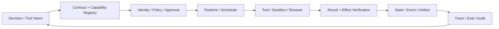
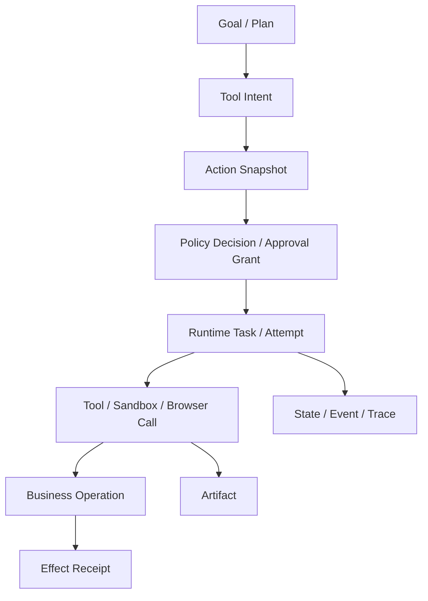
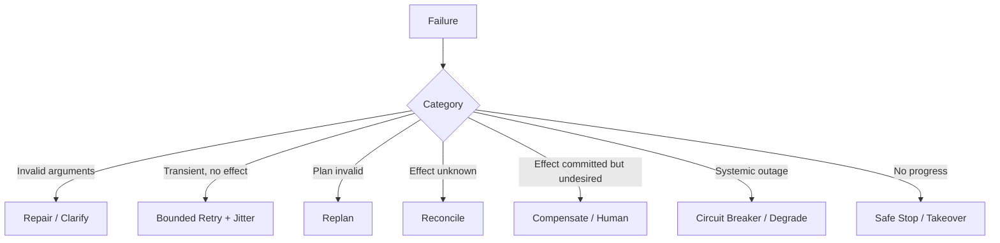

# 执行平面

> [返回总目录](../README.md)

> 调研基线：2026-08-06。工具协议、隔离运行时、Computer Use、HITL 框架和平台基础设施变化较快，生产落地前应核对官方规范与安全公告。

执行平面负责把控制平面的候选动作转换为受身份、策略、审批、隔离和预算约束的真实操作，并验证外部世界究竟发生了什么。它的核心不是“能调用工具”，而是**动作可授权、执行可隔离、副作用可幂等、长任务可恢复、结果可验证**。



## 四个核心模块

| 模块 | 核心问题 | 关键对象 | 最危险的失败 |
|---|---|---|---|
| [工具调用与协议](01-工具调用与协议.md) | 模型如何安全发现、描述、调用和验证能力？ | Capability、Toolset、Call、Operation、Artifact、Effect Receipt | 越权、盲重试、重复副作用、结果伪成功 |
| [沙箱与 Computer Use](02-沙箱与Computer-Use.md) | 不可信代码和 GUI 动作在哪里、以什么权限执行？ | SandboxSpec、Credential Handle、Egress Policy、Browser Action | 逃逸、数据外发、凭据泄漏、错误目标点击 |
| [Human-in-the-loop](03-Human-in-the-loop.md) | 何时让谁看见什么，并批准哪个具体动作？ | Proposal、Snapshot、Decision、Grant、Wait Condition | 审批与执行不一致、过期授权、确认疲劳 |
| [Agent 运行时与平台工程](04-Agent运行时与平台工程.md) | 长任务如何排队、调度、恢复、伸缩、发布和运营？ | Run、Task、Attempt、Lease、Queue、Version Vector | 雪崩、双执行、状态丢失、版本不兼容 |

## 核心对象链



需要特别区分：

```text
Tool Call != Business Operation
API Success != Task Success != Correct Business Effect
Container != Strong Security Boundary
Authentication != Authorization != Approval != Consent
Streaming Connection != Durable Run
```

## 统一不变量

1. 模型只提出动作，不自行决定权限、审批、重试和最终成功。
2. 无权能力在工具检索前过滤，不能先暴露给模型再在执行时拒绝。
3. 写操作使用稳定 Operation ID；网络超时进入 `unknown_effect` 并先 Reconcile。
4. 大文件通过 Artifact、Range、Cursor、Multipart 和原子发布，不进入 Prompt/Queue/State 大字段。
5. 不可信代码、网页、文件和 Tool Output 不能改变 System Policy、用户目标或权限。
6. 高风险动作绑定不可变 Action Snapshot 和 Payload Digest，参数变化后重新决策。
7. 等待审批、Webhook 或外部 Operation 时释放 Worker，通过 Durable Wait/Event 恢复。
8. Worker 是可丢弃执行者，状态、事件、产物和幂等记录外置。
9. 调度同时考虑租户公平、Priority、Deadline、工作量、资源和风险。
10. Prompt、模型、Workflow、Tool、Policy、Schema、Index 和 Sandbox Image 都属于版本向量。
11. 真实副作用通过独立 Verifier/Source of Truth 确认，不信模型或工具自述。
12. 质量、延迟、安全、恢复和成本以端到端成功任务为共同分母。

## 推荐阅读顺序

### 学习顺序

```text
工具契约与 Operation
-> 沙箱与 Browser 动作安全
-> HITL 风险与审批协议
-> Runtime 调度与平台工程
```

先理解单次动作如何正确执行，再理解执行环境和人工边界，最后进入大规模运行时。

### 工程建设顺序

```text
Run/Task/Operation/Artifact 基础对象
-> Tool Gateway + Idempotency + Effect Verification
-> State/Event + Durable Wait
-> Sandbox/Browser + Credential/Egress
-> Approval Service
-> Admission/Scheduler/Queue/Resource Pool
-> Trace/Eval/Canary/DR
```

不要先搭一个“全自动多 Agent 平台”再补状态、权限和幂等。副作用和恢复语义越晚补，返工越大。

## 模块间数据契约

```text
Control Plane -> ToolIntent / PlanStep
Tool Registry -> CapabilityDescriptor / ToolsetManifest
Policy/HITL -> PolicyDecision / ApprovalGrant
Runtime -> TaskLease / Attempt / WaitCondition
Executor -> StructuredResult / ArtifactRef / EffectReceipt
State Plane -> VersionedState / Event / Checkpoint
Observability -> Span / Metric / AuditEvent / EvalRecord
```

各模块交换结构化对象和版本引用，不通过一段不可审计的自然语言 Prompt 隐式耦合。

## 典型失败收敛路径



`Retry`、`Repair`、`Replan`、`Reconcile`、`Compensate` 不能混成“再试一次”。

## 综合评测

一个执行平面测试用例应描述：

- Principal、Tenant、Scope、Policy 和自治 Envelope。
- Toolset、Schema、风险参数和 Action Snapshot。
- Sandbox/Browser 的文件、网络、凭据和资源策略。
- Run/Task/Attempt/Operation、Deadline 和 Retry Budget。
- 正常结果、部分成功、Unknown Effect 和独立 Verifier。
- Worker 崩溃、回调丢失、审批过期、页面变化和 Provider 故障。
- 最终 Task Success、Effect Correctness、Unsafe Action、Duplicate Effect、P95 和单位成功成本。

## 生产排障顺序

```text
Business Source of Truth / Effect
-> Operation / Idempotency / Approval Snapshot
-> Run / Task / Attempt / Lease / Event
-> Tool / Sandbox / Browser Result
-> Scheduler / Queue / Resource Pool
-> Model / Plan / Context
-> Trace / Version Vector / Deployment
```

先确认真实世界发生了什么，再检查 Runtime 记录和执行环境；不要从模型最后一句“已完成”开始排障。
