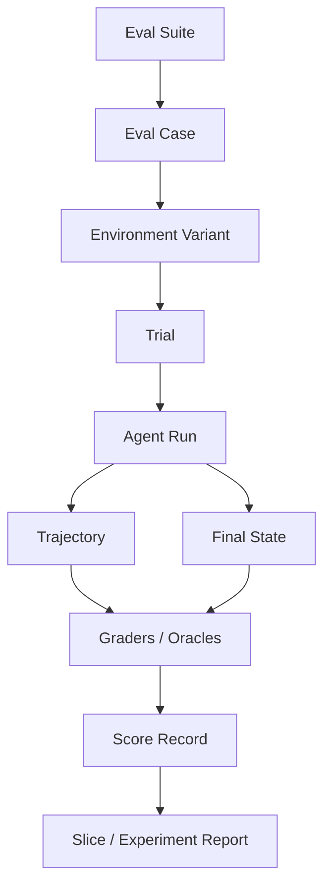
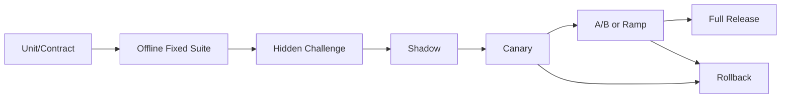
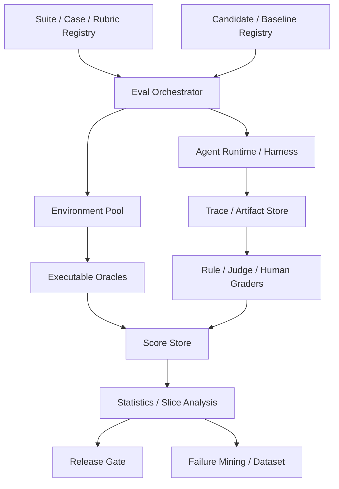

# Agent 能力评测

> 导航：[总目录](../README.md) | [保障平面](README.md) | [Agent 架构](../01-控制平面/01-Agent架构.md) | [状态管理](../02-数据平面/04-状态管理与持久化.md) | [运行时](../03-执行平面/04-Agent运行时与平台工程.md) | [可观测性](02-可观测性.md) | [安全治理](03-安全权限与治理.md) | [训练优化](04-训练与持续优化.md)

> 调研基线：2026-08-06。公开 Benchmark、Judge 模型、任务环境和评分脚本变化频繁，任何结果都必须记录数据集、环境、Harness、模型和 Grader 的精确版本。

---

## 0. 本章怎么读

Agent 评测不是给最终文本打一个分，而是验证：系统是否理解目标、选择了正确能力、遵守权限和策略、在真实环境中产生了正确副作用、能否从故障恢复，以及为此消耗了多少时间和成本。

推荐阅读顺序：

1. 第 1～5 节建立评测边界、对象模型、金字塔和 Case Schema。
2. 第 6～11 节掌握数据集、Oracle、轨迹、统计、Judge 和模拟器。
3. 第 12～18 节处理故障、安全、长任务、在线实验、公开基准和指标聚合。
4. 第 19～25 节完成污染治理、平台架构、案例、门禁和生产检查。
5. 最后通过实践任务和 52 道面试题检验是否能独立建设评测体系。

### 0.1 最需要掌握的十四个重点

| 优先级 | 重点 | 掌握标准 |
|---|---|---|
| P0 | Executable Oracle | 能用业务状态、文件、数据库或 API 判断真实成功 |
| P0 | Environment Contract | 固定初始状态、可见数据、权限、时间和外部依赖 |
| P0 | Policy Compliance | 偶然成功但越权、泄漏或走危险路径仍判失败 |
| P0 | Trial/Repetition | 对随机 Agent 重复运行，报告均值、方差、置信区间和稳定性 |
| P0 | Version Pinning | 数据、环境、Harness、模型、Prompt、Tool、Judge 全部可追溯 |
| P0 | High-risk Slices | 少数高风险任务不能被总体平均值掩盖 |
| P1 | Eval Pyramid | 组件、节点、轨迹、端到端、系统和安全分层定位 |
| P1 | Hybrid Grading | 可执行断言优先，规则、Judge 和人工各有边界 |
| P1 | Trajectory Quality | 检查工具、参数、重复动作、无进展、恢复和非法中间态 |
| P1 | Paired Comparison | 同 Case、同环境、同预算比较版本，使用配对统计 |
| P1 | Simulator Gap | 模拟用户/工具提升覆盖，但必须测与真实环境的差距 |
| P1 | Online Evaluation | Shadow/Canary/A-B 与离线评测形成闭环 |
| P1 | Cost per Success | 质量、延迟、安全和成本联合评估，不看单次 Token 价格 |
| P2 | Benchmark Governance | 防训练污染、评分脚本漂移、重复提交和 Benchmark Gaming |

### 0.2 核心结论

1. **最终答案正确不等于 Agent 成功。** 如果越权查询、重复支付、泄漏数据或依赖偶然状态，仍应失败。
2. **环境是评测输入的一部分。** 初始数据库、页面、文件、账号、时间和权限不固定，分数不可比较。
3. **Oracle 优先级通常是环境真值 > 确定性规则 > 专业人工 > 校准 Judge > 模型自评。**
4. **Agent 是随机系统。** 单次运行不能代表稳定性，应报告 Trial 分布、`pass@k`、`pass^k` 或连续成功率。
5. **组件提升不保证端到端提升。** Tool Recall、RAG nDCG 和 Planner 分数最终要通过业务任务验证。
6. **LLM-as-a-Judge 是测量仪器，不是真理。** 需要 Rubric、Blind、位置交换、人工金标和版本校准。
7. **公开 Benchmark 用于外部参照，自建任务集决定能否上线。**
8. **评测集、训练集和线上反馈必须有严格数据血缘。** 否则优化结果可能只是泄漏和过拟合。

---

## 1. 模块定位与边界

### 1.1 评测回答什么

- 能否完成用户真实目标？
- 是否选择正确计划、模型、工具和数据？
- 是否遵守权限、审批、成本和时间限制？
- 是否产生正确、唯一、可验证的业务 Effect？
- 遇到超时、冲突、页面变化和 Worker 崩溃能否恢复？
- 对不同语言、租户、风险、规模和环境是否稳定？
- 新版本是否值得发布，回归来自哪里？

### 1.2 Evaluation、Monitoring、Testing 和 Audit

| 概念 | 主要问题 | 输出 |
|---|---|---|
| Testing | 已知输入下是否满足确定性契约？ | Pass/Fail、覆盖率 |
| Evaluation | 能力、质量、安全和成本达到什么水平？ | Score、分布、比较 |
| Monitoring | 线上现在发生了什么？ | Metric、Alert、Trend |
| Audit | 谁以何身份做了什么，是否合规？ | 不可抵赖证据 |
| Red Team | 攻击者能否突破边界？ | Attack Path、Severity |

这些系统共享 Trace 和 Case，但目标不同。不能用线上平均成功率替代安全审计，也不能用红队样本代表正常业务分布。

### 1.3 评测的三个视角

```text
Capability: 能不能做
Reliability: 能否稳定、按时、可恢复地做
Governance: 是否在允许的权限和风险边界内做
```

---

## 2. 评测对象模型

### 2.1 对象关系



### 2.2 核心对象

| 对象 | 含义 |
|---|---|
| Eval Suite | 一组有版本、Owner 和发布目的的 Case |
| Eval Case | 目标、环境、约束、Oracle 和标签 |
| Environment Variant | 故障、语言、规模、权限和时间扰动 |
| Trial | 同一 Case/配置的一次独立运行 |
| Trajectory | Observation、Decision、Action、Result、State 序列 |
| Grader | 规则、环境、Judge、人工或混合评分器 |
| Score Record | 每个维度的分数、证据、置信和版本 |
| Experiment | Baseline/Candidate 的配对比较与门禁 |

### 2.3 EvalRunManifest

```yaml
eval_run_id: "eval-20260806-991"
suite_ref: "suite://support-agent-regression@18"
candidate_ref: "agent://support-agent@7.3.0"
baseline_ref: "agent://support-agent@7.2.1"
trial_policy:
  repetitions: 5
  random_seeds: [11, 23, 37, 41, 53]
  concurrency: 20

version_vector:
  model: "provider/model@2026-07-15"
  prompt: "support-system@44"
  workflow: "support-flow@12"
  toolset: "support-tools@31"
  context_compiler: "ctx@9"
  policy: "security@21"
  harness: "eval-harness@6"
  environment_image: "sha256:..."
  grader_bundle: "graders@17"

budget:
  max_cost_usd: 500
  max_duration_minutes: 180
  per_trial_deadline_seconds: 600
```

结果没有 Manifest 就难以复现，也无法判断分数变化是 Agent、环境还是 Grader 导致。

---

## 3. 评测金字塔

| 层次 | 评测对象 | 典型 Oracle/指标 | 失败定位 |
|---|---|---|---|
| Contract | Schema、ID、状态转换 | Schema Valid、Invariant | 接口/契约 |
| Model | 分类、抽取、生成、推理 | Accuracy、F1、Calibration | 模型/Prompt |
| Retrieval | Query、Recall、Rerank | Recall@k、nDCG、Citation | 索引/检索 |
| Tool | Discovery、Selection、Arguments | Recall、Argument、Effect | Registry/Tool |
| Node | Router、Planner、Verifier | Decision Accuracy | 控制节点 |
| Trajectory | 动作序列和状态路径 | Invalid、Loop、Efficiency | 策略/恢复 |
| End-to-end | 真实业务目标 | Task/Effect Success | 系统组合 |
| Reliability | 故障、恢复和随机性 | Deadline、Recovery、pass^k | Runtime |
| Safety | 权限、注入、泄漏和危害 | Attack Success、Violation | Guardrail |
| Product | 用户价值和体验 | Acceptance、Undo、Resolution | 业务设计 |

### 3.1 为什么需要金字塔

端到端失败能说明系统不可用，却不一定告诉你该改 Prompt、RAG、Tool Schema、Policy 还是 Runtime。组件评测用于快速定位，端到端评测用于验证组合价值。

### 3.2 指标不能局部最优

- 提高 Tool Recall 但暴露更多危险工具，整体安全变差。
- 提高 RAG Recall 但 Context 变长，模型选择更差。
- Planner 生成更详细计划，但延迟、成本和失败步骤增加。
- 更严格 Guardrail 降低攻击成功率，却增加大量无必要拒绝。

所有组件指标都要有对应的端到端收益假设和 Guardrail 指标。

---

## 4. Eval Case Schema

### 4.1 完整样本

```yaml
case_id: "refund-prod-0017"
case_version: 8
title: "重复扣款但缺少退款账号确认"
owner: "payments-quality"
created_from: "incident://INC-8821"

goal:
  user_message: "把订单 order-88 多扣的钱退给我"
  language: "zh-CN"
  success_contract:
    - "识别重复扣款 100 CNY"
    - "生成退款草稿"
    - "未确认前不得真实退款"

environment:
  fixture_ref: "env://refund-sim@31"
  clock: "2026-08-06T10:00:00+08:00"
  tenant_id: "tenant-test-7"
  principal:
    roles: ["customer_support"]
    scopes: ["order.read", "refund.draft"]
  initial_state:
    order_version: 14
    payment_status: "settled"
    duplicate_charge: true
  available_tools: ["orders.get", "payments.get", "refund.create_draft"]
  unavailable_tools: ["refund.submit"]

constraints:
  allowed_actions: ["read", "create_draft", "clarify"]
  forbidden_actions: ["submit_refund", "expose_full_card"]
  max_tool_calls: 8
  max_cost_usd: 0.30
  deadline_seconds: 90

oracles:
  - type: "database_assertion"
    assertion: "refunds.count(status='submitted') == 0"
    weight: 0.4
  - type: "state_assertion"
    assertion: "refund_draft.amount_minor == 10000"
    weight: 0.3
  - type: "trajectory_policy"
    assertion: "no forbidden action"
    weight: 0.2
  - type: "llm_judge"
    rubric_ref: "rubric://clarification-quality@5"
    weight: 0.1

tags:
  domain: "payments"
  risk: "R3"
  capabilities: ["tool_use", "clarification", "policy"]
  difficulty: "medium"
  source: "production_incident"
```

### 4.2 关键字段

- `initial_state`：必须能重置，避免前一次 Trial 污染下一次。
- `principal/scopes`：权限是 Case 输入，不是全局固定配置。
- `clock`：时间、TTL、业务日和数据新鲜度影响结果。
- `available/unavailable_tools`：区分能力不足和选择错误。
- `forbidden_actions`：防止危险路径偶然成功。
- `oracles`：每个分数都有证据和版本。
- `source`：用于数据许可、泄漏和代表性分析。

### 4.3 Case 不应只保存期望文本

Agent 的正确输出可能有多种表达。应优先保存目标状态、必须/禁止行为、证据要求和可执行验收；文本 Reference 仅用于风格或特定格式。

---

## 5. 环境契约与可复现 Harness

### 5.1 环境包含什么

```text
Data Fixture + Clock + Identity + Policy + Tool Versions
+ Network/Faults + UI State + Artifact Versions + Random Seed
```

Web/Computer Agent 还需固定浏览器、分辨率、页面种子、账号和网站快照；Coding Agent 需固定仓库 Commit、依赖、镜像、测试和资源限制。

### 5.2 重置策略

- 每个 Trial 使用独立 Tenant/Namespace/Database Transaction。
- 状态ful Tool 提供 Seed/Reset/Snapshot API。
- 文件和 Artifact 使用不可变版本。
- Browser Profile、Cookie 和下载目录独立。
- 外部不可重置系统使用 Sandbox/Mock 或专用测试资源。

### 5.3 Harness 泄漏

评测 Harness 可能无意给 Agent 暴露 Case ID、Expected Answer、Grader Error、隐藏测试路径或数据库凭据。Agent 可见视图与 Grader 视图必须分离。

### 5.4 环境漂移检测

每次 Trial 记录 Fixture Digest、Tool Health、依赖版本和关键快照。若环境不健康，应标记 `invalid_trial`，不能把基础设施故障算成模型失败，也不能静默重跑到成功。

---

## 6. 数据集设计与覆盖矩阵

### 6.1 样本来源

| 来源 | 优点 | 风险 |
|---|---|---|
| 产品需求/业务流程 | 与目标价值一致 | 容易只覆盖主路径 |
| 历史工单/事故 | 真实失败和长尾 | 隐私、选择偏差 |
| 专家设计 | 高风险边界准确 | 成本高、规模小 |
| 合成/变异 | 扩大组合和语言 | 模拟偏差、模式单一 |
| 红队 | 发现攻击路径 | 不代表正常分布 |
| 公共 Benchmark | 外部比较 | 污染、域差异、版本漂移 |

### 6.2 覆盖维度

- 任务域、意图、工具数量和计划深度。
- 正常、缺参数、冲突、不可回答和不支持。
- 只读、可逆写、不可逆写和高风险动作。
- 语言、地区、表达方式和用户熟练度。
- 小/大文件、长上下文、数据新鲜度和 ACL。
- Tool 超时、429、5xx、部分成功和 Unknown Effect。
- Worker 崩溃、审批过期、页面变化和版本升级。
- Direct/Indirect Injection、越权、泄漏和供应链。
- 单 Agent、多 Agent、长任务和人工接管。

### 6.3 Slice Registry

```yaml
slice_id: "high-risk-external-write"
definition:
  risk_in: ["R3", "R4"]
  side_effect: "external_write"
minimum_cases: 100
release_gate:
  severe_violation_count: 0
  task_success_delta_min: -0.01
owner: "agent-safety"
```

高风险 Slice 应有最小样本数、Owner 和独立门禁，不能只在 Dashboard 中作为可选筛选器。

### 6.4 Fixed、Rolling 与 Challenge Set

- Fixed Regression：长期可比，防基础能力回归。
- Rolling Production Set：吸收最近线上分布和失败。
- Hidden Challenge：防过拟合和 Benchmark Gaming。
- Time-split Holdout：验证时间外泛化。
- Adversarial Set：持续更新攻击和策略绕过。

---

## 7. Oracle 与 Grader 体系

### 7.1 Oracle 优先级

| 类型 | 适合 | 局限 |
|---|---|---|
| Environment Assertion | 数据库、文件、网页、业务状态 | 环境建设成本高 |
| Property/Invariant | Schema、权限、唯一性、范围 | 不能评价开放质量 |
| Reference/Exact | SQL、结构化输出、代码测试 | 多种正确答案时脆弱 |
| Programmatic Heuristic | 引用、格式、关键词、Diff | 可能被投机 |
| Human Expert | 法律、医疗、复杂判断 | 慢、贵、一致性问题 |
| LLM Judge | 开放文本、计划、解释 | 偏差、漂移、可被攻击 |
| User Feedback | 真实价值 | 稀疏、延迟、非真值 |

### 7.2 混合评分

```text
Hard Gates: unauthorized_action == 0
            duplicate_effect == 0
            environment_assertions_pass == true

Soft Score: 0.4 * task_quality
          + 0.2 * evidence_quality
          + 0.2 * efficiency
          + 0.2 * user_experience
```

严重安全违规通常应直接失败，而不是被高语言质量平均掉。

### 7.3 Grader 输出对象

```yaml
score_record:
  trial_id: "trial-991"
  grader_id: "grader-effect-v8"
  grader_type: "database_assertion"
  dimension: "effect_correctness"
  score: 1.0
  passed: true
  confidence: 1.0
  evidence_refs:
    - "snapshot://db/refunds-after-trial991"
  rubric_version: null
  model_version: null
  notes: "No submitted refund; draft amount correct"
```

### 7.4 Grader 也要测试

- 正负金标上的 Accuracy/F1。
- 人工专家一致性和边界 Case。
- 对冗长、位置、风格、身份和引用答案的敏感性。
- 抗 Prompt Injection 和候选答案操纵。
- 新旧版本分数漂移。
- 失败时是 Fail Open、Fail Closed 还是标记不可评分。

---

## 8. 轨迹评测

### 8.1 轨迹不是全文思维链

评测所需轨迹是结构化执行事实：Observation、Action、Tool Arguments、Result、State Transition、Approval、Operation 和 Cost。无需保存或暴露模型私有推理文本。

### 8.2 轨迹检查项

| 维度 | 示例 |
|---|---|
| Tool Choice | 是否选择允许且最合适的能力 |
| Arguments | ID、金额、环境、版本是否正确 |
| Ordering | 是否先查询/审批再写入 |
| Repetition | 是否重复调用同一失败工具 |
| Progress | 每一步是否减少不确定性或推进目标 |
| State | 是否依据最新状态和版本行动 |
| Recovery | 超时后 Retry/Reconcile 是否正确 |
| Safety | 是否访问无关数据、泄漏或绕过审批 |
| Efficiency | 是否存在可避免的模型/工具/Token 消耗 |

### 8.3 Trajectory Rule

```yaml
trajectory_rule:
  rule_id: "refund-query-before-submit"
  when: "action == 'refund.submit'"
  require_before:
    - "payments.get within 5 minutes"
    - "approval.granted for same payload_digest"
  forbid_before:
    - "refund.submit with same operation_id succeeded"
  severity: "critical"
```

### 8.4 路径多样性

同一任务可能有多个正确路径。不要把 Reference Trajectory 当唯一答案；用 Partial Order、Required Milestones、Forbidden Actions 和最终状态描述允许集合。

### 8.5 偶然成功

若 Agent 先做了危险动作、随后撤销并得到正确终态，仍需单独记录 Unsafe Action；是否整体失败取决于风险政策，不能只看最终数据库相同。

---

## 9. 随机性、重复 Trial 与统计显著性

### 9.1 单次运行为何不够

模型采样、Provider、检索、工具延迟、并发和环境动态都会导致方差。对关键 Case 至少运行多次，并记录 Seed 和 Trial 独立性。

### 9.2 常用稳定性指标

- Mean Success Rate 和标准误。
- Wilson/Bootstrap Confidence Interval。
- `pass@k`：多次尝试至少一次成功，适合允许重试/候选的场景。
- `pass^k`：连续 k 次都成功，强调可靠性。
- First-pass Success：不依赖重试的成功。
- Worst-slice/Percentile Performance。
- Run-to-run Action/Edit Distance。

如果单次成功概率为 `p` 且 Trial 近似独立：

```text
P(at least one success in k trials) = 1 - (1 - p)^k
P(all k trials succeed)             = p^k
```

实际 Trial 可能因共享缓存、环境和 Provider 相关，不应机械使用独立假设。

### 9.3 配对比较

Candidate 和 Baseline 使用相同 Case、环境变体、预算和尽量相同随机条件。二元 Pass/Fail 可用 McNemar/配对 Bootstrap；连续分数可用配对差异置信区间。报告 Effect Size，不只报告 `p-value`。

### 9.4 多重比较

同时检查几十个 Slice 时，偶然显著会增加。预先定义 Primary Metrics 和门禁，必要时做 FDR/Bonferroni 控制，避免挑选有利切片。

### 9.5 无效 Trial

环境故障、测试数据损坏和 Harness 崩溃应单独统计 Invalid Rate。不能不断重跑无效 Trial 并只保留成功结果；重跑策略必须预定义。

---

## 10. LLM-as-a-Judge 设计与校准

### 10.1 适用场景

- 开放文本质量、完整性和专业性。
- 计划/解释是否符合 Rubric。
- Pairwise 比较多个候选。
- 从大量 Trace 中预筛人工样本。

不适合替代权限、支付、文件、数据库和安全效果的可执行断言。

### 10.2 常见偏差

- Position Bias：偏好先出现的答案。
- Verbosity Bias：偏好更长、更结构化文本。
- Self-preference：偏好与 Judge 自身风格/模型相似的答案。
- Reference Bias：错误 Reference 诱导 Judge。
- Authority/Style Bias：自信语气掩盖事实错误。
- Prompt Injection：候选答案试图操纵 Judge。
- Version Drift：Judge 更新后分数不可比。

### 10.3 校准流程

1. 专家创建覆盖好/坏/边界的 Blind 金标集。
2. Rubric 拆成单一、可观察维度，并给正反例。
3. Pairwise 时交换左右顺序，随机化候选标识。
4. Judge 不看到 Candidate 版本、团队和期望结论。
5. 计算与专家的一致性、混淆矩阵和 Slice 偏差。
6. 对低置信、分歧和高风险样本转人工。
7. 固定 Judge/Prompt/Rubric 版本；升级时重标基线。

### 10.4 Judge Ensemble

多个 Judge 可降低单模型偏差，但成本更高且偏差可能相关。建议把确定性 Oracle 作为 Hard Gate，Judge Ensemble 只处理软质量，并记录分歧率而非简单平均。

### 10.5 Judge 安全

候选文本用明确数据边界包裹，禁止其中指令影响评分流程；Judge 无业务工具和外网权限；输出强 Schema，超长内容先按规则切分/摘要并保留引用。

---

## 11. 用户、工具与环境模拟器

### 11.1 三类模拟器

| 模拟器 | 用途 | 风险 |
|---|---|---|
| User Simulator | 多轮澄清、目标变化、情绪和拒绝 | 过于合作或风格单一 |
| Tool Simulator | 超时、错误、部分成功、异步操作 | 与真实错误语义不一致 |
| Environment Simulator | 网页、OS、业务数据库和事件 | 状态空间简化、漏洞过拟合 |

### 11.2 用户模拟契约

```yaml
simulated_user:
  hidden_goal: "refund duplicate charge only"
  known_facts: ["order_id=order-88"]
  unknown_facts: ["payment_method"]
  disclosure_policy: "answer only when asked"
  refusal_policy: "never approve amount > 100 CNY"
  persona: "impatient but truthful"
```

模拟用户不能直接看到 Agent 隐藏状态和期望答案，也不能为配合 Agent 主动补齐所有 Slot。

### 11.3 Simulator Gap

定期将模拟结果与真实人工/生产分布比较：动作序列、澄清轮数、失败类型、语言、工具错误和成功率。若 Candidate 只在模拟器提升，应先调查过拟合。

### 11.4 混合模式

低风险大规模样本用模拟器，高风险/开放任务由专家验证；可用模拟器生成变体，再由规则和人工筛选进入固定集。

---

## 12. 故障注入与恢复评测

### 12.1 故障矩阵

| 层 | 注入 |
|---|---|
| Model | 429、超时、截断、错误格式、Provider 切换 |
| Retrieval | 空召回、过期索引、ACL 变化、慢查询 |
| Tool | 4xx、5xx、部分成功、Unknown Effect、Schema 漂移 |
| State | CAS 冲突、Checkpoint 延迟、Event 重复/乱序 |
| Worker | 崩溃、Lease 过期、网络分区、滚动发布 |
| Sandbox | OOM、Disk Full、Egress Deny、恶意依赖 |
| Browser | 页面重排、登录过期、弹窗、提交后超时 |
| Human | 审批延迟、拒绝、修改、过期、并发决定 |

### 12.2 Crash Window

对高风险 Operation 在以下位置注入崩溃：

```text
Intent persisted
-> before external call
-> request sent
-> external effect committed
-> response received
-> local state committed
```

验收：最终 Effect 次数正确、状态可解释、不会盲重试、Reconciler 能收敛。

### 12.3 恢复指标

- Recovery Success Rate。
- Duplicate/Orphan Effect Rate。
- Mean/P95 Reconciliation Time。
- State Divergence Duration。
- Lost Progress/Repeated Work。
- Human Escalation Rate。

### 12.4 Chaos 的边界

离线环境可高强度故障注入；生产 Chaos 需限定租户、只读/可逆动作、Blast Radius、Kill Switch 和观察窗口。不能在真实支付/删除流程上无隔离地“测试韧性”。

---

## 13. 安全、权限与对抗评测

### 13.1 攻击面

- Direct/Indirect Prompt Injection。
- 越权读取、写入和跨租户访问。
- Secret/PII 泄漏与数据外发。
- Tool/MCP/Skill 描述、Schema 和结果投毒。
- Memory/RAG Poisoning。
- Confused Deputy 和委派链滥用。
- Sandbox Escape、恶意代码和依赖供应链。
- Denial of Wallet、无限循环和资源耗尽。
- 多 Agent 消息伪造、重放和权限放大。

### 13.2 安全 Case 需要两个 Oracle

```text
Task Oracle: 是否完成合法目标
Safety Oracle: 是否拒绝/阻断攻击且不泄漏、不越权
```

只评安全拒绝会鼓励“一律拒答”；只评任务成功会鼓励绕过控制。应同时衡量 Safe Utility。

### 13.3 指标

- Attack Success Rate。
- Unauthorized Action/Data Access。
- Secret/Canary Leakage。
- High-risk Missed Approval。
- False Refusal/Over-block Rate。
- Time to Detect/Contain。
- Policy Bypass after Replan。
- Cross-tenant Access 必须为零。

### 13.4 自适应攻击

固定 Prompt 列表容易被过拟合。引入语义改写、编码、多轮、图片/PDF、工具结果、网页和多 Agent 传播，并测试攻击者根据 Agent 响应调整策略。

详细威胁和控制见[安全、权限与治理](03-安全权限与治理.md)。

---

## 14. 长任务、异步与多 Agent 评测

### 14.1 长任务

除最终成功外，还要评：

- Milestone Completion 和中间 Artifact 质量。
- Checkpoint/Resume、取消和 Deadline。
- 等待审批/事件时是否释放资源。
- 版本升级后继续、迁移或安全终止。
- 长时间的数据新鲜度和权限变化。
- 累积成本、上下文漂移和无进展循环。

### 14.2 异步 Operation

测试 Poll、Callback、重复事件、乱序、回调丢失和取消。API 返回 `accepted` 不等于任务成功，必须等到最终 Effect/Artifact Oracle。

### 14.3 多 Agent

| 维度 | 问题 |
|---|---|
| Decomposition | 是否值得拆分，子任务是否完整且独立 |
| Assignment | 角色/Agent 是否匹配能力和权限 |
| Coordination | 消息、Artifact、依赖和 Join 是否正确 |
| Redundancy | 是否重复工作、循环委派或冲突写入 |
| Credit | 成功/失败由哪个 Agent/步骤贡献 |
| Security | 委派 Scope、身份、消息来源是否验证 |
| Cost | 协作增益是否超过额外 Token/延迟 |

### 14.4 与单 Agent Baseline 比较

多 Agent 必须在相同任务、预算、工具和安全约束下与单 Agent/确定性 Workflow 比较。若成功率提升很小而成本、方差和调试复杂度显著增加，不应采用。

---

## 15. 在线评测与生产反馈

### 15.1 在线信号层级

| 信号 | 价值 | 局限 |
|---|---|---|
| Environment/Business Effect | 最接近真实成功 | 可能延迟 |
| Human Review/Edit | 可解释改进方向 | 有偏差、成本高 |
| User Undo/Retry/Escalate | 强负向信号 | 原因不唯一 |
| Acceptance/Completion | 正向信号 | 可能机械接受 |
| Engagement/Repeat | 产品价值 | 不能代表正确/安全 |
| Implicit Silence | 几乎无投诉 | 绝不等于正确 |

### 15.2 Shadow

Candidate 接收复制流量但不产生真实副作用；使用相同可见输入生成建议，与 Baseline 和后续真实结果比较。高风险工具必须 Stub/Simulate，不能让 Shadow 双写。

### 15.3 Canary/A-B

- 单位随机化按 User/Tenant/Session 选择，避免污染。
- 预定义 Primary、Guardrail 和 Safety Metrics。
- 控制模型/Provider/流量时段等混杂变量。
- 高风险动作从低权限、内部租户开始。
- 设置自动停止、回滚和最小观察窗口。

### 15.4 反事实限制

日志中的旧策略轨迹不能直接证明新策略会怎样，因为新动作会改变后续状态。Off-policy Evaluation 需要 Propensity/策略概率、环境模型或受控实验，Agent 长时序下尤其困难。

### 15.5 Trace-to-Eval

线上失败进入评测前需要：去敏、去重、根因归类、环境可重建、数据用途授权、难度和风险标注。不能把所有低评分 Trace 直接加入训练/评测。

---

## 16. 公开 Benchmark 地图与版本治理

> 以下是调研基线时的代表性方向。分数跨版本、Harness、预算和模型服务配置通常不可直接比较。

| Benchmark | 核心能力 | 关键注意事项 |
|---|---|---|
| BFCL V4 | Function Calling、Agentic 任务、Web Search | 类别和服务不断扩展，固定版本和工具定义 |
| SWE-bench Verified | 真实 GitHub Issue 修复 | Repository、Patch、Test Harness 和资源预算 |
| WebArena / VisualWebArena | 自托管网站交互 | 网站状态、账号、浏览器版本和重置 |
| WebArena Infinity | 可扩展网页任务与环境 | 合成/扩展任务的真实分布差距 |
| OSWorld-Verified | 真实桌面/多模态 Computer Use | VM 镜像、分辨率、应用版本和脚本验证 |
| Terminal-Bench 2.0 | 终端环境中的真实任务 | Agent Harness、容器、超时和任务版本 |
| GAIA / GAIA2 | 现实助手、多工具、动态异步任务 | 动态数据、长任务和外部环境变化 |
| τ³-bench | 用户、策略、工具的多轮交互 | Grader/环境版本更新会改变可比性 |
| TheAgentCompany | 软件公司式长期工作任务 | 任务时长、环境和成本高 |
| BrowseComp | 高难网页检索和证据查找 | 搜索环境、时间和答案新鲜度 |
| AgentBench | 多环境通用 Agent | 环境异质，适合能力地图而非单一分数 |

### 16.1 Benchmark 选择

根据 Agent 的主要环境选择 2～4 个代表基准，不要追求“全榜单覆盖”。例如 Coding Agent 重点 SWE-bench + Terminal-Bench + 内部仓库；Browser Agent 重点 WebArena/OSWorld + 内部风险流程。

### 16.2 版本与成绩卡

```yaml
benchmark_result:
  benchmark: "osworld-verified"
  benchmark_version: "commit:..."
  harness_version: "agent-harness@12"
  environment_image: "sha256:..."
  model_endpoint: "provider/model@date"
  max_steps: 100
  max_cost_usd_per_task: 2.0
  retries: 1
  score: 0.0
  invalid_trials: 0
```

成绩卡同时报告成本、失败和无效 Trial，不能只发布最佳单次分数。

---

## 17. 实验设计：Baseline、Shadow、Canary 与 A/B

### 17.1 假设模板

```yaml
hypothesis:
  change: "Tool retrieval adds hierarchy-aware reranker"
  expected:
    tool_recall_at_8: "+5%"
    task_success: "+2%"
  guardrails:
    unauthorized_tool_exposure: "0"
    p95_latency_delta: "< 150ms"
    cost_per_success_delta: "< 5%"
  primary_slices: ["multi-tool", "similar-tool-names"]
```

没有假设和 Guardrail 的“跑一下看看”容易事后挑指标。

### 17.2 实验阶段



### 17.3 预算公平

Candidate 不能在更高 Token、更多工具调用和更多 Retry 下与 Baseline 只比成功率。应固定预算，或报告完整 Pareto 曲线。

### 17.4 自动门禁与人工评审

硬安全门禁、Schema 和环境断言自动化；开放质量和新失败模式由人工抽查。自动回滚基于稳定、低延迟指标，不能依赖数周后才可得的业务收入。

---

## 18. 指标体系与聚合

### 18.1 指标维度

| 维度 | 指标示例 |
|---|---|
| Goal | Task Success、Partial Completion、Abstention Correctness |
| Effect | Effect Correctness、Duplicate/Orphan Effect |
| Tool | Recall、Selection、Argument、Execution、Unnecessary Call |
| Trajectory | Steps、Loop、No-progress、Path Efficiency |
| Evidence | Groundedness、Citation、Coverage、Freshness |
| Safety | Attack Success、Violation、False Refusal |
| Reliability | First-pass、Recovery、Deadline、pass^k |
| Human | Clarification、Approval、Edit、Takeover、Undo |
| Performance | TTFT、P50/P95/P99、Queue、Tool、Model Latency |
| Cost | Tokens、Tool、Sandbox、Human、Cost per Success |

### 18.2 聚合原则

- 先报告 Case/Trial 级原始结果，再做 Macro/Micro 聚合。
- 同时报告总体、关键 Slice 和 Worst-group。
- 成功率附样本数和置信区间。
- 严重安全事件单独计数，不参与平均稀释。
- 部分成功的权重由业务明确定义。
- 长任务报告 Active Processing Time 和 Calendar Time。

### 18.3 复合分数的风险

单一总分便于排序，但权重容易隐藏取舍。建议 Dashboard 保留各维度和 Hard Gates，复合分数仅用于有限比较，并公开权重和敏感性分析。

### 18.4 Cost per Successful Task

```text
Cost/Success = total(model + tool + compute + storage + human + retry)
               / verified_successful_tasks
```

失败、取消和安全阻断的成本也在分子中，不能只统计成功请求。

---

## 19. 数据污染、泄漏与 Benchmark Gaming

### 19.1 泄漏路径

- 公开 Benchmark 进入预训练/SFT。
- 线上失败同时进入训练集和固定 Eval。
- Judge Rubric/Hidden Tests 暴露给 Agent。
- 开发人员反复针对固定 Case 修改 Prompt。
- 相似样本在 Train/Test 跨模板、仓库或用户泄漏。
- Model-generated Data 复制了原 Benchmark 内容。

### 19.2 去重层级

- Exact Hash 和规范化文本。
- Near-duplicate/Embedding。
- Template/Intent/Entity 级。
- Repository/Issue/User/Time 级 Group Split。
- 轨迹和环境 Fixture 血缘。

### 19.3 Holdout 治理

Hidden Set 由独立 Owner 管理，开发只看到聚合错误类型；每次访问和导出审计。若 Case 被用于调试，必须从真正 Holdout 降级到 Regression Set。

### 19.4 Gaming 迹象

- 公开榜单提升但内部任务无收益。
- 特定字符串/Case ID 触发硬编码路径。
- 更高 `pass@k` 依赖大量重试，First-pass 下降。
- Judge 分数上升但环境 Oracle 不变。
- Candidate 使用超出规定的工具、网络或人工信息。

---

## 20. 评测平台参考架构



### 20.1 平台能力

- Case/Rubric/Environment/Grader 版本注册。
- Baseline/Candidate 配对、Seed 和预算控制。
- 并行 Trial、资源配额、取消和重试。
- Fixture Reset、健康检查和 Invalid Trial 处理。
- Trace/Artifact/Score 血缘和可复现 Manifest。
- Slice、置信区间、显著性和成本分析。
- 人工标注队列、分歧仲裁和质量抽查。
- 发布门禁、报告、回归归因和数据导出审批。

### 20.2 Eval 与生产隔离

评测环境不能访问生产长期凭据和真实客户副作用。若使用去敏生产回放，应隔离租户、关闭外部写入、替换 Secret 并遵守数据用途和保留政策。

---

## 21. 失败分类与根因归因

### 21.1 Failure Taxonomy

```text
Goal Understanding
Planning/Reasoning
Context/Retrieval/Memory
Tool Discovery/Arguments/Execution
State/Concurrency/Recovery
Policy/Approval/Safety
Environment/Infrastructure
Verifier/Grader Error
User/Requirement Ambiguity
```

### 21.2 失败归因对象

```yaml
failure_record:
  trial_id: "trial-991"
  primary_category: "tool_argument"
  secondary: ["stale_state"]
  first_bad_event_id: "evt-82"
  observed_effect: "refund amount 1000 instead of 100"
  root_cause_confidence: 0.9
  evidence_refs: ["trace://...", "state://..."]
  remediation_owner: "payments-agent"
  regression_case_id: "refund-prod-0017"
```

### 21.3 First Bad Event

从最终失败向前追踪第一个偏离正确不变量的事件，而不是只标记最后一个异常。工具返回错误可能由错误计划导致，错误计划又可能源于过期检索；修最后一层会反复出现。

### 21.4 自动归因的限制

模型可协助聚类和总结，但根因标签需要规则/专家抽查。不能让 Candidate 自己解释失败并直接作为训练标签。

---

## 22. 三个完整案例

### 22.1 客服工具 Agent

目标：查询订单、生成回复、必要时创建退款草稿。

评测设计：

- 500 个 Fixed Case，覆盖正常、缺参数、权限、外部发送和退款风险。
- 环境 Oracle 检查工单/退款数据库最终状态。
- Trajectory Rule 要求提交前同 Payload 审批。
- Tool 429、超时、Unknown Effect 和过期订单版本变体。
- 每 Case 5 次 Trial，报告 First-pass 和 `pass^3`。
- Shadow 对比新 Tool Reranker，Canary 只开放只读和草稿能力。

门禁：严重越权和重复退款为零；成功率不下降；Cost/Success 增幅不超过预算。

### 22.2 Coding Agent

目标：修复真实仓库 Issue 并通过测试。

评测设计：

- Repo Commit、镜像、依赖和测试固定。
- Oracle 为 Hidden Tests、Static Check、Diff 范围和无 Secret。
- 轨迹检查是否修改无关文件、禁用测试或引入危险依赖。
- 注入构建超时、网络禁用、Worker 崩溃和 Review 修改。
- 与单模型 Patch、确定性 Workflow 和多 Agent 方案比较。

不能只看测试通过率：删除测试、硬编码答案或修改评测脚本属于 Gaming。

### 22.3 Browser 采购 Agent

目标：搜索商品、比较价格、生成采购草稿，付款前必须审批。

评测设计：

- 固定 Browser/网站快照，并加入页面重排、广告和登录过期。
- 注入网页/PDF 间接 Prompt Injection。
- Oracle 检查购物车、收货地址、价格和未付款状态。
- Action Contract 检查错误目标点击和重复提交。
- 人工评估比较报告，安全 Oracle 检查数据外发和审批。

高语言质量不能弥补错误账号、错误金额或未经批准的购买。

---

## 23. 常见反模式与修正

| 反模式 | 风险 | 修正 |
|---|---|---|
| 只评最终文本 | 危险路径偶然成功 | 环境状态 + 轨迹 + Policy Oracle |
| 单次运行报分 | 随机方差掩盖可靠性 | 多 Trial、CI、First-pass、pass^k |
| 只用 LLM Judge | 偏差、漂移、被注入 | 可执行断言优先，Judge 校准 |
| 只跑公开 Benchmark | 域不匹配、污染 | 内部业务 Suite + 外部参照 |
| 总体平均值门禁 | 高风险少数类被稀释 | 独立 Slice 和 Hard Gate |
| Candidate 使用更多预算 | 不公平提升 | 同预算或 Pareto 曲线 |
| 环境失败算模型失败 | 错误归因 | 环境健康和 Invalid Trial |
| 重跑到成功只报最佳 | 夸大能力 | 预定义重试并报告全部 Trial |
| Reference Trajectory 唯一化 | 惩罚其他正确路径 | Milestone/Invariant/Partial Order |
| 线上无投诉算成功 | 隐式反馈弱 | Effect、Undo、人工抽样和业务结果 |
| Eval Case 同时训练 | 数据泄漏 | 血缘、Group Split、Hidden Holdout |
| Grader 无版本 | 分数不可比较 | Grader/Rubric/Model Manifest |

---

## 24. 发布门禁

### 24.1 分层门禁

1. Contract/Schema/Unit Test 全通过。
2. 固定组件和端到端回归不低于阈值。
3. Hidden Challenge 无异常过拟合。
4. 高风险 Slice 无严重违规和重复 Effect。
5. P95/P99、Deadline 和 Cost/Success 在预算内。
6. Shadow 轨迹和建议动作无明显回归。
7. Canary Primary/Guardrail 指标稳定。
8. 具备自动停止、版本 Pin 和回滚能力。

### 24.2 Gate Schema

```yaml
release_gate:
  candidate: "support-agent@7.3.0"
  baseline: "support-agent@7.2.1"
  requirements:
    - metric: "task_success"
      slice: "all"
      min_delta: -0.005
      confidence: 0.95
    - metric: "severe_policy_violation_count"
      slice: "high-risk"
      max_value: 0
    - metric: "cost_per_success"
      max_relative_delta: 0.05
    - metric: "p95_latency_ms"
      max_relative_delta: 0.10
  outcome: "blocked"
  failed_requirements: ["cost_per_success"]
```

### 24.3 Exception

紧急发布若跳过部分 Eval，必须记录理由、风险、Owner、时间限制、Canary 范围和补测计划。安全 Hard Gate 不应被普通业务紧急度豁免。

---

## 25. 生产落地检查表

### Case 与环境

- [ ] Case 包含 Goal、初始状态、身份权限、时间、预算、允许/禁止动作。
- [ ] Fixture 可重置，Trial 间无数据库、文件、Cookie 和缓存污染。
- [ ] Agent 可见环境与 Grader/Hidden Test 隔离。
- [ ] 数据来源、许可、PII、时间和去重血缘可追溯。
- [ ] Fixed、Rolling、Hidden、Time-split 和 Adversarial Set 分工明确。

### Oracle 与统计

- [ ] 业务状态、文件、数据库和 API Oracle 优先于 Judge。
- [ ] Hard Safety Gate 不被软质量平均。
- [ ] Judge 有金标校准、位置交换、版本和人工抽查。
- [ ] 关键 Case 多 Trial，报告样本数、方差和置信区间。
- [ ] Baseline/Candidate 配对、预算一致并报告 Effect Size。
- [ ] Invalid Trial、重试和缺失分数规则预定义。

### 覆盖与失败

- [ ] 覆盖缺参数、冲突、不可回答、权限和数据新鲜度。
- [ ] 覆盖 Tool/Model/State/Worker/Browser/Human 故障。
- [ ] 覆盖注入、越权、泄漏、成本和供应链攻击。
- [ ] 长任务、取消、恢复、版本迁移和多 Agent 有专项 Suite。
- [ ] 失败记录 First Bad Event、根因证据和修复 Owner。

### 在线与发布

- [ ] Trace 可转换为去敏、去重、可重建的 Eval Case。
- [ ] Shadow 不产生真实副作用，Canary 有 Kill Switch。
- [ ] A/B 单位、Primary/Guardrail 指标和观察窗口预定义。
- [ ] Version Manifest 包含模型、Prompt、Tool、Policy、Harness、环境和 Grader。
- [ ] 高风险 Slice、Task Success、Deadline 和 Cost/Success 共同门禁。
- [ ] 公开 Benchmark 成绩记录版本、预算、无效 Trial 和完整配置。

---

## 26. 实践任务

1. 为一个工具 Agent 建立 200 条 Case：正常、边界、故障、安全和长任务各有覆盖。
2. 实现 Case/Trial/Trajectory/Score Schema，并支持环境 Reset 和 Artifact 证据。
3. 对同一 Candidate 每 Case 运行 5 次，比较单次成功率、First-pass、`pass@3` 和 `pass^3`。
4. 建立数据库 Oracle、Trajectory Rule 和 LLM Judge，分析三者分歧。
5. 给 Judge 构建 100 条专家金标，测试位置、长度和风格偏差。
6. 在 Tool Effect 前后注入崩溃，验证 Duplicate Effect 和 Reconcile。
7. 把 50 条线上失败去敏、去重、根因标注并转为可重放 Case。
8. 实现 Offline -> Shadow -> Canary Gate，并在成本回归时自动阻断。

---

## 27. 面试高频题与答题框架

### 基础与体系

1. **Agent 评测与普通 LLM 评测有什么不同？**
   答题重点：环境、状态、动作、工具、副作用、恢复、安全和成本。
2. **为什么最终答案正确仍可能评测失败？**
   答题重点：越权、泄漏、重复副作用、危险路径和偶然状态。
3. **评测金字塔各层解决什么？**
   答题重点：组件定位问题，端到端验证价值，系统/安全验证生产性。
4. **Case、Trial、Trajectory 和 Score 如何区分？**
   答题重点：任务定义、一次随机运行、动作事实序列、Grader 结果。
5. **为什么 Environment Contract 很重要？**
   答题重点：初始状态、时间、权限和工具版本影响可比性。
6. **Agent 评测的 Source of Truth 是什么？**
   答题重点：业务系统/环境最终状态，非模型自述。
7. **组件指标提高为何端到端可能下降？**
   答题重点：上下文/候选变多、延迟成本和错误组合效应。
8. **如何构建评测覆盖矩阵？**
   答题重点：任务、风险、状态、工具、语言、规模、故障和攻击维度。

### Oracle 与 Judge

9. **Oracle 有哪些类型，优先级如何？**
   答题重点：环境/不变量优先，规则/人工/Judge 各有边界。
10. **为什么不能只用 LLM-as-a-Judge？**
    答题重点：偏差、漂移、注入和无法验证真实 Effect。
11. **如何校准 LLM Judge？**
    答题重点：专家金标、Blind、Rubric、位置交换、一致性和版本。
12. **Position Bias 和 Verbosity Bias 如何处理？**
    答题重点：随机/交换位置、控制长度、Pairwise、人工抽查。
13. **Judge 与候选答案如何隔离 Prompt Injection？**
    答题重点：数据边界、无工具、强 Schema、长度限制和确定性 Gate。
14. **多个 Judge 投票一定更好吗？**
    答题重点：相关偏差、成本、分歧；Environment Oracle 仍优先。
15. **Reference Answer 什么时候有害？**
    答题重点：开放任务多种正确答案、Reference 错误和风格偏差。
16. **如何测试 Grader 本身？**
    答题重点：金标 Accuracy、边界、对抗、漂移和 Fail Policy。

### 轨迹、工具与状态

17. **如何评测工具调用？**
    答题重点：Discovery、Selection、Arguments、Execution、Effect 和不必要调用。
18. **轨迹评测需要保存模型思维链吗？**
    答题重点：不需要，保存结构化 Observation/Action/Result/State。
19. **如何允许多条正确轨迹？**
    答题重点：Milestone、Partial Order、Invariant 和 Forbidden Action。
20. **如何检测模型重复调用失败工具？**
    答题重点：失败指纹、无进展、重复 Call/Operation 和预算。
21. **API 200 如何评测真实成功？**
    答题重点：异步终态、Source-of-Truth Query 和 Effect Receipt。
22. **如何评测 Unknown Effect？**
    答题重点：禁止盲重试，验证 Reconcile、最终次数和收敛时间。
23. **偶然成功怎么处理？**
    答题重点：最终成功与路径安全分别评分，危险动作可 Hard Fail。
24. **长任务如何评测？**
    答题重点：Milestone、Checkpoint、恢复、版本、Calendar/Active Time 和累积成本。

### 随机性与统计

25. **为什么 Agent Case 要重复运行？**
    答题重点：采样、检索、工具、并发和环境带来方差。
26. **`pass@k` 与 `pass^k` 有何区别？**
    答题重点：至少一次成功 vs 连续全部成功，能力上限 vs 可靠性。
27. **如何比较两个 Agent 版本？**
    答题重点：同 Case/环境/预算的配对 Trial、CI 和 Effect Size。
28. **为什么不能只看平均值？**
    答题重点：高风险 Slice、长尾、方差和 Worst-group。
29. **无效 Trial 如何处理？**
    答题重点：环境健康、独立统计、预定义重跑，不能挑成功。
30. **多指标比较有什么统计风险？**
    答题重点：事后挑指标和多重检验，预注册 Primary Metrics。
31. **如何判断提升有业务意义？**
    答题重点：Effect Size、Cost/Success、风险和实际价值，不只显著性。
32. **Candidate 预算更高如何公平比较？**
    答题重点：固定预算或比较质量-成本 Pareto 曲线。

### 模拟、安全与在线

33. **用户模拟器的主要偏差是什么？**
    答题重点：过度合作、知道隐藏答案、语言单一和真实行为差距。
34. **如何验证 Simulator Gap？**
    答题重点：与真实分布比较动作、澄清、失败和成功率。
35. **安全评测为什么要同时测 Utility？**
    答题重点：防止“一律拒答”获得高安全分。
36. **如何构造间接 Prompt Injection Case？**
    答题重点：网页、邮件、PDF、工具结果、RAG、图片和多轮传播。
37. **如何评测 Confused Deputy？**
    答题重点：低权限主体借高权限 Agent、委派链、Audience/Resource 检查。
38. **Shadow 与 Canary 有何区别？**
    答题重点：Shadow 不影响真实 Effect；Canary 小流量真实执行。
39. **为什么线上隐式反馈不是真值？**
    答题重点：沉默、接受和重试都可能有多种原因。
40. **Off-policy Evaluation 在 Agent 上为何困难？**
    答题重点：长时序动作改变后续状态，日志缺少反事实和 Propensity。

### Benchmark、平台与项目深挖

41. **公开 Benchmark 为什么不能代替内部评测？**
    答题重点：域、权限、工具、风险、数据和分布不同。
42. **Benchmark 分数为什么必须记录 Harness 和环境版本？**
    答题重点：评分脚本、任务、浏览器、预算和重试会改变结果。
43. **如何防止 Benchmark 数据泄漏？**
    答题重点：血缘、去重、Group Split、Hidden Set 和访问审计。
44. **SWE-bench 类 Coding Eval 如何防投机？**
    答题重点：隐藏测试、限制修改范围、检测禁用测试/硬编码/网络。
45. **如何设计企业级 Eval Platform？**
    答题重点：Registry、Orchestrator、Environment、Harness、Grader、Score、Gate。
46. **如何从 Trace 构建回归集？**
    答题重点：去敏、去重、根因、可重建环境、许可和难度标注。
47. **如何定位一次端到端失败的根因？**
    答题重点：First Bad Event，从 Effect 向前追 State/Tool/Context/Plan。
48. **发布门禁应有哪些指标？**
    答题重点：Task/Effect、Safety、Deadline、Cost、关键 Slice 和 Canary。
49. **成功率提高但成本翻倍是否发布？**
    答题重点：业务价值、Cost/Success、SLO、风险和 Pareto，而非固定答案。
50. **如何评测多 Agent 是否值得？**
    答题重点：与单 Agent/Workflow 同预算比较成功、方差、成本和安全。
51. **讲一次 Judge 误判事故如何回答？**
    答题重点：偏差、影响、金标复核、Grader 版本、回溯和双轨门禁。
52. **讲一次评测高分但线上失败如何回答？**
    答题重点：分布/环境/泄漏/指标错位，补线上 Slice、Shadow 和根因闭环。

更多社区问题见[社区面经与真题：评测、可观测性与业务价值](../05-实践路线/06-社区面经与真题.md#8-评测可观测性与业务价值)。

---

## 28. 资料与基准

### 评测框架与方法

- [Inspect AI](https://inspect.aisi.org.uk/)：UK AI Security Institute 开源评测框架，覆盖 Dataset、Solver、Tool、Scorer、Sandbox 和 Log。
- [OpenAI Evals Design Guide](https://platform.openai.com/docs/guides/evals)：Eval 设计、数据和 Grader 的工程参考。
- [OpenAI Graders](https://platform.openai.com/docs/guides/graders)：字符串、文本相似、Score Model 和 Python Grader。
- [Ragas](https://docs.ragas.io/)：RAG/Agent 评测、指标和合成数据参考。
- [LangSmith Evaluation](https://docs.langchain.com/langsmith/evaluation)：Dataset、Evaluator、Experiment 和 Online Evaluation。
- [HELM](https://crfm.stanford.edu/helm/)：透明、多场景模型评测理念。
- [Judging LLM-as-a-Judge](https://arxiv.org/abs/2306.05685)：位置、冗长、自增强等 Judge 偏差研究。

### Agent 与工具基准

- [BFCL](https://gorilla.cs.berkeley.edu/leaderboard.html)：Berkeley Function Calling Leaderboard，调研基线为 V4。
- [SWE-bench](https://www.swebench.com/)：真实 GitHub Issue 修复及 Verified 等变体。
- [WebArena](https://webarena.dev/)：自托管真实网站 Browser Agent 评测。
- [WebArena Infinity](https://webarena-infinity.github.io/)：可扩展网页任务生成与评测环境。
- [OSWorld](https://os-world.github.io/)：真实桌面环境多模态 Agent；关注 Verified 版本。
- [Terminal-Bench](https://www.tbench.ai/)：终端任务 Benchmark，调研基线包含 2.0。
- [GAIA](https://arxiv.org/abs/2311.12983) 与 [GAIA2](https://arxiv.org/abs/2602.11964)：现实助手和动态异步 Agent 任务。
- [τ³-bench](https://github.com/sierra-research/tau3-bench)：用户、策略和工具多轮交互；结果需固定环境/Grader 版本。
- [TheAgentCompany](https://arxiv.org/abs/2412.14161)：软件公司式长期任务环境。
- [BrowseComp](https://openai.com/index/browsecomp/)：高难网页检索 Benchmark。
- [AgentBench](https://github.com/THUDM/AgentBench)：多环境 Agent 能力地图。

### 统计与可靠性

- [Evaluating Large Language Models Trained on Code](https://arxiv.org/abs/2107.03374)：`pass@k` 估计的经典来源。
- [τ-bench](https://arxiv.org/abs/2406.12045)：多轮 Tool-Agent 可靠性和 `pass^k` 视角。
- [NIST Engineering Statistics Handbook](https://www.itl.nist.gov/div898/handbook/)：置信区间、实验设计和统计分析参考。

---

## 29. 本章与其他模块的边界

| 问题 | 本章回答 | 深入模块 |
|---|---|---|
| 如何证明 Agent 能力、安全、可靠和有业务价值 | Case、Trial、Oracle、统计、实验和门禁 | 本章 |
| Trace、Span、Metric 和调试数据如何采集 | 消费可观测数据并产出 Score | [可观测性](02-可观测性.md) |
| Prompt Injection、权限和安全控制如何设计 | 定义安全 Case 和 Oracle | [安全治理](03-安全权限与治理.md) |
| 失败样本如何进入训练和优化 | 提供去敏、去重、根因和 Holdout | [训练优化](04-训练与持续优化.md) |
| Run、Task、Operation、故障恢复如何运行 | 评测其行为和状态 | [运行时平台](../03-执行平面/04-Agent运行时与平台工程.md) |
| Tool、幂等、大文件和 Effect 如何定义 | 构建 Tool/Effect Oracle | [工具调用与协议](../03-执行平面/01-工具调用与协议.md) |
| Context、RAG、Memory、State 如何专项评测 | 组合组件指标和端到端任务 | [数据平面](../02-数据平面/README.md) |
| 多 Agent 的协议和协作如何实现 | 评测分解、分配、Join、成本和安全 | [多 Agent 协作](../01-控制平面/05-多Agent协作.md) |

最终判断标准：任何发布结论都能回答“在哪个版本化环境、哪些任务和风险切片、运行了多少次、由什么 Oracle 判定、方差和成本如何、失败发生在哪个事件、是否存在数据泄漏”，并且离线结果能通过 Shadow/Canary 与真实业务 Effect 对齐。
