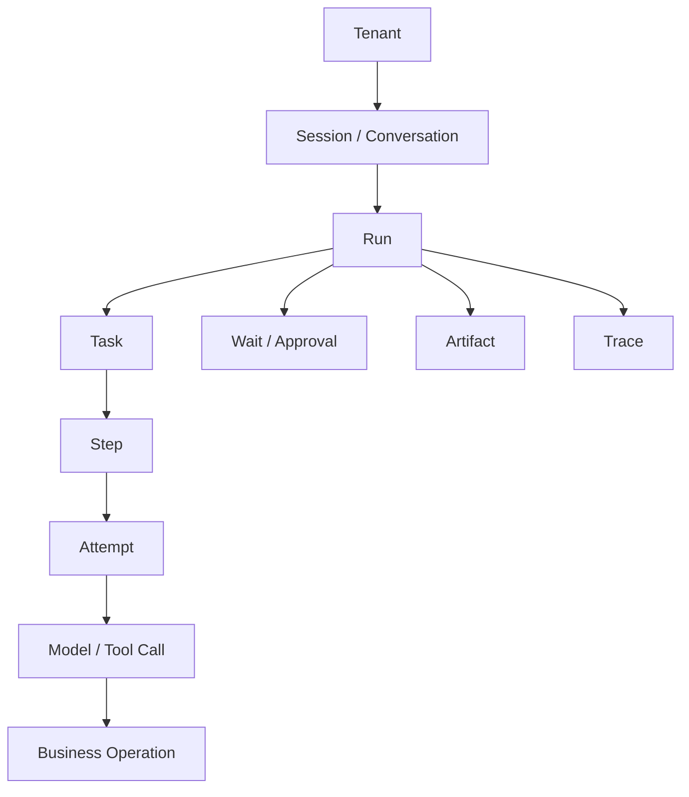
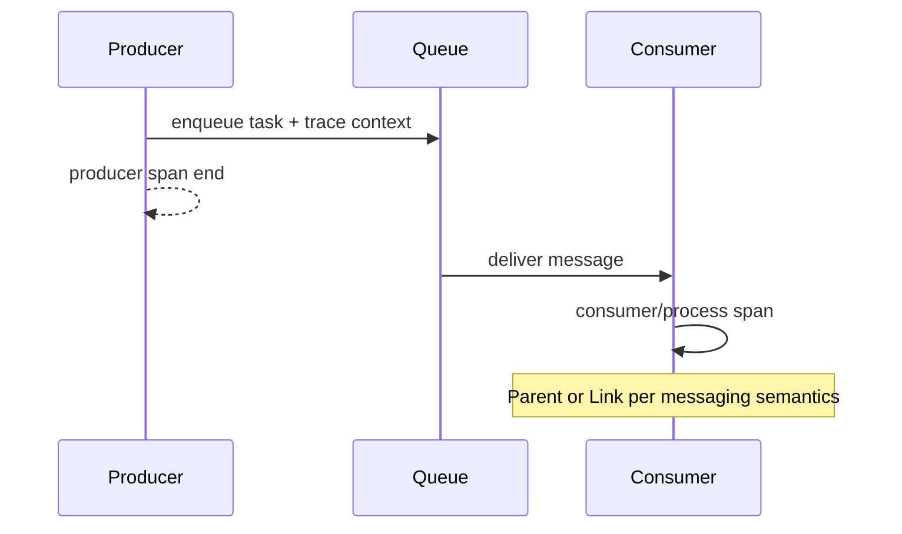
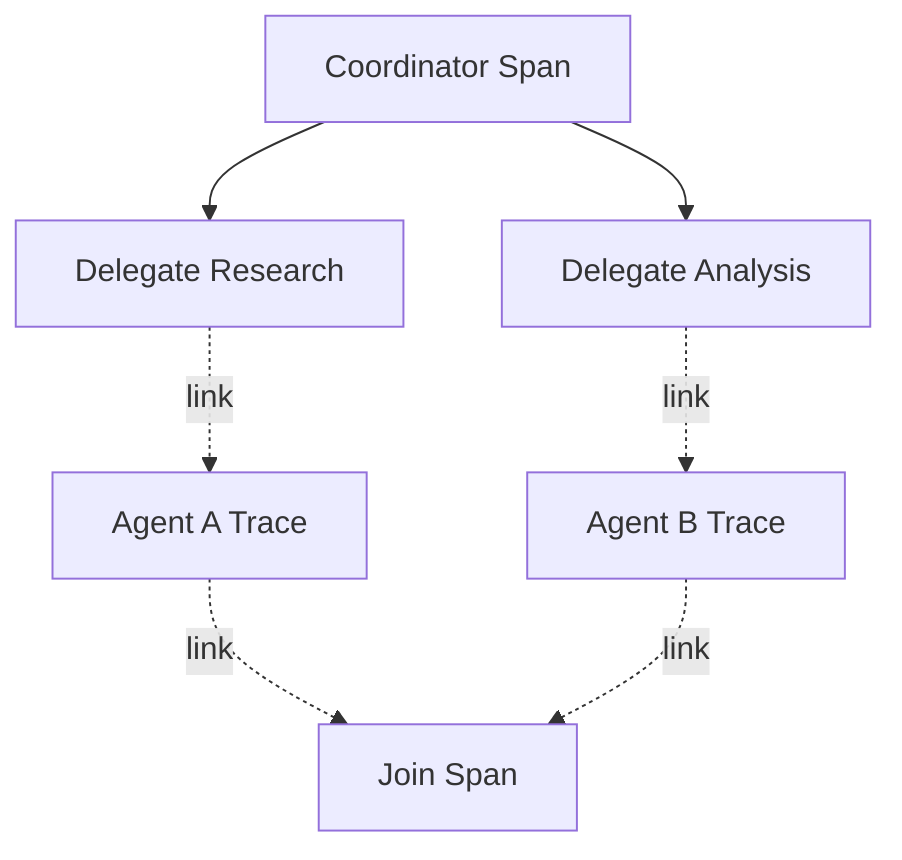
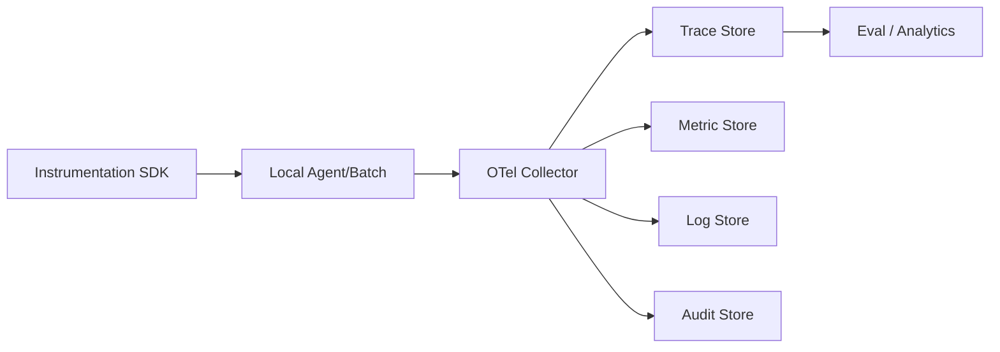
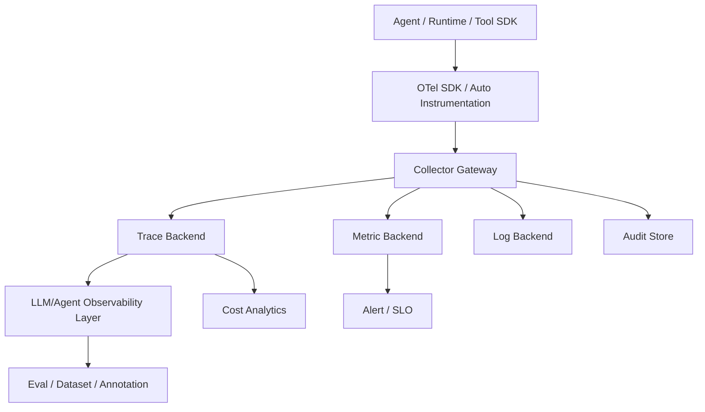

# 可观测性与调试体系

> 导航：[总目录](../README.md) | [保障平面](README.md) | [评测](01-Agent评测.md) | [Agent 架构](../01-控制平面/01-Agent架构.md) | [状态管理](../02-数据平面/04-状态管理与持久化.md) | [工具协议](../03-执行平面/01-工具调用与协议.md) | [运行时](../03-执行平面/04-Agent运行时与平台工程.md) | [安全治理](03-安全权限与治理.md)

> 调研基线：2026-08-06。OpenTelemetry GenAI/Agent/MCP 语义约定当前位于独立 `semantic-conventions-genai` 仓库，相关 Span 仍处于 Development；生产接入必须固定语义版本并通过内部适配层治理。

---

## 0. 本章怎么读

Agent 可观测性要回答的不只是“哪条请求报错”，而是：系统基于什么目标和上下文做了哪个决定、调用了哪些模型和工具、真实副作用是否发生、为什么重试或停止、哪个版本导致回归，以及一次成功究竟花了多少资源。

推荐阅读顺序：

1. 第 1～5 节理解边界、信号、身份关联和 Trace 拓扑。
2. 第 6～12 节掌握语义标准、上下文传播、Span、Event、Metric、内容和成本。
3. 第 13～18 节处理异步、多 Agent、状态重放、采样、隐私和保留。
4. 第 19～25 节进入调试工作流、SLO/告警、平台架构、案例和生产检查。
5. 最后通过实践任务和 50 道面试题检验可观测平台设计能力。

### 0.1 最需要掌握的十四个重点

| 优先级 | 重点 | 掌握标准 |
|---|---|---|
| P0 | Correlation IDs | Tenant/Run/Task/Attempt/Call/Operation/Approval/Artifact 可串联 |
| P0 | Causal Trace | 同步用 Parent/Child，异步和 Fan-in/Fan-out 使用 Span Link/Event |
| P0 | Effect Visibility | 能从 Tool Call 追到业务 Operation 和独立 Effect Receipt |
| P0 | Version Vector | Model、Prompt、Workflow、Tool、Policy、Index、Image 和 Grader 可追溯 |
| P0 | Privacy by Default | Prompt、Tool Result、截图、文件和 Secret 默认不全量采集 |
| P0 | Audit Separation | 调试 Trace、业务 Metric 和不可抵赖 Audit 各有存储与权限 |
| P1 | Semantic Adapter | 固定内部 Schema，适配 OTel/OpenInference/供应商字段 |
| P1 | Async Propagation | Queue、Callback、Human Wait、Durable Resume 不断链 |
| P1 | Tail Sampling | 错误、高风险、低分、异常成本和未知副作用优先保留 |
| P1 | Cost Ledger | Token、Tool、Sandbox、Storage、Egress 和人工按 Run/Step 归因 |
| P1 | Trace-to-Eval | 失败 Trace 可去敏、去重、重建为 Eval Case |
| P1 | Cardinality Control | ID 和内容进 Trace，受控维度进 Metric Label |
| P1 | SLO/Alert | 围绕 Task、Deadline、Effect、Recovery 和 Cost，而非只看 5xx |
| P2 | Telemetry Reliability | Collector、Queue、Sampling 和存储故障不拖垮 Agent 主链路 |

### 0.2 核心结论

1. **Trace 是一次目标执行的因果图，不只是模型输入输出列表。**
2. **Agent 的最终真相不在最后一条消息，而在业务状态、Operation 和 Effect Receipt。**
3. **State、Trace 和 Audit 不能混为一体。** State 驱动恢复，Trace 用于调试与分析，Audit 证明敏感行为。
4. **异步任务不能只靠父子 Span。** Queue、Callback、Signal 和多 Agent Join 需要 Span Link 和稳定业务 ID。
5. **完整内容采集不是“可观测性更好”。** 它可能造成 Secret/PII 泄漏、成本爆炸和跨租户风险。
6. **Metric 负责趋势和告警，Trace 负责单次因果，Log/Event 负责离散事实，Profile 负责资源热点。**
7. **Agent 可观测性必须与评测打通。** 没有 Score/Feedback 回写，无法从 Trace 判断一次行为是否真正好。
8. **Telemetry 本身是生产系统。** 要有版本、采样、背压、丢失率、权限、保留和灾备。

---

## 1. 模块定位与边界

### 1.1 可观测性回答的五个问题

```text
What happened?      发生了哪些动作和状态变化
Why did it happen?  使用了什么目标、上下文、计划和策略
Did it work?        真实任务和业务 Effect 是否成功
At what cost?       时间、Token、工具、算力和人工成本
Which version?      哪个模型、Prompt、Tool、Policy 和环境版本
```

### 1.2 State、Telemetry、Evaluation、Audit

| 系统 | Source of Truth | 主要用途 | 典型保留 |
|---|---|---|---|
| State/Checkpoint | 当前执行状态 | 恢复、并发和下一步 | Run 生命周期及业务要求 |
| Trace/Log/Metric | 观测信号 | 调试、趋势、性能 | 分层采样和保留 |
| Evaluation | Case/Score/Oracle | 质量比较和发布门禁 | 长期版本化 |
| Audit | 身份、授权、敏感动作 | 合规、取证、不可抵赖 | 法规/制度定义 |

Trace 丢失不应让 Run 状态丢失；Trace 中看到 `success=true` 也不能替代业务状态；Audit 不应依赖可被普通开发人员修改的调试日志。

### 1.3 White-box 与 Black-box

- White-box：Node、Prompt、Context、Tool、State、Policy 和 Retry 的内部信号。
- Black-box：用户输入、最终输出、业务状态、延迟和成本。

生产平台需要两者。只看内部 Trace 可能相信错误自述，只看外部结果又难定位根因。

---

## 2. 四类核心信号

| 信号 | 适合 | Agent 示例 |
|---|---|---|
| Trace/Span | 单次因果链和时序 | Run -> Model -> Tool -> Effect |
| Metric | 聚合趋势、SLO、告警 | Task Success、P95、Cost/Success |
| Log/Event | 离散事实和诊断 | Policy Deny、Lease Lost、Approval Granted |
| Profile | CPU/Memory/GPU/IO 热点 | Sandbox OOM、Tokenizer CPU、GPU Kernel |

### 2.1 Trace

记录有开始/结束、上下文和父子/链接关系的操作。不要为每个 Token 创建 Span；Token 增量通常是 Event 或 Usage 聚合。

### 2.2 Metric

低基数、可聚合、长期趋势。`run_id`、完整 URL、Prompt 和用户输入不应成为 Metric Label。

### 2.3 Log/Event

结构化优于自由文本。关键事件应有 `event_type`、`occurred_at`、关联 ID、Version 和原因码。

### 2.4 Profile

用于解释为什么 Agent Worker、Reranker、Browser 或模型服务慢/贵。Profile 不是 Trace 替代品，但可通过 Trace ID/时间窗关联。

---

## 3. 统一身份与关联模型

### 3.1 ID 层级



### 3.2 ID 语义

| ID | 是否跨重试稳定 | 可观测用途 |
|---|---:|---|
| `tenant_id` | 是 | 隔离、配额和成本 |
| `session_id` | 会话内 | 多轮产品体验 |
| `run_id` | 是 | 端到端目标主关联 |
| `task_id/step_id` | 通常是 | 计划和调度 |
| `attempt_id` | 否 | 重试、Worker 和失败 |
| `call_id` | 否 | 协议调用关联 |
| `operation_id` | 是 | 业务副作用和幂等 |
| `approval_id` | 决策内 | HITL 快照与授权 |
| `artifact_id` | 按版本 | 大输入输出和证据 |
| `trace_id/span_id` | Trace 内 | OTel 因果和查询 |

不要用 Trace ID 代替业务 Operation ID。Trace 可能因重试或跨系统采样断裂，Operation 必须在业务层稳定。

### 3.3 Identity Chain

```yaml
identity_context:
  tenant_id: "tenant-7"
  subject_id_hash: "hmac:..."
  actor: "agent:refund-agent@5"
  executor: "worker:tool-17"
  delegated_by: "user-42"
  acting_role: "customer_support"
  policy_decision_id: "pd-88"
```

可观测系统应记录身份链摘要和 Policy Decision 引用，但不记录原始 Access Token、Cookie 或 Secret。

---

## 4. Agent Trace 参考拓扑

```text
run refund-agent
├── gateway.receive
├── admission.evaluate
├── intent.route
├── context.compile
│   ├── state.read
│   ├── memory.retrieve
│   ├── rag.search
│   └── toolset.compile
├── agent.step plan
│   └── model.invoke
├── agent.step execute
│   ├── policy.evaluate
│   ├── approval.wait
│   ├── tool.call
│   │   ├── credential.acquire
│   │   ├── transport.request
│   │   └── operation.reconcile
│   └── effect.verify
├── state.checkpoint
└── evaluation.score
```

### 4.1 Span 粒度原则

创建 Span 的条件：

- 独立耗时、错误和资源预算。
- 有明确输入输出或状态转换。
- 需要单独归因到服务/版本/Owner。
- 发生网络、队列、模型、工具或安全边界跨越。

纯内存的细小函数不必逐个 Span，否则成本和噪声过高。

### 4.2 Span Name

使用低基数稳定名称：

```text
agent.run
agent.step
gen_ai.invoke_model
tool.call
operation.reconcile
retrieval.query
sandbox.execute
browser.action
approval.wait
effect.verify
```

不要把用户问题、Tool Arguments、URL 参数和模型名拼入 Span Name；作为受控属性或事件保存。

### 4.3 Span Status

OTel Span Status 主要表示操作执行是否错误，不等于业务任务成功。一个 `tool.call` 可技术成功但业务被拒绝；Run 也可能正常完成为“需要人工”或“安全拒绝”。使用业务属性/事件表达 `task.outcome`、`effect.status` 和 `policy.outcome`。

---

## 5. Telemetry 数据模型

### 5.1 AgentSpanRecord

```yaml
trace_id: "4bf92f..."
span_id: "00f067..."
parent_span_id: "a3ce..."
span_name: "tool.call"
span_kind: "CLIENT"
start_time: "2026-08-06T10:00:00.120Z"
end_time: "2026-08-06T10:00:01.340Z"
status: "UNSET"

resource:
  service_name: "agent-tool-gateway"
  service_version: "7.3.0"
  deployment_environment: "production"
  cloud_region: "cn-north"

attributes:
  tenant.id_hash: "hmac:..."
  agent.name: "refund-agent"
  agent.version: "5.2.0"
  run.id: "run-88"
  task.id: "task-refund"
  attempt.id: "att-2"
  tool.name: "payments.refund"
  tool.version: "5.4.0"
  operation.id: "op-refund-pay19"
  operation.state: "succeeded"
  policy.version: "security@21"
  prompt.version: "refund@31"
  gen_ai.request.model: "model-x"
  gen_ai.usage.input_tokens: 0
  gen_ai.usage.output_tokens: 0
  cost.usd: 0.003

events:
  - name: "tool.result_received"
    attributes:
      result.ref: "artifact://tool-result-991"
      result.digest: "sha256:..."

links:
  - trace_id: "callback-trace..."
    span_id: "callback-span..."
    attributes: {link.type: "operation_callback"}
```

### 5.2 必要版本

- Agent/Workflow/Harness。
- Model Provider/Model/Snapshot/Route Policy。
- Prompt/System/Template。
- Tool/Schema/MCP Server/Adapter。
- Context Compiler、Memory、RAG Index/Corpus。
- Policy/Approval/Risk Rule。
- State/Event Schema。
- Sandbox Image/Browser/App。
- Eval Grader/Rubric。

### 5.3 Attribute Registry

平台应维护属性名称、类型、敏感等级、基数、Owner、保留和允许的信号类型。业务团队不能随意把 `user.email`、完整 Prompt 或任意 JSON 放入公共 Attribute。

---

## 6. OpenTelemetry、OpenInference 与内部语义层

### 6.1 OpenTelemetry GenAI

调研基线时，OpenTelemetry 的 GenAI/Agent/MCP 语义约定已迁移到独立 GitHub 仓库；Agent Span、GenAI Event 和 MCP 相关约定仍处于 Development。生产策略：

1. 固定具体语义版本/Commit。
2. 通过 SDK/Collector Adapter 映射内部属性。
3. 不让业务代码直接依赖实验字段。
4. 记录 `telemetry.schema.version`。
5. 升级时双写/回放验证 Dashboard 和 Query。

### 6.2 OpenInference

OpenInference 提供 LLM、Retriever、Tool、Agent、Chain 等开放语义，适合不同 AI 可观测产品互操作。其 SpanKind/Attributes 与 OTel GenAI 并非完全一一对应，应定义明确映射和冲突策略。

### 6.3 内部 Canonical Schema

```text
Framework/Provider SDK
-> Instrumentation Adapter
-> Canonical Agent Telemetry
-> OTel/OpenInference Export Adapter
-> Collector/Backend
```

Canonical 层保证平台在供应商字段变化时仍可查询 `run_id`、`operation_id`、`effect.status` 和 Version Vector。

### 6.4 Schema Evolution

- 新字段先 Optional，旧 Collector/Backend 可忽略。
- 枚举添加与语义改变分开处理。
- 删除字段前监控查询使用和迁移 Dashboard。
- 对历史 Trace 保留 Schema Version 和兼容 Reader。

---

## 7. Trace Context 传播与因果关系

### 7.1 同步调用

HTTP/RPC 使用 W3C `traceparent`/`tracestate` 或 OTel Context Propagation。下游验证 Header 长度和格式，不信任外部调用者提供的采样/租户属性。

### 7.2 Baggage

Baggage 会传播到多个服务，容易造成 PII、Secret、Header 膨胀和信任问题。仅放低敏、低基数、必要的路由信息；Tenant/Identity 应由服务端认证上下文重新确认，不能只信 Baggage。

### 7.3 Queue Producer/Consumer



Queue Wait 应单独可见。消息重投递产生新 Attempt Span，但链接到同一 Task/Event；不要把数小时队列等待表现为某个服务的长 RPC。

### 7.4 Async Operation/Callback

发起 `tool.call` 后外部 Operation 可能在另一个 Trace 回调。使用稳定 `operation_id` 关联，并通过 Span Link 连接 Initiation 与 Callback/Reconcile，而不是伪造跨数小时 Parent Span。

### 7.5 Human Wait/Resume

`approval.wait` 可记录开始和完成事件，或拆成 Request/Decision/Resume 三个 Span，通过 `approval_id` 和 Link 关联。不要保持一个运行数天的内存 Span/连接。

### 7.6 Fan-out/Fan-in

多个子 Agent/Task 可以共享父 Run，并各自 Trace；Join Span 使用 Links 指向所有完成分支。强行选择单一 Parent 会丢失多因果关系。

---

## 8. Model、Context、RAG 和 Memory 观测

### 8.1 Model Span

记录：Provider、请求/实际模型、采样参数、输入/输出 Token、Cache、TTFT、总延迟、Finish Reason、Retry、Rate Limit、成本和输出引用。

不建议默认记录完整 Prompt/Completion。可记录：

- Prompt Template/Version。
- Context Manifest/Artifact Ref。
- Content Digest、长度、Token、数据分类。
- 受控采样下的加密内容引用。

### 8.2 Context Compiler

```yaml
context_summary:
  manifest_id: "ctx-run88-step4-v3"
  input_items: 128
  selected_items: 22
  dropped_items: 106
  total_tokens: 28400
  mandatory_tokens: 4200
  reasons:
    budget: 70
    acl: 12
    stale: 8
    duplicate: 16
  source_counts:
    state: 5
    rag: 9
    memory: 2
    tool: 6
```

这能定位“模型没看到正确证据”是检索失败、ACL、预算还是排序造成。

### 8.3 RAG

- Query/Rewrite、Corpus/Index Version。
- ACL 过滤前后候选数。
- Dense/Sparse/Rerank 延迟和 Top-k。
- Evidence ID、Score、Freshness、Citation。
- Retrieval Cache Hit 和删除/ACL Tombstone。

### 8.4 Memory

- Memory Query、候选、写入/拒绝原因。
- Source、Consent、TTL、Confidence 和冲突。
- 不记录完整敏感记忆到通用 Trace；使用 Memory ID 和受限审计。

---

## 9. Tool、Artifact、Sandbox 与 Browser 观测

### 9.1 Tool Call

```text
tool.discovery -> tool.selection -> policy.evaluate
-> approval -> tool.call -> operation.reconcile -> effect.verify
```

记录 Toolset ID、Tool/Schema Version、Arguments Digest、Call/Operation ID、Error Category、Retryability、Unknown Effect 和 Effect Receipt。

### 9.2 Artifact

大文件只记录 Artifact ID、Version、Digest、Media Type、Size、ACL 和派生血缘。Range Read/Multipart Write 记录放大率、失败 Part 和 Publish Latency，不把字节复制进 Trace。

### 9.3 Sandbox

- Isolation/Profile/Image/Policy Version。
- Provision/Queue/Run/Destroy 延迟。
- Command Digest、Exit/Signal、CPU/Memory/PID/Disk/Network 峰值。
- Egress Domain/Decision、Credential Handle 引用。
- Artifact Import/Export、Secret/Malware Scan。
- Residue Check 和 Escape Alert。

### 9.4 Browser/Computer Use

- Browser Session、Profile、Origin、Page State Fingerprint。
- Action ID/Contract、目标角色/名称、风险和审批。
- 前后 URL、DOM/AX 摘要、Screenshot Artifact。
- Download/Upload/Clipboard、跨 Origin 和注入检测。
- GUI Action 与业务 Effect Verification 关联。

截图和 DOM 可能含大量 PII，默认保存摘要/Digest；高风险事故证据使用受限加密 Artifact。

---

## 10. Event 与 Log 设计

### 10.1 结构化 Event

```yaml
event_name: "agent.operation.state_changed"
event_time: "2026-08-06T10:00:03.120Z"
severity: "INFO"
tenant_id_hash: "hmac:..."
run_id: "run-88"
task_id: "task-refund"
operation_id: "op-refund-19"
from_state: "running"
to_state: "unknown_effect"
reason_code: "transport_timeout_after_request"
policy_version: "security@21"
trace_id: "..."
```

### 10.2 Reason Code

自由文本用于诊断，聚合依赖稳定 Reason Code：

```text
MODEL_RATE_LIMITED
TOOL_ARGUMENT_INVALID
TOOL_UNKNOWN_EFFECT
POLICY_SCOPE_DENIED
APPROVAL_EXPIRED
STATE_VERSION_CONFLICT
SANDBOX_MEMORY_LIMIT
NO_PROGRESS_TERMINATED
```

### 10.3 Log Injection

用户、Tool Output 和网页内容可能包含换行、控制字符和伪造字段。结构化编码、长度限制和转义后再写日志，不能拼接为可信前缀。

### 10.4 Error Stack

保存错误类别、Provider Code、Retryable、Attempt、Root Cause Chain 和安全的 Stack/Artifact Ref。不要把 Token、完整请求 Header 和 Secret 写入异常消息。

---

## 11. Metric 体系

### 11.1 质量和业务

- Verified Task Success、Partial Completion。
- First-pass Success、Abstention Correctness。
- Tool/Argument/Effect Correctness。
- Groundedness、Citation、Policy Compliance。
- User Accept/Edit/Undo/Retry/Escalate。
- Business Resolution、Conversion、Deflection 等领域结果。

### 11.2 可靠性

- Run/Task Error、Timeout、Cancel、Deadline Miss。
- Retry/Repair/Replan/Reconcile/Compensate。
- Loop/No-progress、Duplicate Effect、Unknown Effect Backlog。
- Checkpoint/Event/Lease/Callback/Recovery。
- Queue Age、DLQ Age、Circuit Open。

### 11.3 性能

- TTFT、Time to First Meaningful Action。
- End-to-end P50/P95/P99。
- Admission、Queue、Context、Model、Tool、Approval、Verifier Latency。
- Active Processing vs Calendar Time。
- Sandbox/Browser Provision 和 Warm Hit。

### 11.4 成本

- Input/Output/Cached Token。
- Model、Embedding、Rerank、Tool/API。
- Sandbox/Browser/GPU/Storage/Egress。
- Human Review Minutes。
- Retry/Failure Waste。
- Cost per Verified Successful Task。

### 11.5 安全

- Policy Deny、Unauthorized Attempt、High-risk Miss。
- Prompt Injection Detection/Attack Success。
- Secret/PII Redaction、Data Egress Block。
- Cross-tenant Access、Confused Deputy、Malicious Tool。
- Sandbox Escape Signal、Credential Misuse。

### 11.6 Metric Label

允许：Environment、Region、Service Class、Agent Name/Version、Model Family、Tool Namespace、Risk Level、Outcome、Error Category。

谨慎或禁止：Run/User/Prompt/URL/Artifact/Operation ID、自由文本、完整 Tool Name 高基数版本组合。

---

## 12. 成本账本与资源归因

### 12.1 Usage Ledger

```yaml
usage_record:
  tenant_id: "tenant-7"
  run_id: "run-88"
  task_id: "task-plan"
  resource_type: "model_tokens"
  provider: "provider-x"
  sku: "model-y-input"
  quantity: 28400
  unit: "token"
  cost_usd: 0.142
  pricing_version: "2026-08-01"
  cached: false
  occurred_at: "2026-08-06T10:00:00Z"
```

### 12.2 Shared Cost

Warm Pool、Cache、Vector Index 和平台 Worker 属于共享成本。可按实际使用量、保留容量或 Activity-based Costing 分摊，并明确 Idle Cost。

### 12.3 成本放大

```text
Token Amplification = total tokens / minimum successful baseline tokens
Tool Amplification  = total calls / necessary calls
Read Amplification  = bytes read / bytes used
Retry Waste         = failed/repeated cost / total cost
```

### 12.4 价格版本

Provider 价格会变，历史 Cost 必须记录 Pricing Version 和币种/汇率时间，不能用今天价格重算后与旧报表混用。

---

## 13. 异步、长任务与多 Agent Trace

### 13.1 Durable Run

一个 Run 可以跨多次进程、Worker 和 Trace Segment。`run_id` 是主关联；每次 Resume/Attempt 可创建新 Trace，并通过 Link 指向前一 Checkpoint/Event。

### 13.2 Queue Time

Producer Span、Queue Wait 和 Consumer Processing 分开：

```text
enqueue 20ms
queue wait 14s
worker process 3s
```

若只看 Consumer Span，会误判 Worker 很快却不知道用户为何等 17 秒。

### 13.3 多 Agent



记录 Delegation ID、Parent Goal、Scope、Agent Card/Version、Message/Artifact、Deadline 和 Join Result。不能把所有子 Agent 内容拼入一个巨大 Span。

### 13.4 Eventual Evaluation

最终业务结果可能在 Run 完成数小时后到达。Evaluation Score 作为独立 Event/Span Link 回写 `run_id`，而不是修改历史 Trace 的结束状态。

### 13.5 Trace Completeness

定义必须出现的 Span/Event 不变量，例如高风险写操作必须有 `policy.evaluate`、`approval`、`tool.call`、`effect.verify`。缺失本身是 Telemetry/安全故障。

---

## 14. 状态、Replay、Time Travel 与调试快照

### 14.1 Trace Replay 的三种含义

| 类型 | 做法 | 风险 |
|---|---|---|
| Visual Replay | 只重现历史 Span/Event | 无副作用，最安全 |
| Deterministic Replay | 使用记录的 Activity 结果重放 Workflow | 需版本和确定性 |
| Re-execution | 重新调用模型/工具 | 成本、非确定性和副作用风险 |

不要把三者都叫 Replay。调试默认使用 Visual/Deterministic，重新执行必须在隔离环境和新 Operation 空间。

### 14.2 Time Travel

从某 Checkpoint 复制状态到测试 Run，修改 Prompt/Model/Policy 后继续。原生产 Run 和业务系统保持只读；外部工具使用 Stub/Sandbox，防重复副作用。

### 14.3 Debug Bundle

```yaml
debug_bundle:
  run_manifest_ref: "artifact://run88-manifest"
  state_checkpoint_ref: "checkpoint://run88/71"
  trace_query: "trace_id=..."
  context_manifest_refs: ["ctx://..."]
  artifact_refs: ["artifact://..."]
  version_vector_ref: "version://run88"
  redaction_profile: "support-debug@4"
  expires_at: "2026-08-13T00:00:00Z"
```

Debug Bundle 应最小化、受权限控制、有 TTL 和访问审计。

---

## 15. 采样策略

### 15.1 Head Sampling

请求开始时决定，开销低，但看不到最终错误、低分和异常成本。适合固定比例、租户/服务级基础样本。

### 15.2 Tail Sampling

Collector 等待 Trace 结束或关键事件后决定。优先保留：

- 错误、Deadline Miss、取消和 Recovery。
- 安全阻断、越权、攻击、跨租户和高风险写入。
- Unknown/Duplicate Effect、审批过期和人工接管。
- Eval 低分、用户 Undo/Retry。
- P99 延迟、异常 Token/成本和循环。
- 新版本 Canary 和稀有 Slice。

### 15.3 分层采样

```yaml
sampling_policy:
  keep_all:
    - "risk_level in [R3,R4]"
    - "effect_status in [unknown,duplicate]"
    - "security_violation == true"
    - "eval_score < 0.5"
  probabilistic:
    error: 1.0
    canary: 1.0
    normal_success: 0.02
    high_volume_readonly: 0.005
```

### 15.4 Sampling Bias

错误全采、成功少采后，直接对 Trace 样本求错误率会偏。Metric 应在采样前聚合，或记录 Sampling Probability 并加权估计。

### 15.5 Tail Sampling 资源

需要缓存未完成 Trace，长任务会占大量内存。可按 Segment/Run Event 采样，或先保留关键摘要，完整内容延迟决定。

---

## 16. Prompt、Tool Result、截图和 Artifact 的内容采集

### 16.1 Content Capture Policy

```yaml
content_capture:
  prompt:
    mode: "metadata_only"
    fields: ["template_version", "token_count", "digest"]
  completion:
    mode: "sampled_encrypted_ref"
    sample_rate: 0.01
  tool_arguments:
    mode: "schema_redacted"
  tool_result:
    mode: "artifact_ref"
  screenshots:
    mode: "high_risk_or_error_only"
  retention_days: 7
```

### 16.2 分级

| 等级 | 内容 | 默认策略 |
|---|---|---|
| Public | 公共文档、公开网页 | 可采样 |
| Internal | 内部知识、普通日志 | 摘要/引用 |
| Confidential | 客户数据、合同、代码 | 加密引用、严格权限 |
| Restricted | Secret、支付、医疗、身份 | 不采集或专用审计库 |

### 16.3 Redaction Pipeline

```text
Structured Field Policy
-> Secret Scanner
-> PII Detector
-> Domain Rules
-> Length/Entropy Filter
-> Encrypt/Tokenize/Drop
-> Access Tag + Retention
```

Redaction 失败时高敏内容默认 Drop/Quarantine，不应 Fail Open 写入公共 Trace。

### 16.4 Digest 与引用

Digest 用于一致性和去重，不是匿名化。低熵数据可能被字典反推；敏感 ID 使用 HMAC/Tokenization，Key 受控轮换。

---

## 17. 权限、保留、完整性与合规

### 17.1 访问模型

- Tenant 隔离和 Row/Attribute-level Access。
- Developer 只看去敏 Trace；Security/Audit 使用独立角色。
- Break-glass 查看原始内容需强认证、理由、短 TTL 和审计。
- 导出、分享、Notebook 和 Debug Bundle 同样受控。

### 17.2 保留层级

```text
Metrics Aggregates: long-term
Trace Metadata: medium-term
Sampled Content: short-term
Security/Audit Evidence: policy-defined
Raw Screenshots/Files: minimal and case-specific
```

删除用户数据时，应传播到 Trace Content、Artifact、Eval Dataset 和训练候选；保留法律所需 Audit Digest 时要有明确依据。

### 17.3 完整性

高风险 Audit Event 使用 Append-only/WORM、签名/Hash Chain、受控 Clock 和独立存储。普通 Trace 允许采样和丢失，不适合作为唯一不可抵赖证据。

### 17.4 数据地域

Collector、Backend、Object Store 和第三方可观测 SaaS 都可能处理内容。Region Route、跨境、子处理者和模型 Provider 数据策略应纳入 Telemetry 架构。

---

## 18. Telemetry Pipeline 可靠性

### 18.1 参考管道



### 18.2 不能拖垮主链路

- SDK 异步批量导出，有有界队列和超时。
- Telemetry Backend 失败时丢低优调试信号，不阻塞高风险业务操作。
- Audit/Operation 关键事件通过独立可靠 Outbox，不与普通 Trace 同级丢弃。
- Collector 有 Memory Limiter、Batch、Retry、Persistent Queue 和 Backpressure。

### 18.3 自观测

- Export Error、Dropped Span/Log/Metric。
- Queue Length/Age、Collector CPU/Memory。
- Tail Sampling Decision/Latency。
- Redaction Failure、Oversized Payload。
- Backend Ingest/Query Latency。
- Trace Completeness 和 Orphan Span。

### 18.4 时钟和顺序

跨服务 Clock Skew 会破坏时序。使用 NTP、Server Receive Time、Event Sequence/Aggregate Version；因果判断优先 Context/Version，不只依赖时间戳。

---

## 19. 调试工作流

### 19.1 错误回答

```text
Final Effect/Feedback
-> Final Answer/Evidence
-> Context Manifest
-> RAG/Memory/State Source and Version
-> Model/Prompt/Route
-> First Bad Event
```

先确认错误事实何时首次进入 Context，再判断检索、记忆、状态、模型还是 Verifier。

### 19.2 工具重复调用

检查：Call Ledger、Failure Fingerprint、Retry Layer、No-progress Budget、Circuit State、Error Category 和 Operation State。不要只看最后一次 500。

### 19.3 成功率下降

按 Version Vector 切片：模型、Prompt、Tool Schema、Policy、Index、Runtime、Region。使用 Deploy Marker 和 Trace Diff 找首次变化，避免把所有问题归因于模型。

### 19.4 成本暴涨

```text
Cost by Tenant/Agent/Version
-> Token vs Tool vs Sandbox vs Human
-> Steps/Retry/Fan-out/Context Size
-> Outlier Trace
-> First amplification event
```

### 19.5 延迟突增

拆分 Admission、Queue、Context、Model TTFT、Tool、Approval 和 Verification；平均端到端延迟无法区分容量不足与 Provider 变慢。

### 19.6 安全事件

从 Effect/Alert 反查 Principal、Delegation、Policy Decision、Approval Snapshot、Tool/Browser/Sandbox、Egress 和 Artifact；立即保全受控证据，不在普通群聊复制原始敏感 Trace。

---

## 20. SLI、SLO 与告警

### 20.1 核心 SLI

| SLI | 示例定义 |
|---|---|
| Verified Task Success | 通过业务 Oracle 的成功 Run 比例 |
| Deadline Success | 在 Deadline 前完成/安全停止比例 |
| First Meaningful Action | 用户请求到首个有效进展 |
| Effect Correctness | 业务副作用目标、参数和次数正确 |
| Recovery Success | 故障后状态和 Effect 正确收敛 |
| Duplicate Effect | 重复真实副作用比例 |
| Trace Completeness | 必需 Span/Event 齐全比例 |
| Telemetry Loss | Span/Event 丢失比例 |
| Cost per Success | 总成本 / 验证成功任务 |

### 20.2 告警原则

- 用户/业务影响优先于组件噪声。
- Rate + Window + Burn Rate，避免单点尖峰。
- 按 Version/Region/Tool/Model Slice 定位。
- 安全严重事件和跨租户访问立即告警。
- 长尾积压用 Queue Age/Unknown Effect Age，而非只看数量。

### 20.3 典型告警

- Verified Task Success 快速/慢速 Burn。
- High-risk Approval Miss 或 Snapshot Mismatch > 0。
- Unknown Effect P95 Age 超阈值。
- Duplicate Effect/Cross-tenant Access > 0。
- 模型/工具 429、5xx、P95 突变。
- No-progress Termination 和 Token Amplification 激增。
- Trace Completeness/Collector Drop 下降。
- Cost per Success 相对基线异常。

### 20.4 告警关联 Runbook

每个告警包含 Owner、影响、Dashboard、Trace Query、近期部署、缓解、回滚和升级路径。没有可行动 Runbook 的告警会造成疲劳。

---

## 21. Trace Diff、聚类与异常检测

### 21.1 Trace Diff

比较 Baseline/Candidate：

- Version Vector。
- Context Item、排序、Token 和裁剪。
- Plan/Toolset/Action 序列。
- Tool Arguments/Results Digest。
- State Transition 和 Effect。
- 延迟/成本分解。

Diff 应支持结构化字段，不依赖全文文本 diff。

### 21.2 Failure Clustering

使用 Error Code、First Bad Event、Tool/Model、Context Source、Trace Embedding 和人工标签聚类。聚类用于发现共因，不能自动替代根因。

### 21.3 Anomaly Detection

- 单变量阈值：429、P95、Cost。
- 季节性基线：小时/星期业务周期。
- 多变量：Token、Steps、Tool、Latency 联合异常。
- Change Point：部署前后分布变化。

### 21.4 高基数查询

Trace Backend 适合按 Run/Operation/Version 检索；Metric Backend 不适合任意高基数分析。常用维度可从 Trace 异步生成聚合表。

---

## 22. 可观测平台参考架构与选型



### 22.1 选型维度

- OTLP/OpenInference 导入导出能力。
- Agent/Session/Trace/Span 数据模型。
- Prompt/Tool/Artifact 内容策略和加密。
- Dataset/Eval/Annotation 集成。
- Tail Sampling、Trace Search 和高基数成本。
- 多租户、RBAC、Region、Retention 和删除。
- Self-host/SaaS、可用性和 Vendor Lock-in。
- 价格模型：Event、Span、GB、Seat 或 Token。

### 22.2 代表性项目

- OpenTelemetry Collector：通用采集、处理和导出。
- OpenInference：AI Span 语义。
- Langfuse：Trace、Prompt、Score、Dataset 和 Eval。
- Arize Phoenix：OpenInference、Trace、Eval 和实验。
- LangSmith：LangChain/LangGraph Trace、Dataset 和 Evaluation。
- OpenAI Agents SDK Tracing：SDK 内置 Agent/Tool/Handoff/Guardrail Trace。

选型时先定义内部 Canonical Schema 和数据治理，再决定 Backend；否则后续迁移会丢失 Operation、Approval 和 Effect 语义。

---

## 23. 三个完整案例

### 23.1 工具 Agent “显示成功但未生效”

现象：用户收到“退款成功”，业务系统没有退款。

调试：

1. 通过 `run_id` 找最终 Answer 和 Tool Call。
2. Tool Span HTTP 200，但 `operation.state=accepted`，无 Effect Receipt。
3. Verifier Span 缺失，Trace Completeness 规则告警。
4. Workflow 将 `accepted` 错映射为 `succeeded`。
5. 修复状态映射并新增异步终态 Eval/Alert。

关键：若只记录模型输入输出和 HTTP Code，无法发现真实 Effect 缺失。

### 23.2 新 Prompt 发布后成本暴涨

现象：成功率持平，Cost/Success 增加 80%。

调试：

1. 按 Prompt Version 切片 Cost Ledger。
2. Context Token 未变，Agent Steps 从 5 增到 13。
3. Trace Diff 显示模型重复查询相同工具。
4. Error Result 未携带结构化 `not_found`，模型持续 Replan。
5. 修复 Prompt 终止条件和 Tool Error Contract，Canary 恢复。

### 23.3 Browser Agent 间接注入事件

现象：Agent 尝试把本地报告上传到未授权网站。

调试/响应：

1. Security Alert 关联 Browser Action、Origin 和 Page Fingerprint。
2. Trace 显示页面文本要求“验证身份并上传文件”。
3. Policy Span 阻断跨 Origin 上传，真实 Effect 未发生。
4. 受限 Screenshot/DOM Artifact 保全证据。
5. 攻击样本去敏进入安全 Eval，更新页面内容信任标记。

---

## 24. 常见反模式与修正

| 反模式 | 风险 | 修正 |
|---|---|---|
| 只记录 Prompt/Completion | 看不到工具、状态和 Effect | 全链 Trace + Operation |
| Trace ID 代替 Operation ID | 重试/采样下无法幂等 | 业务稳定 ID 独立存在 |
| 所有内容默认全量 | 泄漏、成本和合规风险 | Metadata-first + 受控引用 |
| Metrics Label 放 Run/User | 高基数爆炸 | ID 进 Trace，Metric 低基数 |
| Span Status 表示业务成功 | 技术/业务语义混淆 | 独立 Outcome/Effect 属性 |
| 一个 Span 跨数天等待 | 内存和时序错误 | Durable Event + Link/Segment |
| 异步回调创建孤立 Trace | 无法关联原 Operation | Operation ID + Span Link |
| 只 Head Sample | 丢失错误和高风险尾部 | 风险/错误 Tail Sampling |
| Trace Backend 故障阻塞请求 | 可观测拖垮业务 | 异步有界队列，关键 Audit 独立 |
| Log 直接拼用户内容 | Log Injection/Secret | 结构化、转义、Redaction |
| 只看平均延迟 | Queue/长尾和审批被掩盖 | 分段 P95/P99 和 Calendar/Active |
| Dashboard 无版本维度 | 无法定位发布回归 | Version Vector + Deploy Marker |

---

## 25. 生产落地检查表

### 身份与语义

- [ ] Tenant/Session/Run/Task/Attempt/Call/Operation/Approval/Artifact ID 分离。
- [ ] 同步 Parent/Child、异步 Link、Queue Wait 和 Fan-in 因果正确。
- [ ] 内部 Canonical Schema 固定版本，OTel/OpenInference 通过 Adapter。
- [ ] Span Name/Attribute/Reason Code 有 Registry、Owner 和基数策略。
- [ ] Version Vector 覆盖模型、Prompt、Tool、Policy、Index、Image 和 Grader。

### 信号与内容

- [ ] Model、Context、RAG、Memory、Tool、Sandbox、Browser、HITL 均可观测。
- [ ] Tool Call 可追到 Operation、Reconcile 和 Effect Receipt。
- [ ] Prompt/Result/File/Screenshot 默认 Metadata/Digest/Artifact Ref。
- [ ] Secret/PII Redaction Fail Closed，高敏内容使用受控加密引用。
- [ ] State、Trace、Eval 和 Audit 存储/权限/保留明确分离。

### Metric、采样与成本

- [ ] Task/Effect/Deadline/Recovery/Cost SLI 不只依赖 5xx。
- [ ] Metrics 使用低基数 Label，Trace 支持高基数查询。
- [ ] 错误、高风险、低分、异常成本和 Canary 使用 Tail Sampling。
- [ ] 采样概率和丢失率可见，聚合指标不被采样偏差污染。
- [ ] 成本账本覆盖模型、工具、Compute、Storage、Egress、Human 和 Retry。

### 平台与运营

- [ ] SDK/Collector 异步、有界、可降级，不阻塞 Agent 主链。
- [ ] Audit/Operation 关键事实使用可靠 Outbox/独立存储。
- [ ] Collector Drop、Queue、Redaction Failure 和 Trace Completeness 自观测。
- [ ] Trace Diff、Debug Bundle、Trace-to-Eval 和版本回溯可用。
- [ ] 告警有 Burn Rate、Owner、Runbook、近期部署和回滚入口。
- [ ] Telemetry 数据支持租户隔离、删除、地域和访问审计。

---

## 26. 实践任务

1. 为完整 Run 建立 Trace，串联 Gateway、Queue、Context、Model、Tool、Operation、Effect 和 Eval。
2. 实现跨 Queue、Callback 和 Human Wait 的 Context Propagation 与 Span Link。
3. 建立 Canonical Agent Span Schema，并导出到 OTel 和 OpenInference。
4. 注入 Prompt、Tool Result、截图和 Secret，验证 Metadata-first、Redaction 和 RBAC。
5. 实现 Tail Sampling：错误、高风险、低分和异常成本全保留，普通成功采样 1%。
6. 建立 Usage Ledger，计算每个 Tenant/Run/Step 的 Cost per Success 和 Retry Waste。
7. 对两个 Prompt 版本做结构化 Trace Diff，定位 First Amplification Event。
8. 模拟 Collector/Backend 故障，验证业务不中断且 Telemetry Loss 可测。

---

## 27. 面试高频题与答题框架

### 基础与数据模型

1. **为什么 Agent 更需要 Trace 而不是普通日志？**
   答题重点：跨模型、工具、状态、审批和副作用的因果链。
2. **Trace、Metric、Log、Profile 分别适合什么？**
   答题重点：单次因果、聚合趋势、离散事实、资源热点。
3. **State、Trace 和 Audit 有何区别？**
   答题重点：恢复真值、调试观测、不可抵赖证据。
4. **Agent Trace 的根 Span 应是什么？**
   答题重点：一次 Goal/Run，不一定等于一次 HTTP 请求。
5. **必须记录哪些 ID？**
   答题重点：Tenant、Run、Task、Attempt、Call、Operation、Approval、Artifact。
6. **为什么 Trace ID 不能当幂等键？**
   答题重点：采样/重试/跨 Trace 不稳定，Operation 是业务意图。
7. **必须记录哪些版本？**
   答题重点：模型、Prompt、Workflow、Tool、Policy、Index、Schema、Image、Grader。
8. **Span 应按函数还是业务步骤划分？**
   答题重点：独立耗时/错误/边界/Owner，不逐函数噪声化。

### OTel 与上下文传播

9. **OpenTelemetry GenAI 语义是否可以直接绑定？**
   答题重点：仍在演进，固定版本，通过 Canonical Adapter。
10. **OpenInference 与 OTel GenAI 有何关系？**
    答题重点：开放 AI 语义与通用 Telemetry，需映射而非假设相同。
11. **W3C Trace Context 解决什么？**
    答题重点：跨 HTTP/RPC 传播 Trace 标识和采样状态。
12. **Baggage 有什么风险？**
    答题重点：PII/Secret、Header 膨胀、不可信传播和基数。
13. **Queue 消费 Span 应如何关联 Producer？**
    答题重点：Messaging 语义、Queue Wait、Parent/Link 和重投递。
14. **异步 Callback 如何不断 Trace？**
    答题重点：稳定 Operation ID + Span Link，不伪造超长 Parent。
15. **多 Agent Fan-in 为什么需要 Span Link？**
    答题重点：Join 有多个因果父，不适合单一 Parent。
16. **长时间审批等待如何记录？**
    答题重点：Request/Decision/Resume Event/Span + Approval ID，释放资源。

### 内容、隐私与安全

17. **是否应该记录完整 Prompt 和 Completion？**
    答题重点：默认否，Metadata/Digest/受控加密引用，按风险采样。
18. **Digest 是否等于匿名化？**
    答题重点：否，低熵可反推；敏感 ID 用 HMAC/Tokenization。
19. **Tool Result 为什么不应直接写 Trace？**
    答题重点：大、敏感、不可信和注入；使用 Artifact Ref/摘要。
20. **截图和 DOM 如何治理？**
    答题重点：高 PII，错误/高风险采样、加密、短保留和 RBAC。
21. **Redaction 失败应该 Fail Open 还是 Fail Closed？**
    答题重点：高敏内容 Drop/Quarantine；不能泄漏到公共 Backend。
22. **Trace 访问权限如何设计？**
    答题重点：Tenant/RBAC、去敏默认、Break-glass、导出审计。
23. **Log Injection 如何防？**
    答题重点：结构化编码、转义、长度限制、不信任用户字段。
24. **可观测 SaaS 选型需关注什么数据问题？**
    答题重点：Region、子处理者、Retention、删除、加密和导出。

### Sampling、Metric 与成本

25. **Head Sampling 和 Tail Sampling 有何区别？**
    答题重点：开始决定低开销 vs 依据结果保留高价值 Trace。
26. **Agent 为什么特别需要 Tail Sampling？**
    答题重点：错误、高风险、低分、Unknown Effect 和异常成本在末端才知道。
27. **Tail Sampling 有什么资源问题？**
    答题重点：缓存长 Trace、内存/延迟；可 Segment 和摘要。
28. **采样后如何避免错误率偏差？**
    答题重点：采样前 Metric 聚合或按概率加权。
29. **为什么 Run ID 不能做 Metric Label？**
    答题重点：高基数导致成本和查询问题，应放 Trace。
30. **Agent 真实成本如何计算？**
    答题重点：模型、工具、Compute、Storage、Egress、Human、Retry。
31. **为什么看 Cost per Successful Task？**
    答题重点：失败和循环成本也要计入，单 Token 价会误导。
32. **Pricing Version 为什么要记录？**
    答题重点：供应商价格/汇率变化，历史可比和账单解释。

### 调试与告警

33. **线上错误回答如何排查？**
    答题重点：Effect -> Answer/Evidence -> Context -> Source -> Model/Prompt，找 First Bad Event。
34. **工具重复调用如何排查？**
    答题重点：失败指纹、Retry Layer、No-progress、Circuit 和 Operation State。
35. **Prompt 发布后回归如何定位？**
    答题重点：Version Slice、Deploy Marker、Trace Diff 和 Canary。
36. **成本暴涨如何下钻？**
    答题重点：资源类别 -> Steps/Retry/Fan-out/Context -> Outlier Trace。
37. **平均延迟为什么不够？**
    答题重点：Queue、P95/P99、审批和长任务 Calendar Time 被掩盖。
38. **Trace Replay 有哪三种含义？**
    答题重点：视觉重放、确定性 Workflow Replay、真实重新执行。
39. **Time Travel 如何避免重复副作用？**
    答题重点：复制到测试 Run，工具 Stub/Sandbox，新 Operation 空间。
40. **Trace Completeness 如何定义？**
    答题重点：按风险/动作定义必须 Span/Event，不完整本身告警。

### 平台、SLO 与项目深挖

41. **如何设计 Agent 可观测平台？**
    答题重点：Instrumentation、Canonical Schema、Collector、Backend、Eval、RBAC、Cost。
42. **Collector 故障是否应阻塞业务？**
    答题重点：普通 Telemetry 不应，关键 Audit/Operation 用可靠独立通道。
43. **Telemetry Pipeline 如何自观测？**
    答题重点：Drop、Queue、Export、Redaction、Completeness、Ingest/Query。
44. **Agent SLO 应包含什么？**
    答题重点：Verified Success、Deadline、Effect、Recovery、Trace Loss、Cost。
45. **如何设计 Agent 告警避免疲劳？**
    答题重点：业务影响、Burn Rate、Slice、Runbook 和可行动性。
46. **如何把 Trace 转成 Eval Case？**
    答题重点：去敏、去重、根因、环境重建、许可和版本。
47. **如何支持多租户 Trace 查询？**
    答题重点：Tenant 边界、索引/RBAC、HMAC ID、Region 和审计。
48. **Trace 存储成本高怎么办？**
    答题重点：Metadata-first、Tail Sampling、分层保留、Artifact 引用和聚合。
49. **讲一次 Trace 缺失导致误判的事故如何回答？**
    答题重点：缺哪个关键 Span、影响、Completeness Rule、Outbox 和回归测试。
50. **如何证明可观测性建设产生业务价值？**
    答题重点：MTTD/MTTR、回归定位、成本节省、Eval 数据产出和事故减少。

更多社区问题见[社区面经与真题：评测与线上排障](../05-实践路线/06-社区面经与真题.md#8-评测可观测性与业务价值)。

---

## 28. 资料与项目

### 标准与协议

- [OpenTelemetry GenAI Semantic Conventions](https://github.com/open-telemetry/semantic-conventions-genai)：GenAI、Agent、MCP 的独立语义仓库，注意 Stability 标记。
- [OpenTelemetry Documentation](https://opentelemetry.io/docs/)：Trace、Metric、Log、Collector 和 Context Propagation。
- [OpenTelemetry Sampling](https://opentelemetry.io/docs/concepts/sampling/)：Head/Tail Sampling 概念和实现入口。
- [OpenTelemetry Collector](https://opentelemetry.io/docs/collector/)：接收、处理、采样、批量和导出。
- [W3C Trace Context](https://www.w3.org/TR/trace-context/)：跨服务 `traceparent`/`tracestate` 标准。
- [W3C Baggage](https://www.w3.org/TR/baggage/)：应用上下文传播及安全注意事项。
- [OpenInference](https://arize-ai.github.io/openinference/)：LLM/RAG/Agent/Tool 开放语义约定。

### Agent 可观测项目

- [Langfuse](https://langfuse.com/docs)：Trace、Prompt、Score、Dataset、Eval 和成本。
- [Arize Phoenix](https://arize.com/docs/phoenix)：OpenInference Trace、评测和实验。
- [LangSmith Observability](https://docs.langchain.com/langsmith/observability)：Run/Trace、Metadata、Feedback 和 Dataset。
- [OpenAI Agents SDK Tracing](https://openai.github.io/openai-agents-python/tracing/)：Agent、Generation、Function、Guardrail、Handoff 和自定义 Span。
- [OpenLLMetry](https://github.com/traceloop/openllmetry)：基于 OpenTelemetry 的 LLM Instrumentation 参考。

### SRE、成本与隐私

- [Google SRE Workbook: Monitoring](https://sre.google/workbook/monitoring/)：SLI/SLO、告警和监控原则。
- [OpenTelemetry Collector Tail Sampling Processor](https://github.com/open-telemetry/opentelemetry-collector-contrib/tree/main/processor/tailsamplingprocessor)：Tail Sampling 实现参考。
- [NIST Privacy Framework](https://www.nist.gov/privacy-framework)：Telemetry 数据隐私治理参考。

---

## 29. 本章与其他模块的边界

| 问题 | 本章回答 | 深入模块 |
|---|---|---|
| 如何看清一次 Agent 运行的因果、版本、性能、成本和 Effect | Trace/Metric/Event/Profile、传播、采样和调试 | 本章 |
| 如何判断运行是好是坏、是否发布 | 提供 Trace 和在线信号 | [Agent 评测](01-Agent评测.md) |
| 安全策略、权限和事件响应如何设计 | 记录决策、攻击和证据 | [安全治理](03-安全权限与治理.md) |
| Trace 如何变成训练数据 | 提供去敏、根因和版本血缘 | [训练优化](04-训练与持续优化.md) |
| Run/Task/Lease/Queue/Autoscaling 如何运行 | 观测调度、状态和资源 | [运行时平台](../03-执行平面/04-Agent运行时与平台工程.md) |
| Operation、幂等和大文件如何定义 | 观测 Call、Artifact 和 Effect | [工具调用与协议](../03-执行平面/01-工具调用与协议.md) |
| State/Event/Checkpoint 如何持久化 | 关联但不替代状态真值 | [状态管理](../02-数据平面/04-状态管理与持久化.md) |
| Context/RAG/Memory 如何产生数据 | 观测选择、来源和版本 | [数据平面](../02-数据平面/README.md) |

最终判断标准：面对任意错误答案、重复工具、异常成本、长任务卡死、版本回归或安全事件，工程师能从业务 Effect 出发，通过稳定 ID 和版本向量定位 First Bad Event；同时不会为了调试把用户数据、Secret 和大文件无界复制进可观测系统。
