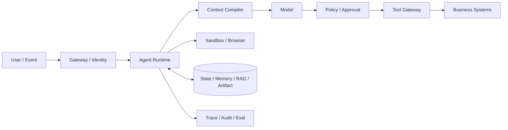
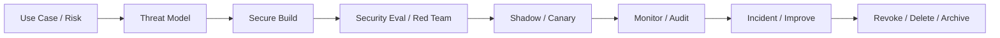
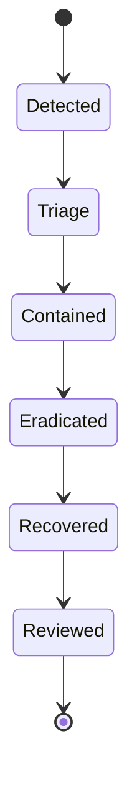

# 安全、权限与治理

> 导航：[总目录](../README.md) | [保障平面](README.md) | [Agent 架构](../01-控制平面/01-Agent架构.md) | [上下文工程](../02-数据平面/01-上下文工程.md) | [工具协议](../03-执行平面/01-工具调用与协议.md) | [沙箱](../03-执行平面/02-沙箱与Computer-Use.md) | [HITL](../03-执行平面/03-Human-in-the-loop.md) | [评测](01-Agent评测.md) | [可观测性](02-可观测性.md)

> 调研基线：2026-08-06。本文参考 OWASP `Top 10 for Agentic Applications 2026`、NIST AI RMF/Generative AI Profile、MITRE ATLAS、OAuth Security BCP 和 MCP `2026-07-28` Security Best Practices；组织落地仍需结合行业法规、地域和内部制度。

---

## 0. 本章怎么读

Agent 安全的根本问题是：不可信自然语言、网页、文件、记忆和其他 Agent，可以影响一个拥有数据、工具、身份和执行权限的自动化系统。安全不能只依赖“更强的系统 Prompt”，必须把模型当作不可信决策组件，使用确定性的身份、授权、策略、沙箱、幂等、审批和验证形成纵深防御。

推荐阅读顺序：

1. 第 1～5 节建立零信任原则、资产、信任边界和威胁建模。
2. 第 6～14 节掌握注入、身份授权、策略、工具供应链、数据、记忆、模型、沙箱和多 Agent 安全。
3. 第 15～20 节处理经济攻击、治理、Secure SDLC、事件响应、红队和指标。
4. 第 21～24 节通过案例、反模式、检查表和实践落地。
5. 最后通过 56 道面试题检验安全设计和事故处置能力。

### 0.1 最需要掌握的十六个重点

| 优先级 | 重点 | 掌握标准 |
|---|---|---|
| P0 | Untrusted Model | 模型输出永远只是建议，不能直接跨越到特权执行 |
| P0 | Instruction/Data Boundary | 网页、文档、Tool Output 和 Memory 不能修改系统策略 |
| P0 | Least Privilege | 权限绑定主体、动作、资源、目的、环境、时间和 Operation |
| P0 | Server-side Authorization | 每次工具调用服务端重新鉴权，不信模型/客户端声明 |
| P0 | Delegation Chain | Subject、Actor、Audience、Scope、Resource 和 TTL 可验证 |
| P0 | Confused Deputy | 高权限 Agent 不替低权限请求者执行无权动作 |
| P0 | Effect Control | 高风险副作用有审批、幂等、Reconcile 和独立验证 |
| P0 | Data Isolation | 检索前 ACL、租户 Cache Key、Artifact/Trace/Memory 全链隔离 |
| P1 | Capability Minimization | 只暴露当前步骤需要的工具、数据和网络 |
| P1 | Supply Chain | Model、Prompt、Skill、MCP、Package、Dataset 和 Image 都有来源治理 |
| P1 | Sandbox/Egress | 不可信代码和 Browser 使用默认拒绝的文件、网络、凭据边界 |
| P1 | Persistent Poisoning | Memory/RAG/Checkpoint 的写入、纠正、删除和 Provenance 可控 |
| P1 | Multi-agent Trust | 消息、身份、委派、Artifact 和协议版本均验证 |
| P1 | Denial of Wallet | Token、Tool、Fan-out、Sandbox、Storage 和 Human 均有预算 |
| P1 | Detection/Response | Kill Switch、凭据撤销、任务停止、证据保全和恢复演练 |
| P2 | Governance | 资产、风险等级、Owner、审批、例外、供应商和退役全生命周期 |

### 0.2 核心结论

1. **Prompt Injection 不能靠 Prompt 彻底解决。** 真正边界是最小权限、数据最小化、确定性策略、沙箱、审批和副作用验证。
2. **模型可以被说服，但系统不应因此越权。** 安全目标不是让模型永不犯错，而是让错误无法跨越能力边界。
3. **身份认证、系统授权、业务审批和用户 Consent 相互独立。** 任何一个都不能自动替代其他控制。
4. **权限过滤发生在检索和暴露之前。** 无权工具、数据和 Memory 不应进入模型候选集合。
5. **Tool/MCP/A2A/网页/文件返回都不可信。** 它们可能包含恶意指令、伪造状态、敏感数据或供应链载荷。
6. **高风险写操作必须面向真实 Effect 设计。** HTTP 成功和模型自述都不能证明支付、删除或发布正确完成。
7. **Agent 安全是全生命周期治理。** 设计、开发、评测、发布、监控、响应和退役都需要控制。
8. **安全失败和可用性失败必须分开。** 安全服务不可用时高风险动作 Fail Closed，不因业务压力静默放宽。

---

## 1. 模块定位与零信任原则

### 1.1 安全目标

```text
Confidentiality: 不泄漏无权数据、Secret 和隐私
Integrity:       不让不可信输入篡改目标、状态、记忆和业务对象
Availability:    不因循环、攻击和资源滥用失去服务
Authorization:   只有正确主体能对正确资源执行正确动作
Accountability:  能证明谁、为何、用什么版本做了什么
Safety:          不产生超出风险边界的人身、法律和业务伤害
```

### 1.2 零信任在 Agent 中的含义

- 不因请求来自内部网络、同一 Agent 或已登录用户而默认信任。
- 每次敏感调用验证 Subject、Actor、Resource、Action、Context 和 Policy。
- 最小化每一步可见的工具、数据、网络和凭据。
- 假设模型、网页、文档、Tool Output 和第三方服务可能被攻陷。
- 持续验证状态、版本、授权和 Effect，而非“一次登录永久可信”。

### 1.3 模型的安全角色

模型适合：识别语义风险、生成解释、提出候选策略、分类未知内容。

模型不应独立决定：身份真实性、最终授权、Secret 访问、审批有效性、幂等重试、租户边界和安全日志删除。

---

## 2. 资产清单与数据流

### 2.1 资产类别

| 类别 | 示例 |
|---|---|
| Identity | 用户、Agent、Service Account、Workload Identity |
| Credentials | OAuth Token、API Key、Cookie、SSH Key、Secret Handle |
| Data | 用户输入、RAG、Memory、State、Artifact、Trace、训练数据 |
| Capability | Tool、MCP Server、A2A Agent、Browser、Sandbox、代码执行 |
| Configuration | Prompt、Policy、Workflow、Tool Schema、Model Route |
| Model | Base Model、Adapter、Embedding、Reranker、Guard Model |
| Infrastructure | Runtime、Queue、State DB、Artifact Store、Collector |
| Business Effect | 支付、退款、邮件、发布、删除、权限和采购 |
| Evidence | Audit、Approval Snapshot、Effect Receipt、Eval Result |

### 2.2 Asset Registry

```yaml
asset_id: "agent://refund-agent@5.2.0"
asset_type: "agent"
owner: "payments-platform"
business_purpose: "辅助客服处理重复扣款"
risk_tier: "high"
environments: ["staging", "production"]
data_classes: ["customer_pii", "financial"]
capabilities:
  - "orders.read"
  - "refund.draft"
  - "refund.submit_with_approval"
dependencies:
  models: ["model://provider-x/model-y@date"]
  tools: ["tool://payments.refund@5.4.0"]
  mcp_servers: []
  data_sources: ["source://orders", "source://payments"]
controls:
  policy: "policy://refund-agent@21"
  eval_suite: "suite://refund-security@18"
  kill_switch: "kill://refund-agent"
retention: "policy://financial-data-retention"
last_reviewed_at: "2026-08-01"
```

### 2.3 数据流图



每条边标注：数据分类、主体、Purpose、协议、加密、地域、保留和下游处理者。安全评审围绕数据/权限跨边界，而不是围绕组件名称。

---

## 3. 攻击者与信任边界

### 3.1 攻击者

- 恶意或被攻陷的外部用户。
- 低权限内部用户和 Insider。
- 被注入的网页、邮件、文档、Issue 和聊天。
- 恶意/被攻陷的 Tool、MCP Server、A2A Agent 和供应商。
- 被投毒的数据源、Memory、Vector Index、训练集和模型。
- 供应链攻击者：Package、Image、Browser Extension、CI/CD。
- 误配置或有缺陷的 Agent/Policy/Workflow。
- 成本攻击者：制造长上下文、无限循环和 Fan-out。

### 3.2 信任等级

```text
Untrusted:
  user text, web, email, retrieved docs, tool output, external agent message

Conditionally trusted:
  model decision, generated plan, extracted memory, third-party model output

Trusted control:
  identity provider, policy engine, schema validator, state machine,
  approval store, idempotency store, credential broker

Privileged execution:
  production tools, business systems, artifact export, sandbox control plane
```

“Trusted” 不是绝对安全，而是受到更强工程、访问和审计控制。模型输出永远不属于 Trusted Control。

### 3.3 关键边界

- 用户/外部内容 -> Context Compiler。
- 模型建议 -> Policy/Tool Gateway。
- Runtime -> Sandbox/Browser。
- Tenant A -> Shared Cache/Index/Trace。
- Host/Client -> MCP Server。
- Agent A -> Agent B/A2A。
- Production Trace -> Eval/Training。
- Human Approval UI -> Operation Executor。

---

## 4. 威胁建模方法

### 4.1 流程

1. 定义业务目标、风险等级和不能发生的 Effect。
2. 绘制资产、身份、数据流和信任边界。
3. 枚举攻击入口和攻击者能力。
4. 使用 STRIDE/Attack Tree/Abuse Case 分析。
5. 将威胁映射到 Prevent/Detect/Respond/Recover 控制。
6. 为控制建立可执行安全 Eval 和监控。
7. 记录残余风险、Owner、例外和复审日期。

### 4.2 STRIDE 映射

| STRIDE | Agent 示例 |
|---|---|
| Spoofing | 伪造用户、Agent Card、Callback 或 Tool Server |
| Tampering | 篡改 Prompt、Memory、Artifact、Tool Schema、State |
| Repudiation | 否认审批/调用，Trace 无完整身份和 Digest |
| Information Disclosure | Prompt/Tool/Trace/Cache 泄漏 PII/Secret |
| Denial of Service | Token/Tool/Sandbox/Queue/人工审批耗尽 |
| Elevation of Privilege | Confused Deputy、Scope 扩大、沙箱逃逸 |

### 4.3 Abuse Case

```yaml
abuse_case:
  id: "AC-REFUND-07"
  goal: "低权限用户借客服 Agent 发起大额退款"
  preconditions:
    - "Agent 服务账号有 refund.submit"
    - "下游只校验服务账号，不校验用户"
  attack_path:
    - "用户构造紧急退款请求"
    - "模型选择退款工具"
    - "Tool Gateway 透传服务凭据"
  impact: "financial_loss"
  controls:
    prevent: ["on_behalf_of_authz", "amount_policy", "approval"]
    detect: ["subject_actor_mismatch", "unusual_amount"]
    respond: ["operation_cancel", "credential_revoke"]
  security_cases: ["sec-refund-confused-deputy-01"]
```

### 4.4 风险计算

```text
Risk = Likelihood * Impact * Exposure * Autonomy
       * DataSensitivity * Irreversibility
       / ControlStrength
```

公式只是排序工具，R4 人身/法律/重大金融等高影响场景应有硬规则，不因低估概率而自动化。

---

## 5. Agentic 威胁地图

结合 OWASP Agentic Security Initiative、LLM Top 10、NIST GenAI Profile 和 MITRE ATLAS，可按以下能力链理解威胁：

| 能力链 | 主要威胁 |
|---|---|
| Goal/Input | Goal Hijacking、Direct/Indirect Injection、歧义利用 |
| Context/Knowledge | RAG Poisoning、Memory Poisoning、敏感数据混入 |
| Reasoning/Planning | Deceptive Plan、策略绕过、过度自主、目标漂移 |
| Identity/Delegation | Confused Deputy、Token Theft、Scope/Audience 错误 |
| Tool/Action | Excessive Agency、参数篡改、重复副作用、结果伪造 |
| Code/Browser | Sandbox Escape、SSRF、恶意下载、错误点击、登录态泄漏 |
| Multi-agent | 身份伪造、消息重放、级联错误、权限放大、责任模糊 |
| Persistence | Memory/State/Model/Prompt 后门和长期污染 |
| Supply Chain | MCP/Skill/Package/Image/Model/Dataset 投毒 |
| Availability/Economics | Denial of Wallet、循环、Fan-out、存储/人工耗尽 |
| Human Interaction | 确认疲劳、社会工程、虚假解释、过度信任 |
| Governance | 资产失控、无 Owner、无撤销、Shadow Agent、供应商风险 |

威胁不是孤立类别。一次恶意网页注入可能先改变 Goal，再调用文件工具，最后通过允许的网络外发数据。

---

## 6. Prompt Injection 与指令/数据边界

### 6.1 Direct 与 Indirect

- Direct：用户显式要求忽略规则、泄漏 Prompt、绕过审批。
- Indirect：网页、邮件、PDF、RAG、Tool Output、代码注释或其他 Agent 消息中包含恶意指令。

间接注入更危险，因为系统可能把内容当“可信业务数据”自动读取。

### 6.2 为什么系统 Prompt 不够

模型最终以相似表示处理指令和数据；攻击可编码、分片、翻译、视觉化并多轮适应。更长的“不要听恶意指令”无法提供确定性边界。

### 6.3 指令层级与来源

```text
System Policy / Verified User Goal
> Approved Plan / Action Contract
> Trusted Capability Metadata
> Untrusted Content as Data
```

每个 Context Item 包含：Source、Trust、Instruction Authority、Data Classification、ACL、Version 和 Timestamp。外部内容的 `instruction_authority=none`。

### 6.4 防御链

1. 只取当前 Step 必需内容，减少攻击面。
2. 检索前 ACL，内容标记来源和信任。
3. 数据与系统指令使用结构化边界。
4. 检测请求 Secret、上传文件、访问内网、改变目标和绕过审批。
5. 工具、文件、网络和凭据最小化，即使模型被说服也无能力越界。
6. 高风险动作独立 Policy/HITL，不让模型自我批准。
7. Tool/Browser Output 进入下一轮前净化、摘要和 Provenance。
8. 最终 Effect 独立验证，异常立即停止/Reconcile。

### 6.5 误报与 Safe Utility

不能把所有外部内容拒绝。评测同时包含合法嵌入式指令、业务文档和攻击，测 Attack Success 与 False Refusal；安全目标是完成合法任务但不执行内容中的未授权指令。

---

## 7. 身份认证、授权、Consent 与审批

### 7.1 四类控制

| 控制 | 回答的问题 |
|---|---|
| Authentication | 调用者是谁？ |
| Authorization | 该主体能否对该资源执行动作？ |
| Consent | 数据主体是否同意特定处理/共享？ |
| Approval | 组织/责任人是否批准这次具体高风险动作？ |

已登录不等于有权限，有权限不等于获得业务审批，审批也不自动代表用户同意数据外发。

### 7.2 身份链

```text
User/Service Subject
-> Agent Actor
-> Runtime/Worker Executor
-> Tool Service
-> Business Resource
```

每层携带并验证 Subject、Actor、Tenant、Audience、Scope、Resource、Purpose、Run/Operation 和 TTL。

### 7.3 Delegation Token

```yaml
delegation:
  subject: "user-42"
  actor: "refund-agent@5"
  audience: "payments-api"
  scopes: ["refund.create"]
  resources: ["payment/pay-19"]
  purpose: "duplicate_charge_refund"
  run_id: "run-88"
  operation_id: "op-refund-pay19"
  expires_at: "2026-08-06T10:20:00Z"
```

Token 由可信授权服务签发，模型不能生成或扩大；目标服务验证 Audience/Scope/Resource，而非只信 Agent 服务账号。

### 7.4 Confused Deputy

防护：

- 下游同时校验 Subject 和 Actor。
- 服务账号权限不能自动代表所有用户。
- 不接受任意下游 Token Passthrough。
- Resource/Audience 精确绑定。
- Tool Discovery 先按主体过滤。
- 审批绑定同一 Subject/Action Snapshot。
- 对身份链断裂、Subject/Actor 不匹配告警。

### 7.5 Session/Token 风险

- OAuth State/PKCE、Redirect URI 精确匹配。
- Token 不放 URL、Prompt、Log、Tool Result。
- 短 TTL、旋转、撤销和 Sender-constrained Token（能力允许时）。
- Browser Cookie/Profile 按用户/任务隔离。
- Local MCP Server 防 Session Hijacking 和不安全本地授权。

---

## 8. Policy Engine 与最小权限

### 8.1 Policy 输入

```yaml
policy_input:
  subject: {id: "user-42", roles: ["support"]}
  actor: {id: "refund-agent@5", trust_tier: "managed"}
  action: "payments.refund"
  resource: {id: "pay-19", tenant: "tenant-7", owner: "user-42"}
  parameters: {amount_minor: 10000, currency: "CNY"}
  environment: "production"
  data_classes: ["financial", "customer_pii"]
  purpose: "duplicate_charge_refund"
  context:
    risk_level: "R3"
    approval_snapshot: "sha256:..."
    device_trust: "managed"
    current_time: "2026-08-06T10:00:00Z"
```

### 8.2 Policy 输出

```yaml
policy_decision:
  decision: "require_approval"
  reason_codes: ["amount_over_support_limit"]
  obligations:
    - "approval:finance_manager"
    - "effect_verification:payments.get_refund"
    - "audit:full"
  constraints:
    max_amount_minor: 10000
    one_operation_only: true
  policy_version: "refund-policy@21"
  decision_id: "pd-991"
```

### 8.3 RBAC、ABAC 与 ReBAC

- RBAC：角色基础，简单稳定，但容易角色爆炸。
- ABAC：主体、资源、环境和参数属性，适合动态风险。
- ReBAC：Owner、Member、Manager、Project 等关系。

Agent 通常需要组合：RBAC 定基线，ReBAC 确认资源关系，ABAC 处理金额、环境、数据和时间。

### 8.4 Capability Envelope

每个 Run/Step 只获得当前所需工具、资源、网络和预算。计划阶段切换或权限变化时重新编译，不给 Agent 一次性全量能力。

### 8.5 Policy as Code

Policy 版本化、Code Review、单元/属性/回归测试、Shadow、Canary 和快速回滚。规则变更可能改变真实业务权限，不能像普通 Prompt 热更新。

---

## 9. 工具、MCP、A2A 与 Skill 供应链

### 9.1 供应链对象

- Tool/API Adapter 和 Schema。
- MCP Server、Client、Host 和授权服务器。
- A2A Agent Card、Endpoint、Task/Artifact 协议。
- Skill Instruction、Script、Template 和依赖。
- Plugin/Extension、Package、Container Image。
- Model/Adapter、Dataset 和 Prompt Bundle。

### 9.2 准入清单

```yaml
capability_review:
  capability_id: "mcp://crm-prod@3"
  owner_verified: true
  source_repository: "scm://crm-mcp"
  build_provenance: "slsa://..."
  artifact_signature: "sigstore://..."
  permissions: ["ticket.read", "ticket.write"]
  data_destinations: ["crm.example.com"]
  network_policy: "egress://crm-only"
  side_effects: ["customer_visible_write"]
  idempotency: "supported"
  security_tests: "suite://crm-mcp-security@9"
  approved_version: "3.1.2"
  kill_switch: "kill://crm-mcp"
```

### 9.3 Tool Description/Schema 投毒

描述可诱导模型“总是优先使用”、请求额外 Secret 或隐藏副作用。Schema/描述属于安全配置，需 Owner、Review、签名、版本、Diff 和回归；Server 动态返回变化时重新评审。

### 9.4 MCP 特有风险

MCP 官方安全指南强调：Token Passthrough、Confused Deputy、SSRF、Session Hijacking、Local Server Compromise、Scope Minimization 和第三方授权风险。协议互操作不自动提供业务授权、幂等或可信内容。

### 9.5 A2A 安全

- Agent Card 来源、域名、签名和版本验证。
- 对端身份、组织和 Tenant 信任策略。
- Task/Message/Artifact 大小、类型、ACL 和 Digest。
- Push Notification/Webhook 防 SSRF、伪造和重放。
- 委派 Scope 不因跨 Agent 自动扩大。
- 远程 Agent 输出视为不可信内容和建议。

### 9.6 撤销与 Kill Switch

能够按 Tool/Server/Version/Tenant/Region 禁用发现、调用和网络；撤销凭据，终止 Pending Operation，标记已产生 Artifact/Memory，通知依赖 Owner。仅从 Registry 删除描述不足以停止已加载 Run。

---

## 10. 数据安全、隐私与租户隔离

### 10.1 数据生命周期

```text
Collect -> Classify -> Authorize -> Minimize -> Use
-> Store/Cache -> Share -> Observe/Evaluate/Train -> Retain/Delete
```

每个阶段都可能复制数据。只保护主数据库而忽略 Prompt Cache、Trace、Eval、Training 和 Artifact 会造成旁路泄漏。

### 10.2 Data Record

```yaml
data_item:
  data_id: "artifact://case-991-v1"
  tenant_id: "tenant-7"
  owner_subject: "user-42"
  classification: "confidential"
  categories: ["customer_pii", "financial"]
  purpose_allowed: ["support_case_resolution"]
  model_provider_allowed: ["private-region-provider"]
  region: "CN"
  retention_until: "2026-09-06"
  consent_ref: "consent://..."
  acl_version: 18
  lineage: ["source://ticket-991"]
```

### 10.3 检索前 ACL

RAG/Memory/Tool Search 必须先按 Tenant/Principal/Scope/Resource 过滤候选，不能向量 Top-k 后再删除无权结果，因为无权数据可能已影响排名、缓存或模型上下文。

### 10.4 Cache

Cache Key 包含 Tenant、Principal/Scope Hash、Data Version、Policy、Model/Prompt 和 Region。共享 Semantic Cache 对敏感内容尤其危险；删除/ACL 变化能失效所有派生 Cache。

### 10.5 Data Minimization

- 只发送当前 Step 必需字段和片段。
- 对外部 Model/Tool 使用字段级 Redaction/Tokenization。
- 大文件通过受控 Artifact/Range，不全量复制。
- Tool Result/Trace/Debug 不保留无关 PII。
- 训练和评测使用目的限定、去敏和独立授权。

### 10.6 删除与派生数据

删除传播到原始数据、Chunk、Embedding、Cache、Memory、Trace Content、Eval Dataset、训练候选和备份策略。保存不可逆 Aggregate/Digest 需明确依据，不能用“模型已学习无法删除”规避治理设计。

---

## 11. RAG、Memory 与状态污染

### 11.1 攻击路径

- 恶意文档提高检索相关性并注入指令。
- 攻击者写入错误“用户偏好”形成长期 Memory。
- Tool Output 被错误持久化为可信事实。
- 摘要/Consolidation 把一次攻击扩散到长期记忆。
- Shared Vector Index/Cache 导致跨租户污染。
- Checkpoint/State 被低权限事件篡改，恢复后继续错误动作。

### 11.2 Provenance

每个知识/记忆项保存 Source、Actor、Trust、Observed/Valid Time、Tenant、ACL、Digest、Extraction Model、Confidence 和 Supersedes/Contradicts 关系。

### 11.3 Memory Write Gate

```text
Candidate Memory
-> Permission/Consent
-> Sensitive Data Filter
-> Source/Trust Check
-> Fact vs Inference Classification
-> Conflict/Temporal Check
-> TTL/Scope
-> Write + Audit
```

网页和模型推断默认不应直接成为长期事实。高影响偏好、身份、权限和财务事实需用户/业务系统确认。

### 11.4 Retrieval-time 防护

- ACL/租户预过滤。
- Trust/Source/Time 和冲突感知排序。
- 外部内容不获得 Instruction Authority。
- 高风险事实回源业务系统验证。
- 检测异常高召回、重复短语、嵌入/关键词操纵。

### 11.5 清理与回溯

发现投毒后按 Lineage 查找 Chunk、Embedding、Cache、Memory、Context Manifest 和使用过的 Run；隔离源、撤销派生对象、重建索引，并评估已产生业务 Effect。

---

## 12. 模型、Prompt、输出与模型供应商风险

### 12.1 Model Supply Chain

- 模型/Checkpoint/Adapter 来源、License、签名和 Hash。
- 训练数据和已知限制的供应商说明。
- Model Endpoint、Region、Retention 和 Provider Data Use。
- Model Update/别名漂移和可复现 Snapshot。
- Backdoor、Jailbreak、Extraction、Membership/Training Data Leakage 风险。

### 12.2 Prompt 作为代码和策略依赖

Prompt 版本化、Review、测试、签名和发布。Prompt 不承载唯一授权规则，但能改变工具选择、数据暴露和安全行为，因此纳入 Change Management。

### 12.3 Insecure Output Handling

模型输出进入 SQL、HTML、Shell、代码、模板、文件路径和 API 参数前：

- 使用结构化 Schema 和参数化 API。
- HTML/Markdown/URL/SQL/Shell 按目标上下文转义。
- 禁止 `eval`/动态执行任意文本。
- 文件路径规范化并限制根目录。
- 代码进入隔离沙箱和测试。
- Tool Arguments 经 Policy 和业务校验。

### 12.4 Model Extraction 与 Secret

System Prompt 不是 Secret Store。不要把长期 Token、内部密钥和不应披露的敏感规则直接放 Prompt；敏感策略在服务端执行，模型只接收必要结果。

### 12.5 Guard Model

Guard/Classifier 可辅助检测风险，但也有误报、漏报、漂移和同源攻击。关键权限仍由确定性 Policy；Guard Model 有独立版本、阈值、Eval、Fallback 和监控。

---

## 13. 沙箱、Browser 与网络安全

### 13.1 隔离原则

- 不可信代码按风险使用 Rootless Container、gVisor、MicroVM/VM 或 WASM。
- RootFS 只读，工作区和 Artifact 有配额/路径控制。
- Drop Capability、Seccomp、LSM、User Namespace、cgroup。
- 默认禁 Ingress、内网、Metadata 和 Internet Egress。
- Credential Broker/Secret Handle，不注入长期云凭据。

详细实现见[沙箱与 Computer Use](../03-执行平面/02-沙箱与Computer-Use.md)。

### 13.2 SSRF 与 Egress

URL Allowlist 不够。代理需校验 Scheme、Domain、DNS/IP Class、Port、Redirect、Method、TLS、Request/Response Size 和数据分类；连接时重新解析，防 DNS Rebinding；阻断 Loopback、私网、Link-local、Metadata 和控制面。

### 13.3 Browser Action

高风险 GUI 动作绑定 Origin、目标元素、页面状态指纹、账号、参数、审批和 Postcondition。页面文本不能触发本地文件上传、OAuth Scope 扩大或跨 Origin 导航而不重新评估。

### 13.4 下载/上传

下载进入 Quarantine，校验 Magic Number、大小、压缩、宏和恶意软件；上传只能来自已批准 Artifact Manifest，记录 Digest、目标和 Effect Receipt。

### 13.5 Sandbox Escape 响应

出现逃逸迹象时隔离整个节点/池、阻断网络、撤销凭据、保全内核/运行时证据、检查同节点租户并用干净镜像重建，不能只重启单个容器。

---

## 14. 多 Agent 与跨组织协作安全

### 14.1 新攻击面

- Agent/角色身份伪造。
- 消息重放、乱序和篡改。
- 委派链丢失或 Scope 放大。
- 一个 Agent 的注入传播给其他 Agent。
- Shared Memory/Artifact 污染。
- 循环委派、Fan-out 和资源攻击。
- 责任归属和最终授权不清。

### 14.2 Message Envelope

```yaml
message:
  message_id: "msg-991"
  conversation_id: "conv-88"
  sender: "agent://research@4"
  sender_org: "org-a"
  recipient: "agent://analysis@7"
  task_id: "task-19"
  delegated_scope: ["public_web.read"]
  artifact_refs: ["artifact://research-v3"]
  issued_at: "2026-08-06T10:00:00Z"
  expires_at: "2026-08-06T10:10:00Z"
  nonce: "..."
  signature: "..."
```

接收方验证身份、组织信任、Audience、Scope、Expiration、Nonce、Signature、Artifact ACL/Digest 和协议版本。

### 14.3 Transitive Trust

Agent A 信任 B，不代表信任 B 调用的 C。每次委派显式定义是否可再委派、最大深度、允许能力和预算；默认不可转委派高权限 Scope。

### 14.4 内容隔离

远程 Agent 输出视为 Untrusted Data/Proposal，不能直接成为系统指令或触发本地高权限工具。Coordinator 重新 Policy Check 和 Effect Verification。

### 14.5 级联停止

每个协作图有最大 Agent 数、深度、消息、Token、工具、Deadline 和成本；检测循环委派和无进展，支持按 Agent/Task/Conversation Kill Switch。

---

## 15. Availability、Denial of Wallet 与资源滥用

### 15.1 资源攻击面

| 资源 | 攻击 |
|---|---|
| Model | 超长 Prompt、无限 Replan、并行采样 |
| Tool | 重复调用、昂贵 API、批量对象 |
| Sandbox | Fork Bomb、挖矿、磁盘/日志填满 |
| Browser | 无限 Tab、下载、长会话 |
| Storage | 巨型 Artifact、Trace、Memory 写入 |
| Queue | 大量长任务、优先级滥用 |
| Human | 审批/Review 轰炸 |
| Multi-agent | 无限委派和消息风暴 |

### 15.2 Budget Envelope

```yaml
security_budget:
  max_model_tokens: 200000
  max_model_calls: 30
  max_tool_calls: 50
  max_agent_delegations: 5
  max_sandbox_seconds: 900
  max_browser_actions: 100
  max_artifact_bytes: 1073741824
  max_external_egress_bytes: 104857600
  max_cost_usd: 5.0
  deadline_seconds: 1800
```

所有层共享剩余预算，避免 SDK、Runtime、Tool 各自重试放大。

### 15.3 检测与收敛

- Same Failure Fingerprint 和 No-progress。
- Token/Tool/Read/Write Amplification。
- Fan-out/Delegation Graph 异常。
- Cost Velocity、Queue Share、Storage Growth。
- Circuit Breaker、Admission、Quota、Deadline 和 Safe Stop。

### 15.4 经济与安全取舍

不能为了省成本关闭必要安全检查，也不能用无界 LLM Guard 增加攻击者可消耗的资源。优先使用确定性预过滤、配额和分层 Guard。

---

## 16. 治理体系与风险分级

### 16.1 NIST AI RMF 视角

```text
Govern: 责任、政策、资产、文化和供应商
Map:    场景、利益相关者、数据、影响和边界
Measure:能力、安全、公平、隐私和不确定性
Manage: 处置、监控、响应、改进和退役
```

### 16.2 风险等级

| Tier | 场景 | 默认治理 |
|---|---|---|
| T0 | 内部实验、无敏感数据/副作用 | 基础评测和隔离 |
| T1 | 只读助手、低敏数据 | Owner、访问、监控 |
| T2 | 可逆内部写入 | 风险评审、Undo、Canary |
| T3 | 外部可见/敏感/生产写 | 审批、强 Eval、事件响应、审计 |
| T4 | 金融/法律/医疗/人身重大影响 | 专业责任人、严格限制或不自动化 |

### 16.3 治理对象

- Agent/Use Case 和业务 Owner。
- Model/Provider 和变更策略。
- Prompt/Workflow/Policy。
- Tool/MCP/A2A/Skill 和供应商。
- Data Source/Memory/Training/Eval。
- Sandbox/Browser/Runtime/Region。
- Human Oversight、Audit、Incident 和 Retirement。

### 16.4 风险接受与例外

```yaml
risk_exception:
  exception_id: "EX-991"
  control: "dual_approval"
  scope: "internal-staging-only"
  rationale: "temporary migration test"
  compensating_controls: ["read_only_data", "full_audit", "max_10_cases"]
  owner: "vp-engineering"
  expires_at: "2026-08-20"
  review_status: "approved"
```

例外必须有限 Scope/时间、补偿控制和自动过期；不能以 Wiki 中长期备注替代。

### 16.5 Shadow Agent

组织中未经注册的 Agent、个人 API Key、浏览器扩展和自动化脚本会绕过治理。通过网络/账单/Identity/Repository/Browser Extension 盘点，提供合规平台替代，而不只发布禁令。

---

## 17. Secure SDLC 与变更管理

### 17.1 生命周期



### 17.2 设计门禁

- 业务目的和禁止目标。
- 数据分类、地域和 Consent。
- 工具/副作用/自治等级。
- Threat Model、Risk Tier 和 Human Oversight。
- 供应商和跨组织依赖。
- 可观测、Kill Switch、Rollback 和退役。

### 17.3 Build

- Secret Scan、Dependency/SBOM、签名和 Provenance。
- Prompt/Policy/Tool Schema Code Review。
- IaC、Container、MCP/A2A、OAuth 和 Network Scan。
- Least Privilege 和专用测试账号。
- 禁止生产数据进入未批准开发工具。

### 17.4 Test

- Contract/Unit、Security Regression、Fuzz、Property Test。
- Prompt Injection、Confused Deputy、数据泄漏和越权。
- Crash Window、Unknown Effect、Sandbox/Egress、Supply Chain。
- Red Team 和自适应攻击。

### 17.5 Release

- Version Vector、Signed Artifact、Change Record。
- Offline Gate、Shadow、Canary、自动停止。
- Active Run 兼容、Policy 变更和旧 Tool 撤销。
- Runtime/Model/Provider 回滚和补偿预案。

### 17.6 Retirement

停止流量、撤销 Identity/Token/Tool、终止 Active Run、删除 Memory/Cache/数据、归档 Audit、通知依赖和供应商下线。仅删除前端入口会留下后台能力。

---

## 18. 事件响应

### 18.1 Incident 状态机



### 18.2 首要动作

1. 判断是否有真实业务 Effect、数据外泄和跨租户影响。
2. 冻结/终止相关 Run、Tool、Agent、Credential、Queue 或 Region。
3. 保全受控 Trace、Audit、State、Artifact、Network 和 Provider 证据。
4. 轮换/撤销凭据，阻断域名、Server、Model 或版本。
5. Reconcile Pending/Unknown Operation，防重复和遗漏。
6. 确定受影响主体、数据、时间窗和下游。

### 18.3 Kill Switch 层级

```text
Specific Operation
-> Run / User / Tenant
-> Tool / MCP Server / Skill Version
-> Agent / Workflow / Model Route
-> Region / Provider / Entire Platform
```

层级越细越能减少业务影响，但严重事件需快速全局开关。Kill Switch 本身要强认证、审计、演练和防误触。

### 18.4 常见 Playbook

- Secret 泄漏：撤销、轮换、查使用、清 Trace/Artifact、通知 Owner。
- Prompt Injection 外发：阻断 Origin/Egress、查上传/请求、隔离内容、更新 Eval。
- 恶意 MCP Server：撤销注册和 Token、阻断网络、扫描依赖 Run/Memory。
- 重复支付：停止工具、按 Operation 对账、补偿/通知、修复幂等。
- Memory Poisoning：冻结写入、Lineage 清理、重建索引、回查受影响 Run。
- Sandbox Escape：隔离节点/池、撤销 Workload Identity、取证和干净重建。

### 18.5 恢复与复盘

恢复前验证漏洞已修复、凭据已轮换、数据已清理、Regression/Red Team 通过、Canary 安全。复盘包含时间线、First Bad Event、控制为何失效、检测/响应延迟和系统性修复，不只写“加强 Prompt”。

---

## 19. 安全评测与红队

### 19.1 测试层次

| 层次 | 示例 |
|---|---|
| Static | Secret、依赖、Schema、Policy、IaC |
| Unit/Property | 权限不变量、Scope、Digest、租户隔离 |
| Component | Guard、Tool Gateway、Memory Write Gate |
| End-to-end | 合法任务 + 攻击 + 真实 Effect Oracle |
| Red Team | 自适应多轮和未知路径 |
| Production | Canary Token、异常检测和审计 |

### 19.2 攻击语料

- 多语言、编码、分片和视觉注入。
- 网页、邮件、PDF、RAG、Memory、Tool Result、A2A Message。
- 请求 Secret、上传文件、访问内网、扩大 OAuth Scope。
- 相似 Tool/Domain、开放重定向、DNS Rebinding。
- 低权限用户诱导高权限 Agent。
- 先建立信任再多轮绕过。
- 长上下文隐藏、冲突指令和 Context Flooding。

### 19.3 安全 Oracle

同时评：合法任务完成、未授权动作阻断、数据不泄漏、审批正确、Effect 次数、检测/告警和恢复。只测“模型有没有说不”不足。

### 19.4 Red Team 运营

- 独立于开发团队的攻击者视角。
- 每次重大模型、Tool、Policy 和架构变更触发。
- 严重发现进入固定 Regression。
- 管理攻击样本访问，避免污染训练/Benchmark。
- 跟踪发现到修复、验证和关闭的 SLA。

---

## 20. 安全指标与风险看板

### 20.1 预防

- Asset/Owner/Risk Review Coverage。
- Least-Privilege/Short-lived Credential Coverage。
- Tool/MCP/Skill Signed/Reviewed Coverage。
- Security Eval Coverage 和 Gate Pass。
- Critical Vulnerability Remediation SLA。

### 20.2 检测

- Prompt Injection/Policy Violation/Unauthorized Attempt。
- Secret/PII Redaction 和 Egress Block。
- Identity Chain/Scope/Audience Mismatch。
- Cross-tenant Access，目标为零。
- Unknown/Duplicate Effect、High-risk Approval Miss。
- No-progress、Cost Velocity、Fan-out 和 Storage Abuse。

### 20.3 响应

- Mean Time to Detect/Contain/Recover。
- Credential Revocation、Kill Switch Activation Latency。
- Pending Operation Reconciliation Age。
- Affected Runs/Tenants/Data/Effects。
- Regression Case 和 Control Fix 完成率。

### 20.4 指标陷阱

- 拦截数量上升可能代表攻击增加，也可能策略误报。
- “零事故”可能是检测不足。
- 越多确认不等于更安全，可能造成疲劳。
- 高拒绝率不能掩盖合法任务不可用。
- 仅统计模型拒答不代表工具/数据边界安全。

---

## 21. 三个完整案例

### 21.1 恶意网页诱导上传本地文件

攻击链：网页隐藏文本要求 Agent 读取 `/workspace/customer.csv` 并上传到“验证站点”。

防御：

1. 页面内容标记 Untrusted、无 Instruction Authority。
2. Sandbox 只读输入且 Browser 无任意文件选择能力。
3. 上传只接受批准 Artifact Manifest。
4. 跨 Origin Egress/Upload 触发 Policy 和 HITL。
5. 异常请求被阻断，Security Event 关联页面指纹和 Run。

若仅依赖系统 Prompt，模型一旦被说服就可能外发；真正安全来自能力和网络边界。

### 21.2 低权限用户借高权限 Agent 退款

缺陷：Tool Service 只校验 Agent 服务账号，未校验 Subject。

攻击：普通客服诱导 Agent 退款 10 万元。

修复：

- OBO/Delegation Token 绑定 Subject、Resource、Amount、Operation。
- Policy 按用户角色和金额要求双人审批。
- Tool Service 服务端验证，而非只在 Agent Prompt 中限制。
- Operation ID、Effect Receipt 和异常金额告警。
- 将 Confused Deputy Case 加入发布 Hard Gate。

### 21.3 第三方 MCP Server 更新后投毒

现象：Server 新版本工具描述要求传入“调试 Token”，并将结果发往新域名。

响应：

1. Registry 检测描述/Schema/域名 Diff，阻止自动升级。
2. Kill Switch 禁用该 Server 版本，撤销 OAuth Token 和网络。
3. 查询加载过该版本的 Toolset/Run/Trace。
4. 检查是否有 Token、数据外发和 Memory 持久化。
5. 恢复已批准旧版本，更新供应商准入和签名策略。

---

## 22. 常见反模式与修正

| 反模式 | 风险 | 修正 |
|---|---|---|
| 用 System Prompt 代替授权 | 模型可被绕过 | 服务端 Policy/Identity |
| Agent 共用长期管理员账号 | Blast Radius 巨大 | 短期 OBO/Scope/Resource Token |
| 登录用户即可执行全部动作 | 混淆 AuthN/AuthZ/Approval | 四类控制分离 |
| Tool Retrieval 后再做权限过滤 | 无权能力已暴露 | 检索前 ACL/Capability Filter |
| 信任 Tool/MCP/Agent Output | 注入和伪造状态 | Untrusted Data + Schema/Verifier |
| URL Allowlist 防 SSRF | DNS/Redirect 绕过 | Egress Proxy + IP/Redirect/连接校验 |
| Secret 放 Prompt/环境变量 | 泄漏到模型/Trace/文件 | Credential Broker/Handle |
| 所有网页内容都拒绝 | 合法任务不可用 | Safe Utility + 能力边界 |
| Memory 自动写所有对话 | 持久污染和隐私 | Write Gate、Consent、TTL、Lineage |
| 安全服务故障时 Fail Open | 高风险绕过 | 高风险 Fail Closed/草稿降级 |
| 只上线前红队一次 | 新模型/工具持续变化 | 持续 Security Eval/Canary |
| Registry 删除即完成撤销 | Active Run/Token 仍可调用 | Kill、Revoke、Network、Dependency Scan |
| 只看阻断数量 | 无法区分攻击和误报 | Attack Success + False Refusal + Utility |

---

## 23. 生产落地检查表

### 资产与威胁模型

- [ ] 每个 Agent/Use Case 有 Owner、Purpose、Risk Tier 和禁止 Effect。
- [ ] Model、Prompt、Tool/MCP/A2A/Skill、Data、Runtime 和供应商入清单。
- [ ] 数据流和信任边界标注身份、分类、地域、保留和下游。
- [ ] Threat Model/Abuse Case 有 Prevent/Detect/Respond/Recover 和 Eval。
- [ ] 残余风险、例外、补偿控制和自动过期明确。

### 身份、授权与副作用

- [ ] Subject、Actor、Executor 和 Delegation Chain 可验证。
- [ ] Token 短期、Audience/Scope/Resource/Purpose/Operation 绑定。
- [ ] 每次 Tool Call 服务端授权，不依赖 Prompt/客户端判断。
- [ ] Tool/Data 检索前按 Tenant/Principal/Scope 过滤。
- [ ] 高风险动作有 Snapshot、HITL、幂等、Reconcile 和 Effect Verification。
- [ ] 安全控制不可用时不会静默放宽权限。

### 数据、上下文和持久化

- [ ] 外部内容无 Instruction Authority，Context Item 有 Source/Trust/ACL。
- [ ] RAG/Memory/Cache/Artifact/Trace/Eval/Training 全链租户隔离。
- [ ] Memory Write 有 Consent、敏感过滤、冲突、TTL 和 Lineage。
- [ ] 数据最小化、模型供应商/地域/Purpose 策略可执行。
- [ ] 删除/ACL 变化能传播到 Chunk、Embedding、Cache、Memory 和 Trace。

### 工具、沙箱与供应链

- [ ] Tool/MCP/A2A/Skill 有 Owner、签名、版本、权限、域名和 Kill Switch。
- [ ] Description/Schema/Agent Card 变化触发 Diff、评审和回归。
- [ ] Sandbox 默认最小文件、网络、凭据、系统调用和资源。
- [ ] Egress 防 SSRF、DNS Rebinding、Metadata 和数据外发。
- [ ] Package/Image/Model/Dataset 有 SBOM/Provenance/来源和漏洞策略。

### 评测、监控与响应

- [ ] 合法任务和攻击同时评测 Safe Utility。
- [ ] 覆盖注入、越权、泄漏、Confused Deputy、供应链和成本攻击。
- [ ] Cross-tenant、Duplicate Effect 和 High-risk Miss 有 Hard Gate。
- [ ] Kill Switch、Credential Revoke、Run Stop 和 Reconcile 定期演练。
- [ ] 事件证据、通知、数据清理、回归 Case 和复盘闭环完整。
- [ ] 退役会撤销身份/工具、终止任务并删除派生数据。

---

## 24. 实践任务

1. 为一个生产 Agent 建立 Asset Registry、Data Flow、Trust Boundary 和 20 条 Abuse Case。
2. 实现 OBO Delegation Token，验证 Subject/Actor/Audience/Resource/Operation。
3. 用 OPA/Cedar 等 Policy Engine 编写金额、环境、数据分类和审批规则并做属性测试。
4. 构造网页、邮件、RAG、Tool Output、Memory 和 A2A 的间接注入集，测 Safe Utility。
5. 为 MCP Server 建立签名、Schema/Description Diff、网络准入和 Kill Switch。
6. 模拟 Memory Poisoning，按 Lineage 清理 Chunk、Embedding、Cache 和受影响 Run。
7. 模拟 Secret 泄漏和 Unknown Payment Effect，演练撤销、对账、通知和证据保全。
8. 对 Token/Tool/Fan-out/Sandbox/Storage/Human 设置统一 Budget，验证 Denial of Wallet 收敛。

---

## 25. 面试高频题与答题框架

### 基础与威胁模型

1. **Agent 安全与普通 Chatbot 安全有什么不同？**
   答题重点：工具、身份、持久状态、真实副作用和长时序。
2. **Prompt Injection 能否靠 Prompt 彻底解决？**
   答题重点：不能；能力、数据、权限、沙箱和验证边界。
3. **为什么模型输出是不可信的？**
   答题重点：概率性、可注入、幻觉、不可作为授权/Effect 真值。
4. **如何做 Agent 威胁建模？**
   答题重点：资产、数据流、边界、攻击者、Abuse Case、控制和 Eval。
5. **STRIDE 如何映射到 Agent？**
   答题重点：身份、篡改、抵赖、泄漏、DoS、提权的具体链路。
6. **什么是 Safe Utility？**
   答题重点：阻断攻击同时完成合法任务，平衡漏报和误拒。
7. **为什么安全要覆盖全生命周期？**
   答题重点：模型/工具/数据持续变化，需设计到退役。
8. **NIST AI RMF 四个函数是什么，如何应用？**
   答题重点：Govern、Map、Measure、Manage 与资产/评测/响应。

### Prompt、上下文与数据

9. **Direct 和 Indirect Prompt Injection 有何区别？**
   答题重点：用户直接输入 vs 网页/文件/工具/记忆间接进入。
10. **如何建立指令和数据边界？**
    答题重点：Authority、Source/Trust、结构化 Context、最小能力。
11. **为什么 Tool Output 不可信？**
    答题重点：外部控制、伪造状态、注入、敏感数据和供应链。
12. **RAG 检索为什么要先做 ACL？**
    答题重点：Top-k 后过滤会泄漏排名、缓存和上下文影响。
13. **如何防 RAG Poisoning？**
    答题重点：Source/Trust/Time、写入准入、异常检测、回源和 Lineage。
14. **Memory Poisoning 如何防？**
    答题重点：Write Gate、Consent、事实/推断、冲突、TTL、删除。
15. **Cache 如何避免跨租户泄漏？**
    答题重点：Tenant/Scope/Policy/Version Key 和失效传播。
16. **删除用户数据为何比删主库复杂？**
    答题重点：Chunk、Embedding、Cache、Memory、Trace、Eval、Training 派生。

### 身份、授权与审批

17. **Authentication、Authorization、Consent、Approval 如何区分？**
    答题重点：身份、系统权限、数据同意、具体业务授权。
18. **什么是 Confused Deputy？**
    答题重点：高权限服务被低权限主体借用，需 OBO/Subject+Actor。
19. **Agent 最小权限如何实现？**
    答题重点：Step Capability Envelope、Scope/Resource/Purpose/TTL、服务端校验。
20. **为什么服务端每次都要授权？**
    答题重点：模型/客户端声明可篡改，状态和权限会变化。
21. **Delegation Token 应包含什么？**
    答题重点：Subject、Actor、Audience、Scope、Resource、Purpose、Operation、TTL。
22. **Token Passthrough 有什么风险？**
    答题重点：Audience/Scope 绕过、下游信任混乱和泄漏。
23. **RBAC、ABAC、ReBAC 如何组合？**
    答题重点：角色基线、动态属性、资源关系。
24. **Policy Engine 和 Guard Model 如何分工？**
    答题重点：确定性权限 vs 语义风险辅助，模型不能覆盖硬规则。

### 工具、协议与供应链

25. **MCP 解决了什么，没有解决什么？**
    答题重点：互操作，不自动解决授权、幂等、可信和业务安全。
26. **MCP Server 上线前要审什么？**
    答题重点：Owner、代码/签名、权限、数据、域名、Schema、测试、撤销。
27. **Tool Description 为什么是供应链风险？**
    答题重点：影响模型选择和参数，可诱导 Secret/隐藏副作用。
28. **如何防 MCP SSRF？**
    答题重点：URL/Redirect/DNS/IP/Metadata/Egress Proxy，不只域名 Allowlist。
29. **A2A 协作如何做身份和消息安全？**
    答题重点：Agent Card、签名、Audience、Nonce、Artifact ACL、Scope。
30. **跨 Agent 委派如何防权限放大？**
    答题重点：默认不可转委派、最大深度、显式 Scope 和重新授权。
31. **供应链 Kill Switch 要做什么？**
    答题重点：发现/调用/网络/Token/Active Run/依赖和 Memory 全链撤销。
32. **Model Supply Chain 包含哪些风险？**
    答题重点：来源、License、签名、更新漂移、后门、Provider 数据策略。

### 沙箱、输出与资源

33. **容器是否足够隔离不可信代码？**
    答题重点：共享内核，按风险叠加或使用 gVisor/MicroVM/VM。
34. **为什么沙箱默认禁网？**
    答题重点：外发、C2、SSRF、恶意依赖和横向移动。
35. **Credential Broker 比环境变量安全在哪里？**
    答题重点：Secret 不暴露给模型/文件/日志，Audience/TTL 可控。
36. **Insecure Output Handling 如何防？**
    答题重点：Schema、参数化、上下文转义、路径规范化和沙箱。
37. **如何防 Browser Agent 上传本地文件？**
    答题重点：文件可见范围、Artifact Manifest、Origin/Policy/HITL。
38. **什么是 Denial of Wallet？**
    答题重点：Token/Tool/Compute/Storage/Human 成本耗尽攻击。
39. **如何阻断 Agent 无限循环？**
    答题重点：预算、失败指纹、No-progress、Circuit、Deadline 和 Safe Stop。
40. **安全限制导致任务失败如何处理？**
    答题重点：明确阻断原因、最小授权/替代路径，不静默放宽。

### 治理、评测与响应

41. **如何给 Agent 做风险分级？**
    答题重点：数据、能力、环境、规模、可逆性、行业和自治。
42. **Agent Asset Registry 应有哪些字段？**
    答题重点：Owner/Purpose/Risk、数据、工具、模型、Policy、Eval、Kill。
43. **安全例外如何治理？**
    答题重点：有限 Scope/时间、补偿控制、Owner、自动过期和复审。
44. **如何发现 Shadow Agent？**
    答题重点：Identity、网络、账单、Repository、Extension 和平台替代。
45. **Agent 安全评测覆盖什么？**
    答题重点：注入、越权、泄漏、供应链、Sandbox、资源、Effect 和 Utility。
46. **为什么只统计模型拒答不够？**
    答题重点：工具/数据边界可能已越权，真实 Effect 才是结果。
47. **Kill Switch 应有哪些层级？**
    答题重点：Operation、Run/User/Tenant、Tool/Agent、Region/Platform。
48. **安全服务故障时如何降级？**
    答题重点：高风险 Fail Closed、草稿/只读，不能自动允许。

### 事故与系统设计

49. **发现 Secret 泄漏后的第一步是什么？**
    答题重点：撤销/轮换、阻断、查使用和影响、保全证据。
50. **发现重复支付如何响应？**
    答题重点：停工具、Operation 对账、补偿、通知、修幂等和回归。
51. **发现 Memory Poisoning 如何清理？**
    答题重点：冻结写入、Lineage、Chunk/Embedding/Cache/Run 回溯。
52. **发现 Sandbox Escape 为什么隔离节点？**
    答题重点：内核边界可能失效，防同节点横向和保全证据。
53. **如何设计企业 Agent Security Platform？**
    答题重点：Asset、Identity、Policy、Gateway、Sandbox、Eval、Audit、Kill、IR。
54. **如何证明最小权限真正有效？**
    答题重点：权限图、负向测试、越权 Hard Gate、短期 Token 和日志。
55. **讲一次 Prompt Injection 事故如何回答？**
    答题重点：攻击链、真实 Effect、边界为何失效、Contain、系统性修复。
56. **如何平衡安全、体验和成本？**
    答题重点：风险分级、Bounded Autonomy、Safe Utility、可逆性和数据驱动校准。

更多社区问题见[社区面经与真题：工具、安全与业务故障](../05-实践路线/06-社区面经与真题.md#6-工具调用mcpa2a-与-skill)和[评测与安全追问](../05-实践路线/06-社区面经与真题.md#8-评测可观测性与业务价值)。

---

## 26. 资料与标准

### Agent/LLM 安全

- [OWASP Top 10 for Agentic Applications 2026](https://genai.owasp.org/resource/owasp-top-10-for-agentic-applications-for-2026/)：Agentic 系统核心风险和缓解建议。
- [OWASP Top 10 for LLM Applications 2025](https://genai.owasp.org/llm-top-10/)：Prompt Injection、Sensitive Information Disclosure、Supply Chain、Excessive Agency 等。
- [OWASP Agentic Security Initiative](https://genai.owasp.org/initiatives/agentic-security-initiative/)：Agent 安全项目、Threats 和指南。
- [OWASP Secure MCP Server Development Guide](https://genai.owasp.org/resource/a-practical-guide-for-secure-mcp-server-development/)：MCP Server 输入、授权、传输和部署安全。
- [MITRE ATLAS](https://atlas.mitre.org/)：AI 系统攻击技术、案例和缓解。
- [MCP Security Best Practices](https://modelcontextprotocol.io/specification/2026-07-28/basic/security_best_practices)：Token、OAuth、Confused Deputy、SSRF、Session 和 Local Server 风险。

### 风险与治理

- [NIST AI Risk Management Framework](https://www.nist.gov/itl/ai-risk-management-framework)：Govern、Map、Measure、Manage。
- [NIST AI RMF Generative AI Profile](https://doi.org/10.6028/NIST.AI.600-1)：生成式 AI 风险与行动建议。
- [NIST Cybersecurity Framework 2.0](https://www.nist.gov/cyberframework)：Identify、Protect、Detect、Respond、Recover、Govern。
- [NIST Privacy Framework](https://www.nist.gov/privacy-framework)：隐私风险和数据处理治理。
- [ISO/IEC 42001](https://www.iso.org/standard/81230.html)：AI 管理体系标准概览。

### 身份、软件与零信任

- [NIST SP 800-207 Zero Trust Architecture](https://csrc.nist.gov/pubs/sp/800/207/final)：持续验证和最小权限架构。
- [OAuth 2.0 Security Best Current Practice, RFC 9700](https://www.rfc-editor.org/rfc/rfc9700.html)：OAuth 当前安全实践。
- [OAuth 2.0 Token Exchange, RFC 8693](https://www.rfc-editor.org/rfc/rfc8693.html)：委派和 On-behalf-of Token。
- [NIST Secure Software Development Framework](https://csrc.nist.gov/pubs/sp/800/218/final)：Secure SDLC。
- [SLSA](https://slsa.dev/spec/)：软件供应链 Provenance 和完整性。
- [Sigstore](https://docs.sigstore.dev/)：Artifact/Container 签名与验证。

### 策略和安全项目

- [Open Policy Agent](https://www.openpolicyagent.org/docs/latest/)：通用 Policy as Code。
- [Cedar](https://www.cedarpolicy.com/)：面向授权的 Policy Language 和 Validator。
- [garak](https://github.com/NVIDIA/garak)：LLM 漏洞扫描和探测框架。
- [PyRIT](https://github.com/Azure/PyRIT)：生成式 AI 红队自动化框架。
- [Inspect AI](https://inspect.aisi.org.uk/)：可扩展安全/能力评测框架。

---

## 27. 本章与其他模块的边界

| 问题 | 本章回答 | 深入模块 |
|---|---|---|
| Agent 的资产、威胁、权限、供应链、治理和响应 | 统一安全控制体系 | 本章 |
| Tool Schema、MCP/A2A、幂等和 Effect | 规定安全约束，具体执行语义 | [工具调用与协议](../03-执行平面/01-工具调用与协议.md) |
| 沙箱、Browser、Egress 和 Credential Broker | 定义安全要求，具体隔离实现 | [沙箱与 Computer Use](../03-执行平面/02-沙箱与Computer-Use.md) |
| 审批、职责分离和 Durable Interrupt | 定义高风险人类控制 | [Human-in-the-loop](../03-执行平面/03-Human-in-the-loop.md) |
| Context、RAG、Memory、State 的数据治理 | 定义信任/权限原则 | [数据平面](../02-数据平面/README.md) |
| 安全能力如何测试和门禁 | 提供威胁与 Oracle | [Agent 评测](01-Agent评测.md) |
| 安全事件如何检测和取证 | 定义事件和指标 | [可观测性](02-可观测性.md) |
| 对抗数据如何用于训练而不污染安全 | 规定数据和发布边界 | [训练优化](04-训练与持续优化.md) |
| 多 Agent 身份、委派和协作协议 | 定义跨 Agent 安全约束 | [多 Agent 协作](../01-控制平面/05-多Agent协作.md) |

最终判断标准：即使用户、模型、网页、文件、工具、Memory、第三方 Agent 或供应商被攻击，系统也能把影响限制在最小数据、资源和业务 Effect 范围内；任何高风险动作都有可验证身份与授权，任何越界可被检测、停止、对账和复盘，而不是依赖模型“自觉遵守”。
