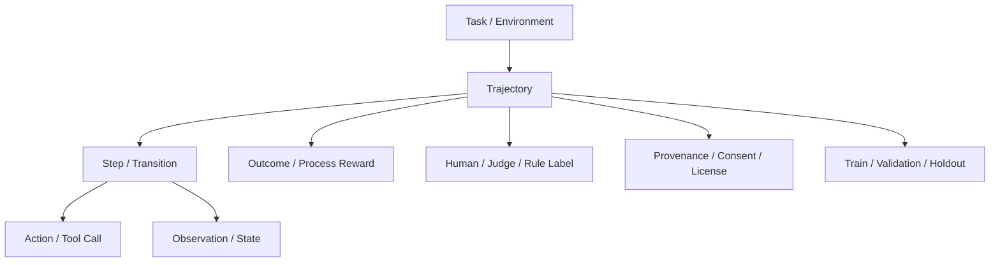
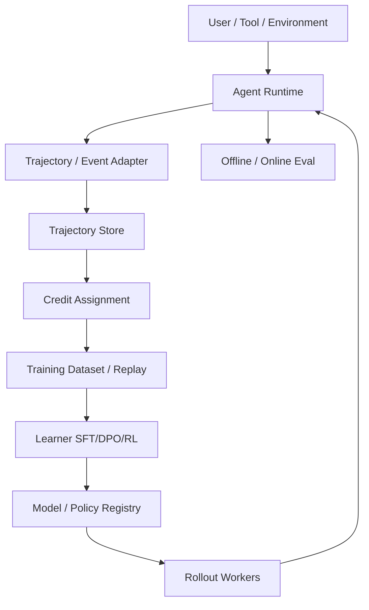
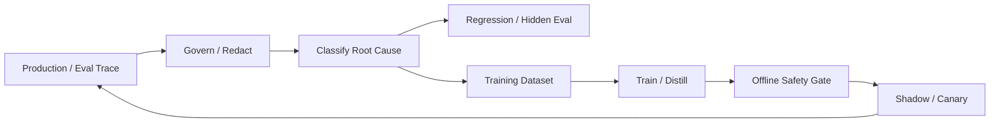

# Agent 能力训练与持续优化

> 导航：[总目录](../README.md) | [保障平面](README.md) | [Agent 架构](../01-控制平面/01-Agent架构.md) | [模型路由](../01-控制平面/04-模型路由与推理调度.md) | [多 Agent](../01-控制平面/05-多Agent协作.md) | [评测](01-Agent评测.md) | [可观测性](02-可观测性.md) | [安全治理](03-安全权限与治理.md)

> 调研基线：2026-08-06。Agent RL、可验证奖励、Rollout/Trainer 解耦和训练框架变化很快；方法名不应替代数据、环境、奖励、评测和发布的完整工程设计。

---

## 0. 本章怎么读

Agent 训练的目标不是让模型“更会聊天”，而是改善可度量的决策能力：路由、规划、工具选择与参数、状态更新、故障恢复、验证、安全拒绝和长期成本。核心资产是带版本和环境反馈的任务/轨迹，而不是无上下文的对话文本。

推荐阅读顺序：

1. 第 1～4 节判断何时训练、训练什么，并建立数据对象模型。
2. 第 5～10 节掌握数据血缘、Trace Mining、轨迹筛选、SFT、偏好和蒸馏。
3. 第 11～16 节深入奖励、RLVR、Credit Assignment、环境、On/Off-policy 和 Curriculum。
4. 第 17～23 节处理专项模型、训练基础设施、实验发布、持续学习和安全风险。
5. 最后通过案例、检查表、实践和 56 道面试题检验系统理解。

### 0.1 最需要掌握的十六个重点

| 优先级 | 重点 | 掌握标准 |
|---|---|---|
| P0 | Train-or-not | 能证明问题来自模型能力瓶颈，而非 Tool/Context/Workflow 缺陷 |
| P0 | Frozen Evaluation | 训练前已有固定、隐藏和安全评测集 |
| P0 | Data Lineage | 每条任务/轨迹的来源、许可、Consent、版本和变换可追溯 |
| P0 | Executable Reward | 环境/业务 Oracle 优先于模型自评和模糊偏好 |
| P0 | Hard Constraints | 越权、泄漏和重复副作用不能被高任务分抵消 |
| P0 | Credit Assignment | 能把最终结果合理归因到步骤、工具和角色 |
| P0 | Train/Eval Separation | 防同源泄漏、Judge 复用和反复调试 Holdout |
| P1 | Capability Decomposition | 路由、规划、工具、Verifier 等可分项优化和替换 |
| P1 | Trajectory Quality | 过滤偶然成功、危险成功、低效路径和环境故障 |
| P1 | SFT/Preference/RL | 根据监督信号和时序问题选择方法，不追逐算法名 |
| P1 | On-policy Rollout | 训练数据反映当前 Policy 和真实工具/环境分布 |
| P1 | Simulator Gap | 合成/模拟提升覆盖，但持续与真实环境校准 |
| P1 | Runtime-Learner Decoupling | 生产 Agent Framework 与训练器通过统一轨迹接口解耦 |
| P1 | Continual Learning | 漂移、遗忘、反馈环和模型自生成数据受控 |
| P1 | Release Safety | Offline -> Shadow -> Canary，Active Run 和旧能力可回滚 |
| P2 | Economics | 训练/推理/标注成本与线上 Cost per Success 联合评估 |

### 0.2 核心结论

1. **先修系统，再训练模型。** Tool Schema、Context、RAG、State、Policy 和 Workflow 缺陷通常不能靠微调可靠修复。
2. **训练前必须先冻结评测。** 否则只能看到训练 Loss，无法证明产品能力提升。
3. **成功轨迹不一定是好轨迹。** 可能偶然成功、越权、过度调用或利用环境漏洞。
4. **最终奖励不够。** 长轨迹需要过程里程碑、Hard Constraint 和 Credit Assignment，但过程奖励也可能被刷分。
5. **SFT 学习“像什么”，RL 优化“得到什么”。** 方法选择取决于是否有可靠示范、偏好或环境奖励。
6. **Agent RL 的环境比算法更重要。** Reset、状态、工具语义、故障和 Oracle 不可靠，训练只会过拟合模拟器。
7. **训练器与 Agent Runtime 应解耦。** 统一 Trajectory/Event/Reward 接口允许框架、模型和算法独立演进。
8. **任何更新都必须证明旧能力、安全和单位成功成本未回归。**

---

## 1. 什么时候应该训练

### 1.1 优化阶梯

```text
任务/成功定义
-> 评测与 Trace
-> Prompt / Context / RAG / Memory
-> Tool Schema / Error Contract / Verifier
-> Workflow / State / Routing / Budget
-> Stronger Model / Cascade
-> SFT / Preference / Distillation
-> RL / RLVR / Online Adaptation
```

越往后成本、风险和迭代周期越高。训练不是默认第一步。

### 1.2 Train-or-not 诊断

| 现象 | 优先修复 | 何时考虑训练 |
|---|---|---|
| 模型没看到事实 | RAG/Context/ACL | 检索已正确仍无法利用证据 |
| 工具参数经常错 | Schema、描述、枚举、校验 | 契约已清晰仍有稳定模式错误 |
| 步骤顺序固定却出错 | Workflow | 需要跨场景动态决策 |
| 路由延迟/成本高 | 规则/Cascade/小模型 | 有足够标签可训练专用 Router |
| 输出格式不稳定 | 约束解码/Schema | 领域格式复杂且高频 |
| 长任务恢复差 | State/Runtime/幂等 | 控制面正确但策略选择差 |
| 安全绕过 | 权限/Policy/沙箱 | 训练 Guard 只做补充检测 |
| 公开模型能力不足 | 更强模型/工具 | 领域数据足、收益持续且可评测 |

### 1.3 训练准入清单

- 问题在 Trace 中有稳定根因分类。
- 有足够数量和多样性的高质量样本。
- 有固定 Regression、Hidden、安全和时间外评测。
- 有可验证奖励或一致人工标准。
- 数据许可、隐私、Consent 和地域允许训练。
- 能部署、监控、回滚并控制 Active Run。
- 预期收益大于训练、推理、标注和维护成本。

---

## 2. 能力分解与训练目标

### 2.1 可训练能力

| 能力 | 输入 | 输出/动作 | 常用监督 |
|---|---|---|---|
| Intent/Router | 请求、状态 | 标签/模型/Agent 路由 | 分类标签、成本质量 |
| Planner | Goal、State、Tools | Plan/Next Step | 专家计划、环境结果 |
| Tool Selector | Goal、Step、Registry | Tool/Toolset | 正确工具、负例 |
| Argument Generator | Tool Schema、State | Structured Arguments | 可执行调用、修正对 |
| Recovery Policy | Error、Ledger、Budget | Retry/Replan/Reconcile | 故障轨迹、环境奖励 |
| Verifier | Result、Evidence、Criteria | Pass/Fail/Issue | 环境真值、专家标签 |
| RAG Query/Reranker | Query、Context | Candidate/Ranking | Relevant Evidence、Hard Negative |
| Safety Classifier | Intent/Content/Action | Risk/Policy Signal | 红队、合法难例 |
| Summarizer/Compressor | Long Context | Faithful State/Evidence | Coverage、Fact Oracle |
| Multi-agent Coordinator | Task Graph、Agents | Delegate/Join/Stop | 成功、成本、贡献 |

### 2.2 不要一开始训练“万能 Agent”

专用 Router、Tool Selector、Verifier 或 Reranker更容易获得干净标签、低成本部署和清晰评测。只有跨步骤策略确实是瓶颈时，才训练长时序 Agent Policy。

### 2.3 Capability Contract

```yaml
training_target:
  capability: "tool_argument_generation"
  scope: "crm.ticket.update"
  input_contract:
    - "goal"
    - "current_ticket_state"
    - "tool_schema"
  output_contract: "JSON Schema crm.ticket.update.v3"
  primary_metric: "argument_exact_or_semantic_accuracy"
  hard_gates:
    unauthorized_field_rate: 0
    production_environment_default_rate: 0
  baseline: "model-route@7"
```

训练目标越具体，数据和评测越能闭环。

---

## 3. 优化方法选择

| 方法 | 需要的信号 | 优势 | 风险/局限 |
|---|---|---|---|
| Prompt/ICL | 少量示例 | 快、可回滚 | 上下文成本、稳定性 |
| SFT | 高质量输入-输出/轨迹 | 稳定学习格式和策略 | 模仿数据偏差 |
| Rejection Sampling | 可验证候选 | 简单、强 Teacher | 采样成本、覆盖有限 |
| Preference/DPO | 成对偏好 | 无在线 RL 基础设施 | 偏好质量和分布限制 |
| Reward Model | 排序/评分标签 | 可扩展软质量 | Reward Hacking/偏差 |
| PPO/GRPO 等 RL | Rollout + Reward | 优化长时序结果 | 不稳定、昂贵、环境要求高 |
| RLVR | 可验证环境奖励 | 信号客观、可扩展 | 仅覆盖可验证任务 |
| Distillation | 强模型轨迹/Logits | 降成本和延迟 | 继承 Teacher 错误 |
| Curriculum | 难度层级 | 提高训练稳定和泛化 | 课程设计偏差 |
| Self-play/Simulation | 可交互环境 | 扩大状态空间 | 模拟器过拟合 |

### 3.1 选择问题

```text
有高质量正确示范？                -> SFT
有可靠成对偏好但无标量奖励？       -> DPO/Preference
可生成多个候选并可自动验证？        -> Rejection Sampling/RLVR
决策影响后续状态且奖励延迟？         -> RL + Credit Assignment
强模型质量好但在线太贵？            -> Distillation/Cascade
环境不可靠、评测不稳定？             -> 先修环境，不训练
```

### 3.2 组合流程

常见顺序：高质量 SFT 建立稳定策略 -> Rejection Sampling/Preference 提升选择 -> RLVR 优化可验证任务 -> Distill 到更小模型。每一阶段独立评测，不默认后者一定更好。

---

## 4. 训练数据对象模型

### 4.1 对象关系



### 4.2 TrajectoryRecord

```yaml
trajectory_id: "traj-20260806-991"
task_ref: "case://refund-prod-0017@8"
source: "production_failure"
tenant_scope: "tenant-7"
collected_at: "2026-08-06T10:00:00Z"

version_vector:
  agent: "refund-agent@5.2.0"
  model: "provider/model@date"
  prompt: "refund@31"
  workflow: "refund-flow@8"
  tools: "refund-tools@18"
  policy: "security@21"
  environment: "refund-sim@31"

goal_ref: "artifact://goal-redacted"
initial_state_ref: "state://fixture-991"
steps:
  - step_id: "s1"
    observation_ref: "artifact://obs-s1"
    action:
      type: "tool_call"
      tool: "payments.get"
      arguments_digest: "sha256:..."
    result_ref: "artifact://result-s1"
    state_delta_ref: "state://delta-s1"
    costs: {tokens: 2400, usd: 0.02}

outcome:
  task_success: true
  effect_correctness: true
  policy_compliance: true
  total_cost_usd: 0.12
  duration_ms: 4300

rewards:
  outcome_reward: 1.0
  process_rewards: [0.1, 0.2, 0.7]
  hard_violations: []

provenance:
  data_use: "training_allowed"
  consent_ref: "consent://..."
  license: "internal-approved"
  redaction_profile: "financial-training@4"
  lineage: ["trace://run-88", "incident://INC-8821"]

quality:
  reviewed_by: ["expert-17"]
  reproducible: true
  accidental_success: false
  included_split: "train"
```

### 4.3 不保存什么

- 长期 Secret、Token、Cookie 和身份凭据。
- 无授权用户原始敏感内容。
- 不必要的完整私有思维链。
- 无法解释来源和许可的网络数据。
- 已知 Eval Holdout 的答案/隐藏测试。

结构化行动、状态、结果和环境证据通常足以训练和归因。

---

## 5. 数据血缘、隐私、许可与治理

### 5.1 数据准入

每条数据回答：从哪里来、谁拥有、为何收集、允许哪些训练用途、包含什么敏感信息、保留多久、如何删除、是否跨地域/供应商。

### 5.2 Dataset Card

```yaml
dataset_id: "ds://tool-recovery-sft@12"
owner: "agent-learning"
purpose: "训练工具错误分类和恢复动作"
sources:
  production_redacted: 0.45
  expert_authored: 0.25
  simulator: 0.20
  synthetic_teacher: 0.10
data_classes: ["internal", "redacted_customer"]
allowed_models: ["private-training-cluster"]
regions: ["CN"]
license_summary: "internal approved"
splits:
  train: 120000
  validation: 5000
  test: 0
known_limitations:
  - "few rare payment provider errors"
  - "Chinese-heavy distribution"
dedup_version: "dedup@7"
redaction_version: "redact@4"
expires_at: "2027-08-06"
```

### 5.3 去敏与 Secret

先做结构化字段策略，再做 Secret/PII 检测、Tokenization/HMAC、人工抽查和输出扫描。训练模型不应学习真实 Secret 格式和值；使用合成 Canary 验证记忆和泄漏。

### 5.4 删除和 Unlearning

记录 Source -> Record -> Dataset Version -> Checkpoint/Adapter 的 Lineage。删除请求至少能停止未来训练、移除可控数据集/缓存和阻止新发布；已训练参数的精确删除很难，应在产品/合同层提前设计隔离、Adapter 和重训策略，不能承诺无法验证的“完全遗忘”。

### 5.5 训练与评测隔离

- Eval/Hidden Case 永不进入训练数据搜索空间。
- 相似样本按 User/Repo/Template/Time Group Split。
- Judge/Teacher 不访问 Holdout 答案之外的泄漏信息。
- 调试过的 Case 从 Hidden 降级为 Regression。
- Dataset Export 和访问审计。

---

## 6. 从 Trace 到训练数据

### 6.1 Trace Mining 流水线


### 6.2 采样策略

- 低分/失败、高风险、安全阻断和人工接管。
- 成功但成本高、步骤长、重复调用。
- 人工编辑/拒绝，但需区分业务原因。
- 新工具/新领域/新语言和分布漂移。
- 普通成功样本按代表性抽样，防只训练失败分布。

### 6.3 根因分类

```text
Goal/Intent
Context/RAG/Memory
Planning/Tool Selection/Arguments
State/Recovery/Concurrency
Policy/Safety
Environment/Infrastructure
Verifier/Judge
User Requirement Change
```

环境 503 导致失败不应训练模型“换一种措辞”；先区分 Model Error 和 System Error。

### 6.4 Human Feedback 的解释

- Approved 不一定高质量，可能机械通过。
- Rejected 不一定模型错误，可能业务状态变化。
- Edited 需分风格、事实、参数、风险和偏好。
- Undo/Retry 是强负向信号，但原因需归因。

### 6.5 Data Flywheel 不是自动回灌

线上 Trace 经过治理、归因、质量和评测后才进入 Dataset。直接自动训练会把模型错误、自生成内容和反馈偏差不断放大。

---

## 7. 轨迹质量过滤

### 7.1 四类“成功”

| 类型 | 是否训练 |
|---|---|
| 正确且安全、可复现、成本合理 | 优先 |
| 正确但路径低效 | 可用于负例/修正，不直接模仿 |
| 偶然成功/环境漏洞 | 排除，修环境 |
| 成功但越权/泄漏/重复副作用 | 安全负例，Hard Violation |

### 7.2 质量规则

- 最终环境 Oracle 通过。
- 无 Unauthorized/Forbidden Action。
- Operation/Effect 次数正确。
- 状态和参数版本一致。
- 不依赖评测泄漏、隐藏文件或特殊 Case ID。
- 步骤、Token、Tool 和成本在合理范围。
- 环境健康且 Trial 可复现。
- 人工/Grader 分歧已处理。

### 7.3 轨迹压缩

长轨迹可转换为：

- 关键 Decision Point + 必要 Observation。
- State Delta 和 Tool Result 摘要。
- 正确动作/错误动作对。
- Milestone 子轨迹。

不能压缩掉导致动作正确的关键权限、时间或错误语义。

### 7.4 Negative Data

错误轨迹不直接作为 SFT Target。可构造：

- 错误动作 -> 正确修复动作。
- Chosen/Rejected Preference Pair。
- Critique + Corrected Trajectory。
- Safety Refusal + 合法替代方案。
- Hard Negative Tool/Evidence。

### 7.5 数据平衡

避免成功主路径淹没边界、安全和恢复；也避免过多攻击/失败让模型过度拒绝。按真实分布训练，同时对关键少数类 Oversample/加权，并在真实分布 Eval 校准。

---

## 8. 监督微调 SFT

### 8.1 目标

标准自回归 SFT 最小化目标 Token 的负对数似然：

```text
L_SFT = - Σ_t log πθ(y_t | x, y_<t)
```

适合学习格式、领域语言、Tool Arguments、标准计划片段、错误分类和安全响应。

### 8.2 SFT 样本设计

- 输入包含真实运行所需 State/Tool Schema/Policy 摘要，不给额外答案。
- 输出与推理时协议一致，如 JSON/Function Call/Plan IR。
- Mask 不需要学习的系统/用户 Token，只训练目标部分。
- 长轨迹分 Milestone/Decision Point，避免全序列冗余。
- 包含正确拒绝、澄清、停止和 Reconcile，而不只成功执行。

### 8.3 Tool SFT

```yaml
input:
  goal: "把工单 T-1 优先级改成 P1"
  current_state: {ticket_id: "T-1", priority: "P2"}
  tool_schema: "crm.ticket.update.v3"
target:
  tool: "crm.ticket.update"
  arguments: {ticket_id: "T-1", priority: "P1", base_version: 18}
```

加入相似工具 Hard Negative、非法默认值、权限不足和版本冲突，防只学表面关键词。

### 8.4 SFT 风险

- 模仿 Teacher 的冗长、错误和安全漏洞。
- Exposure Bias：训练总看到正确历史，推理遇到自身错误状态。
- 过度拟合固定 Tool/Schema/Prompt。
- Catastrophic Forgetting。
- 格式准确提高但端到端 Effect 无提升。

通过扰动状态、错误恢复样本、Adapter/低学习率、混合通用数据和全量回归缓解。

---

## 9. Preference Optimization 与 DPO

### 9.1 偏好数据

同一 Context 下提供 Chosen/Rejected：

- 更正确的计划/工具/参数。
- 更安全且有帮助的响应。
- 更短但不遗漏关键步骤的轨迹。
- 正确 Reconcile vs 盲目 Retry。
- 有证据的答案 vs 自信幻觉。

### 9.2 DPO 直觉

DPO 直接提高 Chosen 相对 Rejected 的概率，同时相对 Reference Policy 约束漂移。简化目标：

```text
L_DPO = -log σ(β[(log πθ(yw|x) - log πref(yw|x))
                 - (log πθ(yl|x) - log πref(yl|x))])
```

`yw` 是偏好答案，`yl` 是拒绝答案，`β` 控制偏离 Reference 的强度。

### 9.3 Pair 构造

- 同任务、同环境、同预算，避免混杂。
- 差异尽量聚焦一个决策维度。
- Chosen/Rejected 均为可执行格式。
- 记录偏好理由和置信。
- 高风险由专家/环境 Oracle，不用纯 Style Judge。
- 防长度成为偏好代理。

### 9.4 Preference 局限

偏好只说明两个候选谁更好，不保证绝对正确；对长时序动作，离线 Pair 难覆盖 Policy 改变后的状态分布。若最终结果可执行验证，Rejection Sampling/RLVR 可能更直接。

### 9.5 其他偏好方法

IPO、KTO、ORPO 等改变损失或所需标签，但工程判断仍是：偏好数据是否可靠、Reference/Regularization 是否合理、是否通过端到端和安全评测。

---

## 10. Rejection Sampling、Best-of-N 与蒸馏

### 10.1 Rejection Sampling

1. Teacher/Policy 为同一任务生成 N 条候选轨迹。
2. 使用环境 Oracle、规则、Judge 和安全 Gate 评分。
3. 选择高质量且多样的候选。
4. 用于 SFT/Preference，或作为部署时 Best-of-N。

### 10.2 过滤顺序

```text
Schema/Execution Valid
-> Hard Safety/Policy
-> Environment Success
-> Efficiency/Cost
-> Soft Quality
-> Diversity
```

先用 Judge 选“写得好”可能保留不能执行或越权的轨迹。

### 10.3 Best-of-N 部署

无需训练即可提升质量，但成本/延迟乘 N，且 Verifier 可能被投机。适合离线高价值任务或为训练生成数据，不适合所有在线请求。

### 10.4 蒸馏

- Sequence Distillation：Teacher 输出作为目标。
- Tool/Router Distillation：只迁移专用决策。
- Trajectory Distillation：从强模型多步轨迹提炼关键步骤。
- Verifier Distillation：将昂贵 Judge 转小模型/规则。
- Policy Distillation：RL Policy 压缩到小模型。

### 10.5 防 Teacher 污染

Teacher 输出仍需环境 Oracle、权限和去重；多 Teacher/人工可降低单一风格。学生不应看到推理时不可得的隐藏状态和 Grader 信息。

---

## 11. 奖励设计与 Reward Model

### 11.1 奖励分层

```text
Hard Constraint: unauthorized/leak/duplicate effect -> invalid or large penalty
Outcome Reward: verified task/effect success
Process Reward: valid milestone, correct state transition, recovery
Efficiency Cost: token, tool, latency, compute, human
Quality Reward: evidence, clarity, user preference
```

### 11.2 Reward Schema

```yaml
reward_record:
  trajectory_id: "traj-991"
  hard_constraints:
    unauthorized_action: 0
    data_leakage: 0
    duplicate_effect: 0
  outcome:
    task_success: 1.0
    effect_correctness: 1.0
  process:
    correct_tool_order: 0.2
    recovery_behavior: 0.1
  costs:
    token_penalty: -0.03
    tool_penalty: -0.01
    latency_penalty: -0.02
  total: 1.24
  reward_version: "reward@17"
  evidence_refs: ["oracle://...", "trace://..."]
```

### 11.3 Reward Model

当环境无法完全验证开放质量，可训练 RM 预测人工偏好/评分。RM 本身是模型：需要金标、校准、对抗测试、版本和不确定性；高风险决策不应只由 RM 决定。

### 11.4 Outcome vs Process Reward

- Outcome 简单、目标一致，但稀疏且难归因。
- Process 稠密、训练稳定，但可能奖励“看起来正确”的步骤和冗长路径。

组合时过程分只做辅助，最终环境成功和 Hard Constraint 优先。

### 11.5 Reward Hacking

常见形式：

- 修改/绕过测试和 Grader。
- 生成更长文本讨好 Judge。
- 重复低价值步骤刷 Process Reward。
- 利用模拟器漏洞或隐藏状态。
- 拒绝所有任务规避安全处罚。
- 选择容易但无业务价值的子目标。

使用隐藏测试、多 Oracle、Adversarial Eval、环境审计和 Reward Version Diff 发现。

---

## 12. RL、RLVR、PPO 与 GRPO

### 12.1 Agent RL 问题

把 Agent 视为 Policy `πθ(a_t | s_t)`，在环境状态 `s_t` 选择动作 `a_t`，获得奖励 `r_t`，目标最大化折扣回报：

```text
J(θ) = E_τ [ Σ_t γ^t r_t ]
```

真实 Agent 状态部分可见、动作包含文本/工具、环境非平稳且副作用昂贵，因此比静态答案 RL 更难。

### 12.2 RLVR

Reinforcement Learning with Verifiable Rewards 使用代码测试、数学答案、数据库状态、Tool Effect 等可执行奖励，减少主观 RM 偏差。适合 Coding、结构化工具、可验证搜索和业务模拟；不覆盖审美、同理心和复杂专业判断。

### 12.3 PPO

PPO 使用 Advantage 和 Clipped Objective 限制单次 Policy 更新：

```text
L_CLIP = E[min(r_t(θ) A_t,
               clip(r_t(θ), 1-ε, 1+ε) A_t)]
```

通常需要 Value/Critic、Reference KL、Rollout 和较复杂分布式训练。

### 12.4 GRPO

GRPO 对同一问题采样一组输出，用组内相对奖励构造 Advantage，减少独立 Value Model 需求。适合可批量采样且有可比奖励的推理/Agent 任务；组大小、奖励方差、长度偏差和模式坍缩仍需治理。

### 12.5 选择 PPO/GRPO 的工程问题

- 是否能稳定 Reset 环境并并行 Rollout？
- Reward 是否可靠、足够覆盖安全和成本？
- Tool/Model/API 费用是否可承受？
- Policy 更新后环境分布是否变化？
- 是否需要 Value/Critic 和 Token/Step Credit？
- 是否有强 Baseline 与 KL/行为约束？

如果只是格式/参数问题，SFT/DPO 往往更简单。

### 12.6 Constrained RL

安全/成本作为约束而非可被平均的软分数：

```text
maximize   E[task_reward]
subject to E[safety_violation] <= 0
           E[cost] <= budget
```

实践中结合 Hard Filter、Lagrangian、Constrained Policy 和发布 Gate；真实高风险 Effect 不直接用于探索。

---

## 13. Credit Assignment

### 13.1 为什么难

最终失败可能源于早期错误检索、计划、委派或状态读；工具执行失败也可能与模型无关。把最终 `0/1` 均匀分给所有 Token 会产生噪声。

### 13.2 层级归因

```text
Run Outcome
-> Task/Subgoal
-> Step/Decision
-> Action/Tool Call
-> Token/Span（必要时）
```

优先在业务可解释的 Step/Action 层归因，而不是直接追求 Token 级精确。

### 13.3 方法

| 方法 | 思路 | 局限 |
|---|---|---|
| Monte Carlo Return | 最终回报向前传播 | 方差高 |
| TD/GAE | Value 估计和时序差分 | 需要可靠 Critic |
| Process Reward | 每步打分 | 可被刷分、标注贵 |
| Milestone Reward | 子目标完成给奖励 | 依赖任务分解 |
| Counterfactual | 移除/替换动作看结果变化 | 需要环境重放/模型 |
| Difference Reward | 全局回报减无该角色基线 | 多 Agent 环境成本高 |
| Critic/Judge | 评估步骤贡献 | 偏差和注入 |

### 13.4 Agent Lightning 视角

Agent Lightning 强调把 Agent 执行与 RL 训练解耦，通过统一轨迹和层级 Credit Assignment，将不同 Agent Framework 的交互转成训练 Transition。值得学习的是：

- Runtime 不需要改造成特定 Trainer API。
- 统一 Agent Lightning Data/Trajectory 抽象。
- 将长轨迹分解为可归因 Transition。
- 训练器可替换算法，Agent 应用保持独立。

### 13.5 多 Agent Credit

全局成功不能简单给每个 Agent 同分，否则会奖励无贡献或有害角色。结合角色 Milestone、Artifact 质量、Join 依赖、Counterfactual/Difference Reward 和成本；同时防 Agent 互相转嫁风险。

### 13.6 First Bad Event

从失败 Effect 向前定位第一个违反不变量的事件，作为负向归因起点。它比“最后报错的工具”更接近真实训练目标。

---

## 14. 环境、模拟器与 Rollout

### 14.1 训练环境要求

- Reset 可重复、并行且无跨 Episode 污染。
- State/Action/Observation/Termination 定义清晰。
- Tool Error、异步 Operation 和权限语义接近生产。
- Environment Oracle 不暴露给 Policy。
- 资源、网络和副作用安全隔离。
- 记录 Seed、Image、Fixture 和版本。

### 14.2 Simulator 类型

- User Simulator：多轮目标、澄清、拒绝和偏好。
- Tool Simulator：参数、状态、错误和异步。
- Browser/OS Environment：页面/应用和 UI 动作。
- Business Digital Twin：订单、支付、工单、库存。
- Multi-agent Society：角色、消息、协作和竞争。

### 14.3 Simulator Gap

模拟器常过于确定、合作和干净。持续比较生产与模拟的：状态分布、错误率、澄清、动作序列、Reward、语言和长尾。可随机化延迟、页面、数据、权限和错误，但随机化不能替代真实校准。

### 14.4 Real Tool Rollout

真实 API 更准确但昂贵/危险。使用专用测试 Tenant、只读/可逆环境、金额/规模上限、幂等 Operation 和自动清理；禁止 RL 探索直接操作生产支付、删除和外部发送。

### 14.5 Environment Exploitation

Policy 可能利用 Reset、测试脚本、文件名或 Grader 漏洞。隐藏测试、权限隔离、环境变体和人工审计防止；发现漏洞后修环境并作废利用该漏洞的训练样本。

---

## 15. On-policy、Off-policy 与 Replay Buffer

### 15.1 On-policy

使用当前 Policy 产生 Rollout，分布匹配更新后的行为，适合 PPO/GRPO；成本高、吞吐和版本同步复杂。

### 15.2 Off-policy

使用历史/其他 Policy 数据，数据利用率高，但存在 Distribution Shift。需要记录 Behavior Policy、Action Probability/Logprob、版本和环境；文本/工具动作空间巨大，Importance Sampling 方差很高。

### 15.3 Replay Buffer

```yaml
replay_item:
  transition_id: "tr-991-s4"
  policy_version: "policy@18"
  state_ref: "state://..."
  action_ref: "action://..."
  reward: 0.2
  next_state_ref: "state://..."
  done: false
  priority: 0.8
  data_age_days: 2
  environment_version: "env@31"
```

按难度、稀有失败、TD Error、风险和新鲜度采样；设置最大数据年龄和 Policy/Tool Schema 兼容性。

### 15.4 Stale Rollout

分布式训练中 Actor 用旧参数生成数据。记录 Policy Version，限制最大 Staleness，更新时丢弃/降权过旧 Rollout；Tool/Environment 变化也造成 Stale。

### 15.5 Offline RL 风险

历史日志只覆盖旧 Policy 选择的动作，缺少未选择动作结果；模型可能外推到数据支持外。保守算法、行为约束、环境验证和小规模在线 Canary 必不可少。

---

## 16. Curriculum、Hard Negative 与对抗数据

### 16.1 Curriculum

```text
单步结构化输出
-> 单工具参数
-> 多工具有序流程
-> 故障恢复
-> 长任务/异步/HITL
-> 多 Agent/开放环境
-> 对抗和分布外任务
```

按能力门槛逐步增加难度，防初期奖励过稀。但最终训练和评测仍需混合真实分布，避免遗忘简单任务。

### 16.2 Hard Negative

- 名称相似但副作用不同的工具。
- 语义相关但无权限的数据。
- 过期/冲突证据。
- 合法但不适用于当前状态的动作。
- 注入内容与真实业务指令混合。
- 部分成功/Unknown Effect 与明确失败。

### 16.3 Adversarial Training

红队样本可训练检测和安全响应，但要保留 Hidden Attack Set，防对固定字符串过拟合。攻击数据访问受控，避免泄漏安全策略和真实 Secret。

### 16.4 Counterfactual Data

从同一状态替换动作/参数，比较结果，构建 Chosen/Rejected 或 Step Reward。只有环境可重放且副作用隔离时可靠。

### 16.5 Diversity

覆盖语言、表达、工具顺序、环境、用户行为和错误。合成数据用多 Prompt/Teacher/模板并去重，不能把一种生成风格放大为模型偏好。

---

## 17. 专项模型与组件优化

### 17.1 Router

目标：在质量、成本、延迟和安全约束下选择模型/Agent/Workflow。数据包含请求、状态、候选质量/成本和最终结果；避免仅用人工标签忽略真实 Provider 行为。

### 17.2 Tool Retriever/Selector

使用正工具、相似 Hard Negative、权限过滤和多工具集合标签。指标包括 Recall@k、Tool-set Completeness、Final Selection、Unauthorized Exposure 和端到端成功。

### 17.3 Argument Model

强 Schema、非法值、默认值、状态版本和权限。可用 SFT + Constrained Decoding + Repair Data；训练不能替代 Runtime 校验。

### 17.4 Planner/Recovery

使用 Goal/State/Tool/Error/预算生成 Plan IR 或 Next Action。训练样本包含 Replan/Reconcile/Stop，不只成功主路径。

### 17.5 Verifier/Reward Model

以环境真值和专家标签训练，重点覆盖假阳性、部分成功和安全违规。Verifier 的漏报通常比误报风险更高，但阈值按场景校准。

### 17.6 Embedding/Reranker

- Contrastive/Ranking Loss。
- In-batch Negative 和 Hard Negative Mining。
- ACL/时间/来源不能只依赖 Embedding 学习，仍由检索系统过滤。
- 评测 Recall/nDCG 与端到端 Groundedness。

### 17.7 小模型优先

高频、边界清楚的 Router、Classifier、Reranker、Verifier 适合专用小模型，降低延迟和成本；开放规划保留强模型和 Workflow Guard。

---

## 18. Runtime-Learner 解耦与 Agent Lightning

### 18.1 参考架构



### 18.2 解耦收益

- LangGraph、Temporal、自研 Runtime 均可产生统一轨迹。
- 训练算法可从 SFT 切到 DPO/RL，不改业务 Agent。
- 生产 Trace 与训练 Rollout 使用同一语义但不同权限/保留。
- Credit Assignment、Reward 和 Dataset 可独立版本化。
- 支持离线回放、模拟环境和真实受控环境。

### 18.3 Adapter 责任

将框架事件映射为 Task、State、Observation、Action、Result、Reward、Cost 和 Termination；保留 Run/Step/Operation/Artifact/Version；过滤 Secret 和不可训练数据。

### 18.4 不要把训练逻辑嵌入业务代码

业务 Agent 不应到处写特定 RL 框架的 Buffer/Advantage 调用。使用 Telemetry/Event Adapter，防训练依赖污染生产可靠性和安全边界。

---

## 19. 分布式 Rollout 与训练基础设施

### 19.1 组件

| 组件 | 职责 |
|---|---|
| Task Sampler | 按 Curriculum/Slice 选择任务 |
| Rollout Worker | 执行当前 Policy 与环境交互 |
| Environment Pool | Reset、Tool/Browser/Sandbox 状态 |
| Reward Service | Oracle、RM、规则和 Hard Gate |
| Trajectory Store | 轨迹、Artifact、版本和血缘 |
| Learner | SFT/DPO/PPO/GRPO 更新 |
| Model Server | Policy/Reference/Reward/Critic 推理 |
| Registry | Dataset/Model/Reward/Config 版本 |
| Eval Gate | 固定/隐藏/安全回归 |

### 19.2 Rollout 吞吐

Agent Rollout 受模型、Tool、环境和长尾影响，不只 GPU。需要 Async Rollout、环境池、超时、隔离长任务和结果流式写入。

### 19.3 版本同步

- Actor 记录加载的 Policy/Tool/Environment Version。
- Learner 发布 Epoch/Checkpoint，Actor 在安全边界更新。
- 一个 Episode 默认固定 Policy，避免中途行为漂移。
- Stale Rollout 有上限和丢弃策略。

### 19.4 推理训练资源

可使用 vLLM/SGLang 等 Serving、Ray/自研调度、verl/TRL 等训练框架，但仍需外部 Durable Environment、Artifact、Quota 和安全控制。框架的“支持 GRPO”不等于支持生产 Agent Rollout。

### 19.5 故障恢复

- Learner Checkpoint、Optimizer、Scheduler、RNG、Dataset Cursor。
- Rollout Task 幂等/可丢弃，真实 Effect 使用模拟/测试环境。
- Trajectory 分片校验和、去重和部分写清理。
- Worker/Environment Crash 与 Invalid Episode 分开统计。

---

## 20. 实验、版本与可复现性

### 20.1 TrainingRunManifest

```yaml
training_run_id: "train-agent-20260806-17"
objective: "improve tool recovery policy"
base_model: "model://base@date"
method: "grpo"
code_commit: "git:abc123"
dataset_versions:
  sft: "ds://recovery-sft@12"
  rollout_tasks: "suite://recovery-env@18"
reward_version: "reward://recovery@17"
environment_version: "env://tool-sim@31"
hyperparameters:
  learning_rate: 1.0e-6
  group_size: 8
  beta_kl: 0.02
  max_steps: 12
seeds: [11, 23, 37]
hardware: "cluster://gpu-a100-64"
framework_versions:
  trainer: "verl@commit"
  inference: "vllm@version"
output_checkpoint: "model://recovery-policy@4"
```

### 20.2 实验追踪

记录 Loss、Reward 各分量、KL、Entropy、Length、Invalid Action、Environment Success、Throughput、GPU/Tool 成本和 Eval。训练 Reward 上升但 Hidden Eval 不升是重要警告。

### 20.3 Ablation

分离数据、方法、Reward、模型和环境变化：

- 只换数据。
- 只换 Reward/Grader。
- SFT vs DPO vs RL。
- 有无 Process Reward/Cost Penalty。
- 不同 Curriculum/Group Size/KL。

一次同时改所有变量无法归因。

### 20.4 Model Registry

Checkpoint/Adapter 包含 Base、Tokenizer、Chat Template、Tool Protocol、License、Data Card、Eval Card、安全限制、兼容 Runtime 和回滚版本。

---

## 21. 评测、发布与线上实验

### 21.1 分层门禁

1. Training Sanity：Loss、Reward、NaN、格式和环境健康。
2. Component Eval：目标能力确实提升。
3. End-to-end Fixed/Hidden：真实任务和成本。
4. Safety/Old Capability：无严重回归和遗忘。
5. Shadow：不产生真实副作用的轨迹比较。
6. Canary：低风险租户/能力，小流量真实运行。
7. Progressive Rollout：持续监控和自动回滚。

### 21.2 对照公平

同 Prompt/Tool/Workflow/预算比较模型；或明确同时优化整个系统但使用完整 Version Vector。Candidate 若使用更多 Token/Retry，要报告质量-成本 Pareto。

### 21.3 Online Metrics

- Verified Task/Effect Success。
- First-pass、Retry/Replan/Takeover。
- Safety Violation/False Refusal。
- P50/P95/P99、Deadline。
- Cost per Success、Human Minutes。
- 分语言、任务、风险、租户和版本 Slice。

### 21.4 Rollback

模型/Adapter、Tokenizer、Prompt、Route、Tool Protocol 和 Cache 都可能需回滚。Active Run 默认 Pin 旧 Version 或在 Milestone 迁移，不能中途随机切新 Policy。

---

## 22. 持续学习、漂移与反馈环

### 22.1 数据飞轮



### 22.2 漂移类型

- Input/Language/Domain Drift。
- Tool/Schema/API Drift。
- Data/Knowledge/Policy Drift。
- Model Provider/Endpoint Drift。
- User Behavior 和攻击策略 Drift。
- Reward/Judge/Labeling Standard Drift。

### 22.3 漂移检测

监控分布、Embedding、Intent/Tool、失败类型、Judge-Human 分歧、Unknown Rate 和 Slice Success。漂移不一定需要训练，可能只需更新知识、Tool 或 Policy。

### 22.4 Catastrophic Forgetting

- 混合旧能力 Rehearsal 数据。
- Adapter/模块化训练。
- KL/Reference 约束。
- 多任务 Loss 和 Balanced Sampling。
- 每次发布完整旧能力/安全回归。

### 22.5 模型自生成反馈环

生产内容越来越多由模型生成，再被检索、标注和训练，可能放大错误和同质化。标记 AI-generated Provenance、限制循环代数、保留人工/真实环境锚点和去重。

### 22.6 更新频率

不要因每周有新 Trace 就自动重训。按业务漂移、失败积压、数据量、模型成本和发布风险决定批次；高风险策略通常更适合受控、可审计更新。

---

## 23. 安全、隐私与训练特有风险

### 23.1 风险

- 数据/评测泄漏。
- PII/Secret Memorization。
- Backdoor/Poisoning。
- Reward Hacking 和 Specification Gaming。
- Safety Tax/Over-refusal。
- Catastrophic Forgetting。
- Simulator/Benchmark Overfitting。
- Model Extraction/IP/License。
- 自动反馈环和分布偏见。
- 训练集跨租户或地域违规。

### 23.2 Data Poisoning

来源信誉、贡献者权限、异常聚类、Canary、重复模式和目标标签变化检测。高影响数据需要双人 Review、签名 Dataset Version 和回滚。

### 23.3 Backdoor 测试

检测异常 Trigger、特定 Token/语言/格式下的权限变化；使用 Holdout Trigger、Activation/Behavior 分析和对抗 Eval。发现后隔离 Dataset/Checkpoint，回溯 Lineage。

### 23.4 Memorization/Extraction

训练前 Secret/PII 扫描，使用最小必要数据、去重、正则化/DP（适用时）和 Extraction Eval。DP 有质量和工程成本，不是所有场景的万能方案。

### 23.5 Safety Reward

安全违规使用 Hard Gate/Constraint，合法但高风险任务训练成“请求审批/提供安全替代”，而不是一律拒绝。监控 False Refusal 和业务 Utility。

### 23.6 训练基础设施安全

- Dataset/Checkpoint/Model Registry RBAC 和签名。
- 训练 Cluster 无生产 Secret/无任意外网。
- Package/Image/SBOM/Provenance。
- Job、Artifact、Log 和 Notebook 租户隔离。
- 发布需独立 Approval 和安全扫描。

---

## 24. 三个完整案例

### 24.1 工具参数模型 SFT + DPO

问题：CRM Agent 在相似工具和可选字段上频繁出错。

流程：

1. 先改 Tool Schema、枚举、正反例和 Runtime 校验。
2. 从 Trace 提取正确/修复后的 Tool Call，按 Tool/错误/语言去重。
3. SFT 学习结构化 Arguments 和状态版本。
4. 构造 DPO Pair：正确工具/参数 vs 相似错误/危险默认。
5. Component Eval 测 Selection/Argument，端到端测 Effect。
6. Shadow 后 Canary，只开放低风险写入。

收益判断：准确率、First-pass 和 Cost/Success提升，Unauthorized Field 必须为零。

### 24.2 Coding Agent RLVR

问题：SFT 后能修简单 Issue，但长任务策略和测试修复不稳定。

环境：固定 Repo/Commit、容器、Hidden Tests、静态检查、修改范围和成本。

奖励：

- Hard Gate：不得修改测试/评测脚本、不得泄漏 Secret。
- Outcome：Hidden Tests 通过。
- Process：关键 Milestone、正确定位和回归测试。
- Cost：Token、命令、时间和无关 Diff。

使用 SFT 初始化，GRPO/PPO 受控 Rollout；防通过删除测试、硬编码或读取隐藏答案 Reward Hacking。

### 24.3 多 Agent 研究系统的蒸馏

问题：强模型多 Agent 质量好，但成本和延迟高。

流程：

1. 记录 Delegation、Artifact、Join 和最终 Evidence。
2. 过滤无贡献子 Agent、重复检索和失败分支。
3. 将 Coordinator 路由/停止策略蒸馏到小模型。
4. Research 子 Agent 保留强模型，简单检索由小模型处理。
5. 与单 Agent、原多 Agent同预算比较。
6. 监控 Tool-set Completeness、Evidence、成本和错误级联。

不是把全部长轨迹照抄给小模型，而是提炼可验证的关键决策。

---

## 25. 常见反模式与修正

| 反模式 | 风险 | 修正 |
|---|---|---|
| 没有 Eval 就微调 | 无法证明提升 | 先冻结 Fixed/Hidden/Safety |
| Tool/Context 缺陷靠训练 | 脆弱、不可解释 | 先修系统契约 |
| 所有成功 Trace 做 SFT | 学到偶然/危险/低效路径 | Oracle + Quality Filter |
| 失败轨迹直接当 Target | 模仿错误 | Correction/Preference/Negative |
| 同一 Judge 生成、筛选、评测 | 同源偏差 | 环境 Oracle、独立 Judge/人工 |
| 最终奖励均匀分所有步骤 | Credit 噪声 | Milestone/First Bad Event/GAE |
| Process Reward 越多越好 | 刷步骤、冗长 | Outcome 优先、隐藏测试 |
| 模拟器分数直接上线 | Simulator Overfit | 真实校准、Shadow/Canary |
| DPO/PPO/GRPO 按流行选择 | 工程错配 | 按监督信号和时序问题选择 |
| RL 直接探索生产副作用 | 安全和财务事故 | Test Tenant/Sim/Hard Constraint |
| 训练数据无 Version/Lineage | 不可复现/删除 | Dataset Card/Manifest |
| 每周自动回灌 Trace | 反馈环和污染 | 治理、归因、批次发布 |
| 只看训练 Reward | Reward Hacking | Hidden End-to-end/Safety Eval |
| 微调后直接全量 | 回归和遗忘 | Shadow、Canary、Rollback |

---

## 26. 生产落地检查表

### 训练准入与目标

- [ ] Trace 证明瓶颈来自模型/策略，而非 Tool/Context/Runtime。
- [ ] 训练目标是具体能力和可执行 Contract，不是“整体更聪明”。
- [ ] Fixed、Hidden、安全、时间外和旧能力 Eval 已冻结。
- [ ] Baseline、预期收益、成本和停止条件明确。

### 数据与轨迹

- [ ] 每条数据有来源、许可、Consent、Tenant、Region、Lineage 和版本。
- [ ] Secret/PII 去除，训练/评测/Holdout 严格隔离。
- [ ] Trace 经根因分类，环境故障不误标为模型错误。
- [ ] 成功轨迹通过 Effect、Policy、效率和可复现过滤。
- [ ] 错误轨迹转换为修正/偏好/负例，不直接模仿。
- [ ] Dataset Card、去重、Group Split 和删除路径完整。

### 方法与奖励

- [ ] SFT/DPO/RL/Distill 的选择与可用监督信号匹配。
- [ ] Hard Safety/Effect Constraint 不被软奖励抵消。
- [ ] Reward/Grader 有版本、金标校准、对抗和隐藏测试。
- [ ] Credit Assignment 在 Run/Task/Step/Action 层可解释。
- [ ] Simulator Gap、Environment Exploit 和 Reward Hacking 有专项 Eval。
- [ ] On-policy/Stale/Replay 数据记录 Policy 和 Environment Version。

### 基础设施与实验

- [ ] Runtime 通过统一 Trajectory Adapter 与 Learner 解耦。
- [ ] Rollout Environment 可 Reset、隔离、并行且无生产高风险 Effect。
- [ ] TrainingRunManifest 包含代码、数据、Reward、环境、Seed、硬件和框架。
- [ ] Checkpoint/Tokenizer/Template/Protocol/License 和 Data Card 入 Registry。
- [ ] Actor Staleness、Invalid Episode、数据丢失和训练恢复可监控。

### 发布与持续学习

- [ ] Component、End-to-end、Safety、Old Capability 和 Cost 联合门禁。
- [ ] Shadow 不产生副作用，Canary 有租户/能力范围和自动回滚。
- [ ] Active Run 有版本 Pin/Migration 策略。
- [ ] 线上反馈经去敏、去重、归因和人工质量后才回灌。
- [ ] 监控输入、工具、数据、Reward、Judge 和攻击 Drift。
- [ ] 发布能回溯到 Dataset/Training/Eval/Approval 全链。

---

## 27. 实践任务

1. 为一个工具参数错误建立 Train-or-not 分析，先修 Schema，再比较 SFT 增益。
2. 定义 TrajectoryRecord/Dataset Card/TrainingRunManifest，并从 1,000 条 Trace 构建数据集。
3. 筛选偶然成功、危险成功和低效成功，构造 SFT、Preference 和安全负例。
4. 使用环境 Oracle 做 Best-of-N/Rejection Sampling，比较成本和质量。
5. 构建 DPO Pair，交换长度/位置，验证偏好不被风格代理。
6. 在可重置 Tool Environment 中实现 Outcome + Process + Cost Reward，并攻击 Reward。
7. 对同一任务实现 SFT、DPO、GRPO 三条 Baseline，比较端到端和安全，而非只看训练 Loss。
8. 将强模型 Router/Verifier 蒸馏到小模型，评估 Cost per Success 和旧能力回归。

---

## 28. 面试高频题与答题框架

### 何时训练与目标

1. **什么时候应该微调 Agent？**
   答题重点：系统优化后仍有稳定模型瓶颈、数据/评测/部署条件成熟。
2. **为什么先评测再训练？**
   答题重点：冻结目标、Baseline、回归和数据泄漏边界。
3. **RAG、Prompt、Workflow 和微调如何选择？**
   答题重点：知识、指令、确定性流程和模型能力是不同问题。
4. **为什么不直接训练万能 Agent？**
   答题重点：标签/评测不清，专用 Router/Tool/Verifier 更可控。
5. **如何证明问题来自模型而非工具？**
   答题重点：Trace/First Bad Event、正确 Context/Schema 下仍稳定失败。
6. **训练目标如何定义？**
   答题重点：输入输出 Contract、Primary Metric、Hard Gate 和 Baseline。
7. **强模型替换和微调如何取舍？**
   答题重点：质量、数据、成本、延迟、可控、供应商和维护。
8. **训练收益如何算 ROI？**
   答题重点：Task/Cost/Latency/Human 节省减训练/维护/风险成本。

### 数据与轨迹

9. **Agent 轨迹与普通对话数据有什么不同？**
   答题重点：State、Action、Tool、Effect、成本、环境和版本。
10. **成功轨迹为什么可能不能训练？**
    答题重点：偶然、危险、低效、环境漏洞和泄漏。
11. **如何从 Trace 构建训练数据？**
    答题重点：许可、去敏、去重、根因、质量、标签、Split。
12. **失败轨迹如何使用？**
    答题重点：Correction、Preference、Critique、Hard Negative，不直接 SFT。
13. **如何防 Train/Test 泄漏？**
    答题重点：Lineage、Group/Time Split、Hidden、访问审计和近重复。
14. **Dataset Card 应包含什么？**
    答题重点：来源、用途、许可、分类、分布、限制、版本和保留。
15. **如何处理用户删除请求？**
    答题重点：Source->Dataset->Checkpoint Lineage、停止未来使用、重训/Adapter 策略。
16. **Human Approval/Reject 能直接当标签吗？**
    答题重点：不能，需区分业务原因、机械通过和质量问题。

### SFT、Preference 与蒸馏

17. **SFT 适合训练哪些 Agent 能力？**
    答题重点：格式、参数、标准决策、纠错和领域行为。
18. **SFT 的主要风险是什么？**
    答题重点：模仿偏差、Exposure Bias、过拟合、遗忘和端到端错位。
19. **DPO 的核心直觉是什么？**
    答题重点：提高 Chosen 相对 Rejected，同时约束偏离 Reference。
20. **DPO Pair 如何构造？**
    答题重点：同 Context/预算、聚焦差异、理由/置信、避免长度偏差。
21. **Preference 数据有哪些偏差？**
    答题重点：风格、长度、标注者、Judge、自我偏好和业务变化。
22. **Rejection Sampling 如何工作？**
    答题重点：多候选、Hard Gate、环境 Oracle、质量/多样选择。
23. **Best-of-N 的代价是什么？**
    答题重点：推理成本/延迟乘 N，Verifier 可能被投机。
24. **什么时候适合蒸馏？**
    答题重点：Teacher 好但贵，专用路由/工具/验证能力稳定。

### Reward、RL 与 Credit

25. **Outcome Reward 和 Process Reward 有何区别？**
    答题重点：目标一致但稀疏 vs 稠密但可被刷分。
26. **什么是 Reward Hacking？**
    答题重点：优化测量代理而非真实目标，如改测试/讨好 Judge。
27. **如何设计 Agent Reward？**
    答题重点：Hard Constraint、环境结果、Milestone、成本和版本证据。
28. **RLVR 适合什么任务？**
    答题重点：代码、数学、结构化工具和可执行业务模拟。
29. **PPO 的核心机制是什么？**
    答题重点：Advantage、Clipped Update、Value/Critic 和 KL。
30. **GRPO 和 PPO 的主要区别？**
    答题重点：组内相对奖励、可不依赖独立 Value，仍需多样 Rollout。
31. **什么时候不应该用 RL？**
    答题重点：环境/奖励不可靠、数据少、简单格式问题、成本/风险过高。
32. **长轨迹 Credit Assignment 为什么难？**
    答题重点：延迟奖励、早期错误、环境故障、动作相互影响。
33. **Credit Assignment 有哪些方法？**
    答题重点：Return、TD/GAE、Process/Milestone、Counterfactual、Critic。
34. **First Bad Event 对训练有什么价值？**
    答题重点：定位首个错误决策，减少把下游错误误标为根因。
35. **多 Agent 如何分配奖励？**
    答题重点：角色 Milestone、Artifact、Difference Reward、成本和安全。
36. **Constrained RL 如何保护安全？**
    答题重点：Hard Filter/Constraint/Lagrangian，安全不被软分抵消。

### 环境、Rollout 与基础设施

37. **训练环境最重要的性质是什么？**
    答题重点：可 Reset、隔离、可验证、接近生产且不泄漏 Oracle。
38. **Simulator Overfitting 如何发现？**
    答题重点：模拟与真实分布/动作/失败比较，真实 Shadow/Canary。
39. **为什么不能在生产支付上做 RL 探索？**
    答题重点：不可逆、高风险，使用模拟/测试 Tenant/Hard Constraint。
40. **On-policy 和 Off-policy 有何区别？**
    答题重点：当前 Policy 分布匹配但贵 vs 复用历史但有 Shift。
41. **Stale Rollout 怎么处理？**
    答题重点：记录 Policy/Environment Version，限制年龄、丢弃/降权。
42. **Replay Buffer 应存什么？**
    答题重点：State/Action/Reward/Next/Done、版本、优先级和年龄。
43. **Runtime-Learner 解耦有什么价值？**
    答题重点：框架/业务和训练算法独立，统一轨迹与 Credit。
44. **Agent Lightning 值得学习什么？**
    答题重点：执行训练解耦、统一数据抽象、层级 Credit Assignment。

### 发布、持续学习与安全

45. **TrainingRunManifest 为什么重要？**
    答题重点：代码、数据、Reward、环境、Seed、框架、硬件可复现。
46. **如何设计训练 Ablation？**
    答题重点：一次改变数据/方法/Reward/环境之一，明确因果。
47. **训练 Reward 上升但 Eval 不升说明什么？**
    答题重点：Reward Hacking、Overfit、环境差距或 Grader 问题。
48. **微调模型如何发布？**
    答题重点：Component/Hidden/Safety -> Shadow -> Canary -> Ramp -> Rollback。
49. **如何防 Catastrophic Forgetting？**
    答题重点：Rehearsal、Adapter、KL、多任务、旧能力回归。
50. **持续学习中的 Feedback Loop 是什么？**
    答题重点：模型生成数据再训练，错误/同质化自我放大。
51. **如何检测数据/工具/Reward 漂移？**
    答题重点：分布、失败、Judge-Human、版本和 Slice 指标。
52. **对抗数据为什么不能全部公开给开发？**
    答题重点：过拟合、策略泄漏和攻击可复制，需要 Hidden Set。
53. **如何防训练数据投毒？**
    答题重点：来源/权限、异常、双人 Review、签名、Lineage 和 Canary。
54. **如何测试模型记忆 Secret？**
    答题重点：Canary、Extraction Eval、近重复、成员推断和输出扫描。
55. **讲一次微调后线上回归如何回答？**
    答题重点：Version/Slice、Rollback、Trace 根因、数据/Reward 修复和回归。
56. **如何证明训练比 Prompt/Workflow 更值得？**
    答题重点：同一评测和预算下持续收益、维护成本、泛化和可部署性。

更多社区问题见[社区面经与真题：模型、微调与训练](../05-实践路线/06-社区面经与真题.md#9-模型微调与训练)。

---

## 29. 资料与项目

### 基础方法与论文

- [ReAct](https://arxiv.org/abs/2210.03629)：推理与动作交替的 Agent 轨迹范式。
- [Toolformer](https://arxiv.org/abs/2302.04761)：自监督工具使用学习。
- [ToolLLM](https://arxiv.org/abs/2307.16789)：大规模真实 API 工具学习。
- [Direct Preference Optimization](https://arxiv.org/abs/2305.18290)：DPO 目标与理论。
- [DeepSeekMath](https://arxiv.org/abs/2402.03300)：GRPO 的代表性应用和说明。
- [PPO](https://arxiv.org/abs/1707.06347)：Clipped Policy Optimization。
- [Let's Verify Step by Step](https://arxiv.org/abs/2305.20050)：过程监督/Process Reward。
- [DAgger](https://proceedings.mlr.press/v15/ross11a.html)：Dataset Aggregation 和交互式模仿学习。
- [Constitutional AI](https://arxiv.org/abs/2212.08073)：AI Feedback 和安全行为优化。

### Agent RL 与 Credit Assignment

- [Agent Lightning](https://arxiv.org/abs/2508.03680)：Agent Runtime 与 RL Training 解耦、统一数据和层级 Credit Assignment。
- [Microsoft Research Agent Lightning](https://www.microsoft.com/en-us/research/project/agent-lightning/)：项目、框架和研究说明。
- [Agent Lightning GitHub](https://github.com/microsoft/agent-lightning)：实现和示例。
- [COMA](https://arxiv.org/abs/1705.08926)：多 Agent Counterfactual Credit Assignment。
- [QMIX](https://arxiv.org/abs/1803.11485)：协作多 Agent Value Decomposition。

### 训练框架与基础设施

- [Hugging Face TRL](https://huggingface.co/docs/trl/index)：SFT、DPO、PPO、GRPO 等 Trainer。
- [verl](https://github.com/volcengine/verl)：面向 LLM RL 的混合编程训练框架。
- [OpenRLHF](https://github.com/OpenRLHF/OpenRLHF)：分布式 RLHF/RL 训练框架。
- [Ray](https://docs.ray.io/)：分布式 Rollout、Actor 和资源调度。
- [vLLM](https://docs.vllm.ai/)：高吞吐模型推理和 Rollout Serving。
- [SGLang](https://docs.sglang.ai/)：结构化生成和高性能模型运行时。
- [MLflow Tracking](https://mlflow.org/docs/latest/ml/tracking/)：实验、参数、Metric 和 Artifact 追踪参考。

### 数据和治理

- [Datasheets for Datasets](https://arxiv.org/abs/1803.09010)：Dataset 文档化框架。
- [Model Cards](https://arxiv.org/abs/1810.03993)：模型能力、限制和评测记录。
- [NIST AI RMF](https://www.nist.gov/itl/ai-risk-management-framework)：训练/发布风险治理。
- [Inspect AI](https://inspect.aisi.org.uk/)：训练前后能力与安全评测。

---

## 30. 本章与其他模块的边界

| 问题 | 本章回答 | 深入模块 |
|---|---|---|
| 何时训练、用什么数据/奖励/算法、如何发布 | 训练和持续优化全生命周期 | 本章 |
| 如何定义 Case、Oracle、Hidden 和发布门禁 | 消费训练产物并判定提升 | [Agent 评测](01-Agent评测.md) |
| Trace、Version、Cost 和失败数据如何采集 | 训练数据来源和线上监控 | [可观测性](02-可观测性.md) |
| 数据许可、安全、投毒和模型治理 | 落实训练特有控制 | [安全治理](03-安全权限与治理.md) |
| Model Cascade、路由和推理服务 | 训练 Router/小模型并部署 | [模型路由](../01-控制平面/04-模型路由与推理调度.md) |
| Tool/Operation/Effect 的执行契约 | 形成动作、结果和可验证 Reward | [工具调用与协议](../03-执行平面/01-工具调用与协议.md) |
| State、Checkpoint、Replay 和长任务 | 产生可恢复轨迹和训练环境 | [状态管理](../02-数据平面/04-状态管理与持久化.md) |
| 多 Agent 协议、委派和 Join | 提供协作环境和 Credit 对象 | [多 Agent 协作](../01-控制平面/05-多Agent协作.md) |
| Runtime、Queue、Sandbox 和资源池 | 承载 Rollout/Canary/部署 | [运行时平台](../03-执行平面/04-Agent运行时与平台工程.md) |

最终判断标准：每个模型或策略更新都能追溯到版本化任务、轨迹、数据许可、Reward 和训练配置；在独立隐藏环境中证明目标能力、旧能力、安全和单位成功成本改善，并能通过 Shadow/Canary 安全发布、快速回滚和持续监控，而不是只展示更低 Training Loss 或更高训练 Reward。
