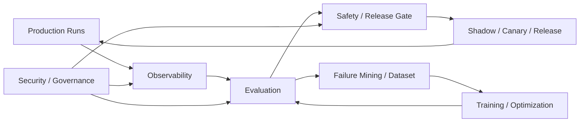
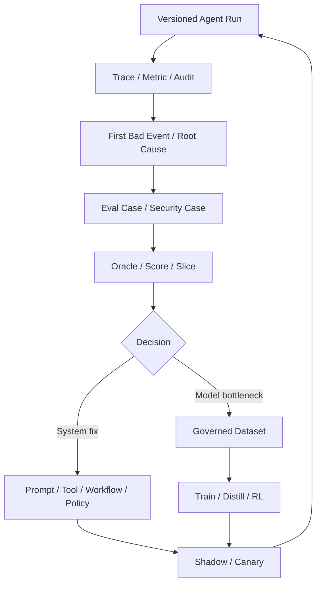
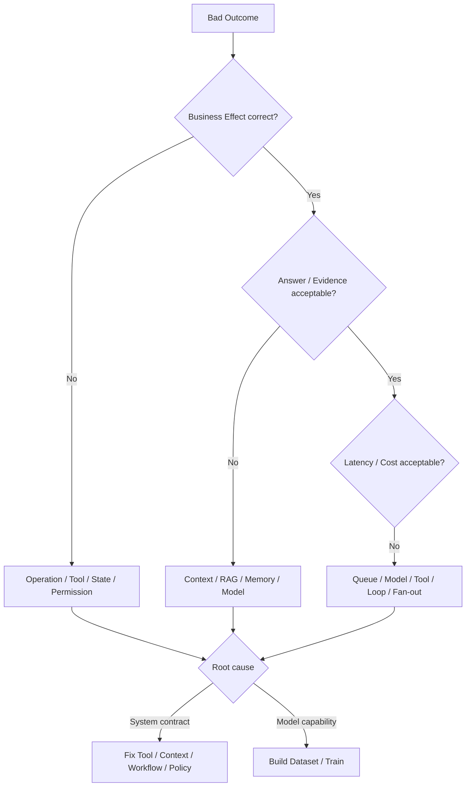

# 保障平面

> [返回总目录](../README.md)

> 调研基线：2026-08-06。公开 Benchmark、OpenTelemetry Agent 语义、安全威胁和训练框架变化较快，落地前应重新核对官方版本和适用治理要求。

保障平面负责证明 Agent 是否有效、稳定、安全、可解释和值得持续投入，并把线上运行转化为可治理的改进闭环。它不是上线后的附加监控，而是贯穿设计、评测、发布、运行、事件响应和训练的独立平面。



## 四个核心模块

| 模块 | 核心问题 | 关键对象 | 最危险的失败 |
|---|---|---|---|
| [Agent 能力评测](01-Agent评测.md) | 如何证明 Agent 能力、可靠、安全且有业务价值？ | Suite、Case、Trial、Trajectory、Oracle、Score、Gate | 指标错位、Judge 偏差、数据泄漏、高风险回归被平均 |
| [可观测性](02-可观测性.md) | 如何解释一次运行的因果、版本、Effect、性能和成本？ | Trace、Span、Event、Metric、Usage、Debug Bundle | 链路断裂、敏感数据泄漏、只见 HTTP 成功不见业务失败 |
| [安全、权限与治理](03-安全权限与治理.md) | 如何限制不可信模型和内容可造成的真实影响？ | Asset、Threat、Delegation、Policy、Control、Incident | 注入越权、Confused Deputy、数据外发、供应链和级联攻击 |
| [训练与持续优化](04-训练与持续优化.md) | 何时训练、如何构建数据/奖励并安全发布？ | Trajectory、Dataset、Reward、Training Run、Checkpoint、Rollout | 数据污染、Reward Hacking、遗忘、模拟器过拟合和反馈环 |

## 核心闭环



## 四类核心真值

```text
Business Source of Truth -> 任务和副作用是否真实完成
Runtime State/Event       -> 执行现在进行到哪里
Telemetry                 -> 过程、性能、版本和成本发生了什么
Evaluation Oracle         -> 按约定如何判断好坏
```

Trace、模型自述和 LLM Judge 都不能替代业务 Source of Truth。

## 统一不变量

1. 每次发布都能追溯模型、Prompt、Workflow、Tool、Policy、数据、环境和 Grader 版本。
2. Agent 评测包含初始环境、身份权限、允许/禁止动作和真实 Effect Oracle。
3. 随机 Agent 通过多 Trial、置信区间和稳定性指标评估，不用单次最佳结果代表能力。
4. 高风险安全违规、跨租户访问和重复副作用不能被平均分掩盖。
5. Trace 串联 Run、Task、Attempt、Call、Operation、Approval、Artifact 和 Effect。
6. Prompt、Tool Result、截图和文件默认不全量写入可观测系统。
7. 模型输出、网页、文档、Tool Output、Memory 和其他 Agent 消息都按不可信输入处理。
8. 身份认证、系统授权、业务审批和用户 Consent 独立验证。
9. 权限、数据和能力在检索/暴露前过滤，不在模型选择后补救。
10. 训练数据有来源、许可、Consent、去敏、去重、Split 和 Lineage。
11. Hard Safety/Effect Constraint 不被软质量或 Reward 抵消。
12. 线上 Trace 不自动回灌训练，必须经过根因、质量和治理。
13. Offline -> Shadow -> Canary -> Progressive Rollout，每阶段有自动停止和回滚。
14. 训练和系统优化统一以 Verified Task Success、风险、SLO 和 Cost per Success 判断价值。

## 推荐阅读顺序

### 学习顺序

```text
Agent 评测
-> 可观测性
-> 安全、权限与治理
-> 训练与持续优化
```

先学会定义“什么是好”，再学会看清“发生了什么”，然后建立安全边界，最后才将可信信号用于训练。

### 工程建设顺序

```text
业务成功与安全不变量
-> Eval Case / Oracle / Fixed Suite
-> Run / Operation / Version Telemetry
-> Asset / Identity / Policy / Incident Controls
-> Shadow / Canary / Release Gate
-> Trace Mining / Dataset Governance
-> SFT / Preference / RL / Distillation
```

没有可执行 Oracle 和完整 Trace 时，训练只会让错误更稳定；没有权限和数据治理时，数据飞轮会成为风险放大器。

## 模块间数据契约

```text
Runtime -> VersionedTrace / AuditEvent / UsageRecord
Observability -> DebugBundle / FailureCluster / OnlineSignal
Evaluation -> EvalCase / ScoreRecord / ReleaseGate
Security -> PolicyDecision / ThreatFinding / IncidentRecord
Training -> DatasetCard / RewardRecord / TrainingRunManifest
Release -> VersionVector / CanaryDecision / RollbackRecord
```

这些对象通过稳定 ID、Digest 和 Version 关联，不通过不可审计的自然语言备注维系。

## 典型质量问题定位



先定位 First Bad Event 和真实根因，再决定修改系统还是训练模型。

## 综合发布门禁

一个生产发布至少同时检查：

- Contract/Schema/State Invariant。
- Fixed/Hidden/Time-split 任务成功和稳定性。
- 高风险、权限、注入、泄漏和供应链安全。
- P50/P95/P99、Deadline、Recovery 和 Duplicate Effect。
- Token、Tool、Compute、Storage、Human 和 Cost per Success。
- Shadow 轨迹、Canary 真实结果和用户反馈。
- 数据/模型/策略/工具版本、Active Run 兼容和回滚。

## 生产排障顺序

```text
Business Source of Truth / User Impact
-> Operation / Approval / Policy / Identity
-> Runtime State / Event / Artifact
-> Trace / First Bad Event / Version Vector
-> Eval Oracle / Grader / Slice
-> Data / Reward / Training / Release
```

不要从“换一个更强模型”开始排障。先确认真实 Effect、权限和状态，再定位数据、系统契约或模型能力瓶颈。
