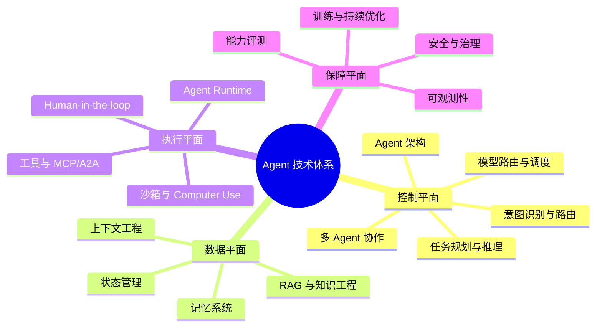
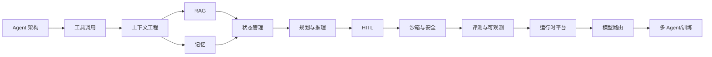

# Agent 技术全景路线图

> 调研基线：2026-08-06。协议、框架、模型和排行榜变化较快，落地前请再次核对官方资料。

## 全景图



## 核心定义

```text
Agent = Model + Instructions + Context + State + Memory + Tools
        + Control Loop + Runtime + Guardrails + Evaluation + Observability
```

Agent 的本质是围绕目标持续执行“感知 -> 决策 -> 行动 -> 反馈 -> 更新状态 -> 验证/终止”的受控闭环，而不是更长的 Prompt。

## [01 控制平面](01-控制平面/README.md)

1. [Agent 架构](01-控制平面/01-Agent架构.md)：目标契约、控制权边界、Harness、运行时对象、长任务、验证、故障恢复与架构选型。
2. [任务规划、推理与自我纠错](01-控制平面/02-任务规划与推理.md)：Plan IR、目标分解、计划编译、滚动重规划、搜索、Verifier 与自我纠错。
3. [意图识别与请求路由](01-控制平面/03-意图识别与请求路由.md)：标签治理、开放集、选择性分类、多意图、Slot、澄清、校准与级联路由。
4. [模型路由与推理调度](01-控制平面/04-模型路由与推理调度.md)：模型画像、质量成本路由、Cascade/Fallback、Token 调度、KV Cache 与推理服务。
5. [多 Agent 协作](01-控制平面/05-多Agent协作.md)：拆分准入、协作拓扑、Agent Card/A2A、委派协议、分配与 Join、状态一致性、终止容错、安全和评测。

## [02 数据平面](02-数据平面/README.md)

1. [上下文工程](02-数据平面/01-上下文工程.md)：Context Manifest、信任与权限、预算、选择、排序、压缩、工具/大文件上下文、缓存安全和长任务恢复。
2. [记忆系统](02-数据平面/02-记忆系统.md)：记忆类型、写入门禁、时态冲突、检索、Consolidation、遗忘、Consent、删除和专项评测。
3. [RAG 与知识工程](02-数据平面/03-RAG与知识工程.md)：知识源、解析、Chunk、Dense/Sparse/Hybrid、Rerank、Agentic/GraphRAG、证据、ACL、新鲜度和评测。
4. [状态管理与持久化](02-数据平面/04-状态管理与持久化.md)：状态机、Checkpoint/Event、Durable Execution、幂等副作用、并发、Replay、版本迁移和灾备。

## [03 执行平面](03-执行平面/README.md)

1. [工具调用与协议](03-执行平面/01-工具调用与协议.md)：Capability Registry、Toolset、MCP/A2A、身份委派、大文件 Artifact、异步 Operation、敏感调用幂等、重复失败治理和 Effect Verification。
2. [沙箱与 Computer Use](03-执行平面/02-沙箱与Computer-Use.md)：威胁模型、Container/gVisor/MicroVM/WASM、Linux 隔离、Egress/凭据、供应链、Browser Action Contract、间接注入和 GUI 副作用验证。
3. [Human-in-the-loop](03-执行平面/03-Human-in-the-loop.md)：自治等级、风险策略、Action Snapshot、多人审批、职责分离、Durable Interrupt、恢复重校验、确认疲劳和反馈治理。
4. [Agent 运行时与平台工程](03-执行平面/04-Agent运行时与平台工程.md)：Run/Task/Attempt、Admission/Backpressure、公平与 Deadline 调度、Lease/Fencing、资源池、多租户、伸缩、版本发布、SLO、成本和灾备。

## [04 保障平面](04-保障平面/README.md)

1. [Agent 能力评测](04-保障平面/01-Agent评测.md)：Case/Trial/Trajectory/Oracle、随机性统计、Judge 校准、故障与安全评测、长任务/多 Agent、Shadow/Canary、Benchmark 版本和发布门禁。
2. [可观测性](04-保障平面/02-可观测性.md)：统一 ID/Version/Trace/Event/Metric、OTel/OpenInference、异步和多 Agent 因果、内容治理、Tail Sampling、成本归因、SLO 和调试。
3. [安全、权限与治理](04-保障平面/03-安全权限与治理.md)：零信任、威胁建模、Prompt Injection、OBO/Policy、MCP/A2A/Skill 供应链、数据与 Memory 污染、经济攻击、治理和事件响应。
4. [训练与持续优化](04-保障平面/04-训练与持续优化.md)：Train-or-not、轨迹与数据血缘、SFT/DPO/RLVR/PPO/GRPO、Reward/Credit Assignment、Rollout 基础设施、持续学习和安全发布。

## [05 实践路线](05-实践路线/README.md)

1. [框架与协议选型](05-实践路线/01-框架与协议选型.md)
2. [分阶段学习路线](05-实践路线/02-分阶段学习路线.md)
3. [综合实践项目](05-实践路线/03-综合项目.md)
4. [生产就绪检查表](05-实践路线/04-生产就绪检查表.md)
5. [面试题总表](05-实践路线/05-面试题总表.md)
6. [社区面经与真题](05-实践路线/06-社区面经与真题.md)

## 推荐阅读顺序



原则：先建立单 Agent + 确定性 Workflow 的基线，再进入多 Agent 和训练优化。

## 成熟度模型

| 级别 | 形态 | 关键能力 |
|---|---|---|
| L0 | Chatbot | 多轮文本生成 |
| L1 | RAG Assistant | 检索、引用、拒答 |
| L2 | Tool Agent | 结构化工具和短循环 |
| L3 | Workflow Agent | 状态图、审批和恢复 |
| L4 | Long-running Agent | 异步、持久化、事件驱动 |
| L5 | Multi-agent System | 专业化、并行和协议互操作 |

## 关键结论

1. 单 Agent + 确定性 Workflow 是默认基线，多 Agent 必须证明收益。
2. 状态、权限、幂等和 Verifier 决定系统能否生产可用。
3. Context、State、Memory、RAG 相关但不能混为一体。
4. 工具与沙箱放大能力，也放大安全风险。
5. 没有评测和 Trace，就无法系统性优化。
6. 生产级 Agent 是 AI 推理、工作流、分布式系统和安全治理的结合。
