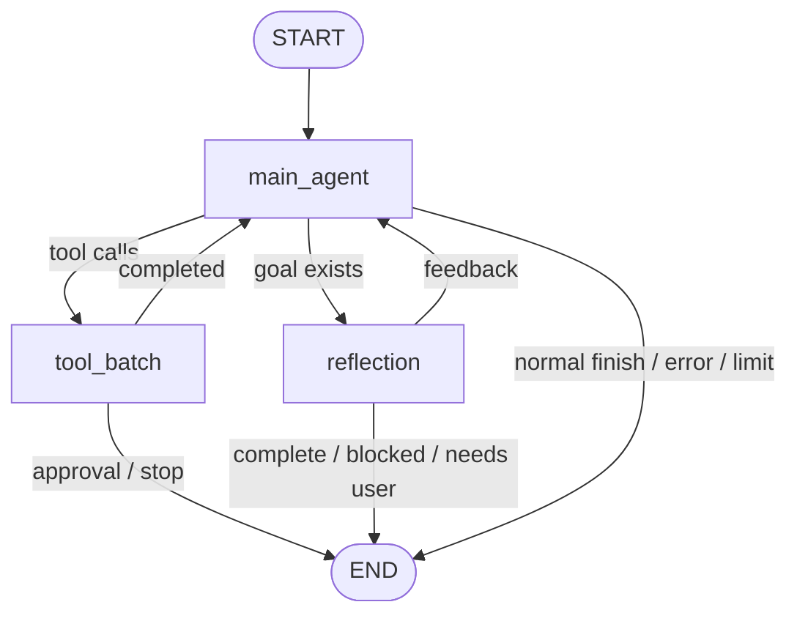

# 运行时与 LangGraph

## 核心职责

运行时把概率性的模型决策约束在确定性的状态机中。模型决定“建议做什么”，LangGraph 和 Runtime 决定“何时执行、能否执行、如何记录、何时停止”。

InnoAgent 的主图只有三个职责明确的节点：

| 节点 | 负责 | 不负责 |
|---|---|---|
| `main_agent` | 组装上下文、调用模型、解析工具调用、选择路由 | 直接执行工具、判定权限 |
| `tool_batch` | 执行工具批次、收集结果、处理审批暂停 | 自行改变目标或计划 |
| `reflection` | 根据证据检查 goal，生成完成结论或反馈 | 执行工具、伪造验证结果 |

实现入口：`core/agent/graph.py`、`core/agent/react.py`、`core/agent/stages.py`。

## 为什么使用 StateGraph

- 节点边界清晰，工具、反思和结束条件可独立测试。
- `Command(update=..., goto=...)` 同时表达状态更新与动态路由，避免图外再维护一套循环。
- `session_id` 作为 LangGraph `thread_id`，使同一会话在进程内拥有连续 checkpoint。
- iteration、reflection 次数、重复工具签名和 stop 请求共同保证终止性。

## 执行中纠偏

运行中的用户输入不是新建一轮，而是写入当前 session 的 steering 队列：

- `after_tool`：默认策略，等待当前工具批次完成再注入，避免留下半完成副作用。
- `immediate`：在下一个图节点边界注入，不强杀正在执行的模型请求或工具。
- `stop`：在安全边界结束当前 turn。

应用纠偏后清除上一轮工具签名，允许模型在新约束下重新选择同一工具。每次排队、应用和停止都有独立事件，便于 UI 展示与会话审计。

## 状态与持久化边界

当前实现采用双层持久化：

- LangGraph `InMemorySaver`：保存当前进程内的 super-step 状态。
- JSONL Session Store：保存跨进程可恢复事件和 `state.checkpoint`。

这不是完整 Durable Execution。进程在工具产生副作用后、checkpoint 写入前崩溃时，仍缺少稳定 `operation_id`、对账和补偿机制。生产化时应将外部副作用从图节点中抽成可幂等、可重放隔离的 Operation。

## 设计不变量

- 图是唯一控制循环，Runtime 不得再引入隐藏 while-loop 驱动主 Agent。
- 节点只返回结构化状态和路由，不直接操作 TUI。
- 等待审批时持久化 pending calls 并结束本次图运行，批准后从 session 状态继续。
- 停止、错误、轮数上限和无进展必须产生明确 `finish_reason`。
- 模型文本不能覆盖权限、状态和工具真实结果。
