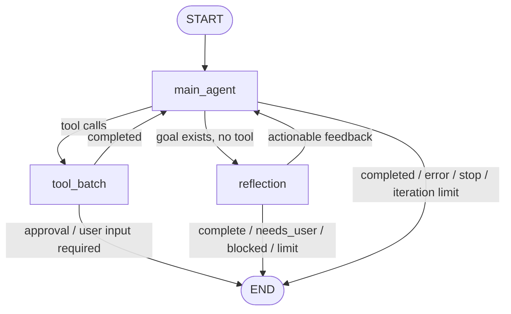

# 运行时与 LangGraph

## 模块定位

运行时负责把不稳定的模型决策约束在可测试、可停止、可恢复的状态机中。模型回答“建议采取什么动作”，Runtime 回答“动作是否合法、何时执行、执行后写入什么状态、下一步去哪里”。

主要实现：

| 文件 | 职责 |
|---|---|
| `core/agent/react.py` | `EventDrivenAgent`，负责依赖装配、节点实现、审批、纠偏、压缩和持久化 |
| `core/agent/graph.py` | 构造 LangGraph 主图，将 Runtime 节点适配为 `Command` 路由 |
| `core/agent/model_stream.py` | 将 Provider 流转换为确定性的 `ModelBatch` |
| `core/agent/stages.py` | Planning 和 Reflection 两个独立子图 |
| `core/runtime/state.py` | `AgentState` 与初始状态 |
| `core/runtime/config.py` | 运行预算、模式和工作区配置 |
| `core/runtime/agent.py` | `InnoAgentRuntime` 兼容名称 |

## 为什么选择 LangGraph

Coding agent 的难点不是生成一次回答，而是管理循环、暂停、恢复和分支。手写 `while True` 很容易把模型调用、工具执行、审批和重试混在一个方法中，导致：

- 路由条件无法独立测试。
- 审批只能阻塞线程，难以持久化后恢复。
- Reflection、Plan 和主循环共享隐式局部变量。
- 失败后不知道停在哪个边界，也无法解释为什么继续。

StateGraph 将每次推进拆成显式节点和边。`Command(update=..., goto=...)` 同时表达状态变化和下一跳，运行时不需要在图外维护第二套循环。

## 主图结构

主图只保留三个业务节点，原因是节点过细会产生大量无意义 checkpoint 和路由样板，节点过粗又会把审批、工具与 Reflection 藏进不可观察的方法中。当前粒度使每个节点拥有单一控制职责。

## Runtime 初始化

`EventDrivenAgent.__init__` 是组合根，创建并连接：

- `ToolRegistry` 与全部内置工具。
- `ProfileStore`、`MemoryRecall`、`MemoryUpdater`。
- `SessionStore` 与 `PermissionStore`。
- `SkillLoader`、`ContextBuilder`、`ContextCompactor`。
- `ModelStreamConsumer`、`StageRunner`、`SubagentRunner`。
- `MainAgentGraph`。

依赖集中装配而不是由各模块自行创建，便于测试注入 FakeModel、自定义 Registry 和 summarizer，也避免工具层反向依赖 CLI。

## 一次 Turn 的生命周期

`invoke()` 执行以下步骤：

1. 新会话创建 `SessionRecord`，续接会话则从 `SessionStore` 恢复状态。
2. 合并本轮 Goal 与主动选择的 Skills；显式重启 Goal 时先清空旧目标的执行证据。
3. 通过 `reset_turn_scope()` 清理 Reflection 计数、错误、工具结果、一次性审批和模型临时上下文，再追加用户消息；同一 Goal 的 Plan/Task 继续保留。
4. 生成新的 `turn_id`，标记当前 Runtime 正在执行。
5. 发出 `turn.started`。
6. 根据上下文预算决定是否自动压缩。
7. 调用主图直到结束、暂停审批或达到安全边界。
8. 发出 `turn.completed` 或 `turn.failed`；所有稳定事件在 `_emit()` 时已经逐条持久化。
9. 追加 `state.checkpoint` 作为恢复快照。
10. 将本轮交给 Memory 更新器计数。

`finally` 中始终清除 `_run_active`。这样即使模型、工具或持久化抛出意外异常，CLI 也不会永久认为 Agent 仍在运行。

Goal 有独立于 Session 的执行生命周期。Session 消息和累计 usage 可以跨 Goal 保留，但 Plan、Task、Reflection、工具结果、错误及一次性授权只属于产生它们的 Goal。`restart_goal=True` 或 Goal 值发生变化时，Runtime 使用统一的 `reset_goal_scope()` 重置这些字段；`turn.started.goal_restarted` 让无 checkpoint 的事件重放保持同样语义。

## `main_agent` 节点

`_graph_main_agent()` 每次只做一次模型决策：

1. 在模型调用前检查 stop。
2. 增加 iteration，超过上限时以 `iteration_limit` 结束。
3. 编译 Context，调用 `ModelStreamConsumer`。
4. 合并 usage，并处理模型错误。
5. 将模型文本追加到消息历史。
6. 在模型返回后再次检查 stop。
7. 若存在工具调用，优先应用 `immediate` steering，然后进入 `tool_batch`。
8. 若本次工具签名与上次完全相同且已有结果，以 `repeated_tool_call` 停止。
9. 若无工具，应用尚未消费的默认 steering。
10. 无 goal 时正常结束；有 goal 时进入 Reflection。

重复工具签名是轻量无进展检测。它不能识别参数不同但语义相同的循环，却能阻止最常见的“模型忽略结果并原样重试”。用户纠偏会清空签名，使模型可以在新约束下合法重试同一动作。

## `tool_batch` 节点

`_execute_tool_batch()` 按模型顺序取得 `ToolAuthorization`。Registry 负责参数规范化、Guardrail preflight、并行或串行调度；Runtime 负责：

- 用授权阶段返回的规范化参数绑定后续审批与执行。
- 发出每个工具结果事件。
- 把 blocked、error 和真实执行结果写入 `tool_results` 与消息历史。
- 在首个 `needs_confirmation` 处停止，把它保存为 pending，并将后续调用保存为 deferred tail，不把审批伪造成 ToolResult。
- 构造包含 `request_id`、calls、reason 和结构化 options 的 `ApprovalRequest`。
- 发出 `approval.requested`，以 `approval_required` 暂停当前 turn。
- 识别 `ask_user` 的结构化问题，写入 `pending_user_question`，以 `user_input_required` 暂停。

同一批次中，审批点之前的相邻只读窗口可以并行完成；审批点之后的调用不能越过它执行。用户批准或拒绝后，Runtime 先处理该调用，再按原顺序继续 deferred tail。若前缀同时产生用户问题，两种 pending 状态都保留；审批解决后优先继续处理尚未回答的问题。

等待审批或用户回答时结束本次图运行而不是阻塞 LangGraph 节点。这样 UI 可以继续响应，pending 数据也可以进入 session checkpoint。

`ask_user` 是无副作用串行工具。它只返回问题、候选项和是否允许自定义输入；Runtime 负责发出 `user_question` 事件并暂停，TUI 负责收集答案。下一轮 `invoke()` 清理 pending 字段、追加答案为 user message，再从主图入口继续。工具不直接读取终端，因此 Web、IDE 或远程客户端可以复用相同协议。

## 审批恢复

`resolve_approval()` 从 Session 恢复并校验 `ApprovalRequest`。decision 必须属于请求声明的稳定选项；未知值直接失败，不允许默认放行：

- `deny`：为每个调用生成 `blocked` ToolResult，模型能看到用户拒绝，而不是把调用静默丢弃。
- `allow_once`：将调用放入 `approved_tool_calls`，仅本次 Guardrail 跳过询问。
- `allow_always`：由 `PermissionStore` 写入仓库级规则，再重新执行调用。

批准时，被批准调用与 deferred tail 重新进入同一顺序调度；拒绝时先生成 blocked ToolResult，再继续 tail。执行完成后检查 stop、应用 `after_tool` steering，最后重新进入主图。审批因此是“可恢复暂停点”，不是一条绕开正常执行链的特殊路径。

旧 Session 中的字符串 options 和旧 `needs_confirmation` 事件会在读取时升级为当前请求结构。兼容逻辑只负责恢复语义，不允许旧格式绕过当前 Guardrail。

## Reflection 节点

当模型不再请求工具且 session 存在 goal 时，Runtime 调用 `StageRunner.reflect()`。结果分为：

- `complete=true`：标记目标完成并结束。
- `needs_user=true`：保存结构化问题与可选候选项，要求用户补充信息。
- `blocked=true`：报告环境或权限阻塞。
- 仍可推进：把 feedback 写入 Reflection 状态，再回到 `main_agent`。
- 超过 `max_reflections`：以明确限制结束，避免模型与评审器无限互相驳回。

Reflection 不执行工具，保证“判断是否完成”和“采取动作”是两个职责不同的阶段。

## 执行中用户纠偏

Runtime 使用线程锁保护 `_steering_queues` 和 `_stop_requests`。纠偏有两种投递策略：

| 策略 | 应用边界 | 适用场景 |
|---|---|---|
| `after_tool` | 当前工具批次结束后 | 默认，避免强杀写操作或留下未知副作用 |
| `immediate` | 下一次模型到工具之间的图节点边界 | 阻止尚未开始的工具批次，快速改变方向 |

`_apply_pending_steering()` 会把纠偏转换为显式 user message，同时写入 `steering_history` 并发出 `steering.applied`。不直接修改当前 prompt 字符串，是为了让 checkpoint、事件重放和后续压缩都能观察到该指令。

`/stop` 同样不杀死当前系统调用，而是在 `before_model`、`after_model` 或 `after_tool` 等边界消费。安全优先于即时性。

## `AgentState` 设计

状态按职责分为六组：

| 分组 | 典型字段 | 含义 |
|---|---|---|
| 身份 | `session_id`、`turn_id`、`user_id` | 关联事件、会话和用户 |
| 对话 | `user_input`、`messages`、`response` | 模型可见历史和当前输出 |
| 控制 | `next_action`、`finished`、`finish_reason`、`iteration` | 图路由与终止 |
| 执行 | `tool_calls`、`tool_results`、`pending_tool_calls`、`deferred_tool_calls`、`pending_user_question` | 工具意图、证据、顺序恢复和交互暂停 |
| 目标 | `goal`、`plan`、`tasks`、`reflection` | 长任务闭环 |
| 上下文 | `active_skills`、`context_summary`、`context_usage`、`usage` | 能力、压缩和预算 |

`TypedDict(total=False)` 允许旧 checkpoint 缺少新字段，恢复后由 `_ensure_state_defaults()` 补齐。这降低了早期版本迭代成本，但不是完整 schema migration；生产版本仍需显式状态版本。

## 终止条件

Runtime 不允许把“模型没有继续说”作为唯一结束依据。当前终止来源包括：

- 正常完成：`completed`。
- 用户停止：`stopped`。
- 工具审批：`approval_required`，属于暂停而非目标完成。
- 用户输入：`user_input_required`，属于可恢复暂停。
- 模型或运行错误：`error`。
- 主循环上限：`iteration_limit`。
- Reflection 上限：`reflection_limit`。
- 重复工具调用：`repeated_tool_call`。
- Goal 完成、需要用户或环境阻塞。

明确的 `finish_reason` 同时服务 TUI、Session、测试和未来指标统计。

## Checkpoint 与 Durable Execution 边界

当前有两层恢复机制：

- LangGraph `InMemorySaver`：维护当前进程的图 super-step。
- JSONL Session：跨进程保存稳定事件与完整 `state.checkpoint`。

这还不是生产级 Durable Execution。若进程在外部副作用成功后、checkpoint 写入前崩溃，恢复时可能不知道动作是否已完成。后续必须引入 `operation_id`、幂等键、执行账本和 unknown-effect 对账，而不是简单重放工具节点。

## 扩展约束

- 新节点必须有清晰输入、输出、路由和终止测试。
- 不要在 `EventDrivenAgent` 外再启动主 Agent 循环。
- 长等待应建模为可恢复 interrupt/signal，而不是占用工作线程。
- 外部副作用必须经 Tool Registry，不能在 Planning、Reflection 或 TUI 中直接执行。
- 增加状态字段时同步更新初始状态、默认补齐、checkpoint 和事件重建逻辑。
- 改变 finish reason 时同步更新渲染、测试和指标。

## 关键测试

- `test/test_main_loop.py`：主模型、工具、审批和重复调用。
- `test/test_advanced_runtime.py`：三个图、纠偏边界、停止、压缩和模型重绑定。
- `test/test_parallel_tools.py`：并行只读工具与结果顺序。
- `test/test_session.py`：checkpoint 和事件重建。
- `test/test_reflection.py`：目标完成判断。
