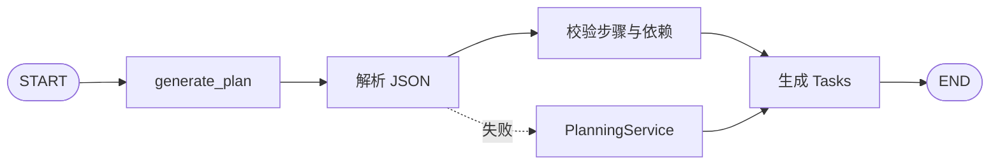
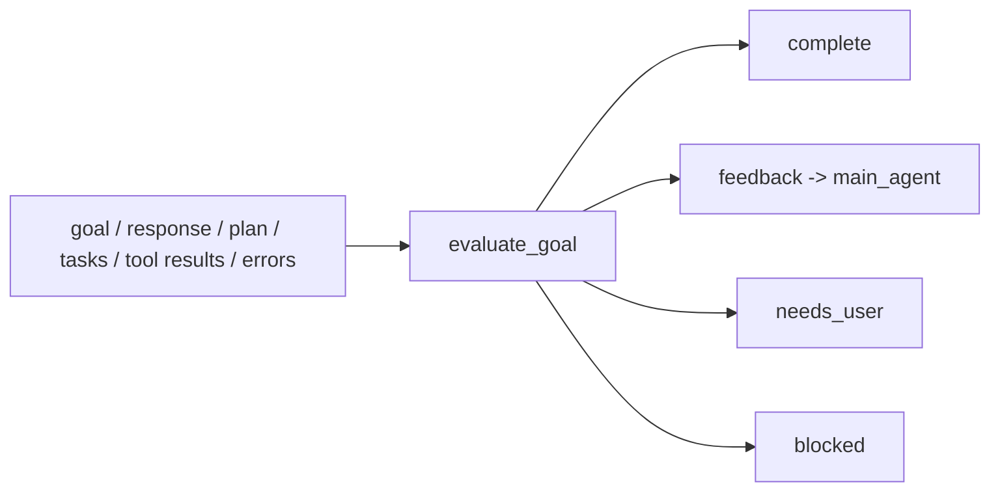

# 规划与反思

## 模块定位

Planning 与 Reflection 分别解决两个不同问题：

- Planning：把目标转成可观察、可更新的执行结构。
- Reflection：在主模型准备结束时，用证据判断目标是否真的完成。

二者都使用独立 LangGraph 子图，但都不直接执行文件或 Shell 操作。这样可以把“想怎么做”“实际执行”“是否完成”分成三个独立责任域。

主要模块：

| 文件 | 职责 |
|---|---|
| `core/agent/stages.py` | 模型化 Planning/Reflection stage 与 JSON 解析 |
| `core/planning/schemas.py` | Plan、PlanStep、Task 和状态类型 |
| `core/planning/planner.py` | 确定性创建、修订和校验 fallback |
| `core/planning/tasks.py` | PlanStep 与 Task 的转换和同步 |
| `core/reflection/schemas.py` | Reflection 输入输出契约 |
| `core/reflection/evaluator.py` | 模型失败时的保守确定性评估 |
| `core/reflection/feedback.py` | 将 Reflection 结果转成主模型可消费反馈 |
| `core/tool/plan_tool.py`、`task_tool.py` | 主 Agent 可调用的入口 |

## Planning 子图



子图当前只有一个 `generate_plan` 节点。使用独立图的主要原因不是节点数量，而是给 Planning 独立 stage、状态、事件、usage 和未来扩展点，避免把计划生成塞进主 Agent Prompt。

## Planning 输入输出

输入：

- `goal`：完整目标。
- `feedback`：为什么要修订。
- `existing_plan`：当前计划快照。

模型必须返回：

```json
{
  "summary": "计划理由",
  "steps": [
    {
      "title": "步骤标题",
      "description": "完成条件",
      "depends_on": ["前置步骤标题"]
    }
  ]
}
```

Prompt 使用步骤标题表达依赖，解析后 `_parse_plan()` 将标题映射为稳定 `step_id`。模型不需要生成 UUID，降低格式错误和依赖引用难度。

## Plan 数据模型

`Plan` 包含：

- `plan_id`：计划稳定标识。
- `goal`：目标原文。
- `status`：draft、active、revised、completed 或 abandoned。
- `steps`：有序 `PlanStep`。
- `rationale`：计划说明或修订反馈。
- `revision`：修订次数。
- 创建与更新时间。

`PlanStep` 包含 title、description、depends_on、status 和 result。步骤状态为 `pending`、`in_progress`、`done`、`blocked`、`skipped`。

Plan 是整体结构，Task 是面向执行状态和 TUI 的工作项。当前每个非 skipped Step 转成一个 Task。

## 为什么 Plan 与 Task 分离

Plan 关注依赖、修订和整体进度；Task 关注当前执行状态、负责人和结果。分离后可以：

- 保留计划修订历史而不强制重建 UI 工作项语义。
- 未来将一个 PlanStep 拆成多个 Task。
- 让 Task 状态更新不需要重新调用 Planning 模型。

当前实现仍按 title 将 Task 同步回 Step，这是简单但有限的映射。重复标题或重命名会产生歧义，未来应在 Task 中保存 `step_id`。

## 计划解析和修订

`StageRunner._parse_plan()`：

1. 解析模型 JSON object。
2. 读取 steps，拒绝空步骤集合。
3. 按标题识别旧步骤，保留已有 `step_id`；已完成步骤同时保留 status 与 result。
4. 只为真正新增的步骤生成 `step_id`，修订沿用原 `plan_id` 和 created time。
5. 将已知标题依赖转换为 step id；未知标题保留原值，交给 validator 明确拒绝，不能静默删除。
6. 增加 revision，保留 summary 作为 rationale。
7. 调用 `PlanningService._validate()`。
8. 生成 Tasks。

修订时保留同标题的 done 步骤及 result，避免模型通过重新生成计划抹掉已经发生的事实。该策略依赖稳定标题，适合当前轻量实现；更严格的实现应让模型引用已有 step id。

## 确定性 Fallback

若模型不可用、返回非 JSON、空 steps 或非法结构，Planning 不会让整个主图失败，而是回退到 `PlanningService`：

- “完成目标”：承载原 goal。
- “验证结果”：要求检查产物。

Fallback 不假装理解复杂任务，只提供最小可执行框架。它的价值是保证 Plan 工具始终返回合法结构，并把 warning 交给主 Agent，而不是提供高质量任务拆解。

## Plan 校验

`PlanningService._validate()` 检查：

- goal 非空。
- 至少有一个 step。
- depends_on 只引用当前 Plan 中的 step id。
- 通过 DFS 检测依赖环。

校验在模型输出解析后和确定性 Plan 创建后都执行，防止不同入口产生不一致规则。

## Task 状态更新

`task` 工具只在已有 Plan 时工作：

- 创建：title 必填，status 默认 pending。
- 更新：task_id 和 status 必填。
- blocked：result 必须说明具体依赖。
- done：应附带验证结果，而不是仅凭模型自述。

`sync_steps_from_tasks()` 将 Task 状态同步到同标题 Step；所有步骤 done 后将 Plan 标为 completed。

Task 工具不自动执行任务，也不是调度器。它只维护状态。主模型仍决定何时开始哪个任务以及调用哪些工具。

## 当前不是 DAG Scheduler

Plan 已保存 depends_on，但 Runtime 不会自动计算 ready set、分配 worker 或等待 join。原因是本地 coding 任务常有共享工作区写冲突，过早自动并行会增加合并和恢复复杂度。

若未来实现自动调度，需要同时增加：

- ready-step 计算。
- 资源和文件冲突声明。
- 并发预算。
- join 与部分失败策略。
- task artifact 所有权。
- 取消和重试传播。

## Reflection 子图



`ReflectionInput` 只包含判断所需证据，不注入完整聊天历史和全部工具 schema。这样减少模型被无关上下文影响，也明确 Reflection 不能执行动作。

## Reflection 输出契约

| 字段 | 含义 |
|---|---|
| `complete` | 所有实质条件是否有证据支持 |
| `confidence` | 0 到 1 的判断置信度，不是成功概率 SLA |
| `summary` | 当前判断摘要 |
| `feedback` | 主 Agent 下一轮应采取的具体动作 |
| `needs_user` | 是否缺少只能由用户提供的信息或授权 |
| `blocked` | 环境是否无法继续推进 |
| `missing_conditions` | 未满足的验收条件 |
| `evidence` | 支持判断的事实 |

`complete=true` 时 `needs_user` 与 `blocked` 应为 false。未完成但 Agent 能继续时，应给出可执行 feedback，而不是泛泛要求“继续努力”。

## 证据优先级

```text
文件与外部系统真值
> 确定性测试和 verifier
> 结构化 ToolResult
> Task 状态
> 模型自然语言声明
```

Task 标成 done 仍不足以证明功能正确；它只能说明控制状态。高质量 Reflection 应引用测试结果、文件状态、Git diff 或业务 API 查询。

## Reflection Fallback

模型输出无法解析时，`evaluate_goal()` 使用保守规则：

- 没有 goal 时视为无需 Reflection。
- 有 Task 时要求全部 done。
- 有未解决 errors 时不完成。
- 必须存在最终 response。
- 没有 Task 时认为缺少可验证计划。

Fallback 的目标是安全地拒绝虚假完成，而不是理解任意自然语言验收条件。复杂 Goal 仍依赖模型评审和未来 verifier。

## Feedback 回流

未完成时 `feedback_to_message()` 将缺口和已有证据转成模型可见消息。Runtime 在下一次 Context 中加入最近 Reflection feedback，使主 Agent 能针对缺口继续执行。

反馈进入 State 而不是只作为临时 prompt 参数，原因是它需要被 Session、TUI、压缩和恢复共同观察。

## 终止与防循环

- Reflection 次数受 `max_reflections` 限制。
- `needs_user` 与 `blocked` 结束当前 turn，不继续空转。
- feedback 为空且未完成应视为低质量结果，由 fallback 或 Runtime 限制兜底。
- 主图 iteration limit 仍覆盖 Reflection 回流后的总体循环。

## 扩展约束

- Planning Prompt 的 JSON 结构必须与 `_parse_plan()` 同步。
- 新增 Step/Task 状态时同步 schema、TUI、同步函数和测试。
- Reflection 新增字段时同步 Prompt、Pydantic schema、事件和 Session 重建。
- 自动调度前先解决共享写入和 artifact ownership。
- verifier 应输出结构化证据，不把自然语言总结当作真值。

## 关键测试

- `test/test_planning.py`：创建、修订、完成步骤保留和依赖环。
- `test/test_reflection.py`：pending/done Task 与确定性 fallback。
- `test/test_advanced_runtime.py`：主图、Planning 图和 Reflection 图集成。
- `test/test_tools.py`：Plan/Task 工具参数契约。
