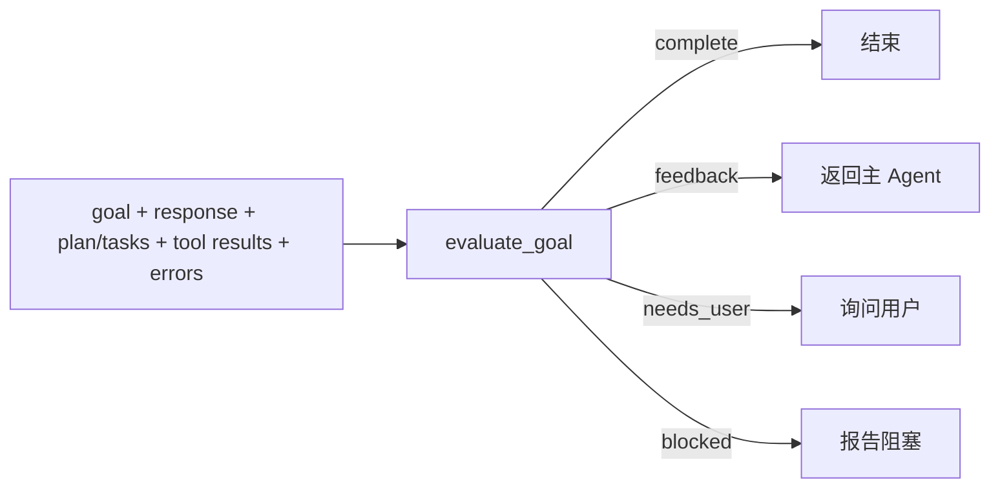

# 规划与反思

## Planning 的定位

Planning 将目标转换为可显示、可验证的步骤，不负责执行。InnoAgent 通过 `plan` 工具进入独立 LangGraph 子图，输入为 goal、已有计划和 reflection feedback，输出为 Plan 与 Task。

一个有效步骤至少需要：

- 清晰标题和可观察的完成条件。
- 稳定 step id。
- 合法依赖，不引用未知步骤、不形成环。
- 明确状态：pending、in progress、completed 或 blocked。

计划修订保留已完成步骤与结果，避免模型通过重写计划“忘记”已发生事实。模型输出无法解析时使用确定性 fallback，并把 warning 返回主 Agent。

## Plan 与 Task

Plan 描述整体执行结构；Task 是面向 UI 和状态更新的工作项。`task` 工具负责创建、开始、完成和阻塞任务，TUI 根据 task 状态展示进度。

当前调度仍由主模型决定，不是完整 DAG scheduler。只有工具批次支持受控并行，Plan 的依赖主要用于表达和校验。未来若引入自动调度，应增加 ready-step 计算、资源冲突和 join 规则。

## Reflection 的定位

设置 goal 后，主模型准备结束时必须进入 Reflection：



Reflection 输出 `complete`、`confidence`、`summary`、`feedback`、`needs_user`、`blocked`、`missing_conditions` 和 `evidence`。它只判断证据，不直接调用工具。

## 反思必须基于证据

优先级应为：

```text
文件/环境真值 > 确定性测试 > 结构化工具结果 > 模型自述
```

“已修改”“应该通过”或自然语言总结不能单独证明目标完成。若缺少验证，Reflection 应给出可执行 feedback；只有确实需要外部输入时才设置 `needs_user`，环境或权限无法推进时才设置 `blocked`。

## 终止性

- 主循环受 `max_iterations` 限制。
- Reflection 受 `max_reflections` 限制。
- 相同工具批次重复且已有结果时安全停止。
- 用户 stop 在模型或工具边界生效。
- 达到限制时返回明确原因，不伪装为完成。
