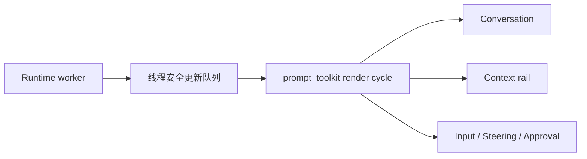

# 事件与 TUI

## 事件是界面契约

Runtime 不直接操作终端。模型、工具、审批、压缩和纠偏统一转换为事件，CLI/TUI 只消费事件：

```text
turn.started / turn.completed / turn.failed
item.started / item.delta / item.completed
approval.requested / approval.resolved
steering.queued / steering.applied
steering.stop_requested / steering.stopped
context.compaction.started / context.compaction.completed
```

该模型接近 Codex 的 turn/item 生命周期，同时保留 InnoAgent 所需的 stage、tool、usage 和 approval 字段。事件是稳定协议，渲染文本不是。

## 流式事件归一化

`ModelStreamConsumer` 将 Provider SSE 归一化为一个确定性 `ModelBatch`：

- message delta 合并为文本。
- tool call 的名称和参数按 `call_id` 聚合。
- completed event 补齐最终内容。
- response event 汇总 usage 或 error。

Runtime 同时转发原始规范化事件供 UI 实时展示。`item.delta` 不写入 session；完成事件足以恢复语义状态。

## TUI 架构



全屏 TUI 使用单个常驻 `prompt_toolkit.Application`。Runtime 在线程中执行，只向队列写更新；UI 在 render cycle 内批量修改 Buffer，避免后台线程直接操作终端控件。

## 交互状态

- 空闲：输入框发送普通任务。
- 执行中：输入框切换为 steering，保持可输入。
- 待审批：显示工具和参数摘要，接受一次允许、一直允许或拒绝。
- 窄终端：隐藏 context rail，优先保证会话和输入可用。
- 非 TTY/CI：回退到普通文本输入输出，便于脚本和测试。

Context rail 展示 session、model、mode、context 比例、累计 token、goal 和 tasks。Planning、Reflection、工具调用、压缩和纠偏使用不同语义样式，帮助用户理解 Agent 当前处于哪个阶段。

## 设计不变量

- UI 不能从内部对象猜测事件，新增行为应先定义事件再渲染。
- 后台线程不能直接写 prompt_toolkit Buffer。
- 流式 delta 与最终 completed 必须可去重，避免重复文本。
- 审批参数只显示有界摘要，敏感数据不应进入 transcript。
- slash 命令属于控制输入，不应混入普通模型消息。
