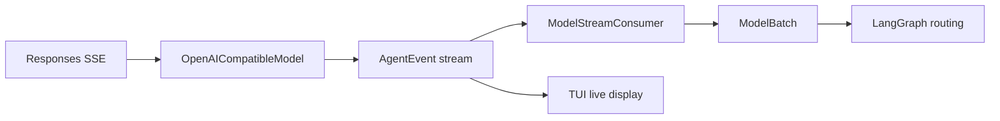
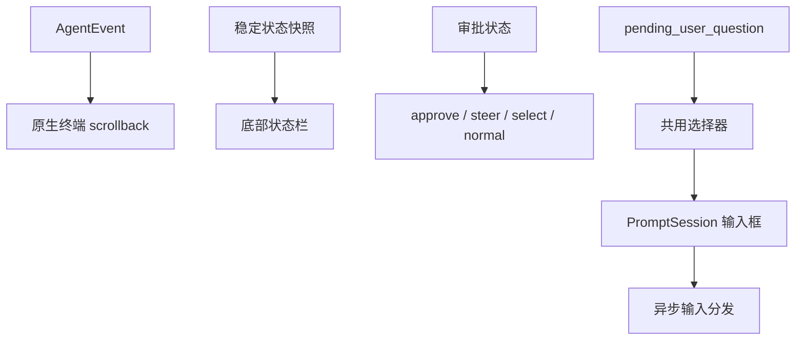

# 事件与 TUI

## 模块定位

Runtime、Session 和界面通过稳定事件解耦。Runtime 不调用 prompt_toolkit 控件，TUI 也不读取 Runtime 私有字段推断过程。

主要模块：

| 文件 | 职责 |
|---|---|
| `core/event/events.py` | `AgentEvent` 统一事件模型 |
| `core/agent/model_stream.py` | Provider 事件归一化为模型批次 |
| `view/cli.py` | 输入路由、Slash 命令、后台执行和审批 |
| `view/commands.py` | Slash 命令解析 |
| `view/terminal.py` | 内联 PromptSession、异步输入调度、线程安全输出和输入状态 |
| `view/tui_render.py` | 事件到活动、流式片段和语义块的纯转换 |
| `view/tui_theme.py` | 亮色/深色模板、环境检测以及输入区与输出区分离的语义样式 |
| `view/render.py` | 非 TTY 文本渲染与兼容事件渲染 |
| `view/resume.py` | Session 列表与恢复后的简洁状态摘要 |

## 事件模型

`AgentEvent` 的公共字段包括：

- 身份：`event_id`、`session_id`、`turn_id`。
- 时间：UTC ISO `timestamp`。
- 阶段：`main`、`plan`、`reflect`、`compact`、`subagent`。
- Item：`item_id`、`item_type`、`call_id`。
- 内容：`delta`、`payload`、`content`。
- 工具：`tool_name`、`arguments`、`result`。
- 资源：`usage`、`progress`。
- 控制：`finish_reason`、`options`。

兼容字段保留旧 adapter 和历史 session 的读取能力。新代码优先使用 `type + stage + item_type + payload`。

## 生命周期事件

```text
turn.started
item.started
item.delta
item.completed
response.completed / response.failed
approval.requested / approval.resolved
steering.queued / steering.applied
steering.stop_requested / steering.stopped
context.compaction.started / context.compaction.completed
turn.completed / turn.failed
```

采用 turn/item/call 结构的原因是它能同时表达文本、推理、工具和阶段结果，而不需要为每个 Provider 发明一套事件。TUI 和 Session 面向内部协议，不直接依赖 OpenAI SSE 字段。

## 流式归一化



`ModelStreamConsumer` 同时完成两件事：

- 将每个规范化事件立即 emit 给 UI。
- 聚合出 Runtime 可确定消费的 `ModelBatch`。

聚合规则：

- message delta 按顺序拼接。
- reasoning delta 只用于展示，不混入最终回答。
- tool call 按 `call_id` 聚合名称和分片参数。
- completed tool call 可补齐最终 arguments。
- `response.completed` 汇总 usage。
- `response.failed` 转成 batch error。

Runtime 因此不用理解 SSE，也不依赖 Provider 是否将参数拆成多个 chunk。

## Delta 与 Completed 去重

Provider 可能同时发送文本 delta 和最终 completed message。Adapter/Consumer 优先使用已拼接 delta；completed 内容只在没有 delta 时补齐。事件 payload 标记 streamed 内容，Renderer 避免再次输出整段文本。

这是 UI 正确性的关键不变量：实时显示和最终持久化都需要，但不能在 transcript 中重复两次。

## CLI 输入路由

`InnoAgentCLI` 支持两种运行方式：

- TTY：启动保留原生 scrollback 的内联 `TerminalIO`。
- 非 TTY、测试或脚本：使用普通 input/output 循环。

TUI 输入由 `_dispatch_tui_input()` 按状态路由：

1. Runtime busy：普通文本和 `/steer` 进入 steering；`/stop` 请求安全停止。
2. Pending approval：读取 `ApprovalRequest.options` 自动打开审批选择器；纯文本 `/approve` 只作为非 TTY 和兼容回退。
3. Pending user question：进入选项选择器，回答作为同一 Session 的下一条 user message。
4. 空闲 Slash 命令：进入控制命令处理；带文本的 `/goal` 例外，它设置 Goal 后立即启动 Agent turn。
5. 空闲普通文本：启动新 turn。

运行中不允许执行任意 Slash 配置命令，因为它们可能与正在使用的模型、Session 或状态竞争。只有 steering 和 stop 属于 live input。

## Slash 命令职责

| 命令 | 控制对象 |
|---|---|
| `/goal <text>` | 设置并立即执行 Goal；该 turn 支持 steering |
| `/goal`、`/goal off` | 查看或清除当前 Goal，不调用模型 |
| `/plan`、`/tasks` | 查看当前计划和任务 |
| `/tools` | 查看动态工具描述 |
| `/skills`、`/skill` | 发现和激活 Skill |
| `/status`、`/context` | 查看运行状态与上下文预算 |
| `/permissions` | 查看仓库持久规则 |
| `/compact` | 手动压缩当前 Session |
| `/approve` | 非 TUI 场景解决 pending approval |
| `/steer`、`/stop` | 运行中纠偏与停止 |
| `/mode` | 切换 ask、auto、readonly |
| `/model` | 从当前 Provider 选择模型，再选择思考强度 |
| `/resume`、`/sessions`、`/rename` | Session 管理 |
| `/new`、`/clear`、`/quit` | 生命周期与界面控制 |

Slash 命令是控制输入，不渲染或追加为普通用户消息。否则模型会把“切换模式”误解为业务任务，Session 重放也无法区分控制行为。该边界对应 Codex 协议中的设置 `Op`、`UserInputAnswer` 和 `TurnInput` 三类不同意图：设置候选只更新客户端/Runtime 配置，用户问题回答只唤醒对应 pending request，普通文本才创建或纠偏模型 turn。

命令名称、usage、说明和静态参数枚举集中维护在 `view/commands.py`。输入 `/` 展示命令，输入 `/mode a` 等内容时按参数前缀过滤；CLI 通过 `command_option_provider` 为 `/resume` 和 `/skill` 注入 session、Skill 等动态候选。候选菜单统一支持上下移动，Tab 会同步计算并应用首个匹配项，不依赖异步菜单已经完成渲染。prompt-toolkit 的 history search 会关闭 `complete_while_typing`，因此历史导航由自定义上下键处理；候选打开时输入窗口按可见项临时增高，关闭后恢复两行，避免浮层被固定高度裁切。`/help` 从同一份注册表生成，避免命令解析、帮助和补全信息漂移。

`TerminalIO.select()` 是审批、模型选择和用户问题共用的选择状态机。候选项由同一个 `PromptSession` 的单列 completion menu 展示，候选顺序保持稳定。选择器会同步构造 completion state，并用同一索引更新高亮、输入文本和最终返回值，因此快速按键不依赖异步补全是否已经结束。普通选项用 `↑`、`↓` 和 `Enter` 操作；问题可追加“自行输入…”，切换后继续复用底部输入框。`Esc` 在自定义输入阶段返回选项，在选项阶段取消；`Ctrl-C` 仍沿用全局优雅退出语义。

CLI 使用单一异步锁管理模态选择器所有权，模型与 effort 的连续选择、审批、用户问题、Session、Skill 和权限模式不能并发打开。一个选择完成后，Prompt 循环先让等待该结果的控制任务恢复；如果控制任务立即注册下一选择，输入框直接完成模态交接，不会短暂回到普通 TurnInput。这个调度点是必要的，因为 prompt_toolkit 的 UI 循环和异步命令任务相互独立，仅检查 `_selection` 非空不足以消除两次选择之间的竞态。

存在 pending 用户问题时，新的 Slash 命令不会抢占问题或作为答案送给模型；界面要求先完成当前请求。极短交接窗口内到达的普通文本仍按 `UserInputAnswer` 处理。这样避免同时出现两个选择器，也避免 `low`、`medium` 等配置候选被误记为用户任务。

`Ctrl-C` 在 TUI 键位层同时接管字符输入和 `SIGINT`，统一转换为 `/quit`。空闲时直接结束输入循环；执行中复用 `/quit` 的安全停止路径，先向 Runtime 提交停止请求，等待当前工具边界完成后退出。`TerminalIO.run()` 仍捕获极端时序下的 `KeyboardInterrupt`，并在退出前回收 prompt 子任务，避免 traceback 和未读取任务异常。

`view/resume.py` 将恢复匹配、候选摘要和 UI 事件筛选与 CLI 主类分开：`pick_session()` 依次匹配完整 session id、完整名称和唯一前缀；非 TTY 且未指定目标时仍选择最近会话。TTY 中无参数 `/resume` 展示名称或 id、更新时间和最近用户输入，再由用户选择；说明列不重复主标签中的 id，也不展示 Goal。

恢复 TUI 时，CLI 从 JSONL 选择最近 20 个 turn、最多 300 个用户可见稳定事件，并按原序写入 native scrollback。`turn.started` 显式恢复为 `You` 区块，其余 completed item、审批结果、压缩、steering 和失败事件继续走统一 `present_event()`。持久层不保存 delta，所以历史 message/reasoning 的 `streamed` 标记只在回放副本中重置，确保 completed 正文可见。回放结束后只追加一条最近输入摘要，不再调用 `render_state()` 重复最终响应；非 TTY 路径仍输出摘要与最新 state。

工具事件中的 `call_id` 使用 Provider 返回的真实值，不能用 `output_index` 替代。Runtime 将同一 ID 写入 assistant 的 `tool_calls` 和 tool message，Responses API 客户端再生成配对的 `function_call` 与 `function_call_output`。TUI 只渲染实际事件；重复调用保护仅作为异常兜底，并在触发时补发最后一次成功结果，避免界面停在没有结论的工具调用上。

Session 通常在首个用户 turn 创建，但 `/rename` 可能先于任何模型调用发生。此时 CLI 调用 Runtime 创建带 checkpoint 的空 session，再追加 rename 事件。该设计使重命名始终针对明确 session，同时保留 JSONL 只追加语义；空参数 `/rename` 只返回 usage，不会创建无意义 session。

## TUI 结构



`TerminalIO` 使用一个长生命周期 `PromptSession`，但每次提交后立即开始下一次 `prompt_async()`。它不使用 `full_screen=True`，不进入 alternate screen，也不维护可聚焦的只读 transcript 控件。

启动时先输出一个非交互卡片，集中展示客户端版本、当前模型和工作目录。卡片宽度受终端列数约束，长路径从左侧截断，因此不会改变输入焦点或破坏窄终端布局。

这样设计直接解决三个问题：

- 输出进入终端原生 scrollback，用户可以按终端习惯选择、复制和搜索。
- `mouse_support=False`，prompt_toolkit 不会截获鼠标并把焦点切到输出面板。
- 输入提交后马上重新显示 Prompt；长任务在后台运行时，下一条输入可作为 steering。

### 滚动输出

用户消息、Agent 文本、reasoning、工具调用、工具结果、Plan、Reflection、压缩和 steering 被渲染为简洁语义块。模型增量先进入行缓冲，完整行立即写入 scrollback，未换行尾段在 `response.completed` 时补齐；这是因为多次 `run_in_terminal()` 之间不能可靠保留水平光标位置，直接逐 token 打印会被下一次 Prompt 重绘覆盖。工具输出通过 `compact_body()` 限制行数和字符数，防止单次命令淹没终端。

恢复历史同样通过 `TerminalIO` 的输出队列写入真实终端，而不是填充只读 TextArea，因此恢复后可以继续使用终端自身的滚轮、选择、复制和搜索。回放上限按完整 turn 优先截断，事件数量达到上限时尽量从下一个 `turn.started` 开始，避免首屏出现没有对应用户请求的孤立工具结果。

Planning 与 Reflection 的模型正文是内部结构化 JSON 协议，TUI 不直接输出其 delta 或 completed message。运行期间只更新 `Planning`/`Reflecting` 活动状态，随后由 `item.completed:plan` 或 `item.completed:reflection` 渲染语义卡片。Reflection 卡片展示完成/继续/阻塞状态、置信度、摘要、下一步、缺失条件和证据，避免把 Provider JSON 暴露给用户。

普通模型文本和 reasoning 使用独立通道：正文以 `Agent` 和当前主题的高对比度常规字体显示，reasoning 以 `Thinking` 和弱化斜体显示；通道切换时先关闭上一输出块，避免两类内容混在同一段。

`view/markdown.py` 是面向终端的受控 Markdown 子集，不经过 HTML。它支持标题、粗体、斜体、删除线、行内代码、链接、引用、无序/有序列表、任务列表、分隔线、表格和 fenced code。行内解析返回带语义 class 的 prompt-toolkit fragments；Theme 再分别为亮色和深色定义颜色及字体属性。这样 Markdown 结构、终端样式和具体配色保持解耦。

Completed-only 输出一次解析完整文档，因此表格可以读取 header、alignment separator 和全部数据行，计算受上限约束的列宽并绘制边框。流式输出仍按完整普通行即时写入，只暂存连续的 pipe table 行，等表格结束或 response 完成后统一排版；这避免已经打印的表头无法根据后续行重新对齐。代码围栏同样会被消费并转换为带语言标签和左侧边线的代码块，不直接显示反引号。

输出区不设置全局背景色，只给标题使用少量语义色。这样既避免固定黄黑主题，也尊重用户自己的终端主题。

### 输入与底栏

Prompt 使用两行高的局部背景和三种输入语义。亮色模板使用浅蓝背景，深色模板使用深蓝灰背景；PromptSession 在终端底部保留输入框与状态栏，后台事件通过 `run_in_terminal()` 写入其上方后恢复输入焦点：

- 空闲：`›`，接受任务或 Slash 命令。
- 执行中：`steer ›`，接受纠偏或 `/stop`。
- 等待审批：`Approve ›`，显示 Allow once、Always allow in this workspace、Deny 三行选项。

底栏从稳定 state snapshot 读取并展示：

- model 和 reasoning effort。
- 当前工作区和权限模式。
- 累计 token 与 context 百分比。
- Goal 是否存在与 Task 完成数。
- Thinking、Planning、Reflecting 或 Approval required；空闲 `Ready` 不显示。

信息保持单行，窄终端由 prompt_toolkit 自然裁剪；详细 Goal、Plan 和 Task 通过 Slash 命令查看，避免重新引入常驻侧栏。

### 审批显示

Pending approval 会向 scrollback 写入一次工具名、参数和授权原因摘要，随后自动打开单列选择器。候选值、label 和 description 来自 `ApprovalRequest`，CLI 不再维护另一份审批常量；方向键只改变高亮项，`Enter` 才将稳定 decision value 传回 Runtime。审批结果由 `approval.resolved` 事件渲染，不会伪装成普通 `You` 消息；相同审批状态不会重复打印。

当前默认请求仍提供 Allow once、Always allow in this workspace、Deny 三项，但“恰好三项”是默认产品策略，不是终端组件限制。通用选择器可显示未来由 Runtime 定义的其他请求，同时 Runtime 会拒绝请求 options 之外的 decision。

## 线程模型

模型和工具可能阻塞，不能运行在 prompt_toolkit 输入循环。CLI 通过 `asyncio.to_thread()` 执行同步 Runtime，`TerminalIO` 继续等待下一次输入。

Runtime 事件可能来自工作线程，因此终端层先写入 `SimpleQueue`，再用事件循环中的 `_flush_async()` 合并约 10ms 内的输出，并通过 `run_in_terminal()` 暂停、打印和恢复 Prompt。这样保证：

- 后台线程不直接操作 PromptSession。
- 相邻 delta 可以批量输出，减少重绘闪烁。
- 输入框在流式输出时仍可响应。
- 审批和 steering 状态切换集中完成。

## 语义化展示

`present_event()` 是纯函数，将事件转成 `EventPresentation`：

- `activity`：Header 当前活动。
- `stream`：追加到当前流式块。
- `block`：添加一个带 tone、title、body 的稳定块。

Theme 将 Prompt 与输出样式分开，并为同一组语义键提供亮色、深色两份完整模板。Prompt 只设置输入窗口和候选菜单的局部背景，不设置全局默认背景；状态栏也只使用蓝灰前景色和 `bg:default`，不使用分段背景色块，避免不同终端颜色能力下出现错位。scrollback 沿用终端背景，Agent 标题和工具使用蓝色，正文、代码、弱化文字、成功、警告和错误分别选择对当前背景有足够对比度的颜色。正文不依赖上一段 ANSI 状态，避免分批输出时意外继承标题颜色。样式键表达语义而不是具体控件，使未来更换终端库时仍能复用展示模型。

主题在进程启动时选择一次，检测优先级为：

1. `INNOAGENT_THEME=light|dark`，用于用户偏好、CI 和不可检测终端的明确覆盖。
2. `COLORFGBG` 的最后一个 ANSI 色号，它描述实际终端背景，优先于操作系统外观。
3. macOS `AppleInterfaceStyle`；`Dark` 选择深色，缺少该键代表亮色。
4. 无可靠信号时回退亮色模板。

macOS 查询使用无 shell、短超时的只读命令，失败不会阻塞启动。主题构建函数接收显式 scheme，测试不依赖开发机当前外观。运行中不热切换主题，是为了避免同一份原生 scrollback 前后使用不同颜色；改变系统外观后重新启动客户端即可应用新模板。

## 非 TTY 回退

CI、管道和传入自定义 input/output adapter 的环境使用 `view/render.py` 输出纯文本。它消费同一事件协议，忽略 delta 或内部 checkpoint，并保留工具、审批、Plan、Reflection 和压缩摘要。

回退模式不是次要功能，它保证：

- 自动化测试不依赖真实终端。
- 日志可重定向到文件。
- 无鼠标和低能力终端仍可使用。

## 敏感信息与展示上限

- 工具参数只显示有界摘要。
- 大输出在 Tool Registry 和 TUI 两层裁剪。
- API Key 不进入事件。
- reasoning 只做临时显示，不写入 Session。
- Renderer 不应从 raw exception 打印环境凭据。

## 扩展约束

- 新用户可见行为先定义 AgentEvent，再实现 TUI 和文本 Renderer。
- `item.delta` 只用于实时显示，不承担恢复语义。
- 新 Slash 命令明确它是控制输入还是模型消息。
- 后台任务只能写队列，不能直接操作 PromptSession。
- 审批、stop 和 steering 必须由 Runtime 确认，UI 不能乐观假设已生效。
- 新增底栏字段只能读取稳定快照，避免依赖并发中的可变对象。

## 关键测试

- `test/test_streaming_model.py`：delta、tool call 分片和 usage 聚合。
- `test/test_cli.py`：Slash、TUI 输入模式、审批、steering 和事件渲染。
- `test/test_advanced_runtime.py`：运行中输入与安全停止。
- `test/test_session.py`：持久事件与重放。
- `test/test_approval_protocol.py`：结构化审批和旧 Session payload 升级。
