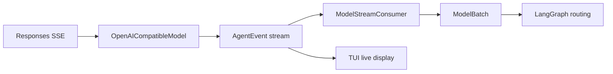
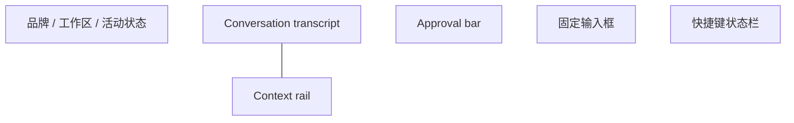

# 事件与 TUI

## 模块定位

Runtime、Session 和界面通过稳定事件解耦。Runtime 不调用 prompt_toolkit 控件，TUI 也不读取 Runtime 私有字段推断过程。

主要模块：

| 文件 | 职责 |
|---|---|
| `core/event/events.py` | `AgentEvent` 统一事件模型 |
| `core/agent/model_stream.py` | Provider 事件归一化为模型批次 |
| `view/cli.py` | 输入路由、Slash 命令、后台执行和审批 |
| `view/commands.py` | Slash 命令解析 |
| `view/terminal.py` | prompt_toolkit Application、线程安全更新队列和输入状态 |
| `view/tui_render.py` | 纯事件展示与 context rail 生成 |
| `view/tui_theme.py` | 颜色、语义样式和 transcript lexer |
| `view/render.py` | 非 TTY 文本渲染与兼容事件渲染 |
| `view/resume.py` | Session 列表与恢复后的简洁状态摘要 |

## 事件模型

`AgentEvent` 的公共字段包括：

- 身份：`event_id`、`session_id`、`turn_id`。
- 时间：UTC ISO `timestamp`。
- 阶段：`main`、`plan`、`reflect`、`compact`、`subagent`。
- Item：`item_id`、`item_type`、`call_id`。
- 内容：`delta`、`payload`、`content`。
- 工具：`tool_name`、`arguments`、`result`。
- 资源：`usage`、`progress`。
- 控制：`finish_reason`、`options`。

兼容字段保留旧 adapter 和历史 session 的读取能力。新代码优先使用 `type + stage + item_type + payload`。

## 生命周期事件

```text
turn.started
item.started
item.delta
item.completed
response.completed / response.failed
approval.requested / approval.resolved
steering.queued / steering.applied
steering.stop_requested / steering.stopped
context.compaction.started / context.compaction.completed
turn.completed / turn.failed
```

采用 turn/item/call 结构的原因是它能同时表达文本、推理、工具和阶段结果，而不需要为每个 Provider 发明一套事件。TUI 和 Session 面向内部协议，不直接依赖 OpenAI SSE 字段。

## 流式归一化



`ModelStreamConsumer` 同时完成两件事：

- 将每个规范化事件立即 emit 给 UI。
- 聚合出 Runtime 可确定消费的 `ModelBatch`。

聚合规则：

- message delta 按顺序拼接。
- reasoning delta 只用于展示，不混入最终回答。
- tool call 按 `call_id` 聚合名称和分片参数。
- completed tool call 可补齐最终 arguments。
- `response.completed` 汇总 usage。
- `response.failed` 转成 batch error。

Runtime 因此不用理解 SSE，也不依赖 Provider 是否将参数拆成多个 chunk。

## Delta 与 Completed 去重

Provider 可能同时发送文本 delta 和最终 completed message。Adapter/Consumer 优先使用已拼接 delta；completed 内容只在没有 delta 时补齐。事件 payload 标记 streamed 内容，Renderer 避免再次输出整段文本。

这是 UI 正确性的关键不变量：实时显示和最终持久化都需要，但不能在 transcript 中重复两次。

## CLI 输入路由

`InnoAgentCLI` 支持两种运行方式：

- TTY：启动全屏 `TerminalIO`。
- 非 TTY、测试或脚本：使用普通 input/output 循环。

TUI 输入由 `_dispatch_tui_input()` 按状态路由：

1. Runtime busy：普通文本和 `/steer` 进入 steering；`/stop` 请求安全停止。
2. Pending approval：输入解析为 allow once、always 或 deny。
3. 空闲 Slash 命令：进入控制命令处理。
4. 空闲普通文本：启动新 turn。

运行中不允许执行任意 Slash 配置命令，因为它们可能与正在使用的模型、Session 或状态竞争。只有 steering 和 stop 属于 live input。

## Slash 命令职责

| 命令 | 控制对象 |
|---|---|
| `/goal` | 设置或清除当前 Goal |
| `/plan`、`/tasks` | 查看当前计划和任务 |
| `/tools` | 查看动态工具描述 |
| `/skills`、`/skill` | 发现和激活 Skill |
| `/status`、`/context` | 查看运行状态与上下文预算 |
| `/permissions` | 查看仓库持久规则 |
| `/compact` | 手动压缩当前 Session |
| `/approve` | 非 TUI 场景解决 pending approval |
| `/steer`、`/stop` | 运行中纠偏与停止 |
| `/mode` | 切换 ask、auto、readonly |
| `/model` | 更新模型和 reasoning effort |
| `/resume`、`/sessions`、`/rename` | Session 管理 |
| `/new`、`/clear`、`/quit` | 生命周期与界面控制 |

Slash 命令是控制输入，不追加为普通用户消息。否则模型会把“切换模式”误解为业务任务，Session 重放也无法区分控制行为。

`view/resume.py` 将恢复选择与 CLI 主类分开：`pick_session()` 优先按 session id 加载，失败后再按名称匹配；未指定目标时选择最近会话。`resume_summary()` 只展示名称、Goal 和 Plan 状态，不复制历史正文。这样恢复入口保持确定性，也避免会话列表和启动提示意外泄露大量上下文。

## TUI 结构



`TerminalIO` 使用单个常驻 `prompt_toolkit.Application`，而不是每轮重新创建 prompt。这样可以保持滚动位置、补全、输入焦点和全屏布局稳定。

### Conversation

展示用户消息、Agent 文本、reasoning、工具调用、工具结果、Plan、Reflection、压缩和 steering。工具输出通过 `compact_body()` 限制行数和字符数，防止单次命令淹没界面。

### Context rail

读取稳定 state snapshot，展示：

- session id、model、mode。
- 累计 token。
- context 使用量和进度条。
- 当前 goal。
- 最多 8 个 task 及状态。

窄终端隐藏侧栏，优先保证 transcript 和输入区可用。

### Approval bar

Pending approval 时独立展示工具和摘要，并提示三个固定选择。审批 UI 不自行执行工具，只把决策传回 Runtime。

## 线程模型

模型和工具可能阻塞，不能运行在 prompt_toolkit 渲染线程。CLI 将 Runtime 工作放到后台，`TerminalIO` 只接收线程安全 `SimpleQueue` 更新。

`before_render` 批量消费队列并更新 Buffer，保证：

- 后台线程不直接操作 UI 控件。
- 多个 delta 可以在一个 render cycle 合并。
- 输入框在流式输出时仍可响应。
- 审批和 steering 状态切换集中完成。

## 语义化展示

`present_event()` 是纯函数，将事件转成 `EventPresentation`：

- `activity`：Header 当前活动。
- `stream`：追加到当前流式块。
- `block`：添加一个带 tone、title、body 的稳定块。

Theme 使用低饱和深色背景、琥珀强调、绿色成功、蓝色工具和红色错误。样式键表达语义而不是具体控件，使未来更换终端库时仍能复用展示模型。

## 非 TTY 回退

CI、管道和不支持全屏的环境使用 `view/render.py` 输出纯文本。它消费同一事件协议，忽略 delta 或内部 checkpoint，并保留工具、审批、Plan、Reflection 和压缩摘要。

回退模式不是次要功能，它保证：

- 自动化测试不依赖真实终端。
- 日志可重定向到文件。
- 无鼠标和低能力终端仍可使用。

## 敏感信息与展示上限

- 工具参数只显示有界摘要。
- 大输出在 Tool Registry 和 TUI 两层裁剪。
- API Key 不进入事件。
- reasoning 只做临时显示，不写入 Session。
- Renderer 不应从 raw exception 打印环境凭据。

## 扩展约束

- 新用户可见行为先定义 AgentEvent，再实现 TUI 和文本 Renderer。
- `item.delta` 只用于实时显示，不承担恢复语义。
- 新 Slash 命令明确它是控制输入还是模型消息。
- 后台任务只能写队列，不能直接改 Buffer。
- 审批、stop 和 steering 必须由 Runtime 确认，UI 不能乐观假设已生效。
- 新增侧栏字段只能读取稳定快照，避免依赖并发中的可变对象。

## 关键测试

- `test/test_streaming_model.py`：delta、tool call 分片和 usage 聚合。
- `test/test_cli.py`：Slash、TUI 输入模式、审批、steering 和事件渲染。
- `test/test_advanced_runtime.py`：运行中输入与安全停止。
- `test/test_session.py`：持久事件与重放。
