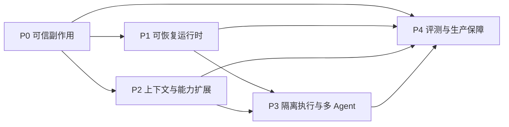

# 工程路线图

本文描述 InnoAgent 从当前原型演进为可信本地 Coding Agent 的工程顺序。路线图按风险和依赖排序，而不是按功能数量排序：先让副作用可审计、运行可恢复，再扩大上下文、工具和多 Agent 的自治范围。

路线图不是已实现能力清单。当前实现以其他模块文档和源码为准；本文件中的 P0-P4 均表示后续建设目标。

## 1. 当前基线

当前版本已经具备一条可运行的最小闭环：

- 主运行时由 LangGraph `StateGraph` 驱动，包含 `main_agent`、`tool_batch` 和 `reflection` 节点。
- Planning 使用独立子图生成结构化计划，Task 工具维护当前会话任务状态。
- 设置 Goal 后，主回答结束前进入 Reflection；未完成时可生成反馈并回到主 Agent。
- 文件、目录、搜索、Shell、Task、Plan、Skill 和 Subagent 工具已注册到统一 Tool Registry。
- 权限支持 `ask`、`auto`、`readonly`，审批支持允许一次、当前工作区持续允许和拒绝。
- 同一批只读工具可并行执行，写工具保持串行；Subagent 当前仍串行。
- Session 使用 JSONL 保存事件和快照；LangGraph 使用进程内 `InMemorySaver` 保存图检查点。
- 上下文支持粗略 token 估算、自动压缩、使用量事件和压缩比例事件。
- `prompt_toolkit` TUI 支持流式输出、工具状态、审批、Goal、任务列表、slash 命令和执行中纠偏。
- 测试覆盖核心单元和主要模块组合路径，但尚未形成固定任务集与生产级评测体系。

当前边界必须明确：

- Shell 在宿主机执行，不是沙箱。
- JSONL Session 与内存 checkpoint 尚不构成跨进程 Durable Execution。
- Memory 是轻量启发式存储，不具备并发写入、TTL、证据冲突和删除治理。
- Metrics 与 Trace 组件尚未默认接入主事件管线。
- Tool schema 当前全量注入，不支持按任务检索和渐进披露。
- 副作用工具没有统一 operation id 和 durable 幂等账本。

相关现状文档：

- [运行时与 LangGraph](./01-runtime-and-langgraph.md)
- [上下文与 Session](./02-context-and-session.md)
- [工具与权限](./03-tools-and-permissions.md)
- [Planning 与 Reflection](./04-planning-and-reflection.md)
- [Skill 与 Subagent](./05-skills-and-subagents.md)
- [事件与 TUI](./06-events-and-tui.md)
- [质量与安全](./07-quality-and-security.md)
- [模型、Prompt 与配置](./09-model-prompts-and-configuration.md)
- [Memory](./10-memory.md)
- [入口与兼容层](./11-entrypoints-and-compatibility.md)

## 2. 演进原则

### 2.1 先约束副作用，再扩大自治

模型推理错误通常可以重试，文件覆盖、命令执行和外部调用却可能不可逆。任何新增自治能力都必须建立在明确权限、幂等标识、执行记录和结果校验之上。否则并行、多 Agent 和自动重试只会放大副作用。

### 2.2 事件日志记录事实，checkpoint 记录执行位置

Session event 用于审计、重建界面和恢复用户可见状态；LangGraph checkpoint 用于恢复图节点和中间状态。两者职责不同，不能互相冒充。后续持久化设计必须给出一致性边界、提交顺序和损坏恢复策略。

### 2.3 确定性规则优先于 Prompt 约束

权限、路径限制、并发分组、超时、幂等和 schema 校验必须由代码强制执行。Prompt 只负责引导模型选择，不承担安全边界。模型说“已完成”也不能替代测试、文件校验或 Git diff 等确定性证据。

### 2.4 单 Agent 默认，多 Agent 按收益引入

子 Agent 会增加上下文隔离、预算分配、结果合并和失败恢复成本。只有任务可明确切分、并行收益可测且结果能验证时，才应使用多 Agent；否则保持单 Agent 和普通工具调用更可靠。

### 2.5 兼容迁移优先于一次性重写

事件、Session、Prompt、Tool schema 和配置都可能被用户历史数据依赖。升级时应采用版本字段、双读或适配器逐步迁移，并保留失败回滚路径，避免以“内部重构”为由破坏已有会话。

## 3. 依赖关系

依赖原因如下：

- P1 的重放和重试会重新触发工具，因此必须先完成 P0 的副作用识别与幂等保护。
- P2 会增加模型可见信息和可调用能力，因此必须继承 P0 的权限与数据边界。
- P3 会放大并发、隔离和结果合并问题，必须同时依赖 P1 的恢复能力与 P2 的上下文契约。
- P4 不是最后才开始做测试，而是最终形成完整发布门禁；各阶段都必须先提供自己的验收测试和指标。

## 4. P0：可信本地 Coding Agent

### 4.1 目标

让每一次本地副作用都满足四个条件：用户知道将发生什么、系统知道是否执行过、结果可以核对、失败后不会静默重复。

### 4.2 实施内容

#### 稳定 operation id

为写文件、Shell 和未来外部写操作生成稳定 `operation_id`。标识应由 session、turn、tool call id 和规范化参数共同决定，而不是随机生成。执行前写入 pending 记录，完成后记录结果摘要和副作用证据。

这样设计是为了区分“模型再次提出同一调用”和“运行时重放同一调用”。当前重复调用检测只解决单轮无进展问题，不能证明跨崩溃重试是否已经执行。

#### 写入预览与 patch

在现有整文件原子替换、预读元数据和 SHA-256 冲突检查上增加：

- unified diff 或结构化 patch 预览；
- 创建、修改、删除文件的明确分类；
- 大文件变更摘要和截断提示；
- 执行后 digest、文件大小和权限位校验。

优先保留整文件写作为简单可靠的底层原语，patch 作为上层输入形式。直接把复杂 patch 算法当唯一写入通道，会增加模糊匹配和部分应用风险。

#### Shell 生命周期

在现有超时、POSIX 进程组清理和结构化结果上增加：

- stdout/stderr 增量事件；
- 用户取消到子进程树的传播；
- Windows 与 POSIX 的进程树终止适配；
- 输出上限、截断位置和完整 artifact 引用；
- 命令、cwd、环境变量白名单和退出原因摘要。

实时输出不能只存在于 TUI。它必须先成为 Runtime 事件，才能被其他前端、日志和测试复用。

#### 确定性 verifier

为常见任务建立独立于模型自述的验证器：

- Git diff 是否符合预期范围；
- 指定测试或静态检查是否通过；
- 文件是否存在、摘要是否匹配；
- Task 是否仍有未完成项；
- ToolResult 是否包含被截断或未验证标记。

Reflection 可以消费 verifier 结果，但不能替代 verifier。这样可避免模型仅凭对话文本判断 Goal 完成。

#### schema 版本

为 AgentEvent、Session 快照、ToolResult 和审批记录增加显式版本。读取旧数据时通过迁移器转换为当前内存结构，写入时只写最新版本。

### 4.3 验收门槛

- 同一 `operation_id` 被重放时，不会重复执行已经成功的副作用。
- 写入审批前能展示目标、变更类型、范围和摘要。
- 用户取消 Shell 后，子进程不会继续后台运行。
- 进程在工具执行前、执行中、执行后崩溃时，恢复逻辑能区分未执行、未知和已完成。
- 旧版 Session fixture 可迁移，新版事件可被 TUI 和测试稳定解析。

### 4.4 非目标

- P0 不解决跨机器分布式事务。
- P0 不引入容器沙箱。
- P0 不承诺任意 Shell 命令天然可回滚，只要求风险可见、执行可审计、重复可识别。

### 4.5 主要风险

- 参数规范化不稳定会导致同一操作生成不同 id。
- “执行完成但记录未提交”的窗口无法只靠本地日志彻底消除，需要把状态标为 unknown 并要求核验，而不是盲目重试。
- diff 预览可能遗漏命令生成的间接文件，因此 Shell 仍需独立风险提示。

## 5. P1：可恢复运行时

### 5.1 目标

让 Agent 在进程退出、等待审批或外部中断后，可以从明确节点继续，而不是重新拼接聊天记录并猜测执行位置。

### 5.2 实施内容

#### 持久化 checkpointer

将 `InMemorySaver` 替换为可配置持久化后端。建议先支持 SQLite，保持本地 CLI 的零运维特征；只有出现多进程协调需求时再引入服务型存储。

checkpoint 至少保存：

- graph thread id、checkpoint id 和父 checkpoint；
- 当前节点和待执行下一跳；
- AgentState 的可序列化部分；
- 与 Session event offset 的关联；
- schema、Prompt、Tool 和模型配置版本。

#### checkpoint 与事件一致性

建议采用“事件先落盘，checkpoint 后提交”的顺序，并在 checkpoint 中记录最后确认的 event offset。恢复时：

1. 读取最后一个有效 checkpoint；
2. 校验对应 event offset；
3. 重放其后的纯状态事件；
4. 对 pending/unknown 副作用执行核验；
5. 从可恢复节点继续。

不尝试用分布式事务强行绑定两个存储。对本地 CLI，明确的提交协议与修复工具比复杂事务协调更实用。

#### durable interrupt

把审批、用户选择、定时器和未来外部回调建模为可持久化 interrupt。等待状态需要包含请求 id、输入 schema、过期时间和恢复节点，进程退出后仍能重新展示。

当前 TUI 的审批队列是进程内交互机制；它不能直接等同于 LangGraph durable interrupt。

#### 取消、deadline 与 retry budget

所有节点和工具都应接收统一 execution context，包括 cancel token、deadline、retry budget 和 trace context。重试策略按错误类型区分：

- 参数或策略错误不重试；
- 明确瞬时网络错误可退避重试；
- 副作用结果未知时先核验，不直接重试；
- 达到预算后生成可解释失败并结束当前路径。

#### Artifact 引用

大文件、完整命令输出、图片和长日志写入 artifact store，AgentState 与事件中只保存引用、摘要、MIME、大小和 digest。这样避免 checkpoint、Prompt 与事件日志无限膨胀。

### 5.3 验收门槛

- 在每个 LangGraph 节点前后强制终止进程，均可从最后一致状态恢复。
- 审批等待期间退出 CLI，重新进入后仍能看到同一请求并继续。
- Session 尾部损坏时能恢复到最后有效记录，并明确报告丢失范围。
- 重试次数、等待时间和最终错误类型可从事件中审计。
- 大输出不会被复制进多个 checkpoint。

### 5.4 迁移策略

- 首个版本保留 JSONL Session，新增 SQLite checkpoint，而不是同时替换两套机制。
- 为旧 Session 建立只读导入路径；无法迁移的数据保留原文件并输出诊断。
- 在稳定前提供内存与持久化 checkpointer 配置开关，便于测试和回滚。

## 6. P2：上下文与能力扩展

### 6.1 目标

让能力数量增长时，模型仍只看到与当前任务相关、来源可信且预算可控的信息。

### 6.2 实施内容

#### 精确 token 预算

按模型选择原生 tokenizer，并将预算拆分为 system、conversation、tool schema、skill、memory、artifact summary 和 output reserve。压缩触发条件基于各分区预算，而不是单一字符估算。

仍需保留估算器作为 tokenizer 不可用时的降级路径，但事件中必须标注 `estimated=true`，避免把近似值当精确计费。

#### Context Item 元数据

把上下文从拼接字符串逐步升级为结构化条目，每项至少包含：

- 来源与产生时间；
- 信任级别和是否来自用户；
- 可见范围与敏感级别；
- 原始 token、压缩 token 和摘要链；
- 是否允许进入子 Agent 或持久 Memory。

最终 Prompt 仍可以渲染为文本，但裁剪、去重、权限过滤和审计必须在结构化层完成。

#### 工具渐进披露

工具增多后，不再把所有 schema 全量注入每次请求。推荐两阶段：先向模型暴露稳定核心工具与工具检索器，再根据任务语义、当前模式和权限加载候选 schema。

候选选择必须是可解释、可覆盖的软路由。不能因为检索漏召回而让核心恢复、审批或文件读取能力不可用。

#### Memory 治理

在现有 project/user memory 基础上增加：

- 写入证据和来源引用；
- key 规范化、冲突检测与合并策略；
- TTL、最后验证时间和置信度；
- 用户更正、删除和导出；
- 并发锁与原子写；
- 注入预算和敏感信息过滤。

Memory 只保存跨会话稳定事实，不保存当前任务真值。Goal、Task、审批和执行位置仍属于 Session/Runtime 状态。

#### Skill 生命周期

为 Skill 增加 manifest、版本、来源、依赖、能力声明和最小测试。加载时区分可信内置 Skill、项目 Skill 和外部 Skill，并在 Prompt 中保留来源边界。

### 6.3 验收门槛

- 上下文事件能解释每一分区占用和压缩原因。
- 增加大量工具后，常见任务的 schema token 不随总工具数线性增长。
- Skill 或 Memory 中的恶意文本不能绕过 Tool Registry 权限。
- 用户删除 Memory 后，新会话不会再次注入该记录。
- 子 Agent 只能收到 delegation contract 允许的上下文条目。

### 6.4 主要风险

- 工具检索漏召回会表现为模型能力退化，需要固定召回评测。
- 多次摘要会造成事实漂移，必须保留摘要链和关键原文引用。
- Memory 自动抽取容易固化错误信息，因此默认应保守写入并支持用户可见治理。

## 7. P3：隔离执行与多 Agent

### 7.1 目标

在不扩大宿主机风险的前提下，支持长时、并行和专业化任务分解。

### 7.2 实施内容

#### 隔离执行

Shell 和代码执行迁移到受限环境，默认策略应为：

- 工作区按需挂载，系统目录只读；
- 默认禁网，按域名或目标临时授权；
- CPU、内存、进程数、磁盘和执行时间限额；
- 临时凭据按任务注入，结束后撤销；
- 产物通过 artifact contract 返回，而不是共享任意宿主路径。

本地开发可提供显式 host 模式，但必须在 TUI 中持续展示，不能静默降级。

#### Delegation Contract

每个子 Agent 调用都应明确：目标、输入上下文、允许工具、预算、deadline、预期 artifact、完成判据和禁止事项。主 Agent 不能只给一段模糊自然语言后接受任意结果。

#### 独立运行通道

当前 Subagent 共享模型流和事件通道，因此保持串行。要支持并行，必须先隔离：

- 模型 client 或并发安全 stream；
- 独立 event namespace 和 call id；
- 独立 token、时间和重试预算；
- 独立临时目录或变更分支；
- fan-in 阶段的冲突检测与 verifier。

#### 结果合并

子 Agent 默认交付结构化摘要和 artifact，不直接修改主状态。主 Agent 在 fan-in 时执行 schema 校验、测试、diff 冲突检测和来源标记，再决定采纳、重试或降级。

#### 协议边界

进程内专业化任务继续使用内部 Subagent 接口；工具互操作优先通过 MCP adapter；只有出现跨进程、跨组织 Agent 协作需求时再考虑 A2A。避免为了协议统一提前引入分布式复杂度。

### 7.3 验收门槛

- 隔离环境无法读取未授权宿主路径或使用未授权网络。
- 一个子 Agent 超时、崩溃或输出非法结构时，不会破坏其他分支。
- 并行分支修改同一文件时，系统能检测冲突而不是按完成顺序覆盖。
- 主 Agent 可解释每个子结果是否被采纳及其验证证据。
- 多 Agent 相比单 Agent 在固定任务集上有可测的成功率或延迟收益，否则默认关闭。

### 7.4 非目标

- 不构建通用自治组织或长期无人监督集群。
- 不默认允许子 Agent 继承主 Agent 的全部权限和 Memory。
- 不用消息总线替代清晰的本地函数与事件契约。

## 8. P4：评测、可观测性与发布保障

### 8.1 目标

把“感觉更聪明”转化为可重复比较的质量、成本、安全和恢复指标，并让版本升级具备发布门禁。

### 8.2 实施内容

#### 分层测试

- 单元测试验证 schema、策略、解析器和状态转移。
- 组合测试验证模型流、工具批次、审批、Session 和 TUI reducer。
- 故障注入测试覆盖超时、尾部损坏、重复事件、进程退出和恢复。
- 固定任务集覆盖文件修改、调试、规划、Goal Reflection 和用户纠偏。
- 多 trial 评测降低模型随机性对结论的影响。

#### Trace 与指标

以 AgentEvent 为统一观测入口，接入 OpenTelemetry/OpenInference 风格 span。Trace 至少关联 session、turn、graph node、model call、tool call、approval 和 operation id。

默认采集结构化元数据和摘要，不默认上传完整 Prompt、文件内容或命令输出。敏感字段需要脱敏、采样和本地关闭开关。

核心指标包括：

- verified task success；
- 首次成功率和平均修复轮次；
- P50/P95 延迟；
- input/output/cached token 与 cost per success；
- approval rate、denial rate 和 unsafe action；
- duplicate effect、unknown effect 和恢复成功率；
- 压缩后关键信息保留率；
- Subagent fan-out 收益与失败率。

#### 版本可追溯

每次运行记录模型、Prompt、Workflow、Tool schema、Policy、Skill、配置和运行环境版本。否则一次回归无法定位是模型变化、Prompt 变化还是工具行为变化。

#### 发布门禁

采用 `offline -> shadow -> canary -> rollout`：

1. Offline 在固定数据集上比较质量、安全、延迟和成本。
2. Shadow 只观察候选决策，不执行候选副作用。
3. Canary 对小范围真实任务启用，并保留快速关闭开关。
4. Rollout 达到门槛后逐步扩大，同时持续检查长尾指标。

### 8.3 验收门槛

- 任一失败任务可由 session、trace、版本信息和 artifact 定位到具体阶段。
- Prompt、模型或工具升级必须通过固定回归集。
- 关键安全指标恶化时自动阻止发布，而不是仅生成报告。
- Telemetry 关闭后不影响 Runtime 正确性。
- 指标计算能区分模型声称完成与 verifier 确认完成。

## 9. 跨阶段不变量

以下约束在任何阶段都不能被功能扩展破坏：

- 所有工具调用必须经过 Tool Registry，不允许节点直接绕过权限执行副作用。
- 所有用户可见状态变化必须有 AgentEvent，TUI 不自行推断运行时事实。
- ToolResult 保持结构化，错误、截断、审批和取消不能只编码在自然语言中。
- Goal、Plan、Task、Reflection 各有单一状态来源，标题文本不应长期充当稳定标识。
- Prompt 集中管理并可版本化；工具 Prompt 与实现共址，但通过文件级常量集中声明。
- 子 Agent 权限不高于父级授权，且默认最小化传递上下文。
- 任何自动重试都有预算，任何等待都有取消路径，任何副作用未知状态都先核验。
- 测试不依赖真实付费模型即可覆盖主要控制流；真实模型评测作为独立层运行。

## 10. 推荐实施切片

每个切片都应能独立合并、测试和回滚，避免长周期大重写。

| 顺序 | 切片 | 前置依赖 | 可独立验收的输出 |
| --- | --- | --- | --- |
| 1 | 事件与 Session schema 版本 | 无 | 旧 fixture 迁移与新事件 round-trip |
| 2 | operation id 与副作用账本 | schema 版本 | 重放不会重复写入或执行 |
| 3 | 写入 diff、Shell 增量输出与取消 | operation id | 审批预览和进程树测试 |
| 4 | SQLite checkpointer | Session offset 契约 | 节点级崩溃恢复测试 |
| 5 | durable approval interrupt | 持久 checkpoint | 退出后恢复审批 |
| 6 | Artifact store | schema 与 checkpoint | 大输出不进入图状态 |
| 7 | 结构化 Context Item 与 tokenizer | Artifact 引用 | 分区预算和来源过滤 |
| 8 | Tool/Skill 渐进披露 | Context Item | 固定召回集通过 |
| 9 | Memory 治理 | Context Item、原子持久化 | 更正、删除、冲突和 TTL 测试 |
| 10 | 隔离执行 | operation id、artifact | 路径、网络和资源限制测试 |
| 11 | 并行 Subagent | 隔离执行、独立事件通道 | 冲突检测和 fan-in 测试 |
| 12 | 完整 trace 与发布门禁 | 稳定 schema/版本 | 回归比较和自动阻断 |

## 11. 明确不做

- 不为展示复杂度而引入多 Agent、消息总线、微服务或分布式数据库。
- 不把聊天历史、向量库、Memory 或模型自述当作任务真值。
- 不依赖 Prompt 实现权限、幂等、路径隔离和数据脱敏。
- 不在缺少 trace、oracle、固定任务集和回归门槛时直接进入训练优化。
- 不为了兼容所有 Provider 而降低内部事件和 ToolResult 的结构化程度。
- 不把“可恢复”简化为重新发送完整聊天记录，也不把 `InMemorySaver` 描述为持久恢复。

## 12. 完成定义

路线图某一阶段只有同时满足以下条件才算完成：

- 行为契约已写入对应 knowledge 文档。
- 核心路径有单元测试，模块交界有组合测试。
- 失败、取消、拒绝、重试和恢复路径均有明确结果。
- 用户可在 TUI 中理解当前状态、风险和下一步。
- 事件、Session 和 trace 能解释发生过什么。
- 新能力没有绕过既有权限和上下文边界。
- 迁移与回滚路径已验证，而不只是记录在设计稿中。
