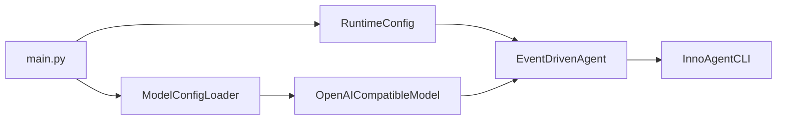

# 入口、配置装配与兼容层

## 模块定位

入口层负责把模型配置、Runtime 和 CLI 连接起来，但不承载业务逻辑。保持入口薄，可以让同一 Runtime 被 CLI、测试、未来服务端或其他 UI 复用。

主要文件：

| 文件 | 职责 |
|---|---|
| `main.py` | 默认 CLI 启动与依赖装配 |
| `core/runtime/agent.py` | 旧名称 `InnoAgentRuntime` 的兼容导出 |
| `core/runtime/events.py` | 旧式字典事件构造辅助函数 |
| `core/compat.py` | 第三方依赖警告隔离 |
| `core/*/__init__.py` | 稳定导入边界 |

## 启动流程

`main()` 保持明确的四步装配：

1. 创建 `RuntimeConfig`，默认 workspace 为当前目录、模式为 ask。
2. 使用 `ModelConfigLoader` 解析模型凭据和端点。
3. 创建 `OpenAICompatibleModel` 和 `EventDrivenAgent`。
4. 创建 `InnoAgentCLI` 并进入 REPL/TUI。



入口不注册业务回调、不执行工具、不读取 Session 内部文件。所有行为都通过公开 Runtime API 完成。

## 为什么使用组合根

对象创建集中在入口和 `EventDrivenAgent.__init__`，有三点收益：

- 测试可以注入 FakeModel、临时目录和自定义 Registry。
- CLI 不需要知道 ProfileStore、StageRunner 等内部组件。
- 未来增加 Web/API 入口时可以复用 Runtime，而不是复制 Agent 逻辑。

如果某个模块在 import 时创建全局网络客户端或启动线程，会破坏这一边界，应避免。

## RuntimeConfig

`RuntimeConfig` 聚合运行策略：

- workspace 与 allowed roots。
- ask/auto/readonly 模式。
- iteration 与 reflection 上限。
- context、压缩保留和输出预算。
- 并行工具数量。
- profile/session 路径。
- Memory 开关和阈值。

配置使用 dataclass，适合当前本地应用和测试覆盖。若未来来源增多，应增加显式校验和版本，而不是在各模块散落环境变量读取。

## 兼容 Runtime 名称

`core/runtime/agent.py` 中 `InnoAgentRuntime` 继承 `EventDrivenAgent`，不增加行为。它保留旧 import 路径，使 UI 和外部调用方能逐步迁移。

兼容类必须保持薄。如果在兼容层加入新逻辑，会出现两个 Runtime 行为来源，最终无法判断哪条路径是标准实现。

## 兼容事件辅助

`core/runtime/events.py.make_event()` 生成带 UTC timestamp 的普通字典，服务旧调用和简单集成。主链路使用 Pydantic `AgentEvent`。

保留该函数是为了读取和输出旧事件格式，不代表应继续扩展字典协议。新增事件字段应先加入 `AgentEvent`。

## LangGraph 兼容处理

`core/compat.py` 只屏蔽已知 `LangChainPendingDeprecationWarning`。集中处理第三方噪音的原因是：

- 不在业务文件重复 filter。
- 测试输出保持干净。
- 升级依赖时只需检查一个位置。

不能宽泛屏蔽所有 warning。Deprecation、ResourceWarning 或 RuntimeWarning 可能代表真实兼容问题，应保留可见。

## 包导入边界

各目录 `__init__.py` 应只导出稳定公共类型，避免导入时产生副作用。推荐依赖方向：

```text
view -> runtime/agent -> agent -> domain modules
agent -> llm/session/tool/planning/reflection/memory/event
tool -> base/guardrails/domain services
domain modules -X-> view
```

核心模块不得反向依赖 TUI。否则非 TTY、测试和未来服务端都会被迫加载 prompt_toolkit。

## 新入口的实现方式

增加 HTTP 服务、IDE 插件或批处理入口时，应：

1. 构造独立 RuntimeConfig。
2. 注入模型客户端和事件 sink。
3. 调用 `invoke()`、`resolve_approval()`、`submit_steering()` 等公开 API。
4. 将 AgentEvent 转成目标协议。
5. 不直接调用 `_graph_*` 或修改 `_run_events` 等私有状态。

公开 API 是生命周期边界，私有节点是实现细节。

## 退出与资源管理

当前 HTTP 客户端在每次请求的 context manager 中关闭，TUI Application 由 CLI 管理。Memory daemon thread 不等待退出，Session 使用短生命周期文件句柄。

未来若引入连接池、持久数据库或远程 worker，应给 Runtime 增加显式 `close()`/context manager，并由入口统一释放资源。

## 版本与发布边界

当前项目尚未定义：

- Runtime 公共 API 版本。
- Session schema version。
- AgentEvent protocol version。
- Skill format version。
- 配置迁移规则。

在提供插件或服务端集成前，应先稳定这些边界。否则兼容类和旧事件解析会持续累积条件分支。

## 扩展约束

- `main.py` 只做配置与对象装配。
- 公共 Runtime 行为只实现一次。
- 兼容层不得绕过新权限和事件链路。
- 第三方 warning 必须精确过滤。
- 新入口必须同时支持结构化事件和审批暂停。
- 引入长生命周期资源时提供显式关闭机制。

## 关键测试

- `test/test_model_config.py`：入口所需配置优先级。
- `test/test_cli.py`：TTY 和非 TTY 启动路径。
- `test/test_advanced_runtime.py`：Runtime 公共 API。
- 后续应增加 import compatibility 和资源关闭测试。
