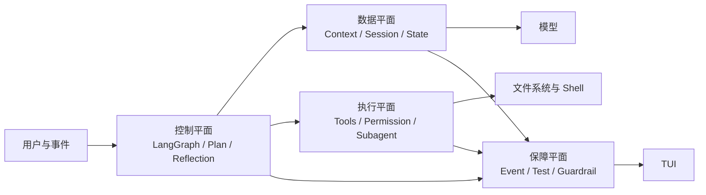

# InnoAgent Agent 工程知识库

本目录将“Agent 技术路线图”中与 InnoAgent 直接相关的内容，压缩为面向实现的工程知识。它不重复罗列论文、框架和面试题，而是回答四个问题：为什么这样设计、代码如何实现、边界在哪里、下一步补什么。

## 全景



Agent 不是“更长的 Prompt”，而是围绕目标运行的受控闭环：

```text
感知 -> 决策 -> 行动 -> 观察 -> 更新状态 -> 验证 -> 继续或终止
```

InnoAgent 当前定位在 **L3 Workflow Agent**：具备状态图、审批、会话恢复和目标反思，并已具备部分 L4 能力，如事件日志、执行中纠偏和安全边界停止；尚未实现跨进程 Durable Workflow、强沙箱和完整可观测平台。

## 阅读顺序

1. [运行时与 LangGraph](01-runtime-and-langgraph.md)：主循环、状态图、终止与纠偏。
2. [上下文与会话](02-context-and-session.md)：Context、State、Memory、压缩与恢复。
3. [工具与权限](03-tools-and-permissions.md)：可信执行边界、并行、审批与安全。
4. [规划与反思](04-planning-and-reflection.md)：Plan、Task、Goal 验证与反馈闭环。
5. [Skills 与 Subagent](05-skills-and-subagents.md)：渐进披露、委派和隔离。
6. [事件与 TUI](06-events-and-tui.md)：事件协议、流式展示和并发 UI。
7. [质量与安全](07-quality-and-security.md)：测试、评测、可观测性和治理。
8. [工程路线图](08-engineering-roadmap.md)：从当前实现走向生产级 Agent。

## 统一原则

- 单 Agent + 明确工作流是默认基线，多 Agent 必须证明隔离或并行收益。
- 模型只提出动作；代码负责权限、参数校验、调度、状态转换和终止。
- Context 是一次调用的编译结果，State 是执行真值，Memory 是跨任务信息，三者不能混用。
- Tool Call 成功不等于目标完成；Goal 必须由证据和验收条件验证。
- 副作用默认串行并受审批约束，只读且无共享写入的工具才允许并行。
- 所有用户可见行为通过稳定事件表达，界面不依赖运行时内部变量。
- 先保证可恢复、可审计、可停止，再提高自治程度。
