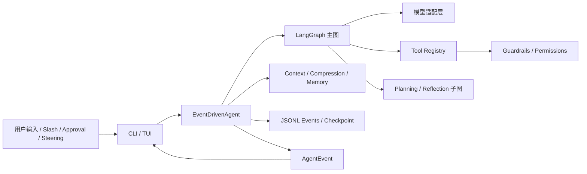

# InnoAgent Agent 工程知识库

本目录是 InnoAgent 的设计说明书。内容以当前代码为准，重点回答四类问题：模块如何实现、为什么这样实现、有哪些边界与风险、扩展时必须保持哪些不变量。

它不是功能宣传，也不把计划中的能力写成已完成能力。阅读文档时应区分：

- **当前实现**：代码中已经存在并有测试覆盖的行为。
- **设计约束**：新增实现必须遵守的边界。
- **演进方向**：仍需补齐的生产能力。

## 系统定位

InnoAgent 是基于 LangGraph 的本地 coding agent。核心不是“让模型连续调用工具”，而是用确定性代码包住概率性模型：模型提出下一步，运行时负责状态、权限、执行、事件、恢复和终止。



一次完整执行遵循以下闭环：

```text
读取状态 -> 编译上下文 -> 模型决策 -> 参数与权限检查 -> 执行动作
-> 记录结果 -> 应用用户纠偏 -> 验证目标 -> 持久化 -> 结束或继续
```

## 模块覆盖地图

| 源码模块 | 主要职责 | 设计文档 |
|---|---|---|
| `core/agent` | 主图、模型事件消费、Planning/Reflection stage、Subagent | [运行时与 LangGraph](01-runtime-and-langgraph.md)、[规划与反思](04-planning-and-reflection.md)、[Skills 与 Subagent](05-skills-and-subagents.md) |
| `core/runtime` | 状态、运行配置、模型配置、兼容 facade | [运行时与 LangGraph](01-runtime-and-langgraph.md)、[模型、提示词与配置](09-model-prompts-and-configuration.md)、[入口与兼容层](11-entrypoints-and-compatibility.md) |
| `core/session` | History、Context、压缩、JSONL session | [上下文与会话](02-context-and-session.md) |
| `core/tool` | 工具契约、注册、搜索、并行调度、内置工具 | [工具与权限](03-tools-and-permissions.md) |
| `core/guardrails`、`core/config` | 路径、模式、审批与持久权限规则 | [工具与权限](03-tools-and-permissions.md) |
| `core/planning`、`core/reflection` | Plan/Task schema、校验、目标证据判断 | [规划与反思](04-planning-and-reflection.md) |
| `core/skill` | Skill 发现、元数据索引、渐进加载 | [Skills 与 Subagent](05-skills-and-subagents.md) |
| `core/event` | 稳定运行时事件对象 | [事件与 TUI](06-events-and-tui.md) |
| `core/llm`、`core/prompts.py` | 模型抽象、Responses SSE、系统阶段提示词 | [模型、提示词与配置](09-model-prompts-and-configuration.md) |
| `core/memory` | Profile、Recall、阈值和异步更新 | [Memory](10-memory.md) |
| `view` | Slash 命令、CLI、内联 TUI、语义化渲染 | [事件与 TUI](06-events-and-tui.md) |
| `observe`、`test` | 指标、Trace、组件与组合测试 | [质量、安全与可观测性](07-quality-and-security.md) |
| `main.py`、`core/compat.py` | 启动装配、兼容导出和依赖噪音隔离 | [入口与兼容层](11-entrypoints-and-compatibility.md) |

## 分层职责

### 控制平面

`core/agent` 与 LangGraph 决定当前应该调用模型、执行工具、进入 Reflection 还是结束。控制平面只编排，不绕过 Tool Registry 直接产生副作用。

### 数据平面

`AgentState`、Context、Session、Memory 和 ToolResult 保存运行所需信息。State 是当前执行真值；Context 是从 State 编译出的模型视图；Session 是可恢复记录；Memory 是跨任务的低频用户信息。

### 执行平面

`core/tool`、`core/guardrails` 和 `PermissionStore` 执行文件、Shell、计划、Task、Skill 与 Subagent 调用。模型没有直接文件系统或进程权限。

### 交互平面

`view` 只消费事件与稳定状态快照。TUI 不读取 Agent 私有变量推断行为，也不在后台线程直接修改 prompt_toolkit 控件。

### 保障平面

测试、事件日志、权限、终止条件和恢复共同构成当前保障平面。Metrics 与 Trace 已有基础组件，但尚未默认接入 Runtime 事件管线；Prompt 是行为引导，不是安全边界。

## 核心不变量

- 主 Agent 的控制循环只存在于 LangGraph，不再维护第二套隐藏 ReAct while-loop。
- 模型只能提出工具意图；参数校验、权限、并发、执行和错误归一化由代码完成。
- `AgentState` 是运行状态真值，Context 只是一次模型调用的有预算投影。
- 工具返回成功只证明调用完成，不证明用户目标完成；Goal 必须经过 Reflection 和证据检查。
- 只读且无共享写入的工具才允许并行，写操作、Shell 和共享模型通道保持串行。
- 审批、纠偏、压缩和结束必须产生稳定事件，不能只存在于 UI 文本中。
- 用户纠偏默认在当前工具批次结束后应用，不强杀可能已经产生副作用的操作。
- Session checkpoint 用于加速恢复，稳定事件用于审计和降级重建，两者不能互相替代。
- Skill、文件、网页、工具输出和 Subagent 结果均是不可信内容，不能覆盖系统策略。
- 先保证可停止、可解释、可恢复和可验证，再增加自治、多 Agent 或远程执行。

## 推荐阅读顺序

1. [运行时与 LangGraph](01-runtime-and-langgraph.md)
2. [模型、提示词与配置](09-model-prompts-and-configuration.md)
3. [上下文与会话](02-context-and-session.md)
4. [工具与权限](03-tools-and-permissions.md)
5. [规划与反思](04-planning-and-reflection.md)
6. [Skills 与 Subagent](05-skills-and-subagents.md)
7. [Memory](10-memory.md)
8. [事件与 TUI](06-events-and-tui.md)
9. [质量、安全与可观测性](07-quality-and-security.md)
10. [入口与兼容层](11-entrypoints-and-compatibility.md)
11. [工程路线图](08-engineering-roadmap.md)

## 文档维护规则

- 修改状态字段、事件名、工具 schema 或权限行为时，同步更新对应文档。
- 文档中的 Mermaid 图只表达真实控制流，不加入尚未实现的节点。
- “未来应实现”的内容统一放在限制或路线图中，不混入当前流程。
- 代码引用以模块、类和方法名为主，避免依赖易变化的行号。
- 新增一级源码模块时，必须在本页模块覆盖地图中登记。
