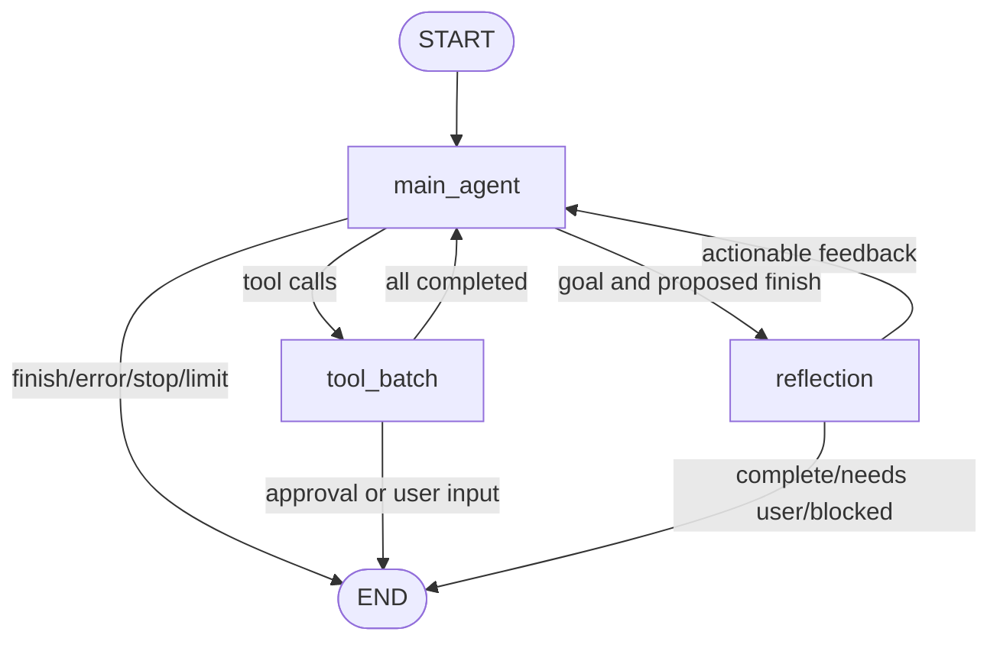

# InnoAgent 顶层设计

本文档是 InnoAgent 的架构契约，不是功能愿望清单。文档中的“当前设计”必须与代码一致；尚未实现的能力统一放入“后续路线”，避免把目标状态误写成现状。

项目以 LangGraph 为编排核心，产品交互和工程边界参考 OpenAI Codex CLI，同时吸收 Claude Code、pi 与 OpenCode 的可取实践。参考重点不是复制目录结构，而是保持以下不变量：协议先于界面、授权先于执行、工具结果可恢复、控制输入不污染模型消息、策略不能只依赖提示词。

参考资料：

- [OpenAI Codex](https://github.com/openai/codex)
- [Codex tool registry](https://github.com/openai/codex/blob/main/codex-rs/core/src/tools/registry.rs)
- [Codex approvals and sandboxing](https://github.com/openai/codex/blob/main/codex-rs/core/src/tools/sandboxing.rs)
- [Codex approval overlay](https://github.com/openai/codex/blob/main/codex-rs/tui/src/bottom_pane/approval_overlay.rs)
- [LangGraph Graph API](https://docs.langchain.com/oss/python/langgraph/graph-api)
- [LangGraph Interrupts](https://docs.langchain.com/oss/python/langgraph/interrupts)
- [LangGraph Persistence](https://docs.langchain.com/oss/python/langgraph/persistence)

## 1. 目标与边界

### 1.1 目标

1. 用 LangGraph 表达主 Agent、工具批次和 Reflection 的状态迁移，不在图外维护第二套 ReAct 循环。
2. 用结构化协议连接模型、工具、审批、事件、Session 和 TUI，避免跨层传递含义不明确的字符串或临时字典。
3. 在任何副作用发生前完成参数校验、路径边界检查和权限决策。
4. 支持多工具调用、只读工具并行、写工具串行、审批暂停和恢复。
5. 支持执行中纠偏；默认在当前工具批次完成后注入，避免产生半完成副作用。
6. 提供保留终端原生 scrollback 的内联 TUI，并支持 Slash 命令、选择器、状态栏、Goal、Task、Plan、Reflection、token 和 context 展示。
7. 每个核心模块具备单元测试，跨模块状态迁移具备组合测试。

### 1.2 当前非目标

- 当前没有提供 Codex 同等级的操作系统级 sandbox。现阶段安全边界是工作区路径限制、只读模式、审批策略和受控工具实现；文档和 UI 不得把它描述成完整系统沙箱。
- 当前 LangGraph checkpointer 使用进程内存；跨进程恢复依靠 JSONL Session 事件与 checkpoint。durable interrupt 是后续路线。
- 当前 TUI 是内联 PromptSession，不是 alternate-screen 全屏双栏应用。这样优先保证原生滚动、复制、搜索和稳定输入。
- Memory 仍是可选增强，不参与审批、任务、Goal 或执行位置等会话真值。

## 2. 架构原则

### 2.1 分层

```text
View
  CLI / TUI / plain renderer
        ↓ commands and decisions
Application
  EventDrivenAgent / runtime facade / session lifecycle
        ↓ graph state transitions
Orchestration
  LangGraph main graph / planning graph / reflection graph
        ↓ typed invocations
Domain protocols
  ToolCall / ToolSpec / ToolAuthorization / ApprovalRequest / ToolResult / AgentEvent
        ↓ adapters
Infrastructure
  OpenAI-compatible model / filesystem / subprocess / JSONL / permission store
```

依赖只能向下：工具实现不知道 TUI，TUI 不读取工具私有状态，模型 adapter 不决定权限，提示词不绕过 Runtime 策略。

### 2.2 Codex 对照后的关键取舍

| Codex 实践 | InnoAgent 采用方式 |
|---|---|
| Tool spec 与 runtime handler 分离 | `BaseTool.spec()` 暴露模型契约与执行能力，`ToolRegistry` 管理授权和执行 |
| Approval 不是 ToolResult | 授权阶段产生 `ToolAuthorization`，需要用户时构造 `ApprovalRequest` 并暂停图 |
| Approval 使用稳定决策枚举 | 只接受 `allow_once`、`allow_always`、`deny`，无效值不得默认放行 |
| Session approval 与持久规则分开 | `allow_once` 仅作用于当前 pending call；`allow_always` 写入工作区权限文件 |
| TUI approval 复用通用列表 | 三项单列选择器，方向键移动，Enter 确认，不伪造用户消息 |
| Tool lifecycle 可观察 | tool call、授权请求、执行结果和恢复均产生结构化事件 |
| 安全策略独立于模型 | path、readonly、permission、read-before-write 由代码强制执行 |

## 3. 代码模块

```text
core/
├── agent/
│   ├── graph.py               # 主 StateGraph 与 Command 路由
│   ├── react.py               # 节点实现、运行生命周期和状态持久化
│   ├── model_stream.py        # Provider 流事件归一化
│   ├── stages.py              # Planning / Reflection 子图入口
│   └── subagent.py            # 隔离的只读子 Agent
├── config/
│   └── permissions.py         # 工作区持久权限规则与匹配
├── event/events.py            # 稳定 AgentEvent 协议
├── guardrails/                # 路径、只读、Plan、审批前置策略
├── llm/                       # 模型协议与 Responses adapter
├── planning/                  # Plan schema、生成和 Task 映射
├── reflection/                # Reflection schema、评估和 feedback
├── runtime/                   # 公共 facade、配置和 AgentState
├── session/                   # Context、压缩、历史和 JSONL store
├── skill/                     # Skill 渐进式发现与加载
├── tool/
│   ├── approval.py            # ApprovalRequest、选项和决策协议
│   ├── base.py                # ToolCall、ToolSpec、ToolAuthorization、ToolResult
│   ├── registry.py            # 注册、授权、并发调度、执行和输出限制
│   └── *_tool.py              # 工具实现及集中在文件顶部的工具提示词
└── prompts.py                 # system / planning / reflection / compression 提示词
view/
├── cli.py                     # 输入路由、Slash 命令和 pending interaction
├── terminal.py                # 内联 PromptSession 与通用选择器
├── tui_render.py              # AgentEvent 到 TUI presentation
├── render.py                  # 非 TTY 文本渲染
└── commands.py                # 命令注册、解析和补全元数据
```

`core/runtime/agent.py` 只提供稳定入口和兼容导出。业务执行逻辑只能有一份。

## 4. 主 Agent 状态图



### 4.1 `main_agent`

1. 检查 stop、iteration 和 context budget。
2. 构建 system、Skill、Plan、Task、summary 和最近消息上下文。
3. 调用模型并归一化流式事件。
4. 累加 usage，保存 assistant 文本和结构化 ToolCall。
5. 有工具调用时进入 `tool_batch`。
6. 无工具调用且存在 Goal 时进入 Reflection，否则结束。
7. 若存在 immediate steering，在进入工具节点前的图边界应用。

### 4.2 `tool_batch`

工具批次必须分为两个阶段：

```text
ToolCall
  -> schema validation
  -> authorization / guardrails
  -> allowed | needs_confirmation | blocked
  -> execution for allowed calls
  -> post guardrails
  -> ToolResult
```

- `needs_confirmation` 是授权状态，不是工具执行结果，不能向模型伪造一条 tool output。
- 只有相邻的一组 `parallel_safe` 只读调用可以并行；写调用、shell、控制工具和审批点都是顺序屏障。
- 返回顺序始终与模型 ToolCall 顺序一致。
- blocked 和 error 必须形成真实 ToolResult，让模型知道该调用没有执行。
- 一个批次包含待审批调用时，只执行它之前的调用；该调用保存为 ApprovalRequest，后续调用作为 deferred tail 持久化，批准或拒绝后再按原顺序继续。
- 工具结果完成后才应用默认 `after_tool` steering。

### 4.3 `reflection`

Reflection 只评估目标，不直接执行工具。输出必须是结构化结果：

```json
{
  "complete": false,
  "confidence": 0.8,
  "summary": "",
  "feedback": "",
  "needs_user": false,
  "blocked": false,
  "missing_conditions": [],
  "evidence": []
}
```

- 可继续修复：将 feedback 写回主 Agent。
- 缺少用户信息：生成结构化问题并结束当前运行。
- 环境不可达：标记 blocked 并明确说明。
- 完成：设置 `goal_complete`，不再发起无意义模型调用。

### 4.4 Goal 命令与生命周期

- `/goal <text>` 不是单纯的配置命令：CLI 先设置 `current_goal`，再以 `<text>` 作为 `user_input` 立即启动可纠偏的 Agent turn。
- Goal 同时写入 `AgentState.goal` 和模型 Runtime context，确保后续工具轮次、审批恢复与 Reflection 都能看到目标。
- `/goal` 只显示当前 Goal；`/goal off|clear|none` 只清除 Goal，不触发模型。
- 每次显式执行 `/goal <text>` 都视为新的目标运行。Runtime 保留会话消息和累计 usage，但清空旧 Goal 的 Plan、Task、Reflection、工具结果、错误和临时授权，避免旧证据误导新目标。
- `turn.started.goal_restarted` 记录该边界，事件降级重放与 checkpoint 恢复采用相同的重置规则。

## 5. Tool 协议与注册表

### 5.1 ToolSpec

每个工具通过统一 spec 声明：

- `name`、`description`、JSON Schema。
- 是否修改状态或文件。
- 是否始终需要审批。
- 是否允许并行。

这些字段是 Runtime 的可信输入，不允许模型通过 arguments 覆盖。Provider adapter 只发送标准 function tool 字段；能力元数据仅供本地调度、权限和 UI 使用。

### 5.2 ToolAuthorization

授权结果只有四种：

- `allowed`：允许进入执行阶段。
- `needs_confirmation`：构造 ApprovalRequest 并暂停。
- `blocked`：策略明确拒绝，生成 blocked ToolResult。
- `error`：未知工具或授权管线错误，生成 error ToolResult。

授权对象保留规范化 arguments、guardrail 名称、原因和前置元数据。执行阶段只消费授权对象绑定的工具名与参数，避免授权后换参，也避免把审批状态编码进 ToolResult。

### 5.3 工具实现约束

- 输入使用 `ToolInput` 的严格 Pydantic schema，禁止未知字段。
- 工具异常转换为模型可见错误，不允许异常穿透并破坏图。
- 文件路径必须通过 `ToolContext.resolve_path()` 并接受 PathGuard 检查。
- 写文件使用原子替换，支持 `expected_sha256` 防止覆盖外部修改。
- shell 必须有 cwd、timeout、进程组终止和有界输出；当前仍使用系统 shell，因此必须经过审批策略。
- grep/ls/read 必须限制结果规模，并通过 metadata 暴露完整数量与截断信息。
- 工具提示词集中放在各实现文件顶部，schema 负责参数级说明。

## 6. 权限模型

权限判断顺序固定：

```text
explicit deny
  -> readonly / workspace boundary
  -> one-time approval cache
  -> persisted workspace rule
  -> mode policy
  -> allow or request approval
```

模式：

- `ask`：写能力和显式 `requires_confirmation` 工具需要审批，命中规则时除外。
- `auto`：允许工作区内工具自动执行，但 deny、路径边界和其他 guardrail 仍然生效。
- `readonly`：禁止写能力；审批不能绕过 readonly。

审批决策：

- `allow_once`：只授权当前 ApprovalRequest 中完全匹配的调用。
- `allow_always`：为每个调用生成工作区规则并原子写入 `.innoagent/permissions.json`。
- `deny`：当前调用生成 blocked ToolResult，不自动创建永久 deny 规则。

持久规则必须显式记录匹配范围：

- 文件工具：tool + 规范化工作区相对路径。
- shell：按原始命令字符串逐字匹配，不能使用 `shlex.split()` 后的 argv 代替 shell 语义；旧版 argv allow 规则失效关闭，旧 deny 可继续保守拦截。
- 其他工具：tool + 规范化 arguments。
- 未来只有在策略明确提出安全 command prefix 时才允许前缀规则。

权限文件使用版本号和原子替换。旧版规则读取时迁移到兼容语义；文件损坏、规则非法或版本未知时 deny-by-default，不能退化成“没有限制”。

## 7. Approval 协议

ApprovalRequest 至少包含：

```text
request_id
tool_name
arguments
calls
deferred_calls
reason
options[value, label, description]
```

Runtime 负责创建、校验和持久化请求；TUI 只负责显示和返回稳定 decision value。无效 decision 必须抛出错误，不能落入默认允许分支。

审批是 LangGraph 的可恢复暂停点：

1. `approval.requested` 写入 Session。
2. 当前图以 `approval_required` 结束。
3. CLI 展示工具摘要和三行选择器。
4. 用户决策通过 `resolve_approval()` 恢复。
5. Runtime 发出 `approval.resolved`，执行或阻止原调用，再按顺序继续 `deferred_calls`，最后返回主图。

## 8. Planning 与 Task

Planning 使用独立子图：


- 输入是 Goal、已有计划、已完成证据和 Reflection feedback。
- 输出 2-7 个可验证步骤，依赖必须存在且无环。
- 修订计划必须保留已完成步骤和结果。
- PlanStep 映射为 Task，Task 是执行状态而不是聊天文本。
- Planning 不直接读写文件，也不接管主 Agent。
- 模型输出无效时使用确定性 fallback 并记录 warning。

## 9. Context、压缩、Skill 与 Subagent

Context 预算按以下优先级组装：

1. system、安全约束与完整工具 JSON Schema。
2. 最近的结构化消息，并保持工具调用与结果配对。
3. Goal、Reflection feedback、Plan 和 Task。
4. 压缩 summary 与 Memory。
5. Skill 索引和 active Skill 正文。

Responses adapter 只能消费 ContextBuilder 选出的 `_model_messages` 和 `_runtime_context`，不得回退到未裁剪的 `state.messages`。压缩必须保留：用户目标、未完成任务、关键文件和决策、结构化工具调用关系、错误与待处理交互。事件包含 before tokens、after tokens 和 compression ratio。

Token 统计以 Responses API 的 `response.completed.usage` 为唯一实际来源，按 session 累加主 Agent、Planning、Reflection、Compaction 和 Subagent 的 input/output/cached/reasoning/total，并记录请求数。主上下文占用使用最近一次主 Agent 的真实 `input_tokens`；下一请求尚未发生时只额外展示 projected estimate。Context window、自动压缩比例和保留历史预算可通过 `/context` 修改并持久化；`/compact` 直接触发当前 Session 压缩，不经过模型意图识别。

Skill 采用渐进式加载：启动时只暴露名称与说明，激活后才注入正文。Subagent 使用独立上下文和只读工具白名单，不复制父 Agent 全量历史，不允许递归委派；结果以结构化 ToolResult 回到父 Agent。

## 10. Session 与事件

AgentEvent 是所有可见行为和恢复语义的统一协议：

```text
turn.started / turn.completed / turn.failed
item.started / item.delta / item.completed
approval.requested / approval.resolved
steering.queued / steering.applied
steering.stop_requested / steering.stopped
context.compaction.started / context.compaction.completed
```

- `item.delta` 只用于实时显示，不持久化。
- completed item、审批、纠偏、压缩和 turn 生命周期在 `_emit()` 时逐事件写入 JSONL；异常退出前已产生的稳定事件不会等待 turn 结束。
- `call_id` 必须贯穿 assistant tool call、tool result、事件和恢复状态。
- `_save_session()` 只追加 `state.checkpoint`；checkpoint 是恢复缓存，不替代事件语义。
- Session 重放必须能恢复 pending approval、pending question、Plan、Task、usage 和 steering。
- 状态重建与 UI transcript 回放是两条链路：前者消费 checkpoint 和全部语义事件，后者只回放最近 20 个 turn、最多 300 个用户可见稳定事件；历史 completed message 必须忽略旧 `streamed` 标记，因为 delta 不持久化。

## 11. CLI 与 TUI

当前 TTY 界面使用单个长生命周期 PromptSession：

- 输出写入原生 terminal scrollback。
- `/resume` 候选展示更新时间和最近用户输入；恢复后按事件原序写回近期 transcript，因此终端向上滚动可看到历史对话和工具过程。
- Agent/Thinking 正文使用终端原生 Markdown renderer，支持常用行内样式、标题、引用、列表、表格和 fenced code；流式表格以连续行作为最小缓冲单元，不能为了排版延迟整段模型输出。
- 输入框固定在底部交互区，空闲、steering、selection 使用不同提示。
- Slash 命令和模型、Session、Skill、审批、用户问题共用候选基础设施。
- Slash/设置、用户问题回答和普通 TurnInput 是三种独立协议意图，只有普通文本和明确的用户问题回答能进入模型上下文。
- 模态选择器由单一异步所有者串行驱动；连续选择必须在恢复普通输入前完成交接，不能把候选值重新送入输入 dispatcher。
- 审批选项固定单列显示，`↑`/`↓` 移动，`Enter` 确认。
- 后台 Runtime 只写线程安全队列，不能直接修改 prompt_toolkit 控件。
- 状态栏只显示高价值信息：model、mode、cwd、token、context、Goal、Task 和当前活动。
- `Ctrl-C` 和 `/quit` 走统一优雅退出路径。

控制命令不能追加为普通用户消息。用户问题回答属于模型对话；审批决策属于控制协议，只形成 approval 事件。

## 12. 执行中纠偏

- 普通运行中输入和 `/steer <text>` 默认进入 `after_tool` 队列。
- `/steer now <text>` 在下一个安全图边界应用，不强杀正在执行的工具。
- `/stop` 设置停止请求，在当前模型或工具返回后的安全边界结束。
- 若本轮没有工具，pending steering 必须在结束或 Reflection 前兜底应用。
- 每次排队和应用都产生事件并写入 `steering_history`。

## 13. 测试策略

| 层级 | 重点 |
|---|---|
| Schema | ToolCall、ToolSpec、ApprovalRequest、AgentEvent、配置校验 |
| 单元 | 每个工具、guardrail、permission matching、context、compression |
| 组合 | tool authorization/execution、并行顺序、审批暂停恢复、session replay |
| 图 | main/tool/reflection 路由、iteration、stop、steering |
| UI | slash 补全、选择器、审批、Ctrl-C、流式去重、状态栏 |

关键安全回归：

- 无效审批值不能执行工具。
- readonly 不能被一次性或持久授权绕过。
- shell 精确授权不能匹配追加参数后的命令。
- pending approval 不产生伪造 tool result。
- 路径逃逸、符号链接和 stale write 被阻止。
- 并行完成顺序不能改变模型观察顺序。

## 14. 后续路线

1. 使用 LangGraph durable checkpointer 和 `interrupt()` 替换进程内 pending 恢复桥接。
2. 引入平台级 sandbox profile，将“是否询问”和“允许访问什么”彻底分离。
3. 为 shell 构建结构化 command parser 和可解释的安全 prefix proposal。
4. 增加 apply_patch/edit 工具、增量 shell output、进程句柄和取消。
5. 为 tool lifecycle、approval latency 和 context compaction 接入 OpenTelemetry/OpenInference。
6. 当内联 TUI 无法承载多任务队列时，再评估全屏 ratatui/textual 前端；Runtime 协议保持不变。

## 15. 当前验收命令

```bash
uv run python -m unittest discover -s test
python3 -m compileall -q core view observe test main.py
git diff --check
uv lock --check
```

README、knowledge、plan 和代码必须同时更新。任何新增安全能力都需要失败路径测试，任何新增事件都需要 Session 重放测试。
