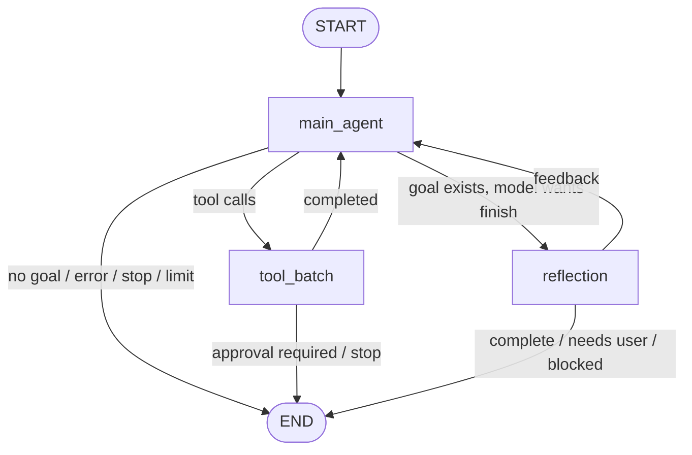
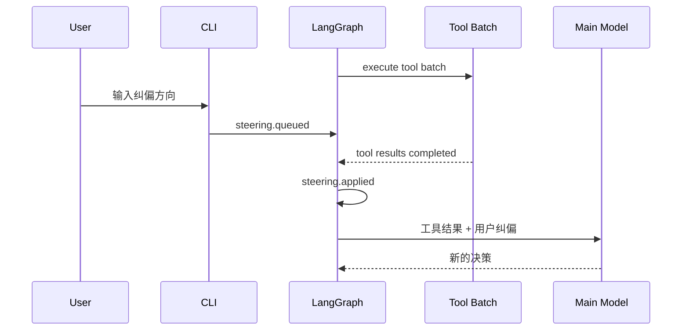
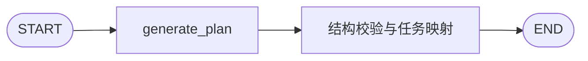
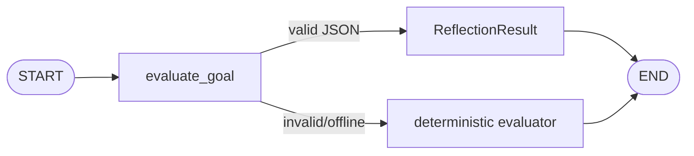

# InnoAgent 顶层设计

本文档描述 InnoAgent 当前必须遵循的架构。技术栈以 LangGraph 为核心，交互和能力方向参考 Codex CLI、Claude Code、pi 与 OpenCode。

参考资料：

- [LangGraph Graph API](https://docs.langchain.com/oss/python/langgraph/graph-api)
- [LangGraph Interrupts](https://docs.langchain.com/oss/python/langgraph/interrupts)
- [LangGraph Persistence](https://docs.langchain.com/oss/python/langgraph/persistence)
- [OpenAI Codex CLI](https://developers.openai.com/codex/cli/)
- [Claude Code](https://code.claude.com/docs/en/overview)

## 1. 设计目标

1. 使用 LangGraph 表达 Agent 节点、状态和动态路由，不在图外维护第二套执行循环。
2. 主 Agent、Plan 和 Reflection 职责分离，仍共享模型事件、工具、usage 与 session 基础设施。
3. 所有可见行为通过稳定事件输出，CLI 不直接读取节点内部临时变量。
4. 写操作、shell 和审批由 Runtime 强制执行，不能依靠提示词保证安全。
5. 支持执行中用户纠偏。默认等待下一批工具完成后注入，避免中断产生半完成副作用。
6. session、context、Skills、任务和权限均可恢复、可测试、可扩展。

## 2. LangGraph 设计原则

- 使用 `StateGraph` 定义共享 `AgentState`。
- 每个节点只完成一种职责：模型决策、工具批次、目标反思。
- 动态路由统一使用 `Command(update=..., goto=...)`，不与同节点静态边混用。
- 主图使用稳定 `session_id` 作为 LangGraph `thread_id`。
- 图在 super-step 边界 checkpoint；节点中的工具副作用必须具备明确的审批和重复调用保护。
- Planning 和 Reflection 使用独立子图，子图只返回结构化结果，不接管主 Agent。
- 跨进程恢复由 JSONL session 日志负责；LangGraph checkpointer 负责当前进程内的图状态和 super-step。

## 3. 代码结构

```text
core/
├── agent/
│   ├── graph.py               # 主 StateGraph、Command 路由、checkpointer
│   ├── react.py               # Runtime 服务、图节点实现、session/事件边界
│   ├── model_stream.py        # Responses API 事件归一化
│   ├── stages.py              # Planning / Reflection 子图
│   └── subagent.py            # 隔离的只读子 Agent
├── config/permissions.py      # 仓库级持久权限
├── event/events.py            # turn/item/approval/steering 事件
├── planning/                  # Plan、Task 和校验
├── reflection/                # Reflection schema 与确定性 fallback
├── session/                   # context、compression、JSONL store
├── skill/loader.py            # Skill 渐进式发现和加载
├── tool/                      # 工具、schema、guardrail、并行调度
└── prompts.py                 # system/plan/reflect/compact prompt
view/
├── cli.py                     # 异步 REPL、slash command、执行中纠偏
├── render.py                  # 结构化事件渲染
├── terminal.py                # TUI 生命周期、输入与线程安全 Buffer
├── tui_render.py              # 事件 presentation 与 context rail
└── tui_theme.py               # prompt_toolkit 主题与语义 lexer
```

`core/runtime/agent.py` 只保留兼容类名，不包含另一套运行逻辑。

## 4. 主 Agent 图



### main_agent 节点

1. 检查 stop 请求和 iteration 上限。
2. 组装 context，调用模型并消费流式事件。
3. 累计 token usage。
4. 多个 tool call 组成一个有序 batch。
5. immediate steering 在工具执行前的图边界注入。
6. 无工具调用时：
   - 没有 goal：结束。
   - 有 goal：进入 Reflection。
   - 有待处理 steering：先注入，再回到主 Agent。

### tool_batch 节点

1. 参数校验和 guardrail preflight。
2. 独立只读工具并行，写工具和 shell 串行。
3. 需要审批时保存 pending calls 并结束当前图运行。
4. 整批工具完成后应用默认 steering。
5. 工具结果写入消息、任务、计划、Skill 和 usage 状态。

### reflection 节点

调用 Reflection 子图，根据目标、任务、工具证据和错误决定：

- `complete`：目标完成。
- `feedback`：写回上下文，主 Agent 继续。
- `needs_user`：向用户提问并结束 turn。
- `blocked`：报告阻塞并结束 turn。

## 5. 执行中用户纠偏



纠偏模式：

- 默认文本或 `/steer <instruction>`：`after_tool`，等待下一批工具完整结束。
- `/steer now <instruction>`：在下一个 LangGraph 节点边界应用；不会强杀正在进行的网络请求或工具进程。
- `/stop`：在当前模型或工具返回后的安全边界停止。
- 如果后续没有工具，默认纠偏会在模型结束/Reflection 前兜底注入，不能静默丢失。

每次纠偏产生 `steering.queued` 和 `steering.applied` 事件，并写入 `steering_history`。

## 6. Planning 子图



入口是 `plan` 工具。Planning 子图只负责：

- 根据 goal、已有计划和 reflection feedback 生成 2-7 个可验证步骤。
- 校验空计划、未知依赖和依赖环。
- 修订时保留已完成步骤与结果。
- 将 PlanStep 映射成可显示的 Task。
- 模型输出无效时使用确定性 fallback，并附带 warning。

Planning 不执行文件或 shell 工具。生成的计划回到主图，由主 Agent 继续执行。

## 7. Reflection 子图



Reflection 输入：

```text
goal + final response + plan/tasks + tool results + errors
```

输出：

```json
{
  "complete": false,
  "confidence": 0.8,
  "summary": "",
  "feedback": "",
  "needs_user": false,
  "blocked": false,
  "missing_conditions": [],
  "evidence": []
}
```

Reflection 不直接调用工具，不伪造执行结果，也不替代主 Agent。

## 8. 状态与事件

`AgentState` 保存：

- session/turn/user input/messages
- goal、plan、tasks、reflection
- tool calls/results 和审批状态
- active Skills、context summary、usage
- steering history、iteration 和 finish reason

核心事件：

```text
turn.started
item.started
item.delta
item.completed
approval.requested
approval.resolved
steering.queued
steering.applied
steering.stop_requested
steering.stopped
context.compaction.started
context.compaction.completed
turn.completed
turn.failed
```

`item.delta` 只用于实时 UI，其他事件可持久化。JSONL 尾部的 `state.checkpoint` 是恢复缓存，不替代事件协议。

## 9. 权限与工具

模式：

- `ask`：写工具和 shell 每次询问，除非命中持久 allow。
- `auto`：工作区内自动执行，deny 和路径边界仍生效。
- `readonly`：阻止所有写能力。

审批：

- `allow_once`
- `allow_always`
- `deny`

`allow_always` 写入 `<repo>/.innoagent/permissions.json`。文件按 tool + 相对路径匹配，shell 按 argv 前缀匹配。

首期工具：

`read`、`write`、`ls`、`grep`、`shell`、`plan`、`task`、`skill`、`subagent`。

## 10. Context、Skills 与 Subagent

- Context 按预算注入 system prompt、Skill 索引、active Skills、plan/tasks、summary 和最近完整 turn。
- 压缩事件包含 before/after tokens 和 compression ratio。
- Skill 启动时只披露元数据，正文按需加载。
- Subagent 不共享父消息历史，默认只允许 `read`、`ls`、`grep`，禁止递归委派。
- 主模型、Planning、Reflection、Compaction 和 Subagent usage 统一累计。

## 11. CLI 与 TUI

TTY 使用单个常驻的 `prompt_toolkit.Application`，避免流式输出、工具事件和输入框争用 stdout。非 TTY 和测试仍可注入普通 input/output adapter。

全屏布局包含：

- 顶部运行状态与 workspace。
- 左侧可滚动 conversation，按用户、Agent、Thinking、Tool、Plan、Reflection、Approval 分类显示。
- 右侧 context rail，展示 session、model、mode、token、上下文比例、goal 和 tasks。
- 窄终端自动隐藏 context rail，优先保证 conversation 和输入区可用。
- 仅在需要权限时出现的审批操作区。
- 固定底部输入框；运行中自动切换为 steering 语义。

Runtime 线程只产生事件，TUI 使用线程安全队列在 UI render cycle 内批量更新 Buffer，不能让后台线程直接修改终端控件。

命令：

```text
/help /status /context /goal /plan /tasks /compact
/permissions /mode /model /tools /skills /skill
/approve /steer /new /resume /sessions /rename /clear /stop /quit
```

## 12. 验收

- 主循环必须由 LangGraph `StateGraph` 执行。
- Planning 和 Reflection 必须是独立可测试子图。
- 默认 steering 必须在工具 completed 事件之后、下一次模型调用之前生效。
- 审批、恢复、压缩和并行工具不能因图改造回归。
- `uv run python -m unittest discover -s test -v` 全部通过。
- `python3 -m compileall -q core view main.py test` 通过。
- README、plan 和真实代码结构一致。
